# Skill模块设计

## 1. 模块摘要

| 项目 | 内容 |
|---|---|
| 源码包 | [`src/harnessix/skills`](../../src/harnessix/skills/) |
| 当前职责 | 从宿主显式绑定的本地Root发现不可执行Skill；冻结来源、Manifest和目录摘要；按需重读正文与文本资源；记录无正文访问事件；把两项只读能力接入统一Trusted Action |
| 非职责 | 不执行Skill脚本，不采信Frontmatter权限声明，不安装或更新远端Skill，不实现Marketplace、签名发行、模型上下文优先级或默认产品自动装配 |
| 主要入口 | `SkillSource`、`SkillRegistry`、`SQLiteSkillStore`、`build_skill_action_definitions`、`SkillActionGateway` |
| 上游调用者 | 受信产品宿主或显式集成方；当前默认`agent-server`未装配Skill |
| 下游依赖 | `SecureWorkspaceReader`、PyYAML、SQLite、`SecretLeakGuard`、`TrustedActionRouter`与`ExtensionActionPort` |
| 公共Action | `skill.load`、`skill.read_resource`，均固定为`READ_ONLY`、`LOW`、`recovery=none` |
| 持久化 | 独立SQLite保存目录代次、目录JSON及访问事件Hash链；不保存正文、资源内容和绝对Root |
| 代码版本 | `e1aa95764da726d2c1e8f286e4400579ce3efae7` |
| 当前完成度 | 本地多来源发现、名称消歧、渐进加载、安全文件读取、摘要漂移拒绝、无正文账本和Action证明切片已实现；产品接线、完整审计、统一遥测、全量资源预算、远端供应链和发布门禁尚未完成 |

本文是`skills`包当前实现的现行事实源。长期取舍见
[ADR 0074](../adr/0074-skill-snapshot-and-hook-action-boundary.md)，参考项目证据见
[Skills、Hooks与供应链边界源码研究](../research/skills-hooks-and-supply-chain.md)，统一计划、审批和执行语义见
[Trusted Actions模块设计](trusted-actions.md)，文件系统对象安全见[Workspace模块设计](workspace.md)。

## 2. 需求背景

Coding Agent需要把领域规范、工作流说明、检查清单和项目约定按需提供给模型。若启动时把所有Skill正文
直接塞入上下文，既浪费Token，也扩大提示注入和Secret暴露面；若只按名称从可写目录即时读取，又无法证明
模型选择的Skill与执行时读取的文件是同一对象。多来源发现还会引入静默覆盖、名称劫持、路径逃逸、链接
替换、资源膨胀和供应链漂移。

当前模块采用以下核心判断：

> **Skill是不受信、只读、不可执行的内容包；目录用于选择，摘要用于绑定，正文和资源只能按需读取。**

这一判断把“内容扩展”和“执行扩展”分开：

1. Skill可以影响模型推理，因此必须按不可信输入处理；
2. Skill不能自行声明Tool、Hook、Shell、网络、Secret或Sandbox权限；
3. 真正的执行能力只能由宿主注册到Trusted Action；
4. 模型先看到有界元数据，再以目录摘要和Manifest摘要加载正文；
5. 读取时重新打开受约束Root并比较完整Manifest，拒绝目录捕获后的变化；
6. 持久层只保存身份和摘要，避免把正文、资源或Secret复制到长期状态。

## 3. 当前能力、显式装配能力与目标能力

| 层级 | 能力 | 当前结论 |
|---|---|---|
| 当前合同 | Source、Manifest、Issue、Conflict、Catalog、Load/Resource输入输出及Access Event共10类v1合同 | 已实现并提交JSON Schema |
| 当前发现 | `bundled/user/workspace`本地Root、广度优先扫描、确定排序、来源内重复失效、跨来源同名显式冲突 | 已实现 |
| 当前内容 | UTF-8 `SKILL.md`、安全YAML Frontmatter、按需正文、最多64个文本资源 | 已实现 |
| 当前文件边界 | POSIX目录描述符链或Windows句柄/Reparse检查，Root身份、普通文件、目录稳定性和链接约束 | 通过`SecureWorkspaceReader`复用 |
| 当前持久化 | 不可变目录代次、相同语义摘要复用、访问事件Hash链和损坏检测 | 已实现 |
| 当前Action | 两个低风险只读Definition和来源隔离Gateway | 已实现，需宿主显式装配 |
| 当前Secret边界 | 调用方提供精确字节值时，Action输出越界前执行`SecretLeakGuard` | 已实现但默认保护集合为空 |
| 当前模型集成 | 自动把目录元数据加入模型、按需触发Tool并规定消息优先级 | 未实现 |
| 当前产品装配 | 默认Profile配置Skill Root、启动发现、热更新、诊断和UI | 未实现 |
| 当前供应链 | 远端安装、签名、发布者身份、锁文件、原子升级和回滚 | 未实现 |
| 0.9目标 | 生命周期、遥测、资源总预算、审计一致性、三平台门禁和供应链信任收敛 | 规划，不是当前保证 |
| 1.0目标 | 默认产品装配、真实任务Dogfooding、发行签名、运维SLO和多用户隔离 | 尚未完成 |

表中“显式装配”表示库对象可以组合，不表示默认CLI、App Server或最终用户产品已经启用该能力。

## 4. 设计目标

1. 允许宿主显式组合最多32个本地Skill来源，同时保持跨平台路径语义确定；
2. 目录只携带选择所需元数据、版本、摘要、冲突和安全问题，不携带正文；
3. 同一内容和来源生成稳定摘要，重复发现仍保留新代次和捕获时间；
4. 普通名称只有在全目录唯一时可使用，任何冲突都不得静默覆盖；
5. 来源内部相同限定名称的全部候选失效，阻止目录顺序劫持；
6. 读取正文和资源时重新核对Root身份、Manifest摘要和文件系统对象类型；
7. 对文件、目录、深度、YAML结构、正文和资源设置明确上限；
8. 只把读取能力暴露为宿主绑定的低风险只读Trusted Action；
9. 访问账本只保存摘要化结果和安全错误码，不持久化内容；
10. 数据合同通过Pydantic和已提交JSON Schema双向固定；
11. 损坏的目录或事件链失败关闭，不返回未经验证的部分状态；
12. 明确记录当前实现与生产目标之间的差距，不把证明切片描述为完整产品。

## 5. 明确非目标

1. 不执行`SKILL.md`中的Shell、脚本、代码块、Hook或命令替换；
2. 不解释`allowed-tools`、`hooks`、`model`、`permissions`等字段为运行时能力；
3. 不自动从用户目录、Workspace父目录、插件目录或网络发现Root；
4. 不定义`bundled > user > workspace`之类覆盖优先级；
5. 不下载、安装、更新、缓存或卸载远端Skill；
6. 不验证发布者签名、透明日志、SBOM或许可证；
7. 不执行二进制资源，不把图片、归档、模型或任意MIME资源返回给模型；
8. 不把Skill正文自动写入Session、Context或Provider请求；
9. 不决定模型消息优先级、提示注入检测或内容可信度标签；
10. 不提供目录监听、热重载、Router Definition替换或注销；
11. 不在Skill Store中复制Execution Plan、审批、Action Audit或Session事件；
12. 不提供跨Skill Store、Plan Store和Audit Store的事务；
13. 不保证Hash链能抵抗具有数据库写权限且能重算摘要的攻击者；
14. 不实现分布式目录、租户配额、共享缓存或远端控制面；
15. 不承诺当前同步API具有异步取消、统一Timeout或事件循环隔离语义。

## 6. 约束、假设与关键术语

### 6.1 约束与假设

- Skill Root由受信宿主选择，Root内全部文件、目录名、YAML和正文均不可信；
- SQLite位于受信用户数据根，不应放在Workspace或暴露给不可信扩展；
- `bundled`、`user`、`workspace`当前只是来源标签，不自动产生权限或覆盖顺序；
- `SkillRegistry`和`SQLiteSkillStore`当前按单进程、同步调用使用；
- 调用方负责为`protected_secret_values`提供需要阻断的精确明文字节值；
- Content进入模型前，宿主仍需施加不可信内容提示边界和上下文优先级；
- Windows安全语义依赖Workspace Windows后端；POSIX和Windows的文件名比较规则不同；
- 系统时钟只用于捕获和事件时间，不进入语义目录摘要；
- 当前Package要求Python 3.12或更高，锁文件固定PyYAML 6.0.3；
- 所有v1合同均采用严格、冻结的`ExecutionContract`行为。

### 6.2 关键术语

| 术语 | 本文含义 |
|---|---|
| Skill Source | 宿主显式绑定的一个绝对本地Root及其稳定`source_id`和来源种类 |
| Manifest | 单个`SKILL.md`的身份、描述、版本、相对路径和摘要快照，不含正文 |
| Qualified Name | `<source_id>/<name>`；跨来源消歧和来源内唯一性依据 |
| Simple Name | Frontmatter中的`name`；仅在整个Catalog唯一时可直接解析 |
| Catalog | 一次发现保存的Sources、Manifests、Conflicts和Issues不可变集合 |
| Generation | 同一`catalog_id`每次成功发现递增的持久化代次 |
| Semantic Digest | 排除Generation和捕获时间后的目录SHA-256；相同内容可跨代次相等 |
| Progressive Load | 先公开Manifest元数据，选中后再读取正文，随后按显式路径读取资源 |
| Discovery Issue | 发现期间单个路径的安全或格式问题；只持久路径摘要和安全错误码 |
| Access Event | 正文或资源访问结果的Hash链事件；不保存实际内容 |
| Root Binding | 规范绝对Root路径和文件系统对象身份共同形成的摘要绑定 |
| Action Boundary | `ExtensionActionPort -> TrustedActionRouter -> _SkillExecutor`形成的唯一内容出口 |

## 7. 系统上下文与信任边界

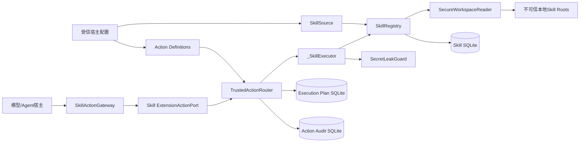
```mermaid
flowchart LR
    Model[模型/Agent宿主] --> Gateway[SkillActionGateway]
    Host[受信宿主配置] --> Source[SkillSource]
    Host --> Definitions[Action Definitions]
    Source --> Registry[SkillRegistry]
    Registry --> Reader[SecureWorkspaceReader]
    Reader --> Roots[不可信本地Skill Roots]
    Registry --> SkillDB[(Skill SQLite)]
    Definitions --> Router[TrustedActionRouter]
    Gateway --> Port[Skill ExtensionActionPort]
    Port --> Router
    Router --> Executor[_SkillExecutor]
    Executor --> Registry
    Executor --> Guard[SecretLeakGuard]
    Router --> PlanDB[(Execution Plan SQLite)]
    Router --> AuditDB[(Action Audit SQLite)]
```

### 7.1 图示说明

1. 宿主决定哪些Root进入Registry，并为每个Root指定稳定来源身份；
2. Registry通过安全Reader读取不可信文件，不向Skill暴露宿主对象或执行回调；
3. 目录和访问事实进入Skill独立数据库，正文与资源只存在于返回对象和调用栈；
4. Gateway只接受与当前Catalog摘要绑定的两个Trusted Action；
5. Router拥有Policy、Execution Plan和Action Audit，Skill模块不自行授予审批；
6. Executor在Registry返回后对结构化输出执行精确Secret阻断；
7. 三个数据库没有跨库事务，故各账本间只能通过外部身份间接关联；
8. 模型上下文装配不在当前模块内，不能从该图推断默认产品已使用Skill。

### 7.2 信任分区

| 区域 | 可信度 | 可做事项 | 禁止事项 |
|---|---|---|---|
| 宿主装配 | 受信控制面 | 选择Root、目录ID、Secret值、Router和Workspace | 不应把不可信路径直接视为授权 |
| Skill Root | 不可信数据面 | 提供候选Manifest与资源 | 不得授予Tool、Shell、网络或Secret权限 |
| Registry/Reader | 执行TCB | 规范化、限制、摘要、重核对象身份 | 不执行内容，不跟随链接 |
| Skill Store | 受信持久状态 | 保存目录与摘要事件 | 不保存正文、资源和绝对Root |
| Trusted Action | 受信路由边界 | 规划、Policy、执行、审计 | 不从Skill元数据推导风险 |
| 模型上下文 | 当前由外部宿主持有 | 选择如何呈现低信任内容 | 不得把Skill文本提升为系统指令 |

## 8. 包结构、依赖方向与阅读顺序

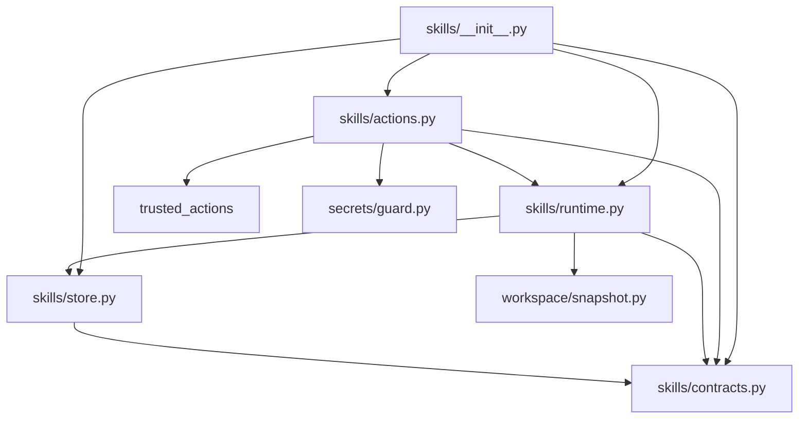
```mermaid
flowchart TD
    Init[skills/__init__.py] --> Actions[skills/actions.py]
    Init --> Runtime[skills/runtime.py]
    Init --> Store[skills/store.py]
    Init --> Contracts[skills/contracts.py]
    Actions --> Runtime
    Actions --> Contracts
    Actions --> Trusted[trusted_actions]
    Actions --> Guard[secrets/guard.py]
    Runtime --> Contracts
    Runtime --> Store
    Runtime --> Reader[workspace/snapshot.py]
    Store --> Contracts
```

依赖只从装配层流向合同和基础设施。`contracts.py`不依赖Runtime或Store；Store不读取文件系统；Reader
不知道Skill语义；`actions.py`不绕过Registry直接打开文件。当前`__init__.py`只汇总公共API，不承载默认装配。

| 顺序 | 文件/目录链接 | 关键符号 | 阅读目的 |
|---:|---|---|---|
| 1 | [`skills/contracts.py`](../../src/harnessix/skills/contracts.py) | `Skill*Snapshot`、`Skill*Input`、`Skill*Content`、`SkillAccessEvent` | 先掌握不变量、上限和摘要边界 |
| 2 | [`skills/runtime.py`](../../src/harnessix/skills/runtime.py) | `SkillSource`、`SkillRegistry` | 理解发现、解析、消歧、重读和资源边界 |
| 3 | [`workspace/snapshot.py`](../../src/harnessix/workspace/snapshot.py) | `SecureWorkspaceReader` | 理解路径、句柄链和目录双观察保证 |
| 4 | [`skills/store.py`](../../src/harnessix/skills/store.py) | `SQLiteSkillStore` | 理解代次、事务、Hash链和损坏检测 |
| 5 | [`skills/actions.py`](../../src/harnessix/skills/actions.py) | `build_skill_action_definitions`、`SkillActionGateway` | 理解统一Action出口和Secret Guard |
| 6 | [`skills/__init__.py`](../../src/harnessix/skills/__init__.py) | `__all__` | 确认受支持的公共入口 |
| 7 | [`tests/skills/test_runtime.py`](../../tests/skills/test_runtime.py) | 13个行为测试 | 从正常、冲突、漂移、路径和Action场景反证设计 |
| 8 | [`tests/skills/test_schemas.py`](../../tests/skills/test_schemas.py) | `test_committed_skill_schemas_match_runtime_contracts` | 确认10份提交Schema与运行时合同一致 |

## 9. 公共API与装配边界

### 9.1 公共导出

`skills.__all__`导出两项Tool常量、Store、十类合同、Registry、Source、Gateway和Definition构造器。
`_ParsedSkill`与`_SkillExecutor`保持私有，调用方不得依赖其结构。

| API | 稳定用途 | 当前约束 |
|---|---|---|
| `SkillSource(...)` | 创建已检查的来源Root | Root必须绝对、存在、为普通目录且不是Symlink/Junction |
| `SkillRegistry(...)` | 绑定Catalog身份、1～32个唯一Source和Store | 同步对象；发现仅在实例内加`RLock` |
| `discover()` | 捕获并持久化一个新Catalog代次 | 每次成功都递增Generation |
| `catalog(digest=...)` | 读取最新或指定语义摘要的最新代次 | 指定摘要时取最高Generation |
| `resolve(...)` | 按名称和期望Manifest摘要解析 | 普通名称冲突失败 |
| `load(...)` | 重核并返回正文与资源清单 | 目录和Manifest必须仍然匹配 |
| `read_resource(...)` | 重核后读取一个UTF-8文本资源 | 路径必须在本次重新生成的资源清单中 |
| `SQLiteSkillStore(...)` | 保存目录和访问事件 | 同步SQLite，无显式迁移框架 |
| `build_skill_action_definitions(...)` | 为一个冻结Catalog生成两个可信Definition | Catalog变化必须重新构建并注册 |
| `SkillActionGateway(...)` | 从来源隔离Port计划和执行读取 | 构造时要求两项匹配Binding恰好各一条 |

### 9.2 当前没有默认装配

对`src/harnessix`中`skills`包之外的生产代码进行静态反查，没有默认产品模块实例化上述API。因此：

- 安装Harnessix后不会自动扫描任何Skill目录；
- Product Config当前没有Skill Root或热更新字段；
- App Server、CLI和Agent Runtime当前不会自动向模型呈现Skill；
- 只有显式创建Store、Registry、Definitions、Router Port和Gateway的宿主才启用该能力；
- 单元测试中的完整Action链是可组合性证明，不是默认产品行为证明。

## 10. Skill来源与Root身份

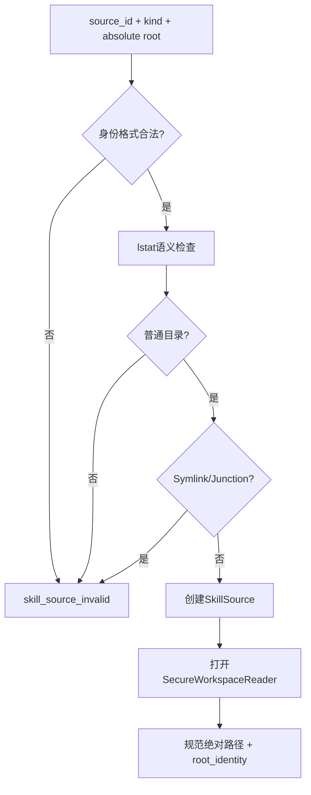
```mermaid
flowchart TD
    Input[source_id + kind + absolute root] --> Id{身份格式合法?}
    Id -- 否 --> Invalid[skill_source_invalid]
    Id -- 是 --> Stat[lstat语义检查]
    Stat --> Dir{普通目录?}
    Dir -- 否 --> Invalid
    Dir -- 是 --> Link{Symlink/Junction?}
    Link -- 是 --> Invalid
    Link -- 否 --> Source[创建SkillSource]
    Source --> Reader[打开SecureWorkspaceReader]
    Reader --> RootDigest[规范绝对路径 + root_identity]
```

### 10.1 `SkillSource`字段

| 字段 | 类型 | 来源 | 约束 | 持久化方式 | 敏感级别 |
|---|---|---|---|---|---|
| `source_id` | `str` | 宿主 | `^[a-z][a-z0-9_.-]{0,63}$`，全Registry唯一 | 明文身份 | 低 |
| `kind` | Literal | 宿主 | `bundled/user/workspace`之一 | 明文标签 | 低 |
| `root` | `Path` | 宿主 | 绝对普通目录；拒绝Symlink/Junction | 不持久化原值 | 高：可能暴露本机拓扑 |

构造阶段的`Path.stat(follow_symlinks=False)`用于快速拒绝明显非法Root；真正读取仍通过
`SecureWorkspaceReader`建立平台原生Root能力。发现时的`root_sha256`由规范绝对路径字符串与
`root_identity`共同计算。读取正文或资源时会重新创建Reader并比较该摘要，从而拒绝Root对象替换。

### 10.2 来源种类不是优先级

`kind`进入Source和Manifest摘要，但当前解析不按种类排序或覆盖。来源遍历只按`source_id`排序；同名普通
Skill形成冲突，调用方必须使用限定名称。此行为避免可写Workspace Skill静默覆盖Bundled Skill。

## 11. 目录发现算法

### 11.1 正常数据流

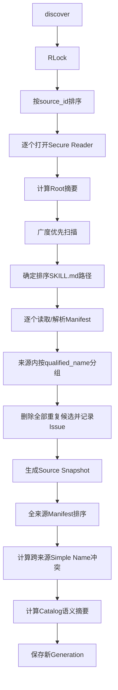
```mermaid
flowchart TD
    D[discover] --> Lock[RLock]
    Lock --> Sort[按source_id排序]
    Sort --> Open[逐个打开Secure Reader]
    Open --> Root[计算Root摘要]
    Root --> BFS[广度优先扫描]
    BFS --> Paths[确定排序SKILL.md路径]
    Paths --> Parse[逐个读取/解析Manifest]
    Parse --> LocalDup[来源内按qualified_name分组]
    LocalDup --> Valid[删除全部重复候选并记录Issue]
    Valid --> SourceSnapshot[生成Source Snapshot]
    SourceSnapshot --> Global[全来源Manifest排序]
    Global --> Conflict[计算跨来源Simple Name冲突]
    Conflict --> Digest[计算Catalog语义摘要]
    Digest --> Save[保存新Generation]
```

### 11.2 发现步骤

1. `discover()`取得实例级`threading.RLock`；
2. 按`source_id`确定性排序来源；
3. 为每个来源打开`SecureWorkspaceReader`并计算Root摘要；
4. `_manifest_paths()`从`.`开始广度优先遍历；
5. 每个目录由Reader前后两次观察，若身份、内容、大小或条目变化则失败；
6. 敏感路径、Symlink、特殊文件和超过深度的目录转为摘要化Issue；
7. `SKILL.md`候选按平台文件名规则匹配并确定排序；
8. 单个Manifest格式错误不会终止整个来源，而是转为Issue；
9. 同一来源中相同`qualified_name`的所有Manifest被剔除；
10. 来源摘要绑定Root、有效Manifest摘要和排序Issue；
11. 全局检查Skill数量，计算普通名称冲突；
12. Store分配下一代次，Catalog摘要排除代次和时间后持久化。

### 11.3 发现预算

| 预算 | 当前值 | 计数范围 | 超限行为 |
|---|---:|---|---|
| Registry来源 | 32 | 一个Registry | `skill_source_invalid` |
| 遍历深度 | 6 | 每个来源 | 目录不再进入队列并记录`skill_discovery_depth` |
| 目录总数 | 2,048 | 每个来源的Manifest扫描 | `skill_catalog_limit`终止发现 |
| 条目总数 | 8,192 | 每个来源的Manifest扫描 | `skill_catalog_limit`终止发现 |
| 单目录条目 | 8,192 | 每次Reader列目录 | 映射为`skill_catalog_limit` |
| 候选Manifest | 2,048 | 每个来源扫描 | `skill_catalog_limit` |
| 全Catalog有效Skill | 2,048 | 全来源合计 | `skill_catalog_limit` |
| Source Snapshot | 32 | 合同 | Pydantic拒绝 |
| Conflict | 512 | 合同 | Pydantic拒绝 |
| Issue | 2,048 | 合同 | Pydantic拒绝 |

当前实现没有在构造`SkillCatalogSnapshot`前显式检查Conflict和Issue数量。超过合同上限时可能泄漏原生
Pydantic `ValidationError`，而不是规范化`KernelError`。这属于P1错误语义缺口。

### 11.4 平台文件名规则

- POSIX仅精确匹配`SKILL.md`；
- Windows用`casefold()`匹配`skill.md`；
- 最终相对路径合同仍要求最后一个段精确为`SKILL.md`；Windows大小写候选是否能稳定通过合同依赖Reader
  返回的实际名称，因此需要专门平台回归；
- 目录排序在POSIX按原字符串，在Windows按`casefold()`；
- `root_sha256`中的路径在Windows同样使用`casefold()`。

## 12. Frontmatter与正文解析

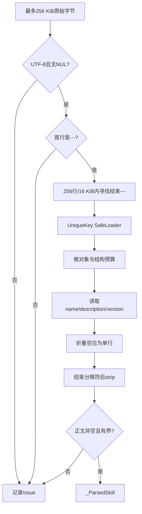
```mermaid
flowchart TD
    Raw[最多256 KiB原始字节] --> UTF8{UTF-8且无NUL?}
    UTF8 -- 否 --> Reject[记录Issue]
    UTF8 -- 是 --> Start{首行是---?}
    Start -- 否 --> Reject
    Start -- 是 --> Close[256行/16 KiB内寻找结束---]
    Close --> YAML[UniqueKey SafeLoader]
    YAML --> Shape[根对象与结构预算]
    Shape --> Fields[读取name/description/version]
    Fields --> Normalize[折叠空白为单行]
    Normalize --> Body[结束分隔符后strip]
    Body --> NonEmpty{正文非空且有界?}
    NonEmpty -- 否 --> Reject
    NonEmpty -- 是 --> Parsed[_ParsedSkill]
```

### 12.1 解析约束

| 项目 | 规则 | 错误码 |
|---|---|---|
| 原始文件 | Reader最多读取256 KiB | `skill_content_limit` |
| 编码 | 有效UTF-8、不得包含NUL | `skill_invalid_utf8`或`skill_manifest_invalid` |
| 起始分隔符 | 第一行去空白后必须为`---` | `skill_frontmatter_missing` |
| 结束分隔符 | 起始后256行内出现，内容不超过16 KiB | `skill_frontmatter_invalid/limit` |
| YAML加载器 | `yaml.SafeLoader`派生；重复Key和不可哈希Key失败 | `skill_frontmatter_invalid` |
| 根对象 | 必须为Mapping，最多64个根Key | `skill_frontmatter_invalid` |
| 展开节点 | 最多512个节点，最大深度16 | `skill_frontmatter_limit` |
| 数组 | 每个数组最多256项 | `skill_frontmatter_limit` |
| Key | 必须是最长128字符字符串 | `skill_frontmatter_invalid` |
| Scalar | 只允许`str/int/float/bool/null` | `skill_frontmatter_invalid` |
| `name` | 字符串；缺省时取Manifest父目录最后一段 | `skill_manifest_invalid` |
| `description` | 必填字符串 | `skill_manifest_invalid` |
| `version` | 缺省、字符串或整数 | `skill_manifest_invalid` |
| 正文 | Frontmatter后拼接并`strip()`；非空且UTF-8字节不超过256 KiB | `skill_content_empty/limit` |

### 12.2 重复Key与YAML别名

`_UniqueKeySafeLoader`覆盖Mapping构造逻辑，在展开前拒绝重复Key，避免攻击者通过后写值覆盖审核时看到的
`name`或`description`。SafeLoader阻止任意Python对象构造；`_validate_yaml_shape()`再对别名展开后的对象树
计数，避免较小YAML形成超大内存对象。当前预算在`yaml.load()`完成后检查，解析器本身仍需先构造对象；
16 KiB原始Frontmatter上限是前置防线，但不是流式YAML解析器。

### 12.3 未解释字段

只有`name`、`description`和`version`进入Manifest语义。`allowed-tools`、`hooks`、`scripts`、`shell`以及
任何未知字段均不会注册能力或执行；但这些字段仍属于原始`SKILL.md`字节，因此会改变`content_sha256`、
`effective_version`和`manifest_sha256`。

### 12.4 当前边缘行为

Python中`bool`是`int`的子类，当前`isinstance(raw_version, str | int)`会接受YAML布尔值，并将其规范为
字符串`"True"`或`"False"`。隔离探针已复现该行为。合同最终得到合法字符串，但这可能掩盖作者把
`true/false`误写为版本号的问题；应在后续实现中用`type(raw_version) is int`或等价严格判断收敛。

## 13. Manifest快照设计

### 13.1 数据结构

| 字段 | 类型/上限 | 来源 | 语义 | 摘要/隐私 |
|---|---|---|---|---|
| `spec_version` | 固定v1 | 合同 | 线格式版本 | 进入Manifest摘要 |
| `source_id` | 1～64字符 | Source | 稳定来源身份 | 公开 |
| `source_kind` | 三值Literal | Source | 来源分类，不是权限 | 公开 |
| `name` | 1～64字符 | Frontmatter或父目录 | 简单名称 | 公开 |
| `qualified_name` | `<source>/<name>` | 派生 | 无歧义身份 | 公开 |
| `description` | 1～1,024字符 | Frontmatter | 模型选择摘要 | 不可信公开文本 |
| `declared_version` | 0～128字符 | Frontmatter | 作者声明版本 | 不具备供应链真实性 |
| `effective_version` | 1～128字符 | 派生 | 声明版本或内容摘要前16位 | 展示和Binding版本片段 |
| `relative_path` | 8～4,096字符 | 发现 | Source内规范路径 | 可能暴露包结构 |
| `content_utf8_bytes` | 1～262,144 | 原始文件 | 完整文档字节数 | 容量元数据 |
| `content_sha256` | SHA-256 | 原始文件 | 完整`SKILL.md`字节摘要 | 不是正文摘要 |
| `metadata_sha256` | SHA-256 | 派生 | `name/description/version`规范摘要 | 漂移定位 |
| `manifest_sha256` | SHA-256 | 派生 | 除自身外完整Manifest摘要 | 调用绑定 |

### 13.2 摘要层次

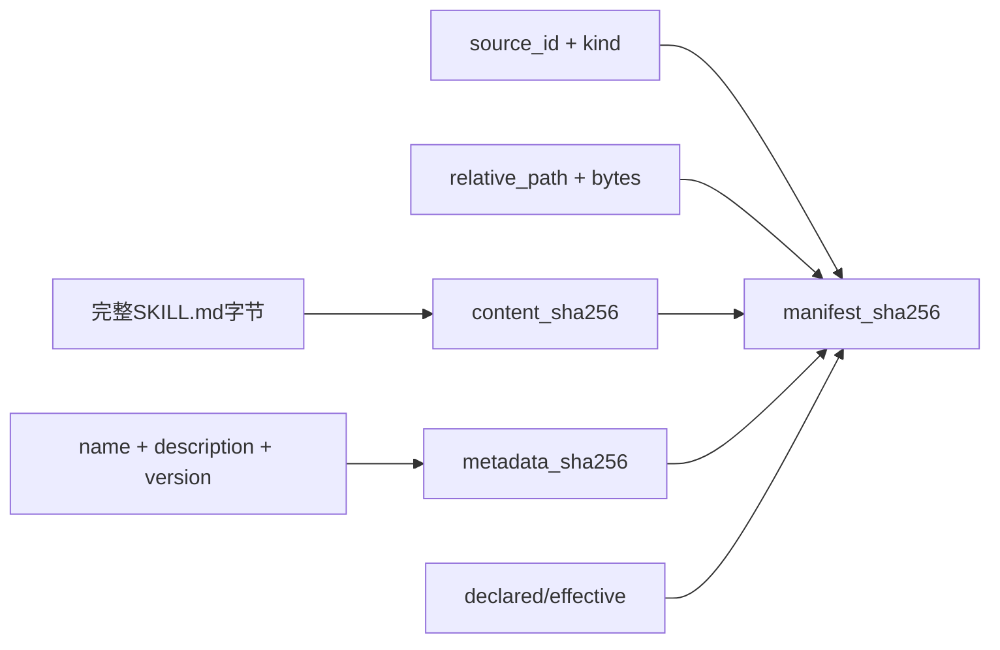
```mermaid
flowchart LR
    Raw[完整SKILL.md字节] --> Content[content_sha256]
    Meta[name + description + version] --> Metadata[metadata_sha256]
    Source[source_id + kind] --> Manifest
    Path[relative_path + bytes] --> Manifest
    Content --> Manifest[manifest_sha256]
    Metadata --> Manifest
    Version[declared/effective] --> Manifest
```

`content_sha256`绑定Frontmatter、分隔符和正文的完整原始字节；`SkillContent.content_sha256`则绑定去除
Frontmatter且执行`strip()`后的正文字符串。两者名称相同但对象层级不同，排障时必须区分。

### 13.3 有效版本

```text
effective_version = declared_version
                    if declared_version is not None
                    else "sha256:" + content_sha256[0:16]
```

声明版本不会取代内容摘要。即使作者没有更新版本，只要文档字节变化，Manifest和Catalog摘要都会变化；
但展示层若只显示`effective_version`，有声明版本时可能看不到内容已变，故安全绑定必须始终使用
`manifest_sha256`或`catalog_sha256`。

## 14. 来源快照、冲突与Issue

### 14.1 Source Snapshot

| 字段 | 语义 |
|---|---|
| `source_id/kind` | 来源身份和分类 |
| `root_sha256` | 规范绝对路径与当前原生Root身份摘要 |
| `source_revision` | Root摘要、有效Manifest摘要序列与Issue序列的摘要 |
| `skill_count` | 来源中最终有效Skill数量，0～2,048 |
| `source_sha256` | 除自身外完整Source Snapshot摘要 |

绝对Root不会进入持久JSON明文，但`root_sha256`仍是对低熵路径和文件系统身份的确定性摘要；具有候选路径
字典的主体可能离线猜测，因此它不应公开到不可信租户。

### 14.2 来源内重复

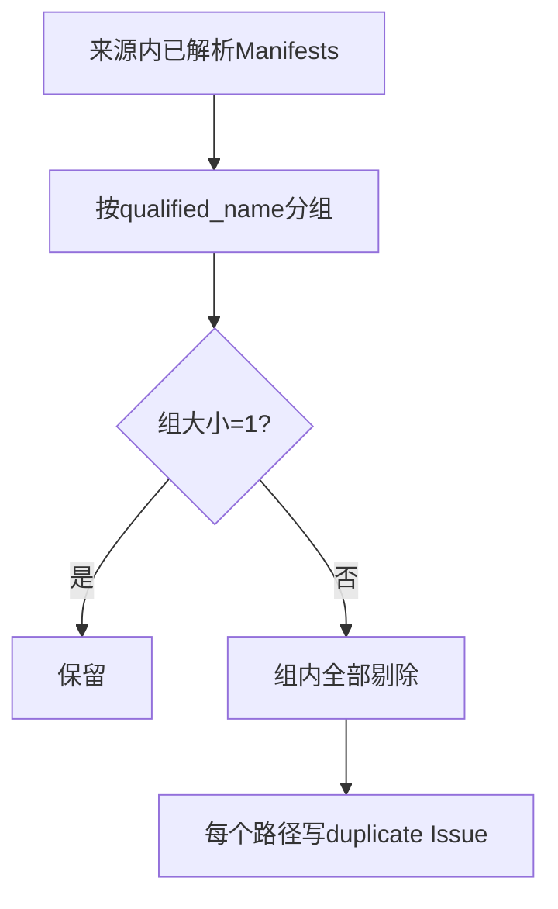
```mermaid
flowchart TD
    Parsed[来源内已解析Manifests] --> Group[按qualified_name分组]
    Group --> One{组大小=1?}
    One -- 是 --> Keep[保留]
    One -- 否 --> Drop[组内全部剔除]
    Drop --> Issue[每个路径写duplicate Issue]
```

来源内两个目录声明相同`name`时，它们共享同一`source_id/name`。实现不会保留第一个或最后一个，而是让
全部候选失效。这样目录遍历顺序、文件名大小写和新文件注入都不能决定静默胜者。

### 14.3 跨来源冲突

跨来源同名Skill仍全部保留在Catalog，以`source/name`可精确访问；`SkillNameConflict`维护排序且唯一的
限定名称列表。`resolve()`收到普通名称且命中多项时返回`skill_name_conflict`。

### 14.4 Discovery Issue

Issue只保存`source_id`、`skill_*`错误码和规范相对路径摘要，不保存原路径或错误消息。它兼顾诊断类别与
最小披露，但当前没有受控诊断API把摘要映射回管理员可见路径，最终用户可能难以定位坏文件。

## 15. Catalog快照与代次语义

### 15.1 Catalog字段

| 字段 | 上限/规则 | 是否进入语义摘要 | 说明 |
|---|---|---:|---|
| `catalog_id` | 1～64字符稳定身份 | 是 | Registry实例和Store分区键 |
| `generation` | 从1递增 | 否 | 每次成功发现的持久顺序 |
| `captured_at` | 带时区时间 | 否 | 观测时间，不影响语义相等 |
| `sources` | 最多32，按ID排序且唯一 | 是 | Root和来源修订 |
| `skills` | 最多2,048，按限定名称排序且唯一 | 是 | 有效Manifest集合 |
| `conflicts` | 最多512，按名称排序 | 是 | 必须可由Skills精确重算 |
| `issues` | 最多2,048，按来源/路径摘要/码排序 | 是 | 发现问题摘要 |
| `catalog_sha256` | SHA-256 | 自身排除 | 全部语义字段的规范摘要 |

### 15.2 相同摘要、不同代次

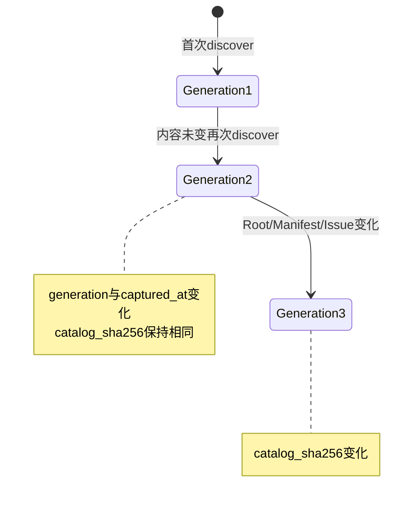
```mermaid
stateDiagram-v2
    [*] --> Generation1: 首次discover
    Generation1 --> Generation2: 内容未变再次discover
    note right of Generation2
      generation与captured_at变化
      catalog_sha256保持相同
    end note
    Generation2 --> Generation3: Root/Manifest/Issue变化
    note right of Generation3
      catalog_sha256变化
    end note
```

Store按`(catalog_id, generation)`保存每次捕获。`load_catalog(digest=...)`在同一摘要存在多个代次时返回
最高Generation。Action Definition的`tool_version`包含Generation，因此即使语义摘要相同，重复发现后
构建的Definition也具有新版本；Fingerprint只绑定操作和Catalog摘要，保持语义稳定。

## 16. 正文渐进加载流程

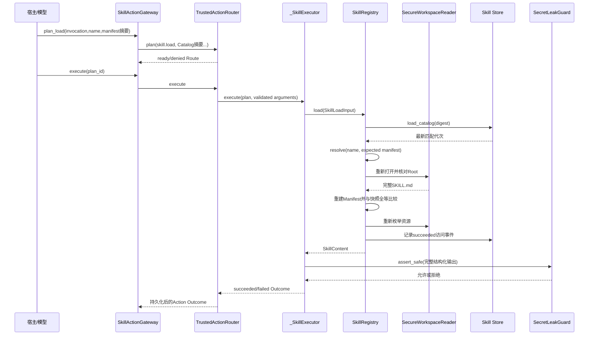
```mermaid
sequenceDiagram
    participant H as 宿主/模型
    participant G as SkillActionGateway
    participant R as TrustedActionRouter
    participant E as _SkillExecutor
    participant S as SkillRegistry
    participant F as SecureWorkspaceReader
    participant DB as Skill Store
    participant X as SecretLeakGuard

    H->>G: plan_load(invocation,name,manifest摘要)
    G->>R: plan(skill.load, Catalog摘要...)
    R-->>G: ready/denied Route
    H->>G: execute(plan_id)
    G->>R: execute
    R->>E: execute(plan, validated arguments)
    E->>S: load(SkillLoadInput)
    S->>DB: load_catalog(digest)
    DB-->>S: 最新匹配代次
    S->>S: resolve(name, expected manifest)
    S->>F: 重新打开并核对Root
    F-->>S: 完整SKILL.md
    S->>S: 重建Manifest并与快照全等比较
    S->>F: 重新枚举资源
    S->>DB: 记录succeeded访问事件
    S-->>E: SkillContent
    E->>X: assert_safe(完整结构化输出)
    X-->>E: 允许或拒绝
    E-->>R: succeeded/failed Outcome
    R-->>G: 持久化后的Action Outcome
```

### 16.1 Registry内部步骤

1. 对输入合同做JSON往返校验；
2. 按`catalog_sha256`从Store加载最新匹配代次；
3. 用名称和`expected_manifest_sha256`解析唯一Manifest；
4. 重建Source Reader并比较Root摘要；
5. 重读完整Manifest并要求当前对象与捕获对象全等；
6. 重新枚举当前可读资源列表；
7. 返回仅含正文、正文摘要和资源路径的`SkillContent`；
8. 在返回前把去除正文的结果摘要写入访问事件。

### 16.2 TOCTOU边界

Manifest在一次Reader生命周期中读取，资源目录也通过目录双观察检查。完整Manifest全等比较可检测内容、
元数据、路径和来源变化。读取完成后文件仍可能被修改，但返回的是已经复制到内存的不可变字符串；下一次
访问会重新校验。Catalog本身不会因一次漂移自动生成新代次，调用方需显式重新`discover()`。

## 17. 资源发现与读取

### 17.1 资源清单生成

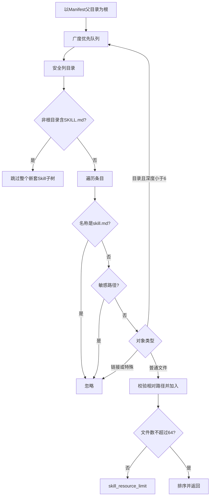
```mermaid
flowchart TD
    Start[以Manifest父目录为根] --> Queue[广度优先队列]
    Queue --> List[安全列目录]
    List --> Nested{非根目录含SKILL.md?}
    Nested -- 是 --> SkipTree[跳过整个嵌套Skill子树]
    Nested -- 否 --> Each[遍历条目]
    Each --> Manifest{名称是skill.md?}
    Manifest -- 是 --> Ignore[忽略]
    Manifest -- 否 --> Sensitive{敏感路径?}
    Sensitive -- 是 --> Ignore
    Sensitive -- 否 --> Kind{对象类型}
    Kind -- 目录且深度小于6 --> Queue
    Kind -- 普通文件 --> Add[校验相对路径并加入]
    Kind -- 链接或特殊 --> Ignore
    Add --> Count{文件数不超过64?}
    Count -- 否 --> Limit[skill_resource_limit]
    Count -- 是 --> Sort[排序并返回]
```

资源路径相对于包含Manifest的目录，而不是相对于Source Root。嵌套目录一旦自身包含`SKILL.md`，该子树
属于另一个Skill，不会成为父Skill资源。资源清单只包含普通文件；Symlink和特殊对象不会出现在列表中。

### 17.2 资源读取时序

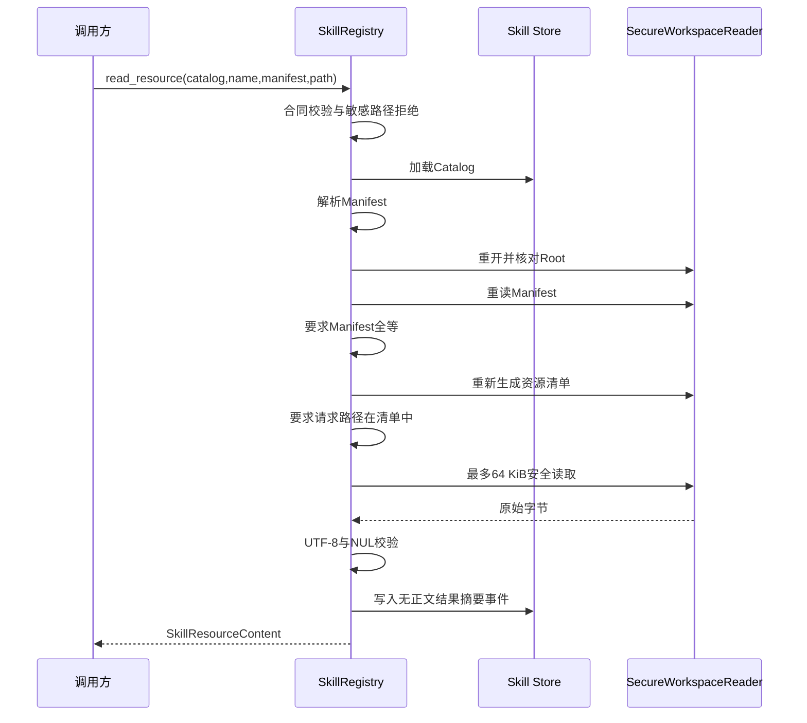
```mermaid
sequenceDiagram
    participant C as 调用方
    participant S as SkillRegistry
    participant DB as Skill Store
    participant F as SecureWorkspaceReader

    C->>S: read_resource(catalog,name,manifest,path)
    S->>S: 合同校验与敏感路径拒绝
    S->>DB: 加载Catalog
    S->>S: 解析Manifest
    S->>F: 重开并核对Root
    S->>F: 重读Manifest
    S->>S: 要求Manifest全等
    S->>F: 重新生成资源清单
    S->>S: 要求请求路径在清单中
    S->>F: 最多64 KiB安全读取
    F-->>S: 原始字节
    S->>S: UTF-8与NUL校验
    S->>DB: 写入无正文结果摘要事件
    S-->>C: SkillResourceContent
```

### 17.3 路径与内容规则

| 规则 | 结果 |
|---|---|
| 非空、非绝对路径，不含反斜杠、NUL、空段、`.`或`..` | 合同与Runtime双层检查 |
| 任一段命中敏感名称、`.env.*`或敏感后缀 | 不列出；显式读取返回`skill_resource_path_denied` |
| 请求路径不在本次重新枚举的资源列表 | `skill_resource_not_found` |
| 对象不是普通文件或Reader拒绝链接 | `skill_path_denied` |
| 超过64 KiB | `skill_resource_limit` |
| 非UTF-8或包含NUL | `skill_resource_invalid_utf8` |
| 空文件 | 当前允许，返回空字符串及其SHA-256 |

### 17.4 敏感路径集合

路径按段、大小写不敏感地检查。当前精确名称包括`.env`、`.git`、`.ssh`、`.aws`、`.gnupg`、
`id_rsa`、`id_dsa`、`id_ecdsa`、`id_ed25519`；还拒绝`.env.*`及`.pem/.key/.p12/.pfx`后缀。

这是启发式最小拒绝集，不是通用Secret分类器。`credentials.json`、自定义Token文件、编码后的Secret或正文中
出现的Secret仍需由上层Secret Guard和产品策略处理。

### 17.5 当前资源遍历预算缺口

`_resources()`限制深度、单目录条目和最终普通文件数，但没有像`_manifest_paths()`那样维护累计目录数和
累计条目数。攻击者可构造深度不超过6、每层大量纯目录、普通文件很少的树，使遍历在触发64文件限制前
访问大量目录。超过深度的目录也会被静默忽略，不形成Issue或Access Event。该问题属于P0资源耗尽风险，
需在生产默认装配前增加总目录、总条目、总时间或可取消预算，并补充宽树回归。

## 18. 安全文件系统Reader

Skill不自行用`Path.read_text()`或递归Glob，而是复用
[`SecureWorkspaceReader`](../../src/harnessix/workspace/snapshot.py)。

### 18.1 Reader保证

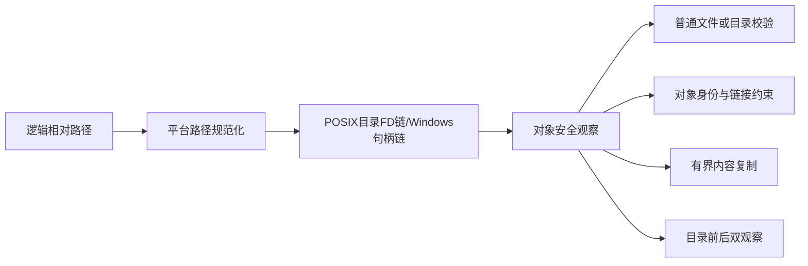
```mermaid
flowchart LR
    Relative[逻辑相对路径] --> Normalize[平台路径规范化]
    Normalize --> Native[POSIX目录FD链/Windows句柄链]
    Native --> Observe[对象安全观察]
    Observe --> Kind[普通文件或目录校验]
    Observe --> Identity[对象身份与链接约束]
    Observe --> Bytes[有界内容复制]
    Observe --> BeforeAfter[目录前后双观察]
```

1. 逻辑路径必须由Workspace路径规则规范化；
2. POSIX实现沿目录描述符链打开对象，Windows实现使用句柄和Reparse Point检查；
3. `read_file()`只接受普通文件，并同时检查观察大小和实际内容长度；
4. `list_directory()`在返回前后观察同一目录，身份、内容、大小或条目变化即失败；
5. Reader保存Root路径和`root_identity`，Skill再把两者绑定为Root摘要；
6. Reader关闭原生Root句柄，不向Skill正文暴露句柄或绝对路径。

### 18.2 链接语义

- Source Root是Symlink或Windows Junction时在`SkillSource`构造阶段拒绝；
- 扫描发现的Symlink和特殊对象不会被读取；
- POSIX硬链接可能被目录枚举识别为普通文件，因此会出现在资源列表，但实际读取由原生观察层因链接数
  约束而拒绝；
- 当前硬链接测试只在POSIX执行，Windows Reparse、硬链接和大小写碰撞需要独立固定平台证据；
- `SkillRegistry`把Reader的`workspace_changed`和`workspace_observation_failed`统一映射为
  `skill_source_changed`。

### 18.3 错误映射

| Reader错误 | Skill错误 | 语义 |
|---|---|---|
| `workspace_changed`、`workspace_observation_failed` | `skill_source_changed` | 读取期间对象或目录不稳定 |
| `workspace_snapshot_limit` | 调用点指定的`skill_catalog_limit/content_limit/resource_limit` | 预算耗尽 |
| `workspace_path_denied`、`workspace_wrong_file_type` | `skill_path_denied` | 非普通对象或路径被拒绝 |
| `workspace_parent_missing`、`workspace_binding_invalid` | `skill_source_unavailable` | Root或父链不可用 |
| 其他Reader `KernelError` | `skill_read_failed` | 安全、稳定且不泄漏底层细节的兜底码 |

## 19. SQLite持久化模型

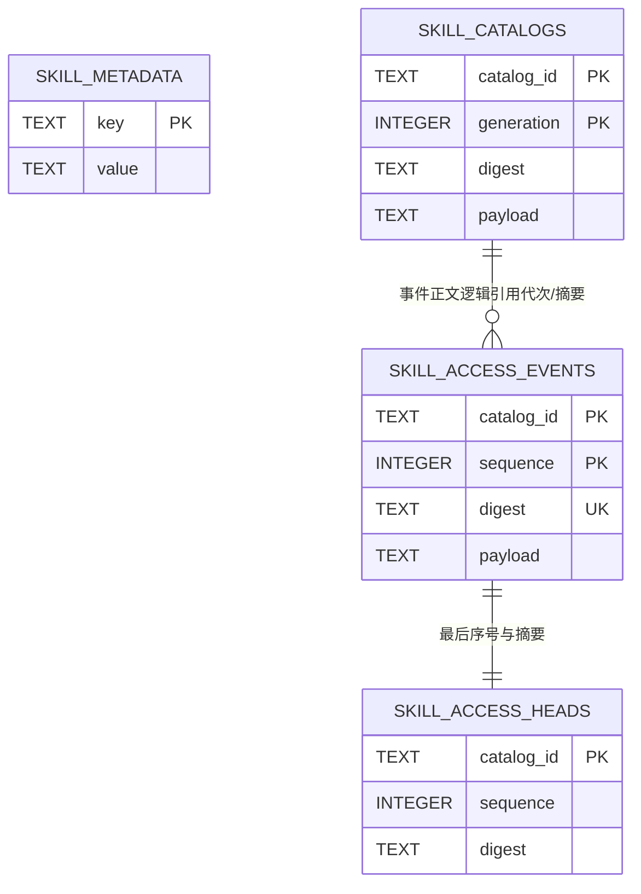
```mermaid
erDiagram
    SKILL_METADATA {
        TEXT key PK
        TEXT value
    }
    SKILL_CATALOGS {
        TEXT catalog_id PK
        INTEGER generation PK
        TEXT digest
        TEXT payload
    }
    SKILL_ACCESS_EVENTS {
        TEXT catalog_id PK
        INTEGER sequence PK
        TEXT digest UK
        TEXT payload
    }
    SKILL_ACCESS_HEADS {
        TEXT catalog_id PK
        INTEGER sequence
        TEXT digest
    }
    SKILL_CATALOGS ||--o{ SKILL_ACCESS_EVENTS : "事件正文逻辑引用代次/摘要"
    SKILL_ACCESS_EVENTS ||--|| SKILL_ACCESS_HEADS : "最后序号与摘要"
```

### 19.1 表职责

| 表 | 主键 | 内容 | 不保存 |
|---|---|---|---|
| `skill_metadata` | `key` | `schema_version=1` | 迁移历史 |
| `skill_catalogs` | `(catalog_id,generation)` | 目录摘要和完整合同JSON | Skill正文、绝对Root |
| `skill_access_events` | `(catalog_id,sequence)` | 访问事件摘要和完整合同JSON | 正文、资源内容、原路径 |
| `skill_access_heads` | `catalog_id` | 最后序号和摘要 | 事件副本 |

虽然连接开启`PRAGMA foreign_keys=ON`，当前DDL没有声明实际外键。事件正文包含Generation和Catalog摘要，
写入时会加载并比较对应Catalog；数据库层本身不阻止Catalog行被删除后留下孤立事件。

### 19.2 SQLite设置

| 设置 | 当前值 | 目的/限制 |
|---|---|---|
| `isolation_level` | `None` | 显式事务 |
| `timeout/busy_timeout` | 5秒/5,000毫秒 | 有限锁等待；无业务错误归一化 |
| `journal_mode` | WAL | 读写并行和崩溃恢复 |
| `synchronous` | FULL | 强化提交耐久性 |
| `foreign_keys` | ON | 当前无DDL外键，实际无约束效果 |
| 表模式 | STRICT | 拒绝SQLite动态类型漂移 |
| POSIX目录/主库权限 | `0700/0600` | 不覆盖祖先、Symlink和WAL/SHM权限验证 |

### 19.3 路径安全限制

Store会递归创建父目录并在POSIX执行`chmod`，但没有：

1. 对数据库路径使用`O_NOFOLLOW`等无跟随打开；
2. 逐级验证祖先目录身份、所有者和可写权限；
3. 显式检查已有数据库是否为普通文件；
4. 显式收敛`-wal`和`-shm`辅助文件权限；
5. 防止同UID进程直接修改数据库；
6. 提供加密、密钥签名或远端不可变备份。

因此部署必须把数据库放在受信私有数据根，并由产品级安全启动检查补足路径和权限验证。

## 20. Catalog保存事务

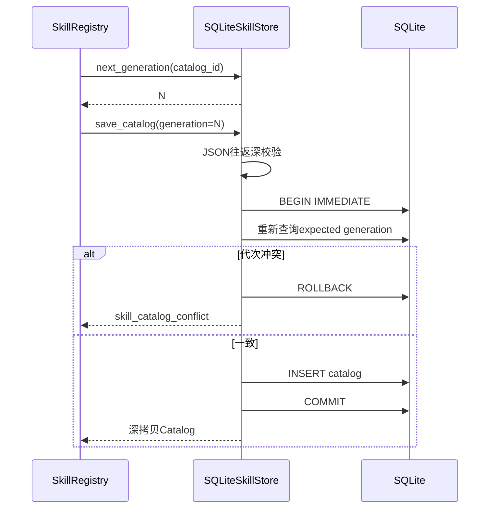
```mermaid
sequenceDiagram
    participant R as SkillRegistry
    participant S as SQLiteSkillStore
    participant DB as SQLite

    R->>S: next_generation(catalog_id)
    S-->>R: N
    R->>S: save_catalog(generation=N)
    S->>S: JSON往返深校验
    S->>DB: BEGIN IMMEDIATE
    S->>DB: 重新查询expected generation
    alt 代次冲突
        S->>DB: ROLLBACK
        S-->>R: skill_catalog_conflict
    else 一致
        S->>DB: INSERT catalog
        S->>DB: COMMIT
        S-->>R: 深拷贝Catalog
    end
```

Registry在事务外读取下一代次，Store在`BEGIN IMMEDIATE`后重新验证，因此多个进程竞争时只有一个相同
Generation能成功。失败者不会自动重新发现或重试。SQLite `IntegrityError`、锁等待超时等底层异常当前没有
统一转换为`KernelError`。

## 21. Access Event与Hash链

### 21.1 事件字段

| 字段 | 语义 | 隐私 |
|---|---|---|
| `catalog_id/sequence` | 每Catalog独立的连续事件编号 | 低 |
| `generation/catalog_sha256` | 本次读取依据的持久目录 | 中 |
| `operation` | `load`或`read_resource` | 低 |
| `manifest_sha256` | 实际选择的Manifest摘要 | 中 |
| `resource_path_sha256` | 资源路径摘要；仅资源读取存在 | 中，可字典猜测 |
| `outcome` | `succeeded`或`failed` | 低 |
| `result_sha256` | 去除正文后的结果摘要；仅成功存在 | 中 |
| `error_code` | 安全`skill_*`错误；仅失败存在 | 低 |
| `occurred_at` | 带时区发生时间 | 中 |
| `previous_digest/digest` | 前序绑定和当前事件摘要 | 中 |

### 21.2 追加事务

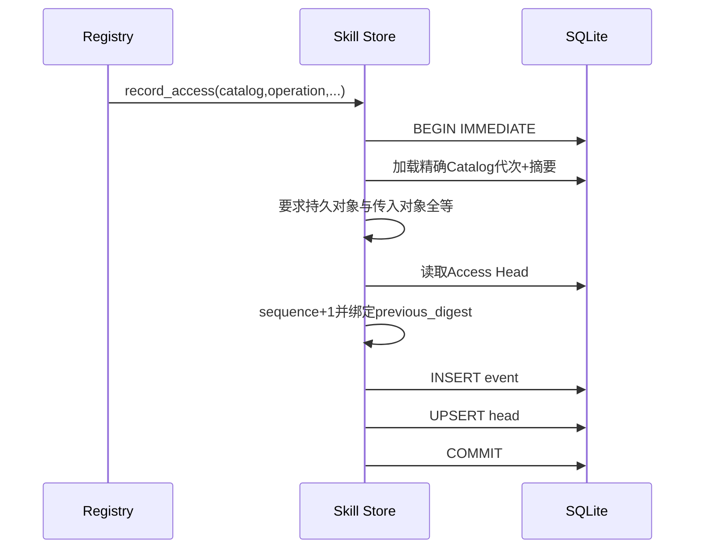
```mermaid
sequenceDiagram
    participant R as Registry
    participant S as Skill Store
    participant DB as SQLite

    R->>S: record_access(catalog,operation,...)
    S->>DB: BEGIN IMMEDIATE
    S->>DB: 加载精确Catalog代次+摘要
    S->>S: 要求持久对象与传入对象全等
    S->>DB: 读取Access Head
    S->>S: sequence+1并绑定previous_digest
    S->>DB: INSERT event
    S->>DB: UPSERT head
    S->>DB: COMMIT
```

`events()`按序读取整条链，逐条重建Pydantic合同，并核对行序号、行摘要、事件目录ID、前序摘要和Head。
任一不一致返回`skill_store_corrupt`，不返回部分事件。

### 21.3 Hash链保证边界

Hash链可以检测随机损坏、单行修改、删除、重排和Head不一致；它不使用HMAC或签名。拥有数据库写权限且
理解合同的攻击者可重算后续摘要和Head，因此链提供完整性自检，不提供外部可验证真实性。

### 21.4 当前读取成本

`events()`一次加载并验证指定Catalog的全部事件，复杂度和内存均为O(n)，没有分页、上限、归档或保留
策略。长期C端运行必须增加游标分页、按时间/数量保留、导出和容量告警，同时保持可验证链段或检查点。

## 22. 名称解析与快照新鲜度

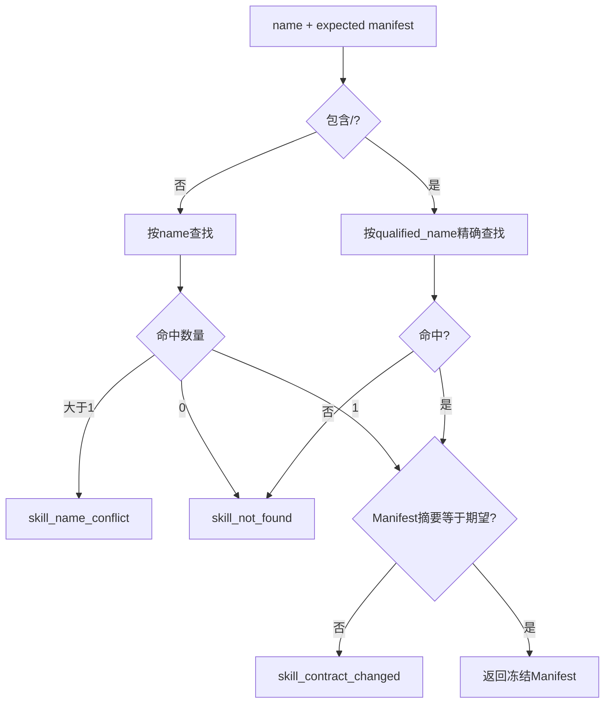
```mermaid
flowchart TD
    Input[name + expected manifest] --> Slash{包含/?}
    Slash -- 是 --> Qualified[按qualified_name精确查找]
    Slash -- 否 --> Simple[按name查找]
    Simple --> Count{命中数量}
    Count -- 大于1 --> Conflict[skill_name_conflict]
    Count -- 0 --> Missing[skill_not_found]
    Count -- 1 --> Digest
    Qualified --> QCount{命中?}
    QCount -- 否 --> Missing
    QCount -- 是 --> Digest{Manifest摘要等于期望?}
    Digest -- 否 --> Changed[skill_contract_changed]
    Digest -- 是 --> Selected[返回冻结Manifest]
```

Catalog摘要绑定整个目录，Manifest摘要绑定单个Skill。调用输入同时携带两者：前者防止从其他目录代次选择，
后者防止模型或宿主在计划时看到的Skill被同名新对象替换。真正读取时又比较当前完整Manifest，形成
“目录摘要—Manifest摘要—当前字节”的三层绑定。

## 23. Trusted Action定义

`build_skill_action_definitions()`只为一个已经持久化且与Registry完全相等的Catalog构建两个Definition。

| 属性 | `skill.load` | `skill.read_resource` |
|---|---|---|
| 输入合同 | `SkillLoadInput` | `SkillResourceReadInput` |
| Source | `skill` | `skill` |
| Source ID | `catalog_id` | `catalog_id` |
| Tool Version | `<generation>.<catalog摘要前16位>` | 同左 |
| Fingerprint | 摘要`{operation: load, catalog: digest}` | 摘要`{operation: read_resource, catalog: digest}` |
| Input Schema摘要 | Pydantic JSON Schema摘要 | Pydantic JSON Schema摘要 |
| Effect | `READ_ONLY` | `READ_ONLY` |
| Risk | `LOW` | `LOW` |
| Recovery | `none` | `none` |
| Executor ID | `skill.load` | `skill.read_resource` |
| Resource | Catalog+Manifest摘要 | Catalog+Manifest摘要+相对路径 |

### 23.1 为什么仍经过Trusted Action Runtime

只读不等于无风险。正文和资源可能包含提示注入、Secret、超大内容或被替换对象；访问行为也需要和
Invocation、Workspace、Sandbox及审计绑定。统一Trusted Action路径提供：

1. 输入Schema固定与持久化；
2. 来源隔离和工具身份；
3. 标准Policy与Execution Plan；
4. 一致的执行状态和Action Audit；
5. 输出摘要而非正文进入审计；
6. 后续可统一接入遥测、租户配额和生命周期治理。

### 23.2 静态Definition限制

Router以`(source, source_id, tool)`作为唯一注册键，重复注册返回`trusted_tool_duplicate`，且当前没有
注销或原子替换API。新Catalog代次需要新的Tool Version和可能的新Fingerprint，但同一Router无法安全
替换旧Definition。当前集成方只能构建新Router/新来源ID或自行管理生命周期；这会阻碍目录热更新，属于
产品装配前必须解决的P0能力缺口。

## 24. SkillActionGateway

### 24.1 构造约束

Gateway对传入Catalog做JSON往返深校验，然后要求Port中`skill.load`与`skill.read_resource`各恰好存在
一条Binding。每条Binding的`source_id`必须等于Catalog ID，Fingerprint必须绑定正确Operation和Catalog
摘要。Port自身固定`source="skill"`和指定来源ID，因此不能访问MCP、Hook或其他Catalog的计划。

### 24.2 Gateway能力

| 方法 | 作用 | 不提供的能力 |
|---|---|---|
| `skills()` | 返回Catalog中全部Manifest深拷贝 | 不过滤跨来源冲突；调用方需查看`conflicts` |
| `catalog` | 返回Catalog深拷贝 | 不自动刷新 |
| `plan_load(...)` | 注入Catalog摘要并创建Load计划 | 不生成业务Idempotency Key |
| `plan_resource(...)` | 注入Catalog摘要和资源路径并创建计划 | 不读取正文 |
| `execute(plan_id)` | 经Port执行计划 | 不直接调用Registry |
| `status(plan_id)` | 读取来源隔离的Route状态 | 不提供审批、事件或Reconcile接口 |

Gateway没有`decide()`，因为两项Action固定低风险只读，默认策略通常直接Ready；最终Policy仍由Router
决定，不能把缺少Gateway审批方法解释为强制免审批。

## 25. Secret输出边界与跨账本不一致

### 25.1 当前输出路径

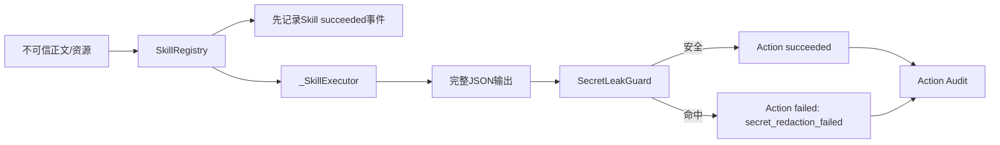
```mermaid
flowchart LR
    File[不可信正文/资源] --> Registry[SkillRegistry]
    Registry --> SkillEvent[先记录Skill succeeded事件]
    Registry --> Executor[_SkillExecutor]
    Executor --> Dump[完整JSON输出]
    Dump --> Guard[SecretLeakGuard]
    Guard -- 安全 --> Success[Action succeeded]
    Guard -- 命中 --> Failed[Action failed: secret_redaction_failed]
    Success --> Audit[Action Audit]
    Failed --> Audit
```

构建Definitions时，调用方可传入`protected_secret_values: tuple[bytes,...]`。Executor把`SkillContent`或
`SkillResourceContent`完整序列化为JSON值，再调用`SecretLeakGuard.assert_safe()`。命中后只返回安全
错误码，不把正文写入Action Audit。

### 25.2 当前保证

- 精确明文字节值命中时，内容不会作为成功Action输出越过边界；
- Skill Access Event和Action Audit均不保存正文；
- 测试中的Canary不会出现在Action Audit数据库；
- Guard错误被Executor转换为`failed` Outcome，而不是抛出未分类异常。

### 25.3 当前限制

1. 默认`protected_secret_values=()`，若宿主未提供值，Guard不阻断任何Secret；
2. 精确值Guard不识别编码、分片、摘要、变形或未知凭据；
3. Registry在Guard之前已经记录Skill访问`outcome="succeeded"`；
4. 若Guard拒绝，Skill账本最后事件是成功，而Action Route/Audit是失败；
5. 三个Store没有统一事务，也没有共同的`plan_id/invocation_id`字段；
6. 进程在Skill成功事件提交后、Action失败结算前崩溃，会留下更明显的跨账本歧义。

隔离探针已复现“Action失败`secret_redaction_failed`、Skill最后事件仍为`succeeded`”。该问题属于P0审计
一致性缺口。修复方向应让Registry记录“读取完成”而非最终发布成功，或把访问事件提交移到Guard之后并
携带统一关联ID；不得简单删除任一账本事实。

## 26. 输入输出合同

### 26.1 Load输入

| 字段 | 约束 | 作用 |
|---|---|---|
| `catalog_sha256` | 64位Revision | 固定目录语义 |
| `name` | 1～128字符 | 简单名或限定名；进一步格式由Resolve决定 |
| `expected_manifest_sha256` | 64位Revision | 固定选中Skill |

### 26.2 Resource输入

除Load输入外增加`path`，最长4,096字符，合同要求规范相对路径。Runtime再执行敏感路径拒绝。

### 26.3 `SkillContent`

| 字段 | 语义 | 持久化 |
|---|---|---|
| `catalog_sha256/manifest_sha256` | 请求与选中对象绑定 | 结果摘要和事件中间接保存 |
| `qualified_name/effective_version` | 返回对象身份 | 结果摘要包含 |
| `content` | 去Frontmatter并`strip()`后的正文，1～256 KiB字符且UTF-8字节复核 | 不保存 |
| `content_sha256` | 返回正文字符串SHA-256 | 结果摘要包含 |
| `resources` | 最多64个排序唯一相对路径 | 结果摘要包含 |

### 26.4 `SkillResourceContent`

| 字段 | 语义 | 持久化 |
|---|---|---|
| Catalog/Manifest/限定名 | 对象绑定 | 结果摘要包含 |
| `path` | Skill目录内规范相对路径 | 访问事件只保存路径摘要 |
| `content` | 最多64 KiB的UTF-8文本，可为空 | 不保存 |
| `content_sha256` | 返回文本SHA-256 | 结果摘要包含 |

Pydantic字符串`max_length`按字符计数，模型Validator再按UTF-8字节计数，防止多字节字符绕过字节预算。

## 27. 摘要与数据血缘

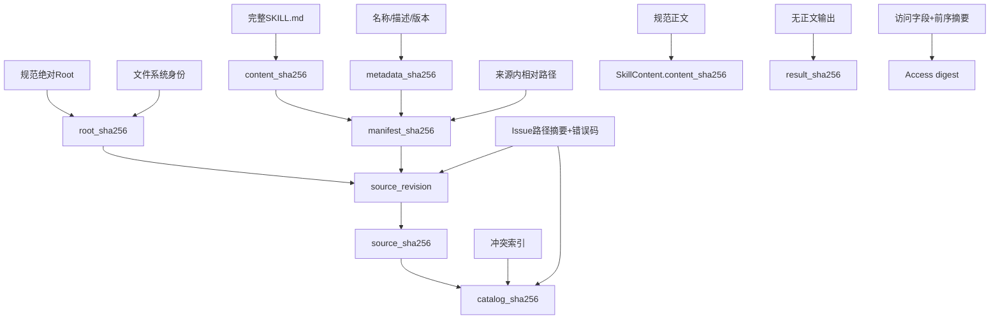
```mermaid
flowchart TD
    RootPath[规范绝对Root] --> RootDigest[root_sha256]
    RootIdentity[文件系统身份] --> RootDigest
    RawSkill[完整SKILL.md] --> RawDigest[content_sha256]
    ParsedMeta[名称/描述/版本] --> MetaDigest[metadata_sha256]
    RawDigest --> ManifestDigest[manifest_sha256]
    MetaDigest --> ManifestDigest
    RelPath[来源内相对路径] --> ManifestDigest
    RootDigest --> SourceRevision[source_revision]
    ManifestDigest --> SourceRevision
    Issues[Issue路径摘要+错误码] --> SourceRevision
    SourceRevision --> SourceDigest[source_sha256]
    SourceDigest --> CatalogDigest[catalog_sha256]
    Conflicts[冲突索引] --> CatalogDigest
    Issues --> CatalogDigest
    Body[规范正文] --> BodyDigest[SkillContent.content_sha256]
    OutputMeta[无正文输出] --> ResultDigest[result_sha256]
    EventFields[访问字段+前序摘要] --> EventDigest[Access digest]
```

所有规范对象摘要复用`canonical_digest()`，即对规范JSON表示执行SHA-256。摘要用于变化检测和引用绑定，
不是加密保密或数字签名。相同数据必须先通过合同排序和唯一性校验，避免集合顺序导致非确定摘要。

## 28. 核心业务逻辑伪代码

### 28.1 发现

```text
discover():
    acquire registry_lock
    manifests = []
    sources = []
    issues = []

    for source in sort_by_source_id(configured_sources):
        reader = open_secure_reader(source.root)
        root_digest = digest(canonical_path(reader), reader.root_identity)
        candidate_paths = bounded_bfs_find_skill_files(reader)

        parsed = []
        for path in candidate_paths:
            try:
                parsed.append(read_and_snapshot_manifest(source, reader, path))
            except KernelError as error:
                issues.append(hash_path_and_safe_code(source, path, error))

        valid = reject_all_duplicate_qualified_names(parsed, issues)
        sources.append(snapshot_source(root_digest, valid, issues_for_source))
        manifests.extend(valid)

    require len(manifests) <= MAX_SKILLS
    sort manifests by qualified_name
    conflicts = recompute_simple_name_conflicts(manifests)
    generation = store.next_generation(catalog_id)
    catalog = validate_and_digest_catalog(generation, sources, manifests, conflicts, issues)
    return store.save_catalog(catalog)
```

### 28.2 正文加载

```text
load(request):
    input = deep_validate(request)
    catalog = store.load_latest_matching_digest(input.catalog_sha256)
    manifest = resolve(catalog, input.name, input.expected_manifest_sha256)

    try:
        reader = open_reader_and_verify_root(catalog, manifest)
        current_manifest, parsed = reread_manifest(reader, manifest.relative_path)
        require current_manifest == manifest
        resources = enumerate_current_resources(reader, manifest)
        result = SkillContent(parsed.body, digest(parsed.body), resources, identities...)
    except KernelError as error:
        store.record_failed_access(catalog, manifest, safe(error.code))
        raise

    store.record_succeeded_access(catalog, manifest, digest(result_without_content))
    return result
```

### 28.3 资源读取

```text
read_resource(request):
    input = deep_validate(request)
    validate_non_sensitive_relative_path(input.path)
    catalog = load_catalog(input.catalog_sha256)
    manifest = resolve(catalog, input.name, input.expected_manifest_sha256)

    try:
        reader = open_reader_and_verify_root(catalog, manifest)
        require reread_manifest(reader) == manifest
        current_resources = enumerate_current_resources(reader, manifest)
        require input.path in current_resources
        content = read_utf8_without_nul(reader, manifest_dir / input.path, 64_KiB)
        result = SkillResourceContent(content, digest(content), identities...)
    except KernelError as error:
        record_failed_access(...)
        raise

    record_succeeded_access(result_without_content)
    return result
```

### 28.4 Action执行

```text
execute_skill_action(plan, arguments):
    try:
        if operation == load:
            value = registry.load(validate_load(arguments))
        else:
            value = registry.read_resource(validate_resource(arguments))

        output = serialize_full_contract(value)
        secret_guard.assert_safe(output)
        return succeeded(output)
    except KernelError as error:
        return failed(error.code)
```

## 29. 错误分类

### 29.1 来源与目录

| 错误码 | 触发条件 | 是否可通过重新发现恢复 |
|---|---|---|
| `skill_source_invalid` | 来源身份、数量、绝对Root或Root类型非法 | 需修正配置 |
| `skill_source_duplicate` | Registry中来源ID重复 | 需修正配置 |
| `skill_source_unavailable` | Root或父链不可打开 | 环境恢复后可重试 |
| `skill_source_changed` | Root身份或读取期间对象变化 | 应重新发现并重新计划 |
| `skill_catalog_invalid` | Catalog ID非法 | 需修正配置 |
| `skill_catalog_limit` | 扫描预算或全局Skill数量超限 | 缩小Root或提高正式合同版本 |
| `skill_catalog_conflict` | 保存代次竞争 | 重新执行完整发现，不盲重用对象 |
| `skill_catalog_not_found` | 指定目录或摘要不存在 | 重新发现/检查生命周期 |
| `skill_catalog_mismatch` | Catalog不属于Registry或Definition不一致 | 重新装配 |
| `skill_store_version` | 数据库Schema版本不支持 | 迁移或回滚 |
| `skill_store_corrupt` | JSON、索引、摘要、链或Head损坏 | 隔离数据库并恢复备份；不得忽略 |

### 29.2 Manifest与内容

| 错误码 | 触发条件 | 处理 |
|---|---|---|
| `skill_frontmatter_missing` | 首行不是YAML分隔符 | 发现时转Issue |
| `skill_frontmatter_invalid` | 无结束符、YAML错误、重复Key或无界根结构 | 发现时转Issue |
| `skill_frontmatter_limit` | Frontmatter字节、节点、深度或数组超限 | 发现时转Issue |
| `skill_manifest_invalid` | 名称、描述、版本或合同不合法 | 发现时转Issue |
| `skill_invalid_utf8` | `SKILL.md`不是UTF-8 | 发现时转Issue |
| `skill_content_empty` | 正文为空 | 发现时转Issue |
| `skill_content_limit` | Manifest读取或正文超限 | 发现时转Issue；加载时可记录失败 |
| `skill_content_changed` | 加载时重建Manifest与目录快照不等 | 记录失败后要求重新发现 |
| `skill_contract_changed` | 调用期望Manifest摘要不匹配 | 重新选择并计划 |
| `skill_not_found` | 名称无匹配 | 修正名称或重新发现 |
| `skill_name_conflict` | 普通名称命中多个来源 | 使用限定名称 |

### 29.3 资源与Action

| 错误码 | 触发条件 | 处理 |
|---|---|---|
| `skill_resource_path_denied` | 非规范或敏感相对路径 | 拒绝，不重试 |
| `skill_resource_not_found` | 路径不在当前资源清单 | 重新加载清单或修正路径 |
| `skill_resource_limit` | 资源数、单目录条目或文件字节超限 | 缩小资源 |
| `skill_resource_invalid_utf8` | 非UTF-8或NUL | 转换为文本资源 |
| `skill_path_denied` | 链接、特殊对象或错误文件类型 | 拒绝，不绕过Reader |
| `skill_read_failed` | 未分类安全读取失败 | 检查平台诊断，安全重试前重建Reader |
| `skill_action_not_trusted` | Port缺少唯一Binding | 修正宿主装配 |
| `skill_catalog_changed` | Gateway Binding与Catalog摘要不一致 | 重建Router和Gateway |
| `secret_redaction_failed` | 输出命中受保护明文 | Action失败，不发布内容 |
| `skill_reconciliation_not_supported` | 调用只读Executor的Reconcile | 人工处理；正常路径不应发生 |

## 30. 失败审计覆盖矩阵

`load()`和`read_resource()`的`try`块在Catalog加载与名称解析之后开始。因此并非所有拒绝都会形成Skill
Access Event。

| 失败阶段 | 示例 | Skill Event | Action Audit | 当前结论 |
|---|---|---:|---:|---|
| 输入Pydantic构造 | `../escape`路径 | 否 | 经Router时通常有计划失败事实 | Registry直接调用无事件 |
| Runtime早期路径拒绝 | `.env` | 否 | 经Router时有失败Outcome | 隔离探针确认事件增量为0 |
| Catalog不存在/摘要不匹配 | `skill_catalog_not_found` | 否 | 经Router时有失败Outcome | 无选定Manifest可引用 |
| 名称不存在或冲突 | `skill_not_found/name_conflict` | 否 | 经Router时有失败Outcome | 当前审计不完整 |
| 期望Manifest不匹配 | `skill_contract_changed` | 否 | 经Router时有失败Outcome | 当前审计不完整 |
| Root/内容/资源读取失败 | `skill_source_changed`等 | 是，failed | 经Router时有失败Outcome | 双账本但无关联ID |
| Registry读取成功 | 正文/资源返回 | 是，succeeded | 后续决定 | Skill事件先提交 |
| Secret Guard拒绝 | `secret_redaction_failed` | 是，仍为succeeded | 是，failed | 当前跨账本语义冲突 |
| Action Audit提交失败 | Router Store异常 | Skill可能已成功 | 可能无终态 | 无跨库事务 |

生产审计目标应明确区分“访问尝试”“文件读取完成”“内容发布完成”三个事实，并通过统一Correlation ID关联。
在完成前，运维不得仅凭Skill Event的`succeeded`判断内容已成功交付给模型。

## 31. 并发、顺序、取消与超时

### 31.1 当前并发语义

- `discover()`持有Registry实例级`threading.RLock`；
- `catalog()`、`resolve()`、`load()`和`read_resource()`不取得该锁；
- SQLite连接使用默认`check_same_thread=True`，不支持任意线程共享；
- `save_catalog()`与`record_access()`使用`BEGIN IMMEDIATE`串行化写事务；
- 多进程Catalog代次竞争会由Store复核检测，但无自动重试；
- Access Sequence在写锁内从Head递增，单数据库多连接写入可保持序号唯一；
- `events()`不是事务性快照读取，读期间有新追加时读取Rows和Head可能观察到不同时间点并误报损坏。

### 31.2 当前取消语义

Registry和Store API都是同步函数，没有取消Token或检查点。`_SkillExecutor.execute()`虽然是`async`，但内部
调用同步Registry，直到返回前没有`await`；事件循环取消不能中断目录遍历、YAML解析或SQLite锁等待。
取消只可能在Router外围调度点结算，无法保证及时释放当前线程占用。

### 31.3 当前超时语义

Skill模块没有目录发现Timeout、单次加载Timeout或总CPU预算。SQLite Busy Timeout是锁等待上限，不是
业务请求Deadline。上游使用`asyncio.timeout()`也不能抢占同步文件系统和YAML工作。

### 31.4 生产目标

1. 把有界发现/读取迁移到可取消Worker或专用线程池；
2. 在目录、条目、字节、CPU时间和墙钟时间维度统一预算；
3. 把Deadline作为合同传递到Reader与Store；
4. 为并发发现定义Catalog CAS和可重试冲突语义；
5. 为事件读取提供事务快照或游标；
6. 验证取消后Reader句柄、SQLite事务和Router计划均到达明确终态。

## 32. 崩溃、重启与恢复

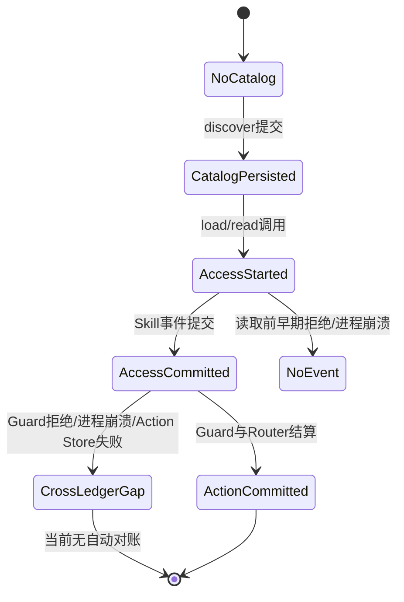
```mermaid
stateDiagram-v2
    [*] --> NoCatalog
    NoCatalog --> CatalogPersisted: discover提交
    CatalogPersisted --> AccessStarted: load/read调用
    AccessStarted --> AccessCommitted: Skill事件提交
    AccessStarted --> NoEvent: 读取前早期拒绝/进程崩溃
    AccessCommitted --> ActionCommitted: Guard与Router结算
    AccessCommitted --> CrossLedgerGap: Guard拒绝/进程崩溃/Action Store失败
    CrossLedgerGap --> [*]: 当前无自动对账
    ActionCommitted --> [*]
```

### 32.1 已有恢复能力

- SQLite事务保证单个Catalog或Access Event提交不出现半行；
- WAL与FULL同步提供本地数据库崩溃恢复基础；
- 启动后可按Catalog ID和摘要重新加载历史目录；
- 每次正文/资源访问重新核对当前文件，不信任进程重启前的打开句柄；
- `events()`验证完整链和Head，损坏时失败关闭。

### 32.2 未有恢复能力

- 没有“发现进行中”或“访问进行中”持久状态，崩溃前未提交的尝试不可见；
- 没有Skill Event与Action Plan/Audit的对账器；
- 没有数据库备份、恢复、压缩、保留或Catalog剪枝；
- 没有Schema迁移，只接受版本1；
- 没有重建当前Router Definition的产品启动流程；
- 没有在重启后判断历史Catalog对应Root是否仍受信；
- Store关闭后继续调用会泄漏SQLite `ProgrammingError`，没有稳定`skill_store_closed`合同。

只读Skill不会产生外部写效果，因此不进入Action `UNKNOWN`重放问题；但“是否把不可信正文交给模型”仍是
安全效果，跨账本不一致必须通过发布阶段事实解决。

## 33. 提示注入边界

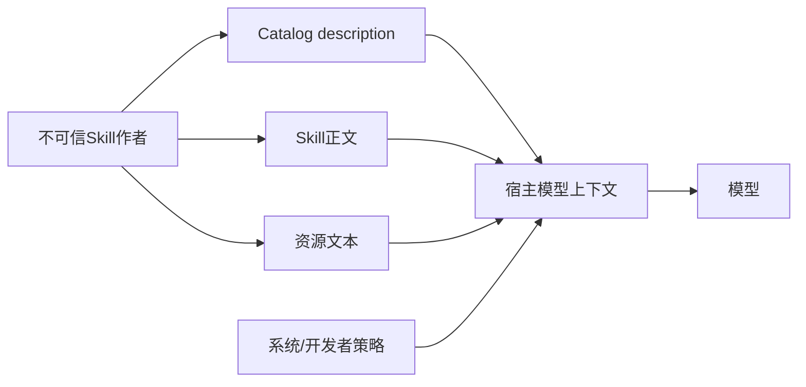
```mermaid
flowchart LR
    Author[不可信Skill作者] --> Description[Catalog description]
    Author --> Body[Skill正文]
    Author --> Resource[资源文本]
    Description --> ModelContext[宿主模型上下文]
    Body --> ModelContext
    Resource --> ModelContext
    System[系统/开发者策略] --> ModelContext
    ModelContext --> Model[模型]
```

当前模块保证内容不能直接执行或扩大工具权限，但不能阻止模型被内容说服。描述、正文和资源都可能包含
“忽略系统指令”“读取Secret”“调用写Tool”等注入文本。产品集成必须：

1. 将Skill内容标注为低信任外部数据，不得与系统指令同级拼接；
2. 不把Frontmatter中任何权限声明转换为模型可调用Tool；
3. 模型发出的后续Tool仍经过独立Policy、审批、Sandbox和资源绑定；
4. 在UI/Trace中区分Skill文本与宿主策略，避免审计误读；
5. 对描述和正文施加Token预算，防止Skill淹没更高优先级上下文；
6. 在Eval中覆盖间接提示注入、同名诱导、资源链式诱导和多Skill冲突；
7. 不依赖关键词过滤作为唯一控制，最终权限边界必须结构化执行。

当前默认产品没有Skill上下文装配，因此上述上下文优先级尚未由实现证明。

## 34. 供应链边界

### 34.1 当前本地供应链模型

```mermaid
flowchart LR
    Host[宿主选择Root] --> Discover[本地发现]
    Discover --> Snapshot[摘要Catalog]
    Snapshot --> Plan[Action绑定]
    Plan --> Reread[访问时重核]
```

当前安全性建立在“受信宿主选择Root、每次读取重核摘要”上。`bundled`标签不验证文件来自官方发行物，
`user/workspace`标签也不证明作者身份。摘要只能检测变化，不能证明变化是否获得授权。

### 34.2 未实现的远端供应链合同

| 能力 | 当前状态 | 生产要求 |
|---|---|---|
| 发布者身份 | 无 | 稳定主体、密钥轮换和撤销 |
| 包清单 | 无 | 每文件路径、大小、摘要、MIME和权限声明 |
| 签名 | 无 | 离线可验证签名和信任根 |
| 透明日志 | 无 | 可审计发布序列与回滚检测 |
| 下载 | 无 | 受管Egress、TLS/域名固定、总量限制 |
| 解包 | 无 | 私有暂存、路径穿越/链接/压缩炸弹防护 |
| 安装 | 无 | fsync、原子切换、失败清理和版本锁 |
| 升级/回滚 | 无 | 明确状态机、旧版本保留和回滚授权 |
| 许可证/SBOM | 无 | 合规清单和依赖来源 |
| 租户隔离 | 无 | 每租户Root、配额、密钥和审计分区 |

在这些合同完成前，不得在产品中把网络下载目录直接声明为`bundled`，也不得自动信任Git分支、URL或
Marketplace索引中的声明版本。

## 35. 安全威胁与控制

| 威胁 | 当前控制 | 剩余风险 |
|---|---|---|
| 来源路径逃逸 | 绝对Root、规范相对路径、原生句柄链 | Store路径本身仍需安全启动验证 |
| Symlink/Junction替换 | Root构造拒绝、Reader无跟随 | 平台矩阵仍需完整固定证据 |
| 硬链接读取外部文件 | POSIX Reader读取时拒绝 | 会先出现在资源清单；Windows证据不足 |
| 同名劫持 | 跨来源冲突、来源内全部重复失效 | UI若忽略Conflict仍可能误导用户 |
| TOCTOU内容替换 | Root身份与Manifest全等重核、目录双观察 | 资源树遍历整体不是单一原子Snapshot |
| YAML对象构造 | SafeLoader、重复Key、结构预算 | YAML先解析后计数；仍有同步CPU预算风险 |
| 资源耗尽 | 文件/深度/单目录/资源数上限 | 资源遍历缺总目录和总条目预算 |
| Secret泄漏 | 不持久正文、可选精确Guard | Guard默认空、未知/编码Secret、跨账本成功冲突 |
| 提示注入 | 内容不可执行、权限不采信 | 当前无上下文信任标签和注入Eval产品门禁 |
| 数据库篡改 | 合同重验与无密钥Hash链 | 可写攻击者可重算；路径/WAL权限未完全验证 |
| 审计缺失 | 读取中后段成功/失败事件 | 早期拒绝无事件、三账本无关联与事务 |
| 热更新漂移 | Catalog/Manifest/Fingerprint绑定 | Router不能替换Definition，产品生命周期缺失 |
| 远端恶意包 | 当前不支持远端安装 | 后续实现必须先建签名和原子安装合同 |

## 36. 隐私与数据最小化

### 36.1 持久化数据

Skill数据库保存名称、描述、声明版本、相对Manifest路径、来源标签、时间和各种摘要。它不保存：

- Source绝对路径明文；
- `SKILL.md`正文；
- 资源内容；
- 资源相对路径明文访问记录；
- Secret原值；
- 模型输入输出；
- 用户身份、租户ID、Session或Invocation关联。

### 36.2 仍可能敏感的数据

名称、描述、Manifest相对路径可能泄露项目主题或内部命名；Root和资源路径摘要可能受字典攻击；捕获和访问
时间可能揭示工作节奏。数据库应按用户/租户隔离，不应作为公开Catalog直接导出。

### 36.3 日志要求

当前模块没有日志输出。后续遥测必须只记录安全错误码、数量、耗时、代次和不可逆关联ID，不记录正文、
资源、绝对路径、YAML原文、Secret或完整模型请求。管理员诊断原路径需通过显式本地权限和短生命周期视图，
不能写入常规Trace。

## 37. 可观测性现状与目标

### 37.1 当前信号

| 信号 | 当前来源 | 局限 |
|---|---|---|
| Catalog Generation/Digest | `skill_catalogs` | 无发现耗时、数量分布或调用关联 |
| Discovery Issue | Catalog内Issue | 仅路径摘要，无可授权诊断映射 |
| Access Outcome/Error | Hash链事件 | 早期失败缺失；无Plan ID |
| Action Route/Audit | Trusted Action Store | 与Skill Event没有统一Correlation |
| Pydantic/KernelError | 同步调用返回 | 无统一Trace/Metric/Log |

### 37.2 目标指标

| 指标 | 类型 | 建议维度 | 禁止维度 |
|---|---|---|---|
| `skill.discovery.duration` | Histogram | outcome、source_kind、平台 | Root路径、Skill名称 |
| `skill.discovery.entries` | Histogram | outcome、平台 | 文件名 |
| `skill.catalog.skills` | Gauge/Histogram | catalog类别 | 描述正文 |
| `skill.catalog.issues` | Counter | safe error code、source_kind | path digest高基数默认标签 |
| `skill.access.duration` | Histogram | operation、outcome | content digest |
| `skill.access.failures` | Counter | operation、error_code | 原始异常消息 |
| `skill.guard.blocked` | Counter | operation | Secret、内容 |
| `skill.store.corruption` | Counter/Alert | 表类别 | payload |

### 37.3 SLO建议

在产品接线前需按固定任务集确定P50/P95/P99，不在现行文档虚构阈值。最低门禁应覆盖正常目录、最大合法
目录、宽目录攻击、并发发现、SQLite锁竞争、Windows大小写和取消Deadline，并证明超限时资源占用有界。

## 38. 平台兼容性

| 维度 | macOS/Linux POSIX | Windows | 当前证据 |
|---|---|---|---|
| Root对象 | 目录FD/无跟随 | 句柄/Reparse检查 | Workspace模块测试提供基础 |
| Manifest文件名 | 精确`SKILL.md` | `casefold()`匹配 | 代码分支存在；Skill专用Windows门禁待补 |
| 路径比较 | 区分大小写字符串 | `casefold()` | 合同仍要求正斜杠 |
| Symlink/Junction | Root和成员拒绝 | Root Junction和Reparse拒绝 | 当前开发环境仅直接跑POSIX场景 |
| 硬链接 | 资源列出、读取拒绝 | 需专项验证 | POSIX测试带条件跳过 |
| SQLite权限 | 目录0700、主库0600 | 依赖ACL | 无WAL/SHM专项断言 |
| Unicode文件名 | Python/平台原生 | 大小写与规范化可能不同 | 无碰撞矩阵 |

“代码存在Windows实现”不等于Windows发布证据完成。1.0前必须在真实Windows Runner执行发现、Root替换、
Reparse、硬链接、大小写冲突、非ASCII路径、数据库恢复和Action集成测试。

## 39. 部署与运维

### 39.1 显式库装配示例

以下伪代码说明依赖关系，不是当前默认产品配置格式：

```python
skill_store = SQLiteSkillStore(private_state_root / "skills.db")
registry = SkillRegistry(
    catalog_id="default",
    sources=(
        SkillSource("bundled", "bundled", bundled_skill_root),
        SkillSource("workspace", "workspace", workspace_skill_root),
    ),
    store=skill_store,
)
catalog = registry.discover()

for definition in build_skill_action_definitions(
    registry,
    catalog,
    protected_secret_values=current_secret_values,
):
    router.register(definition)

port = ExtensionActionPort(
    router,
    source="skill",
    source_id=catalog.catalog_id,
    context=current_planning_context,
)
gateway = SkillActionGateway(catalog, port)
```

### 39.2 启动顺序目标

```mermaid
sequenceDiagram
    participant P as Product Bootstrap
    participant C as Config
    participant S as Skill Store
    participant R as Registry
    participant A as Trusted Router
    participant G as Gateway

    P->>C: 安全加载并固定Profile
    C-->>P: 授权Root与Catalog身份
    P->>S: 打开/迁移/完整性检查
    P->>R: 构造并discover
    R-->>P: 固定Catalog
    P->>A: 原子注册Catalog Definitions
    P->>G: 构造来源隔离Gateway
    P->>P: 发布健康与目录投影
```

该启动事务尚未实现。生产装配需在任一步失败时关闭Store/Reader、撤销未发布Binding，并保证服务不会以
“无Skill但健康”或“旧Binding配新Catalog”的歧义状态启动。

### 39.3 运维要求

1. Skill Store必须位于私有状态目录，禁止放入被Agent编辑的Workspace；
2. Root授权应使用规范真实路径和平台对象身份，不接受环境变量未经验证展开；
3. 目录更新应通过显式重建/原子发布流程，不在运行中原地覆盖；
4. Backup必须同时覆盖主库、WAL一致性和Schema版本；
5. Corruption应使Skill子系统不健康并发出告警，不能删除数据库后静默继续；
6. 退出时先停止新计划，再等待/取消读取，最后关闭Store；
7. 数据保留和用户删除必须覆盖Catalog元数据、访问事件和跨账本关联；
8. Root删除、权限变化、配置撤销和用户注销都应使旧Gateway不可继续执行。

## 40. 兼容性与Schema演进

### 40.1 当前版本边界

- 十类合同都固定为`harnessix.skill-*/v1`；
- Store `_SCHEMA_VERSION="1"`，遇到其他版本直接`skill_store_version`；
- Package语义版本当前为`0.1.0`，不能据此推断Skill合同已承诺长期兼容；
- PyYAML约束为`>=6,<7`，锁文件固定6.0.3，但尚无整个范围的兼容矩阵；
- 已提交Schema由`make spec`生成并由测试逐份比较。

### 40.2 演进规则

1. 新增必填字段、改变摘要输入、路径规则、错误码语义或排序规则必须发布新合同版本；
2. Catalog摘要算法变化不能在v1中静默修改，否则历史Plan和Definition无法解释；
3. Store迁移必须可备份、前滚、失败回滚并验证事件链；
4. Reader平台语义变化需同步更新Workspace与Skill模块设计和跨平台测试；
5. Frontmatter新增解释字段必须经过单独ADR，默认仍不得产生执行能力；
6. 远端包合同必须与本地Catalog合同分层，不能复用`declared_version`充当签名版本；
7. Router热替换需定义旧Plan、旧Gateway、进行中执行和新Catalog的隔离语义。

## 41. 源码与测试映射

| 设计元素 | 源码文件 | 关键符号 | 测试文件 | 测试符号 |
|---|---|---|---|---|
| 稳定目录与渐进正文 | [`runtime.py`](../../src/harnessix/skills/runtime.py) | `SkillRegistry.discover/load` | [`test_runtime.py`](../../tests/skills/test_runtime.py) | `test_catalog_is_deterministic_and_body_is_progressively_loaded` |
| 跨来源名称冲突 | 同上 | `resolve`、`_name_index` | 同上 | `test_cross_source_name_conflict_requires_qualified_name` |
| 来源内重复与坏Frontmatter | 同上 | `_discover_source`、`_parse_skill` | 同上 | `test_duplicate_qualified_name_and_invalid_frontmatter_are_not_exposed` |
| 内容漂移与失败事件 | 同上 | `_bound_reader`、`_read_manifest`、`_record_failure` | 同上 | `test_content_change_after_catalog_is_rejected_and_audited` |
| 敏感路径、二进制、Symlink | 同上 | `_resources`、`_validate_resource_path`、`_read_utf8` | 同上 | `test_resources_reject_sensitive_paths_binary_and_symlink_escape` |
| YAML别名预算 | 同上 | `_validate_yaml_shape` | 同上 | `test_frontmatter_alias_expansion_is_bounded` |
| 重复YAML Key | 同上 | `_UniqueKeySafeLoader`、`_construct_unique_mapping` | 同上 | `test_duplicate_yaml_key_is_rejected_instead_of_silently_overridden` |
| 硬链接读取拒绝 | [`workspace/snapshot.py`](../../src/harnessix/workspace/snapshot.py) | `SecureWorkspaceReader.read_file` | 同上 | `test_hard_link_resource_is_listed_but_cannot_be_read` |
| Root Symlink拒绝 | [`runtime.py`](../../src/harnessix/skills/runtime.py) | `SkillSource.__post_init__` | 同上 | `test_source_root_symlink_is_rejected_before_discovery` |
| 相同摘要不同代次/目录损坏 | [`store.py`](../../src/harnessix/skills/store.py) | `save_catalog/load_catalog` | 同上 | `test_store_preserves_equal_catalog_generations_and_detects_catalog_corruption` |
| 仅经Action Port加载 | [`actions.py`](../../src/harnessix/skills/actions.py) | `build_skill_action_definitions`、`SkillActionGateway` | 同上 | `test_skill_body_and_resource_execute_only_through_action_port` |
| Secret Canary阻断 | 同上 | `_SkillExecutor.execute` | 同上 | `test_secret_canary_in_skill_output_is_blocked_by_action_boundary` |
| Access Hash链损坏 | [`store.py`](../../src/harnessix/skills/store.py) | `events` | 同上 | `test_skill_store_detects_catalog_and_event_corruption` |
| 十份JSON Schema | [`contracts.py`](../../src/harnessix/skills/contracts.py) | 十类Pydantic合同 | [`test_schemas.py`](../../tests/skills/test_schemas.py) | `test_committed_skill_schemas_match_runtime_contracts` |

## 42. 当前直接测试覆盖

当前`tests/skills`在POSIX收集14个测试：`test_runtime.py` 13个、`test_schemas.py` 1个。覆盖重点包括：

1. 重复发现的摘要确定性和代次递增；
2. Catalog与数据库不包含正文；
3. 正文和资源渐进加载及成功访问事件；
4. 跨来源同名消歧和来源内重复全部失效；
5. 内容捕获后变化失败关闭并审计；
6. 敏感路径、Symlink、二进制和POSIX硬链接；
7. YAML别名膨胀与重复Key；
8. Source Root Symlink；
9. 相同Catalog摘要的多代次保留；
10. Catalog和Access Event篡改检测；
11. Skill只能经来源隔离Action Port进入统一执行；
12. 已知Secret Canary不会进入Action Audit；
13. 十类运行时Schema与提交文件一致。

测试证明当前切片的关键行为，但不是生产完整性证明。

## 43. 尚缺测试与证据

### 43.1 合同与预算

- 1/32/33个Source边界及重复ID；
- 2,048目录、8,192条目、2,048 Skill、2,048 Issue、512 Conflict精确边界；
- 超过Issue/Conflict上限的错误归一化；
- 256 KiB文档、16 KiB/256行Frontmatter、512节点/16层/256数组项边界；
- 64个资源、64 KiB资源、多字节UTF-8字节边界；
- 纯目录宽树、深度边界和总CPU/墙钟预算；
- 空资源、根级`SKILL.md`名称回退、YAML布尔版本和非字符串Key。

### 43.2 审计与失败

- 输入、敏感路径、Catalog缺失、名称冲突和Manifest摘要错误的访问尝试审计；
- Secret Guard失败时Skill Event与Action Audit的一致语义；
- Skill Event提交成功后Action Audit失败或进程崩溃；
- `events()`读取期间并发追加；
- SQLite锁等待、磁盘满、只读文件系统、IntegrityError和关闭后调用；
- Catalog行删除但Access Event仍存在的孤立引用；
- Hash链截断后重算攻击不应被误称为可检测。

### 43.3 生命周期与产品

- 同一Router的新Catalog替换、旧Plan执行和旧Gateway撤销；
- 默认Product Config、CLI/App Server、Agent Context和UI集成；
- 取消、Deadline、线程池饱和和大目录Soak；
- 进程重启后从Store重建Registry/Router/Gateway；
- 数据保留、备份恢复、Schema迁移和用户删除；
- 遥测故障不能影响读取主路径。

### 43.4 安全与平台

- Windows Junction/Reparse/硬链接、大小写冲突、保留名称和Unicode路径；
- macOS大小写不敏感卷与Linux大小写敏感文件系统差异；
- Store路径Symlink、恶意祖先目录、WAL/SHM权限；
- 未知、编码、分片和多值Secret；
- Prompt Injection、间接资源诱导和恶意Description真实模型Eval；
- 远端下载、签名、撤销、回滚、压缩炸弹和多租户隔离。

## 44. 已知限制与风险优先级

| 优先级 | 风险 | 影响 | 关闭条件 |
|---|---|---|---|
| P0 | 资源遍历没有累计目录/条目/时间预算 | 宽树可阻塞事件循环并耗尽资源 | 增加全局预算、取消与攻击回归 |
| P0 | Secret Guard后置于Skill成功事件 | 双账本对同一次交付结论相反 | 分阶段事件或Guard后提交，并引入关联ID/对账测试 |
| P0 | Router不能替换同Catalog两项Definition | 目录更新无法在长生命周期产品安全发布 | 原子版本化Registry或重建路由生命周期合同 |
| P0 | 默认产品未装配Skill | 功能不能服务真实用户 | Product Config、启动事务、模型上下文、UI/诊断和Dogfooding |
| P1 | 早期拒绝不写Skill访问事件 | 攻击尝试和配置错误审计不完整 | 定义attempt/read/publish事件并全路径测试 |
| P1 | 同步扫描/YAML/SQLite不可取消 | 超时不生效、阻塞Agent事件循环 | Worker隔离、Deadline和取消收尾 |
| P1 | Issue/Conflict超限泄漏ValidationError | 对外错误合同不稳定 | 显式前置上限与统一KernelError |
| P1 | Store无分页/保留/迁移/安全路径打开 | 长期容量、升级和本地篡改风险 | Store v2及运维门禁 |
| P1 | Access/Plan/Audit无统一关联与事务 | 故障排查和恢复歧义 | Correlation合同、Outbox或对账器 |
| P1 | Guard默认空且只做精确值 | 未知/变形Secret可进入模型 | 产品Secret生命周期、流式/结构化DLP和Eval |
| P1 | 无提示注入上下文边界 | Skill可诱导模型请求危险Action | 信任标签、优先级、权限独立和真实模型Eval |
| P1 | 远端供应链未实现 | 不能安全提供生态安装 | 签名Manifest、透明日志、原子安装、撤销和SBOM |
| P2 | YAML布尔值被接受为版本 | 作者错误被静默规范化 | 严格类型与回归测试 |
| P2 | Discovery Issue只有路径摘要 | 管理员难定位坏文件 | 受控本地诊断映射，禁止常规遥测泄露 |
| P2 | Store关闭后泄漏SQLite异常 | 公共错误不稳定 | 显式closed状态错误与幂等关闭测试 |

## 45. 演进路线

### 45.1 近期加固

1. 为资源扫描增加累计目录、累计条目、Deadline和取消预算；
2. 严格拒绝布尔版本，前置Issue/Conflict合同上限；
3. 重构Access Event为Attempt、Read Complete、Publish Complete或等价阶段事实；
4. 给Skill、Plan和Action Audit引入统一Correlation ID并建立对账；
5. 为Store增加安全路径打开、错误归一化、分页、保留和迁移；
6. 为Router设计原子版本化Definition切换与旧Plan隔离；
7. 在真实Windows和Linux运行专用攻击矩阵。

### 45.2 产品装配

1. Product Config声明显式Root、启用状态、来源种类和配额；
2. Bootstrap安全加载Store、发现Catalog并原子发布Gateway；
3. Agent Context只注入有界Manifest投影，正文按Tool调用加载；
4. UI展示来源、限定名、冲突、版本、摘要和安全Issue；
5. Skill内容携带不可信数据标签，后续Action权限仍完全独立；
6. 监控发现/访问延迟、拒绝、Guard命中、数据库容量和损坏；
7. 通过真实Coding任务和恶意Skill数据集评测有效性与安全性。

### 45.3 远端生态

只有发布者身份、签名Manifest、受管下载、私有解包、原子安装、版本锁、撤销、回滚、许可证和SBOM全部
形成正式合同与测试后，才可启用远端Skill。远端包仍是不可执行内容；如需执行扩展，应转为受管MCP或
Container Action，而不是提升Skill权限。

## 46. 阅读与排障路线

### 46.1 源码阅读

1. 从[`contracts.py`](../../src/harnessix/skills/contracts.py)确认十类对象和摘要不变量；
2. 阅读[`runtime.py`](../../src/harnessix/skills/runtime.py)的`discover()`到`_manifest_paths()`，理解目录；
3. 阅读`_parse_skill()`、`_validate_yaml_shape()`，理解不可信文本边界；
4. 阅读`load()`、`read_resource()`和`_resources()`，理解渐进加载和当前审计窗口；
5. 转到[`workspace/snapshot.py`](../../src/harnessix/workspace/snapshot.py)理解原生安全观察；
6. 阅读[`store.py`](../../src/harnessix/skills/store.py)的两类事务和`events()`完整校验；
7. 阅读[`actions.py`](../../src/harnessix/skills/actions.py)的Definition、Executor、Guard和Gateway；
8. 逐一对照[`test_runtime.py`](../../tests/skills/test_runtime.py)，最后核对Schema测试。

### 46.2 故障定位

```mermaid
flowchart TD
    Error[Skill调用失败] --> Stage{失败阶段}
    Stage -- 发现 --> Catalog[检查Catalog Issue与Root预算]
    Stage -- 解析/新鲜度 --> Manifest[比较Catalog/Manifest/当前内容摘要]
    Stage -- 资源 --> Resource[检查路径清单、对象类型、UTF-8和预算]
    Stage -- Store --> Store[验证Schema版本、目录行、事件链和Head]
    Stage -- Action --> Action[检查Binding/Fingerprint/Plan/Audit]
    Stage -- Guard --> Secret[检查受保护值版本与跨账本事件]
```

排障不得输出正文、资源、绝对Root或Secret。若Skill Store显示成功而Action显示
`secret_redaction_failed`，应按当前已知跨账本窗口解释，不得认定内容已经交付。

## 47. 验收标准

当前文档对应代码切片的可执行验收标准：

- [x] Source Root必须绝对、存在、为普通目录且不是Symlink/Junction；
- [x] 多来源发现顺序和Catalog语义摘要确定；
- [x] 重复发现保留不同Generation且相同语义可共享摘要；
- [x] 目录不保存正文，访问事件不保存正文或资源路径明文；
- [x] 来源内重复限定名全部失效，跨来源同名必须显式消歧；
- [x] YAML重复Key和别名膨胀失败关闭；
- [x] 每次加载重核Root和完整Manifest；
- [x] 敏感路径、Symlink、特殊对象、二进制和POSIX硬链接受到限制；
- [x] 两项读取只通过`source="skill"`的Trusted Action证明链执行；
- [x] 已知Secret Canary不会进入Action Audit；
- [x] Catalog与Access Event损坏被检测；
- [x] 十份提交Schema与运行时合同一致；
- [ ] 资源宽树遍历具有累计预算和可取消Deadline；
- [ ] 所有访问尝试和发布结果形成一致、可关联审计；
- [ ] Router支持Catalog原子切换并隔离旧Plan；
- [ ] macOS、Linux、Windows真实平台矩阵通过；
- [ ] 默认产品装配、真实模型提示注入Eval和供应链门禁完成。

未勾选项意味着Skill模块尚不能作为完整1.0产品能力宣称。

## 48. 文档复核与实际验证记录

本版设计在代码版本`e1aa95764da726d2c1e8f286e4400579ce3efae7`上完成以下核对：

1. 静态追踪`contracts.py`、`runtime.py`、`store.py`、`actions.py`和公共导出；
2. 反查`src/harnessix`确认默认产品没有Skill实例化；
3. 收集`tests/skills`确认当前平台共14个测试；
4. 核对`spec/`中十份Skill JSON Schema；
5. 隔离探针确认YAML布尔版本当前得到字符串`"True"`；
6. 隔离探针确认敏感路径早期拒绝不会新增Access Event；
7. 隔离探针确认Secret Guard拒绝时Action失败而Skill最后事件仍为成功；
8. 相关行为由现有正式测试与本节列出的测试缺口分别标记，不把探针替代为提交回归。

完整仓库格式、类型、测试、链接和图表门禁结果以包含本文的提交验证记录为准。

## 49. 文档维护触发条件

发生以下任一变化必须同步更新本文：

- 十类合同、摘要字段、规范排序、上限或错误码变化；
- Skill Root发现规则、来源种类、优先级或名称冲突行为变化；
- Frontmatter解释字段、YAML加载器或正文规范化变化；
- Resource路径、敏感名称、深度、数量、字节或对象类型规则变化；
- `SecureWorkspaceReader`平台保证或错误映射变化；
- Store Schema、事务、Hash链、保留、备份或迁移变化；
- Access Event阶段或跨账本Correlation变化；
- Definition、Policy、Effect、Risk、Recovery、Gateway或Router生命周期变化；
- Secret Guard、模型上下文、提示注入或遥测边界变化；
- 默认产品装配、远端安装、签名、Marketplace或多租户能力落地；
- 测试矩阵、固定平台证据或发布声明变化。

变更时应同时检查[总体架构](../architecture.md)、[文档中心](../README.md)、
[Trusted Actions模块设计](trusted-actions.md)、[Workspace模块设计](workspace.md)、
[Secrets模块设计](secrets.md)、[0.8详细设计](../m08-product-runtime-and-extensions.md)、
[威胁模型](../threat-model.md)和[路线图](../roadmap.md)。

## 50. 变更记录

| 文档版本 | 代码版本 | 日期 | 变更摘要 |
|---:|---|---|---|
| 1 | `e1aa95764da726d2c1e8f286e4400579ce3efae7` | 2026-09-12 | 建立Skill现行模块设计，覆盖本地来源、发现预算、Frontmatter、目录摘要、渐进加载、安全Reader、SQLite事件、Action Gateway、Secret边界、失败恢复、平台和生产差距 |
