# Smoke模块设计

## 1. 模块摘要

| 项目 | 内容 |
|---|---|
| 源码包 | [`src/harnessix/smoke`](../../src/harnessix/smoke/) |
| 当前职责 | 在显式网络门禁后，以固定文本、内存工具和审批重开场景验证Provider、Agent Runtime、SQLite与Replay闭环，并输出白名单报告 |
| 非职责 | 不验证任意用户Prompt、真实工作区、Shell、文件修改、成本硬上限、账单、全部Provider兼容性或完整Coding Agent能力 |
| 主要入口 | `SmokeConfig`、`SmokeReport`、`run_smoke`、`harnessix model-smoke` |
| 上游调用者 | 运维人员、发布验收脚本、受信测试宿主；默认产品Agent启动不自动运行Smoke |
| 下游依赖 | Model Provider、Agent Runtime、SQLite Session Store、Replay、临时目录与可选Provider SDK |
| 公共合同 | `harnessix.model-smoke-config/v1`与`harnessix.model-smoke-report/v1` |
| 持久化 | 每次运行使用独立临时SQLite；正常退出后删除，不默认保存报告或会话 |
| 网络 | 默认关闭；`--allow-network`或`allow_network is True`后才创建Provider |
| 代码版本 | `8f91bbebaf08edf0c68488a8604cddcbe2e6e225` |
| 当前完成度 | 两种SDK、三种固定场景、重开与Replay、边界预算、取消、脱敏报告和离线传输测试已实现；端点白名单、金额预算、配置安全打开、持久证据、统一遥测和广泛Provider认证尚未完成 |

本文是`smoke`包当前实现的现行事实源。操作命令见[受控模型Smoke使用说明](../model-smoke.md)，
历史决策见[ADR 0019](../adr/0019-controlled-model-smoke.md)，模型协议与计费语义见
[Model Runtime模块设计](models.md)，Agent状态与恢复语义见[Agent Runtime模块设计](agent.md)，已完成的百炼
特定版本证据见[百炼北京受控验证记录](../validation/bailian-2026-09-03.md)。

## 2. 需求背景

模型Adapter仅通过单元测试并不能证明以下组合事实：

1. 实际SDK能否按当前依赖版本构造请求和解析流；
2. Provider事件能否被Agent Runtime持久化为完整Turn；
3. 工具调用能否经过正式Tool端口并回到下一次模型请求；
4. 审批暂停后关闭Runtime、重开SQLite并继续时是否重复执行工具；
5. 持久快照是否与事件Replay结果一致；
6. 失败、取消和未知用量是否会被误写为通过或零消费；
7. 验收报告是否意外复制凭据、端点、模型、Prompt、响应ID或错误正文。

直接复用交互式Agent执行真实仓库任务会引入不可控Prompt、文件与Shell副作用，也难以固定请求次数。Smoke因此采用
固定场景和内存工具，把验证面限制在“Provider协议—Agent Loop—Session—Replay”主链。

核心判断如下：

> **Smoke是显式启用、固定输入、有限请求和白名单诊断的发布证据采集器，不是通用模型客户端，也不是生产流量探针。**

## 3. 当前能力、显式装配能力与目标能力

| 层级 | 能力 | 当前结论 |
|---|---|---|
| 当前合同 | 严格、冻结的Config与Report v1合同 | 已实现并提交JSON Schema |
| 当前Provider | OpenAI-compatible Chat Completions与Anthropic Messages | 已实现；需安装对应可选依赖 |
| 当前场景 | `text`、`tool`、`approval` | 已实现 |
| 当前门禁 | 布尔值必须为真正的`True`，CLI必须出现`--allow-network` | 已实现 |
| 当前请求约束 | 每步一次Provider尝试；文本一步，工具与审批最多两步 | 已实现 |
| 当前资源约束 | 输出Token、总Token检查、Turn时间、请求/响应/帧/块大小均有固定上限 | 已实现，但不是金额硬上限 |
| 当前持久验证 | 同一临时SQLite关闭并重开，比较Replay与Snapshot | 已实现 |
| 当前审批验证 | 重开后按原审批指纹批准唯一内存工具，再恢复Turn | 已实现；不是进程崩溃恢复 |
| 当前诊断 | 仅输出闭集枚举、计数和布尔证据 | 已实现 |
| 当前真实证据 | 百炼北京一个固定模型的三个场景曾通过 | 特定日期、模型、端点和代码版本的历史证据，不可外推 |
| 当前产品集成 | 产品启动或健康检查自动运行Smoke | 未实现，也不应默认联网 |
| 0.9目标 | 端点与凭据范围绑定、金额预算、证据持久化、遥测和发布门禁 | 规划，不是当前保证 |
| 1.0目标 | 认证Provider矩阵、跨平台发行验证、账单对账、定期低成本探测与SLO | 尚未完成 |

“Provider已支持”仅表示存在Adapter和合同测试，不表示任何模型、地域、计费等级或服务套餐已经认证。

## 4. 设计目标

1. 未显式授权时不读取配置、不读取凭据、不导入SDK、不创建Provider、不发起网络；
2. 只允许三个固定场景，禁止用户Prompt和任意工具注入进入CLI；
3. 每个模型步骤最多发起一次Provider尝试，不进行SDK或Adapter自动重试；
4. 固定请求、响应、流帧、流块、Token、工具和时间边界；
5. 工具场景只执行一次无参数、只读、内存内的随机标记读取；
6. 审批场景必须在工具执行前暂停，关闭并重开Runtime后再按原指纹批准；
7. 所有通过结论必须同时满足状态、内容、工具次数、用量完整、尝试次数和Replay检查；
8. 报告不得复制供应商或用户控制的任意字符串；
9. 失败时保留已知消费下界，不以零值伪装未知消费；
10. 取消向库调用者传播，CLI将Ctrl-C归一为固定报告和退出码130；
11. 离线测试必须走真实SDK和HTTP解析器，只替换底层Transport；
12. 明确当前实现无法证明的价格、安全和生产能力。

## 5. 明确非目标

1. 不接受任意Prompt、System Prompt、消息历史或多轮会话；
2. 不访问调用者业务仓库，不执行Shell、Patch、Git、MCP、Skill或Hook；
3. 不验证真实Coding任务质量、上下文压缩质量或自主规划能力；
4. 不探测端点、模型ID、地域、服务等级、推理模式或价格是否匹配；
5. 不计算实际账单，不执行账户余额查询，不承诺金额消费上限；
6. 不允许配置自定义Header、代理、重试次数、温度或任意Provider参数；
7. 不保存响应正文、Prompt、随机标记、工具参数、响应ID或原始异常；
8. 不把注入Provider工厂自动视为离线或真实网络；
9. 不把Runtime关闭/重开等同于操作系统崩溃、机器重启或断电恢复；
10. 不验证多进程并发、长会话、负载、限流退避或Provider故障切换；
11. 不默认作为服务启动探针，避免健康检查持续产生外部费用；
12. 不提供配置热加载、定时调度、报告数据库、证据签名或保留策略；
13. 不保证临时文件删除等同于安全擦除；
14. 不保证任意OpenAI-compatible平台均符合当前流式协议；
15. 不证明C端大规模商用可用性或Harnessix Code 1.0已经完成。

## 6. 约束、假设与关键术语

### 6.1 约束与假设

- 调用者在执行前独立核对目标端点、模型、地域、价格和授权范围；
- `api_key_env`指向的环境变量由进程启动环境提供，配置文件不包含Key值；
- 真实SDK只在Provider工厂执行时延迟导入；
- Provider端点必须是无用户信息、查询串和Fragment的HTTPS URL；
- 当前URL校验不限制主机名、路径、证书主体、IP范围或组织归属；
- 当前CLI配置读取会跟随符号链接，不校验Owner、Mode、Hardlink或父目录可信性；
- 临时目录、SQLite权限测试主要表达POSIX语义，Windows ACL需单独验收；
- Agent Runtime、Session Store和模型Provider的当前合同是Smoke的下游可信基；
- `attempts_started`是持久化意图，不是网络到达或供应商计费证明；
- `known_*_tokens`只有在`usage_complete=true`时才构成完整场景用量；
- 报告白名单仅保护公开报告，不是Session、内存或进程级DLP；
- 当前代码要求Python 3.12或更高。

### 6.2 关键术语

| 术语 | 本文含义 |
|---|---|
| 网络门禁 | `allow_network is True`或CLI的`--allow-network`，仅控制是否继续创建Provider |
| 固定场景 | 源码内置Prompt、工具和验证条件，调用者不能替换 |
| Provider尝试 | `ModelAttemptStarted`已发布并持久化的一次模型调用意图 |
| SDK默认执行 | `run_smoke`使用内置`_sdk_provider`构造真实Adapter |
| 注入执行 | 测试或宿主提供`provider_factory`；不自动表示离线 |
| 内存标记 | 每次工具场景随机生成、仅存在进程内的精确验证值 |
| 审批重开 | 同一进程内关闭第一个Runtime并以同一SQLite创建第二个Runtime |
| 完整用量 | Turn已取得并持久化完整Usage，而非仅有部分已知计数 |
| Replay验证 | 对SQLite事件执行`replay(events)`后与当前Thread Snapshot严格相等 |
| 白名单报告 | 只允许合同声明的枚举、计数和布尔字段，不复制任意原文 |
| 检查失败 | Turn已完成，但内容、次数、用量、审批重开或Replay证据有一项不成立 |
| 运行失败 | Turn未完成，且可从Turn投影形成结构化失败报告 |

## 7. 系统上下文与信任边界

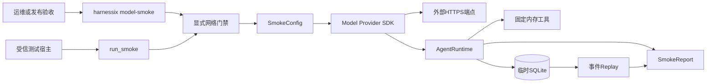

### 7.1 图示说明

1. CLI负责参数、配置文件和退出码，库入口负责固定业务流程；
2. 网络门禁位于配置读取和Provider构造之前，但只表达“允许继续”，不表达“端点可信”；
3. Provider持有从环境读取的凭据并访问配置给出的HTTPS端点；
4. Agent Runtime持久化Thread、Turn、模型尝试、Usage、工具和审批事实；
5. 工具只读取进程内随机标记，不访问外部资源；
6. 报告由Turn投影和Replay结果计算，不直接复制Provider响应对象。

### 7.2 信任分区

| 区域 | 信任假设 | 主要资产 | 当前控制 |
|---|---|---|---|
| CLI调用者 | 有权决定本次是否联网 | 网络授权、配置路径 | 显式Flag、固定参数集 |
| 配置文件 | 内容可能错误；当前路径对象未安全认证 | 端点、模型、凭据变量名 | 16 KiB、普通文件、严格JSON、合同校验 |
| 进程环境 | 受信启动环境 | API Key、自定义Header变量 | 只按名称读取、Key格式检查、拒绝自定义Header |
| Provider端点 | 外部且可能不可信 | 凭据、请求、响应、费用 | HTTPS、禁代理、禁重定向、传输预算；无主机白名单 |
| 临时Session | 私有本地状态 | Prompt、模型内容、工具结果、Usage | 独立临时目录、0600 SQLite、正常退出清理 |
| 公开报告 | 可进入CI或验证证据 | 通过结论、计数 | 字段白名单、闭集枚举、无原文 |

## 8. 包结构、依赖方向与阅读顺序

```text
src/harnessix/smoke/
├── __init__.py       # 包标记；不导出高层快捷对象
├── contracts.py      # Config、Report、枚举与跨字段校验
├── runner.py         # Provider工厂、固定工具、三场景、报告计算
└── cli.py            # 安全参数错误、配置文件读取、日志与退出码
```

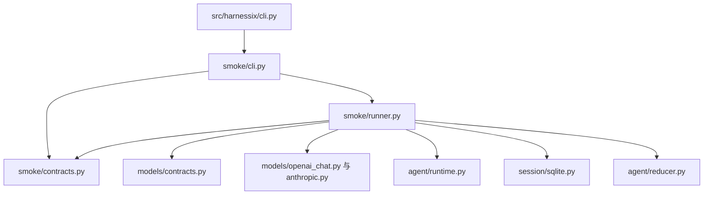

推荐阅读顺序：

1. [`contracts.py`](../../src/harnessix/smoke/contracts.py)的`SmokeConfig`和`SmokeReport`；
2. [`runner.py`](../../src/harnessix/smoke/runner.py)的`run_smoke`门禁和异常边界；
3. 同文件的`_exercise`，理解关闭、重开、审批和Replay；
4. 同文件的`_MarkerTool`与`_report`，理解副作用和通过条件；
5. [`cli.py`](../../src/harnessix/smoke/cli.py)的配置读取、日志和退出码；
6. [`models/_provider_io.py`](../../src/harnessix/models/_provider_io.py)的凭据读取；
7. [`tests/smoke`](../../tests/smoke/)的真实SDK离线传输、故障和SIGINT回归。

## 9. 公共入口与延迟导入

### 9.1 顶层CLI分派

[`src/harnessix/cli.py`](../../src/harnessix/cli.py)在解析Action Plane环境配置之前识别`model-smoke`，随后延迟
导入`harnessix.smoke.cli.main`。因此帮助、禁用路径和配置错误不会先构造Action Service。

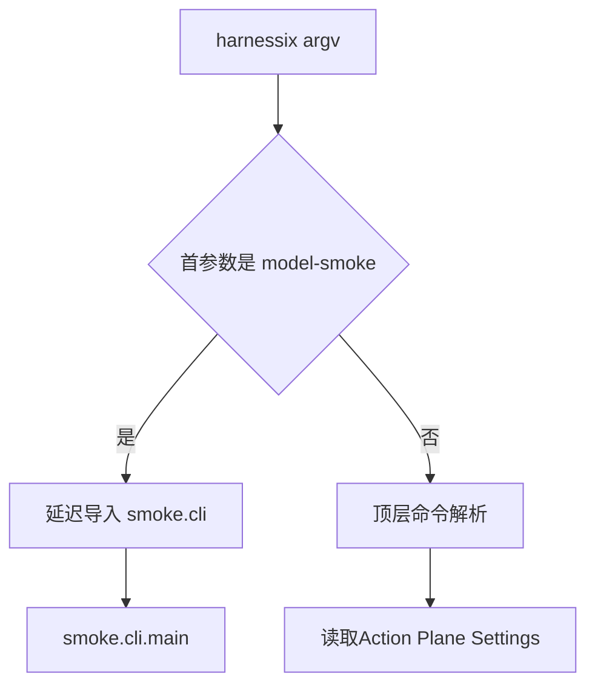

### 9.2 库入口

```python
async def run_smoke(
    config: SmokeConfig,
    *,
    allow_network: bool = False,
    provider_factory: ProviderFactory | None = None,
) -> SmokeReport: ...
```

默认`allow_network=False`。`ProviderFactory`是接收已校验`SmokeConfig`、返回异步上下文管理器的Callable；上下文
产出满足`ModelProvider`端口的对象。内置工厂只根据`provider`选择OpenAI或Anthropic Adapter，不开放模块名或类名配置。

### 9.3 执行身份字段

| 条件 | `execution` | 能证明什么 | 不能证明什么 |
|---|---|---|---|
| 未传`provider_factory` | `sdk_default` | 使用内置工厂路径 | 网络已到达、平台已计费、目标为官方服务 |
| 传入`provider_factory` | `injected` | 工厂由宿主提供 | 一定离线、一定安全或一定未计费 |

## 10. Config v1合同

`SmokeConfig`继承严格、冻结的合同基类，并显式`extra="forbid"`。库入口会通过JSON序列化/反序列化重新校验，
防止调用者使用Pydantic `model_copy(update=...)`绕过字段限制。

### 10.1 字段设计

| 字段 | 类型与默认值 | 边界 | 业务含义 |
|---|---|---|---|
| `spec_version` | 固定字符串 | `harnessix.model-smoke-config/v1` | 配置合同版本 |
| `provider` | 枚举 | `openai_chat`或`anthropic` | Adapter协议族 |
| `base_url` | 字符串 | 最长2048，HTTPS，无认证信息/Query/Fragment/空白 | Provider基础端点 |
| `model` | 字符串 | 1～256，仅字母数字及`_.:/-` | 请求模型标识 |
| `api_key_env` | 字符串 | 大写环境变量标识，最长128 | 凭据引用名，不是凭据值 |
| `scenario` | 枚举，默认`text` | `text/tool/approval` | 固定验收场景 |
| `max_output_tokens` | 严格整数，默认128 | 1～512 | 每次Provider请求输出上限 |
| `max_tokens` | 严格整数，默认2048 | 1～8192 | Turn已知Token预算检查 |
| `timeout_seconds` | 严格有限数，默认30 | 大于0且不超过60 | Provider总Deadline与Turn预算 |
| `output_token_parameter` | 可空枚举 | OpenAI协议为两种名称；Anthropic禁止设置 | OpenAI-compatible参数适配 |

### 10.2 URL校验边界

[`ModelHTTPConfig.validate_url`](../../src/harnessix/models/config.py)要求：

- Scheme严格为`https`；
- 存在Hostname；
- URL不含Username、Password、Query或Fragment；
- 原始字符串不含空白；
- Port必须可由标准库解析且在合法范围；
- 返回值移除末尾斜杠。

当前校验**不执行**DNS解析、私网/环回阻断、域名白名单、证书Pinning、组织归属、端口白名单或路径白名单。
因此任意语法合法的HTTPS主机均可通过Config v1。

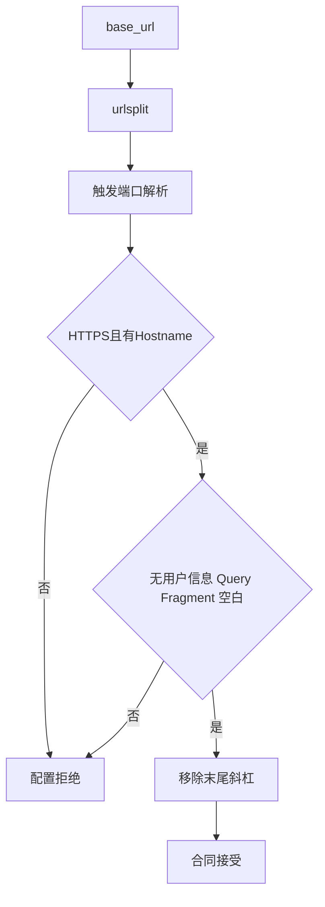

## 11. Config到Provider配置的派生

`SmokeConfig.provider_config()`先构造通用`ModelHTTPConfig`，再转换为具体Adapter配置。调用者不能覆盖派生的重试、
传输或能力字段。

| 派生字段 | 文本 | 工具 | 审批 |
|---|---:|---:|---:|
| `capabilities.tool_calls` | false | true | true |
| `parallel_tool_calls` | false | false | false |
| `max_attempts` | 1 | 1 | 1 |
| `retry_delay_seconds` | 0 | 0 | 0 |
| `max_request_bytes` | 65,536 | 65,536 | 65,536 |
| `max_response_bytes` | 524,288 | 524,288 | 524,288 |
| `max_frame_bytes` | 65,536 | 65,536 | 65,536 |
| `max_chunks` | 2,048 | 2,048 | 2,048 |

`io_timeout_seconds=min(10, timeout_seconds)`；Provider总Deadline仍使用`timeout_seconds`。OpenAI协议默认输出参数是
`max_completion_tokens`，兼容平台需要`max_tokens`时必须显式配置。Anthropic不接受该字段。

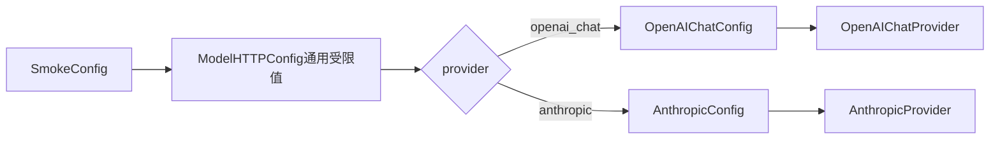

## 12. 网络门禁语义

### 12.1 库门禁

`run_smoke`使用身份判断`allow_network is True`。`False`、`None`、`0`、`1`和字符串`"true"`均不会通过。
门禁失败立即返回：

```json
{
  "execution": "sdk_default",
  "reason": "network_not_enabled",
  "attempts_started": 0,
  "tool_calls": 0
}
```

实际JSON还包含合同默认字段。该路径不重新校验Config，也不调用Provider工厂。

### 12.2 CLI门禁

CLI只有`store_true`形式的`--allow-network`。Flag缺失时：

1. 不读取`--config`指向的文件；
2. 不读取Action Plane环境变量；
3. 不构造Provider或读取API Key；
4. 输出`network_not_enabled`报告；
5. 以退出码2结束。

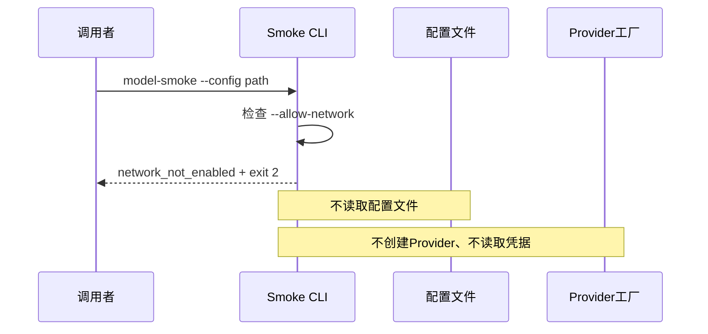

### 12.3 门禁不提供的保证

Flag只表达调用者允许本次流程进入Provider构造。它不确认：

- `base_url`属于预期供应商；
- `api_key_env`中的Key被授权发送到该端点；
- 请求费用位于某个人民币预算内；
- Provider工厂一定联网或一定离线；
- 模型、地域和价格已经核对；
- 同一命令没有被外部调度器重复执行。

## 13. CLI配置文件读取

### 13.1 当前算法

[`_read_config`](../../src/harnessix/smoke/cli.py)执行以下步骤：

```text
descriptor = os.open(path, O_RDONLY | O_NONBLOCK)
with fdopen(descriptor, "rb"):
    若 fstat(fd) 不是普通文件：拒绝
    raw = read(16_385)
若 len(raw) > 16_384：拒绝
text = UTF-8严格解码
value = strict_json(text)
return SmokeConfig.model_validate(value)
```

`O_NONBLOCK`避免FIFO读取阻塞；打开后的`fstat`拒绝目录和FIFO；16,385字节哨兵读取使上限判断不依赖文件声明
长度。`strict_json`拒绝重复Key、`NaN`、`Infinity`及非JSON结构，Pydantic继续拒绝额外字段和宽松类型转换。

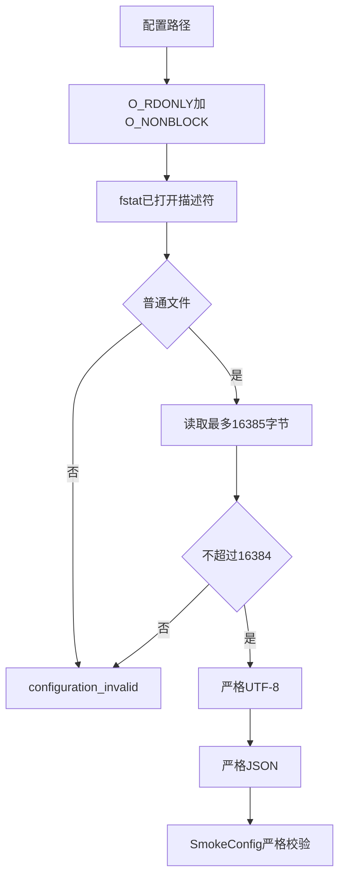

### 13.2 当前安全缺口

当前打开Flags没有`O_NOFOLLOW`，并且没有校验Owner、Mode、Hardlink、父目录、打开前后身份或配置来源签名。
受控探针确认：

- 指向普通文件的符号链接会被跟随并接受；
- 权限为`0644`的配置文件会被接受；
- 配置可指定任意语法合法的HTTPS端点；
- 配置可选择任意符合格式的环境变量名。

四项组合后，能替换配置路径或目标文件的本地主体可把进程环境中的指定Key发送到非预期HTTPS端点。这不是
配置中直接存储Key的问题，而是“端点与凭据引用未形成受信绑定”。在安全打开和端点策略完成前，真实Smoke配置
必须位于调用者独占目录，并由调用者核对实际文件对象、权限、端点和变量名。

## 14. 固定场景矩阵

| 场景 | 固定Prompt目标 | Tool | 最大模型步骤 | 期望尝试数 | 期望工具执行数 | 额外通过条件 |
|---|---|---|---:|---:|---:|---|
| `text` | 只输出`HARNESSIX_SMOKE_OK` | `NoTools` | 1 | 1 | 0 | 最终文本精确相等 |
| `tool` | 调一次唯一内存工具，再只输出Marker | `_MarkerTool` | 2 | 2 | 1 | ToolResult成功且最终文本精确相等 |
| `approval` | 与工具场景相同 | 需要审批的`_MarkerTool` | 2 | 2 | 1 | 重开前未执行、按原指纹批准、Replay一致 |

所有Prompt在源码中固定，Config合同不包含`prompt`字段。额外字段会被拒绝，CLI没有Prompt参数。

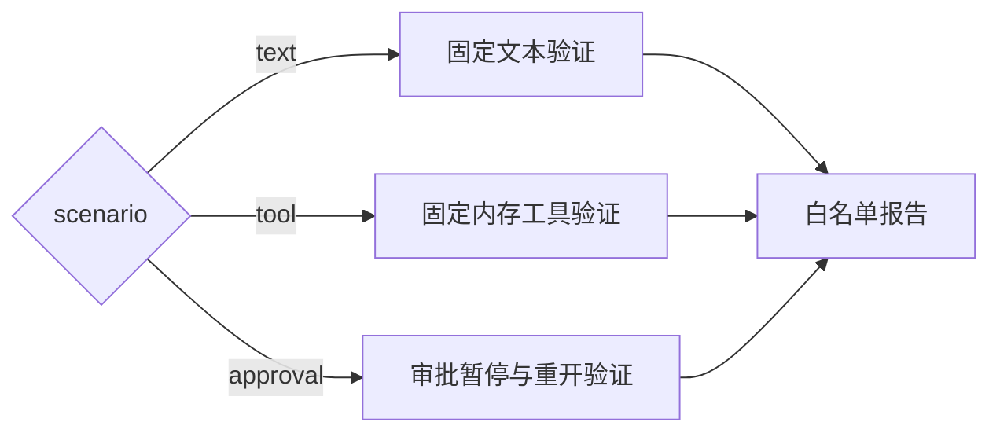

## 15. 文本场景详细流程

### 15.1 时序

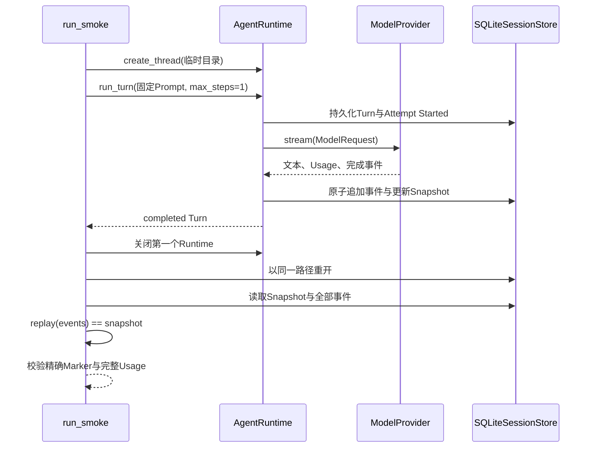

### 15.2 通过条件

文本场景必须同时满足：

1. Turn状态为`completed`；
2. 最终Assistant文本去除首尾空白后精确等于`HARNESSIX_SMOKE_OK`；
3. 工具执行计数为0；
4. 所有已存在的ToolResult均为成功；
5. `usage_is_complete=true`；
6. `model_attempts`长度为1；
7. Replay得到的Thread与SQLite Snapshot严格相等。

响应包含前后空白可以通过，但增加解释文本、Markdown或不同大小写均不能通过。

## 16. 内存工具设计

### 16.1 ToolDescriptor

`_MarkerTool`每次构造时生成`HARNESSIX_`加32个十六进制字符的随机标记，并公开唯一工具：

| 字段 | 固定值 | 设计作用 |
|---|---|---|
| `name` | `smoke.read_marker` | 避免与产品工具重名 |
| `version` | `1` | 固定工具身份 |
| `input_schema` | 空Object且`additionalProperties=false` | 禁止任意参数 |
| `effect_class` | `read_only` | 表达只读语义 |
| `risk_level` | `low` | 不触发高风险策略 |
| `requires_idempotency` | false | 工具本身以调用计数拒绝重复 |
| `requires_approval` | 仅审批场景为true | 触发Agent审批暂停 |
| `supports_reconciliation` | false | 不产生外部未知副作用 |

### 16.2 执行语义

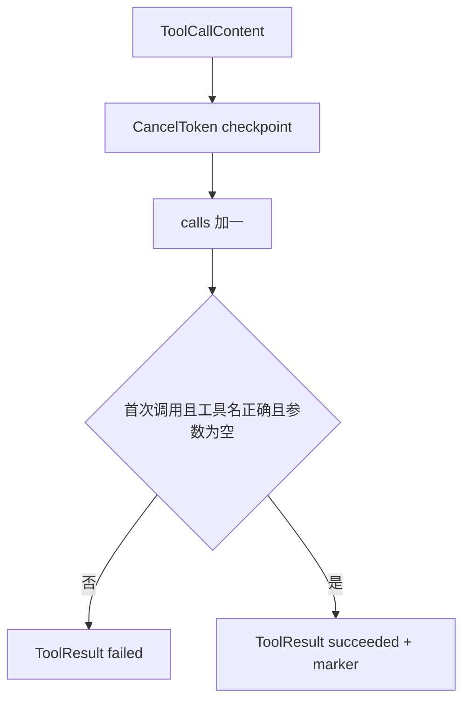

工具不访问文件、网络、环境变量或数据库；随机标记只存于当前`_MarkerTool`实例内。第二次调用、错误工具名或非空参数
均返回失败结果，不抛出包含原始参数的异常。该计数器不是线程安全通用工具实现，只服务单次串行Smoke。

## 17. 工具场景详细流程

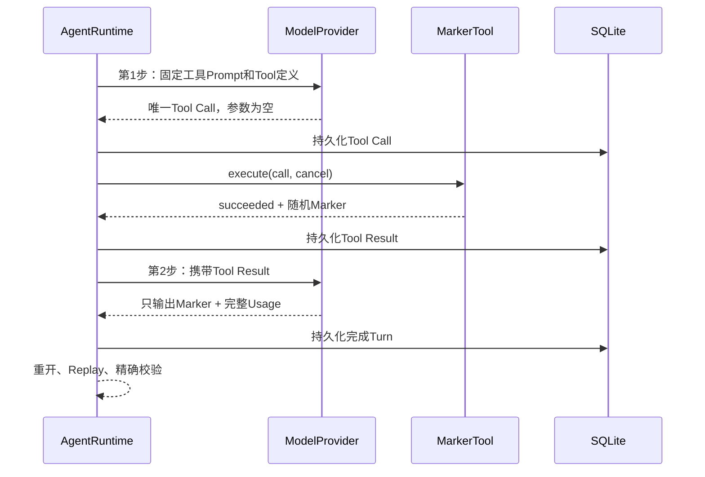

最终文本提取不是简单拼接Turn全部Assistant文本。`_report`先找到最后一个`ToolResultContent`，仅拼接其后的
`assistant_message`文本；这避免第一步模型的非最终文本被纳入Marker比较。若没有ToolResult，则拼接全部Assistant文本，
随后因工具调用次数或内容不满足而失败。

工具场景的停止条件为：

- 第一步未产生工具调用时，Runtime可能完成或失败，但报告不得通过；
- 工具参数错误时，内存工具返回失败，报告不得通过；
- 模型第二步再次调用工具时，计数大于1，报告不得通过；
- 第一步已耗尽总Token检查阈值时，不发起第二次Provider请求；
- 任一步Usage不完整时，不得通过；
- 最终文本不是随机Marker精确值时，不得通过。

## 18. 审批重开场景详细流程

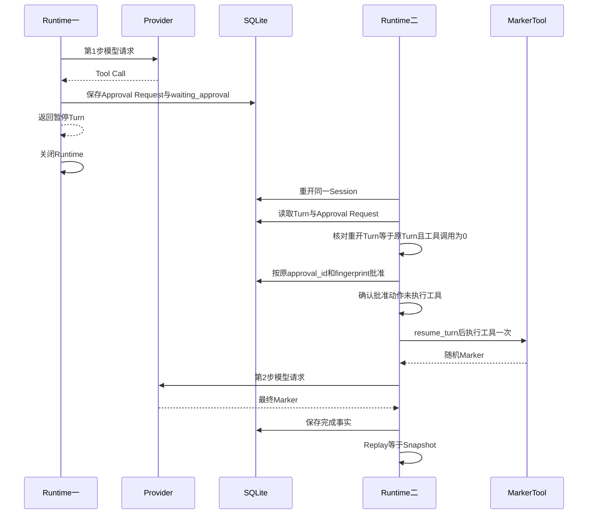

### 18.1 审批证据定义

`approval_restart_verified=true`需要在恢复前同时满足：

1. 重开后的Turn状态是`waiting_approval`；
2. 重开后的Turn与第一个Runtime返回的Turn严格相等；
3. 恰好存在一个`ApprovalRequestContent`；
4. 工具尚未执行；
5. `reply_approval`使用原`approval_id`和`request_fingerprint`；
6. 仅记录批准决定后工具仍未执行；
7. 随后由`resume_turn`驱动工具执行和第二步模型请求。

固定批准Actor为内部受控夹具说明，不来自用户输入。选择`approval`场景并显式启用网络，即表示允许Smoke自动批准
这一个内存工具；该决定不适用于任何产品工具。

### 18.2 不属于当前证据的恢复范围

- 不终止Python进程；
- 不在Provider请求中间崩溃；
- 不在审批提交事务中间断电；
- 不验证另一个主机或进程接管；
- 不验证数据库WAL残留恢复；
- 不验证审批过期、拒绝、撤销或并发回答；
- 不验证外部有副作用工具的`UNKNOWN`与Reconcile。

## 19. 临时Session与Replay

### 19.1 生命周期

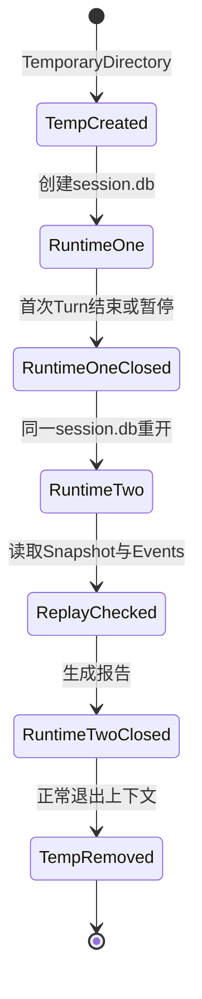

每次`run_smoke`调用创建独立`TemporaryDirectory(prefix="harnessix-smoke-")`。Session路径固定为目录下
`session.db`。`SQLiteSessionStore.initialize()`在POSIX测试中保证：

- 临时父目录Mode为`0700`；
- SQLite主文件Mode为`0600`；
- Session不包含测试API Key Canary；
- Runtime二关闭后临时目录不再存在。

这些断言来自[`test_real_sdk_scenarios_private_store_reopen_replay`](../../tests/smoke/test_runner.py)，不应外推为
Windows ACL、磁盘加密、安全擦除或进程强杀后的清理承诺。

### 19.2 Replay判定

```python
snapshot = await reopened.get_thread(thread.thread_id)
replay_verified = replay(await reopened.events(thread.thread_id)) == snapshot
```

这是完整对象相等检查，不只比较Turn状态。它依赖Session Store返回的事件顺序和Reducer当前实现。若测试注入错误Replay
结果，即使Turn内容和Usage均正确，报告仍为`check_failed`。

## 20. Turn预算与请求预算

`SmokeConfig.budget()`派生正式Agent `Budget`：

| Budget字段 | 文本 | 工具/审批 | 含义 |
|---|---:|---:|---|
| `max_steps` | 1 | 2 | Agent模型步骤上限 |
| `max_tokens` | 配置值，默认2048 | 同左 | 已知累计Token检查阈值 |
| `timeout_seconds` | 配置值，默认30 | 同左 | Turn总体预算 |
| `max_output_chars` | 8192 | 8192 | Agent输出字符上限 |
| `max_tool_calls_per_step` | 1 | 1 | 单步工具调用上限 |

Provider配置另有每请求`max_output_tokens`。二者作用不同：

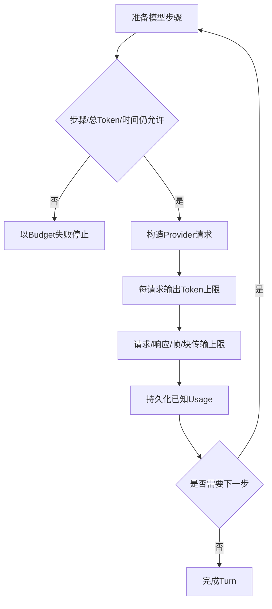

### 20.1 不能视为金额硬上限的原因

1. 输入Token在请求前不能由当前模块精确预扣；
2. Provider可能在网络响应或Usage到达前完成计费；
3. `attempts_started`记录请求意图，不证明网络到达情况；
4. 不同模型、地域、服务等级、缓存和推理Token价格不同；
5. 当前Report不包含价格快照、币种、费率上下文或Provider账单ID；
6. 超时、取消、截断或错误响应可能没有完整Usage；
7. 外部调度器可重复运行命令，当前模块没有聚合预算。

因此`max_tokens`和`max_output_tokens`只能限制运行和请求形态，不能证明“本次最多花费某金额”。

## 21. 尝试、重试与收费语义

### 21.1 当前无重试设计

Smoke派生`max_attempts=1`且SDK本身配置`max_retries=0`。每个Agent步骤最多一个Provider尝试：

- 文本正常路径恰好1个`ModelAttemptStarted`；
- 工具与审批正常路径恰好2个；
- 429、5xx、Transport错误均不会在同一步自动重试；
- 第二个步骤属于工具结果后的新模型请求，不是失败重试。

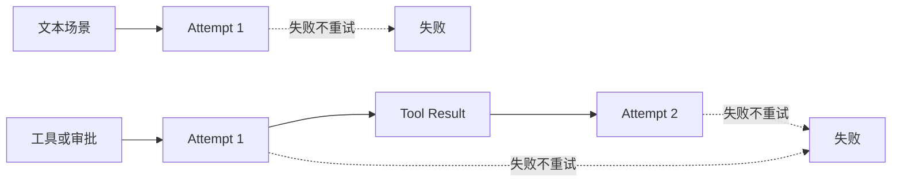

### 21.2 `attempts_started`解释

该字段来自`len(turn.model_attempts)`，表示Agent账本已观察的尝试开始数。它不能单独证明：

- HTTP请求已完整写入网络；
- 服务端已接收或处理；
- 供应商已计费；
- 供应商只计费一次；
- 请求没有被网关层重放。

若Provider工厂构造前失败或顶层异常使Turn不可读取，字段为`null`而不是0。只有明确未通过网络门禁时设置为0。

## 22. Timeout语义

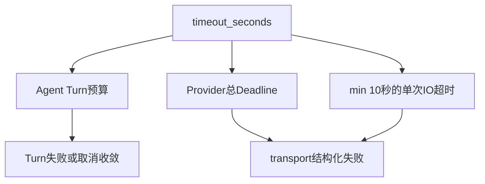

`timeout_seconds`同时进入Agent Budget和Provider配置；具体先触发哪一层取决于调度和当前执行阶段。Provider的
`wait_for_io`按总Deadline包围SDK创建请求及每次流读取，底层HTTP Client使用最多10秒的IO Timeout。

当前未单独配置DNS、Connect、Write、Pool和Read各阶段预算，也未在Report中区分具体超时阶段。Transport Timeout
被映射为Provider `transport`失败，且不重试。

## 23. 取消与SIGINT

### 23.1 库级取消

`run_smoke`只捕获`Exception`，不会吞掉继承`BaseException`的`asyncio.CancelledError`。取消通过Agent和Provider的
`CancelToken`检查点传播；Provider流与上下文、Agent Runtime和临时目录按上下文退出顺序清理。

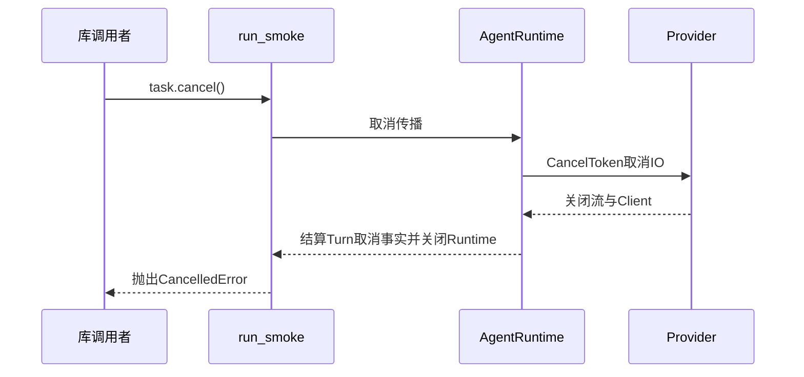

### 23.2 CLI SIGINT

CLI在`asyncio.run`边界捕获`KeyboardInterrupt`，输出`reason=cancelled`并以130退出。报告中的尝试和Token保持
`null`，因为CLI异常分支不重新打开已删除的私有Session猜测消费。真实子进程测试确认两个Provider路径均使Turn
状态收敛为`cancelled`并清理临时Workspace。

### 23.3 当前取消缺口

- 进程收到SIGKILL、断电或解释器崩溃时没有机会输出报告；
- 临时目录是否残留由操作系统和Python清理时机决定；
- CLI取消报告不关联私有Turn ID；
- 没有持久运行记录可在下一进程自动补写取消证据；
- 清理失败不会覆盖原取消，但也没有单独运维告警。

## 24. 报告生成算法

`_report`只接收已校验Config、执行类型、最终Turn、内存Tool以及审批和Replay布尔证据，不接收原始HTTP响应。

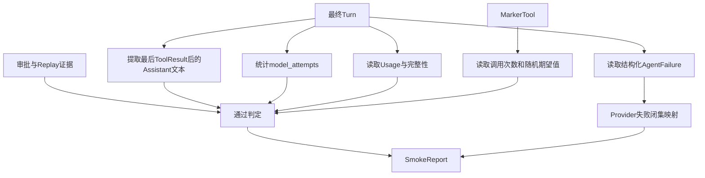

最终Assistant文本由符合`kind="assistant_message"`的`TextContent`拼接并`strip()`。Tool Result只检查所有出现的
结果均为`succeeded`，再结合Tool对象的精确调用次数判定工具证据。

## 25. Report v1合同

### 25.1 字段设计

| 字段 | 类型 | 来源与含义 |
|---|---|---|
| `spec_version` | 固定字符串 | `harnessix.model-smoke-report/v1` |
| `provider` | 可空闭集 | 已进入场景报告时的Provider种类 |
| `scenario` | 可空闭集 | 已进入场景报告时的固定场景 |
| `execution` | 闭集 | 默认SDK工厂或注入工厂 |
| `reason` | 闭集 | 顶层结果分类 |
| `turn_status` | 可空`TurnStatusV18` | 最终可读取Turn状态 |
| `failure_category` | 可空闭集 | Agent结构化失败类别 |
| `provider_failure` | 可空`ResponseFailed` | Provider闭集错误码与可重试标志 |
| `attempts_started` | 可空非负整数 | 持久化模型尝试意图数 |
| `known_input_tokens` | 可空非负整数 | 已知输入Token下界 |
| `known_output_tokens` | 可空非负整数 | 已知输出Token下界 |
| `usage_complete` | 布尔值 | 本Turn用量是否完整 |
| `tool_calls` | 可空非负整数 | 当前内存Tool实例执行次数 |
| `content_verified` | 布尔值 | 最终文本是否精确等于期望Marker |
| `approval_restart_verified` | 布尔值 | 审批重开前置证据是否满足 |
| `replay_verified` | 布尔值 | 事件Replay是否等于Snapshot |

### 25.2 固定Turn状态版本

Report引用`TurnStatusV18`而不是当前可扩展的`TurnStatus`，使已提交v1 Schema保持稳定。其闭集包括接受、上下文、
模型、工具、审批、Action等待、完成、失败、取消和中断等v18状态，但不包含后来加入的持久提问状态。
Smoke固定场景不产生用户提问，因此当前流程可映射；若未来场景引入提问，必须升级Report合同而不能静默扩展v1。

## 26. 通过不变量

只有以下逻辑整体为真时才能构造`reason="passed"`：

```text
provider != null
AND scenario != null
AND turn_status == completed
AND failure_category == null
AND provider_failure == null
AND usage_complete == true
AND content_verified == true
AND replay_verified == true
AND known_input_tokens != null
AND known_output_tokens != null
AND attempts_started == (1 if text else 2)
AND tool_calls == (0 if text else 1)
AND (scenario != approval OR approval_restart_verified == true)
```

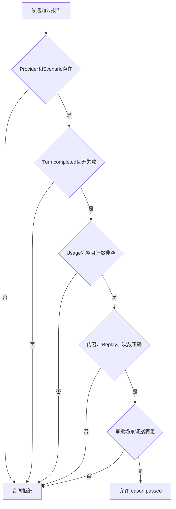

`_report`先按相同语义计算`passed`，`SmokeReport.validate_pass`再进行合同层二次防御。测试直接构造缺证据的
`SmokeReport(reason="passed")`必须失败。

## 27. 非通过报告的一致性边界

当前跨字段Validator只约束`reason="passed"`。对于其他Reason，合同只校验字段类型和枚举，不校验组合语义。
例如下列自相矛盾对象当前可被接受：

- `network_not_enabled`同时带有99个尝试；
- `configuration_invalid`同时声称内容、审批和Replay均已验证；
- 文本场景带有17次工具调用；
- `cancelled`同时带有`turn_status=completed`；
- `check_failed`不带Provider和Scenario。

内置代码路径不会主动生成其中大部分组合，但公共合同允许第三方构造。消费方不得仅按单个布尔字段推断结论，应首先
检查`reason`，并把非`passed`报告整体视为未通过。后续Report v2应为每个Reason建立互斥判别联合或完整Validator。

## 28. Reason分类与生成位置

| Reason | 当前生成条件 | Provider/Turn可能存在 | CLI退出码 |
|---|---|---|---:|
| `passed` | 所有通过不变量成立 | 是 | 0 |
| `network_not_enabled` | 门禁不是严格True | 否 | 2 |
| `configuration_invalid` | Config重校验、配置文件、凭据或Provider参数无效 | 可能否 | 2仅限CLI读取失败；运行期通常1 |
| `dependency_missing` | 默认/注入工厂同步抛`ImportError` | 否 | 1 |
| `runtime_failed` | Turn未完成，或外层捕获`KernelError` | 可能 | 1 |
| `check_failed` | Turn完成但至少一项证据失败 | 是 | 1 |
| `internal_error` | 工厂或执行路径出现未归一化`Exception` | 可能未知 | 1 |
| `cancelled` | CLI捕获`KeyboardInterrupt` | 私有Turn可能存在 | 130 |

库入口的`CancelledError`不转成Report；`cancelled`主要由CLI生成。顶层`KernelError`报告只保留Failure Category，
不会复制Kernel错误码或消息。

## 29. Provider失败映射

若Turn错误类别为`provider`，`_report`移除Agent错误码的`provider_`前缀并尝试构造`ResponseFailed`。合法闭集包括：

| Code | 典型来源 | `retryable`可能值 |
|---|---|---|
| `invalid_request` | 请求映射、4xx参数错误 | false |
| `authentication` | 401/403或供应商认证类型 | false |
| `rate_limit` | 429 | true |
| `quota` | 配额/计费错误 | false |
| `content_policy` | 拒绝或内容过滤 | false |
| `provider_internal` | 5xx或SDK内部错误 | true |
| `transport` | 连接、超时、408/409/504 | true |
| `invalid_provider_output` | 非法SSE、流状态或响应结构 | false |
| `context_overflow` | 上下文超限 | false |
| `cancelled` | Provider协议闭集保留值 | 依来源 |
| `unknown` | 无法映射的Agent Provider错误码 | false |

虽然某些错误标记`retryable=true`，Smoke仍固定`max_attempts=1`，不会自动重试。该标志只描述错误性质。

## 30. 错误边界与原文隔离

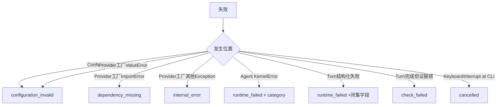

下列任意字符串不进入公开报告：

- API Key值；
- `base_url`与模型名；
- 环境变量名；
- Prompt和随机Marker；
- Tool参数与Tool输出正文；
- Provider响应ID、消息ID和供应商错误正文；
- Session临时路径；
- 捕获异常的消息或堆栈。

HTTP 401、403、429和503离线夹具会在错误Body中放入Canary，测试确认报告只出现闭集错误码。恶意响应元数据中的
模型与响应ID同样不会被复制到报告。

## 31. 凭据读取与传输边界

### 31.1 当前数据流

```mermaid
flowchart LR
    Config[api_key_env变量名] --> Read[models._provider_io.read_key]
    Env[进程环境] --> Read
    Headers[Provider CUSTOM_HEADERS环境变量] --> Validate[validate_key]
    Read --> Validate
    Validate --> SDK[SDK Client]
    SDK --> HTTPS[配置指定的HTTPS base_url]
    HTTPS --> Provider[外部Provider]
```

Provider构造函数调用`read_key(config)`，以`os.environ.get(config.api_key_env, "")`读取Key。`validate_key`要求：

- 非空；
- 不超过8 KiB；
- 每个字符为ASCII 33～126；
- 对应的`OPENAI_CUSTOM_HEADERS`或`ANTHROPIC_CUSTOM_HEADERS`环境变量必须为空。

禁用自定义Header用于避免SDK环境Header携带另一端点的认证信息。HTTP Client同时配置`trust_env=False`和
`follow_redirects=False`，不采用系统代理环境且不跟随重定向。

### 31.2 当前未形成的端点—凭据绑定

Config只保存变量名，确实避免Key直接写入JSON；但这不等于凭据路由安全。当前没有合同证明某个Key只能发送给：

- 某个Provider组织；
- 某组主机名或证书；
- 某个地域端点；
- 某个模型或项目；
- 某个请求预算或有效期。

配置路径可被替换时，攻击者可同时改变`base_url`与`api_key_env`。因此安全加固需要把安全文件打开、端点Allowlist、
凭据Scope和配置签名作为一个根因治理，而不能只补充“配置里不要写Key”的说明。

## 32. HTTP与流预算

```mermaid
flowchart TD
    Request[SDK请求Body] --> ReqCap{不超过64 KiB}
    ReqCap -- 否 --> Invalid[invalid_request或provider failure]
    ReqCap -- 是 --> Wire[HTTPS Transport]
    Wire --> RespCap{累计响应不超过512 KiB}
    RespCap -- 否 --> InvalidOutput[invalid_provider_output]
    RespCap -- 是 --> FrameCap{单帧不超过64 KiB}
    FrameCap -- 否 --> InvalidOutput
    FrameCap -- 是 --> ChunkCap{最多2048块}
    ChunkCap -- 否 --> InvalidOutput
    ChunkCap -- 是 --> Parser[SSE状态机]
```

OpenAI路径要求响应`Content-Type`为`text/event-stream`，并检查传输层记录了终止标记；Anthropic路径使用独立
HTTPX2 Client和Messages流状态机。两者都关闭代理环境、重定向和SDK重试。具体流协议、Usage与Attempt语义以
[Model Runtime模块设计](models.md)为准。

这些上限控制内存与解析风险，不证明供应商不会在小响应下执行高费用计算，也不限制TLS握手、DNS答案或目标端口。

## 33. 日志与标准输出

### 33.1 CLI日志策略

允许执行后，CLI保存`logging.root.manager.disable`原值，然后调用`logging.disable(logging.CRITICAL)`；无论成功、
失败或异常，`finally`恢复原值。目的是防止SDK、HTTP库或宿主Logger把凭据/响应原文写到终端。

```mermaid
sequenceDiagram
    participant C as Smoke CLI
    participant L as Python logging
    participant R as run_smoke
    C->>L: 保存原disable级别
    C->>L: disable(CRITICAL)
    C->>R: 执行固定场景
    R-->>C: Report或异常
    C->>L: finally恢复原级别
    C-->>C: stdout打印单个JSON报告
```

库入口`run_smoke`不修改宿主日志设置。嵌入式调用者必须自行配置Logger、Handler和第三方SDK日志策略。

### 33.2 输出通道

- 参数解析错误：只向stderr输出固定中文句子，不回显参数；
- 其他禁用、配置、运行和取消结果：向stdout输出单行JSON；
- 正常通过：stdout JSON，退出0；
- CLI本身没有报告文件参数，也不原子写入证据文件。

全局禁用Logging会影响同一进程其他线程和任务，因此该CLI设计适用于独立短生命周期进程，不适合作为大型宿主中的
可复用组件。嵌入式系统应直接调用库入口并使用结构化安全遥测。

## 34. 隐私与数据分类

| 数据 | 出现位置 | 是否进入Session | 是否进入Report | 当前保留 |
|---|---|---:|---:|---|
| API Key | 进程环境、SDK Header | 否（正常实现） | 否 | Provider Client生命周期 |
| Base URL | Config、Provider对象 | 否 | 否 | 进程内 |
| 模型ID | Config、Attempt私有事实可能含请求模型 | 是 | 否 | 临时Session |
| 固定Prompt | Agent Turn | 是 | 否 | 临时Session |
| 随机Marker | Tool内存、Tool Result、最终文本 | 是 | 否，仅布尔结果 | 进程与临时Session |
| Token Usage | Agent事件和Turn | 是 | 是，计数 | 临时Session；Report由调用者决定 |
| Provider响应ID | Provider事件与Model Attempt身份 | 是 | 否 | 临时Session |
| 错误正文 | SDK异常内部 | 不应复制 | 否 | 进程内 |
| 临时路径 | Session对象 | Thread Workspace中存在 | 否 | 临时Session |

白名单Report不能阻止恶意Provider在语义文本中反射Key；这类文本可能先进入私有Session，随后只以内容校验失败体现
在Report。临时Session不可作为已脱敏Artifact发布。

## 35. 配置与报告Schema

| 合同 | Pydantic事实源 | 提交Schema | 漂移测试 |
|---|---|---|---|
| Config v1 | [`SmokeConfig`](../../src/harnessix/smoke/contracts.py) | [`model-smoke-config-v1.schema.json`](../../spec/model-smoke-config-v1.schema.json) | [`tests/agent/test_schemas.py`](../../tests/agent/test_schemas.py) |
| Report v1 | [`SmokeReport`](../../src/harnessix/smoke/contracts.py) | [`model-smoke-report-v1.schema.json`](../../spec/model-smoke-report-v1.schema.json) | 同上 |

Schema由当前Pydantic模型生成并在`make spec`中验证，不应手工独立演进。以下变化需要新合同版本：

- 扩展Provider或Scenario闭集；
- 增加金额预算、端点策略、证据ID或请求身份；
- 改变Reason判别语义；
- 扩展冻结Turn状态闭集；
- 改变通过所需尝试数或工具数；
- 把可空消费字段改为必填；
- 增加报告签名或证据链。

仅修正文档或内部实现且不改变序列化合同，不需要改v1 Schema。

## 36. CLI退出码合同

```mermaid
flowchart TD
    Invoke[调用CLI] --> Parse{参数可解析}
    Parse -- 否 --> E2[exit 2 + 固定stderr]
    Parse -- 是 --> Gate{允许网络}
    Gate -- 否 --> E2N[exit 2 + network_not_enabled]
    Gate -- 是 --> Config{配置文件有效}
    Config -- 否 --> E2C[exit 2 + configuration_invalid]
    Config -- 是 --> Run[执行Smoke]
    Run --> Reason{reason}
    Reason -- passed --> E0[exit 0]
    Reason -- KeyboardInterrupt --> E130[exit 130]
    Reason -- 其他 --> E1[exit 1]
```

`configuration_invalid`有两个来源：CLI读取/解析失败时退出2；Provider构造时缺Key或Provider配置失败则由
`run_smoke`返回相同Reason，但CLI退出1。自动化不能只按Reason反推失败阶段，应同时读取退出码。

## 37. Provider兼容边界

### 37.1 OpenAI-compatible

内置`openai_chat`使用锁定OpenAI Python SDK与Chat Completions流式接口。`compatible`只表示请求和SSE形态尝试
兼容，不表示：

- 错误结构、Tool Call增量、Usage或终止帧完全一致；
- `max_completion_tokens`与`max_tokens`均被目标模型接受；
- 并行工具禁用参数被实际遵守；
- 服务等级、缓存、推理Token或地域字段一致；
- 供应商价格和官方OpenAI价格相同。

### 37.2 Anthropic

`anthropic`使用锁定Anthropic SDK与独立HTTPX2 Client，当前只支持非Thinking Messages配置。输出参数由SDK
协议派生，不接受OpenAI专属`output_token_parameter`。

### 37.3 认证结论范围

```mermaid
flowchart LR
    Adapter[Adapter存在] --> Offline[真实SDK加MockTransport通过]
    Offline --> Endpoint[特定真实端点Smoke通过]
    Endpoint --> Model[特定模型与日期证据]
    Model --> Matrix[Provider/地域/模型/版本认证矩阵]
    Matrix --> Production[生产发布支持声明]
```

当前实现已达到前两层；百炼历史记录对一个特定组合达到第四层中的单个样本。尚不存在完整认证矩阵。

## 38. 百炼真实验证证据

[`docs/validation/bailian-2026-09-03.md`](../validation/bailian-2026-09-03.md)记录了华北2北京OpenAI兼容端点、
固定`qwen-plus-2025-01-25`模型和当时锁定SDK的验证。最终结果为：

| 场景 | 模型请求 | 工具执行 | 已知完整用量 | 结果 |
|---|---:|---:|---:|---|
| 文本 | 1 | 0 | 24输入、8输出 | passed |
| 工具复验 | 2 | 1 | 842输入、100输出 | passed |
| 审批复验 | 2 | 1 | 842输入、100输出 | passed |

首次工具失败和一次结构定位请求也被保留，因此文档总计发起7次请求；失败/定位用量不完整，不能根据通过场景Token
推算总费用。该证据不证明当前日期、当前SDK、其他百炼模型、Thinking、原生OpenAI或Anthropic仍兼容。

历史验证发现Tool Call后续流分片可能使用空字符串ID占位，随后以最小兼容修复允许空占位但继续拒绝真实非空身份
漂移。该事实说明真实Smoke用于发现协议差异，但不能替代目标平台官方资料核对和长期回归。

## 39. 成本与价格边界

Smoke Report没有以下字段：

- Price Snapshot ID；
- 币种和金额单位；
- 实际服务等级与推理地域；
- 缓存创建/读取的全部计费上下文；
- 供应商请求或账单ID；
- 预算授权人、预算上限和累计已用金额；
- 失败请求的最终账单状态。

```mermaid
flowchart TD
    SmokeUsage[Smoke已知Token] --> Context{计费上下文完整}
    Price[版本化价格快照] --> Context
    Context -- 否 --> Unknown[金额未知]
    Context -- 是 --> Estimate[事后成本估算]
    Estimate --> Bill{供应商账单对账}
    Bill -- 否 --> Estimated[仅估算]
    Bill -- 是 --> Reconciled[可对账金额]
```

Harnessix已有独立版本化Token成本估算能力，但Smoke没有把价格上下文与报告绑定。发布门禁不得把Report中的
Token乘以一个默认单价后宣称为实际费用。

## 40. 可观测性现状

Smoke当前没有直接调用Harnessix Observability端口，不创建专用Span、Metric或结构化Log目录。可获得的事实只有：

- 公开`SmokeReport`；
- 临时Session中的Agent事件和快照，但正常退出即删除；
- CLI进程退出码；
- 外部Provider和网关自有日志/账单；
- 测试中的MockTransport请求记录。

CLI还主动禁用Python Logging，因此正式运维无法从当前命令获得阶段时延、请求开始/结束时间、失败阶段或关联ID。

### 40.1 目标信号目录

```mermaid
flowchart LR
    Run[Smoke Run] --> Span[smoke.run Span]
    Run --> Counter[按Provider/Scenario/Reason计数]
    Run --> Latency[阶段时延直方图]
    Run --> Budget[尝试与Token下界指标]
    Run --> Evidence[持久证据ID]
    Span --> Safe[仅低基数白名单属性]
    Counter --> Safe
    Latency --> Safe
    Budget --> Safe
```

目标遥测不得记录Endpoint、Model、Prompt、Key变量名、Marker、响应ID或错误正文。需要诊断具体Endpoint时，应通过
受控私有配置摘要和证据登记关联，而不是添加高基数明文标签。

## 41. 安全威胁模型

### 41.1 主要攻击面

```mermaid
flowchart TD
    Attacker[攻击者] --> ConfigSwap[替换配置或符号链接目标]
    ConfigSwap --> Endpoint[恶意HTTPS端点]
    ConfigSwap --> EnvName[选择敏感环境变量名]
    EnvName --> Credential[Provider读取变量值]
    Credential --> Endpoint
    Attacker --> ProviderBody[恶意SSE或错误正文]
    ProviderBody --> Session[进入私有Session或解析器]
    ProviderBody --> ReportGuard[白名单报告阻断原文]
    Attacker --> Scheduler[重复调度]
    Scheduler --> Cost[累计外部费用]
```

### 41.2 当前缓解与缺口

| 威胁 | 当前缓解 | 剩余缺口 |
|---|---|---|
| 未授权联网 | 默认关闭、严格True门禁 | 外部脚本可重复附加Flag |
| 配置注入任意字段 | 严格JSON与额外字段拒绝 | 合法字段仍可路由任意HTTPS端点 |
| FIFO/目录阻塞 | `O_NONBLOCK`与`fstat`普通文件 | 会跟随Symlink，无Owner/Mode/Hardlink检查 |
| 明文Key写入配置 | 合同只允许环境变量名 | 可选择任意变量名，未与Endpoint绑定 |
| 代理与重定向泄露 | `trust_env=false`、`follow_redirects=false` | DNS、恶意证书合法域名和直连私网未限制 |
| 自定义Header污染 | 对应环境变量非空即拒绝 | 其他SDK环境行为需随依赖升级复核 |
| 响应正文泄露 | Report白名单、CLI禁Logging | 私有Session仍可能存语义反射内容 |
| 无限响应 | 请求/响应/帧/块上限 | TLS/DNS和供应商计算成本不受该上限控制 |
| 自动重试增费 | SDK与Adapter均零重试 | 外部调度器重复运行无聚合预算 |
| 伪造通过报告 | `passed`跨字段Validator | 非通过组合不一致；报告无签名/来源身份 |

## 42. 平台与部署边界

| 环境 | 当前实现状态 | 需要单独验证的事项 |
|---|---|---|
| macOS | 本地开发与测试路径可运行 | Keychain集成、发行签名、临时文件策略 |
| Linux | Python与SDK路径可运行 | Container CA、DNS/Egress、只读文件系统、Secret注入 |
| Windows | Python逻辑可运行但POSIX Mode语义不可直接复用 | ACL、Symlink权限、临时目录删除、Ctrl-C、SDK与证书库 |
| CI | 默认应只运行MockTransport | 禁止真实Key、网络隔离、依赖矩阵 |
| 生产发布流水线 | 可显式调用，但不应作为无预算健康检查 | 端点白名单、凭据Scope、证据保存、金额与频率预算 |

Smoke不需要数据库服务或远程中间件。SQLite只存在于本次临时目录。若未来保存证据，应使用独立只含白名单报告的
证据Store，不应直接保留完整临时Session作为公开构建产物。

## 43. 关键类设计

```mermaid
classDiagram
    class SmokeConfig {
      +provider
      +base_url
      +model
      +api_key_env
      +scenario
      +provider_config()
      +budget()
    }
    class SmokeReport {
      +reason
      +turn_status
      +attempts_started
      +known_input_tokens
      +known_output_tokens
      +validate_pass()
    }
    class MarkerTool {
      +marker
      +approval
      +calls
      +definitions()
      +execute()
    }
    class ProviderFactory {
      <<callable>>
      SmokeConfig to AsyncContextManager
    }
    SmokeConfig --> ProviderFactory
    SmokeConfig --> MarkerTool
    MarkerTool --> SmokeReport
    ProviderFactory --> SmokeReport
```

### 43.1 `SmokeConfig`

负责外部输入合同和两个派生函数，不读取环境、不创建SDK、不发起网络。`provider_config()`生成受限Provider配置；
`budget()`生成Agent Budget。

### 43.2 `_MarkerTool`

是Runner私有类，不是公共工具扩展点。状态仅包含随机Marker、是否要求审批和调用计数。其输出会进入私有Session，
公开Report只保留是否精确匹配。

### 43.3 `SmokeReport`

是公开诊断合同，只对通过状态实施强跨字段约束。它不是审计签名、账单、Trace或完整运行快照。

### 43.4 `ProviderFactory`

是类型别名而非运行时协议类。工厂调用发生在网络门禁和Config重校验之后，返回对象必须支持异步上下文管理并产出
`ModelProvider`。同步构造异常按类型映射，进入上下文后的异常由外层执行边界处理。

## 44. 核心业务伪代码

### 44.1 `run_smoke`

```text
execution = injected if provider_factory exists else sdk_default

if allow_network is not True:
    return network_not_enabled(attempts=0, tools=0)

try:
    checked = JSON round-trip validate config
except validation error:
    return configuration_invalid

try:
    context = selected_factory(checked)
except ImportError:
    return dependency_missing
except ValueError:
    return configuration_invalid
except Exception:
    return internal_error

try:
    async with context as provider:
        with private temporary directory:
            return await exercise(checked, execution, provider, directory)
except KernelError as error:
    return runtime_failed(failure_category=error.category)
except Exception:
    return internal_error
```

取消和KeyboardInterrupt不在最后两个`except Exception`内。

### 44.2 `_exercise`

```text
tool = MarkerTool(approval = scenario is approval)
tools = NoTools for text else tool
prompt = source-controlled fixed prompt

open Runtime one with temporary SQLite:
    create Thread rooted at temporary directory
    run Turn with request_id "model-smoke" and derived Budget
close Runtime one

open Runtime two with same SQLite and same Provider/Tool instance:
    recover Turn from Snapshot
    if approval scenario and waiting approval:
        verify recovered equals original, one request, tool not executed
        approve exact id and fingerprint
        verify approval did not execute tool
        resume Turn
    snapshot = read Thread
    replay_verified = replay(all events) equals snapshot
    return report(final Turn, tool counters, approval evidence, replay evidence)
```

### 44.3 `_report`

```text
find last ToolResult index
extract assistant text after it, or all assistant text if absent
expected = fixed text marker for text else random tool marker
content_verified = stripped answer equals expected
calls_verified = exact tool count and every ToolResult succeeded

passed = completed
      and content_verified
      and calls_verified
      and usage complete
      and exact attempt count
      and replay verified
      and approval evidence when required

map provider AgentFailure into closed ResponseFailed
return SmokeReport with closed reason, counts and booleans
```

## 45. 状态、数据和控制流汇总

```mermaid
flowchart TB
    ConfigFile[配置文件] --> ConfigContract[SmokeConfig]
    EnvKey[环境Key] --> Provider[Provider SDK]
    ConfigContract --> Provider
    FixedPrompt[固定Prompt] --> Turn[Agent Turn]
    Provider --> Turn
    MarkerTool[内存Tool] <--> Turn
    Turn --> Events[(Agent Events)]
    Events --> Snapshot[(Thread Snapshot)]
    Events --> Replay[Reducer Replay]
    Snapshot --> Compare[严格比较]
    Replay --> Compare
    Turn --> ReportProjection[白名单投影]
    Compare --> ReportProjection
    ReportProjection --> JSON[SmokeReport JSON]
```

控制流由Runner持有；持久事实由Agent Runtime和Session Store持有；外部凭据只由Provider读取；公开输出由Report合同
控制。Smoke自身没有独立数据库Schema或Migration。

## 46. 源码符号映射

| 设计职责 | 源码位置 | 重点符号 |
|---|---|---|
| Config与Provider派生 | [`contracts.py`](../../src/harnessix/smoke/contracts.py) | `SmokeConfig`、`provider_config`、`budget` |
| Report与通过不变量 | [`contracts.py`](../../src/harnessix/smoke/contracts.py) | `SmokeReport`、`validate_pass` |
| SDK选择 | [`runner.py`](../../src/harnessix/smoke/runner.py) | `_sdk_provider` |
| 固定内存工具 | [`runner.py`](../../src/harnessix/smoke/runner.py) | `_MarkerTool.definitions`、`execute` |
| 报告计算 | [`runner.py`](../../src/harnessix/smoke/runner.py) | `_report` |
| 三场景执行与重开 | [`runner.py`](../../src/harnessix/smoke/runner.py) | `_exercise` |
| 网络门禁与顶层异常 | [`runner.py`](../../src/harnessix/smoke/runner.py) | `run_smoke` |
| 参数错误隔离 | [`cli.py`](../../src/harnessix/smoke/cli.py) | `_SafeParser.error` |
| 配置文件读取 | [`cli.py`](../../src/harnessix/smoke/cli.py) | `_read_config` |
| CLI日志与退出码 | [`cli.py`](../../src/harnessix/smoke/cli.py) | `main` |
| URL与Provider配置 | [`models/config.py`](../../src/harnessix/models/config.py) | `ModelHTTPConfig`、`OpenAIChatConfig`、`AnthropicConfig` |
| Key读取与检查 | [`models/_provider_io.py`](../../src/harnessix/models/_provider_io.py) | `read_key`、`validate_key` |
| OpenAI协议路径 | [`models/openai_chat.py`](../../src/harnessix/models/openai_chat.py) | `OpenAIChatProvider` |
| Anthropic协议路径 | [`models/anthropic.py`](../../src/harnessix/models/anthropic.py) | `AnthropicProvider` |
| Agent运行与恢复 | [`agent/runtime.py`](../../src/harnessix/agent/runtime.py) | `run_turn`、`reply_approval`、`resume_turn` |
| Session与Replay | [`session/sqlite.py`](../../src/harnessix/session/sqlite.py)、[`agent/reducer.py`](../../src/harnessix/agent/reducer.py) | `SQLiteSessionStore`、`replay` |

## 47. 测试映射与覆盖证据

当前`tests/smoke`收集94项参数化测试：Runner 64项、CLI 28项、真实SIGINT子进程2项。

### 47.1 Runner测试

| 测试函数 | 证明的主要事实 |
|---|---|
| [`test_real_sdk_scenarios_private_store_reopen_replay`](../../tests/smoke/test_runner.py) | 两SDK×三场景、真实SDK请求形态、权限、重开、Replay、资源关闭与Report零Canary |
| [`test_explicit_gate_precedes_factory_and_credentials`](../../tests/smoke/test_runner.py) | 只有严格True通过门禁，工厂不被提前调用 |
| [`test_unvalidated_model_copy_cannot_bypass_limits`](../../tests/smoke/test_runner.py) | JSON Round-trip阻止Pydantic拷贝绕过上限 |
| [`test_http_failures_no_retry_and_no_body_echo`](../../tests/smoke/test_runner.py) | 401/403/429/503闭集映射、零重试、错误Body不泄露 |
| [`test_failed_checks_never_pass`](../../tests/smoke/test_runner.py) | 错Marker、无工具、坏参数、重复工具、缺Usage和截断均不能通过 |
| [`test_token_budget_stops_followup_request`](../../tests/smoke/test_runner.py) | Token预算阻止第二次请求 |
| [`test_transport_timeout_closes_without_retries`](../../tests/smoke/test_runner.py) | Timeout映射、资源关闭与零重试 |
| [`test_task_cancel_propagates_and_cleans_up`](../../tests/smoke/test_runner.py) | 库级取消传播及Provider资源关闭 |
| [`test_public_report_does_not_copy_hostile_response_metadata`](../../tests/smoke/test_runner.py) | 恶意响应元数据不进入Report |
| [`test_replay_mismatch_prevents_pass`](../../tests/smoke/test_runner.py) | Replay不一致强制检查失败 |
| [`test_factory_error_sanitized_with_unknown_consumption`](../../tests/smoke/test_runner.py) | 工厂错误分类且未知消费不补零、不回显消息 |
| [`test_config_closed_and_strict`](../../tests/smoke/test_runner.py) | Config字段、类型、URL、场景和额外字段严格边界 |
| [`test_provider_specific_parameters_and_fixed_bounds`](../../tests/smoke/test_runner.py) | Provider差异及固定传输/步骤边界 |
| [`test_report_cannot_claim_pass_without_evidence`](../../tests/smoke/test_runner.py) | 缺证据不能构造通过Report |

### 47.2 CLI与进程测试

| 测试函数 | 证明的主要事实 |
|---|---|
| [`test_cli_help_is_discoverable_and_sdk_free`](../../tests/smoke/test_cli.py) | 基础安装可查看入口与门禁帮助 |
| [`test_disabled_does_not_read_config_or_action_plane_env`](../../tests/smoke/test_cli.py) | 禁用路径不读配置或Action Plane环境 |
| [`test_cli_parse_errors_never_echo_input`](../../tests/smoke/test_cli.py) | 参数错误只输出固定stderr |
| [`test_bad_config_never_echoes_content`](../../tests/smoke/test_cli.py) | 重复Key、非有限值、过大、非法UTF-8等均拒绝且不回显 |
| [`test_nonregular_config_rejected_without_blocking`](../../tests/smoke/test_cli.py) | 缺失、目录和FIFO失败且FIFO不阻塞 |
| [`test_cli_actual_sdk_offline_success_with_logging_disabled`](../../tests/smoke/test_cli.py) | 两SDK×三场景从真实CLI路径离线通过，执行期禁Logging后恢复 |
| [`test_cli_exception_cancellation_redacted_and_logging_restored`](../../tests/smoke/test_cli.py) | Ctrl-C/内部异常报告和Logging恢复 |
| [`test_cli_missing_credentials_does_not_try_network`](../../tests/smoke/test_cli.py) | 缺Key在Provider构造阶段失败，不进入Transport |
| [`test_real_cli_sigint_settles_turn_and_cleans_session`](../../tests/smoke/test_interrupt.py) | 两SDK真实子进程SIGINT、Turn取消收敛和临时目录清理 |

### 47.3 当前测试空白

- Config Symlink、Hardlink、Owner、Mode和恶意父目录；
- 端点Allowlist、私网/环回/Egress策略和凭据Scope；
- Report所有非通过Reason的跨字段不变量；
- CLI stdout写失败、磁盘满和临时目录清理失败；
- SIGKILL、断电、解释器崩溃和下次启动恢复；
- 金额预算、Provider账单和重复调度；
- OTel信号、持久证据、签名和保留；
- Windows ACL、Symlink、Ctrl-C和临时目录真实矩阵；
- 原生OpenAI、原生Anthropic和多模型持续真实验证。

## 48. 受控探针事实

为区分合同声明与实际执行路径，使用本地临时文件和对象构造完成以下无网络探针：

| 探针 | 结果 | 结论 |
|---|---|---|
| `_read_config`读取指向普通JSON的Symlink | 接受 | 当前没有`O_NOFOLLOW` |
| `_read_config`读取Mode `0644`普通文件 | 接受 | 当前不校验配置机密权限 |
| `SmokeConfig`使用任意合法HTTPS主机 | 接受 | URL校验不是Endpoint Allowlist |
| 构造`network_not_enabled`且带99次尝试和全部true证据 | 接受 | 非通过Report缺少组合Validator |

探针未调用Provider、未读取真实凭据、未访问网络。上述结果是当前代码事实，不代表目标设计。

## 49. 已知限制与风险优先级

| 优先级 | 风险 | 影响 | 关闭条件 |
|---|---|---|---|
| P0 | 配置读取跟随Symlink，且不校验Owner/Mode/Hardlink/父目录 | 本地路径替换可改变Endpoint和凭据变量名 | 复用Product Config安全Reader、对象身份校验、私有权限和攻击回归 |
| P0 | `allow_network`不绑定Endpoint Allowlist或凭据Scope | 任意合法HTTPS端点可接收所选环境Key | 签名Provider Profile、主机/端口策略、Secret范围绑定及Egress测试 |
| P1 | 没有单次/累计人民币金额硬预算 | 费用无法由Token上限严格约束，重复调度可累积 | 价格上下文、预授权、请求计数、全局预算账本与账单对账 |
| P1 | 正常结束即删除Session且不持久保存Report | 发布结论缺少不可篡改来源、代码和环境关联 | Evidence Store、代码/依赖/配置摘要、签名、保留和访问控制 |
| P1 | CLI禁用全局Logging且Smoke未接入Observability | 失败阶段、延迟和关联不可运营，嵌入进程受影响 | 库级安全遥测、低基数目录、独立CLI进程约束和故障隔离 |
| P1 | Report v1只约束`passed`组合 | 非通过报告可自相矛盾，第三方消费易误判 | 判别联合或Reason全矩阵Validator及Schema升级 |
| P1 | 审批恢复只验证同进程关闭/重开 | 不能证明Crash、接管或外部副作用恢复 | 进程级切点、Owner/Fencing、UNKNOWN/Reconcile场景 |
| P1 | 临时Session可能保存恶意语义反射内容 | 私有会话若误发布可能泄露敏感信息 | Session DLP、受控保留、加密及禁止导出门禁 |
| P1 | 当前认证Provider样本极少 | 兼容与稳定性结论不可泛化 | 锁定版本的Provider/地域/模型矩阵及定期低预算回归 |
| P1 | 缺少Windows真实安全与取消矩阵 | 三平台发布证据不完整 | Windows ACL/Symlink/SIGINT替代机制和清理测试 |
| P2 | `configuration_invalid`对应两个退出阶段 | 自动化只看Reason无法定位读取或Provider构造阶段 | 增加安全阶段枚举，不暴露原文 |
| P2 | `execution`不证明网络属性 | 注入工厂报告容易被误读为离线证据 | 独立Transport证据字段或受信测试证明，不由工厂存在性推断 |
| P2 | 固定Request ID为`model-smoke` | 多次证据跨运行关联不足 | 增加不泄露的Run ID并绑定证据摘要 |
| P2 | CLI stdout打印没有写失败合同 | 管道关闭时可能无有效报告 | 原子证据写入或明确输出失败退出语义 |
| P2 | 正常临时删除不等于安全擦除 | 存储层仍可能保留数据块 | 加密临时Store、最小数据和平台擦除边界说明 |

## 50. 演进路线

### 50.1 安全正确性加固

1. 把Product Config的安全文件读取能力抽为共享端口，拒绝Symlink并验证文件对象和权限；
2. 引入签名或受信Provider Profile，使Endpoint、Provider种类、凭据引用和模型形成不可变摘要；
3. 对DNS解析结果、主机名、端口、私网范围和Egress策略做执行前与连接期约束；
4. 为Report所有Reason建立完整互斥不变量并升级Schema；
5. 增加阶段枚举，使配置文件失败与Provider凭据失败可安全区分；
6. 对SDK升级重新检查环境变量、默认Header、重定向、代理和重试行为。

### 50.2 预算与证据

1. 增加单次Run唯一身份、代码提交、依赖锁、配置摘要和Provider Profile摘要；
2. 在请求前登记最大请求次数和金额预授权；
3. 将Attempt、完整Usage、价格上下文和供应商账单结果关联到独立预算账本；
4. 未取得完整Usage或账单时保持未知并停止后续场景；
5. 持久化白名单Report和验证环境，不默认持久化语义Session；
6. 对Evidence签名并建立保留、撤销、访问控制和审计。

### 50.3 恢复与平台

1. 用子进程故障注入覆盖请求前后、流中、Usage后、审批前后和Replay前后；
2. 保存最小运行记录，使下次启动能区分未开始、可能收费、已完成和证据丢失；
3. 在macOS、Linux、Windows验证权限、ACL、证书、取消和临时清理；
4. 为发布流水线提供显式频率上限、并发锁和人工紧急停止；
5. 禁止把Smoke配置放在Workspace或不可信构建输出目录。

### 50.4 Provider认证

1. 建立Provider/Endpoint/地域/模型/SDK版本能力矩阵；
2. 分别验证文本、流式Usage、工具增量、审批恢复和错误映射；
3. 记录官方资料核对日期与真实调用证据，不从Adapter名称推断兼容；
4. 用低预算、无自动重试的定期任务检测漂移；
5. 漂移时停止扩展验证，先以结构化无正文探针定位，再补离线回归；
6. 只有认证矩阵和发布门禁通过后，才声明对应Provider组合受支持。

## 51. 阅读与排障路线

### 51.1 源码阅读

1. 从[`SmokeConfig`](../../src/harnessix/smoke/contracts.py)确认外部可控字段和上限；
2. 阅读`provider_config()`与`budget()`，区分请求级和Turn级预算；
3. 阅读[`run_smoke`](../../src/harnessix/smoke/runner.py)，确认门禁先于Config重校验和工厂；
4. 阅读[`MarkerTool`](../../src/harnessix/smoke/runner.py)和`_report`，逐项手算通过条件；
5. 阅读`_exercise`，画出两个Runtime共享同一Store和Provider/Tool实例的关系；
6. 阅读[`_read_config`](../../src/harnessix/smoke/cli.py)，特别关注已打开描述符与路径对象边界；
7. 跳转到Provider Key读取、Agent Runtime和Session Store，确认实际资源所有者；
8. 最后按故障类型运行94项Smoke测试。

### 51.2 常见排障

| 现象 | 首查 | 次查 | 注意事项 |
|---|---|---|---|
| `network_not_enabled` | 是否明确附加Flag/传True | 外部命令封装是否丢参数 | 该路径不读取Config |
| `configuration_invalid`且退出2 | JSON、UTF-8、大小、文件类型、字段 | URL和Provider专属参数 | CLI不输出具体内容以避免泄露 |
| `configuration_invalid`且退出1 | Key环境变量、Key格式、自定义Header变量 | SDK配置构造 | 不表示网络已发起 |
| `dependency_missing` | 是否安装对应Extra | 锁文件和运行Python环境 | 帮助与禁用路径不要求SDK |
| `runtime_failed/provider` | `provider_failure.code` | Endpoint/模型/认证/协议 | 不开启正文日志，应先离线复现 |
| `check_failed/content_verified=false` | 模型是否严格只返回Marker | 工具结果后文本提取 | 不应放宽为包含匹配 |
| `check_failed/tool_calls`异常 | 模型是否漏调/重复调用 | 工具参数是否为空Object | 工具只允许一次 |
| `usage_complete=false` | Provider是否返回流式Usage | SDK与Adapter版本 | 已知0不等于免费 |
| `replay_verified=false` | Session Event与Snapshot | Reducer或迁移漂移 | 即使内容正确也不得通过 |
| SIGINT无Report | 是否为SIGKILL/输出管道故障 | 清理阶段异常 | 当前只保证可捕获Ctrl-C路径 |

## 52. 运维运行手册

### 52.1 运行前

1. 固定Harnessix提交和依赖锁；
2. 查阅目标Provider官方文档并核对Endpoint、地域、模型、工具能力和价格；
3. 在调用者独占目录创建配置文件，确认它不是Symlink且权限仅Owner可读写；
4. 确认`api_key_env`只指向本次允许发送到目标Endpoint的短生命周期Key；
5. 删除`OPENAI_CUSTOM_HEADERS`或`ANTHROPIC_CUSTOM_HEADERS`；
6. 确认外部Egress策略只允许目标主机；
7. 设置外部总请求次数、频率和金额预算；
8. 先运行禁用路径和离线回归，再决定是否附加网络Flag。

### 52.2 执行顺序

建议按文本、工具、审批顺序运行，每个场景单独检查结果；前一场景失败时停止，不自动继续扩大请求。当前CLI一次只运行
Config指定的一个场景，不内置批量循环。

### 52.3 运行后

1. 读取退出码和完整Report；
2. 只有`reason=passed`才记录为该场景通过；
3. 同时记录代码提交、依赖锁摘要、执行时间、目标Profile摘要和外部预算流水；
4. `usage_complete=false`时把消费标记未知并查询供应商账单；
5. 不保存Key、Config原文、Prompt、Provider正文或临时Session；
6. 失败先用MockTransport和固定夹具复现，再决定是否进行下一次真实定位请求；
7. 按组织策略撤销或轮换临时Key。

## 53. 验收标准

Smoke模块当前实现只有同时满足以下条件，才可维持“当前受控验证能力已实现”的表述：

1. Config与Report Schema和Pydantic合同无漂移；
2. 网络门禁先于配置、凭据、SDK和Provider；
3. 两个锁定SDK均以MockTransport通过三场景；
4. 文本1次、工具/审批2次模型尝试且零重试；
5. 工具只执行一次，错误参数、漏调和重复调用均失败；
6. 审批在重开前不执行工具，使用原指纹批准后恢复；
7. 临时Session权限、重开、Replay和正常清理通过；
8. Usage不完整、内容错误或Replay不一致均不能通过；
9. 401/403/429/503、Timeout和非法流不泄露正文；
10. Task取消传播，真实CLI SIGINT收敛Turn并退出130；
11. 配置错误、参数错误和恶意元数据Canary不进入输出；
12. 文档明确披露端点/凭据、金额预算、配置文件和证据治理缺口。

达到上述标准不等于关闭第49节风险，也不等于0.9.6或1.0发布门禁完成。

## 54. 变更维护规则

以下变化必须在同一提交更新本文、Schema、测试和相关聚合文档：

- Config或Report字段、枚举、默认值、上限或跨字段不变量变化；
- Provider种类、SDK、HTTP协议或输出Token参数变化；
- 固定Prompt、Marker、工具合同、步骤数或通过条件变化；
- 门禁、配置文件读取、Endpoint策略或凭据读取变化；
- Retry、Timeout、取消、异常分类或退出码变化；
- Session路径、权限、持久化、Replay或清理变化；
- Report投影、日志、遥测、证据保存或隐私边界变化；
- 真实Provider验证新增、过期或被撤销。

提交评审至少回答：外部请求数是否变化、失败是否可能增加消费、是否新增原文输出、旧Report消费方是否仍兼容、
安全路径和凭据Scope是否改变、测试是否覆盖新的失败窗口。

## 55. 设计取舍

| 决策 | 选择 | 收益 | 代价 |
|---|---|---|---|
| 验证输入 | 源码固定Prompt与Tool | 可重复、低副作用、请求数可控 | 不能代表真实Coding质量 |
| 网络授权 | 默认关闭的显式布尔门 | 防止帮助/预检意外联网 | 还不是Endpoint/金额授权 |
| Provider重试 | 全部关闭 | 失败即停、费用较可预测 | 短暂故障会直接失败 |
| 工具 | 进程内随机Marker | 无外部副作用且可验证第二步 | 不能证明真实文件/Shell工具 |
| 审批恢复 | 同进程关闭/重开 | 低成本验证持久暂停主链 | 不能证明Crash接管 |
| Session | 临时SQLite | 复用正式持久化且默认少留数据 | 证据正常退出后消失 |
| Report | 白名单闭集 | 降低凭据与正文泄露风险 | 诊断粒度有限 |
| Logging | CLI全局禁用 | 第三方日志不易泄露 | 缺少运维诊断且影响同进程其他任务 |
| 工厂注入 | 受信Callable | 真实SDK可用MockTransport离线测 | `injected`不能证明离线 |
| 合同版本 | 固定v1和TurnStatusV18 | 保持已发布Schema稳定 | 新状态需显式升级 |

## 56. 完整性结论

当前Smoke切片已经形成以下正式闭环：

```text
显式门禁
→ 严格Config
→ 受限Provider配置
→ 固定Agent场景
→ Attempt与Usage持久化
→ 内存Tool/审批暂停
→ Runtime关闭与SQLite重开
→ Snapshot/Replay严格比较
→ 白名单Report
→ 固定退出码与离线回归
```

其核心价值是用最小真实协议路径验证Model Runtime与Agent Runtime的组合正确性，同时把外部副作用限制为受控模型请求。
当前最关键的生产差距不是增加更多场景，而是关闭配置对象安全、Endpoint—凭据绑定、金额预算、持久证据和Provider认证
矩阵。完成这些前，Smoke应被描述为受控验证工具，不应被描述为通用生产健康检查或费用安全边界。
