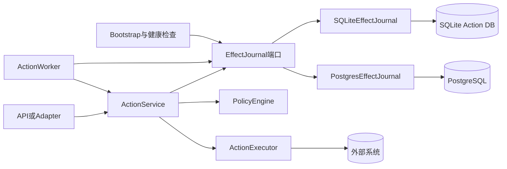
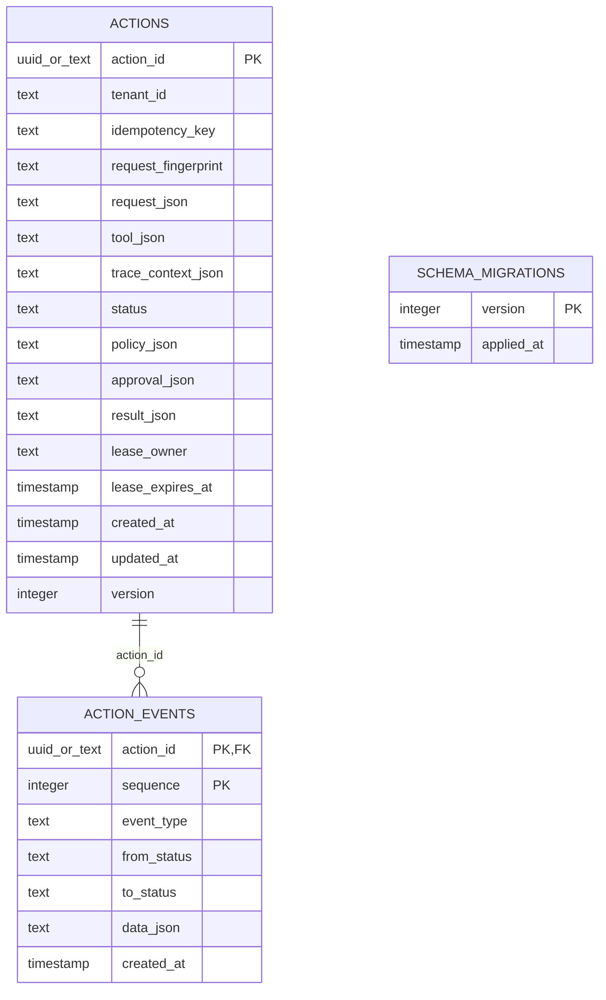
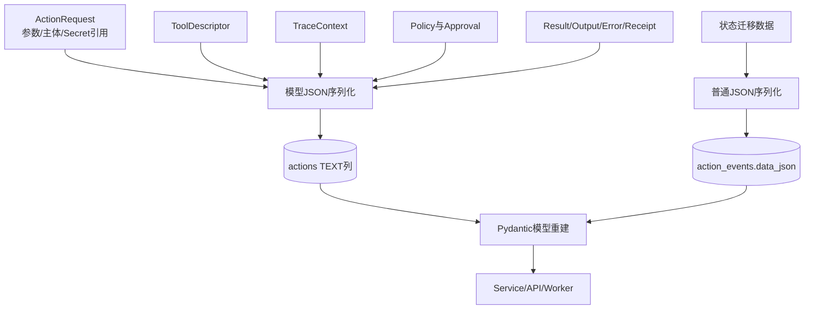
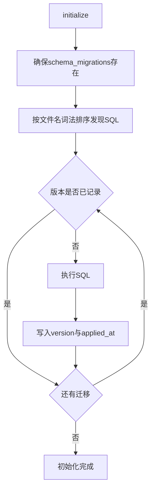
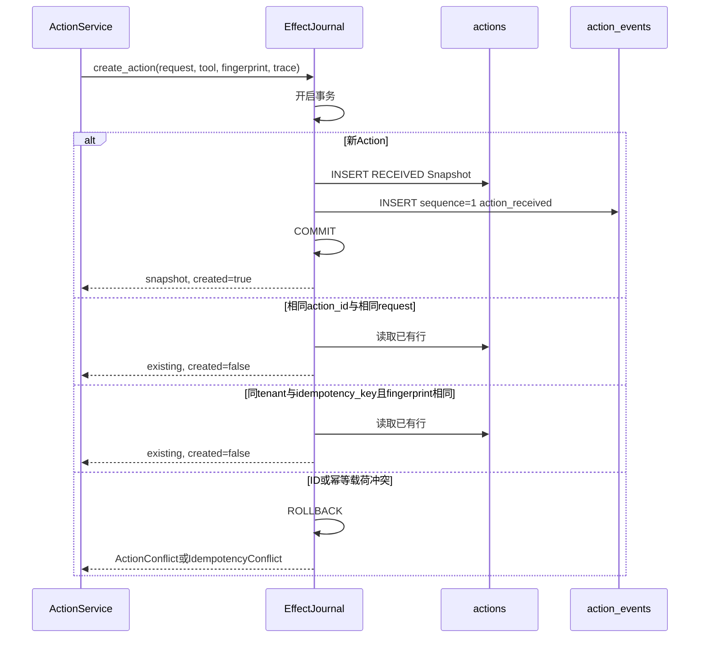
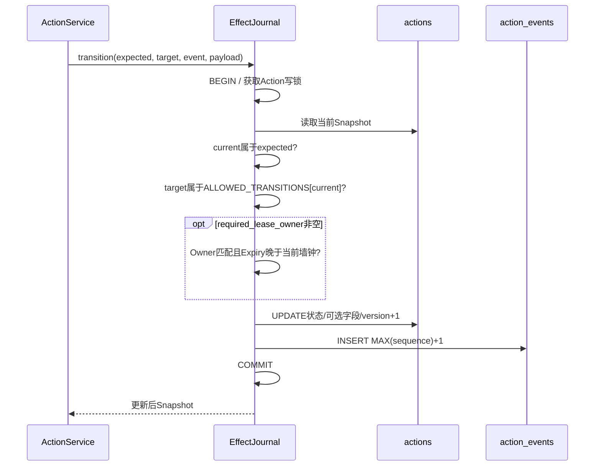
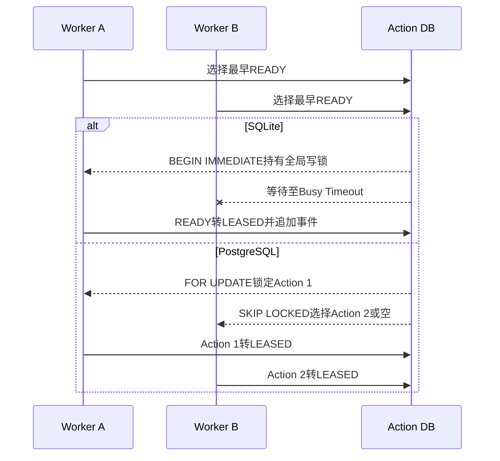
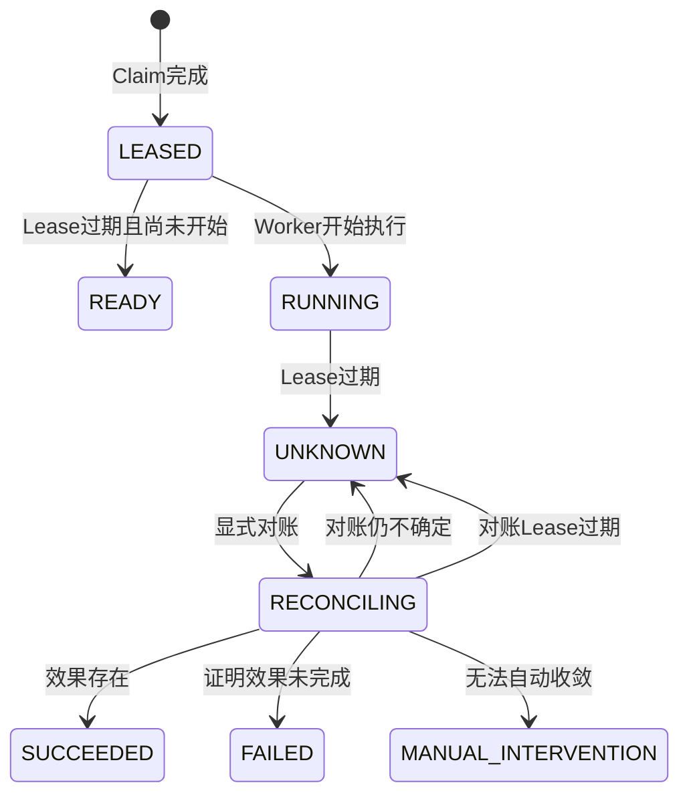
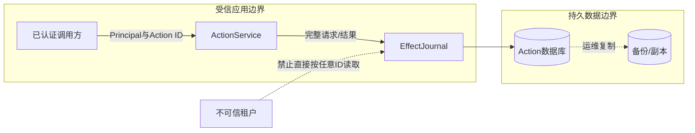

# Storage模块设计

> **退役状态：** 本文描述独立Action Plane的SQLite/PostgreSQL Effect Journal和Worker Queue，源码已在
> 0.9.1f3物理删除。历史数据库只允许按[旧Action状态归档手册](../operations/legacy-action-archive.md)检查或归档；
> 当前产品持久化见Session、Execution、Trusted Actions、Workspace与Delivery模块。

## 1. 模块摘要

| 项目 | 内容 |
|---|---|
| 源码包 | [`src/harnessix/storage`](https://github.com/carrie1988/Harnessix/tree/3f37fe8ae0646d3327254ce9677110b94f7c5e80/src/harnessix/storage) |
| 删除前职责 | 持久化Action快照与追加式事件；提供SQLite/PostgreSQL队列、Claim、Lease续期、过期恢复、读取和低基数队列统计 |
| 非职责 | 不校验工具参数，不执行Policy/Approval，不调用Executor，不解析Secret，不负责HTTP认证、租户授权、业务对象事务或历史归档 |
| 上游调用者 | [`ActionService`](https://github.com/carrie1988/Harnessix/blob/3f37fe8ae0646d3327254ce9677110b94f7c5e80/src/harnessix/runtime.py)、[`ActionWorker`](https://github.com/carrie1988/Harnessix/blob/3f37fe8ae0646d3327254ce9677110b94f7c5e80/src/harnessix/worker.py)、Bootstrap生命周期与健康检查 |
| 实现的端口 | [`EffectJournal`](https://github.com/carrie1988/Harnessix/blob/3f37fe8ae0646d3327254ce9677110b94f7c5e80/src/harnessix/domain/ports.py) |
| 持久化后端 | SQLite本地单写者实现；PostgreSQL连接池与多Worker原子Claim实现 |
| 代码版本 | `ffa56de02b372df981d234fafd1feffbb0b870fb` |
| 删除时状态 | 两个历史后端曾覆盖主流程；不再进入当前测试和发布门槛 |

本文只描述Storage包删除前的历史事实。Action完整状态机、Policy、Executor、Worker和HTTP流程以
[Action Plane子系统设计](../subsystems/action-plane.md)为跨包事实源；Action数据模型与合法转换以
[Domain模块设计](domain.md)为领域事实源。本文不复制第二套Action业务状态机，而是说明Journal如何
原子保存和并发推进这些状态。

## 2. 需求背景

Coding Agent调用外部工具时，进程内变量不足以证明“请求是什么、是否获批、谁正在执行、效果是否已经
发生”。宿主崩溃、Worker失联、重复提交和并发消费者都可能把一次逻辑Action扩大为多次外部副作用。
Storage模块因此必须同时保存两种互补事实：

1. **Action快照**：供服务和Worker高效读取当前状态、Policy、Approval、Result、Trace和Lease；
2. **追加式事件**：按Action记录从哪个状态迁移到哪个状态、事件类型、事件数据和发生时间；
3. **持久队列**：以`READY`状态表达待执行工作，而不是依赖进程内队列；
4. **执行租约**：将执行权限绑定到Worker及墙钟到期时间，支持过期回收；
5. **显式不确定性**：运行中的Lease过期时进入`UNKNOWN`，不能假定外部效果未发生后自动重放；
6. **幂等创建**：相同租户和幂等键的同一请求返回已有Action，不重复创建执行事实。

这组能力解决的是“Action控制面事实一致性”，不是外部系统和Journal之间的分布式事务。Executor在外部
数据库或SaaS产生效果后，Journal提交结果前仍存在崩溃窗口；该窗口由`UNKNOWN`、效果凭证和Reconcile
收敛，而不是由Storage伪装成Exactly Once。

## 3. 设计目标、非目标与术语

### 3.1 当前设计目标

1. Action创建和首个`action_received`事件在同一数据库事务中提交；
2. 每次状态迁移同时更新快照并追加事件，任一步失败均回滚；
3. 状态迁移同时验证调用方期望状态和领域允许转换；
4. 要求Lease Owner的迁移必须验证Owner一致且当前Lease尚未过期；
5. 多个Worker不能同时Claim同一个`READY` Action；
6. `LEASED`过期重新排队，`RUNNING`或`RECONCILING`过期进入`UNKNOWN`；
7. SQLite和PostgreSQL实现同一个异步`EffectJournal`端口；
8. Action请求、工具描述、Trace、Policy、Approval和Result能够跨进程重建为冻结领域模型；
9. 重复Action ID和租户级幂等键冲突返回可区分的领域错误；
10. Journal提供不含高基数标签的队列健康快照。

### 3.2 明确非目标

- 不实现Action API的最终用户认证、授权或租户行级隔离；
- 不拥有Policy规则、Approval真实性或Executor效果语义；
- 不保证外部效果与Journal结果的原子提交；
- 不对事件建立加密签名、Hash Chain或不可篡改WORM证明；
- 不提供Action/Event分页、搜索、归档、TTL、压缩或删除策略；
- 不负责数据库备份、复制、高可用、灾备切换和密钥管理；
- 不承诺SQLite支持多宿主共享文件或高并发写入；
- 不承诺当前表结构已经满足集中式多租户云服务的隔离要求。

### 3.3 关键术语

| 术语 | 定义 |
|---|---|
| Snapshot | `actions`表中的当前权威投影；包含完整Action请求和最新控制面状态 |
| Journal Event | `action_events`表中按Action递增的状态迁移记录 |
| Durable Queue | 由`actions.status = 'ready'`表达的持久队列，不存在独立消息表 |
| Claim | 原子选择最早的`READY` Action并迁移为`LEASED` |
| Lease | `lease_owner + lease_expires_at`组成的临时执行权证明 |
| Recovery | 扫描过期Lease并按效果是否可能已经发生选择`READY`或`UNKNOWN` |
| Action Version | 快照每次状态变化或Lease续期递增的乐观版本；当前端口不接收Expected Version |
| Event Sequence | 单个Action内从1开始的事件序号；与Action Version不是同一计数器 |
| Request Fingerprint | ActionService对规范化请求计算的摘要，用于租户级幂等冲突判定 |

## 4. 模块上下文与依赖边界



**图示说明：** `ActionService`和`ActionWorker`只依赖Domain定义的`EffectJournal`端口。Bootstrap根据
配置选择一个后端；两个后端只读写Action控制面数据库。Policy和Executor位于Storage边界之外，Executor
产生的外部效果也不由Storage数据库事务包围。

**源码映射：** 端口位于[`domain/ports.py`](https://github.com/carrie1988/Harnessix/blob/3f37fe8ae0646d3327254ce9677110b94f7c5e80/src/harnessix/domain/ports.py)的`EffectJournal`；
后端位于[`sqlite_journal.py`](https://github.com/carrie1988/Harnessix/blob/3f37fe8ae0646d3327254ce9677110b94f7c5e80/src/harnessix/storage/sqlite_journal.py)的`SQLiteEffectJournal`和
[`postgres_journal.py`](https://github.com/carrie1988/Harnessix/blob/3f37fe8ae0646d3327254ce9677110b94f7c5e80/src/harnessix/storage/postgres_journal.py)的`PostgresEffectJournal`；选择逻辑
位于[`bootstrap.py`](https://github.com/carrie1988/Harnessix/blob/3f37fe8ae0646d3327254ce9677110b94f7c5e80/src/harnessix/bootstrap.py)的`build_journal`。

### 4.1 允许的依赖方向

| 来源 | 允许依赖 | 原因 |
|---|---|---|
| `storage` | `domain.models`、`domain.errors` | 重建领域对象并抛出稳定领域错误 |
| SQLite实现 | `aiosqlite`、SQL迁移资源 | 异步本地持久化 |
| PostgreSQL实现 | `asyncpg`、PostgreSQL迁移资源 | 连接池、行锁和多Worker Claim |
| `runtime`/`worker` | `EffectJournal`端口 | 依赖倒置并支持后端替换 |

### 4.2 禁止旁路

1. API、Worker和Executor不得直接更新`actions`或`action_events`表；
2. Storage不得调用Policy或Executor，否则状态事实和业务决策形成循环依赖；
3. Executor业务数据库不得复用Action Journal事务并被宣称为Exactly Once；
4. 调用者不得仅更新Snapshot而不追加状态事件；Lease续期是当前唯一有意无事件的版本变化；
5. 不得把`ping()`成功解释为Migration完整、Schema可写或业务Readiness通过；
6. 不得把一个Action ID的读取能力直接暴露给不可信租户，租户授权必须在外层完成。

## 5. 包结构与源码阅读顺序

| 顺序 | 文件/目录 | 关键符号 | 阅读目的 |
|---:|---|---|---|
| 1 | [`domain/ports.py`](https://github.com/carrie1988/Harnessix/blob/3f37fe8ae0646d3327254ce9677110b94f7c5e80/src/harnessix/domain/ports.py) | `EffectJournal` | 先理解后端必须满足的公共异步合同 |
| 2 | [`domain/models.py`](../../src/harnessix/domain/models.py) | `ActionSnapshot`、`ActionEvent`、`JournalOperationalStats`、`ALLOWED_ACTION_TRANSITIONS` | 理解被持久化的数据和合法状态转换 |
| 3 | [`storage/__init__.py`](https://github.com/carrie1988/Harnessix/blob/3f37fe8ae0646d3327254ce9677110b94f7c5e80/src/harnessix/storage/__init__.py) | `SQLiteEffectJournal`、`PostgresEffectJournal` | 确认包的公开导出面 |
| 4 | [`sqlite_journal.py`](https://github.com/carrie1988/Harnessix/blob/3f37fe8ae0646d3327254ce9677110b94f7c5e80/src/harnessix/storage/sqlite_journal.py) | `SQLiteEffectJournal` | 阅读本地后端、事务与序列化基准实现 |
| 5 | [`migrations/0001_initial.sql`](https://github.com/carrie1988/Harnessix/blob/3f37fe8ae0646d3327254ce9677110b94f7c5e80/src/harnessix/storage/migrations/0001_initial.sql) | SQLite初始Schema | 核对Action/Event表、索引和历史`demo_issues`残留 |
| 6 | [`migrations/0002_observability.sql`](https://github.com/carrie1988/Harnessix/blob/3f37fe8ae0646d3327254ce9677110b94f7c5e80/src/harnessix/storage/migrations/0002_observability.sql) | SQLite Trace迁移 | 核对升级路径与非幂等DDL限制 |
| 7 | [`postgres_journal.py`](https://github.com/carrie1988/Harnessix/blob/3f37fe8ae0646d3327254ce9677110b94f7c5e80/src/harnessix/storage/postgres_journal.py) | `PostgresEffectJournal` | 比较连接池、Migration锁、行锁和`SKIP LOCKED` |
| 8 | [`migrations/postgresql/0001_initial.sql`](https://github.com/carrie1988/Harnessix/blob/3f37fe8ae0646d3327254ce9677110b94f7c5e80/src/harnessix/storage/migrations/postgresql/0001_initial.sql) | PostgreSQL初始Schema | 核对类型和Ready Queue部分索引 |
| 9 | [`migrations/postgresql/0002_observability.sql`](https://github.com/carrie1988/Harnessix/blob/3f37fe8ae0646d3327254ce9677110b94f7c5e80/src/harnessix/storage/migrations/postgresql/0002_observability.sql) | PostgreSQL Trace迁移 | 核对幂等DDL差异 |
| 10 | [`runtime.py`](https://github.com/carrie1988/Harnessix/blob/3f37fe8ae0646d3327254ce9677110b94f7c5e80/src/harnessix/runtime.py)与[`worker.py`](https://github.com/carrie1988/Harnessix/blob/3f37fe8ae0646d3327254ce9677110b94f7c5e80/src/harnessix/worker.py) | `ActionService`、`ActionWorker` | 从调用方理解各Journal方法的业务顺序 |
| 11 | [`test_action_service.py`](https://github.com/carrie1988/Harnessix/blob/3f37fe8ae0646d3327254ce9677110b94f7c5e80/tests/integration/test_action_service.py)与[`test_worker.py`](https://github.com/carrie1988/Harnessix/blob/3f37fe8ae0646d3327254ce9677110b94f7c5e80/tests/integration/test_worker.py) | Action与Worker集成测试 | 以SQLite验证状态、Lease和恢复合同 |
| 12 | [`test_postgres_journal.py`](https://github.com/carrie1988/Harnessix/blob/3f37fe8ae0646d3327254ce9677110b94f7c5e80/tests/integration/test_postgres_journal.py) | PostgreSQL集成测试 | 验证真实多Worker Claim与过期恢复 |

Storage包当前包含两个主实现、两组迁移和公开导出文件。两个实现存在较多结构重复，但当前没有抽取共享
基类：SQLite事务API与PostgreSQL行锁API差异显著，过早抽象会隐藏关键并发语义。领域对象重建和JSON
序列化的重复是后续一致性治理候选，不是本文档切片中的行为变更。

## 6. EffectJournal公共端口

### 6.1 生命周期与读取接口

| 方法 | 调用者 | 前置条件 | 成功后置条件 | 失败/取消 | 幂等与并发 |
|---|---|---|---|---|---|
| `initialize()` | Bootstrap、测试装配 | 数据库位置/URL可访问 | Pool或Schema可用于后续方法，缺失Migration已应用 | 驱动异常直接传播；PostgreSQL失败关闭Pool；无超时封装 | 目标上可重复调用；SQLite并发首次初始化未形成正式合同 |
| `close()` | 应用关闭 | 无 | PostgreSQL Pool关闭并置空；SQLite无常驻连接，因此无操作 | 驱动关闭异常可传播 | 重复关闭由当前驱动行为决定；PostgreSQL空Pool直接返回 |
| `ping()` | 健康检查 | SQLite可在初始化前调用；PostgreSQL必须已初始化才可能成功 | 返回连接级`SELECT 1`结果 | 捕获有限驱动/OS错误后返回`False` | 不修改业务表；SQLite可能创建空数据库文件 |
| `operational_stats()` | Readiness/Metric采集 | Schema存在 | 返回全局Ready、待审批、Unknown计数与最老Ready创建时间 | SQL/解码异常传播 | 只读快照；不是同一Action状态的强一致监视 |
| `get_action(action_id)` | Service、API、Worker | 调用者已完成租户授权 | 返回冻结`ActionSnapshot` | 不存在时`ActionNotFoundError`；PostgreSQL畸形UUID先抛`ValueError` | 只读；不要求Lease |
| `list_events(action_id)` | API、审计 | Action存在且调用者已授权 | 按`sequence`升序返回全部事件 | Action不存在时`ActionNotFoundError`；解码异常传播 | 无分页、无上限；大历史会增加内存与延迟 |

### 6.2 写入与队列接口

| 方法 | 调用者 | 核心契约 | 原子边界 | 当前输入缺口 |
|---|---|---|---|---|
| `create_action(...)` | `ActionService.submit` | 新建Snapshot和首事件，或返回同ID/同幂等键的已有Action | 单数据库事务 | 不独立校验Fingerprint格式；相信上游已验证Request/Tool |
| `transition(...)` | `ActionService` | 校验Expected、领域允许转换、可选Lease Owner，更新Snapshot并追加事件 | 单数据库事务 | 不能显式清空Policy/Approval/Result；未校验Event Type/Data配对、空事件名、Lease字段配对和时间 |
| `claim_next_ready(...)` | `ActionWorker.run_once` | 按`created_at, action_id`选择一个Ready，设置Lease并追加`execution_leased` | 单数据库事务 | 未拒绝空Worker ID、无时区或已经过期的Lease Deadline |
| `renew_lease(...)` | Worker心跳 | 仅当前Owner、未过期且状态可执行时更新到期时间和Version | 单条条件Update | 未要求新Deadline晚于当前时间或旧Deadline；不追加事件 |
| `recover_expired(now)` | Worker恢复扫描 | `LEASED→READY`；`RUNNING/RECONCILING→UNKNOWN`；清除Lease并追加事件 | 每次调用的全部候选位于一个事务 | 无批量上限；SQLite顺序未定义；`now`时区未校验 |

### 6.3 端口兼容性说明

`EffectJournal`是Python结构类型`Protocol`，当前没有独立的Backend Conformance Test Suite，也没有
运行时接口版本字段。因此“两个类方法签名相同”不等于错误和边界语义完全相同。已确认差异包括畸形
UUID、恢复顺序、初始化Readiness和Migration原子性。新增后端必须先建立参数化合同测试，不能只复制
方法签名。

## 7. 持久化模型与ER关系



**图示说明：** `actions`每个Action一行，`action_events`以`(action_id, sequence)`为复合主键并通过
外键级联删除。`schema_migrations`只保存整数版本与应用时间，没有文件Checksum。SQLite和PostgreSQL
逻辑列一致，但ID与Timestamp物理类型不同；PostgreSQL额外提供`READY`部分索引。

**源码映射：** SQLite Schema见[`0001_initial.sql`](https://github.com/carrie1988/Harnessix/blob/3f37fe8ae0646d3327254ce9677110b94f7c5e80/src/harnessix/storage/migrations/0001_initial.sql)
和[`0002_observability.sql`](https://github.com/carrie1988/Harnessix/blob/3f37fe8ae0646d3327254ce9677110b94f7c5e80/src/harnessix/storage/migrations/0002_observability.sql)；PostgreSQL Schema见
[`postgresql/0001_initial.sql`](https://github.com/carrie1988/Harnessix/blob/3f37fe8ae0646d3327254ce9677110b94f7c5e80/src/harnessix/storage/migrations/postgresql/0001_initial.sql)和
[`postgresql/0002_observability.sql`](https://github.com/carrie1988/Harnessix/blob/3f37fe8ae0646d3327254ce9677110b94f7c5e80/src/harnessix/storage/migrations/postgresql/0002_observability.sql)。

### 7.1 `actions`重点字段

| 字段 | SQLite/PostgreSQL类型 | 来源 | 语义与约束 | 敏感级别 | 兼容说明 |
|---|---|---|---|---|---|
| `action_id` | `TEXT`/`UUID` | `ActionRequest.action_id` | 全局主键；Storage读取未附加Tenant条件 | 低 | PostgreSQL会解析UUID，SQLite按字符串查询 |
| `tenant_id` | `TEXT`/`TEXT` | `Principal.tenant_id` | 幂等作用域的一部分；当前不是访问控制过滤器 | 中 | 与非空幂等键组成部分唯一索引 |
| `idempotency_key` | nullable `TEXT` | 调用方 | 租户级业务幂等键；作用域不包含Tool名称 | 中 | 同租户跨Tool复用同Key也会冲突 |
| `request_fingerprint` | `TEXT` | `ActionService` | 规范请求摘要，用于幂等键冲突检测 | 低 | 算法变化需要跨版本兼容设计 |
| `request_json` | `TEXT` | `ActionRequest` | 完整请求，含参数、主体、上下文、Secret引用和Metadata | 高 | 不是JSONB；由Pydantic当前模型重建 |
| `tool_json` | `TEXT` | `ToolDescriptor` | 提交时工具契约快照 | 中 | Worker当前仍按名称从Registry取当前Executor，不能仅靠此字段阻止版本漂移 |
| `trace_context_json` | nullable `TEXT` | 入站W3C Trace | 跨API/Worker恢复Trace上下文 | 中 | Migration 0002新增；不包含业务Span历史 |
| `status` | `TEXT` | Journal迁移 | 当前Action状态 | 低 | DB无CHECK；未知值在模型重建时报错 |
| `policy_json` | nullable `TEXT` | `PolicyDecision` | 最新Policy决定 | 中 | `transition`当前不能写回SQL NULL |
| `approval_json` | nullable `TEXT` | `ApprovalRecord` | 与Request Fingerprint绑定的决定 | 高审计 | `transition`当前不能写回SQL NULL |
| `result_json` | nullable `TEXT` | `ActionResult` | 最新执行/恢复/对账结果及Receipt | 高 | 可能含工具完整输出或错误正文 |
| `lease_owner` | nullable `TEXT` | Worker | 当前执行权主体 | 中 | DB不强制与Expiry成对存在 |
| `lease_expires_at` | nullable时间 | Worker | 墙钟Lease Deadline | 中 | SQLite以ISO文本比较；输入未验证UTC-aware |
| `created_at` | 时间 | Storage墙钟 | Action首次持久化时间 | 低 | 当前也被用作Ready Queue年龄，非进入Ready时间 |
| `updated_at` | 时间 | Storage墙钟 | 最近状态变化或续期时间 | 低 | 续期会更新，无Event |
| `version` | `INTEGER` | Storage | 创建为1，每次状态迁移、Claim、恢复和续期加1 | 低 | 当前端口没有Expected Version CAS参数 |

### 7.2 `action_events`重点字段

| 字段 | 类型 | 语义与约束 | 当前保证 | 当前缺口 |
|---|---|---|---|---|
| `action_id` | UUID或TEXT | 所属Action | 外键；Action删除时级联 | 无租户列，读取授权依赖外层 |
| `sequence` | INTEGER | Action内事件序号 | `MAX(sequence)+1`；复合主键防重复 | 没有独立序列表；依赖事务/行锁串行化 |
| `event_type` | TEXT | 业务事件名称 | 调用者传入或Journal固定生成 | 无枚举、非空长度或Data Schema校验 |
| `from_status` | nullable TEXT | 前状态；首事件为空 | `transition`从锁内Snapshot生成 | DB无跨字段CHECK |
| `to_status` | TEXT | 后状态 | `transition`先检查领域转换 | DB外直接写入可绕过检查 |
| `data_json` | TEXT | 事件扩展数据 | 始终写入JSON文本 | `default=str`可能把不支持对象静默字符串化 |
| `created_at` | 时间 | Journal墙钟时间 | 与Snapshot Update使用同一次`now` | 无单调时钟或数据库时钟约束 |

### 7.3 Snapshot、Version与Event Sequence不变量

- 创建后`ActionSnapshot.version = 1`，首个事件`sequence = 1`；
- 每次`transition`、Claim和Recover同时令Version加1并追加一个Event；
- `renew_lease`令Version加1但**不追加事件**；
- 因此只要发生过心跳，`version`就可能大于最新`sequence`；二者不能互相推导；
- 事件主键保证同Action序号唯一，但当前没有Trigger阻止Update/Delete，也没有Hash Chain证明不可篡改；
- Domain冻结模型约束进程内对象，数据库本身没有Status、Lease配对或JSON结构CHECK。

## 8. 序列化与反序列化

### 8.1 写入规则

两个后端各自定义同名`_json_dump`：

1. Pydantic `BaseModel`使用`model_dump_json(exclude_none=True)`；
2. 普通对象使用紧凑`json.dumps`，保留中文；
3. 普通对象无法原生JSON编码时使用`default=str`。

第三条提高了事件Data写入成功率，但也可能把不受支持的类型静默变成字符串，使Schema漂移在写入时不可见。
生产合同应改为显式JSON Value校验或版本化Event Payload，而不是依赖`default=str`兜底。

### 8.2 读取规则

- `request_json`、`tool_json`、`trace_context_json`、`policy_json`、`approval_json`和`result_json`分别通过
  对应Pydantic模型的`model_validate_json`重建；
- Status文本通过`ActionStatus(...)`转换；
- Event Data通过`json.loads`读取；
- SQLite时间通过`datetime.fromisoformat`读取，PostgreSQL由Driver返回`datetime`；
- 任何损坏JSON、未知枚举或不兼容字段都会在读取时直接抛出解析异常，当前没有存储错误分类或隔离区。

### 8.3 数据流与敏感内容



**图示说明：** Journal保存的是完整控制面载荷而非只保存摘要。`SecretRef`本身不含Secret值，但参数、
Metadata、工具输出和错误消息仍可能含用户代码、路径、资源标识或上游误传的敏感正文。Storage当前不执行
内容脱敏、字段级加密或Retention。

**源码映射：** 写入见两个后端的`_json_dump`、`create_action`、`transition`和`_insert_event`；读取见
`_snapshot`与`_event`。

## 9. Migration与初始化

### 9.1 通用Migration模型



**图示说明：** Migration文件名前缀解析为整数版本，是否应用只依据`schema_migrations.version`。
当前没有Checksum、名称、前后Schema验证、版本连续性检查、Downgrade或“数据库版本高于代码版本”拒绝。

**源码映射：** SQLite见`SQLiteEffectJournal.initialize`；PostgreSQL见
`PostgresEffectJournal.initialize`。Migration SQL通过`importlib.resources.files`从安装包读取，构建Wheel
已经包含两组SQL资源。

### 9.2 SQLite初始化语义

`SQLiteEffectJournal.initialize`执行以下步骤：

1. 递归创建数据库父目录；
2. 打开每操作连接并启用Foreign Key与5秒Busy Timeout；
3. 建立`schema_migrations`；
4. 从`harnessix.storage.migrations`根目录发现`*.sql`；
5. 对未记录版本调用`executescript`，再写入版本行；
6. 循环结束后提交。

SQLite初始Migration设置WAL。当前Journal没有显式设置`synchronous=FULL`，耐久性沿用SQLite环境默认。
更重要的是，`executescript`中的DDL和随后的版本行不是此实现可证明的Crash-Atomic单元：若0002的
`ALTER TABLE`已生效而版本行未提交，再次初始化会执行同一个非幂等`ADD COLUMN`并收到Duplicate Column。
现有升级测试只证明完整0001数据库可以顺利应用0002，不证明所有Crash Cut Point可恢复。

SQLite还没有专用Migration锁或并发首次初始化合同。`BEGIN IMMEDIATE`只用于业务写方法，不包围
`initialize`的整个发现/执行流程。

### 9.3 PostgreSQL初始化语义

`PostgresEffectJournal.initialize`执行以下步骤：

1. 校验URL非空、Pool Size大于零；
2. 在进程内`asyncio.Lock`下创建`asyncpg.Pool(min_size=1, max_size=pool_size)`；
3. 获取连接并开启一个数据库事务；
4. 取得事务级Advisory Lock `_MIGRATION_LOCK_ID = 7_214_559_001`；
5. 建立`schema_migrations`并按文件名应用未记录SQL；
6. 在同一数据库事务中写入所有Migration版本；
7. 任意`BaseException`时关闭Pool并将内部引用恢复为空。

数据库事务和Advisory Lock使同一数据库的并发迁移及DDL/版本记录原子性明显强于SQLite。进程内Lock只
保护当前Journal实例，数据库锁负责跨实例互斥。当前仍没有Checksum、连续版本、Future Version、
Statement Timeout、Lock Timeout或Schema Namespace合同。

### 9.4 当前Migration清单

| 后端 | 版本 | 文件 | 变更 | 幂等性与风险 |
|---|---:|---|---|---|
| SQLite | 1 | [`0001_initial.sql`](https://github.com/carrie1988/Harnessix/blob/3f37fe8ae0646d3327254ce9677110b94f7c5e80/src/harnessix/storage/migrations/0001_initial.sql) | Action/Event/Migration表、索引、WAL及`demo_issues` | 多数DDL使用`IF NOT EXISTS`；`demo_issues`为未被Journal使用的历史残留 |
| SQLite | 2 | [`0002_observability.sql`](https://github.com/carrie1988/Harnessix/blob/3f37fe8ae0646d3327254ce9677110b94f7c5e80/src/harnessix/storage/migrations/0002_observability.sql) | 添加`trace_context_json` | 无`IF NOT EXISTS`；中断重入可能失败 |
| PostgreSQL | 1 | [`0001_initial.sql`](https://github.com/carrie1988/Harnessix/blob/3f37fe8ae0646d3327254ce9677110b94f7c5e80/src/harnessix/storage/migrations/postgresql/0001_initial.sql) | Action/Event/Migration表及两个索引 | DDL使用`IF NOT EXISTS`；数据库事务保护 |
| PostgreSQL | 2 | [`0002_observability.sql`](https://github.com/carrie1988/Harnessix/blob/3f37fe8ae0646d3327254ce9677110b94f7c5e80/src/harnessix/storage/migrations/postgresql/0002_observability.sql) | 添加`trace_context_json` | 使用`IF NOT EXISTS` |

SQLite Schema中的`demo_issues`没有被
[`DemoIssueRepository`](https://github.com/carrie1988/Harnessix/blob/3f37fe8ae0646d3327254ce9677110b94f7c5e80/src/harnessix/executors/demo_issue.py)使用；后者连接独立Demo数据库并自行建表。
该表是历史Schema残留，删除它属于持久化兼容变更，必须通过新Migration和升级测试处理，不能直接修改
已发布的0001文件。

## 10. Action创建与幂等

### 10.1 正常与重复提交时序



**图示说明：** 新建Snapshot与首Event是同一事务。重复提交不会更新首次保存的Tool Descriptor或Trace
Context，也不会追加第二个`action_received`事件。SQLite先查后插；PostgreSQL先`INSERT ... ON CONFLICT
DO NOTHING RETURNING`，冲突后再辨别ID与租户级Key。

**源码映射：** 两个后端的`create_action`和`_insert_event`；指纹生成与调用顺序位于
[`runtime.py`](https://github.com/carrie1988/Harnessix/blob/3f37fe8ae0646d3327254ce9677110b94f7c5e80/src/harnessix/runtime.py)的`ActionService.submit`。

### 10.2 冲突判定矩阵

| 已有事实 | 新提交比较 | 返回 |
|---|---|---|
| 相同`action_id` | 完整`ActionRequest`完全相等 | 已有Snapshot，`created=False` |
| 相同`action_id` | Request任一字段变化 | `ActionConflictError` |
| 相同`tenant_id + idempotency_key` | `request_fingerprint`相同 | 已有Snapshot，`created=False` |
| 相同`tenant_id + idempotency_key` | Fingerprint不同 | `IdempotencyConflictError` |
| 无上述事实 | 不适用 | 新建Snapshot和首Event，`created=True` |

幂等唯一索引只包含Tenant和Key，不包含Tool。这个选择避免同一业务命令用不同工具名绕过幂等保护，但
也意味着不同工具若复用了同一Tenant业务Key会冲突。该作用域是公共合同，调整必须新增Migration和兼容
策略。

### 10.3 PostgreSQL冲突路径边界

PostgreSQL使用无目标的`ON CONFLICT DO NOTHING`，当前只可能吸收Action主键或租户幂等唯一索引冲突。
若未来增加其他Unique Constraint，该语句也会吸收冲突，再落入通用“创建冲突但找不到记录”错误。未来
Schema扩展应收窄Conflict Target或同步更新冲突分类测试。

## 11. 状态迁移与事件原子性

### 11.1 事务时序



**图示说明：** SQLite通过`BEGIN IMMEDIATE`获得数据库写锁；PostgreSQL通过`SELECT ... FOR UPDATE`锁住
目标Action行。Expected Status加领域转换表构成当前CAS，不使用调用方Expected Version。Event Sequence
在同一事务中由`MAX + 1`计算，因此同Action迁移串行时不会重复。

**源码映射：** 两个后端的`transition`、`_require_row`、`_insert_event`和`_has_valid_lease`；合法转换表
位于[`domain/models.py`](../../src/harnessix/domain/models.py)的`ALLOWED_ACTION_TRANSITIONS`。

### 11.2 可选字段写入规则

- `policy`、`approval`和`result`仅在参数非`None`时覆盖现值；
- `lease_owner`与`lease_expires_at`分别在非`None`时更新，并未要求成对传入；
- `clear_lease=True`同时把Owner和Expiry设为SQL NULL，优先于传入的新Lease字段；
- `required_lease_owner`只用于校验当前Lease，不自动写入或延长Lease；
- `data=None`被保存为空对象；Event Type由调用者自由传入；
- 接口没有“显式把Policy/Approval/Result清空”的三态参数，`None`含义是“不修改”。

### 11.3 原子性范围

保证范围仅限一个Journal数据库事务：

- Snapshot Update成功而Event Insert失败时，事务回滚；
- Event Insert成功而事务Commit失败时，不向调用者承诺迁移成功；
- Executor外部效果不在事务内，外部效果成功后Journal提交失败仍需进入恢复/对账路径；
- 观测导出不在Storage事务内，日志或Metric失败不应改变持久状态。

## 12. Durable Queue与Claim

### 12.1 Claim时序对比



**图示说明：** 两个后端都按`created_at, action_id`选择FIFO候选。SQLite以单写者事务防止重复Claim，适合
单机低并发；PostgreSQL以`FOR UPDATE SKIP LOCKED`支持多个Worker并行Claim不同Action。两者都在同一
事务内写入`LEASED` Snapshot和`execution_leased`事件。

**源码映射：** `SQLiteEffectJournal.claim_next_ready`、
`PostgresEffectJournal.claim_next_ready`。PostgreSQL Ready Queue部分索引见
[`postgresql/0001_initial.sql`](https://github.com/carrie1988/Harnessix/blob/3f37fe8ae0646d3327254ce9677110b94f7c5e80/src/harnessix/storage/migrations/postgresql/0001_initial.sql)；SQLite只具有
`(status, lease_expires_at)`索引，Ready筛选后仍可能需要排序。

### 12.2 Claim输入和结果

| 输入/结果 | 当前语义 | 约束缺口 |
|---|---|---|
| `worker_id` | 保存为Lease Owner并写入Event Data | 不拒绝空白值，不限制长度或字符集 |
| `lease_expires_at` | 保存为Lease Deadline | 不校验时区、不要求晚于当前时间 |
| 无Ready Action | 返回`None` | 不阻塞等待，不提供通知机制 |
| Claim成功 | Status=`LEASED`，Version+1，追加事件 | 未暴露队列等待年龄或Claim延迟 |

当前调用方`ActionWorker`会生成非空Worker ID并使用正Lease时长，但端口和后端自身没有固化这些前置条件。
任何新增直接调用者都可能创建立即过期或不可归属的Lease。

## 13. Lease续期、竞争与版本

### 13.1 续期条件

`renew_lease`只有同时满足以下数据库谓词时返回`True`：

1. Action ID存在；
2. `lease_owner == worker_id`；
3. 当前`lease_expires_at > now`；
4. 当前Status属于`LEASED`、`RUNNING`、`RECONCILING`。

成功续期会更新Expiry、`updated_at`并令Version加1。它不追加Event，这是为了避免高频Heartbeat膨胀事件
日志；代价是Version不再等于事件数量，审计方也无法从Event精确重建每次Lease延长。

### 13.2 当前续期缺口

条件只校验**旧Lease**尚未过期，不校验新Deadline：

- 新Deadline可以早于当前时间；
- 新Deadline可以早于旧Deadline；
- 时间可以是Naive `datetime`，SQLite会编码为文本，PostgreSQL由Driver决定接受或拒绝；
- 方法返回Boolean，不区分“不存在、Owner错误、旧Lease过期、状态不允许”。

因此`True`只表示条件Update更新了一行，不表示新Lease具有正剩余时间。正常Worker调用路径保持正Deadline，
但Storage公共合同仍需在1.0前补验证和双后端测试。

### 13.3 与终态提交的竞争

Worker心跳和执行结果提交可能并发：

- 若结果迁移先提交并清除Lease，后续续期条件不成立并返回`False`；
- 若续期先提交，结果迁移仍可凭相同Owner和未过期Lease完成；
- Worker将“结果已经提交导致续期失败”和“真正丢失Lease”分开处理，避免把成功终态误报为丢Lease；
- Storage只提供原子条件更新，不拥有该跨任务判定逻辑。

对应验证位于`test_execution_commit_wins_renewal_race`和
`test_failed_renewal_while_running_still_reports_lost_lease`。

## 14. 过期恢复与`UNKNOWN`

### 14.1 恢复状态图



**图示说明：** `recover_expired`只直接实现`LEASED→READY`和
`RUNNING/RECONCILING→UNKNOWN`。后续Reconcile状态由ActionService处理。未开始的Claim可以安全重新排队；
一旦进入Running或Reconciling，外部查询/写入可能已经发生，必须保留不确定性。

**源码映射：** 两个后端的`recover_expired`；跨包Reconcile见
[`runtime.py`](https://github.com/carrie1988/Harnessix/blob/3f37fe8ae0646d3327254ce9677110b94f7c5e80/src/harnessix/runtime.py)的`ActionService.reconcile`；完整状态机见
[Domain模块设计](domain.md)。

### 14.2 恢复事务

扫描范围为Status属于`LEASED`、`RUNNING`、`RECONCILING`且Expiry不为空并小于等于恢复时间的Action：

| 原状态 | 目标状态 | Result处理 | Lease | Event |
|---|---|---|---|---|
| `LEASED` | `READY` | 保留原值 | 清空 | `lease_recovered` |
| `RUNNING` | `UNKNOWN` | 若Result为空则写`lease_expired` Unknown Result，否则保留已有值 | 清空 | `lease_recovered` |
| `RECONCILING` | `UNKNOWN` | 同上 | 清空 | `lease_recovered` |

Result通过`COALESCE(new_result, result_json)`写入；这避免覆盖已有Result，但也可能形成Status为Unknown而
Result仍描述其他状态的历史组合。当前Pydantic `ActionSnapshot`没有跨字段校验，该组合不会被模型拒绝。

### 14.3 后端差异

- SQLite在一个`BEGIN IMMEDIATE`事务中读取并更新全部候选，没有`ORDER BY`，返回Action ID顺序未定义；
- PostgreSQL按`lease_expires_at, action_id`排序，并用`FOR UPDATE SKIP LOCKED`跳过正在被其他事务处理的行；
- 两个后端都没有Batch Limit，大量过期Action会扩大事务、锁持有和恢复延迟；
- PostgreSQL本次跳过的锁定Action必须由后续扫描处理；
- SQLite恢复会持有全局写锁，可能阻塞新提交、迁移和Claim。

## 15. 运维统计与健康语义

### 15.1 当前统计合同

`operational_stats()`执行一次聚合查询并返回：

| 字段 | 计算规则 | 用途 | 限制 |
|---|---|---|---|
| `ready_count` | Status为`READY`的行数 | Queue Backlog | 全局而非按Tenant |
| `pending_approval_count` | Status为`PENDING_APPROVAL`的行数 | 人工审批积压 | 不含等待时长分布 |
| `unknown_count` | Status为`UNKNOWN`的行数 | 对账告警 | 不含进入Unknown原因 |
| `oldest_ready_at` | Ready行中最小`created_at` | 粗略队列年龄 | 不是进入Ready的时间；经历长审批后会高估等待 |

当前统计不包含Leased、Running、Reconciling、Manual Intervention、Lease即将到期、恢复批次或数据库延迟。
聚合不接受Tenant过滤，不能直接作为多租户配额或SLO数据源。

### 15.2 `ping()`不是Readiness证明

SQLite `ping()`每次打开数据库并执行`SELECT 1`。对不存在的路径调用时，SQLite可能创建一个没有业务
Schema的空文件并返回`True`。PostgreSQL在Pool未初始化时返回`False`，初始化后也只验证连接级查询。
因此当前方法只可表示**基础连接可用性**：

- 不证明Migration已经完成；
- 不证明Schema版本与代码一致；
- 不证明业务表可读写；
- 不证明磁盘仍有空间或事务能够提交；
- 不证明PostgreSQL副本可写或连接具备所需权限。

产品级Readiness需要独立的Schema Version、可写性和依赖健康合同。

## 16. SQLite实现详设

### 16.1 连接与事务模型

`SQLiteEffectJournal`只保存`Path`，每个公共操作通过`_connection()`新建`aiosqlite.Connection`，设置
Row Factory、Foreign Key和5秒Busy Timeout，最后关闭。因此：

- `close()`无常驻资源可释放；
- 每次操作都有连接建立成本；
- PRAGMA作用于每个连接；
- `initialize`的WAL设置持久于数据库，但其他连接仍显式启用Foreign Key；
- Create、Transition、Claim、Recover使用`BEGIN IMMEDIATE`，Renew使用单条Update后Commit；
- 多协程写入最终受SQLite单写者约束，Busy超过5秒会抛驱动错误。

### 16.2 时间和排序

SQLite以`datetime.isoformat()`保存时间，并以`datetime.fromisoformat()`重建。Lease查询通过文本
`<=`/`>`比较，因此正确性依赖所有写入采用可词法排序的一致UTC-aware格式。Storage当前不验证这一
前置条件；传入不同时区Offset或Naive时间可能造成与真实Instant不一致的排序和过期判断。

### 16.3 本地部署边界

SQLite适合单机、本地优先、低写并发的Action Plane。数据库文件应位于本地可靠文件系统，不应放在多个
宿主共享写入的网络文件系统。当前代码通过普通Path打开文件：

- 文件权限由进程Umask和父目录权限决定，没有显式安全创建为`0600`；
- 不执行磁盘容量预检、备份或Integrity Check；
- 不配置加密；
- 不为Lock、Full、Corrupt等SQLite错误投影稳定Storage错误码；
- 没有独立Checkpoint/Vacuum/Retention运维入口。

## 17. PostgreSQL实现详设

### 17.1 Pool与生命周期

`PostgresEffectJournal`保存Database URL、Pool Size、可空Pool和实例级初始化Lock：

- URL必须为非空字符串；
- Pool Size必须大于零，默认10；
- Pool使用`min_size=1`、`max_size=pool_size`；
- `initialize`成功后复用Pool；
- `close`先把内部Pool置空再关闭旧Pool；
- 业务方法通过`_require_pool`拒绝初始化前调用；
- `ping`例外地在Pool为空时返回`False`。

当前没有暴露Acquire Timeout、Statement Timeout、Idle Lifetime、TLS Mode、Application Name、目标Schema
或连接重试配置。Database URL可能包含凭据，必须由配置/Secret层提供，不得进入日志或文档。

### 17.2 多Worker并发

PostgreSQL为Claim和Recover使用行锁与`SKIP LOCKED`：

- Claim锁住一个最早Ready候选，其他Worker跳过并选择下一行；
- Transition锁住指定Action，串行化同Action状态与Event Sequence；
- Recover锁住全部本次候选但跳过已锁行；
- Create依赖Unique Constraint处理并发重复提交；
- 单个Action事件的`MAX(sequence)+1`在Action行锁或创建事务内安全串行；
- 不同Action可以在不同连接并行推进。

### 17.3 数据库部署边界

PostgreSQL是当前多进程Worker场景的生产候选后端，但现状不等于完成生产运维：

- 代码不强制TLS；
- 没有Row-Level Security或Tenant Session Context；
- 所有JSON保存为Text，没有数据库侧Schema查询能力；
- 没有Statement/Lock Timeout，锁等待可能超过上层请求Deadline；
- 没有Migration Service身份与Runtime最小权限分离；
- 没有分区、归档、容量模型或高可用切换测试；
- 真实PostgreSQL集成测试使用干净CI容器，没有覆盖长期升级、故障切换和负载。

## 18. 双后端一致性矩阵

| 维度 | SQLite | PostgreSQL | 一致性结论 |
|---|---|---|---|
| 公共方法 | 实现全部`EffectJournal`方法 | 实现全部方法 | 签名一致 |
| 创建原子性 | `BEGIN IMMEDIATE` | Transaction + Unique Conflict | 主语义一致 |
| 状态迁移 | 全局写锁 | Action行锁 | 结果一致，并发粒度不同 |
| Claim | 单写者FIFO | `SKIP LOCKED` FIFO候选 | 不重复主语义一致；吞吐不同 |
| Recover顺序 | 无`ORDER BY` | Expiry、Action ID排序 | 返回顺序不一致 |
| 畸形字符串ID | 字符串查询后`ActionNotFoundError` | UUID解析时`ValueError` | 错误不一致 |
| 时间类型 | ISO Text | `TIMESTAMPTZ` | 输入时区容错不一致 |
| `ping`初始化前 | 可创建空文件并返回True | 返回False | 健康语义不一致 |
| Migration原子性 | DDL/版本记录Crash一致性不足 | 一个数据库事务 | 不一致 |
| Migration并发 | 无专用锁 | Advisory Lock | 不一致 |
| 0002幂等DDL | 否 | `IF NOT EXISTS` | 不一致 |
| Ready索引 | 无专用部分索引 | 有部分索引 | 性能不一致 |
| Event/Version规则 | 续期只增Version | 同左 | 一致 |
| JSON物理类型 | TEXT | TEXT | 一致 |

上述差异必须被视为显式风险，而不是由类型提示自动消除。1.0前应建立同一组参数化Conformance Case，
并对有意差异形成Backend Capability或ADR；其余差异应收敛。

## 19. 取消、超时与异常分类

### 19.1 当前取消语义

Journal方法没有显式Cancellation Token。Python Task取消由`asyncio.CancelledError`经驱动和Context Manager
传播：

- SQLite `_connection`的`finally`会尝试关闭连接；
- PostgreSQL `connection.transaction()`负责异常退出回滚；
- `initialize`的PostgreSQL实现捕获`BaseException`并关闭半初始化Pool；
- SQLite Migration在`executescript`与版本写入之间取消时，不具备已验证的恢复保证；
- 当前没有专门的取消Cut Point故障注入测试证明Create/Transition/Claim/Recover在两个后端均无半提交。

### 19.2 当前超时语义

- SQLite仅设置`busy_timeout=5000`，不是整个方法Deadline；
- PostgreSQL未配置Acquire、Statement或Lock Timeout；
- 端口不接收Deadline；
- Service/Worker上层取消不一定能把数据库驱动错误归一为稳定错误码；
- `recover_expired`无Batch Limit，可能长期持锁；
- `list_events`无分页，可能超出API或内存预算。

### 19.3 错误矩阵

| 场景 | 当前错误/返回 | 是否可安全重试 | 说明 |
|---|---|---|---|
| Action不存在 | `ActionNotFoundError` | 仅在上游确认ID后决定 | PostgreSQL畸形UUID是`ValueError` |
| 相同ID不同Request | `ActionConflictError` | 否 | 调用方错误或ID复用 |
| 同Tenant/Key不同Fingerprint | `IdempotencyConflictError` | 否 | 必须换Key或恢复原请求 |
| Expected/领域转换不合法 | `IllegalTransitionError` | 读取最新Snapshot后重新决策 | 不能盲重试同迁移 |
| Lease Owner不符或过期 | `ActionConflictError` | 旧Worker不可继续 | 交由恢复/新Claim处理 |
| Claim无工作 | `None` | 是，可轮询 | 不是错误 |
| Renew谓词失败 | `False` | 需先判定是否已完成或丢Lease | 原因未细分 |
| 数据库Busy/断连/磁盘满 | 驱动异常传播 | 取决于事务结果 | Storage没有稳定错误分类 |
| JSON/枚举损坏 | 解析/校验异常 | 否，需修复或隔离数据 | 当前无Quarantine |
| Commit结果未知 | 驱动异常传播 | 不能直接假定未提交 | 应重新读取权威Action再决定 |

数据库Commit异常可能意味着“客户端不知道，数据库已经提交”。调用方在重新提交状态迁移前必须先读取
Snapshot/Event确认事实；当前端口没有专门的Commit-Unknown错误类别或Resume Helper。

## 20. 并发、一致性与幂等边界

### 20.1 当前一致性保证

- 单个数据库内Snapshot与状态Event原子；
- 相同Action的状态迁移被SQLite写锁或PostgreSQL行锁串行；
- 同一租户/幂等键的新建由Unique Index防止并发重复；
- Claim不会把同一Ready Action同时租给两个Worker；
- 只有当前Owner且Lease有效时，要求Owner的迁移可以推进；
- 过期未开始Action可重排队，可能已产生效果的Action进入Unknown。

### 20.2 当前不保证

- 不保证外部业务效果与Journal Exactly Once；
- 不保证所有读都按Tenant隔离；
- 不保证多数据库或跨Region一致性；
- 不保证Event在数据库管理员篡改后可检测；
- 不保证Create返回异常时一定没有提交；
- 不保证SQLite多进程高写并发吞吐；
- 不保证PostgreSQL故障切换期间Lease墙钟和锁语义连续；
- 不保证Queue严格全局FIFO：PostgreSQL会跳过锁定候选，SQLite恢复无排序；
- 不保证Action Version可用作当前公共API的Expected Version CAS。

## 21. 安全、隐私与租户边界

### 21.1 信任边界



**图示说明：** Storage相信上游已经认证Principal和Action ID访问权。它的读取SQL只按Action ID过滤，
没有Tenant谓词；数据库和备份会保存完整请求/结果。因此数据库账号、文件权限、备份访问和外层授权共同
构成安全边界。

**源码映射：** `get_action`、`list_events`和`_require_row`展示当前ID级查询；完整载荷列见两组Migration。

### 21.2 当前控制

- 所有调用方输入值通过SQLite参数或PostgreSQL绑定参数传递；
- 动态SQL只拼接内部生成的Assignment列表和固定`FOR UPDATE`后缀；
- Domain模型禁止未知字段并冻结对象；
- Secret合同要求持久化引用而非明文值；
- PostgreSQL Migration使用Advisory Lock防止并发DDL；
- Foreign Key和复合主键维护基本引用与Event序号唯一性。

### 21.3 当前缺口

- SQLite文件未显式以最小权限创建；
- 两个后端均未提供静态/字段级加密；
- PostgreSQL不强制TLS、RLS或最小权限角色；
- Storage不脱敏Request、Metadata、Event Data、Output或Error；
- 无Retention、删除、Legal Hold或用户数据导出合同；
- 无Event完整性链、签名或管理员篡改检测；
- 无Tenant条件读取，外层授权缺陷可导致越权；
- `default=str`可能把意外对象的文本表示写入持久层；
- Database URL可能包含凭据，生命周期与日志安全依赖Config/Secret层。

## 22. 可观测性

Storage直接提供`ping`和`operational_stats`，但不直接创建OpenTelemetry Span、Metric或结构化日志。Action
Service和Worker负责围绕Journal调用记录Trace、状态Metric和错误日志。Trace Context保存在Action行，使
API提交和独立Worker执行能够恢复同一分布式Trace。

### 22.1 当前可观测事实

| 信号 | 所有者 | Storage提供的事实 | 限制 |
|---|---|---|---|
| Trace | Service/Worker | `trace_context_json`持久化并可重建 | Journal SQL/锁等待没有子Span |
| Queue Gauge | Worker/Readiness | `JournalOperationalStats` | 全局、字段有限、Oldest语义粗略 |
| Action状态Metric | Service/Worker | Snapshot状态与Event | Storage自身失败不分类 |
| 审计读取 | API/运维 | 有序`ActionEvent`列表 | 无分页、完整性证明和租户过滤 |
| 健康检查 | Bootstrap/API | `ping()`布尔值 | 仅连接级，不能证明Schema Readiness |

### 22.2 低基数原则

`action_id`、`tenant_id`、`worker_id`、幂等键和工具参数不得成为Metric Label。它们可在受控Trace或脱敏
日志中用于诊断。队列Metric应按后端和有限Status聚合；数据库错误应使用稳定错误类别，而不是原始异常
全文作为Label。

### 22.3 计划补强

- 数据库操作耗时、Pool Acquire、Lock Wait和Busy计时；
- Migration版本与Schema Readiness Gauge；
- Claim空轮询、Lease续期失败原因和Recovery批次计数；
- Event列表大小、数据库体积和Retention年龄；
- 驱动错误到稳定低基数类别的映射；
- 保持Telemetry失败不改变Journal业务结果的故障隔离。

## 23. 部署、容量与运维

### 23.1 后端选择

[`settings.py`](https://github.com/carrie1988/Harnessix/blob/3f37fe8ae0646d3327254ce9677110b94f7c5e80/src/harnessix/settings.py)提供`database_path`与可选`database_url`。
[`bootstrap.py`](https://github.com/carrie1988/Harnessix/blob/3f37fe8ae0646d3327254ce9677110b94f7c5e80/src/harnessix/bootstrap.py)的`build_journal`遵循：有Database URL时选择PostgreSQL，
否则选择SQLite。当前没有独立Backend枚举；配置是否存在即为选择条件。

| 场景 | 推荐后端 | 当前理由 | 不应宣称 |
|---|---|---|---|
| 单用户本地实例、一个主要写进程 | SQLite | 零外部中间件、WAL、持久恢复 | 多宿主共享或高写并发 |
| 多进程Worker、集中Action服务 | PostgreSQL | 行锁、`SKIP LOCKED`、Pool、原子Migration | 已完成云多租户、高可用或容量认证 |

### 23.2 容量增长

每个Action至少写一行Snapshot和多个Event。请求、工具Schema、结果输出和错误均可能较大，当前没有应用层
大小限制、压缩、外置Artifact或Event归档：

- `list_events`读取全量历史；
- `actions`保留完整最新Result；
- 终态Action不会自动删除；
- 级联删除虽然存在，但没有公开删除入口；
- SQLite WAL与主文件没有应用级Checkpoint/Vacuum策略；
- PostgreSQL没有分区或Autovacuum容量基线文档。

1.0前必须基于Dogfooding和固定负载建立Action大小、事件数、保留期、数据库增长、恢复批次和查询延迟
预算，不能用单元测试通过替代容量证据。

### 23.3 备份与恢复

当前源码没有备份API。运维方案必须保证Action Snapshot、Event和Migration表一致备份：

- SQLite应使用SQLite在线备份机制或停写快照，不能仅在写入时复制数据库文件；
- PostgreSQL应使用数据库原生备份/PITR并验证恢复后的Migration版本和Action读取；
- 恢复后应先以Readiness检查确认Schema，再启动Worker Recover；
- 恢复到旧时间点可能使外部效果新于Journal，不能自动重放Unknown/缺失Action；
- 备份包含用户请求、输出和审计信息，必须采用与主库一致的访问、加密和保留控制。

## 24. 重点类与函数设计

### 24.1 类职责

| 符号 | 生命周期与状态 | 直接依赖 | 并发模型 | 错误/取消 | 禁止职责 |
|---|---|---|---|---|---|
| `SQLiteEffectJournal` | 长生命周期对象只保存Path；每方法短连接 | `aiosqlite`、SQLite Migration、Domain | `BEGIN IMMEDIATE`单写者；实例本身无Lock | 驱动/领域错误传播；关闭连接 | 不执行Policy/Executor，不支持多宿主共享写 |
| `PostgresEffectJournal` | 长生命周期对象拥有Pool和初始化Lock | `asyncpg`、PostgreSQL Migration、Domain | Pool并发；Action行锁；Claim/Recover `SKIP LOCKED` | 初始化失败关闭Pool；驱动/领域错误传播 | 不拥有集群HA、TLS、RLS和备份 |

### 24.2 关键辅助函数

| 符号 | 职责 | 不变量 | 风险 |
|---|---|---|---|
| `_json_dump` | 模型或Event Data编码为紧凑JSON | 模型排除None | 两个后端重复；`default=str`掩盖类型错误 |
| SQLite `_iso` | 时间编码为ISO文本 | 原样保留调用方时区信息 | 未强制UTC-aware |
| `_connection` | 建立SQLite连接并设置PRAGMA | 每次最终关闭 | Busy Timeout不是业务Deadline |
| `_insert_event` | 计算Action内下一个Sequence并写入Event | 需在已有写锁/事务中调用 | 无Payload Schema和完整性链 |
| `_require_row` | 获取Action或抛Not Found | PostgreSQL可选`FOR UPDATE` | 两后端畸形ID行为不同 |
| `_snapshot` | 数据库行重建领域Snapshot | 依赖当前Pydantic Schema | 数据损坏/版本漂移直接中断读取 |
| `_event` | 数据库行重建领域Event | Data必须合法JSON | 无旧Event Payload迁移层 |
| `_has_valid_lease` | 校验Owner和旧Expiry | Expiry必须存在且晚于当前墙钟 | 不验证新Expiry和Status |

## 25. 核心业务逻辑伪代码

### 25.1 创建Action

```text
create_action(request, tool, fingerprint, trace):
    begin database transaction

    try insert RECEIVED snapshot
    if insert succeeds:
        append action_received event with sequence 1
        commit
        return persisted snapshot and created=true

    load by action_id
    if found:
        if stored request differs from incoming request:
            rollback and raise action conflict
        commit/no-op
        return stored snapshot and created=false

    load by tenant_id plus idempotency_key
    if found and stored fingerprint differs:
        rollback and raise idempotency conflict
    if found:
        commit/no-op
        return stored snapshot and created=false

    rollback and raise unresolved creation conflict
```

SQLite在Insert前执行两次查找，PostgreSQL按伪代码的Insert-First路径执行；外部可见合同相同，竞争实现不同。

### 25.2 状态迁移

```text
transition(action_id, expected, target, changes, required_owner):
    begin database transaction and lock authoritative action
    require action exists
    require current status belongs to expected
    require target is allowed by domain transition table

    if required_owner exists:
        require current owner matches
        require current lease expiry is later than storage wall clock

    update status and provided optional fields
    clear both lease fields when explicitly requested
    increment action version
    append event using current status, target status, and next sequence
    commit
    return updated snapshot
```

### 25.3 Claim和Heartbeat

```text
claim_next_ready(worker, deadline):
    begin transaction
    select earliest READY action
        SQLite: serialize writers with BEGIN IMMEDIATE
        PostgreSQL: lock candidate and skip already locked rows
    if no candidate:
        commit and return none
    set LEASED, owner, deadline, updated_at, version+1
    append execution_leased event
    commit and return updated snapshot

renew_lease(action, worker, new_deadline):
    conditionally update only when owner matches,
        old deadline is still valid,
        and status is leased/running/reconciling
    update deadline, updated_at, version+1
    do not append event
    return whether one row changed
```

### 25.4 过期恢复

```text
recover_expired(recovery_time):
    begin transaction
    lock expired leased/running/reconciling actions
    for each action:
        if status is LEASED:
            target READY because execution has not started
            keep existing result
        else:
            target UNKNOWN because external effect may have occurred
            write lease_expired result only when no result exists
        clear lease
        increment version
        append lease_recovered event
    commit all selected actions
    return recovered action ids
```

当前伪代码没有自动重放Running操作，也没有把Unknown误降级为Failed；这是效果安全的核心不变量。

## 26. 源码与测试映射

| 设计元素 | 源码 | 关键符号 | 测试 | 测试符号/证据 |
|---|---|---|---|---|
| Journal端口 | [`ports.py`](https://github.com/carrie1988/Harnessix/blob/3f37fe8ae0646d3327254ce9677110b94f7c5e80/src/harnessix/domain/ports.py) | `EffectJournal` | [`test_action_service.py`](https://github.com/carrie1988/Harnessix/blob/3f37fe8ae0646d3327254ce9677110b94f7c5e80/tests/integration/test_action_service.py) | Service Fixture通过端口使用SQLite实现 |
| SQLite生命周期/Migration | [`sqlite_journal.py`](https://github.com/carrie1988/Harnessix/blob/3f37fe8ae0646d3327254ce9677110b94f7c5e80/src/harnessix/storage/sqlite_journal.py) | `initialize`、`close`、`ping` | [`test_observability_flow.py`](https://github.com/carrie1988/Harnessix/blob/3f37fe8ae0646d3327254ce9677110b94f7c5e80/tests/integration/test_observability_flow.py) | `test_sqlite_applies_observability_migration_to_existing_database` |
| PostgreSQL生命周期/Migration | [`postgres_journal.py`](https://github.com/carrie1988/Harnessix/blob/3f37fe8ae0646d3327254ce9677110b94f7c5e80/src/harnessix/storage/postgres_journal.py) | `initialize`、`close`、`_MIGRATION_LOCK_ID` | [`test_postgres_journal.py`](https://github.com/carrie1988/Harnessix/blob/3f37fe8ae0646d3327254ce9677110b94f7c5e80/tests/integration/test_postgres_journal.py) | 两个真实数据库用例隐式覆盖干净初始化 |
| 创建与首Event | 两个Journal实现 | `create_action`、`_insert_event` | [`test_action_service.py`](https://github.com/carrie1988/Harnessix/blob/3f37fe8ae0646d3327254ce9677110b94f7c5e80/tests/integration/test_action_service.py) | `test_echo_runs_without_approval_and_records_lifecycle` |
| 相同幂等键冲突 | 两个Journal实现 | `create_action` | [`test_action_service.py`](https://github.com/carrie1988/Harnessix/blob/3f37fe8ae0646d3327254ce9677110b94f7c5e80/tests/integration/test_action_service.py) | `test_idempotency_key_rejects_different_payload` |
| 相同Action ID载荷冲突 | 两个Journal实现 | `create_action` | [`test_action_service.py`](https://github.com/carrie1988/Harnessix/blob/3f37fe8ae0646d3327254ce9677110b94f7c5e80/tests/integration/test_action_service.py) | `test_action_id_rejects_mutated_request` |
| 状态转换守卫 | 两个Journal实现 | `transition` | [`test_action_service.py`](https://github.com/carrie1988/Harnessix/blob/3f37fe8ae0646d3327254ce9677110b94f7c5e80/tests/integration/test_action_service.py) | `test_journal_rejects_illegal_state_transition` |
| Approval持久化与拒绝 | 两个Journal实现 | `transition`、`_snapshot` | [`test_action_service.py`](https://github.com/carrie1988/Harnessix/blob/3f37fe8ae0646d3327254ce9677110b94f7c5e80/tests/integration/test_action_service.py) | `test_rejected_approval_never_executes_effect` |
| Trace持久化 | 两个Journal实现 | `create_action`、`_snapshot` | [`test_observability_flow.py`](https://github.com/carrie1988/Harnessix/blob/3f37fe8ae0646d3327254ce9677110b94f7c5e80/tests/integration/test_observability_flow.py) | `test_trace_context_is_durable_across_api_and_worker` |
| 单Action Claim | [`sqlite_journal.py`](https://github.com/carrie1988/Harnessix/blob/3f37fe8ae0646d3327254ce9677110b94f7c5e80/src/harnessix/storage/sqlite_journal.py) | `claim_next_ready` | [`test_worker.py`](https://github.com/carrie1988/Harnessix/blob/3f37fe8ae0646d3327254ce9677110b94f7c5e80/tests/integration/test_worker.py) | `test_ready_action_can_only_be_claimed_once` |
| PostgreSQL并发Claim | [`postgres_journal.py`](https://github.com/carrie1988/Harnessix/blob/3f37fe8ae0646d3327254ce9677110b94f7c5e80/src/harnessix/storage/postgres_journal.py) | `claim_next_ready` | [`test_postgres_journal.py`](https://github.com/carrie1988/Harnessix/blob/3f37fe8ae0646d3327254ce9677110b94f7c5e80/tests/integration/test_postgres_journal.py) | `test_postgres_workers_claim_action_without_duplication` |
| Stale Owner拒绝 | 两个Journal实现 | `_has_valid_lease`、`transition` | [`test_worker.py`](https://github.com/carrie1988/Harnessix/blob/3f37fe8ae0646d3327254ce9677110b94f7c5e80/tests/integration/test_worker.py) | `test_stale_worker_cannot_advance_state` |
| Heartbeat续期 | 两个Journal实现 | `renew_lease` | [`test_worker.py`](https://github.com/carrie1988/Harnessix/blob/3f37fe8ae0646d3327254ce9677110b94f7c5e80/tests/integration/test_worker.py) | `test_heartbeat_renews_lease_during_action` |
| 续期/提交竞争 | 两个Journal实现及Worker | `renew_lease`、`transition` | [`test_worker.py`](https://github.com/carrie1988/Harnessix/blob/3f37fe8ae0646d3327254ce9677110b94f7c5e80/tests/integration/test_worker.py) | `test_execution_commit_wins_renewal_race` |
| 未开始Lease恢复 | 两个Journal实现 | `recover_expired` | [`test_worker.py`](https://github.com/carrie1988/Harnessix/blob/3f37fe8ae0646d3327254ce9677110b94f7c5e80/tests/integration/test_worker.py) | `test_expired_unstarted_lease_returns_to_ready` |
| Running Lease恢复 | 两个Journal实现 | `recover_expired` | [`test_action_service.py`](https://github.com/carrie1988/Harnessix/blob/3f37fe8ae0646d3327254ce9677110b94f7c5e80/tests/integration/test_action_service.py) | `test_expired_running_lease_becomes_unknown` |
| PostgreSQL Unknown结果 | [`postgres_journal.py`](https://github.com/carrie1988/Harnessix/blob/3f37fe8ae0646d3327254ce9677110b94f7c5e80/src/harnessix/storage/postgres_journal.py) | `recover_expired` | [`test_postgres_journal.py`](https://github.com/carrie1988/Harnessix/blob/3f37fe8ae0646d3327254ce9677110b94f7c5e80/tests/integration/test_postgres_journal.py) | `test_postgres_expired_running_lease_persists_unknown_result` |
| Queue统计 | 两个Journal实现 | `operational_stats` | [`test_worker.py`](https://github.com/carrie1988/Harnessix/blob/3f37fe8ae0646d3327254ce9677110b94f7c5e80/tests/integration/test_worker.py) | `test_operational_stats_report_queue_state` |
| 重复提交Metric隔离 | Journal与Observability调用链 | `create_action`返回`created` | [`test_observability_flow.py`](https://github.com/carrie1988/Harnessix/blob/3f37fe8ae0646d3327254ce9677110b94f7c5e80/tests/integration/test_observability_flow.py) | `test_duplicate_submission_does_not_double_count_completion` |

“两个Journal实现”表示[`sqlite_journal.py`](https://github.com/carrie1988/Harnessix/blob/3f37fe8ae0646d3327254ce9677110b94f7c5e80/src/harnessix/storage/sqlite_journal.py)和
[`postgres_journal.py`](https://github.com/carrie1988/Harnessix/blob/3f37fe8ae0646d3327254ce9677110b94f7c5e80/src/harnessix/storage/postgres_journal.py)具有对应符号，不表示每一行测试都在两个
后端执行。当前绝大多数合同通过SQLite集成测试证明，PostgreSQL只有两个专用真实数据库用例。

## 27. 测试设计与验证证据

### 27.1 当前确定性验证

本模块当前相关回归命令：

```text
uv run pytest -o addopts='' -q \
  tests/integration/test_action_service.py \
  tests/integration/test_worker.py \
  tests/integration/test_observability_flow.py \
  tests/integration/test_postgres_journal.py
```

在未配置PostgreSQL测试URL的本地环境中，当前代码版本结果为`24 passed, 2 skipped`；两个Skip是需要真实
PostgreSQL的专用用例。提交`ffa56de...`对应的远端
[CI 34682664834](https://github.com/carrie1988/Harnessix/actions/runs/34682664834)全部六个Job通过，其中
PostgreSQL Job使用数据库容器执行这两个用例。此证据证明主流程，不外推到未覆盖的升级中断、长时间
负载或数据库故障切换。

### 27.2 当前已覆盖场景

- 新建、重复请求、Action ID冲突和幂等Key冲突；
- Policy/Approval/Result/Event持久化主链；
- 非法状态转换拒绝；
- Trace Context跨API与Worker持久化；
- SQLite单Action不重复Claim；
- PostgreSQL两个Worker并发Claim不重复；
- Stale Worker不能推进状态；
- 未开始Lease恢复Ready；
- Running Lease过期进入Unknown并保存Result；
- Heartbeat续期和终态提交竞争；
- Ready/Pending Approval/Unknown统计；
- SQLite从Migration 0001完整升级到0002。

### 27.3 尚缺的合同与故障测试

1. 两后端参数化Conformance Suite；
2. SQLite Migration在每个DDL/版本记录Cut Point崩溃后的重入；
3. SQLite并发首次初始化、PostgreSQL并发Migration和Future Version拒绝；
4. Migration文件Checksum变化、版本Gap、重复版本和缺失资源；
5. 畸形JSON、未知Status、非法Lease字段组合和损坏Event的读取策略；
6. 空Worker ID、过去Deadline、倒退续期、Naive/非UTC时间输入；
7. SQLite Recover稳定排序和大批量过期Action分批；
8. PostgreSQL锁等待、Pool耗尽、连接中断、Commit Outcome Unknown和故障切换；
9. SQLite Busy、Disk Full、Readonly、Corrupt和取消Cut Point错误分类；
10. `list_events`大历史的分页、上限和内存预算；
11. `oldest_ready_at`按进入Ready时间而非创建时间的语义；
12. Tenant越权读取、SQLite文件权限、PostgreSQL TLS/RLS与备份脱敏；
13. Retention、归档、删除、Vacuum/分区和恢复后对账；
14. Long-Run Claim/Heartbeat/Recover Soak与公平性；
15. Wheel安装后两组Migration资源发现的正式自动化门禁。

## 28. 已知限制、风险与后续工作

| 优先级 | 当前限制/风险 | 影响 | 目标切片 |
|---|---|---|---|
| P0 | SQLite Migration DDL与版本记录未证明Crash Atomic | 升级中断后可能无法自动重入 | 0.9.5安装升级 |
| P0 | Lease创建/续期不验证Worker和新Deadline | 立即过期、倒退Lease或无主Lease可被直接调用者写入 | 0.9.3恢复可靠性 |
| P0 | Storage读取无Tenant谓词，PostgreSQL无RLS | 外层授权缺陷会放大为跨租户读取 | 0.9.4安全审查 |
| P0 | 请求/结果/Event完整明文持久化且无Retention | 用户代码和业务数据长期暴露 | 0.9.4/0.9.5 |
| P1 | 双后端没有参数化合同套件且已有错误差异 | 替换后端可能改变API行为 | 0.9.2 Eval与合同基线 |
| P1 | `ping`只测连接，SQLite可对空Schema返回True | Readiness误报后才在业务流失败 | 0.9.3 |
| P1 | Event无不可篡改证明，Payload无版本 | 审计完整性和兼容升级不足 | 0.9.4 |
| P1 | Recover无Batch Limit，SQLite持全局写锁 | 大积压恢复阻塞在线写入 | 0.9.3/Soak |
| P1 | `list_events`无分页，数据无归档 | 长期运行内存、延迟和容量不可控 | 0.9.2/0.9.5 |
| P1 | `oldest_ready_at`使用Action创建时间 | 审批后入队会高估等待时间 | 0.9.2可观测性 |
| P1 | PostgreSQL无Timeout/TLS/RLS/角色分离配置 | 锁等待、传输和权限不满足生产基线 | 0.9.4/0.9.5 |
| P2 | SQLite初始Migration保留未使用`demo_issues`表 | Schema职责不清并增加维护噪声 | 后续兼容Migration |
| P2 | `_json_dump`重复且`default=str`静默降级 | 后端漂移和Event Data类型错误 | 0.9.0维护性后续 |
| P2 | Heartbeat无Event且Version/Event不是同一序列 | 审计不能重放每次Lease延长 | 形成明确合同或采样事件ADR |

## 29. 验收标准

### 29.1 本文档切片验收

- [x] 明确Storage的职责、非职责、上游、端口和两个后端；
- [x] 给出上下文、ER、Migration、创建、迁移、Claim、恢复、数据与信任边界图；
- [x] 逐项说明Snapshot/Event Schema、重点字段、敏感级别和兼容边界；
- [x] 说明事务、锁、幂等、Event Sequence、Action Version和Lease不变量；
- [x] 区分SQLite与PostgreSQL的并发、Migration、时间、错误和Readiness差异；
- [x] 覆盖取消、超时、Commit Unknown、恢复、安全、部署、容量和可观测性；
- [x] 映射公共端口、关键源码符号和现有测试；
- [x] 把未验证能力明确列为风险，不把主流程测试外推为生产完成。

### 29.2 1.0生产完成门槛

- [ ] 双后端Conformance、错误分类和ID/时间语义一致；
- [ ] Migration具备Checksum、Gap/Future Version拒绝、并发和Crash Recovery证据；
- [ ] Claim/Renew/Recover具备完整输入验证、批量边界和Soak证据；
- [ ] SQLite文件权限与PostgreSQL TLS、最小权限、Tenant隔离通过安全测试；
- [ ] Readiness验证连接、Schema版本和可写性，且不产生误导性空数据库；
- [ ] Event/API分页、Retention、归档、删除、备份恢复和容量预算形成正式合同；
- [ ] 数据损坏、磁盘满、锁等待、Pool耗尽、取消和Commit Unknown均有稳定失败语义；
- [ ] macOS、Linux、Windows的本地安装/升级场景及PostgreSQL部署场景通过发布门禁；
- [ ] 现行模块设计、Action Plane、部署文档和运维手册与最终实现同步。

## 30. 推荐源码阅读路线

1. 从[`EffectJournal`](https://github.com/carrie1988/Harnessix/blob/3f37fe8ae0646d3327254ce9677110b94f7c5e80/src/harnessix/domain/ports.py)阅读所有方法签名；
2. 阅读[`ActionSnapshot`与`ActionEvent`](../../src/harnessix/domain/models.py)，区分Version与Sequence；
3. 阅读SQLite `create_action → transition → claim_next_ready → renew_lease → recover_expired`；
4. 对照SQLite Migration核对每个序列化字段和索引；
5. 阅读PostgreSQL `initialize`的事务级Advisory Lock；
6. 对比PostgreSQL `FOR UPDATE`与`SKIP LOCKED`；
7. 回到[`ActionService`](https://github.com/carrie1988/Harnessix/blob/3f37fe8ae0646d3327254ce9677110b94f7c5e80/src/harnessix/runtime.py)确认谁发起每次Transition；
8. 阅读[`ActionWorker`](https://github.com/carrie1988/Harnessix/blob/3f37fe8ae0646d3327254ce9677110b94f7c5e80/src/harnessix/worker.py)确认Claim、Heartbeat和Recover调用顺序；
9. 用[`test_worker.py`](https://github.com/carrie1988/Harnessix/blob/3f37fe8ae0646d3327254ce9677110b94f7c5e80/tests/integration/test_worker.py)验证Lease竞争与恢复；
10. 最后阅读[`test_postgres_journal.py`](https://github.com/carrie1988/Harnessix/blob/3f37fe8ae0646d3327254ce9677110b94f7c5e80/tests/integration/test_postgres_journal.py)，明确真实PostgreSQL
    证据只覆盖两个场景，再对照第27.3节识别未完成门槛。

## 31. 维护规则

以下变更必须在同一重大提交中更新本文：

- `EffectJournal`方法、输入、返回、错误或取消语义变化；
- Action/Event列、索引、约束、JSON模型或Migration变化；
- Claim顺序、Lease校验、Heartbeat、Recover或Unknown策略变化；
- 后端选择、Pool、PRAGMA、Timeout、TLS、RLS或部署拓扑变化；
- Tenant授权、Retention、加密、备份或审计完整性边界变化；
- 新增存储后端、Conformance Suite或容量/SLO承诺；
- 当前限制被关闭或新验证证据足以改变生产完成声明。

禁止直接修改已经发布的Migration SQL来“清理”历史；必须新增递增Migration并验证从所有受支持版本升级。
若本文与源码冲突，以当前源码和测试为缺陷调查起点，修正实现或文档后再更新`code_revision`，不得保留
两套互相矛盾的事实。

## 32. 变更记录

| 文档版本 | 代码版本 | 日期 | 变更摘要 |
|---|---|---|---|
| 2 | `991b6f267671f5a86870672e9c97a5fbb3991a39` | 2026-09-13 | DOC-1.6完成后修正双后端合同测试缺口的路线图归属；运行合同不变 |
| 1 | `ffa56de02b372df981d234fafd1feffbb0b870fb` | 2026-09-12 | 建立Storage现行模块设计，覆盖双后端Schema、Migration、事务、队列、Lease、恢复、一致性、安全和测试边界 |
