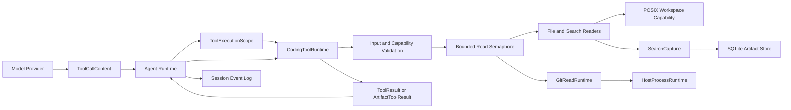
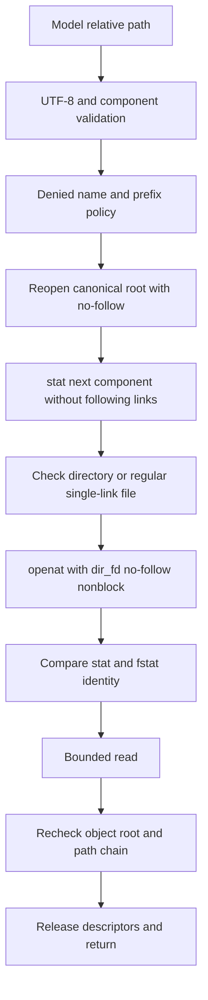
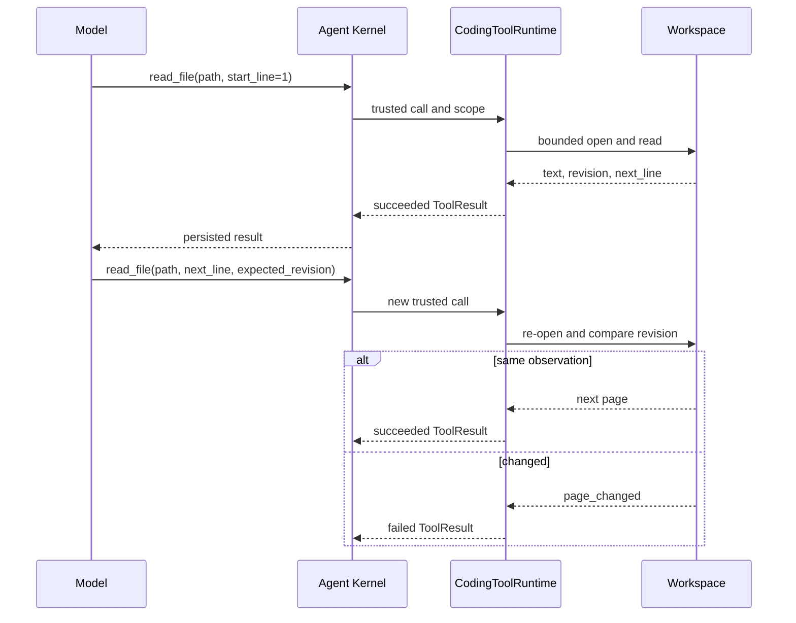
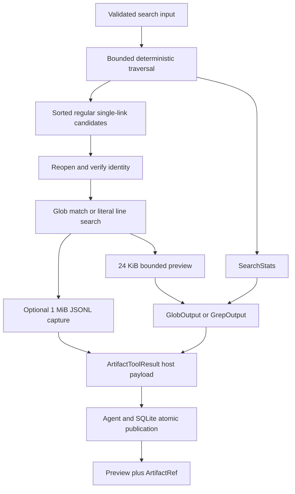
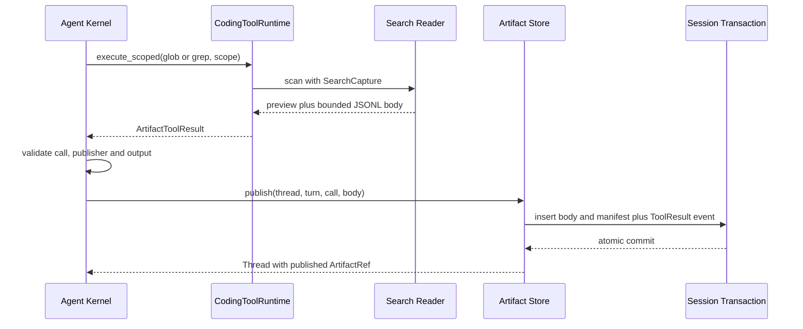
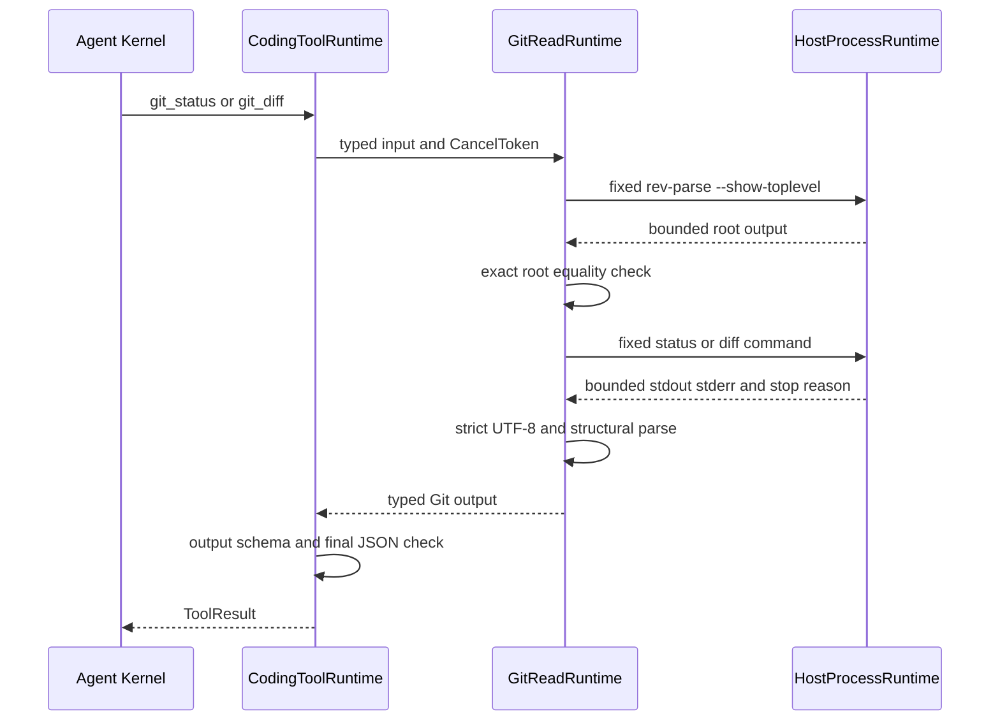
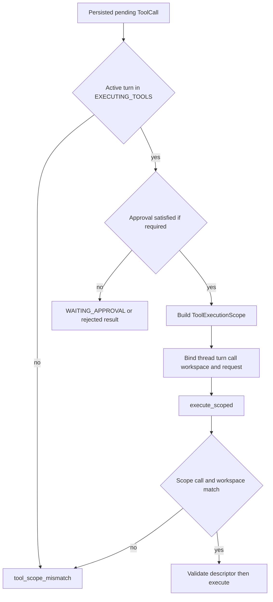
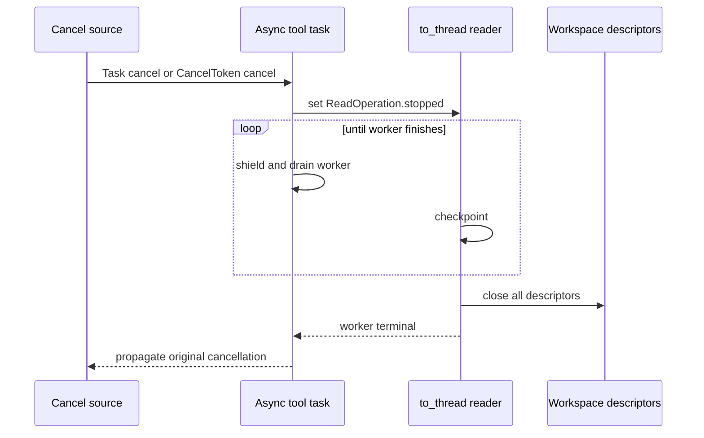

# Coding Tool Runtime模块设计

## 1. 文档摘要

| 项目 | 当前实现 |
|---|---|
| 模块职责 | 向Agent提供绑定单一Workspace的有界只读文件、搜索、Git和Artifact读取能力 |
| 核心门面 | `CodingToolRuntime` |
| 默认工具 | `list_files`、`read_file`、`glob`、`grep` |
| 显式能力 | 绑定Git可执行文件后增加`git_status`、`git_diff`；绑定Artifact Store后增加归档搜索和`read_artifact` |
| 权限来源 | 宿主构造的Workspace能力、版本化`ToolDescriptor`和Kernel注入的`ToolExecutionScope` |
| 并发模型 | 单Runtime有界并行读取，默认4，合法范围1～16；持久结果仍由Agent按Provider调用顺序提交 |
| 平台状态 | 当前安全Workspace实现要求POSIX及`O_NOFOLLOW`；Windows原生端口尚未完成 |
| 代码版本 | `efc7d82062681469651925bff411134c95d89a01` |

Coding Tool Runtime不是Shell、写文件接口或OS Sandbox。它只实现宿主预先授予的窄只读能力；Patch、
Process、测试执行和事务性交付由各自的可信执行模块负责，不能通过本模块的`READ_ONLY`声明旁路。

## 2. 需求背景

Coding Agent必须读取源码、定位文件、搜索文本并观察Git变化，但模型生成的路径和参数均不可信。
直接使用`Path.resolve()`、递归`glob`、任意`git`参数或可取消的后台线程，会留下以下生产风险：

1. 相对路径、符号链接、硬链接或目录替换逃逸已授权Workspace；
2. 文件在检查与读取之间变化，却仍把混合观察结果声明为完整事实；
3. 无上限目录、文件、行、结果或Git输出耗尽内存、时间和模型上下文；
4. 分页期间对象变化，后续页与首页来自不同版本；
5. Git配置触发外部Diff、textconv、fsmonitor、Pager或交互程序；
6. Task已取消但`to_thread`仍持有文件描述符，Runtime关闭后后台读取继续运行；
7. 模型在参数中伪造Thread、Workspace或Artifact归属；
8. 底层异常、绝对路径或私有内容进入模型可见错误和日志。

本模块因此采用“受信宿主绑定能力、严格数据合同、逐段文件描述符打开、观察身份校验、资源硬上限、
协作取消、结果再验证”的组合。Agent Kernel负责审批、持久化、并发批次和恢复；工具模块不自行创建
Session事实，也不把未提交结果当作已经发生。

## 3. 设计目标与非目标

### 3.1 目标

1. 模型只能调用固定名称和固定Schema的只读工具，不能提交绝对根、任意命令或Git配置；
2. Workspace根、对象身份、拒绝策略、输入/输出Schema和执行预算进入工具版本；
3. 路径逐段禁止链接跟随，拒绝特殊文件和多硬链接普通文件；
4. 目录、文件、搜索和Git输出均有可验证硬上限，并显式区分完整、截断和跳过；
5. 文件与目录分页携带revision，版本漂移时失败而非拼接不同观察；
6. 搜索结果确定性排序，非法UTF-8、二进制、超大文件和长行形成可见缺口；
7. 受信`ToolExecutionScope`与模型参数分离，Artifact归属绑定实际Thread和Workspace能力；
8. 任务取消、Token取消和Runtime关闭均等待工作线程或子进程回收后返回；
9. 预期工具错误转换为固定公开代码，底层异常正文不暴露；
10. Tool实现缺陷、输出合同错误和宿主作用域错误保持Kernel失败，不伪装为普通模型错误。

### 3.2 非目标

1. 不提供文件写入、Patch、删除、Shell、PTY、任意进程或任意Git子命令；
2. 不解析`.gitignore`、全局Git配置或任意正则表达式；
3. 不提供全树原子快照、内容寻址文件系统或跨进程Workspace读锁；
4. 不对同权限恶意宿主、管理员、挂载替换、inode重用或特殊网络文件系统提供安全证明；
5. 不把5秒协作Deadline声明为不可中断内核I/O的硬超时；
6. 不在默认产品装配中自动启用Artifact存储、任意Git路径或高风险执行能力；
7. 当前不提供Windows原生安全Workspace实现；
8. 不在工具层决定Agent重试、Turn恢复、模型历史裁剪或Artifact事务提交顺序。

## 4. 术语、信任边界与固定上限

### 4.1 术语

| 术语 | 定义 | 不是 |
|---|---|---|
| Workspace Root | 宿主创建Runtime时选择并严格解析的目录 | 模型可以覆盖的`cwd`参数 |
| Workspace Scope | 根路径、根设备/inode及拒绝策略等事实的SHA-256 | 密码学授权令牌或OS隔离 |
| Tool Version | `1.<contract_sha256>`形式的能力合同版本 | 手写语义版本或仅代码版本 |
| Revision | 一次文件/目录/Git观察的稳定摘要 | 文件内容哈希或锁定快照 |
| Execution Scope | Kernel构造的Thread/Turn/Call/Workspace归属 | Tool Input或可序列化给模型的权限 |
| Preview | 受模型结果预算约束的有界搜索结果 | 必然覆盖全部搜索记录 |
| Search Artifact | 搜索过程中捕获的完整有界JSONL记录流 | 任意文件备份或跨会话共享对象 |
| Scan Complete | 未截断且没有已知扫描缺口 | 未来读取时对象不会变化 |

### 4.2 固定资源边界

| 资源 | 当前上限 | 超限语义 |
|---|---:|---|
| 路径UTF-8字节/组件数 | 1024字节/64段 | `tool_path_denied` |
| 单路径组件 | 255字节 | `tool_path_denied` |
| 单次文件返回正文 | 24 KiB | 成功并标记`byte_limit`，至少保留完整行 |
| 单行读取 | 4 KiB | 文件读取失败；Grep跳过并计数 |
| 文件扫描 | 2 MiB | `tool_limit_exceeded` |
| 目录条目/名称字节 | 10000项/2 MiB | `tool_limit_exceeded` |
| 单页目录/搜索结果 | 200项 | 截断或按输入`limit/max_results`限制 |
| 搜索深度 | 32级 | `tool_limit_exceeded` |
| Grep单文件/总读取 | 2 MiB/16 MiB | 单文件跳过或整体失败 |
| 搜索预览记录预算 | 24 KiB | 成功并标记`output_limit` |
| Grep片段 | 384 UTF-8字节 | 字符边界裁剪并标记 |
| 最终工具JSON | 60000字节 | `tool_limit_exceeded` |
| Git Diff模型正文 | 48 KiB | 返回UTF-8完整前缀及全流摘要 |
| 只读协作期限 | 5秒 | `tool_timeout` |
| Runtime并发读取 | 默认4，范围1～16 | 构造非法则`tool_concurrency_invalid` |
| 搜索Artifact | 1 MiB/10000条 | `tool_limit_exceeded`，不发布伪完整正文 |
| Artifact分页 | 24 KiB/200条 | 合同拒绝不一致页面 |

## 5. 模块上下文与总体数据流



### 5.1 图示说明

1. Provider只能产生`ToolCallContent`，不直接持有Workspace、Git程序或Artifact Store；
2. Kernel先验证持久调用和审批状态，再构造不可变`ToolExecutionScope`；
3. `CodingToolRuntime`验证工具版本、指纹、Effect Class、审批位和Workspace标签；
4. 文件/搜索在线程中执行，Git通过受限`HostProcessRuntime`执行，二者共享单Runtime信号量；
5. 启用Artifact时，搜索返回的宿主载荷由Agent与Tool Result在Session事务中共同发布；
6. 普通结果和已发布Artifact引用最终都作为Session事实进入后续模型历史。

### 5.2 源码映射

- 门面与绑定：[runtime.py](../../src/harnessix/tools/runtime.py)中的`CodingToolRuntime`、`_ReadBinding`；
- Workspace能力：[workspace.py](../../src/harnessix/tools/workspace.py)中的`Workspace`、`ReadOperation`；
- 文件读取：[files.py](../../src/harnessix/tools/files.py)；
- 搜索：[search.py](../../src/harnessix/tools/search.py)与[patterns.py](../../src/harnessix/tools/patterns.py)；
- Git读取：[git.py](../../src/harnessix/tools/git.py)；
- Kernel作用域：[execution.py](../../src/harnessix/agent/execution.py)中的`ToolExecutionScope`；
- Artifact事务提交：[agent/runtime.py](../../src/harnessix/agent/runtime.py)中的`_record_tool_result`。

## 6. 组件职责与依赖边界

| 组件 | 生命周期与状态 | 直接依赖 | 禁止职责 |
|---|---|---|---|
| `CodingToolRuntime` | 宿主级异步上下文；持有Workspace、绑定表、信号量、可选Git/Artifact | Agent合同、Artifact端口、工具实现 | 自行决定Turn状态、执行写操作、接受动态工具注册 |
| `_ReadBinding` | 进程内不可变绑定元数据 | 输入/输出Pydantic模型 | 持有权限、运行工具或暴露给模型 |
| `Workspace` | Runtime生命周期内持有根FD与根身份 | POSIX `os`文件描述符接口 | 作为OS Sandbox、解析模型绝对路径 |
| `ReadOperation` | 单次同步读取；持有停止事件和单调Deadline | `threading.Event`、`time.monotonic` | 创建线程、提交结果或吞掉取消 |
| `files` | 无状态同步实现 | Workspace与文件合同 | 递归搜索、修改文件、自动重试分页 |
| `PathPattern` | 单个模式对象 | `fnmatchcase`和有界状态表 | 文件系统遍历、正则执行、花括号扩展 |
| `search` | 单次遍历状态、候选和统计 | Workspace、文件解码、Artifact硬上限 | 解析gitignore、跟随链接、隐藏扫描缺口 |
| `SearchCapture` | 单次Scoped搜索；累积有界JSONL | Artifact合同上限 | 直接写数据库或公开未提交正文 |
| `GitReadRuntime` | 绑定仓库根和受信可执行文件 | `HostProcessRuntime` | 接受模型argv、pathspec、revision或配置 |
| `ToolExecutionScope` | 单次调用不可变值对象 | Agent投影与审批摘要 | 充当文件系统能力或传入模型参数 |

`tools`包可以依赖Agent的稳定调用合同和Artifact发布端口，但不依赖具体Provider。Git读取复用Process
Runtime的进程监督，依赖方向只用于执行固定程序；它不开放`host.process`或测试Profile给本模块。

## 7. Tool Descriptor、版本与能力广告

### 7.1 公共Descriptor

所有本模块工具均声明：

| 字段 | 值/来源 | 约束 |
|---|---|---|
| `name` | 固定绑定名 | 模型不能新增或别名覆盖 |
| `version` | `1.`加执行合同SHA-256 | 规则、Schema、根身份或预算变化会改变版本 |
| `description` | 宿主固定简体中文说明 | 不含Workspace绝对路径 |
| `input_schema` | 严格Pydantic JSON Schema | `extra=forbid`、`strict=true` |
| `effect_class` | `READ_ONLY` | 不能宣称写操作为只读 |
| `risk_level` | `LOW` | 不替代Workspace安全校验 |
| `requires_idempotency` | `false` | 只读结果仍可能随Workspace变化 |
| `requires_approval` | 宿主构造参数 | 默认`false`，可整体要求审批 |
| `supports_reconciliation` | `false` | 未持久化的读取不自动对账重放 |
| `supports_parallel_calls` | `true` | 仍同时受Kernel批次和Runtime信号量限制 |

`definitions()`返回深拷贝，调用方修改Schema副本不会污染Runtime注册表。执行前
`_validate_definition`重新核对调用中的版本、指纹、Effect Class和审批位；任一漂移以
`tool_contract_changed`失败关闭，而不是尝试兼容执行。

### 7.2 版本摘要输入

文件与搜索工具版本至少绑定：实现标识、Workspace Scope、输入/输出Schema、并发模式、文本/行/
扫描/目录/结果/超时边界。搜索额外绑定模式语义、忽略目录和各搜索预算；启用Artifact后还绑定Store
合同并把输出Schema切换为归档结果。Git额外绑定可执行文件身份、固定环境、固定选项、Process捕获和
Diff上限。`read_artifact`绑定Workspace Scope、Artifact合同、分页Schema与并发上限。

因此同名工具在不同根、根对象被替换、策略变化、Artifact开关变化或Git程序变化后具有不同版本。
已持久化审批不能在新能力上静默继续。

## 8. 输入、输出与字段设计

### 8.1 `list_files`

| 字段 | 类型/默认 | 来源 | 语义与约束 |
|---|---|---|---|
| `path` | `str`, `.` | 模型 | 相对目录；根只表示为`.` |
| `limit` | `int`, 100 | 模型 | 1～200，严格整数 |
| `offset` | `int`, 0 | 模型 | 0～10000；大于0必须带revision |
| `expected_revision` | 64位hex或`null` | 上一页结果 | 防止跨版本拼页 |
| `entries` | `DirectoryEntry[]` | 目录观察 | 按名称排序、无重复；类型为file/directory/symlink/special |
| `revision` | 64位hex | Workspace与目录观察 | 绑定根scope、目录状态和条目身份/类型 |
| `truncated` | `bool` | 分页器 | 必须与`next_offset`存在性一致 |
| `next_offset` | `int`或`null` | 分页器 | 下一页位置；越过实际尾部失败 |

目录列举会显示未被策略拒绝的链接和特殊文件类型，便于模型观察，但`read_file`不会打开它们。被拒绝
名称在目录结果中直接隐藏。

### 8.2 `read_file`

| 字段 | 类型/默认 | 来源 | 语义与约束 |
|---|---|---|---|
| `path` | 必填相对路径 | 模型 | 仅普通、单硬链接文件 |
| `start_line` | `int`, 1 | 模型 | 1起始；大于1必须带revision |
| `max_lines` | `int`, 200 | 模型 | 1～2000 |
| `expected_revision` | 64位hex或`null` | 上一页/搜索命中 | 与当前对象观察不一致时`page_changed` |
| `text` | UTF-8字符串 | 文件 | 保留原换行；不替换非法字节 |
| `start_line/end_line` | 行范围 | 读取器 | 空文件`end_line=null` |
| `utf8_bytes` | 非负整数 | 实际正文 | 必须等于`text.encode()`长度且不超过24 KiB |
| `revision` | 64位hex | Workspace与文件状态 | 搜索命中可直接复用同一算法 |
| `truncation_reason` | `line_limit/byte_limit/null` | 读取器 | 与`truncated`严格一致 |
| `next_line` | `int`或`null` | 读取器 | 截断时为`end_line + 1` |

### 8.3 `glob`与`grep`

公共输入`path/max_results/include_ignored`分别表示相对起点、1～200条预览上限和是否取消性能忽略。
`include_ignored=true`只允许进入`node_modules`、虚拟环境、缓存、build/dist等固定目录，永远不能放宽
`.git`、`.env`、私钥或宿主拒绝路径。

`glob.pattern`支持大小写敏感的单段`*`、`?`、`[]`和完整路径段`**`；禁止绝对路径、反斜线、
空段、`.`、`..`和花括号。`grep.query`是大小写敏感字面量，不是正则；`include`使用相同Glob语义。

| 输出字段 | `glob` | `grep` | 不变量 |
|---|---|---|---|
| 主记录 | `paths[]` | `matches[]` | 按路径/行排序、无重复，最多200条 |
| `path` | 搜索起点 | 搜索起点 | 相对Workspace |
| `stats` | 扫描统计 | 扫描统计 | 每项非负并受合同约束 |
| `scan_complete` | 是否完整扫描 | 是否完整扫描 | 仅未截断且没有已知缺口时为真 |
| `truncated` | 结果/字节预算 | 结果/字节预算 | 与`truncation_reason`严格一致 |
| `truncation_reason` | result/output limit | result/output limit | 扫描硬预算超限不是截断成功，而是失败 |

`GrepMatch`包含`path`、1起始`line`、最多384字节`text`、`text_truncated`和文件`revision`。
`SearchStats`记录枚举项、读取文件/字节、性能忽略、不可读、超大、非法UTF-8、二进制和长行；这些
字段使“零命中”与“未完整检查”可区分。

### 8.4 Git输出

`git_status(limit=100)`的`limit`为1～200。输出包含branch、HEAD OID、upstream、ahead/behind、完整
条目总数、返回前缀、截断标记和原始porcelain输出摘要。条目类型为ordinary、renamed、unmerged或
untracked；重命名必须同时携带唯一`original_path`。

`git_diff(target="worktree", context_lines=3)`只允许worktree/staged和0～20上下文行。输出包含：

- `text`：最多48 KiB、位于合法UTF-8边界的前缀；
- `utf8_bytes`：实际前缀字节；
- `observed_bytes`：底层Process观察到的完整流字节数；
- `observed_sha256`：完整观察流摘要；
- `truncated`：完整观察流大于返回前缀时为真。

### 8.5 `read_artifact`

仅在同时配置Scoped Tool Runtime与Artifact Store时广告。输入是`artifact_id/offset/limit`，其中limit
为1～200。输出`ArtifactPage`包含原manifest、当前offset、以换行结束的JSONL文本和`next_offset`。
读取使用可信`scope.thread_id`及当前`workspace_scope`查询，模型不能在参数中指定Thread或Workspace。

## 9. Workspace能力与路径安全



### 9.1 路径语法与策略

`Workspace.parts()`先做纯输入校验，再触碰目标路径：路径不能为空，禁止反斜线、控制字符、绝对路径、
空段及`.`/`..`组件；根目录只有`.`这一种表示。策略比较使用`casefold()`，默认拒绝任意层级的Git、
Harnessix/Codex状态目录、SSH/AWS/GnuPG目录、`.env`变体、常见私钥名及`.pem/.key/.p12/.pfx`。
宿主`denied_paths`按完整组件前缀匹配，不采用易混淆的字符串前缀。

### 9.2 打开与竞态检查

Runtime启动时严格解析根目录并通过从`/`逐段`O_NOFOLLOW|O_DIRECTORY`打开根FD，保存设备/inode身份。
每次访问重新打开规范根并核对身份。目标路径逐段执行不跟随链接的`stat → openat → fstat`，比较
设备/inode；普通文件还要求链接数为1，使用`O_NONBLOCK`避免FIFO阻塞。

读取结束后再次核对目标状态、根身份和路径链中的名称到FD映射。任一对象替换、内容元数据变化或根
变化均返回`workspace_changed`并丢弃整次结果。该机制缩小常见TOCTOU窗口，但不是文件系统事务；同
权限恶意进程和特殊文件系统仍超出保证边界。

### 9.3 图示源码与测试

- 实现：[workspace.py](../../src/harnessix/tools/workspace.py)的`_parts`、`Workspace._open_root`、
  `Workspace.open`、`Workspace._check_type`；
- 路径和对象替换测试：[test_workspace.py](../../tests/tools/test_workspace.py)中的
  `test_change_during_read_discards_result_and_closes_descriptors`、
  `test_replace_between_stat_and_open_never_reads_new_object`、
  `test_root_replacement_between_calls_fails_and_same_root_reopens`；
- 链接/特殊文件测试：[test_files.py](../../tests/tools/test_files.py)中的
  `test_reject_links_and_special_files`。

## 10. 文件读取与稳定分页



`read_file`按二进制流逐行扫描，每次最多预读一个受限缓冲区。它先计算对象revision，再验证
`expected_revision`；对之前行的跳过仍计入2 MiB扫描预算，不能用大`start_line`绕过资源上限。正文
只在完整行可加入24 KiB预算时写入结果，因此不会截断半个UTF-8字符。空文件成功；已有文件的越界
行号失败。

`list_files`观察全部允许条目的名称、设备/inode和类型后计算revision，再进行排序分页。这样后续页
不会因为条目替换、增删或类型变化而继续，但目录中子文件内容变化不属于目录页revision。

缺少分页revision时，Runtime只在“补入合法占位revision后其余输入全部有效”的窄条件下返回
`tool_expected_revision_required`。消息只说明修正动作，不回显路径或参数值；模型必须发起新的调用，
Runtime不会从历史自动注入revision。

## 11. 搜索、完整性与Artifact数据流



### 11.1 遍历与匹配

搜索先在Workspace能力内递归收集普通、单硬链接候选，按完整相对路径排序，再执行匹配。目录递归使
用显式深度检查而非跟随文件系统Glob。发现对象和实际打开对象身份必须一致；任一变化使整个搜索失败，
此前命中不会作为部分成功返回。

Glob用逐段状态表解释`**`，其余单段由`fnmatchcase`处理。Grep先完整读取并验证一个候选文件的UTF-8
和控制字符，再逐行执行`str.find()`；每行只记录首次字面量命中。超大、非法UTF-8、二进制、不可读
和长行可被跳过，但必须在统计中保留并使`scan_complete=false`。枚举、总字节、深度或Deadline等硬
预算超限时整次调用失败，不把已扫描前缀伪装成完整结果。

### 11.2 Preview与完整归档

未配置Artifact时，达到`max_results`或24 KiB预览预算即停止，结果以`truncated=true`说明原因。
配置Artifact时，预览达到上限后仍继续有界扫描，并由`SearchCapture`记录每条匹配的规范JSONL；归档
正文受1 MiB/10000条硬上限保护。Capture是否完整只由扫描缺口决定，不把预览截断等同于归档不完整。

`execute_scoped`返回`ArtifactToolResult`宿主载荷，而不是直接把正文放进模型结果。Agent核对Publisher
身份与结果预算，再调用同一Session数据库的Artifact发布器，把正文、manifest和最终Tool Result原子
提交。失败或崩溃在提交前不会留下可见Artifact引用。



若Artifact Store已绑定，`glob`、`grep`和`read_artifact`禁止通过旧`execute()`入口调用，固定返回
`artifact_scope_required`，防止缺失可信Thread归属。Artifact详细事务、TTL、校验和回收语义见
[Artifact模块设计](artifacts.md)。

## 12. Git只读执行设计



Git工具只有宿主传入受信`git_executable`时才注册。Runtime不从`PATH`为模型发现程序，也不接受仓库
路径、revision、pathspec、子命令或配置参数。每次调用先执行固定`rev-parse --show-toplevel`，输出
必须逐字等于规范Workspace根；父仓库中的子目录不会被提升为授权仓库。

进程环境固定关闭全局/系统配置、可选锁、Pager、终端提示并限制`PATH`与locale；全局参数关闭颜色、
fsmonitor和Hook路径。Diff另外关闭external diff和textconv，并以`--`终止选项。底层仍是宿主Git
进程，不是Sandbox；安全声明只覆盖当前固定命令和绑定环境。

Git进程取消、超时和输出证据复用[0.5 Coding Tool设计](../m05-coding-tools.md)中的Process Runtime对应底层能力；当前源码入口
是[git.py](../../src/harnessix/tools/git.py)中的`GitReadRuntime._runtime`和`_run`。解析器不回显stderr，
非法UTF-8、非零退出、捕获不完整或未知记录分别收敛为固定读取错误。

## 13. 可信执行作用域与审批边界



`ToolExecutionScope.for_pending_call()`只接受当前Thread的活跃Turn、`EXECUTING_TOOLS`状态和仍未完成的
持久调用。字段包括`thread_id/turn_id/call_id/workspace/request_fingerprint`，采用frozen/slots数据类。
`validate_call()`重新计算执行指纹，防止调用ID、参数、工具版本或Workspace在构造后漂移。

Scope由Kernel传入函数参数，不使用全局变量或`ContextVar`，也不进入Tool Input Schema。它只是同进程
受信组件之间的归属合同，不是可以抵御恶意Python插件的令牌。`CodingToolRuntime.execute_scoped()`还
要求`scope.workspace == str(workspace_root)`，不匹配时在目标I/O前失败。

`require_approval=true`只改变Descriptor和调用审批流程，不扩大工具能力。审批摘要绑定完整Descriptor、
Thread/Turn/Workspace和调用参数；Workspace Scope或规则变化导致版本变化，旧审批无法执行新能力。

## 14. 并发、取消与生命周期

### 14.1 两层并发控制

Kernel只并行连续的、无需审批、定义明确声明并发且Effect Class为`READ_ONLY`的安全前缀；审批、未知、
Patch、Process和写调用均是顺序屏障。并发任务完成后，Kernel仍按Provider调用顺序验证、发布Artifact
和提交Session，所以墙钟完成顺序不进入持久语义。

`CodingToolRuntime`再用`BoundedSemaphore`限制自身文件、搜索、Git和Artifact读取。该上限约束单进程
Runtime，不是跨进程或跨Runtime锁，也不阻止外部进程同时修改Workspace。

### 14.2 取消与资源排空



文件和搜索通过`run_read_operation()`在线程执行。异步Task取消时先设置线程安全停止事件，再屏蔽重复
取消并等待工作线程结束；只有Workspace上下文释放全部FD后才传播原始`CancelledError`。领域
`CancelToken`由外层`cancel.run()`管理，读取线程通过相同停止路径收到取消。

`aclose()`先把Runtime标记为关闭，拒绝新调用，再获取全部信号量许可，证明没有在途读取后关闭根FD。
关闭任务本身被取消时，`_drain()`仍等待清理完成，然后传播取消。排队任务若在获得许可前取消，不会
启动第二个工作线程。

### 14.3 协作Deadline

`ReadOperation`使用`time.monotonic()`建立有限正数Deadline，并在路径、目录、块和行边界检查。该机制
对可返回用户态的循环提供5秒上限；若底层内核或文件系统调用永久阻塞，Python线程不能被强制终止，
所以当前合同只声明协作Deadline。

## 15. 正常、失败与恢复流程

### 15.1 正常只读调用

1. Kernel从当前定义创建并持久化Tool Call；
2. 如需审批，先进入`WAITING_APPROVAL`，批准后再进入工具执行；
3. Kernel核对定义并构造Scoped作用域，Runtime再次验证合同；
4. Runtime严格校验输入，获取信号量许可并执行有界I/O；
5. 输出按绑定Pydantic模型进行JSON往返再验证，并检查最终JSON大小；
6. Agent核对`call_id`和Turn输出预算，提交Tool Result；
7. 后续模型步骤从Session事实读取结果，不重新执行已完成调用。

### 15.2 可预期工具失败

路径、编码、类型、分页变化、输入、资源或I/O失败返回`ToolResultContent(outcome="failed")`。公开消息
固定为“工具参数不符合契约”“工作区读取未完成”或专用分页修正，不包含OS错误正文、绝对路径、查询
值或栈。失败结果与成功结果一样持久化，模型可据稳定code发起新的调用。

### 15.3 Runtime缺陷和集成错误

输出模型不匹配、工具合同漂移、作用域错配、Runtime已关闭或Artifact Publisher不匹配属于受信组件
错误，抛出`KernelError`。这些场景不伪造一个确定工具结果，以免Session把内部错误记录成模型可纠正
事实。

### 15.4 崩溃恢复

工具结果已经原子提交时，Session重开和Replay复用该结果，不重读Workspace。调用开始后、结果提交前
进程退出时，启动恢复把活跃Turn保守标记为`INTERRUPTED`；即使工具是只读，也不自动重复观察，因为
Workspace可能已经变化。等待审批的调用只有在当前版本、指纹、Workspace和策略重新核对后才能继续。

Artifact搜索的正文和Tool Result在同一事务发布；提交前崩溃没有可见引用，提交后重开可验证正文。
Git读取没有Effect Journal或Reconcile能力，未提交结果同样不自动重跑。

## 16. 失败语义矩阵

| 场景 | 稳定code/信号 | 返回形态 | 是否触碰目标I/O | 恢复原则 |
|---|---|---|---:|---|
| 工具未注册 | `unknown_tool` | failed Tool Result | 否 | 模型可换用已广告工具 |
| 普通输入Schema错误 | `tool_invalid_arguments` | failed Tool Result | 否 | 新Call纠正，不自动重试 |
| 分页缺revision且其余合法 | `tool_expected_revision_required` | failed Tool Result | 否 | 显式复制上一页revision |
| 调用版本/指纹/Effect/审批位漂移 | `tool_contract_changed` | KernelError | 否 | 使用新定义重新规划 |
| Scoped Call身份漂移 | `tool_scope_mismatch` | KernelError | 否 | 重新从当前投影构造 |
| Thread Workspace标签不匹配 | `tool_workspace_mismatch` | KernelError | 否 | 修复宿主装配 |
| 旧入口调用Artifact工具 | `artifact_scope_required` | KernelError | 否 | 改用Scoped入口 |
| Runtime已关闭 | `tool_runtime_closed` | KernelError | 否 | 创建新Runtime |
| 路径/链接/硬链接被拒绝 | `tool_path_denied` | failed Tool Result | 最小路径核对 | 不放宽策略重试 |
| 不存在 | `tool_not_found` | failed Tool Result | 是 | 模型可重新定位 |
| 文件类型不符 | `tool_wrong_file_type` | failed Tool Result | 是 | 使用匹配工具 |
| 非法UTF-8/二进制 | `tool_invalid_utf8`/`tool_binary_file` | failed Tool Result | 是 | 不自动转码 |
| 分页对象变化 | `tool_page_changed` | failed Tool Result | 是 | 从首页重新观察 |
| 读取中对象/根变化 | `tool_workspace_changed` | failed Tool Result | 是 | 丢弃全部部分结果 |
| 页位置越界 | `tool_offset_out_of_range` | failed Tool Result | 是 | 修正位置 |
| 硬预算超限 | `tool_limit_exceeded` | failed Tool Result | 是 | 缩小范围或模式 |
| 协作Deadline到期 | `tool_timeout` | failed Tool Result | 是 | 不自动重读 |
| 受控OS/进程失败 | `tool_io_failed` | failed Tool Result | 是 | 原文不公开 |
| 输出合同实现缺陷 | `tool_output_invalid` | KernelError | 已执行 | 修复实现，不持久伪结果 |
| 取消 | `TurnCancelled`/`CancelledError` | 非Tool Result | 可能已开始 | 先排空资源，再由Kernel持久取消 |
| 结果提交前崩溃 | `INTERRUPTED` | Session终态 | 已执行 | 不自动重复观察 |

错误分类由Agent顶层将`tool_`、`artifact_`、`git_`等前缀归为`tool`，但取消、审批、冲突、Provider、
存储和预算的专用类别具有更高优先级。调用方必须按code分支，不依赖简体中文message。

## 17. 持久化、事务与一致性

本模块自身不建立数据库表。持久边界如下：

| 事实 | 权威存储 | 写入方 | 一致性 |
|---|---|---|---|
| Tool Call、Result和Turn状态 | Session Event Log与投影 | Agent Runtime | 事件与投影同事务CAS提交 |
| 搜索Artifact正文、manifest和结果引用 | Session SQLite Artifact表 | Artifact Store经Agent调用 | 与最终Tool Result同事务发布 |
| Tool Descriptor/Workspace Scope | Runtime内存与持久Tool Call副本 | 宿主/Agent | 执行时重新核对版本和指纹 |
| 文件/目录revision | 单次Tool Result | 文件读取器 | 观察摘要，不是持久锁或内容快照 |
| Git状态/Diff摘要 | 单次Tool Result | Git解析器 | 绑定一次进程观察，不锁仓库 |

`Workspace.scope`包含规范根字符串，属于Session私有能力摘要，不应作为公开Metric标签。根FD只存在于
进程内，重开Runtime会重新取得当前根身份；若根对象不同，工具版本变化并拒绝旧调用。

## 18. 安全与隐私

### 18.1 威胁与缓解

| 威胁 | 当前缓解 | 剩余风险 |
|---|---|---|
| `../`、绝对路径、反斜线和控制字符逃逸 | 纯语法校验后按相对组件打开 | 非标准文件系统语义需平台专项验证 |
| Symlink/Junction式替换 | POSIX no-follow、stat/fstat身份及读后链核对 | 当前没有Windows Reparse Point实现 |
| 硬链接绕过名称策略 | 普通文件要求`st_nlink == 1` | 同权限恶意宿主仍可制造复杂竞态 |
| FIFO/设备阻塞或泄漏 | 普通文件/目录类型校验、`O_NONBLOCK` | 内核/网络文件系统阻塞无硬终止 |
| Secret目录被模型扫描 | 默认拒绝集、casefold和宿主前缀策略 | 不是内容DLP，未知Secret路径需宿主配置 |
| 搜索遗漏被误判为不存在 | 完整性、截断和跳过统计 | 搜索后Workspace仍可能变化 |
| Git配置启动程序 | 固定参数和环境，禁用已知扩展点 | Git二进制及仓库解析仍在宿主权限运行 |
| 模型伪造归属 | Scope与Input分离，指纹和Workspace双重核对 | 同进程恶意插件不受数据类约束 |
| 底层异常泄漏 | 固定code/message，不回显OS/Git stderr | 调试日志新增内容仍需遵守脱敏规则 |
| Artifact跨会话读取 | 可信Thread、Workspace Scope和Store验证 | Fork继承Artifact主动分页仍有限制 |

### 18.2 数据分类

Tool输入路径、搜索词、源码正文、Git Diff和Artifact正文均视为用户私有内容。它们可以出现在Session
私有Item或Artifact正文，但不得进入低基数Metric标签；错误消息不回显这些值。工具版本包含摘要而不
包含正文，不过Workspace Scope的输入含规范路径，因此只在受信边界中使用，不作为公开标识。

### 18.3 部署约束

产品状态目录必须位于Workspace之外且不得互相包含。Git可执行文件由宿主使用绝对路径解析和绑定。
无隔离Host模式读取的是当前用户权限可访问内容；处理不可信仓库时，仍需由Sandbox、网络策略、Secret
注入和Process模块提供更高层隔离，不能把Workspace路径约束解释为进程安全边界。

## 19. 可观测性与运维诊断

工具模块不直接创建Span或高基数Metric。Agent Runtime在每次调用外层创建`tool` operation，记录
Thread、Turn和Call归属、结果状态、稳定错误类别与时延；并发完成顺序只可从Span时间观察，不写入
Session语义。

建议运维面板聚合：

- `tool`成功/失败/取消计数和时延分布；
- `tool_invalid_arguments`与`tool_expected_revision_required`比例；
- `tool_workspace_changed`、`tool_timeout`、`tool_limit_exceeded`和`tool_io_failed`趋势；
- Artifact发布失败、过期和损坏分类；
- Runtime关闭耗时和取消后资源排空异常。

禁止使用工具名以外的路径、查询、文件名、Artifact ID、revision、Workspace Scope、Diff正文或错误原文
作为Metric标签。诊断`workspace_changed`时应复现根/中间目录/文件身份变化，不能从固定公开消息推断
具体私有路径。

## 20. 核心业务逻辑伪代码

### 20.1 Runtime执行

```text
execute_call(call, cancel, optional_capture):
  require cancellation checkpoint
  definition = trusted definitions[call.tool]
  if definition missing:
    return failed(unknown_tool)
  require call version, fingerprint, effect and approval equal definition

  args = strict_validate(binding.input_model, call.arguments)
  if invalid:
    if exactly a valid later page missing revision:
      return failed(tool_expected_revision_required)
    return failed(tool_invalid_arguments)

  under bounded read permit:
    require runtime not closed
    execute fixed file, search or git implementation

  checked = JSON round-trip through binding.output_model
  if checked invalid:
    raise tool_output_invalid
  if final canonical result exceeds budget:
    return failed(tool_limit_exceeded)
  return succeeded(checked)
```

### 20.2 Workspace打开

```text
open(relative_path, expected_type):
  parts = validate relative syntax and denied policy
  root_fd = reopen canonical root without following links
  require root identity equals runtime-bound identity

  for each component:
    before = stat without following links
    require expected directory or regular single-link file
    child_fd = openat(parent_fd, no-follow, nonblock)
    after = fstat(child_fd)
    require before identity equals after identity

  yield final fd to bounded reader

  require final metadata unchanged
  require canonical root identity unchanged
  require every component name still resolves to its opened identity
  close every fd on all exits
```

### 20.3 搜索与Artifact

```text
search(args, optional_capture):
  candidates = bounded_walk_workspace(args.path)
  sort candidates by full relative path
  for candidate:
    reopen candidate and require discovered identity
    produce glob record or validated grep hit
    append record to optional bounded complete capture
    append record to preview while result and byte budgets permit
    without capture, stop when preview truncates

  stats = all observed skips and resource facts
  preview_complete = not preview_truncated and no stats gaps
  capture_complete = no stats gaps
  return preview and optional host-only capture

agent_publish(artifact_tool_result):
  require configured publisher is identical
  validate public Tool Result
  in one Session transaction:
    insert immutable body and manifest
    append Tool Result containing preview and ArtifactRef
    update Thread projection
```

### 20.4 取消与关闭

```text
cancel_read(worker):
  set cooperative stop event
  while worker is not terminal:
    shield worker from repeated task cancellation
  consume worker exception if any
  propagate original cancellation

close_runtime():
  mark closed before waiting
  acquire every semaphore permit
  close workspace root descriptor
  release permits
  if close task was cancelled:
    finish cleanup first, then propagate cancellation
```

## 21. 源码与测试双向映射

| 设计元素 | 源码文件与关键符号 | 主要测试与函数 |
|---|---|---|
| Tool绑定、版本和执行 | [runtime.py](../../src/harnessix/tools/runtime.py)：`_ReadBinding`、`CodingToolRuntime.__init__`、`_validate_definition`、`_execute_call` | [test_runtime.py](../../tests/tools/test_runtime.py)：`test_execution_rechecks_trusted_contract`、`test_definitions_are_isolated_and_unknown_tools_fail` |
| 文件/目录合同 | [contracts.py](../../src/harnessix/tools/contracts.py)：`ListFilesInput/Output`、`ReadFileInput/Output` | [test_files.py](../../tests/tools/test_files.py)：`test_read_utf8_pages_and_detect_change`、`test_list_sorted_pages_and_hide_denied_paths` |
| 文件读取 | [files.py](../../src/harnessix/tools/files.py)：`list_files`、`read_file` | [test_files.py](../../tests/tools/test_files.py)：编码、空文件、长行、扫描与JSON边界用例 |
| Workspace安全 | [workspace.py](../../src/harnessix/tools/workspace.py)：`_parts`、`Workspace.open`、`revision_state` | [test_workspace.py](../../tests/tools/test_workspace.py)：路径替换、根替换、Deadline、策略前缀用例 |
| Glob模式 | [patterns.py](../../src/harnessix/tools/patterns.py)：`PathPattern` | [test_search.py](../../tests/tools/test_search.py)：`test_bounded_glob_semantics` |
| 搜索合同与统计 | [search_contracts.py](../../src/harnessix/tools/search_contracts.py)：`GlobInput/Output`、`GrepInput/Output`、`SearchStats` | [test_search.py](../../tests/tools/test_search.py)：参数、排序、截断和不变量用例 |
| 搜索遍历与匹配 | [search.py](../../src/harnessix/tools/search.py)：`_collect`、`glob`、`grep` | [test_search_boundaries.py](../../tests/tools/test_search_boundaries.py)：忽略/权限、缺口、替换、预算、取消、超时用例 |
| Search Artifact捕获 | [search.py](../../src/harnessix/tools/search.py)：`SearchCapture`；[runtime.py](../../src/harnessix/tools/runtime.py)：`execute_scoped` | [tests/artifacts](../../tests/artifacts/)：发布、读取、配额、损坏和恢复套件 |
| Artifact分页 | [runtime.py](../../src/harnessix/tools/runtime.py)：`_read_artifact`；[contracts.py](../../src/harnessix/artifacts/contracts.py)：`ArtifactPage` | [test_server_sdk.py](../../tests/app_server/test_server_sdk.py)：`test_artifact_read_is_advertised_only_with_scoped_reader` |
| Git合同 | [git_contracts.py](../../src/harnessix/tools/git_contracts.py)：`GitStatusOutput`、`GitDiffOutput` | [test_git.py](../../tests/tools/test_git.py)：结构化状态、Diff前缀和合同边界用例 |
| Git固定执行 | [git.py](../../src/harnessix/tools/git.py)：`GitReadRuntime`、`_status`、`_diff` | [test_git.py](../../tests/tools/test_git.py)：`test_git_disables_external_diff_and_fsmonitor`、`test_git_rejects_parent_repository_and_invalid_contract` |
| 可信Scope | [execution.py](../../src/harnessix/agent/execution.py)：`ToolExecutionScope`；[runtime.py](../../src/harnessix/tools/runtime.py)：`execute_scoped` | [test_scoped_runtime.py](../../tests/tools/test_scoped_runtime.py)：审批恢复、Workspace错配、模型注入用例 |
| 分页纠正 | [runtime.py](../../src/harnessix/tools/runtime.py)：`_argument_failure` | [test_paging_feedback.py](../../tests/tools/test_paging_feedback.py)：双Provider纠正和Replay；[test_kernel.py](../../tests/tools/test_kernel.py)：持久纠正循环 |
| 并发和关闭 | [runtime.py](../../src/harnessix/tools/runtime.py)：`_execute_read`、`_execute_git`、`aclose`、`_drain` | [test_runtime.py](../../tests/tools/test_runtime.py)：并发上限、排队取消、FD回收和关闭取消用例 |
| 崩溃恢复 | Agent持久执行链与本模块执行入口 | [test_recovery.py](../../tests/tools/test_recovery.py)：`test_real_read_process_crash_does_not_repeat`；[test_kernel.py](../../tests/tools/test_kernel.py)：`test_kernel_cancel_during_file_read_is_durable` |

### 21.1 推荐源码阅读顺序

1. 从[contracts.py](../../src/harnessix/tools/contracts.py)、
   [search_contracts.py](../../src/harnessix/tools/search_contracts.py)和
   [git_contracts.py](../../src/harnessix/tools/git_contracts.py)理解模型可见边界；
2. 阅读[runtime.py](../../src/harnessix/tools/runtime.py)的绑定、版本、Scoped入口、错误转换和生命周期；
3. 阅读[workspace.py](../../src/harnessix/tools/workspace.py)的根FD、路径策略和竞态检查；
4. 阅读[files.py](../../src/harnessix/tools/files.py)与[search.py](../../src/harnessix/tools/search.py)的数据算法；
5. 阅读[git.py](../../src/harnessix/tools/git.py)的固定命令和Process结果解释；
6. 最后沿[agent/runtime.py](../../src/harnessix/agent/runtime.py)的`_execute_tool`、
   `_execute_parallel_reads`和`_record_tool_result`查看持久化及Artifact提交。

## 22. 测试设计与验收标准

`tests/tools`当前收集198项测试，按职责分组如下：

| 测试组 | 证明内容 |
|---|---|
| `test_files.py` | UTF-8/CRLF、分页revision、拒绝路径、链接/特殊文件、扫描/行/正文/JSON上限和错误脱敏 |
| `test_workspace.py` | 根、目录、文件替换，stat/open竞态，路径预校验，策略组件前缀和Deadline |
| `test_search.py` | Glob语义、Grep命中到Read revision、结果截断、严格参数和输出不变量 |
| `test_search_boundaries.py` | 忽略与权限分离、扫描缺口、字符边界、硬预算、对象变化、取消和协作超时 |
| `test_git.py` | 显式注册、结构化状态、staged/worktree、UTF-8前缀、配置禁用、根核对和非仓库失败 |
| `test_runtime.py` | 合同重核、输出缺陷、Task/Token取消、并发上限、排队取消和关闭回收 |
| `test_scoped_runtime.py` | 审批恢复、作用域错配在I/O前失败、模型不能注入Scope |
| `test_kernel.py` | SDK/Kernel真实文件链、持久分页纠正、审批重开、Schema冻结和持久取消 |
| `test_paging_feedback.py` | OpenAI-compatible/Anthropic模型视图保留稳定纠正错误 |
| `test_recovery.py` | 多个崩溃注入点下未提交读取不重复、已提交结果可恢复 |
| `test_search_kernel.py` | 搜索SDK链、审批重开、工具版本兼容和冻结Schema |

模块完成验收要求：

1. 全部`tests/tools`通过且收集数量无意外下降；
2. Workspace安全、分页、搜索完整性、Git固定命令、Scope、并发、取消和崩溃各有失败测试；
3. 输入/输出Schema冻结或有明确版本迁移，不以宽松解析修复模型参数；
4. 源码与测试链接存在，文档中的类、函数、错误码和上限可在当前版本定位；
5. Mermaid图可渲染，正文解释跨模块箭头和失败返回；
6. 文档不包含Secret、个人绝对路径、对话过程或未经实现的能力声明。

## 23. 平台、装配与兼容

### 23.1 当前产品装配

`product_config.server`在启动默认App Server时先执行平台能力检查，再创建
`CodingToolRuntime(workspace_root, git_executable=git_path)`，并以`scoped_tools`传入Agent Runtime。
默认未传Artifact Store，因此只提供四个文件/搜索工具；Git也只有用户显式配置受信绝对路径时出现。
产品状态目录与Workspace必须互不包含。

### 23.2 平台矩阵

| 平台 | 当前状态 | 依据 |
|---|---|---|
| macOS | 当前支持POSIX只读Runtime | 本地套件及macOS CI |
| Linux | 当前支持POSIX只读Runtime | Python 3.12/3.13 CI |
| Windows | 核心包可安装/导入，但本模块原生能力未实现 | `Workspace.__init__`要求POSIX和`O_NOFOLLOW` |
| WSL2 | 可作为Linux环境使用，不等于Windows原生支持 | 平台边界见ADR 0063 |

Windows 1.0目标必须另行实现盘符、UNC、大小写、保留名、ADS、长路径、Reparse Point/Junction、共享
模式和替换恢复的正式端口及故障测试。不得用跳过当前POSIX检查、字符串`resolve()`或WSL兼容声明
代替原生安全语义。

### 23.3 兼容与升级

工具输入/输出和Descriptor变更通过版本摘要传播，不修改已完成Session结果。部署升级前应停止接收新
Turn并排空在途调用；未完成调用若版本漂移会失败关闭。Artifact Store开关和Git程序绑定改变广告集合
及版本，客户端必须重新读取能力，不能缓存旧定义跨Runtime复用。

## 24. 已知限制、风险与后续工作

| 限制/风险 | 当前影响 | 路线图归属 |
|---|---|---|
| Windows原生Workspace未实现 | 默认Coding Tool产品不能在Windows原生运行 | 0.9.1 |
| Workspace不是OS Sandbox | 同权限恶意代码可攻击宿主文件和进程边界 | 0.9.4及Sandbox模块 |
| 协作Deadline不能终止永久内核阻塞 | 极端文件系统故障可能延长取消/关闭 | 0.9.3可靠性 |
| revision不是内容哈希或原子快照 | 只证明当前定义的元数据观察一致性 | 保持明确合同；未来快照能力另行设计 |
| 搜索无正则、gitignore和游标 | 大仓库需缩小范围，结果体验有限 | 0.9.1产品体验/Eval验证 |
| 搜索先收集候选再匹配 | 接近10000项时存在内存和首结果时延 | 0.9.3性能基准 |
| 无跨进程Workspace读写锁 | 多Runtime或外部进程可引起`workspace_changed` | Workspace/Delivery后续治理 |
| Git不是Sandbox且能力仅两项 | 不能安全扩展为任意Git操作 | 新Git能力必须独立威胁建模 |
| 默认产品未装配Artifact | 长搜索只有有界预览，不能分页取全量 | 0.9.1产品装配 |
| Fork继承Artifact不能由子Thread主动分页父正文 | 长历史分支可验证但可取回性受限 | 0.9.1/0.9.4 |
| 工具层不输出独立资源指标 | 诊断依赖Agent Span和错误分类 | Observability模块治理 |

后续工作不得直接向本模块加入写文件或任意命令。写入必须经过Prepared Patch、审批、Workspace租约和
事务性交付；进程必须经过Process Action、Sandbox、资源监督和Effect Journal；新只读工具也必须先
定义输入/输出上限、版本摘要、取消、错误、平台边界及回归测试。

## 25. 变更记录

| 版本 | 代码基线 | 变更 |
|---:|---|---|
| 1 | `efc7d82062681469651925bff411134c95d89a01` | 建立Tools包现行事实源，覆盖文件、搜索、Git、Artifact、Scope、并发、取消、恢复、安全、平台和源码测试映射 |
