# Trusted Actions模块设计

## 1. 模块摘要

| 项目 | 内容 |
|---|---|
| 源码包 | [`src/harnessix/trusted_actions`](../../src/harnessix/trusted_actions/) |
| 当前职责 | 把内置、MCP、Skill、Hook和Custom Tool绑定为宿主可信合同；规范化资源；统一完成Policy、Execution Plan、Approval、执行、摘要审计、`UNKNOWN`恢复和Reconcile |
| 非职责 | 不实现模型Agent Loop、Tool发现协议、Secret明文解析、Sandbox执行器、Workspace锁、外部效果本体、集中式多租户认证或分布式任务调度 |
| 上游调用者 | 受信产品装配、MCP/Skill/Hook Gateway、Git Push桥接及直接使用该库的宿主 |
| 下游依赖 | `execution`、`workspace`、`domain`基础枚举、Pydantic合同、两个SQLite Store，以及宿主注册的Resolver/Executor |
| 持久化 | `SQLiteExecutionPlanStore`保存Execution Plan/Approval；`SQLiteActionAuditStore`保存Route Plan、当前投影和append-only Hash链 |
| 平台 | 合同与Store平台中立；Workspace/Sandbox能力由Execution Plan绑定；SQLite文件权限仅在POSIX显式收紧 |
| 代码版本 | `82e247a8d083f3f8a7d68ee091a43d59096f298d` |
| 当前完成度 | 核心路由库、MCP/Skill/Hook适配和Git Push证明已实现；0.9.1e1已增加产品目录原子安装及Audit优先的幂等规划修复，默认产品尚未注册Patch/Process/Delivery，也没有公网多租户控制面 |

本文是`trusted_actions`包当前实现的事实源。跨包Action Request、Journal、Worker和Effect Executor以
[Action Plane子系统设计](../subsystems/action-plane.md)为事实源；不可变执行计划以
[Execution Plan模块设计](execution.md)为事实源；Sandbox、Secret、Workspace和Delivery分别以
[Sandbox模块设计](sandbox.md)、[Secrets模块设计](secrets.md)及后续独立模块设计为事实源。

## 2. 需求背景

Coding Agent的执行入口不只来自内置Tool。MCP Server可动态提供Schema，Skill和Hook来自扩展目录，
Git Push会改变外部仓库事实，未来还可能存在自定义Tool。若每个来源各自决定风险、审批、Sandbox、
Secret和失败恢复，会产生以下生产风险：

1. 模型或扩展通过自报“只读/低风险”降低宿主Policy；
2. 广告给模型的Schema与最终执行器、版本或远端目录发生漂移；
3. 同一写操作绕过统一审批，直接调用旧Action Service或宿主Executor；
4. 外部效果已经发生但响应丢失时，被通用重试再次执行；
5. 宿主崩溃后无法区分“尚未调用”和“调用结果未知”；
6. 扩展持有Session、Secret Provider、文件系统或通用spawn对象，形成宽权限旁路；
7. 资源、Policy、批准和结果分散在不同日志中，无法建立可恢复的因果链。

`trusted_actions`把上述来源压入一条宿主持有的风险路由。调用者只提交Tool身份与业务参数；效果等级、
风险、恢复模式、Schema摘要、资源解析器和Executor均来自注册时的可信Binding。路由在副作用前冻结
Workspace、环境摘要、Secret版本、Sandbox Profile和能力证据，并在执行前重新核对持久事实。

## 3. 设计目标、非目标与关键术语

### 3.1 当前设计目标

1. 所有来源使用同一`TrustedActionRouter`生命周期和默认风险决策；
2. 调用方不能提交或覆盖`effect_class`、`risk_level`、Policy、Sandbox和Executor身份；
3. Tool来源、来源实例、名称、版本、Fingerprint、输入Schema和Binding摘要不可分割；
4. 业务参数先按已注册Schema解码并规范化，再进入Resolver、Plan和Executor；
5. 资源标识及属性只以SHA-256进入Route和Audit，按稳定顺序去重；
6. Execution Plan同时绑定Workspace Snapshot、环境值摘要、Secret版本、Sandbox和能力证据；
7. Approval只授权一个Execution Plan Fingerprint，拒绝旧批准复用于新计划；
8. Plan在效果发生前持久化，状态在调用Executor前先进入`running`；
9. 只读失败可确定为`failed`，写效果不确定时保守进入`unknown`；
10. `running/reconciling`宿主中断后只恢复为`unknown`，禁止自动重放；
11. 外部非幂等写使用确定`external_action_id`并只通过Reconcile确认事实；
12. Action Audit只保存输出摘要和Artifact摘要，不保存执行输出正文；
13. 扩展端口固定`source/source_id`，阻止跨来源Plan读取与执行；
14. 公共持久合同使用固定`spec_version`并生成JSON Schema。

### 3.2 明确非目标

- 不替代[`domain`](domain.md)中的通用Action Plane、Worker、Lease和多后端Journal；
- 不实现Tool本身的文件、进程、网络、Git或SaaS效果；
- 不自动推导MCP Annotation、Tool描述或模型参数中的风险级别；
- 不向Executor解析或注入Secret明文；
- 不为Executor提供通用Timeout、Retry、取消Token或进度流协议；
- 不保存Tool输出正文，不提供Artifact正文Store；
- 不验证摘要的签名、MAC、远端证明或可信时间戳；
- 不抵御能够修改进程内Registry、重算数据库Hash或注入同进程Python代码的主体；
- 不提供Router/Registry的跨进程发现、热更新、注销或版本协商；
- 不提供集中式主体认证、租户隔离、RBAC、审计导出和合规留存；
- 不保证当前库已经接入默认`agent-server`产品链。

### 3.3 关键术语

| 术语 | 定义 |
|---|---|
| Trusted Tool Binding | 宿主冻结的Tool来源、版本、Schema、风险、恢复和Executor身份合同 |
| Invocation | 调用方提交的Tool身份、规范JSON参数和可选幂等键，不含风险与权限 |
| Canonical Resource | 由受信Resolver产生、仅保留类型/访问模式及标识/属性摘要的资源 |
| Route Plan | Invocation、Binding、资源、Execution Plan和外部Action身份的不可变组合 |
| Execution Plan | Workspace、环境、Secret、Sandbox、Policy和能力证据的不可变执行合同 |
| Approval Checkpoint | 对唯一Execution Plan Fingerprint的人工批准或拒绝事实 |
| Route Snapshot | Route当前状态、序号、末事件摘要与更新时间的投影 |
| Audit Event | Route状态迁移的自摘要、前向Hash链事件 |
| Recovery Mode | `none`、`durable_ledger`或`external_reconcile` |
| Unknown | 外部效果是否发生无法从当前调用结果确定，必须对账或人工处置 |
| Extension Port | 固定来源和来源实例的最小能力门面 |
| External Action ID | 对外部Reconcile Action由Invocation和Binding确定生成的UUIDv5身份 |

## 4. 当前能力边界

| 能力 | 包内状态 | 产品/调用状态 | 证据边界 |
|---|---|---|---|
| 五类来源统一Binding | 已实现 | 测试全部覆盖；生产装配按模块显式创建 | 参数化单元测试 |
| 默认三分支Policy | 已实现 | Router默认使用，可注入同类型Policy实例 | Policy与Router测试 |
| Execution Plan/Approval复核 | 已实现 | 使用独立SQLite Store | Execution与Router测试 |
| Route Hash链审计 | 已实现 | 本地SQLite | 损坏索引/事件链故障注入 |
| Workspace漂移阻断 | 已实现 | Resolver必须声明Workspace资源 | 修改文件后执行失败测试 |
| 宿主硬退出恢复 | 已实现 | 调用方必须在冷启动显式调用`recover_interrupted` | `os._exit`跨进程测试 |
| MCP动态Schema | 已实现适配 | `McpActionGateway`显式装配 | MCP目录漂移、调用与Reconcile测试 |
| Skill只读正文/资源 | 已实现适配 | `SkillActionGateway`显式装配 | Skill目录与Canary测试 |
| Hook只读处理器 | 已实现消费 | `HookRuntime`要求外部提供Port | Hook授权、超时、取消测试 |
| Git Push外部写 | 已实现证明切片 | 测试装配Route与旧Action Plane | 真实本地bare remote测试 |
| 默认Agent Tool调度接线 | 未实现 | `bootstrap`未创建Router | 不可宣称端到端产品已使用 |
| 多Worker/分布式Claim | 未实现 | 单SQLite连接、无Route Lease | 由通用Action Plane承担另一套能力 |
| Router级Timeout/Retry | 未实现 | 上游可用`asyncio.timeout`包裹，但语义不统一 | Hook上游有独立Timeout |
| 全局输出Guard/Artifact | 未实现 | Executor或Adapter自行限制、脱敏和发布 | MCP/Skill/Hook各自接线 |
| 多租户认证和远端审计 | 未实现 | 本地受信宿主边界 | 无发布证据 |

## 5. 模块上下文与信任边界

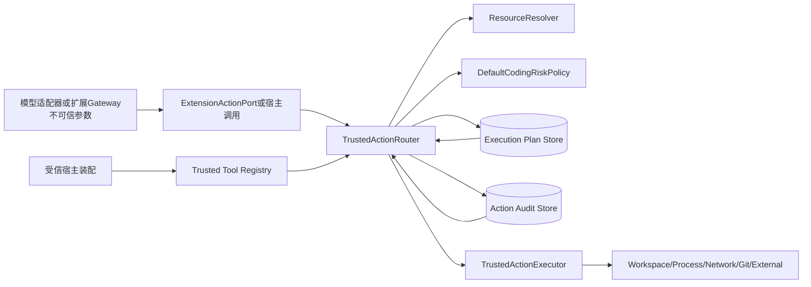

**图示说明：** 调用参数不可信，Binding、Resolver、Policy、Context和Executor由宿主持有。Router先将
参数解释为规范资源，再冻结两个持久Store中的事实；Executor只有在Route已`ready`、Execution Plan仍
匹配、Workspace未漂移且批准有效时才被调用。效果本体和真实对账属于Executor或下游Action Plane。

**源码映射：** 主链位于[`TrustedActionRouter`](../../src/harnessix/trusted_actions/router.py)；Binding和
Route合同位于[`contracts.py`](../../src/harnessix/trusted_actions/contracts.py)；决策位于
[`policy.py`](../../src/harnessix/trusted_actions/policy.py)；持久化位于
[`store.py`](../../src/harnessix/trusted_actions/store.py)。

### 5.1 受信输入

- `TrustedActionDefinition`及其Binding、Resolver、Executor、Pydantic模型/显式Decoder；
- `ActionPlanningContext`中的Workspace Root、Sandbox、Capabilities、环境、Secret绑定和External Roots；
- `workspace_root(workspace_id)`定位器；
- `DefaultCodingRiskPolicy`实现；
- 两个SQLite文件、宿主进程和启动恢复时序；
- Executor对“结果确定/不确定”的分类以及Reconcile真实性。

### 5.2 不可信输入

- `CodingActionInvocation.arguments`和幂等键；
- MCP Server的Schema、目录、描述、Annotation和结果；
- Skill正文、资源内容和Hook输出；
- 用户Workspace文件、符号链接、Git配置和远端状态；
- Executor返回的对象，直到严格合同重开和外部身份核对完成；
- 数据库中的持久JSON，直到Schema、自摘要、索引和Hash链核对完成。

### 5.3 禁止边界

1. 调用方不得直接选择Executor、Policy、Effect、Risk、Sandbox或Secret；
2. 扩展不得持有Router Registry、Session Store、Secret Provider、Workspace对象或通用进程句柄；
3. Hook的`allow`不得覆盖目标Action的宿主Policy；
4. 外部写失败后不得按普通异常自动重放；
5. Action Audit不得保存输出正文或Secret值；
6. 摘要不得被描述成签名或恶意本地主体隔离；
7. `ExtensionActionPort`不得被当作不可信同进程代码的强安全沙箱。

## 6. 包结构与源码阅读顺序

| 顺序 | 文件 | 关键符号 | 阅读目的 |
|---:|---|---|---|
| 1 | [`contracts.py`](../../src/harnessix/trusted_actions/contracts.py) | `TrustedToolBinding`、`CodingActionInvocation` | 先区分宿主Binding与调用方Invocation |
| 2 | 同上 | `CanonicalActionResource`、`ActionRoutePlan` | 理解资源摘要和Route跨字段一致性 |
| 3 | 同上 | `ActionExecutionOutcome`、`ActionAuditEvent`、`ActionRouteSnapshot` | 理解结果、状态和Hash链 |
| 4 | [`policy.py`](../../src/harnessix/trusted_actions/policy.py) | `DefaultCodingRiskPolicy.evaluate` | 推演deny/approval/allow矩阵 |
| 5 | [`router.py`](../../src/harnessix/trusted_actions/router.py) | `ActionPlanningContext`、`ResolvedAction`、`TrustedActionDefinition` | 理解宿主注册面 |
| 6 | 同上 | `TrustedActionRouter.register/plan/decide` | 理解Schema、资源、Plan和批准 |
| 7 | 同上 | `execute/reconcile/recover_interrupted` | 理解副作用、取消、UNKNOWN和恢复 |
| 8 | 同上 | `ExtensionActionPort`及私有Helper | 理解来源隔离及参数规范化限制 |
| 9 | [`store.py`](../../src/harnessix/trusted_actions/store.py) | `SQLiteActionAuditStore` | 理解事务、CAS投影和完整性验证 |
| 10 | [`mcp/actions.py`](../../src/harnessix/mcp/actions.py) | `build_mcp_action_definition`、`McpActionGateway` | 理解动态JSON Schema适配 |
| 11 | [`skills/actions.py`](../../src/harnessix/skills/actions.py) | `build_skill_action_definitions`、`SkillActionGateway` | 理解只读扩展和Canary边界 |
| 12 | [`hooks/runtime.py`](../../src/harnessix/hooks/runtime.py) | `HookRuntime._run` | 理解Hook如何消费来源受限Port |
| 13 | [`delivery/git_push.py`](../../src/harnessix/delivery/git_push.py) | `ApprovedGitPushPolicy`、`GitPushRoutedExecutor` | 理解外部非幂等写如何桥接旧Action Plane |
| 14 | [`test_router.py`](../../tests/trusted_actions/test_router.py) | 核心正常、攻击、崩溃测试 | 对照当前保证和未覆盖边界 |

`__init__.py`导出主要合同、Router、Policy和Store，但不导出`build_trusted_tool_binding`、
`canonical_action_resource`、`TrustedActionExecutor`等构造Helper/Protocol。当前公开面因此以包导出和各
适配模块的具体导入共同决定，尚未形成独立稳定SDK承诺。

## 7. 与通用Action Plane及Execution模块的关系

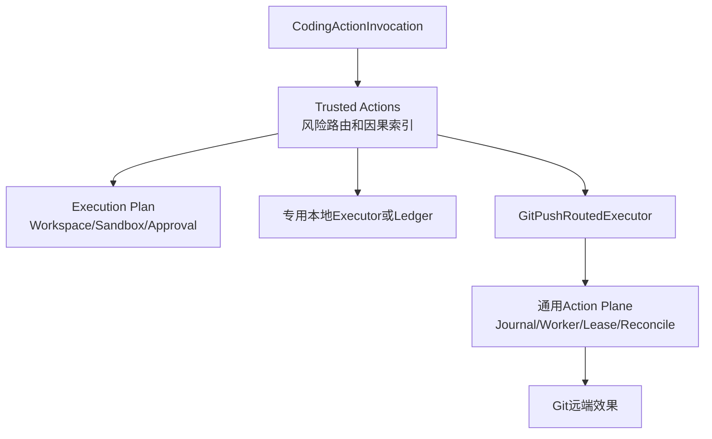

三者职责不能合并理解：

| 层 | 拥有事实 | 不拥有事实 |
|---|---|---|
| Trusted Actions | Tool Binding、规范资源、Route状态、跨组件审计摘要 | 通用Worker Lease、外部效果详细Receipt |
| Execution | Workspace/环境/Secret/Sandbox/能力/Policy Fingerprint和Approval | Tool Registry、Route状态、效果结果 |
| 通用Action Plane | Action Request、Journal状态、Lease、Outcome、Receipt和Reconcile | MCP/Skill/Hook注册和Execution Plan |

Git Push证明了组合方式：Route先进入`running`，Routed Executor再用确定`external_action_id`提交通用
Action。`ApprovedGitPushPolicy`反向读取Route、Execution Plan和Approval，只有所有事实精确匹配且
Route仍为`running`时才允许外部Action执行。该桥接防止直接调用旧`ActionService`绕过Route。

## 8. 组件架构

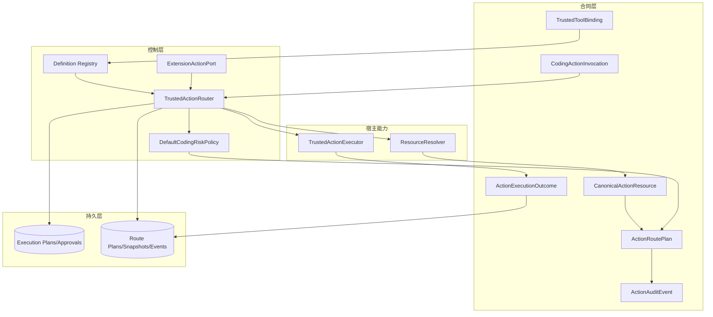

**组件职责：**

- 合同层以Pydantic strict/frozen模型拒绝额外字段、隐式类型转换、NaN和可变对象替换；
- Registry仅驻留内存，键为`(source, source_id, tool)`；
- Router编排所有状态变化，但不执行实际资源效果；
- Policy只读取宿主Binding、规范资源、Sandbox和Secret绑定；
- 两个Store分别保存执行授权和Route审计，当前没有共享数据库事务；
- Resolver将业务参数映射为资源；Executor执行或对账；二者均为受信宿主代码；
- Extension Port只缩小可访问来源，不建立OS进程隔离。

## 9. 版本化合同总览

| 合同 | `spec_version` | 生产用途 | JSON Schema |
|---|---|---|---|
| `CanonicalActionResource` | `harnessix.action-resource/v1` | 资源类型/访问和摘要 | [`action-resource-v1`](../../spec/action-resource-v1.schema.json) |
| `TrustedToolBinding` | `harnessix.trusted-tool-binding/v1` | 宿主可信Tool绑定 | [`trusted-tool-binding-v1`](../../spec/trusted-tool-binding-v1.schema.json) |
| `CodingActionInvocation` | `harnessix.coding-action-invocation/v1` | 调用意图 | [`coding-action-invocation-v1`](../../spec/coding-action-invocation-v1.schema.json) |
| `ActionRoutePlan` | `harnessix.action-route-plan/v1` | 完整Route计划 | [`action-route-plan-v1`](../../spec/action-route-plan-v1.schema.json) |
| `ActionExecutionOutcome` | `harnessix.action-execution-outcome/v1` | 执行/对账结果 | [`action-execution-outcome-v1`](../../spec/action-execution-outcome-v1.schema.json) |
| `ActionAuditEvent` | `harnessix.action-audit-event/v1` | 状态迁移Hash链 | [`action-audit-event-v1`](../../spec/action-audit-event-v1.schema.json) |
| `ActionRouteSnapshot` | `harnessix.action-route-snapshot/v1` | 当前投影 | [`action-route-snapshot-v1`](../../spec/action-route-snapshot-v1.schema.json) |

所有模型继承`ExecutionContract`，即`extra="forbid"`、`frozen=True`、`strict=True`和
`allow_inf_nan=False`。Store和Router关键入口通过JSON序列化再解析，避免调用方用Pydantic
`model_construct`跳过验证后直接进入持久边界。

## 10. Trusted Tool Binding设计

`TrustedToolBinding`是风险路由的根信任对象。

| 字段 | 类型/限制 | 来源 | 语义 | 持久化/敏感性 |
|---|---|---|---|---|
| `source` | `builtin/mcp/skill/hook/custom` | 宿主 | Tool来源类型 | Route/Execution；公开元数据 |
| `source_id` | 1～256字符、非空白 | 宿主 | 来源实例，如MCP Server或Skill Catalog | Route；可能暴露部署拓扑 |
| `tool` | 稳定名称正则、最长256 | 宿主 | 模型与Registry使用的名称 | Route |
| `tool_version` | 1～128字符、非空白 | 宿主 | 逻辑兼容版本 | Route |
| `tool_fingerprint` | 64位Revision | 宿主快照 | 实际Tool/目录/实现指纹 | Route |
| `input_schema_sha256` | 64位Revision | Schema | 输入合同摘要 | Route |
| `effect_class` | `EffectClass` | 宿主 | 只读、幂等写、非幂等写或破坏性 | Route/Execution |
| `risk_level` | `RiskLevel` | 宿主 | 低、中、高、关键风险 | Route/Execution |
| `recovery_mode` | 三值枚举 | 宿主 | 失败后如何确认效果 | Route |
| `executor_id` | 稳定标识正则 | 宿主 | 审计使用的执行器身份 | Route/Event |
| `binding_digest` | 64位Revision | 全字段派生 | 防止任一Binding字段静默替换 | Route；非签名 |

跨字段不变量：

1. 只读Tool只能使用`recovery_mode="none"`；
2. 所有写Tool必须声明`durable_ledger`或`external_reconcile`；
3. `external_reconcile`不能用于只读；
4. `binding_digest`必须等于排除自身后的规范JSON摘要；
5. 注册时Schema实际摘要必须等于`input_schema_sha256`。

`build_trusted_tool_binding`先用`model_construct`放置占位摘要，再计算规范摘要，最后通过正式模型构造
执行完整校验。它是模块内部常用构造器，但当前未从包根导出。

## 11. Invocation与参数边界

`CodingActionInvocation`只包含：

- `invocation_id`：UUID，同时成为`ExecutionPlan.plan_id`；
- `source/source_id/tool/tool_version/tool_fingerprint`：必须匹配已注册Binding；
- `arguments`：JSON对象；
- `idempotency_key`：非幂等写和破坏性操作必填。

调用方无法通过额外字段提交`effect_class`或`risk_level`，strict/forbid合同会拒绝。Router在Schema解码
前递归检查参数Key；`api_key`、`authorization`、`password`、`secret`、`token`等精确名称及后缀，
包括camelCase和kebab-case规范化形式，会触发`raw_secret_rejected`。

当前限制必须明确：

1. 检查只基于Key名称，不识别敏感值、未知别名、编码值或嵌入字符串；
2. 通用Invocation没有独立字节、节点或递归深度上限；MCP适配器另有256 KiB/10,000节点/64层限制；
3. 参数会以规范JSON正文进入Execution Plan和Route Plan，不应包含Secret、超大内容或无需持久的用户数据；
4. Pydantic Tool使用`input_model`重开，显式Decoder Tool在规划和Reconcile使用Decoder；当前首次
   `execute`重开直接调用`input_model.model_validate_json`，不会再次调用自定义Decoder。对MCP而言，
   规划时已按捕获Schema验证并由Route Fingerprint保护，但执行时不重复JSON Schema/复杂度校验，这是
   需要在安全加固切片收敛的实现不一致。

## 12. Canonical Resource设计

### 12.1 类型与访问矩阵

| `kind` | 允许`access` | 示例语义 |
|---|---|---|
| `workspace` | `read/write/execute` | 文件、目录或工作区命令范围 |
| `process` | `execute` | 进程能力 |
| `network` | `connect` | 网络目的地或网络能力 |
| `secret` | `use` | Secret用途 |
| `git_ref` | `read/update` | 本地/远端Git引用 |
| `external` | `read/write` | MCP、Skill Catalog或SaaS对象 |

`canonical_action_resource`不会持久化`identifier`和`attributes`原文，而是分别计算SHA-256。随后
`_canonical_resources`通过JSON重开每个资源，按`kind/access/identifier_sha256/attributes_sha256`
排序并拒绝重复。`ActionRoutePlan.resources`最终限制最多512项。

### 12.2 Resource与Workspace Snapshot不是同一对象

`ResolvedAction`同时返回：

- `resources`：Policy和Route Audit使用的规范资源；
- `workspace_resources`：`capture_workspace_snapshot`读取的具体Workspace路径和访问模式。

只有前者不足以执行Workspace新鲜度检查，只有后者又不足以表达网络、Secret或外部资源。Resolver必须
同时维护两者的一致性；当前Router不自动证明某个Workspace资源摘要与某个
`WorkspaceResourceRequest`一一对应，该映射由受信Resolver负责。

### 12.3 资源摘要限制

- Hash隐藏常规审计中的原始路径/URL，但不是匿名化保证；低熵标识可被字典猜测；
- `canonical_digest`不是密钥Hash，不能证明资源由可信主体签发；
- `canonical_action_resource`只归一`ValidationError`，不可JSON序列化的identifier/attributes可能泄漏
  `TypeError`或`ValueError`给受信宿主；
- 资源数量超过512时最终Route模型拒绝，但当前规划路径未把该`ValidationError`统一为`KernelError`。

## 13. 默认风险Policy

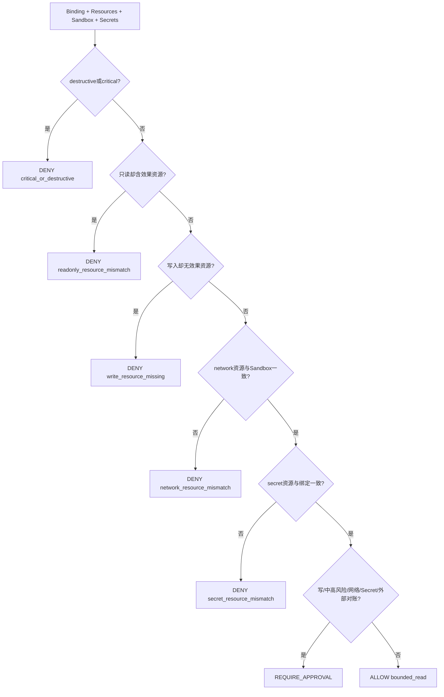

**图示说明：** Policy不读取调用方自报字段，也不读取Tool描述。先拒绝关键/破坏性和资源不一致，再对
所有写、medium/high、网络、Secret和外部Reconcile要求批准；仅低风险、无效果资源的只读Action自动
进入`ready`。

| 条件 | 决策 | `policy_id` | `reason_code` |
|---|---|---|---|
| destructive或critical | deny | `default.deny-critical` | `critical_or_destructive` |
| 只读但含process/network/secret或效果访问 | deny | `default.deny-effect-mismatch` | `readonly_resource_mismatch` |
| 写入但无效果资源 | deny | `default.deny-resource-missing` | `write_resource_missing` |
| network资源存在性与Sandbox网络模式不一致 | deny | `default.deny-network-mismatch` | `network_resource_mismatch` |
| secret资源存在性与Secret绑定不一致 | deny | `default.deny-secret-mismatch` | `secret_resource_mismatch` |
| 任一需批准条件 | require approval | `default.approve-canonical-effect` | `canonical_effect_requires_approval` |
| 其余有界只读 | allow | `default.allow-bounded-read` | `bounded_read` |

当前Policy只比较网络/Secret资源的**存在性**，不证明每个网络目标、Secret名称/Target与资源摘要一一
对应；Resolver和执行器仍是受信计算基。`DefaultCodingRiskPolicy`是具体类而非Protocol，Router构造注解
没有形成版本化可插拔Policy接口。

## 14. 注册与Registry生命周期

`TrustedActionDefinition`包含Binding、输入模型、Resolver、Executor，以及可选的显式JSON Schema和
Decoder。注册流程：

```text
register(definition):
    strict JSON round-trip binding
    require explicit schema and decoder appear together
    schema = Pydantic model schema or canonical explicit schema
    require digest(schema) equals binding.input_schema_sha256
    key = (source, source_id, tool)
    reject duplicate key
    copy trusted references into in-memory registry
```

Registry不持久化，不支持注销、替换、原子批量注册或热升级。进程重启后，宿主必须重新注册与持久Route
中**完全相同**的Definition Binding，才能执行或Reconcile旧Plan。`_matching_definition`比较整个
Binding；工具版本、Schema、风险、恢复或Executor身份任一变化都会触发
`trusted_tool_contract_changed`。

Registry保存Resolver和Executor对象引用，不复制其内部状态，也不验证其线程安全、确定性或代码摘要。
`tool_fingerprint/executor_id`的真实性由宿主装配保证。

## 15. 规划正常流程

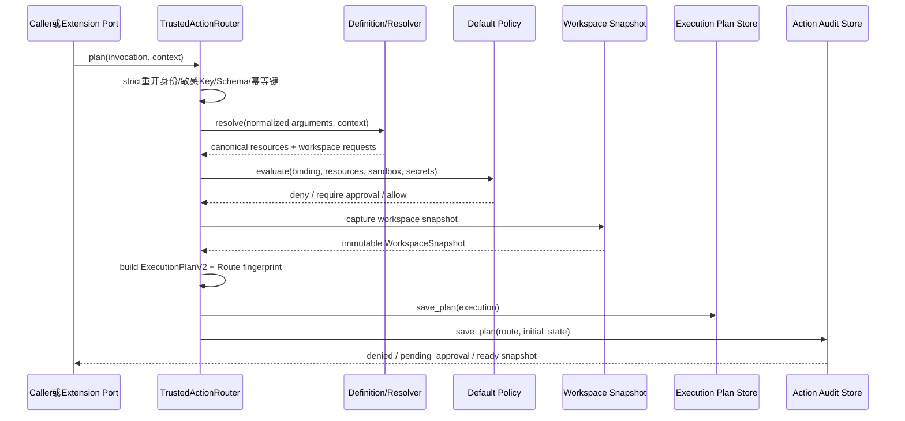

### 15.1 逐步语义

1. Invocation经JSON round-trip执行strict合同校验；
2. Registry按三元组精确查找Definition，并比较版本和Tool Fingerprint；
3. 参数Key执行疑似明文凭据扫描；
4. Pydantic或显式Decoder解析参数，再`model_dump(mode="json")`形成持久规范参数；
5. 非幂等写/破坏性Action必须携带幂等键；
6. Resolver产生资源和Workspace Request，资源重开、排序、去重；
7. Policy冻结决策；
8. Workspace Snapshot记录具体资源当前Revision；
9. `ExecutionIntent`使用宿主Binding中的Effect/Risk，不使用调用方输入；
10. `build_execution_plan_v2`只保存环境值摘要和Secret名称/版本/Target；
11. `external_reconcile`生成`UUIDv5(namespace, invocation_id:binding_digest)`；
12. Route Fingerprint绑定Invocation、Binding、资源、Execution和External ID；
13. 先保存Execution Plan，再保存Route和首个Audit Event；
14. Policy决定初态：deny→`denied`、require approval→`pending_approval`、allow→`ready`。

### 15.2 幂等与跨库窗口

两个Store不共享事务。Execution Plan先成功、Route保存失败会留下不可达Execution Plan；相同
Invocation和完全相同内容重跑可继续创建Route，内容变化则由Plan Store拒绝。该顺序避免出现“Route
可执行但Execution Plan不存在”，但不消除孤儿记录，也没有自动清理或跨库一致性扫描。

## 16. Approval流程

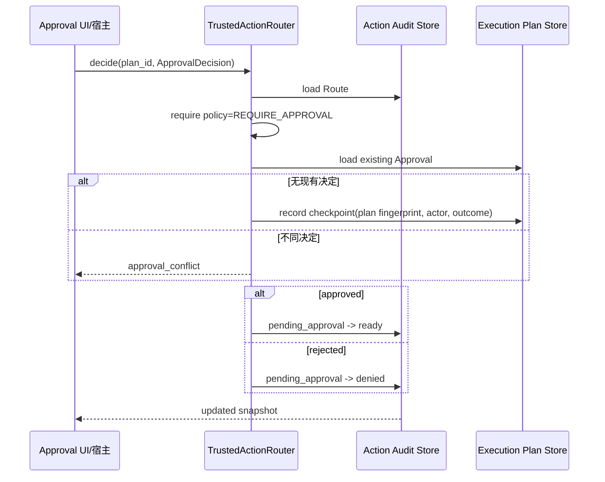

Approval记录先写Execution Plan Store，再写Route Audit。若两次写之间崩溃，会形成“批准已保存、Route仍
pending”的可恢复窗口；用完全相同决定重试时，现有Checkpoint相等并继续迁移Route。不同决定失败关闭。
批准Actor原文存在Execution Plan Store的Approval记录中；Action Audit Event只保存Actor摘要。

自动允许和Policy拒绝的Plan不接受`decide`。Approval不支持撤销、过期、双人复核、角色校验或在线授权
服务；其信任边界是本地受信调用者。

## 17. 执行正常流程

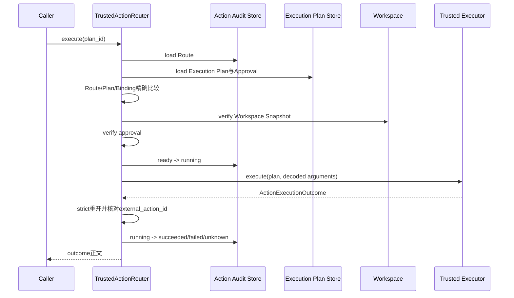

`running`在调用Executor前持久化，因此宿主在效果前后任一未知点退出，都不会把Route留在`ready`并被
自然重放。成功Event只持久化`canonical_digest(outcome.output)`和可选Artifact摘要，正文只返回当前
调用者。执行前检查包括：

- Route内Execution Plan等于独立Plan Store内容；
- 当前Definition Binding等于Plan Binding；
- `workspace_root(workspace_id)`下Snapshot仍新鲜；
- Approval与当前Execution Plan Fingerprint精确匹配；
- 持久参数可再次构造成输入模型。

首次执行返回`manual_intervention`被视为非法结果并在Router异常分类中降级；人工处置只应来自
`unknown`后的Reconcile或无恢复能力分支。

## 18. 取消、异常与效果不确定性

### 18.1 首次执行分类

| 场景 | 只读Tool | 写Tool | 调用者观察 |
|---|---|---|---|
| Executor返回`succeeded` | `succeeded` | `succeeded` | 返回Outcome |
| Executor返回`failed` | `failed` | `failed`，信任Executor确认无不确定效果 | 返回Outcome |
| Executor返回`unknown` | `unknown` | `unknown` | 返回Outcome，需Reconcile |
| `asyncio.CancelledError` | `failed/executor_cancelled` | `unknown/cancelled_write_effect_unknown` | Event落盘后重新抛取消 |
| `UncertainEffectError` | `unknown/uncertain_external_effect` | 同左 | 返回unknown，不重抛 |
| 其他`Exception` | `failed/executor_error` | `unknown/unexpected_write_error` | 固定错误码，不持久第三方正文 |
| Outcome外部ID不匹配 | 被内部异常分类捕获 | 被内部异常分类捕获 | 只读failed、写unknown |

`CancelledError`被单独保存后重新抛出，保持上游取消语义。Router自身没有Deadline或Cancel Token，无法
要求Executor协作清理；上游Timeout通常表现为Task取消。写Executor只有在能确定效果未发生时才应返回
`failed`；否则必须抛`UncertainEffectError`或返回`unknown`。

### 18.2 最终Audit写失败

Executor效果成功后，`running → terminal/unknown`的Audit事务仍可能失败。此时调用者收到Store异常，
Route保持`running`。冷启动`recover_interrupted`会将其转为`unknown`，随后只能对账；不能根据Executor
已经返回过成功就直接补写`succeeded`。当前没有Outbox把外部效果与Action Audit原子提交。

## 19. 状态机

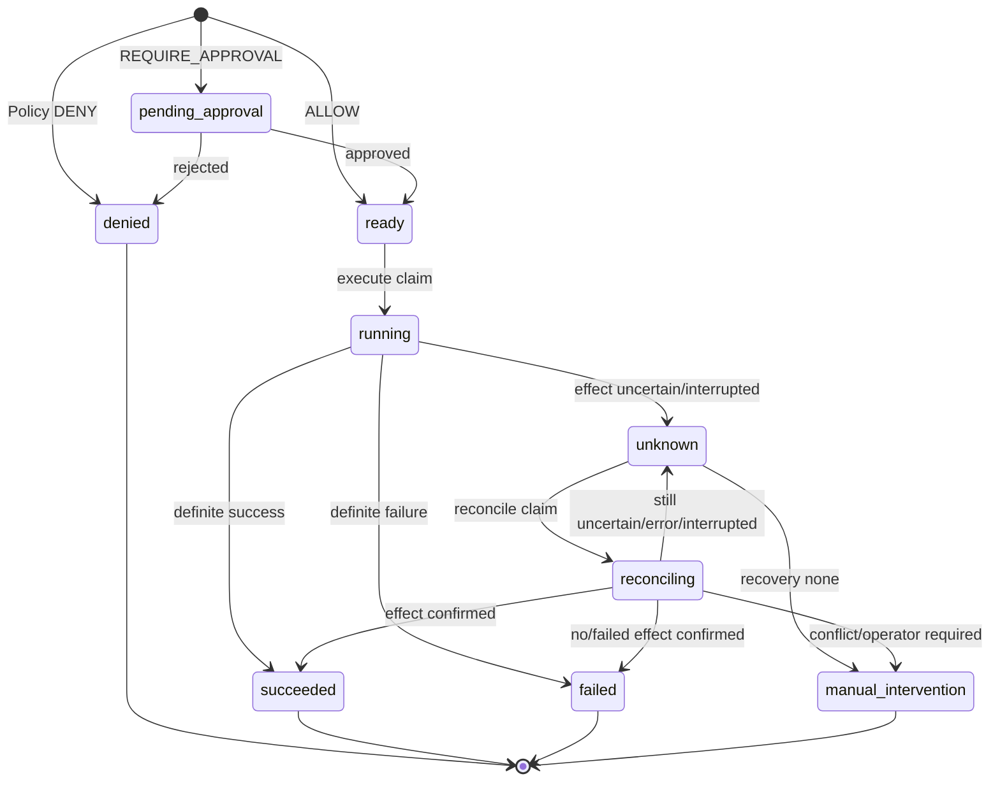

### 19.1 状态语义

| 状态 | 进入者 | 是否活动 | 允许后继 | 生产含义 |
|---|---|---:|---|---|
| `denied` | Policy或审批拒绝 | 否 | 无 | 不得执行 |
| `pending_approval` | Planner | 是 | ready/denied | 等待唯一Plan决定 |
| `ready` | Planner或批准 | 是 | running | 可由一个执行调用Claim |
| `running` | Router.execute | 是 | succeeded/failed/unknown | Executor可能正在或已经产生效果 |
| `succeeded` | Execute/Reconcile | 否 | 无 | 确认成功 |
| `failed` | Execute/Reconcile | 否 | 无 | 确认失败 |
| `unknown` | Execute/恢复/Reconcile | 是 | reconciling/manual | 禁止重放，只可查证 |
| `reconciling` | Router.reconcile | 是 | 四类结论 | 正在查询持久账本或外部事实 |
| `manual_intervention` | 无恢复能力或Reconcile | 否 | 无 | 自动化不能安全判定 |

`ActionAuditEvent.sequence`最大256。每次迁移递增1，首事件为1；反复`unknown ↔ reconciling`最终会达到
合同上限。当前没有压缩、归档或达到上限前的显式运维策略。

## 20. 崩溃恢复与Reconcile

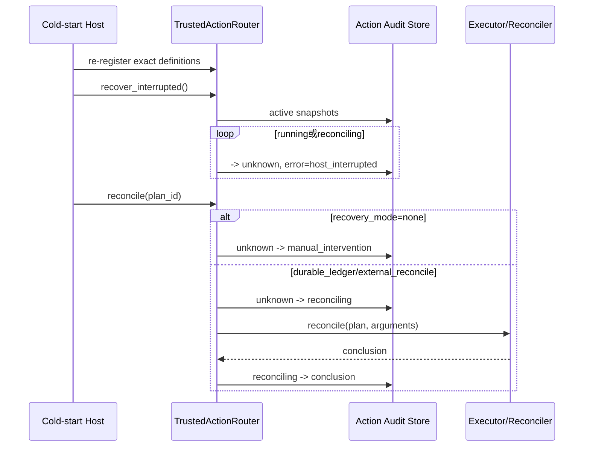

`recover_interrupted`只迁移`running/reconciling`，不触碰`pending_approval`、`ready`或已处于`unknown`的
Plan。它没有Owner ID、进程租约或“仅冷启动”锁；若在仍有活跃Router执行时调用，会把有效执行标记为
`unknown`。因此当前调用约束是：确保同一Audit Store没有活跃执行者后再恢复。

Reconcile规则：

1. `recovery_mode="none"`直接进入`manual_intervention/reconciliation_not_supported`；
2. 其他模式先重开参数，再把`unknown`迁移为`reconciling`；
3. Executor返回值经strict合同与External ID核对；
4. 任意普通`Exception`转回`unknown/reconciliation_error`；
5. Reconcile可在结果仍`unknown`后再次调用，不会重放首次`execute`；
6. `asyncio.CancelledError`继承`BaseException`，当前Reconcile未显式捕获，会让Route停在`reconciling`；
   之后必须由安全冷启动恢复为`unknown`。

`durable_ledger`和`external_reconcile`共享同一Executor Protocol；区别由具体Executor实现。Router不会自行
读取Ledger或外部系统。

## 21. SQLite持久化模型

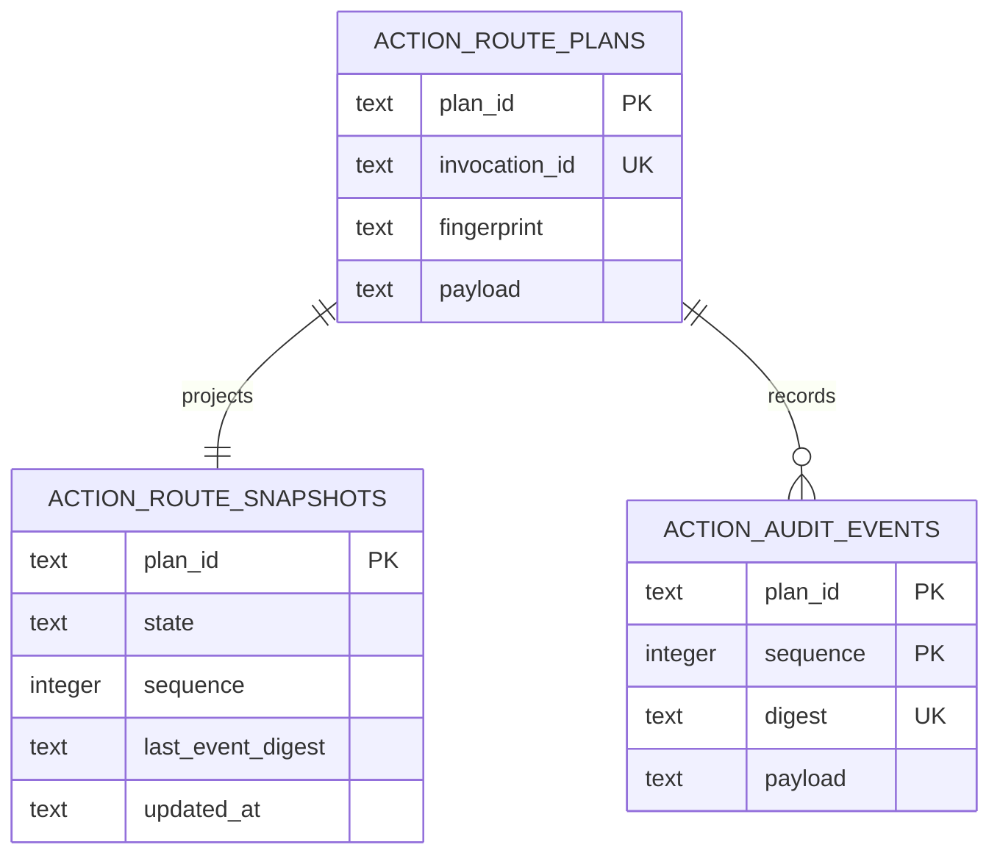

另有`action_audit_metadata(key,value)`保存`schema_version="1"`。初始化使用SQLite `STRICT`表、
`foreign_keys=ON`、WAL、`synchronous=FULL`和5秒busy timeout；POSIX父目录设为`0700`、数据库文件
设为`0600`。Windows依赖ACL/安装目录权限，没有在该Store内设置等价DACL。

### 21.1 `save_plan`事务

- 使用`BEGIN IMMEDIATE`；
- 验证完整Route Plan；
- 构造sequence=1的初始Event；
- 新计划在一个事务中插入Plan、Snapshot、Event；
- 同一plan_id和invocation_id、fingerprint、payload完全相同则幂等返回当前Snapshot；
- invocation ID碰撞或内容不同分别报`action_invocation_conflict`、`action_route_plan_conflict`；
- 任意`BaseException`回滚。

### 21.2 `transition`事务与CAS

`transition`在`BEGIN IMMEDIATE`中加载并验证当前Snapshot，检查调用方`expected`、全局状态转换表，构造
下一Hash链Event，然后用`plan_id/state/sequence/last_event_digest`四项条件更新Snapshot。`rowcount`
不是1即`action_route_conflict`。Event和Snapshot在同一数据库事务提交。

### 21.3 完整性读取

`load`重开Plan和末Event，并交叉核对冗余索引、Plan ID、Invocation ID、Fingerprint、状态、序号和摘要。
`events`加载全链，要求序号从1连续、每个`previous_digest`连接前一Event、`from_state`连接前一
`to_state`，且链尾与Snapshot一致。任一不一致统一为`action_audit_store_corrupt`。

Hash链能发现偶发损坏或未同步修改；有写权限的恶意主体可以重算所有摘要和索引，因此它不是防篡改签名
账本。Store没有备份、迁移、加密、归档、TTL、容量上限或多进程Lease。

## 22. Action Audit数据边界

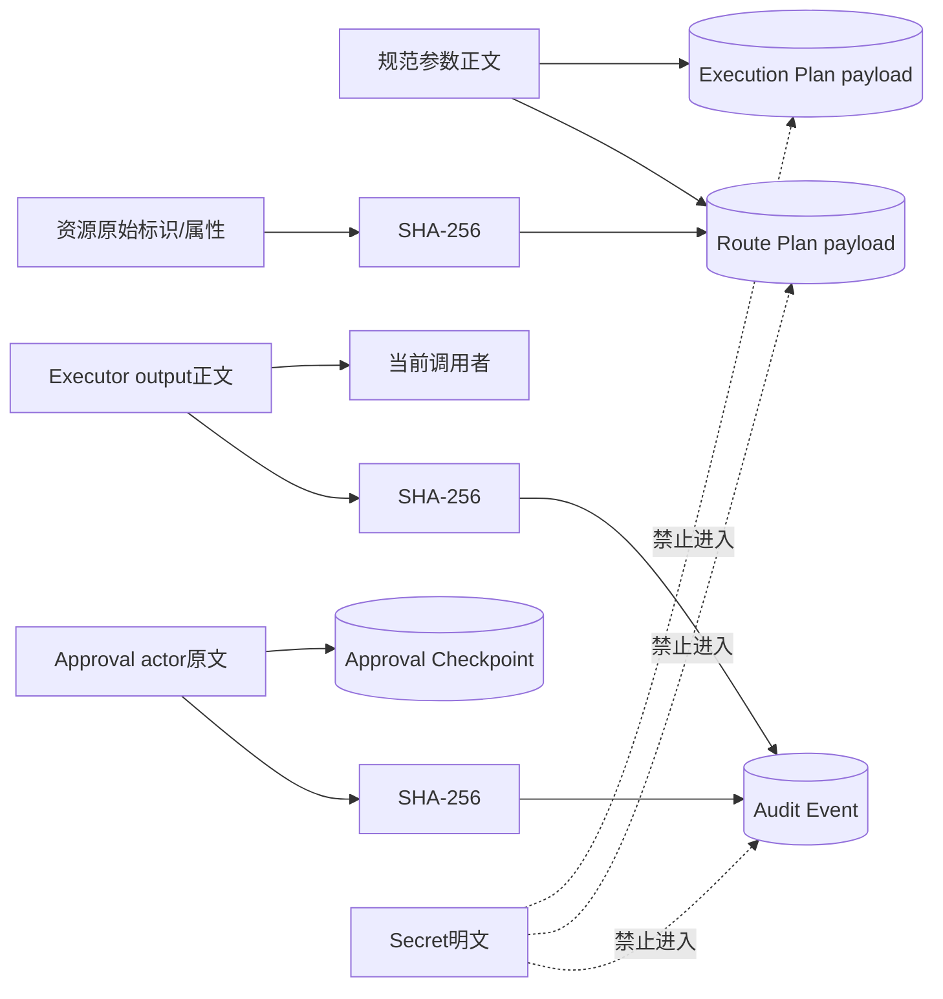

**持久事实：**

- Route Plan保存完整规范参数；参数可能含路径、查询文本或业务内容，不等于无敏感数据；
- 环境只保存名称与值Hash；Secret只保存名称、版本和Target；
- Canonical Resource只保存标识/属性Hash；
- Event保存Policy、状态、Executor ID、错误码、External ID、Output/Artifact摘要；
- Approval Store保存Actor和Reason原文，Action Event保存Actor摘要；
- Outcome正文不进入Action Audit，但下游Executor、调用者或其他Store可能另行保存。

当前Router不统一调用`SecretLeakGuard`、输出大小限制或Artifact Store。MCP、Skill和Hook适配各自执行额外
边界；新Executor若直接返回大对象或Secret，Router会把正文返回调用者，并只在Event中留摘要。

## 23. ExtensionActionPort能力边界

`ExtensionActionPort`通过私有槽保存Router、固定`source/source_id`和Context Factory，仅暴露：

| 方法 | 能力 | 来源约束 |
|---|---|---|
| `bindings()` | 获取本来源Binding深拷贝 | Router按source/source_id过滤 |
| `plan(...)` | 构造固定来源Invocation并规划 | 调用者不能替换source/source_id |
| `execute(plan_id)` | 执行Plan | 先读取Route并核对Binding来源 |
| `reconcile(plan_id)` | 对账Plan | 同上 |
| `status(plan_id)` | 读取Snapshot | 同上 |

`extension_port`只允许`mcp/skill/hook/custom`，内置Tool由宿主直接调用Router。Port不提供`decide`或
`events`，扩展不能自行批准，也不能读取完整事件链。

这是**能力收窄接口**，不是敌对Python代码的安全隔离。Python名称改写字段可被反射访问，同进程代码也
可导入文件系统和网络库。第三方不可信扩展必须运行在独立进程/Sandbox中，只通过受控协议获得Port等价
能力；不能因使用双下划线字段就宣称进程内安全。

## 24. MCP接入

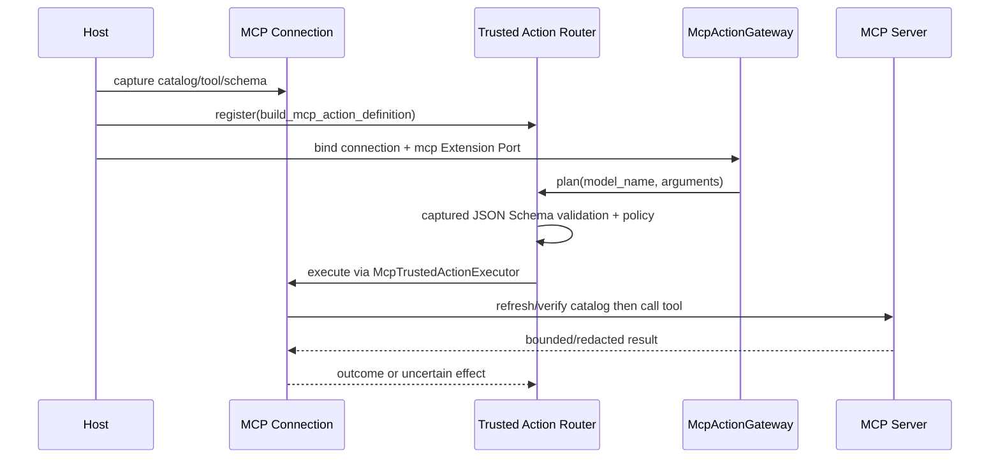

MCP适配的重要约束：

1. `McpTrustedToolPolicy`完全由宿主持有，不从远端Annotation/描述推导；
2. 只读Tool必须`recovery=none`且无Reconciler；写Tool必须`external_reconcile`并提供Reconciler；
3. Binding绑定Server ID、协议/版本、Catalog摘要、Tool摘要和捕获输入Schema；
4. 显式Decoder使用JSON Schema 2020-12验证参数并限制大小/深度/节点；
5. Executor调用前核对Sandbox和当前Catalog/Tool摘要；目录漂移失败关闭；
6. 只读发送后失败可确定为failed；写入发送后失败抛`UncertainEffectError`并进入unknown；
7. MCP结果在Connection层做边界、Schema和可选Secret替换，再作为Outcome返回；
8. 可选Harnessix MCP Server反向导出时只允许白名单低风险只读Action，审批态不会由远端自行批准。

Target、目录、协议、SQLite、输出、取消和生产差距的现行事实见[MCP模块设计](mcp.md)。

## 25. Skill与Hook接入

### 25.1 Skill

`build_skill_action_definitions`只创建`skill.load`和`skill.read_resource`两个低风险只读Definition。Binding
绑定Catalog ID、generation和Catalog摘要；Resolver只产生`external/read`资源。Executor通过
`SkillRegistry`读取冻结Manifest/资源，并用`SecretLeakGuard`在输出跨Action边界前阻断已知Canary。
`SkillActionGateway`再次核对Catalog和Binding Fingerprint，只经Skill Port规划和执行。

Skill当前实现的完整来源、Frontmatter、Catalog/Manifest摘要、资源Reader、SQLite访问事件和生产差距见
[Skill模块设计](skills.md)。需特别区分Registry“文件读取成功”和Action“内容发布成功”：Registry当前在
Secret Guard前写入成功访问事件，Guard拒绝时Action失败；两套账本无统一关联或事务。目录变化还不能在同一
Router中原子替换Definition，默认产品也尚未装配Skill。

### 25.2 Hook

`HookRuntime`不创建任意脚本Executor，只消费宿主已注册的`source="hook"` Port。构造时要求Binding为
低风险只读、`recovery=none`且Schema等于`HookActionInput`；非Bundled Hook还必须具有精确、未过期的
Definition Grant。Hook收到的是目标Action来源、Tool、Plan ID及参数/结果摘要，不接收目标参数正文或
Secret。每次运行先持久Hook Run，再创建同UUID的Trusted Action Plan并执行。

Hook有独立Timeout和取消状态。Timeout取消底层Router执行；Router先持久只读Action为failed并重新抛
取消，Hook Store再记录`hook_timeout`。Hook输出还会经过Canary和`HookActionOutput`验证。Advisory Hook
的deny无效；Blocking Hook可阻止后续流程，但其allow不能改变目标Action自身Policy。

Hook完整现行事实见[Hook模块设计](hooks.md)。当前需特别注意四个集成缺口：Grant只在Registry捕获时按调用方
`captured_at`检查；Runtime未核对Definition来源与Port实际来源相同；Router先结算Action成功，后置Guard或
Schema拒绝会使Action为`succeeded`而Hook为`failed`；启动恢复没有Owner Lease，也不查询底层Action状态。
因此Port来源隔离、Hook授权和双账本恢复不能仅凭单个组件测试推断为默认产品安全闭环。

## 26. Git Push外部非幂等写

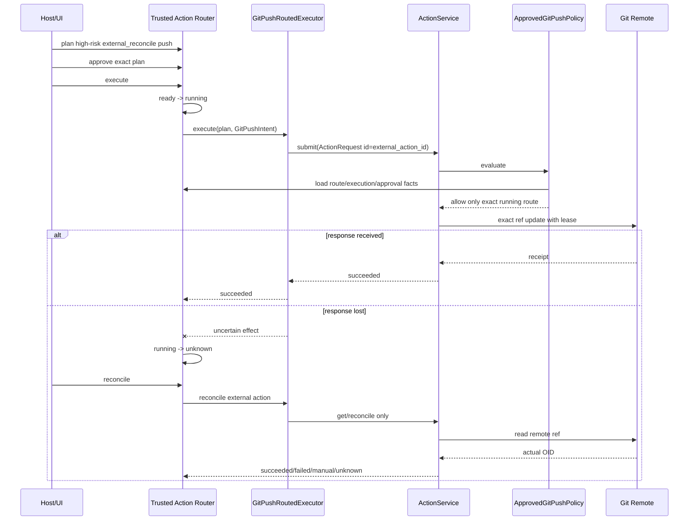

`external_action_id`由Route确定生成，并同时成为旧Action Plane的`ActionRequest.action_id`。Policy核对
Route为`running`、Execution Plan和Approval完全一致、Route Fingerprint、External ID、Invocation
参数、幂等键及Tool能力。直接调用Action Service缺少这些事实时被拒绝。

此切片证明“发送后丢响应只对账、不二次Push”，但当前真实测试使用本地bare remote，不等于HTTPS/SSH
凭据、网络代理或公网托管Git已完成产品验收。

## 27. 并发、幂等与顺序

| 关注点 | 当前保证 | 边界/限制 |
|---|---|---|
| Definition注册 | 单进程字典拒绝重复键 | 无锁、无热替换、非跨进程Registry |
| Plan去重 | plan_id/invocation_id唯一，完全相同Plan幂等 | 两个Store跨库非原子 |
| Approval | 单Plan只接受完全相同Checkpoint | 无撤销、过期、角色/双人规则 |
| Route Claim | Snapshot CAS + `BEGIN IMMEDIATE` | 同一SQLite连接不是通用跨线程API；无Owner Lease |
| 写幂等键 | 非幂等/破坏性Invocation必填 | Router不解释键作用域，具体Executor负责执行级幂等 |
| 外部身份 | `external_reconcile`确定UUIDv5 | durable ledger没有External ID |
| 执行顺序 | ready先持久running，再调用Executor | 最终Audit与外部效果不原子 |
| 恢复顺序 | running/reconciling统一转unknown | 调用方必须保证无活跃执行者 |
| Reconcile | 只允许unknown进入，同次CAS阻止重复Claim | 无租约；多Router共享连接/文件不是完整分布式模型 |

`SQLiteActionAuditStore`建立的连接默认受Python SQLite线程约束；类本身没有Lock，也未声明线程安全。
产品装配应让一个Runtime Owner串行拥有连接，或在未来引入独立连接/事务边界和Lease，不能把当前CAS
直接外推为高并发多Worker支持。

## 28. Timeout、取消与重试合同

| 阶段 | Timeout | 取消 | 自动重试 |
|---|---|---|---|
| register/plan/decide/store | 无统一Deadline | 同步调用不可协作取消 | 无 |
| execute前复核 | 无统一Deadline | Task取消可能在任意await前后到达；同步Store段不可中断 | 无 |
| Executor.execute | Protocol无Deadline参数 | 捕获`CancelledError`并按Effect分类，落盘后重抛 | 禁止Router自动重试 |
| reconcile | Protocol无Deadline参数 | 未捕获取消，停留reconciling待冷启动恢复 | 无；业务方可在unknown后再次对账 |
| SQLite busy | 5秒busy timeout | 无取消接口 | SQLite内部等待，不做业务重试 |

上游若用`asyncio.timeout`取消写Executor，Route会进入unknown，而不是把Timeout解释成确定失败。任何未来
Retry策略必须区分“进入Executor前”“只读”“有可证明幂等Ledger”“外部效果未知”，不能在Router外层
盲重试`execute(plan_id)`。

## 29. 错误分类

### 29.1 稳定KernelError

| 阶段 | 代表错误码 | 含义/调用建议 |
|---|---|---|
| 注册 | `trusted_tool_decoder_invalid`、`trusted_tool_schema_invalid`、`trusted_tool_schema_mismatch`、`trusted_tool_duplicate` | 修正宿主Definition，不重试同输入 |
| 查找/身份 | `trusted_tool_not_registered`、`trusted_tool_contract_changed` | 重新装配或重新规划，不执行旧Plan |
| 参数 | `raw_secret_rejected`、`tool_invalid_arguments`、`idempotency_key_required` | 修正调用，不记录Secret值 |
| 资源 | `action_resource_invalid`、`action_resource_duplicate` | 修正Resolver/输入 |
| Approval | `action_approval_not_required`、`approval_conflict`、`action_not_approved` | 按当前Plan重新决策，不覆盖冲突 |
| Route | `action_route_not_found`、`action_route_conflict`、`action_route_transition` | 读取最新状态；不要盲重放 |
| 一致性 | `action_plan_mismatch`、`execution_plan_stale` | 旧Plan失效，重新规划 |
| Store | `action_audit_store_version`、`action_audit_store_corrupt`、`action_route_plan_conflict` | 停止执行并运维介入 |
| 扩展 | `extension_source_invalid`、`extension_plan_denied` | 来源越权或装配错误，失败关闭 |
| 外部身份 | `external_action_identity_mismatch` | 执行器合同错误；写操作进入unknown |

### 29.2 Outcome错误码

Outcome和Audit只接受`[a-z][a-z0-9_]{0,127}`错误码。Router自身使用
`executor_cancelled`、`cancelled_write_effect_unknown`、`uncertain_external_effect`、
`executor_error`、`unexpected_write_error`、`reconciliation_error`、`host_interrupted`和
`reconciliation_not_supported`。Executor可返回自己的稳定码。

当前错误归一并不覆盖所有受信构造阶段：Resolver/Policy/Workspace Root Provider抛出的异常、资源超过
512导致的最终ValidationError、不可JSON资源的原生异常可能直接传播。公开产品入口必须继续做固定错误
投影，后续安全加固应收敛这些边界。

## 30. 安全与隐私分析

### 30.1 已实现控制

- 风险、效果、恢复、Schema和Executor身份由宿主Binding冻结；
- Invocation禁止额外权限字段；
- 资源由受信Resolver生成并摘要化；
- 参数Key执行基础明文凭据拒绝；
- 环境值只持久Hash，Secret只持久引用元数据；
- Approval绑定Plan Fingerprint；
- Workspace、Sandbox Profile和Capability Evidence绑定Plan；
- 执行前重开Plan、Binding、Workspace和批准；
- 状态先于效果持久，写异常保守unknown；
- Audit不保存输出正文，错误不拼接第三方异常；
- Port按来源隔离且不暴露批准和事件链；
- MCP/Skill/Hook/Git适配增加各自的Schema、Canary和旁路控制。

### 30.2 当前威胁缺口

| 风险 | 当前影响 | 现有缓解 | 剩余工作 |
|---|---|---|---|
| 同UID或数据库写权限主体重算Hash链 | 可伪造本地Route历史 | 文件权限、交叉校验 | 签名/远端锚定或明确本地信任模型 |
| 不可信同进程扩展反射Port/导入系统库 | 可绕过能力收窄 | 0.8不承诺敌对进程内插件 | 扩展进程隔离与OS Sandbox |
| 参数Key启发式漏检Secret | 明文进入两个Plan Store | 显式Key拒绝、调用规范 | 统一Secret引用和发布门 |
| Outcome无通用大小/深度/Secret Guard | 大对象或敏感正文返回调用者 | 各Adapter局部限制 | Router统一Bounded Result/Artifact/Guard |
| Resource只比较网络/Secret存在性 | Resolver可映射错误对象 | Resolver受信 | 正式资源授权合同与逐项绑定 |
| Approval无主体认证/过期 | 本地任意受信调用者可批准 | Fingerprint和冲突检查 | 产品身份、TTL、角色和审计 |
| Registry无代码来源证明 | 相同Binding可挂接错误实现 | 宿主装配受信 | Executor实现摘要、签名供应链 |
| 恢复无Owner Lease | 活跃执行可被误标unknown | 冷启动调用约束 | Runtime Owner/Lease/启动互斥 |

## 31. 可观测性

本包的可观测事实主要是持久Audit，不是完整Telemetry：

| 信号 | 当前内容 | 缺失 |
|---|---|---|
| Route Snapshot | 状态、序号、更新时间、末Event摘要 | Owner、Deadline、尝试次数、进度 |
| Audit Event | Plan/资源/Policy/审批Actor摘要/Executor/输出摘要/错误/Reconcile | 原因正文、耗时、队列时间、租约 |
| Execution Plan | Tool、Workspace、环境Hash、Secret版本、Sandbox、能力和Policy | Secret值、环境值、动态执行事实 |
| Exception | 固定KernelError或Outcome错误码 | 统一公开投影尚依赖上游 |
| Trace/Metric/Log | 包内未直接接入OpenTelemetry | Route span、状态计数、Latency、UNKNOWN积压和Store故障指标 |

生产装配至少需要按低基数记录source、tool、effect、risk、policy decision、终态、错误码和reconcile结论；
不得把source_id、参数、资源原文、Actor、Secret、Workspace路径或输出正文作为Metric Label。Trace需要把
Plan ID作为关联字段而非未经授权的公开标识，并将Store失败与Executor失败区分。

## 32. 重点类与生命周期

| 符号 | 职责 | 生命周期/状态 | 直接依赖 | 禁止依赖/限制 |
|---|---|---|---|---|
| `TrustedActionRouter` | Registry、规划、审批、执行、恢复和查询编排 | 进程内长期对象，Definition内存态 | 两Store、Workspace定位、Policy | 不拥有Secret值、Session或通用Worker Lease |
| `SQLiteActionAuditStore` | Route Plan、Snapshot、Hash链 | 单连接，需显式`close` | SQLite/文件系统 | 不保存Executor/Secret；未声明线程安全 |
| `DefaultCodingRiskPolicy` | 默认风险决策 | 无状态 | Binding/资源/Sandbox/Secret元数据 | 不读取调用方描述或Executor内部 |
| `TrustedActionDefinition` | 绑定Schema、Resolver和Executor | Registry生命周期 | Pydantic模型和宿主对象 | 不持久化函数/对象 |
| `ActionPlanningContext` | 提供当前执行边界 | 单次Plan调用 | Workspace/Sandbox/Capabilities | 不应由不可信扩展构造 |
| `ResolvedAction` | 同时携带Policy资源与Workspace请求 | 单次Resolver结果 | 受信Resolver | Router不自动证明两组资源一一对应 |
| `ExtensionActionPort` | 按来源收窄Router能力 | 与Router同生命周期 | Context Factory | 不是进程隔离，不暴露decide/events |
| `TrustedActionExecutor` | 执行和对账协议 | 宿主定义 | Route Plan和已解码参数 | 必须正确报告效果不确定性 |

## 33. 公共方法合同

| 方法 | 前置条件 | 后置条件 | 幂等/顺序 | 取消/错误 | 权限 |
|---|---|---|---|---|---|
| `register` | Binding/Schema有效，Key未注册 | Definition进入内存Registry | 重复注册拒绝 | 同步，宿主错误 | 仅受信宿主 |
| `bindings` | 可选source过滤 | 返回深拷贝稳定排序 | 只读 | 无I/O | 宿主；Port进一步过滤 |
| `plan` | Definition存在，参数/资源/Context有效 | 两Store保存Plan，返回初态 | 相同完整Plan可收敛 | 同步，无Deadline | 宿主或Port |
| `decide` | Policy需审批，Checkpoint无冲突 | 保存决定并迁移Route | 相同决定重试收敛 | 同步 | 仅Router调用者，Port不暴露 |
| `execute` | Route ready、Plan/Workspace/Approval当前 | 恰调用Executor一次并记录结论 | 不是可重放API；状态CAS | 取消落盘后重抛 | 宿主或匹配Port |
| `reconcile` | Route unknown、Binding仍匹配 | 不执行原效果，只确认事实 | unknown后可再次对账 | 取消留reconciling | 宿主或匹配Port |
| `recover_interrupted` | 无其他活跃Owner | running/reconciling→unknown | 对已恢复状态再次调用无变化 | 同步 | 冷启动宿主 |
| `status/events` | Plan存在且Store完整 | 返回验证后的投影/全链 | 只读 | 损坏失败关闭 | Port只暴露同来源status |

## 34. 核心业务逻辑伪代码

### 34.1 规划

```text
plan(invocation, context):
    strict_reopen(invocation)
    definition = registry.exact_match(source, source_id, tool)
    require invocation version and fingerprint equal binding
    reject sensitive-looking argument keys
    arguments = trusted schema decode(invocation.arguments)
    normalize arguments to canonical JSON object
    require idempotency key for non-idempotent/destructive writes
    resolved = trusted resolver(arguments, context)
    resources = strict sort and deduplicate(resolved.resources)
    policy = host policy(binding, resources, sandbox, secret refs)
    workspace = capture snapshot(resolved.workspace_resources)
    execution = freeze intent + workspace + env hashes + secret refs
                + sandbox + policy + capabilities
    if recovery is external_reconcile:
        external_id = deterministic UUID(binding + invocation)
    route = fingerprint(invocation + binding + resources + execution + external_id)
    persist execution plan first
    transactionally persist route + initial event + current projection
    return current projection
```

### 34.2 执行

```text
execute(plan_id):
    route = load and validate audit projection
    require independent execution plan equals embedded execution plan
    require currently registered binding exactly equals frozen binding
    verify workspace snapshot against current workspace
    require current approval satisfies frozen policy/fingerprint
    reopen persisted arguments
    atomically transition ready -> running before side effect
    try:
        outcome = await trusted_executor.execute(route.plan, arguments)
        strict_reopen(outcome)
        require external identity matches
        reject direct manual-intervention result
    on cancellation:
        outcome = failed for read, unknown for write
        remember cancellation for rethrow
    on uncertain-effect signal:
        outcome = unknown
    on other exception:
        outcome = failed for read, unknown for write
    atomically append event and transition running -> outcome.kind
    if cancellation was received: rethrow it
    return outcome
```

### 34.3 对账与恢复

```text
recover_interrupted():
    require cold-start ownership outside this function
    for each active route:
        if state is running or reconciling:
            transition to unknown with host_interrupted

reconcile(plan_id):
    load route and exact current definition
    if recovery mode is none:
        transition unknown -> manual_intervention
        return unsupported outcome
    decode persisted arguments with registered decoder
    transition unknown -> reconciling
    try:
        outcome = await executor.reconcile(plan, arguments)
        strict_reopen and verify external identity
    on ordinary exception:
        outcome = unknown with reconciliation_error
    transition reconciling -> outcome.kind and append conclusion
    return outcome
```

### 34.4 Audit迁移

```text
transition(plan_id, expected, target, details):
    begin immediate SQLite transaction
    current = load and cross-check plan/snapshot/last-event
    require current.state in expected
    require target in global allowed transition table
    event = hash(previous digest + transition + safe details)
    compare-and-swap snapshot by state + sequence + last digest
    append event with next sequence
    commit
    return fully reloaded snapshot
```

## 35. 源码与测试映射

| 设计元素 | 源码 | 关键符号 | 测试 | 测试符号/证明 |
|---|---|---|---|---|
| strict合同与Binding摘要 | [`contracts.py`](../../src/harnessix/trusted_actions/contracts.py) | `TrustedToolBinding`、`trusted_tool_binding_digest` | [`test_schemas.py`](../../tests/trusted_actions/test_schemas.py) | `test_action_plane_public_schemas_match_generated_contracts` |
| Resource兼容与排序 | 同上、[`router.py`](../../src/harnessix/trusted_actions/router.py) | `CanonicalActionResource`、`_canonical_resources` | [`test_router.py`](../../tests/trusted_actions/test_router.py) | `test_readonly_non_workspace_resource_is_not_misclassified_as_write` |
| 有界只读主链 | [`router.py`](../../src/harnessix/trusted_actions/router.py) | `plan`、`execute` | 同上 | `test_bounded_read_is_planned_executed_and_audited` |
| Approval与Workspace复核 | 同上 | `decide`、`_prepare_execution` | 同上 | `test_write_requires_exact_approval_and_workspace_freshness` |
| UNKNOWN恢复/Reconcile | 同上 | `recover_interrupted`、`reconcile` | 同上 | `test_running_recovery_enters_unknown_then_reconciles_once` |
| 真实宿主硬退出 | 同上、[`store.py`](../../src/harnessix/trusted_actions/store.py) | running先持久、Hash链恢复 | 同上 | `test_real_host_exit_recovers_to_unknown_without_replaying_effect` |
| 五来源同Policy | [`policy.py`](../../src/harnessix/trusted_actions/policy.py) | `DefaultCodingRiskPolicy.evaluate` | 同上 | `test_every_source_uses_the_same_canonical_policy` |
| 未注册/伪造/Secret参数 | [`router.py`](../../src/harnessix/trusted_actions/router.py) | `_definition`、`_find_sensitive_path` | 同上 | `test_unregistered_forged_and_secret_bearing_calls_fail_closed` |
| Extension来源隔离 | 同上 | `ExtensionActionPort` | 同上 | `test_extension_port_has_no_privileged_objects_and_is_source_scoped` |
| Schema替换拒绝 | 同上 | `register` | 同上 | `test_registration_rejects_schema_substitution` |
| Store索引/链损坏 | [`store.py`](../../src/harnessix/trusted_actions/store.py) | `load`、`events` | 同上 | `test_audit_store_fails_closed_on_corrupt_index`、`test_audit_store_fails_closed_on_corrupt_event_chain` |
| Store版本拒绝 | 同上 | `_initialize` | 同上 | `test_audit_store_rejects_unknown_schema` |
| MCP目录/Schema绑定 | [`mcp/actions.py`](../../src/harnessix/mcp/actions.py) | `build_mcp_action_definition`、`McpTrustedActionExecutor` | [`test_runtime_actions.py`](../../tests/mcp/test_runtime_actions.py) | `test_schema_drift_is_persisted_and_rejected_before_call` |
| MCP写Timeout/对账 | 同上 | `execute`、`reconcile` | 同上 | `test_write_timeout_becomes_unknown_and_only_reconcile_continues` |
| MCP结果防泄漏 | [`mcp/runtime.py`](../../src/harnessix/mcp/runtime.py) | `_normalize_call_result` | 同上 | `test_tool_result_is_redacted_before_crossing_action_boundary` |
| MCP反向导出边界 | [`mcp/server.py`](../../src/harnessix/mcp/server.py) | `HarnessixMcpServer._validate_binding` | [`test_server.py`](../../tests/mcp/test_server.py) | `test_optional_server_rejects_write_action_export` |
| Skill只经Port加载 | [`skills/actions.py`](../../src/harnessix/skills/actions.py) | `SkillActionGateway` | [`test_runtime.py`](../../tests/skills/test_runtime.py) | `test_skill_body_and_resource_execute_only_through_action_port` |
| Skill Canary阻断 | 同上 | `_SkillExecutor.execute` | 同上 | `test_secret_canary_in_skill_output_is_blocked_by_action_boundary` |
| Hook安全Binding | [`hooks/runtime.py`](../../src/harnessix/hooks/runtime.py) | `_validate_binding` | [`test_runtime.py`](../../tests/hooks/test_runtime.py) | `test_hook_registry_rejects_non_readonly_or_wrong_schema_binding` |
| Hook Timeout/取消 | 同上 | `HookRuntime._run` | 同上 | `test_hook_timeout_cancels_and_persists_underlying_action`、`test_outer_cancellation_persists_hook_and_action_cancellation` |
| Hook不能提权 | 同上 | Dispatch与目标Policy分离 | 同上 | `test_allow_hook_cannot_override_target_action_policy` |
| Git Push统一Route | [`git_push.py`](../../src/harnessix/delivery/git_push.py) | `ApprovedGitPushPolicy`、`GitPushRoutedExecutor` | [`test_git_push.py`](../../tests/delivery/test_git_push.py) | `test_git_push_requires_route_approval_and_updates_one_remote_ref` |
| Git响应丢失零重放 | 同上 | `GitPushRoutedExecutor.reconcile` | 同上 | `test_push_response_loss_reconciles_without_second_push` |
| 旧Action旁路拒绝 | 同上 | `ApprovedGitPushPolicy._approved` | 同上 | `test_direct_action_service_push_bypass_is_denied` |

## 36. 测试设计与当前证据

### 36.1 确定性测试分层

1. **合同层**：七个Trusted Action v1模型与生成Schema逐字相等；
2. **路由单元**：只读、审批、Workspace漂移、来源等价、伪造、Secret Key和Schema替换；
3. **持久故障注入**：索引、Event摘要、Schema版本损坏失败关闭；
4. **进程故障注入**：子进程在写入外部Marker并`fsync`后`os._exit`，重开后只Reconcile；
5. **扩展集成**：MCP动态Schema、Skill目录、Hook授权/Timeout/取消；
6. **真实仓库效果**：本地Git仓库和bare remote验证Approval、CAS、旁路拒绝和响应丢失对账。

### 36.2 当前定向命令

```bash
uv run pytest \
  tests/trusted_actions \
  tests/mcp/test_runtime_actions.py \
  tests/mcp/test_server.py \
  tests/skills/test_runtime.py \
  tests/hooks/test_runtime.py \
  tests/delivery/test_git_push.py
```

本文代码版本的定向回归全部通过。全量门禁还必须执行`make check`，Linux、macOS和Windows CI矩阵分别
证明解释器、SQLite、Workspace、Process和Git平台边界。测试未覆盖的能力不能由通过数量推断为已完成。

### 36.3 当前测试缺口

- 显式Decoder在首次`execute`未再次调用的回归测试；
- Invocation通用字节/节点/深度上限和敏感值检测；
- Resource超过512、不可JSON标识及Resolver原生异常的固定错误投影；
- Outcome通用大小、深度、Artifact切换和Secret输出阻断；
- Reconcile取消后停留`reconciling`及再次冷启动恢复的专项测试；
- 最终Audit提交失败后外部效果已成功的故障注入；
- `recover_interrupted`与活跃Executor并发冲突的防护；
- Event序号达到256后的运维语义；
- 两个SQLite Store单边写入、孤儿扫描和备份恢复；
- 多线程、多进程和高并发同Plan Claim；
- Windows数据库ACL、路径和进程重启集成；
- HTTPS/SSH Git凭据、远端托管服务和网络中断真实验证；
- OTel Trace/Metric、UNKNOWN积压告警和审计导出测试；
- 恶意同UID进程、重算Hash链和不可信扩展进程隔离攻击测试。

## 37. 已知限制、风险与后续工作

| 优先级 | 缺口 | 当前影响 | 建议归属 |
|---|---|---|---|
| P0 | 默认产品未装配统一Router和写入Tool链 | 核心能力仍是显式库/测试装配，不能形成完整产品体验 | 0.9.1产品闭环 |
| P0 | Router未统一限制/脱敏Outcome正文 | 新Executor可能向调用者传播Secret或超大结果 | 0.9.4安全加固 |
| P0 | 首次execute不重复显式Decoder | MCP持久参数未按捕获Schema再次验证，和ADR文字不完全一致 | 0.9.4合同收敛 |
| P0 | 恢复无Owner Lease/启动互斥 | 活跃Action可被误标unknown | 0.9.3可靠性 |
| P0 | 外部效果与最终Audit非原子 | 效果成功但Event失败时只能保守对账 | 0.9.3故障恢复 |
| P0 | Hook Definition与Port实际来源未交叉校验 | 错误Mapping可执行另一来源Action并形成审计身份混淆 | 0.9.4扩展安全 |
| P0 | Hook输出接受晚于Action成功结算 | Guard/Schema拒绝时Action与Hook终态分裂 | 0.9.3对账 |
| P1 | 两个Plan Store跨库非原子且无孤儿治理 | 局部失败留下孤儿或批准/Route短暂不一致 | 0.9.3运维恢复 |
| P1 | 通用Invocation无复杂度预算 | 深/大参数可消耗CPU、内存和磁盘 | 0.9.4输入防护 |
| P1 | Resource与Workspace/Secret/网络只做部分一致性 | 受信Resolver错误可能授权错误对象 | 0.9.4资源授权 |
| P1 | Registry不持久、无原子版本切换和实现证明 | 重启/升级依赖宿主重新装配完全一致对象 | 0.9.1/0.9.4 |
| P1 | Approval无认证、TTL、角色和撤销 | 不满足多用户正式授权 | 0.9.1/0.9.4 |
| P1 | 无Route级Timeout/Cancel Token/Progress | 长执行可占用Runtime且诊断不足 | 0.9.3 |
| P1 | Hash链无签名且本地文件未加密 | 不抵抗有写权限的恶意主体 | 0.9.4威胁模型 |
| P1 | 无原生Telemetry | 无法建立SLO、UNKNOWN告警和容量分析 | DOC-1.4/0.9.3 |
| P1 | Hook Grant仅捕获时有效且恢复无Owner/Action对账 | 过期后继续执行或重启误判处理器事实 | 0.9.3/0.9.4 |
| P2 | Sequence上限无归档策略 | 多次Reconcile后可能触发未归一ValidationError | 运维/存储治理 |
| P2 | 包根未导出部分构造API | 第三方调用稳定性和文档面不清晰 | API治理 |

## 38. 生产化演进约束

后续实现不得破坏以下不变量：

1. Effect、Risk、Recovery、Schema和Executor身份继续由宿主提供，不能信任模型或扩展自报；
2. 所有执行批准必须绑定完整不可变Plan Fingerprint；
3. Workspace、Sandbox、能力、环境摘要和Secret版本必须在效果前冻结并在执行前复核；
4. 非幂等外部效果返回不确定时只进入unknown/reconcile，不自动重放；
5. `running`事实必须在调用Executor前持久化；
6. Outcome发布门应新增大小、Artifact和Secret控制，但不能把真实效果状态误改为确定失败；
7. 新的跨Store事务/Outbox必须保留旧v1读取和迁移验证；
8. 多Worker必须引入Owner、Lease、Fencing和失效恢复，不以SQLite CAS冒充分布式Claim；
9. 扩展进程化后只传输版本化数据合同，不传宿主Python对象；
10. 审计完整性增强必须区分偶发损坏检测、主体认证和不可抵赖，不夸大Hash链能力；
11. 新Policy必须有稳定版本、原因码、决策输入和旧Plan兼容规则；
12. 新错误投影不得包含参数、路径、Secret、第三方异常正文或数据库内容；
13. macOS、Linux和Windows必须分别验证权限、锁、SQLite、路径和恢复语义；
14. 默认产品接线必须证明所有写入口不能绕过同一Route。

## 39. 验收标准

### 39.1 当前文档切片

- [x] 五个包文件、所有导出符号和关键私有Helper均有职责说明；
- [x] Binding、Invocation、Resource、Route、Outcome、Event和Snapshot字段/不变量完整；
- [x] 注册、规划、审批、执行、取消、UNKNOWN、Reconcile和硬退出恢复均有图文说明；
- [x] SQLite表、事务、CAS、Hash链、跨库窗口和损坏检测明确；
- [x] MCP、Skill、Hook和Git Push真实消费路径追踪到源码与测试；
- [x] Secret、参数、资源、输出和Actor的持久化边界明确；
- [x] 默认产品、显式装配和未实现能力严格区分；
- [x] 当前实现不一致、并发限制和安全缺口未被文档合理化；
- [x] 七个公共Schema和跨模块测试建立可点击映射。

### 39.2 1.0 Trusted Action生产门槛

- [ ] 默认Coding Agent的读、写、Process、Git和扩展Action全部经统一Route；
- [ ] Router具有统一的有界参数、结果、Artifact和Secret发布门；
- [ ] Pydantic与显式Decoder在Plan、Execute、Reconcile三阶段语义一致；
- [ ] Approval具备产品身份、TTL、角色、撤销和不可混淆的UI摘要；
- [ ] Runtime Owner、Lease/Fencing和启动恢复防止并发误恢复；
- [ ] 跨Store孤儿检测、备份、恢复、迁移和最终Audit失败路径闭环；
- [ ] 外部写在取消、Timeout、断网、进程死亡和返回丢失下证明零重复效果；
- [ ] OTel、低基数Metric、UNKNOWN告警和审计导出可运维；
- [ ] 不可信扩展进程隔离、供应链验证和最小权限协议完成；
- [ ] macOS、Linux、Windows和真实Git/MCP场景达到固定测试与Soak阈值。

## 40. 推荐源码阅读路线

1. 从`TrustedToolBinding`与`CodingActionInvocation`对比开始，确认权限事实由谁持有；
2. 手工计算Binding Digest，再阅读`ActionRoutePlan.complete_route_binding`全部交叉校验；
3. 推演`DefaultCodingRiskPolicy`决策树，特别区分`external/read`和效果资源；
4. 阅读`TrustedActionDefinition`和`register`，理解Pydantic与显式Schema两条路径；
5. 顺序阅读`plan`的14个步骤，并跳转到Execution和Workspace文档；
6. 阅读`SQLiteActionAuditStore.save_plan/transition/load/events`，对照ER图和Hash链；
7. 阅读`decide`的跨Store写入顺序，推演中间崩溃后的同决定重试；
8. 阅读`execute`，标出`running`持久点、外部效果点和最终Audit点；
9. 对照`recover_interrupted/reconcile`推演写效果已发生但宿主退出；
10. 阅读`ExtensionActionPort`并理解它为何只是能力收窄而非进程Sandbox；
11. 比较MCP显式Decoder在Plan/Execute/Reconcile的当前行为；
12. 阅读Skill和Hook的二次输出Guard，确认Router本身没有全局Guard；
13. 以Git Push跟踪Route → Routed Executor → Action Plane → remote ref → Reconcile完整链；
14. 最后按第35节逐项运行测试，并用第36.3节判断测试尚未证明什么。

## 41. 维护规则

以下变化必须在同一重大提交更新本文：

- 新增/删除Tool来源、资源类型、访问模式、Route状态或Recovery Mode；
- Binding、Invocation、Route、Outcome、Event、Snapshot字段或Schema版本变化；
- Default Policy条件、规则ID、版本或原因码变化；
- 参数敏感Key、大小/深度/节点、显式Decoder或规范JSON行为变化；
- Plan、Approval、执行前复核或Workspace Snapshot顺序变化；
- 取消、Timeout、Retry、UNKNOWN、Reconcile或人工处置语义变化；
- SQLite Schema、事务、CAS、Hash链、文件权限、迁移或备份策略变化；
- Registry生命周期、Executor身份、Extension Port能力或进程隔离变化；
- MCP、Skill、Hook、Git、Process、Patch或默认产品接线路径变化；
- Secret/环境/参数/资源/输出/Actor持久化或脱敏边界变化；
- OTel、Metric、Log、审计导出和告警变化；
- 新增平台、外部服务、并发、攻击、故障注入或真实场景证据。

长期状态、协议、授权、持久化和扩展信任取舍必须进入ADR。若实现与本文冲突，应先以源码、固定测试和
真实运行证据定位缺陷，再在同一提交修正文档或实现；不得把显式库装配写成默认产品能力，不得把Hash链
写成不可篡改账本，也不得把`ExtensionActionPort`写成敌对代码Sandbox。

## 42. 0.9.1e1原子注册与幂等规划

### 42.1 Router注册表发布

[`TrustedActionRouter.register_many`](../../src/harnessix/trusted_actions/router.py)接收完整Definition集合，先对每个Binding做严格
JSON往返、显式Schema/Decoder配对和Schema摘要校验，再一次检查批内重复及既有注册冲突。只有全集有效时才复制并替换
`_definitions`；任何错误都保持旧注册表不变。单项`register`委托该方法，因此既有调用语义不分叉。

```text
checked = validate_every_definition(definitions)
keys = identity(source, source_id, tool) for checked
if duplicate_in_batch(keys) or collision_with_registry(keys): fail
updated = copy(registry)
updated.update(keys, checked)
registry = updated                 # 唯一发布点
```

产品层[`ProductActionCatalog`](../../src/harnessix/product_config/action_catalog.py)在调用前还要求整个
`builtin/harnessix.product`命名空间为空，并在发布后读取全部Binding核对精确集合。Router不导入Product Config，保持通用执行边界。

### 42.2 规划持久化与恢复顺序

规划内核已从过大的[`router.py`](../../src/harnessix/trusted_actions/router.py)提取到
[`planning.py`](../../src/harnessix/trusted_actions/planning.py)，`TrustedActionRouter.plan`仍是稳定公共门面。新顺序以包含完整
`ExecutionPlanV2`的Action Audit Route作为首个可恢复事实：

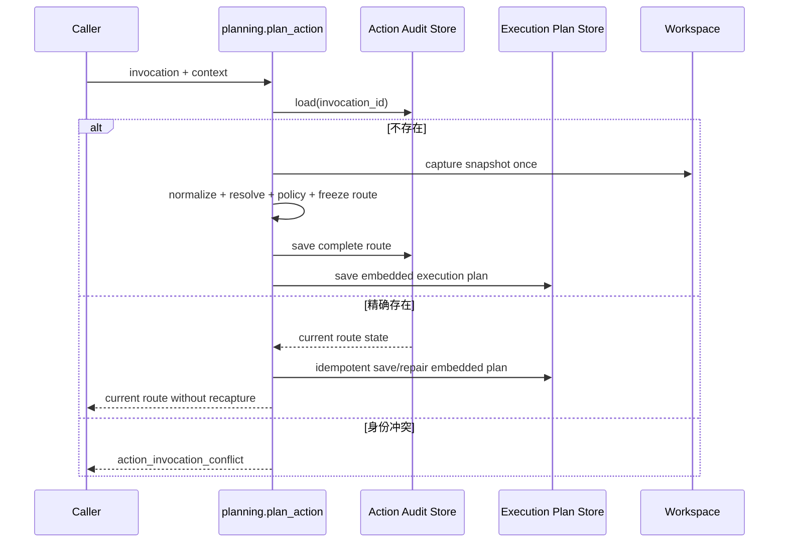

进程若在Audit提交后、Execution Plan Store提交前退出，同一规范Invocation重试会从Audit内嵌Plan修复第二个Store，不重新解析
资源、捕获Workspace或决策Policy。若Route已经执行或结算，重试返回当前状态而非构造旧初态。相同Invocation ID绑定不同参数、
Tool合同或Binding时稳定失败，不能借幂等入口替换已持久操作。

### 42.3 证据与剩余边界

[`test_router.py`](../../tests/trusted_actions/test_router.py)覆盖不重抓Workspace、跨Store故障修复和Invocation冲突；
[`test_action_catalog.py`](../../tests/product_config/test_action_catalog.py)覆盖批量安装原子性、命名空间、过期与漂移。该切片尚未把
Router注入默认Agent，e2必须建立唯一Gateway和审批投影后才能广告写Action。

## 43. 变更记录

| 文档版本 | 代码版本 | 日期 | 变更摘要 |
|---|---|---|---|
| 5 | `82e247a8d083f3f8a7d68ee091a43d59096f298d` | 2026-09-13 | 交付0.9.1e1全集验证后原子发布注册表、Audit优先规划与跨Store崩溃修复；[CI 34739842959](https://github.com/carrie1988/Harnessix/actions/runs/34739842959)全矩阵通过 |
| 4 | `097f23b24c03df0d9d5b540c5b65ddc12029e9f1` | 2026-09-12 | 将Hook现行事实下沉到独立模块设计，并登记捕获时授权、来源错配、输出接受与Action终态分歧及无租约恢复缺口 |
| 3 | `e1aa95764da726d2c1e8f286e4400579ce3efae7` | 2026-09-12 | 将Skill现行事实下沉到独立模块设计，并明确读取事件、Secret Guard、跨账本关联和Definition生命周期缺口 |
| 2 | `3a81225fe8014d28ba559001f7a1fdf3da5d36a0` | 2026-09-12 | 将MCP现行事实下沉到独立模块设计并更新交叉引用 |
| 1 | `a6c2082c40bd159ea00e16ada877bb2dc03088bc` | 2026-09-12 | 建立Trusted Actions现行模块设计，覆盖宿主Binding、资源/Policy、Execution/Approval、Route状态、SQLite Hash链、取消/恢复、扩展端口和MCP/Skill/Hook/Git消费路径 |
