# Workspace模块设计

## 1. 模块摘要

| 项目 | 内容 |
|---|---|
| 源码包 | [`src/harnessix/workspace`](../../src/harnessix/workspace/) |
| 当前职责 | 定义平台中立的逻辑路径和Workspace合同；在POSIX/Windows上以不跟随链接的原生端口捕获选择资源快照；执行前重捕获并比较；提供只读扩展Reader和SQLite跨进程Fencing Lease |
| 非职责 | 不实现完整文件编辑、Patch、Workspace Transaction、Git Worktree、OS Sandbox、权限UI、全仓索引、备份、版本控制或分布式锁服务 |
| 上游调用者 | Execution Planner、Trusted Action、Process/Sandbox、Delivery、Skill和Product Config |
| 下游依赖 | `tools.workspace.Workspace/ReadOperation`、POSIX FD API、Windows Kernel32 Handle API、SQLite与宿主文件系统 |
| 持久化 | Snapshot由上层Execution/Delivery Plan持久化；包内仅`WorkspaceLeaseStore`持久化当前Owner、Fencing Token和到期时间 |
| 平台 | macOS/Linux走POSIX Root FD；Windows走原生句柄链；领域路径始终使用UTF-8、`/`分隔的相对路径 |
| 代码版本 | `8323f0fb5d0dcb95316f76b3e0fcb2140501642d` |
| 当前完成度 | 路径、选择资源Snapshot、原生Windows端口、只读Reader和跨进程Lease已实现；默认产品并未把Lease应用到所有写入口，Snapshot也不是全仓锁或Sandbox |

本文描述[`contracts.py`](../../src/harnessix/workspace/contracts.py)、
[`paths.py`](../../src/harnessix/workspace/paths.py)、[`snapshot.py`](../../src/harnessix/workspace/snapshot.py)、
[`windows.py`](../../src/harnessix/workspace/windows.py)和[`leases.py`](../../src/harnessix/workspace/leases.py)
的当前实现。文件发布和Git交付当前以[0.7可信执行与工程交付设计](../m07-trusted-execution-and-delivery.md)
为聚合事实源，并计划按[DOC-1.3 Wave D](../governance/documentation-remediation-backlog.md#74-wave-d工作区交付评测与观测)
迁移为独立Delivery模块设计；Execution Plan、Trusted Action、Process与Sandbox分别以对应现行模块设计为事实源。

## 2. 需求背景

Coding Agent处理的路径和文件内容均来自不可信模型、用户仓库或扩展。仅执行`Path.resolve()`或在字符串上
检查`..`不能阻止以下问题：

1. 检查后、打开前，文件或父目录被符号链接/Junction替换；
2. 普通文件硬链接把Workspace内路径连接到Workspace外同一对象；
3. Windows盘符、UNC、设备命名空间、ADS、保留名和尾随点/空格改变路径语义；
4. 审批后文件、cwd、Workspace根或外部目录发生变化，旧批准继续执行；
5. 对整个大型仓库递归Hash导致不可接受的延迟和无关变更伪过期；
6. 两个遵守协议的写入者并发提交，旧执行者在租约失效后继续覆盖新结果；
7. Skill或配置扫描直接使用普通Path API，跟随仓库内恶意链接读取宿主文件。

Workspace模块把问题拆成三个互补边界：

- **逻辑路径**：模型只表达相对Workspace、跨平台稳定的路径；
- **选择资源Snapshot**：计划只冻结即将使用的根、cwd、文件、目录和缺失目标事实；
- **Fencing Lease**：遵守Harnessix协议的写端口在每次提交前证明自己仍是当前Owner。

Snapshot检测外部编辑，Lease协调内部写者；二者都不能单独替代安全打开、事务发布或OS Sandbox。

## 3. 设计目标、非目标与关键术语

### 3.1 当前设计目标

1. 模型路径只接受最多4096 UTF-8字节、128段的规范相对路径；
2. 逻辑路径不携带宿主绝对根、盘符、UNC或设备前缀；
3. Windows比较键大小写折叠，POSIX保持大小写敏感；
4. POSIX用Root FD、`openat`语义和`O_NOFOLLOW`逐段核对对象；
5. Windows从宿主根路径的卷/共享根开始逐段打开Handle并拒绝所有Reparse Point；
6. 普通文件拒绝多硬链接，防止Workspace外别名；
7. Snapshot必含Workspace根身份、根路径摘要、cwd目录和全部选择资源；
8. 文件绑定对象身份、执行相关元数据、大小和内容SHA-256；
9. 目录只绑定自身稳定身份及直接成员名称、类型和对象身份，不递归Hash未选择正文；
10. 缺失目标绑定现存父目录身份和目标名，支持安全计划新增文件；
11. 外部根只能由宿主以不透明`location`和明确访问集合注册；
12. Snapshot限制单文件、总正文、目录条目、资源和外部根数量；
13. 执行前按原请求重捕获，任何绑定事实变化统一使Plan过期；
14. 只读扩展使用同一原生端口，不从目录遍历获得链接跟随能力；
15. SQLite Lease跨进程签发单调Fencing Token，失效Owner不能通过`assert_current`；
16. macOS/Linux/Windows原生路径差异通过各自CI验证，不用虚假统一实现代替。

### 3.2 明确非目标

- 不递归Hash整个Workspace或保证仓库任意文件都未变化；
- 不阻止外部编辑器、Git、杀毒软件或其他非协议进程写文件；
- 不把Snapshot描述成事务锁、备份、版本库或内容CAS；
- 不在Snapshot中保存文件正文或宿主根明文路径；
- 不由Workspace模块执行写入、删除、重命名、chmod或Git命令；
- 不对目录未选择成员的正文变化触发过期；
- 不允许模型直接声明外部根宿主路径和访问权限；
- 不支持符号链接、Junction、Reparse Point、普通文件硬链接、特殊文件或跨设备路径；
- 不为Lease提供分布式一致性、续租协程、自动释放、等待队列、公平性或失效通知；
- 不将Lease绑定到完整Snapshot Revision；Lease只绑定`workspace_id`，内容新鲜度另由Snapshot验证；
- 不提供统一Telemetry、备份、Schema迁移和数据库加密；
- 不保证默认Agent所有写路径都已消费Workspace Lease。

### 3.3 关键术语

| 术语 | 定义 |
|---|---|
| Logical Path | UTF-8、`/`分隔、相对某个Root的跨平台路径 |
| Workspace Root | 宿主选择的主工作目录及其原生对象身份 |
| External Root | 宿主显式绑定的额外目录，以不透明Location引用 |
| Location | `workspace`或外部根稳定名称，不是宿主路径 |
| Resource Request | 计划希望以read/write/execute观察的逻辑路径 |
| Observation | 某一选择资源的类型、身份、内容摘要和大小 |
| Selected-resource Snapshot | 仅覆盖cwd和显式选择资源的不可变事实集合 |
| Workspace ID | 平台、根路径摘要和根对象身份的Hash |
| Snapshot Revision | 根、cwd、外部根与全部Observation的Hash |
| Stable Identity | 跨两次观察用于比较的执行相关原生元数据 |
| Revision Identity | 单次观察前后用于发现竞态的更敏感元数据 |
| Fencing Token | 每次Lease Owner世代切换后单调递增的提交世代号 |
| Secure Reader | 复用原生Root能力进行单文件读取和双观察目录列举的内部端口 |

## 4. 当前能力边界

| 能力 | 包内状态 | 当前消费者 | 证据边界 |
|---|---|---|---|
| 逻辑路径规范化 | 已实现 | Snapshot、Delivery | POSIX/Windows属性测试 |
| 选择资源Snapshot | 已实现 | Execution、Trusted Action、Process、Sandbox、Delivery | Workspace和跨模块测试 |
| 执行前重验证 | 已实现 | Trusted Action、Process、Container、Delivery | 漂移拒绝测试 |
| POSIX无跟随打开 | 已实现 | Snapshot/Secure Reader | 链接、硬链接与对象变化测试 |
| Windows Handle链 | 已实现 | Snapshot/Secure Reader | Windows Junction、长路径、根替换测试 |
| 外部根 | 已实现 | Planning Context可显式传入 | 访问集合与Revision测试 |
| Secure Reader | 已实现 | Skill发现、Product Config读取 | Skill与配置集成测试 |
| SQLite Lease/Fencing | 已实现 | Delivery Filesystem/Git Runtime | 跨进程、续租和替换测试 |
| Process/Trusted Action统一Lease | 未实现 | 仅Snapshot复核 | 不能宣称全写链互斥 |
| Windows普通目录事务写 | 未实现 | Delivery优先受管Git Worktree；普通FS Runtime为POSIX | Windows产品交付仍有限制 |
| 全仓递归Revision | 未实现且非目标 | 无 | Snapshot只覆盖选择集合 |
| 分布式Workspace Lock | 未实现 | 无 | SQLite仅本机共享文件 |
| Snapshot公共读取SDK | 未稳定导出 | 调用者从子模块导入 | `workspace.__init__`不导出符号 |

## 5. 模块上下文与边界

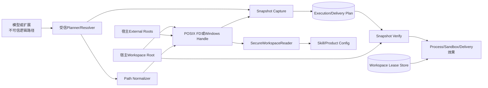

**图示说明：** 模型只提交逻辑路径；宿主选择Root和External Root。原生端口在捕获时把路径解析为对象
身份与内容事实，Snapshot随上层Plan持久化。效果发生前必须重新捕获并精确比较。涉及事务写的Delivery
还要在每个提交边界核对Lease；只读Skill和配置通过Secure Reader复用同一无跟随能力。

**源码映射：** 路径位于[`paths.py`](../../src/harnessix/workspace/paths.py)，Snapshot编排和POSIX端口位于
[`snapshot.py`](../../src/harnessix/workspace/snapshot.py)，Windows端口位于
[`windows.py`](../../src/harnessix/workspace/windows.py)，Lease位于
[`leases.py`](../../src/harnessix/workspace/leases.py)。

### 5.1 受信输入

- Workspace和External Root宿主路径；
- External Root的Location与访问集合；
- 当前宿主平台选择；
- Planner生成的Resource Request；
- 调用者对Snapshot验证、Lease签发和提交前Fencing检查的时序；
- SQLite Lease数据库和宿主文件系统原生身份语义。

### 5.2 不可信输入

- 模型、用户和扩展提供的逻辑路径；
- Workspace内所有文件名、文件类型、正文和目录结构；
- Snapshot捕获前后发生的外部文件系统变化；
- Skill目录中的链接、特殊文件、重复大小写和敏感路径；
- 上层持久Store中读取出的Workspace合同，直到Pydantic完整校验通过。

### 5.3 禁止旁路

1. 不能用字符串拼接`root / model_path`代替原生无跟随打开；
2. 不能在执行阶段静默刷新Snapshot并继续复用旧Approval；
3. 不能仅凭Lease认为文件内容未变化；
4. 不能仅凭Snapshot认为多个内部写者互斥；
5. 不能把External Root宿主路径交给模型决定；
6. 不能在普通Workspace路径中放宽链接、特殊文件或跨挂载访问；
7. Delivery写端口不能只在开始时检查Lease，必须在每个效果提交前复核Fencing Token；
8. Secure Reader不能退化为`Path.read_text/glob/rglob`。

## 6. 包结构与源码阅读顺序

| 顺序 | 文件 | 关键符号 | 阅读目的 |
|---:|---|---|---|
| 1 | [`contracts.py`](../../src/harnessix/workspace/contracts.py) | `WorkspaceResourceRequest`、`WorkspaceResourceObservation` | 理解请求与观察的分离 |
| 2 | 同上 | `ExternalRoot`、`WorkspaceSnapshot` | 理解根、cwd、资源和Revision不变量 |
| 3 | 同上 | `WorkspaceLease`、`workspace_snapshot_revision` | 理解Lease字段和Snapshot自摘要 |
| 4 | [`paths.py`](../../src/harnessix/workspace/paths.py) | `normalize_workspace_path`、`path_comparison_key` | 理解平台中立路径和Windows折叠 |
| 5 | [`snapshot.py`](../../src/harnessix/workspace/snapshot.py) | `_PosixRoot`、`_Observed` | 理解POSIX FD和对象身份 |
| 6 | 同上 | `capture_workspace_snapshot`、`verify_workspace_snapshot` | 理解选择资源算法和重捕获 |
| 7 | 同上 | `SecureWorkspaceReader` | 理解扩展只读能力 |
| 8 | [`windows.py`](../../src/harnessix/workspace/windows.py) | `WindowsWorkspaceRoot` | 理解Handle链、Reparse拒绝和长路径 |
| 9 | 同上 | `_stable_identity`、`_revision_identity`、`_directory_body` | 理解Windows跨观察与观察窗口身份 |
| 10 | [`leases.py`](../../src/harnessix/workspace/leases.py) | `WorkspaceLeaseStore` | 理解Owner、TTL、Fencing和SQLite事务 |
| 11 | [`execution/planner.py`](../../src/harnessix/execution/planner.py) | `build_execution_plan_v2` | 理解Snapshot如何进入Approval Fingerprint |
| 12 | [`delivery/filesystem.py`](../../src/harnessix/delivery/filesystem.py) | `WorkspaceTransactionRuntime` | 理解Snapshot与Lease如何组合保护发布 |
| 13 | [`skills/runtime.py`](../../src/harnessix/skills/runtime.py) | `SkillRegistry._discover_source` | 理解Secure Reader的真实消费路径 |
| 14 | [`test_snapshot.py`](../../tests/workspace/test_snapshot.py) | 平台/竞态测试 | 对照当前保证与未覆盖边界 |

包根[`__init__.py`](../../src/harnessix/workspace/__init__.py)只有模块说明，不导出合同或端口。生产源码直接
从具体子模块导入，表明当前Workspace API仍是内部模块边界，不是独立第三方SDK稳定面。

## 7. 组件架构

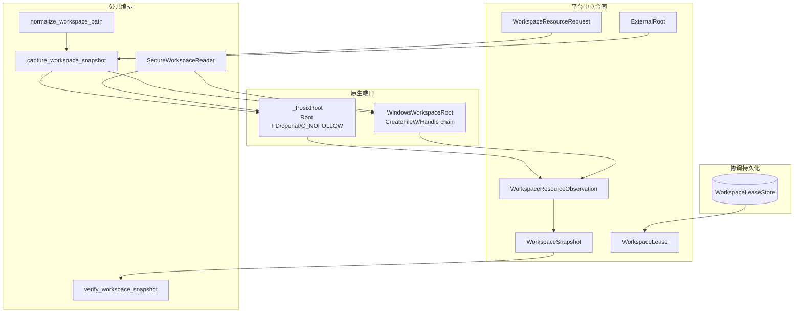

公共编排只依赖`_NativeRoot/_NativeObservation` Protocol描述的最小能力，不强行统一POSIX权限位和Windows
属性。平台差异保留在两个原生实现中，Snapshot只保存规范Hash和稳定类型。

## 8. 路径合同

### 8.1 通用规则

`normalize_workspace_path(value, platform)`执行以下检查：

| 规则 | 限制/行为 |
|---|---|
| 类型 | 必须是精确`str` |
| 编码 | 必须可编码为UTF-8 |
| 总长度 | 1～4096 UTF-8字节 |
| 分隔符 | 只允许`/`，拒绝任何反斜线 |
| 根表示 | 仅`.`表示Root |
| 路径形式 | 拒绝`/`、反斜线开头、盘符前缀和控制字符 |
| 分段 | 最多128段；拒绝空段、`.`、`..` |
| 输出 | `PurePosixPath(...).as_posix()`规范形式 |

领域路径与宿主路径严格分离。即使在Windows上，模型也不能提交`C:/repo/file`、`C:file`或UNC；宿主
通过Root参数绑定实际盘符/共享路径。

### 8.2 Windows附加规则

- 任一段包含`:`即拒绝，阻止NTFS Alternate Data Stream；
- 段以`.`或空格结尾即拒绝，阻止Win32规范化折叠；
- Stem为`CON/PRN/AUX/NUL/CONIN$/CONOUT$/COM1..9/LPT1..9`及上标数字变体即拒绝；
- 单段最多255个UTF-16 code unit；
- 比较键使用规范路径`casefold()`，阻止`Src/Main.py`与`src/main.py`作为两个资源；
- 不采用传统260字符总路径上限，原生端口转换为扩展长度路径。

### 8.3 POSIX规则

POSIX比较键保持规范路径原值，大小写不同是不同资源。`normalize_workspace_path`本身不拒绝POSIX合法但
由`tools.workspace.Workspace`控制面禁止的名称；原生打开阶段还会拒绝`.git`、`.harnessix`、
`.codex`、`.ssh`、`.aws`、`.gnupg`、`.env*`和常见私钥后缀。这意味着“词法合法”不等于“可观察”。

## 9. Workspace合同总览

所有合同继承`WorkspaceContract`，使用`extra="forbid"`、`frozen=True`、`strict=True`和
`allow_inf_nan=False`。

| 合同 | 版本 | 用途 | Schema |
|---|---|---|---|
| `WorkspaceResourceRequest` | 内嵌，无独立`spec_version` | Planner声明Location/Path/Access | 作为Snapshot定义嵌入 |
| `ExternalRoot` | 内嵌 | 持久化外部根摘要、身份与访问集合 | 作为Snapshot定义嵌入 |
| `WorkspaceResourceObservation` | 内嵌 | 持久化选择资源观察 | 作为Snapshot定义嵌入 |
| `WorkspaceSnapshot` | `harnessix.workspace-snapshot/v1` | Execution/Delivery不可变来源事实 | [`workspace-snapshot-v1`](../../spec/workspace-snapshot-v1.schema.json) |
| `WorkspaceLease` | `harnessix.workspace-lease/v1` | 写Owner与Fencing能力 | [`workspace-lease-v1`](../../spec/workspace-lease-v1.schema.json) |

两个Schema由[`scripts/generate_specs.py`](../../scripts/generate_specs.py)生成。DOC-1.6已增加临时目录重建和
逐字节比较，Linux/macOS的`make check`与CI会阻断漂移；Windows因Evals现有POSIX `fcntl`依赖显式Skip，
该平台合同生成能力由0.9.6关闭。

## 10. Resource Request与External Root

### 10.1 WorkspaceResourceRequest字段

| 字段 | 类型/默认 | 来源 | 语义 | 持久化/敏感性 |
|---|---|---|---|---|
| `location` | 稳定名称，默认`workspace` | 受信Planner/Resolver | 选择主Root或外部Root | Snapshot；不含宿主路径 |
| `path` | 1～4096字符 | 模型派生后由宿主构造 | 相对所选Root的逻辑路径 | Snapshot；可能是用户文件名 |
| `access` | `read/write/execute` | 宿主 | 计划使用方式 | Snapshot/Policy |

同一Path可以分别以read和write出现，因为Access进入唯一键与Revision。完全相同
`location/path/access`在平台比较语义下重复会被拒绝。

### 10.2 ExternalRoot字段与授权

| 字段 | 语义 | 不变量 |
|---|---|---|
| `location` | 宿主选择的不透明别名 | 不能是`workspace`；根列表按Location排序且唯一 |
| `path_digest` | 规范宿主根路径Hash | Windows大小写折叠后Hash，POSIX原值Hash |
| `identity` | 原生Root对象身份Hash | POSIX dev/inode；Windows volume/file index |
| `access` | 允许read/write/execute的有序集合 | 非空、唯一，固定read→write→execute顺序 |

捕获时External Root配置最多16个。Resource引用未知Location报`workspace_external_root_invalid`，访问不在
集合时报`workspace_access_denied`。主Workspace默认允许三种Access；这不是用户Permission决策，真正
Policy必须在上层完成。

当前未拒绝两个不同Location指向同一宿主对象，也未拒绝External Root与Workspace Root相同。此类别名
会形成不同Location的重复授权表达，需由宿主配置治理或后续按对象身份去重。

## 11. Observation与Snapshot字段

### 11.1 WorkspaceResourceObservation

| 字段 | 类型 | 来源 | 语义与约束 |
|---|---|---|---|
| `location/path/access` | Request复制并规范化 | Planner/Normalizer | 资源唯一键 |
| `kind` | file/directory/missing | 原生端口 | 观察时对象类型 |
| `identity` | 64位Hash | 原生稳定身份 | 对象与执行相关元数据摘要 |
| `content_sha256` | 文件必填，其余为空 | 读取内容 | 文件正文Hash |
| `size` | 非负整数 | 原生观察 | 文件字节、目录直接条目数、missing为0 |

合同强制“只有file携带内容摘要”和“missing大小为0”。目录成员摘要包含在`identity`内，不单独暴露成员
列表；Snapshot因此不泄露目录清单正文，但路径本身仍以逻辑路径持久化。

### 11.2 WorkspaceSnapshot

| 字段 | 语义 | 关键不变量 |
|---|---|---|
| `platform` | 捕获平台 | posix/windows；验证时必须在同类宿主重捕获 |
| `workspace_id` | 平台+根路径Hash+根对象身份Hash | 识别根，不代表内容Revision |
| `root_path_digest` | 宿主根规范路径Hash | 不保存根明文，但低熵路径可被猜测 |
| `root_identity` | 原生根对象身份Hash | 根被替换时变化 |
| `cwd` | Workspace内逻辑目录 | 必须规范且存在一条workspace/read/directory观察 |
| `external_roots` | 最多16个根绑定 | Location排序、唯一 |
| `resources` | 最多256条观察 | 按平台Location/Path/Access排序、唯一 |
| `algorithm` | `selected-resources-sha256/v1` | 固定算法语义 |
| `revision` | 排除spec/revision后的全事实Hash | 必须自一致 |

Snapshot合同还验证每个资源Location已绑定、外部Access未越权，以及Windows大小写折叠后不存在重复。

## 12. Snapshot捕获算法

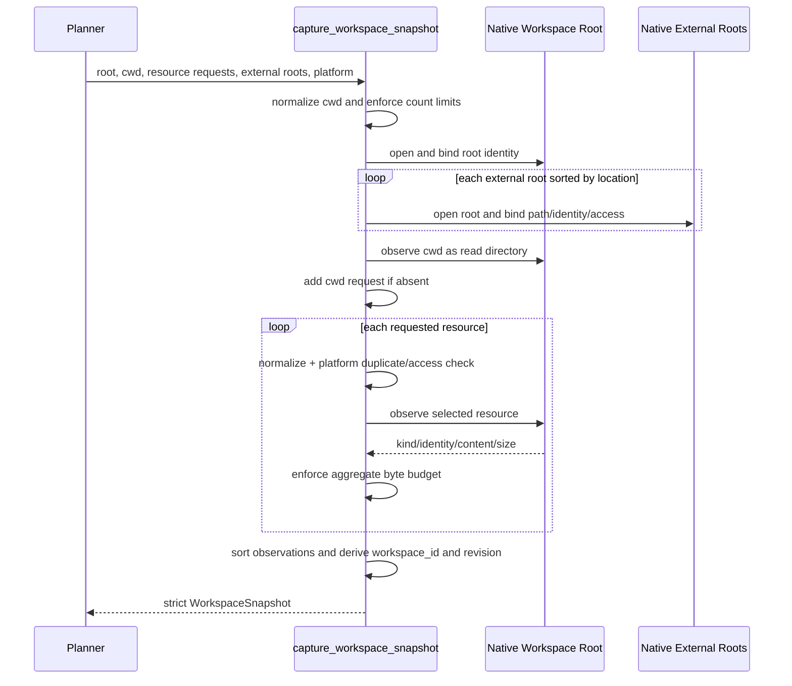

### 12.1 固定预算

| 预算 | 当前值 | 计量方式 |
|---|---:|---|
| 单文件正文 | 8 MiB | 每个已选择普通文件 |
| Snapshot总正文 | 32 MiB | 文件正文与目录成员序列化正文之和 |
| 单目录直接成员 | 10,000 | 不递归 |
| Resource Request | 256 | 调用参数初始数量 |
| External Root | 16 | 宿主配置数量 |
| 逻辑路径总字节/段 | 4096/128 | 每个cwd和资源路径 |

若调用方恰好提交256个Resource且未包含cwd/read，函数还会自动追加cwd，最终严格Snapshot超过256条并
产生Pydantic ValidationError；当前入口没有把该边界统一为`workspace_snapshot_limit`。调用方应预留
cwd项，后续实现需要在追加前统一预算。

### 12.2 资源顺序与重复

捕获保留调用请求顺序用于逐项观察，最终Observation按Location、平台比较键、Access排序。重复在观察前
拒绝；Windows大小写折叠，POSIX精确比较。cwd/read若已显式存在不重复追加。

## 13. 文件、目录与缺失目标语义

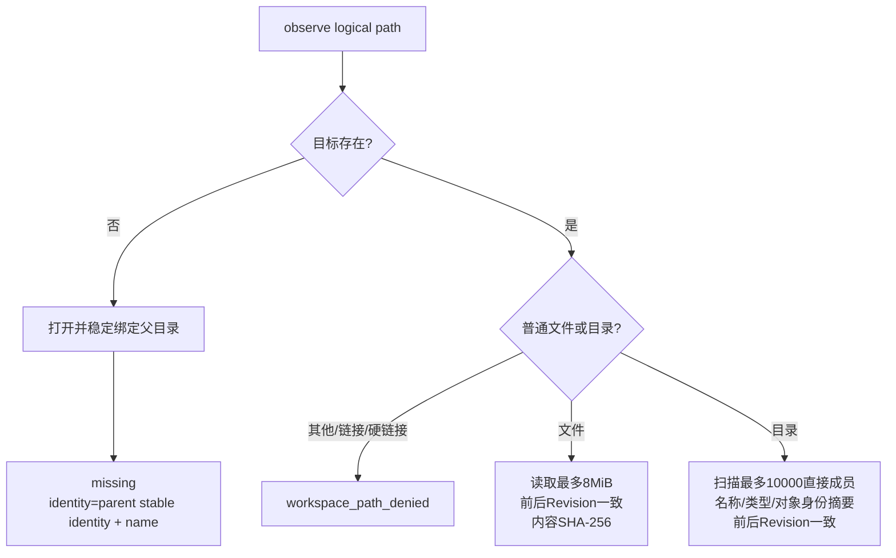

### 13.1 文件

文件Observation绑定原生稳定身份、大小和内容Hash。POSIX稳定身份直接使用`revision_state`，包含
dev/inode/mode/nlink/size/mtime/ctime；即使正文相同，执行相关元数据或时间变化也会使Snapshot过期。
Windows跨观察稳定身份排除Archive属性和写入时间，保留volume/file index、read-only、link count、
size，并另有正文Hash；避免仅因打开文件更新易变元数据造成伪过期。

### 13.2 目录

目录不递归读取成员正文。持久Identity包含目录自身稳定元数据和直接成员序列的Hash：

- POSIX成员项：名称、文件类型位、dev/inode；
- Windows成员项：大小写折叠名称、类型、当前`st_dev/st_ino`。

因此同一成员只改正文且对象未替换，不使仅选择父目录的Plan过期；同名成员被替换为新对象会过期。若
成员本身也被显式选择，其正文Hash另行进入Snapshot。

### 13.3 缺失目标

缺失文件用于规划新增。Identity由现存父目录稳定身份加目标名派生，要求父目录存在且受Root保护。执行
前若目标被创建、父目录被替换或相关身份变化，重捕获结果与原Snapshot不同并返回
`execution_plan_stale`。

## 14. POSIX原生端口

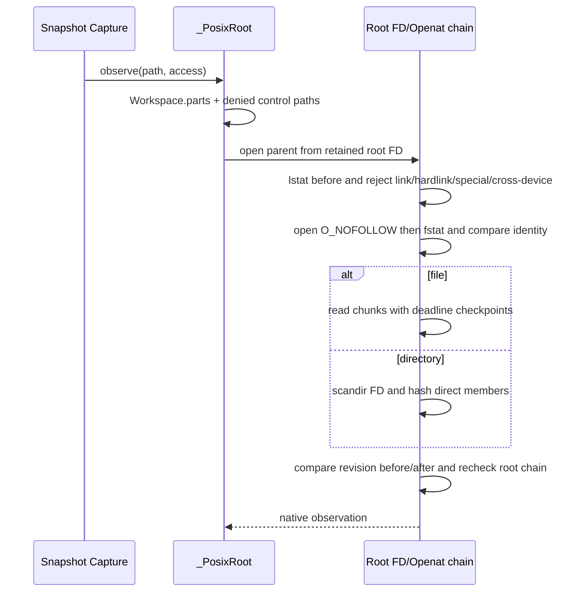

### 14.1 Root绑定

`_PosixRoot`创建`tools.workspace.Workspace`，把宿主Root解析为真实路径，逐段以
`O_RDONLY|O_DIRECTORY|O_NOFOLLOW|O_CLOEXEC`打开并长期保留Root FD。Root Identity为dev/inode。
每次打开重新走当前绝对根并与保留Identity比较，Root路径被替换时失败。

宿主若传入一个指向目录的符号链接Root，`Path.resolve(strict=True)`会先解析到目标，再把解析后的真实
路径作为Root；子路径中的链接仍被拒绝。Root路径Hash因此使用解析后的路径。

### 14.2 逐段打开和竞态控制

每个路径段先`stat(..., follow_symlinks=False)`，再相对父FD用`O_NOFOLLOW`打开，随后比较before对象身份与
FD身份；所有资源段要求与Root同设备。读取完成后比较FD的完整`revision_state`，重新确认Root和每段名称
仍指向同一FD对象。链接、硬链接、FIFO/Socket/Device和竞态变化均失败关闭。

### 14.3 Access语义

对普通文件声明`execute`时要求任一POSIX执行位存在；对read/write并不在Snapshot阶段测试最终写权限。
目录execute不单独检查模式位。Snapshot表达计划事实，不是内核访问授权；实际效果端口仍可能因ACL、
权限、只读文件系统或Sandbox失败。

### 14.4 Deadline

每次POSIX `observe`创建默认`ReadOperation`，文件读循环和FD链在检查点验证单调时限。目录扫描循环本身
没有逐成员显式checkpoint，但外层Workspace上下文退出时再次检查。函数为同步API，不暴露调用者取消
Token，也不允许配置Snapshot级Deadline。

## 15. Windows原生端口

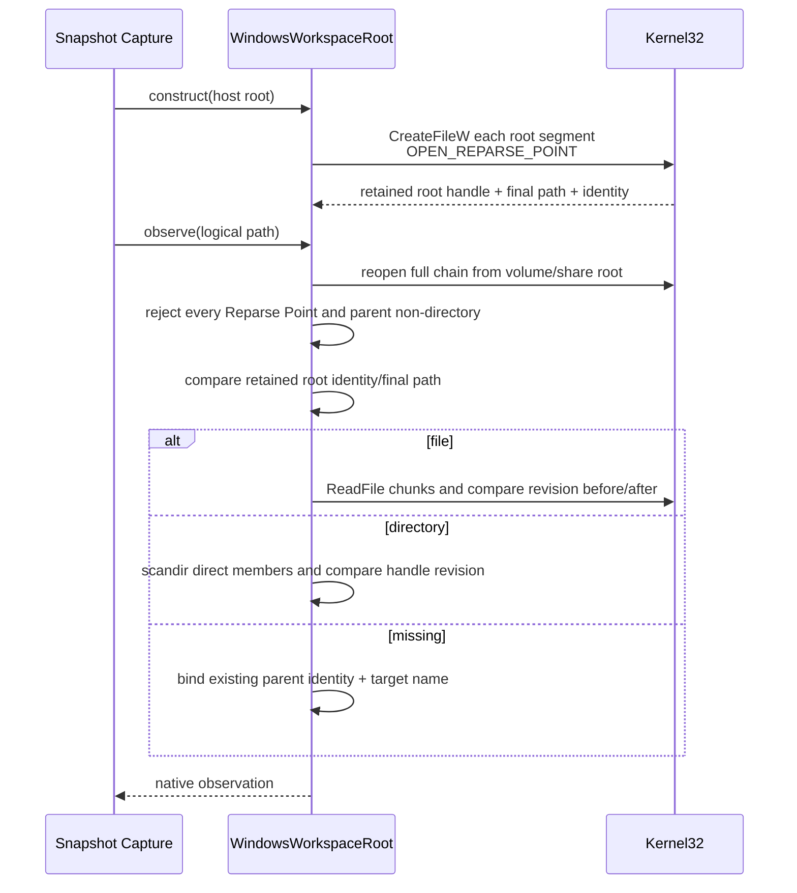

### 15.1 Handle和路径

端口只在`os.name == "nt"`构造。宿主路径转绝对路径，再转换为`\\?\`或`\\?\UNC\`扩展形式。每段
`CreateFileW`使用`FILE_FLAG_BACKUP_SEMANTICS|FILE_FLAG_OPEN_REPARSE_POINT`，共享模式只有
`FILE_SHARE_READ`，因此已打开对象在观察窗口内通常不能被写入、重命名或删除。Root Handle保留到
`close()`，测试证明Workspace Root不能在端口生命周期内被替换。

### 15.2 Reparse与根内证明

从盘符/UNC锚点到Root再到资源的每一段都检查`FILE_ATTRIBUTE_REPARSE_POINT`。当前策略拒绝所有Reparse
Point，而不区分安全/不安全Tag；若用户Workspace祖先位于Junction/云盘重解析路径下，绑定会失败。
最终Handle路径必须等于Root或具有Root前缀，且重开的Root volume/file index和最终路径必须与保留值一致。

### 15.3 文件身份

- 对象主键：Volume Serial + File Index High/Low；
- 跨观察稳定文件身份：对象主键、Read-only位、link count、size；
- 观察窗口Revision：对象主键、完整attributes、links、size、last-write time；
- 普通文件`links != 1`即拒绝；
- `ReadFile`每次64 KiB，最终长度与开始size一致且不超过8 MiB。

### 15.4 目录身份

目录扫描使用路径`os.scandir`，同时持有目标目录Handle。成员调用`os.stat(..., follow_symlinks=False)`获取
Python 3.12的当前File Index，拒绝大小写折叠重名。Reparse成员以`symlink`类型列出但不跟随；如果该
成员被直接选择，Handle链会拒绝。扫描前后目录Handle Revision不一致则`workspace_changed`。

### 15.5 当前平台差异

Snapshot与`SecureWorkspaceReader`同步入口仍不注入协作取消；Tools侧`WindowsReadPort`会把`ReadOperation.checkpoint`
传入`_open_chain`、目录扫描和`ReadFile`循环，因此Coding Tool具备取消和Deadline。Windows不模拟POSIX执行位，
`execute` Access不会验证PE/脚本可执行性。Root Handle共享模式较严格，可能影响并发编辑体验；同一Snapshot Schema
不表示两个平台具有完全相同的文件语义。

## 16. SecureWorkspaceReader

`SecureWorkspaceReader`为Skill和Product Config等受信组件提供最小同步只读能力：

| 方法 | 前置条件 | 行为 | 失败 |
|---|---|---|---|
| 构造 | 宿主Root、可选当前平台 | 打开对应Native Root并保留身份 | `workspace_binding_invalid/platform_unsupported` |
| `read_file(path,max_bytes)` | max_bytes为1～8MiB整数 | 规范路径、观察普通文件、复制bytes | 非文件/超限/变化失败 |
| `list_directory(path,max_entries)` | 1～10000整数 | 对同一目录观察两次并精确比较，返回name/kind | 变化、超限、非目录失败 |
| `close/context manager` | 端口未关闭 | 释放Root FD/Handle | 多次close幂等 |

`SecureDirectoryEntry`只含名称和`file/directory/symlink/special`类型。调用方负责递归深度、总条目、敏感
名称和业务Schema限制。Skill Runtime据此显式跳过链接/特殊文件，并对发现数量、目录数和深度另设预算。

`max_bytes/max_entries`无效时当前抛`ValueError`而非`KernelError`；常规消费者使用受信常量。Reader没有
异步接口，Windows读取没有Deadline，长/慢文件系统可能阻塞调用线程。

## 17. Snapshot验证

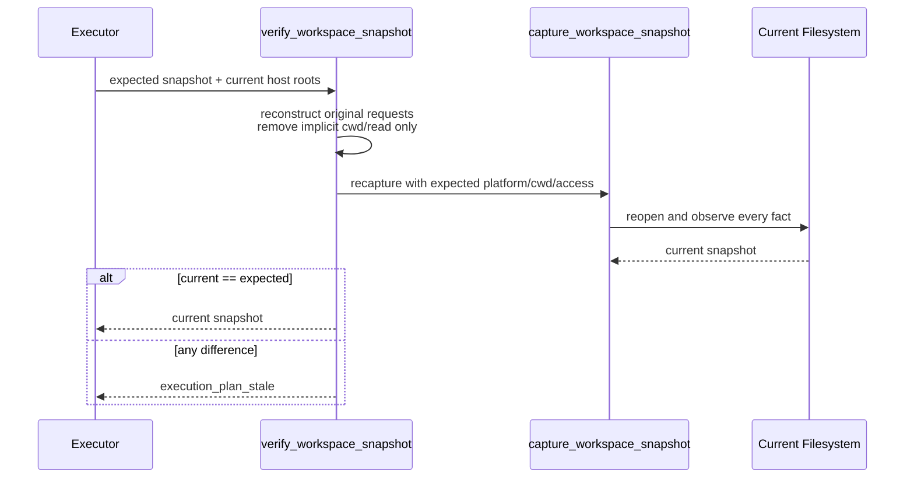

验证不会更新旧Snapshot，也不会只比较`revision`字符串；它按旧资源重捕获完整严格模型并执行对象相等
比较。调用者必须再次提供相同External Root宿主映射，因为Snapshot只保存摘要，不保存可执行路径。

隐式cwd/read Observation在构造重捕获Request时被排除，`capture`会重新自动添加；若调用者原本还显式
提交完全相同cwd/read，其结果相同，合同不区分隐式和显式来源。

## 18. Snapshot数据流与隐私

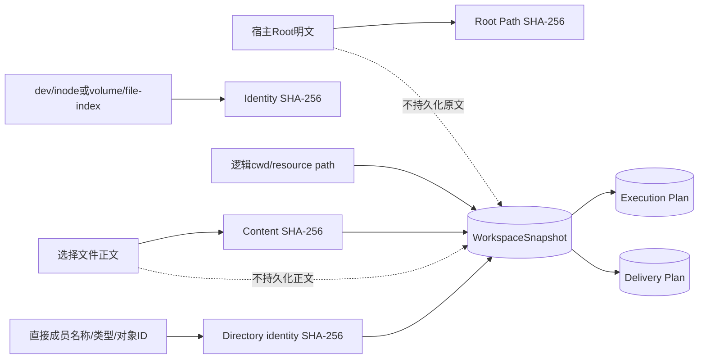

Snapshot仍包含逻辑路径、Location、Access、类型和大小，可能泄露仓库结构。SHA-256对常见Root路径、短
文件内容或低熵对象不是匿名化；具有候选集合的主体可离线枚举。Plan Store必须保持私有权限和合理留存。

目录成员列表只在内存中构成序列化正文并Hash，不进入Snapshot。文件正文在捕获内存中读取后只持久Hash；
Python bytes不会主动清零，因此Snapshot模块不适合读取Secret控制面。POSIX底层Workspace默认禁止常见
Secret路径，Skill还有独立敏感路径规则。

## 19. Workspace Lease模型

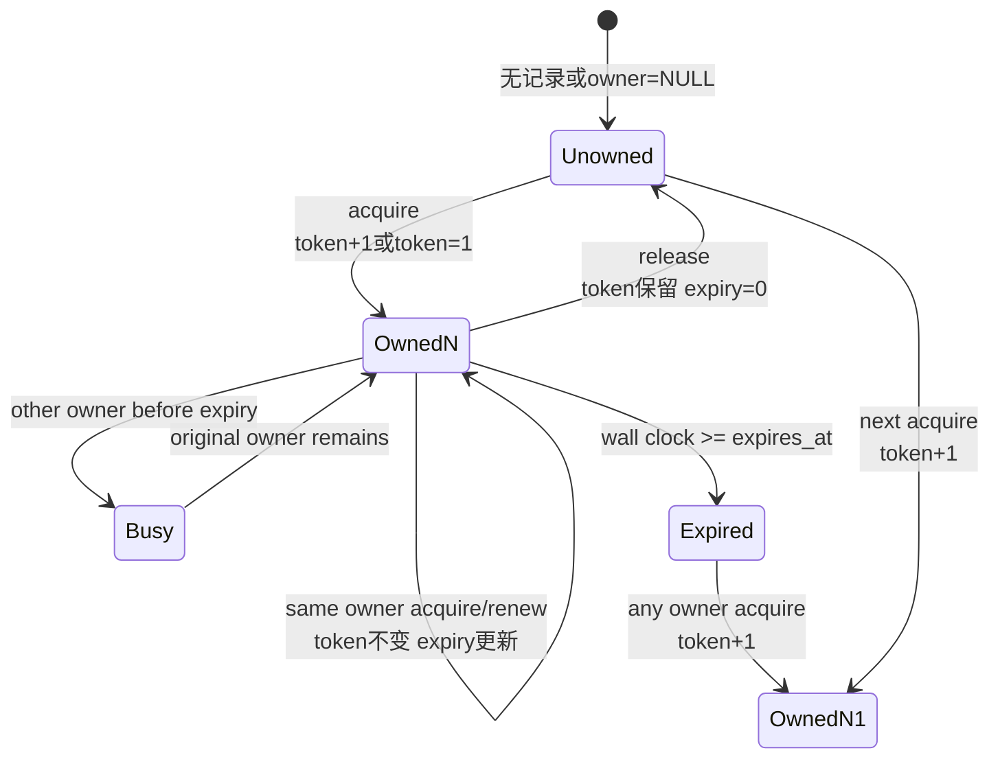

### 19.1 WorkspaceLease字段

| 字段 | 类型/限制 | 语义 |
|---|---|---|
| `workspace_id` | 64位小写Hex Revision | Root身份范围，不含Snapshot内容Revision |
| `owner_id` | 1～128字符 | Runtime Owner身份；当前允许纯空白字符串通过合同/Store非空检查 |
| `fencing_token` | 正整数 | 每次Owner世代替换单调递增 |
| `expires_at` | 有限正浮点 | 默认`time.time()`墙钟绝对秒 |

Lease不是文件锁；它是提交能力。安全写端口必须同时检查Lease属于计划Workspace ID、`assert_current`成功、
Snapshot仍新鲜，并在每个不可逆效果前再次检查。

## 20. WorkspaceLeaseStore持久化

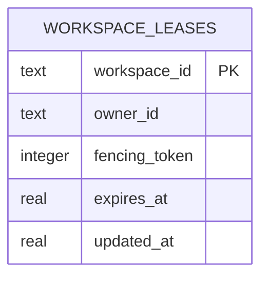

Store创建SQLite `STRICT`表，启用WAL、`synchronous=FULL`和5秒busy timeout。POSIX父目录/文件分别设为
`0700/0600`；Windows没有包内DACL。表没有Schema Metadata、迁移版本、Foreign Key或历史Event，只有
每个Workspace的当前行。

### 20.1 Acquire

`acquire`要求Workspace ID为64位小写Hex、Owner非空且不超过128、TTL为精确int/float且
`0 < ttl <= 3600`、有限且非bool。`BEGIN IMMEDIATE`串行读取/更新：

- 无行：token=1；
- 相同Owner且未过期：保留token，刷新expiry；
- 其他Owner且未过期：`workspace_busy`；
- 已过期或已释放：token+1，写入新Owner。

### 20.2 Renew

`renew`用单条条件UPDATE要求workspace/owner/token匹配且数据库expiry仍大于当前墙钟，随后返回新
`expires_at`对象。它不把调用Lease的旧`expires_at`放进WHERE；相同Owner在有效期内再次Acquire并刷新
expiry后，旧Lease对象仍持有相同token，可能继续Renew当前行。

### 20.3 Assert current

`assert_current`读取当前三元组并要求与Lease对象的owner/token/**expires_at精确相等**且未到期。因此旧
Lease对象在同Owner重新Acquire或Renew后会被判失效。浮点时间来自同一写入值，当前依赖SQLite/Python
往返保持精确可比较。

### 20.4 Release

`release`按workspace/owner/token更新`owner_id=NULL, expires_at=0`，不比较调用Lease的expires_at，也
不要求当前未过期。结合相同Owner重入保留token的设计，较旧但同token的Lease对象可能释放后来刷新过的
Lease。这是当前Fencing对象生命周期缺口；调用者应只保留最新Lease，正式修复应让每次Acquire产生新
世代或把当前expiry/独立Lease ID纳入CAS。

### 20.5 墙钟语义

跨进程/重启无法共享单调Clock，因此Store使用墙钟。系统时间向前跳会提前过期，向后跳会延长占用；
`updated_at`仅为数据库字段，不进入返回合同，也没有异常跳变检测。Fencing Token能阻止已经发生世代切换
后的旧Owner，但不能自动修正尚未切换的墙钟偏差。

## 21. Snapshot与Lease组合

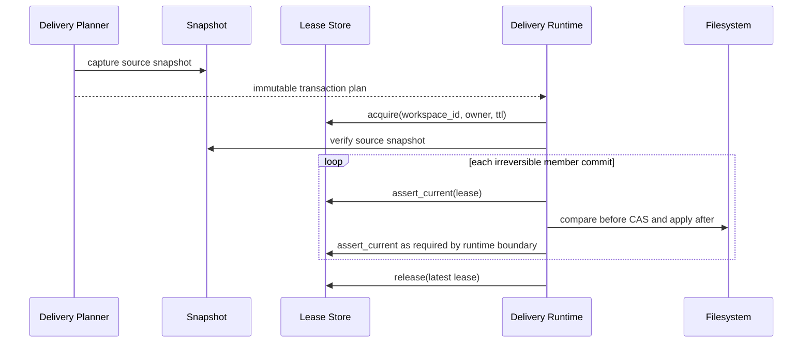

Workspace包本身不强制该时序。当前[`WorkspaceTransactionRuntime`](../../src/harnessix/delivery/filesystem.py)
和Git Delivery显式组合两者：Lease Workspace ID必须等于计划Source Workspace ID，首次效果前验证完整
Snapshot，后续按成员CAS和Fencing推进。Trusted Action、Process和Container当前验证Snapshot但不统一
获取Workspace Lease。

## 22. 上游与下游集成

### 22.1 Execution Plan

Execution Planner把完整Snapshot嵌入Execution Plan Fingerprint。Approval因此间接绑定Root、cwd和选择
资源事实；执行器必须重验证，不能只检查Snapshot自摘要。详见
[Execution Plan模块设计](execution.md)。

### 22.2 Trusted Action

受信Resolver返回`WorkspaceResourceRequest`；Router在Policy后捕获Snapshot，执行前通过Workspace ID定位
Root并重验证。Router不使用Workspace Lease，也不自动证明Canonical Resource与Workspace Request一一
对应。详见[Trusted Actions模块设计](trusted-actions.md)。

### 22.3 Process与Sandbox

Process Supervisor和Container命令构造在spawn前重验证Plan Snapshot。Container把Root挂载到固定位置；
Snapshot证明捕获后未漂移，但实际隔离、挂载读写模式和进程树由Sandbox/Process模块负责。Host Process
可能写任意未穷举文件，Snapshot不能把它变成事务。

### 22.4 Delivery

Delivery Planner为每个目标文件和所有父目录生成Request，Snapshot同时绑定已存在文件正文、缺失目标和
目录成员身份。Runtime获取Lease并按before/after CAS发布，Git Runtime还绑定Repository/Worktree对象。
Workspace模块不保存Blob或Transaction Cursor。

### 22.5 Skill与Product Config

Skill Registry用Secure Reader发现Manifest和资源，业务层另行限制深度、条目、正文、敏感名和YAML。
Product Config Codec用Secure Reader读取受信配置文件。Workspace Reader只保证路径与对象安全，不验证
业务格式、签名或供应链来源。

## 23. 并发与竞态模型

| 竞态 | 当前控制 | 剩余边界 |
|---|---|---|
| 路径段在stat/open间替换 | before identity vs opened FD/Handle identity | 文件系统/内核身份语义是信任基 |
| 读取期间文件修改 | FD/Handle Revision前后比较，正文长度/Hash | POSIX元数据粒度与远端FS语义依赖宿主 |
| 目录扫描期间增删替换 | 目录Revision前后比较；Secure Reader双观察 | 大目录扫描同步阻塞 |
| Root路径被替换 | 保留Root FD/Handle并重开比较 | POSIX传入Root符号链接会先解析 |
| 外部编辑发生在审批后 | 执行前重捕获完整Snapshot | 验证后到效果间仍需安全端口/CAS |
| 两个内部写者 | SQLite Owner/TTL/Fencing | 非协议写者不受控；所有写入口未统一接入 |
| Lease过期后旧Owner提交 | 副作用端口`assert_current` | 若端口漏检则Lease无效 |
| 同Owner旧Lease对象 | `assert_current`比较expiry | `renew/release`未比较旧expiry，可影响新Lease |
| 资源列表重复 | 平台比较键去重 | 相同对象可经不同External Location别名出现 |

Snapshot捕获和验证本身不是跨调用原子事务。安全效果端口必须继续使用FD-relative写、原子rename、内容CAS、
Git Object/Ref CAS或Sandbox受管副本，缩小“验证后到效果前”窗口。

## 24. Timeout、取消与资源释放

| 组件 | Timeout | 取消 | 释放 |
|---|---|---|---|
| Path Normalizer/合同 | 无 | 同步、不可取消 | 无资源 |
| POSIX observe | 内部`ReadOperation`默认读取时限 | 无外部Token；检查点可抛工具取消/Timeout映射 | Context/ExitStack关闭FD |
| Windows observe | 无Deadline | 同步、不可协作取消 | finally逆序关闭Handle |
| capture/verify | 无整体Deadline | 同步 | ExitStack关闭所有Root；Windows Root在捕获结束关闭 |
| Secure Reader | 无整体Deadline；POSIX继承单次observe | 同步 | 显式close/context manager |
| Lease Store | SQLite busy timeout 5秒 | 同步 | 显式close/context manager |

POSIX `ReadOperation`的`TurnCancelled`不是`KernelError`，Snapshot部分调用链可能直接传播；常规同步捕获不
提供停止事件。后续产品化需要统一Deadline和取消错误，同时保证中途已打开的FD/Handle仍由ExitStack清理。

## 25. 错误分类

| 错误码/异常 | 触发场景 | 当前恢复建议 |
|---|---|---|
| `workspace_platform_unsupported` | 未知平台或请求平台与宿主不符 | 选择匹配平台端口，不降级 |
| `workspace_path_denied` | 非法路径、链接、硬链接、特殊文件、Reparse或控制路径 | 修正声明/仓库后重新规划 |
| `workspace_binding_invalid` | Root不可打开、非目录或身份异常 | 修复宿主Root/权限 |
| `workspace_parent_missing` | 缺失目标的父目录不存在 | 显式规划创建父目录或调整目标 |
| `workspace_observation_failed` | 原生读取/属性失败 | 诊断文件系统，不盲重试写 |
| `workspace_changed` | 观察窗口内对象/Root/目录变化 | 重新捕获；旧Plan无效 |
| `workspace_wrong_file_type` | POSIX底层对象类型不符的映射码 | 修正资源类型 |
| `workspace_execute_denied` | POSIX文件无执行位 | 调整权限并重新规划 |
| `workspace_snapshot_duplicate` | 平台语义重复Request | 修正Resolver/Planner |
| `workspace_snapshot_limit` | 文件、总字节、目录或数量超限 | 缩小选择集合/外置Artifact |
| `workspace_external_root_invalid` | 根配置或Location引用无效 | 修正宿主配置 |
| `workspace_access_denied` | 外部根Access不足 | 新授权和新Plan，不能静默扩大 |
| `execution_plan_stale` | 重捕获Snapshot不等于预期 | 丢弃旧批准并重新规划 |
| `workspace_lease_invalid` | ID/Owner/TTL无效 | 修正宿主参数 |
| `workspace_busy` | 其他Owner持有未过期Lease | 等待/由Owner释放；不要抢占 |
| `workspace_lease_lost` | token/owner/expiry变化或到期 | 立即停止效果，重新规划/获取新Lease |
| 原生`ValidationError/ValueError` | 256+隐式cwd、Reader参数等未归一边界 | 当前由上游投影；后续统一KernelError |

错误消息固定且不拼接宿主路径或文件正文。POSIX底层`ReadToolError`被映射为`workspace_<code>`；不同
平台在部分错误细分上并非完全一致，公共产品协议应按稳定错误码集合投影。

## 26. 安全分析

### 26.1 已实现控制

- 逻辑路径拒绝绝对前缀、遍历、控制字符和平台歧义；
- POSIX/Windows都按对象句柄而非最终字符串建立身份；
- 路径段不跟随链接，普通文件硬链接数必须为一；
- POSIX限制同设备，跨挂载必须显式External Root；
- Windows拒绝Reparse、ADS、保留名、大小写冲突并支持扩展长度路径；
- 捕获期间前后Revision比较，验证阶段完整重捕获；
- 外部根Access最小化且宿主路径只保存Hash；
- 文件/目录/资源有固定预算；
- Skill读取复用Secure Reader并另加敏感路径规则；
- Lease用Fencing世代阻止Owner切换后的旧提交；
- POSIX Lease数据库权限收紧。

### 26.2 当前安全缺口

| 风险 | 当前影响 | 处置方向 |
|---|---|---|
| Snapshot验证到实际写入仍有TOCTOU | 不安全Executor可写错对象 | 所有效果端口使用FD-relative/CAS/事务副本 |
| Snapshot不是全仓锁 | 未选择文件可变化 | UI明确覆盖集合；高风险命令进Sandbox副本 |
| Lease只协调协议内写者 | 外部编辑器可并发修改 | Snapshot/CAS仍必须执行 |
| Lease同Owner旧对象可renew/release | 旧能力可影响刷新后的Lease | 独立Lease ID或每次Acquire递增token |
| 墙钟回拨延长Lease | Workspace长期busy | 时钟跳变监测和运维解除策略 |
| External Root别名未按对象去重 | 同一对象可获不同访问表达 | 配置阶段对象身份冲突检查 |
| POSIX Root符号链接先resolve | 记录的是目标而非别名 | 文档/UI展示真实绑定；按需拒绝别名 |
| Windows拒绝祖先所有Reparse | OneDrive/Junction工作区可能不可用 | 保持失败关闭并提供受管Worktree方案 |
| Windows observe无Timeout | 网络共享可长期阻塞 | 可取消I/O/线程Owner和Deadline |
| Hash可字典枚举 | 低熵路径/内容不是匿名 | 私有Store、最小留存、必要时Keyed Digest |
| Workspace合同不做业务敏感路径授权 | Planner可声明普通但敏感文件 | Policy/Tool层保留控制面Deny |

## 27. 可观测性

Workspace包当前没有直接Trace、Metric或结构化Log。可持久关联的事实来自上层Plan和Lease当前行：

| 信号 | 当前可得 | 不应记录 | 缺失 |
|---|---|---|---|
| Snapshot | platform、workspace_id、revision、资源数/总大小可派生 | Root明文、文件正文、Secret路径 | 捕获耗时、失败阶段、目录/字节计量 |
| Verify | 上游只看到成功或`execution_plan_stale` | 当前/预期正文差异 | 哪个资源变化的安全诊断 |
| Lease | owner、token、expiry、updated_at | 用户内容 | acquire等待、冲突、续租延迟、时钟跳变 |
| Native Port | 固定错误码 | OS异常正文和绝对路径 | FD/Handle数量、扫描耗时、平台能力 |

建议低基数指标包括capture/verify计数与时延、资源/字节Bucket、错误码、Lease busy/lost和Windows/POSIX
平台；逻辑路径、Root Hash、Workspace ID、Owner ID不应成为Metric Label。安全诊断可在受限Trace中记录
资源序号与摘要，但不能默认记录路径和内容。

## 28. 重点类与生命周期

| 符号 | 职责 | 生命周期/状态 | 线程/进程语义 | 限制 |
|---|---|---|---|---|
| `WorkspaceSnapshot` | 不可变选择资源事实 | 随Execution/Delivery Plan持久化 | 可跨进程JSON传递 | 只覆盖选择集合 |
| `_PosixRoot` | Root FD与POSIX观察 | 单次capture或Reader生命周期 | FD对象不应跨进程/线程滥用 | 依赖`tools.workspace`控制路径策略 |
| `WindowsWorkspaceRoot` | Root Handle与Windows观察 | 同上，必须close | Handle保护Root替换 | 无Deadline，拒绝所有Reparse |
| `SecureWorkspaceReader` | 只读文件/目录能力 | Context Manager | 同步；未声明线程安全 | 不做业务格式/敏感内容验证 |
| `WorkspaceLeaseStore` | 当前Owner和Fencing持久化 | 长期单SQLite连接，必须close | 多进程通过SQLite协调；同实例未声明多线程安全 | 无历史、迁移和续租Task |
| `WorkspaceLease` | Owner提交能力快照 | Acquire/Renew返回的新对象 | 应只保留最新对象 | 仅绑定Workspace ID |

## 29. 公共接口合同

| 接口 | 调用者/实现者 | 前置/后置 | Timeout/取消 | 幂等/顺序 | 权限 |
|---|---|---|---|---|---|
| `normalize_workspace_path` | 任意Planner / workspace | 输入平台/str有效；返回稳定逻辑路径 | 无 | 纯函数 | 无宿主I/O |
| `path_comparison_key` | 合同/Planner / workspace | 先规范化；Windows casefold | 无 | 纯函数 | 无 |
| `capture_workspace_snapshot` | Planner/Resolver / workspace | Root由宿主选择；返回严格自摘要Snapshot | 无整体Deadline | 同一稳定FS事实确定 | 读取所选资源 |
| `verify_workspace_snapshot` | Executor / workspace | 使用原平台/Root重捕获；不同即stale | 同上 | 只读 | 必须在效果前调用 |
| `SecureWorkspaceReader.read_file` | Skill/Config / workspace | 普通文件且在大小预算内 | 平台差异 | 只读 | Root内、控制路径Deny |
| `list_directory` | Skill / workspace | 目录双观察稳定 | 平台差异 | 只读 | 不跟随成员链接 |
| `LeaseStore.acquire` | Delivery Owner / workspace | 有效ID/Owner/TTL；返回当前世代 | SQLite 5秒 | 同Owner重入保留token | 受信宿主 |
| `renew` | 当前Owner / workspace | owner/token未失效且DB未到期 | 同步 | 返回新Lease对象 | 受信宿主 |
| `assert_current` | 每个副作用端口 / workspace | DB三元组与Lease完全一致且未到期 | 同步 | 只读 | 必须靠调用者强制 |
| `release` | 当前Owner / workspace | owner/token匹配 | 同步 | 二次释放报lost | 受信宿主 |

## 30. 核心业务逻辑伪代码

### 30.1 路径规范化

```text
normalize(path, platform):
    require supported platform and exact string
    encode UTF-8; enforce 1..4096 bytes
    reject absolute, drive, backslash and control characters
    if path is dot: return dot
    split by slash; enforce <=128 nonempty non-dot segments
    if windows:
        reject ADS colon, trailing dot/space, reserved stem
        enforce <=255 UTF-16 units per segment
    return canonical slash-separated path
```

### 30.2 Snapshot捕获

```text
capture(root, cwd, requests, external_roots, platform):
    select native host platform and normalize cwd
    enforce initial request/root counts
    open main root and each sorted external root in ExitStack
    persist only root path digest, object identity digest and access
    require cwd observes as directory
    append cwd/read request when absent
    for each request:
        normalize and reject platform-duplicate key
        require location exists and external access is granted
        native = root.observe(path, access)
        add file/directory-body bytes to total; enforce 32 MiB
        convert native identity and content to SHA-256 observation
    sort observations by location/platform-path/access
    workspace_id = hash(platform + root path hash + root identity hash)
    revision = hash(all snapshot facts except spec/revision)
    return strict immutable snapshot
```

### 30.3 POSIX观察

```text
observe_posix(path, access):
    parse through Workspace control-path policy
    open parent chain relative to retained root FD without following links
    lstat target; if missing, bind stable parent identity + target name
    reject symlink, hard-linked regular file, special type and cross-device
    open target FD; compare lstat identity with fstat identity
    if file:
        for chunks up to 8 MiB: check deadline and read
        bind revision metadata + content
    if directory:
        scan <=10000 direct members and bind name/type/dev/inode
    compare full FD revision before/after
    re-open root and recheck every path link still points to same FD objects
```

### 30.4 Windows观察

```text
observe_windows(path, access):
    normalize logical path
    from volume/share anchor, CreateFileW every root and target segment
    reject any Reparse Point and non-directory parent
    compare retained root object identity and final path
    require final target under retained root
    if missing:
        reopen parent and bind parent stable identity + target name
    if directory:
        scan direct members; reject casefold collisions
        compare target handle revision before/after
    if file:
        require link count one and size <=8 MiB
        ReadFile all bytes
        compare full revision before/after and exact size
    close child handles in reverse order
```

### 30.5 Lease

```text
acquire(workspace, owner, ttl):
    validate lower-hex workspace, owner and finite 0<ttl<=3600
    begin immediate transaction
    if no row: token = 1
    else if same owner and not expired: preserve token
    else if other owner and not expired: fail workspace_busy
    else: token = previous token + 1
    write owner/token/now+ttl and commit
    return lease capability

assert_current(lease):
    read owner/token/expiry for workspace
    require exact tuple equality and expiry > current wall clock

release(lease):
    compare-and-update by workspace/owner/token to unowned and expiry zero
```

## 31. 源码与测试映射

| 设计元素 | 源码 | 关键符号 | 测试 | 测试符号/证明 |
|---|---|---|---|---|
| 跨平台逻辑路径 | [`paths.py`](../../src/harnessix/workspace/paths.py) | `normalize_workspace_path` | [`test_paths.py`](../../tests/workspace/test_paths.py) | `test_logical_paths_reject_platform_prefix_and_traversal` |
| Windows保留/ADS/折叠 | 同上 | `_WINDOWS_RESERVED` | 同上 | `test_windows_rejects_reserved_ads_and_collapsed_names` |
| 长逻辑路径和比较键 | 同上 | `path_comparison_key` | 同上 | `test_windows_supports_long_logical_paths_without_legacy_260_limit`、`test_platform_comparison_key_only_folds_windows` |
| Snapshot合同与文件漂移 | [`contracts.py`](../../src/harnessix/workspace/contracts.py)、[`snapshot.py`](../../src/harnessix/workspace/snapshot.py) | `WorkspaceSnapshot`、`capture_workspace_snapshot`、`verify_workspace_snapshot` | [`test_snapshot.py`](../../tests/workspace/test_snapshot.py) | `test_snapshot_binds_file_content_cwd_and_missing_parent` |
| 平台重复资源 | 同上 | `unique_resources`、`seen` | 同上 | `test_snapshot_rejects_duplicate_resources_by_platform_semantics` |
| External Root授权 | [`snapshot.py`](../../src/harnessix/workspace/snapshot.py) | `capture_workspace_snapshot` | 同上 | `test_external_root_access_is_explicit_and_revision_bound` |
| 缺失父目录 | 同上 | `_PosixRoot.observe`、`WindowsWorkspaceRoot.observe` | 同上 | `test_missing_resource_requires_an_existing_bound_parent` |
| POSIX链接/硬链接 | 同上、[`tools/workspace.py`](../../src/harnessix/tools/workspace.py) | `Workspace.open/_check_type` | 同上 | `test_posix_snapshot_rejects_links` |
| Windows Junction | [`windows.py`](../../src/harnessix/workspace/windows.py) | `_open_chain` | 同上 | `test_windows_snapshot_rejects_junction` |
| Windows扩展长路径 | 同上 | `_api_path`、`_read_all` | 同上 | `test_windows_snapshot_reads_and_revalidates_long_path` |
| Windows Root Handle | 同上 | `WindowsWorkspaceRoot.__init__/close` | 同上 | `test_windows_root_handle_blocks_workspace_replacement` |
| Windows稳定身份 | 同上 | `_stable_identity/_revision_identity` | 同上 | `test_windows_snapshot_remains_stable_after_selected_files_are_reopened`、`test_windows_stable_identity_excludes_volatile_metadata` |
| 目录选择语义 | [`snapshot.py`](../../src/harnessix/workspace/snapshot.py) | `_stable_directory_identity`、directory body | 同上 | `test_directory_snapshot_ignores_unselected_member_content_change`、`test_directory_snapshot_detects_same_name_member_replacement` |
| 跨进程Fencing | [`leases.py`](../../src/harnessix/workspace/leases.py) | `WorkspaceLeaseStore.acquire`、`WorkspaceLeaseStore.assert_current` | [`test_leases.py`](../../tests/workspace/test_leases.py) | `test_cross_process_lease_uses_monotonic_fencing_tokens`、`test_lease_is_enforced_by_an_independent_process` |
| Renew/Release世代 | 同上 | `WorkspaceLeaseStore.renew`、`WorkspaceLeaseStore.release` | 同上 | `test_renew_and_release_do_not_reuse_old_fence` |
| Lease参数限制 | 同上 | `_validate` | 同上 | `test_lease_rejects_invalid_ttl` |
| Execution绑定 | [`execution/planner.py`](../../src/harnessix/execution/planner.py) | `build_execution_plan_v2` | [`test_plans.py`](../../tests/execution/test_plans.py) | `test_plan_binds_every_execution_fact_without_secret_plaintext`、`test_plan_rejects_argument_environment_workspace_policy_and_capability_drift` |
| Trusted Action执行前复核 | [`trusted_actions/router.py`](../../src/harnessix/trusted_actions/router.py) | `_prepare_execution` | [`test_router.py`](../../tests/trusted_actions/test_router.py) | `test_write_requires_exact_approval_and_workspace_freshness` |
| Delivery规划二次复核 | [`delivery/planner.py`](../../src/harnessix/delivery/planner.py) | `prepare_workspace_transaction` | [`test_planner.py`](../../tests/delivery/test_planner.py) | `test_planner_detects_source_change_during_final_recheck` |
| Delivery Lease提交 | [`delivery/filesystem.py`](../../src/harnessix/delivery/filesystem.py) | `WorkspaceTransactionRuntime._assert_lease`、`WorkspaceTransactionRuntime.publish` | [`test_filesystem.py`](../../tests/delivery/test_filesystem.py) | `test_expired_lease_stops_before_next_member_effect`、`test_real_process_exit_after_replace_reconciles_without_repeating_effect` |
| Skill安全发现 | [`skills/runtime.py`](../../src/harnessix/skills/runtime.py) | `_discover_source/_manifest_paths` | [`test_runtime.py`](../../tests/skills/test_runtime.py) | `test_hard_link_resource_is_listed_but_cannot_be_read`、`test_source_root_symlink_is_rejected_before_discovery` |

## 32. 测试设计与验证范围

### 32.1 定向回归

```bash
uv run pytest \
  tests/workspace \
  tests/execution/test_plans.py \
  tests/trusted_actions/test_router.py \
  tests/sandbox/test_container.py \
  tests/processes/test_supervisor.py \
  tests/delivery/test_planner.py \
  tests/delivery/test_filesystem.py \
  tests/delivery/test_git.py \
  tests/skills/test_runtime.py
```

本地POSIX测试证明macOS当前宿主语义；Windows专用用例在非Windows平台Skip，必须以Windows CI结果作为
原生证据。真实Container和Git测试证明消费者组合，不代表所有网络文件系统、文件系统类型或企业策略。

### 32.2 当前测试缺口

- 256个显式Resource加隐式cwd导致合同溢出的统一错误；
- 两个External Location绑定同一对象或绑定主Workspace Root的冲突；
- POSIX传入Root符号链接的明确产品合同；
- POSIX目录扫描超过时限时的稳定错误和大目录性能基准；
- Windows网络共享、FAT/ReFS、大小写敏感目录、云文件占位和祖先Reparse场景；
- Windows普通文件execute Access和ACL/只读文件系统语义；
- Secure Reader Windows同步调用的取消/Timeout与慢文件系统Soak；Tools调用已有检查点；
- 同Owner旧Lease对象Renew/Release后来刷新Lease的回归；
- 墙钟前跳/回拨、进程Suspend、SQLite锁竞争和磁盘满；
- Lease数据库损坏、未知Schema、备份恢复和Windows ACL；
- 所有写Executor提交前均强制Fencing的架构门禁；
- Snapshot/Lease JSON Schema自动漂移测试；
- Root/Content Hash低熵枚举和敏感路径Telemetry攻击测试。

## 33. 已知限制、风险与后续工作

| 优先级 | 缺口 | 当前影响 | 建议归属 |
|---|---|---|---|
| P0 | 同Owner旧Lease可Renew/Release新expiry | 旧能力对象可影响当前Lease | 0.9.3可靠性修复 |
| P0 | 默认写工具/Process未统一使用Workspace Lease | 内部多写者不能由统一Fencing保护 | 0.9.1产品装配 |
| P0 | Snapshot验证后到非事务效果仍有窗口 | 不安全Executor可能作用于变化对象 | 0.9.1/0.9.4端口审计 |
| P1 | Windows普通Workspace事务写未实现 | Windows生产交付依赖受管Git路径 | 0.9.5三平台发行 |
| P1 | Secure Reader未向Windows Observe传入Deadline | 配置/Skill等同步消费者在慢盘上仍可能阻塞；Coding Tool已有检查点 | 0.9.3取消/Soak |
| P1 | 资源256边界与隐式cwd未统一 | 极限请求泄漏ValidationError | 0.9.4错误收敛 |
| P1 | External Root对象别名未去重 | 权限和审计可能重复表达同一对象 | 0.9.4授权规范 |
| P1 | Lease无Schema版本/损坏检测/历史 | 升级和取证能力不足 | 0.9.5运维迁移 |
| P1 | 墙钟跳变无控制 | Lease提前过期或异常延长 | 0.9.3可靠性 |
| P1 | Snapshot/Secure Reader无统一异步取消 | 长扫描不能被产品一致终止 | 0.9.3 |
| P1 | 无原生Telemetry | 无法量化捕获时延、漂移和Lease冲突 | Observability切片 |
| P2 | Package Root无正式导出 | API稳定边界不清楚 | API治理 |
| P2 | Schema一致性测试未覆盖Windows | Windows发布前可能遗漏平台相关生成差异 | 0.9.6 |

## 34. 生产化演进约束

后续改造必须保持：

1. 模型路径继续是平台中立相对路径，宿主绝对根不得进入模型参数；
2. Windows安全不能降级为字符串`resolve/casefold`，必须保留句柄链和Reparse拒绝；
3. POSIX安全不能去掉Root FD、`O_NOFOLLOW`、对象身份和跨设备控制；
4. 普通文件链接和特殊文件继续失败关闭，放宽必须有独立资源合同与威胁分析；
5. Snapshot继续明确选择集合，不伪装成全仓Revision；
6. 文件正文不进入Snapshot，新增诊断也不能泄露内容；
7. 执行阶段发现漂移必须产生新Plan/Approval，不允许静默刷新；
8. Lease增强不能代替Snapshot/CAS，Snapshot增强也不能代替Fencing；
9. 每个不可逆写入口必须证明最新Owner/Fencing，并在失效后停止；
10. Lease ID/世代修复必须提供旧数据库迁移和过期Owner恢复测试；
11. Deadline/取消必须确保所有FD/Handle/SQLite事务清理；
12. External Root权限必须由宿主配置，模型只能引用已注册Location；
13. 平台差异需在原生CI运行，不能以Mock或WSL代替Windows Native证明；
14. 目录Identity算法变化属于Plan兼容变化，必须版本化并使旧批准失效。

## 35. 验收标准

### 35.1 当前文档切片

- [x] 五个包文件、合同、内部原生端口和真实消费者均有源码导航；
- [x] 逻辑路径、Windows附加规则、控制路径Deny和平台比较语义明确；
- [x] Snapshot字段、资源类型、预算、排序、External Root和Revision算法完整；
- [x] POSIX Root FD、Windows Handle链及观察期竞态有图文说明；
- [x] 目录未选择正文不递归绑定的精确语义明确；
- [x] Secure Reader、Execution、Trusted Action、Process、Sandbox、Delivery和Skill消费路径完整；
- [x] Lease状态、SQLite表、Acquire/Renew/Assert/Release和墙钟/Fencing限制明确；
- [x] Snapshot、Lease、事务和Sandbox职责未混写；
- [x] 当前实现缺陷和平台/测试缺口未被写成已完成能力。

### 35.2 1.0 Workspace生产门槛

- [ ] 默认所有写Action由统一Workspace Owner/Fencing协调；
- [ ] 同Owner旧Lease能力无法操作新Lease，墙钟异常有明确恢复；
- [ ] Snapshot捕获/验证具备统一Deadline、取消和资源清理合同；
- [ ] Windows普通目录或受管Worktree产品路径完成真实写入/恢复验收；
- [ ] External Root对象别名、权限升级和配置漂移失败关闭；
- [ ] Snapshot极限预算和所有原生异常统一为稳定错误；
- [ ] Migration、备份恢复和Windows ACL纳入自动门禁；Schema漂移已在Linux/macOS阻断，Windows待0.9.6；
- [ ] macOS/Linux/Windows本地文件系统及受支持远端文件系统边界公开；
- [ ] 捕获/验证/Lease指标、Trace和告警不泄露路径与正文；
- [ ] 真实仓库并发编辑、崩溃、磁盘满和长会话Soak达到固定阈值。

## 36. 推荐源码阅读路线

1. 从`WorkspaceResourceRequest`到`WorkspaceSnapshot.unique_resources`理解合同不变量；
2. 阅读`normalize_workspace_path`，分别手工推演POSIX和Windows拒绝样例；
3. 阅读`tools.workspace.Workspace`，理解POSIX控制路径、Root FD和逐段打开；
4. 阅读`_PosixRoot.observe/_observe_existing`，区分file/directory/missing；
5. 阅读`capture_workspace_snapshot`并计算cwd自动加入、总字节和排序；
6. 对照ADR 0065理解为何目录不递归Hash未选择成员正文；
7. 阅读`WindowsWorkspaceRoot.__init__/_open_chain`，画出从卷根到资源的Handle链；
8. 比较Windows `_revision_identity`与`_stable_identity`，理解易变时间为何只用于观察窗口；
9. 阅读`SecureWorkspaceReader.list_directory`的双观察，再进入Skill发现调用链；
10. 阅读`verify_workspace_snapshot`，确认任何变化都只返回stale而不刷新；
11. 阅读`WorkspaceLeaseStore.acquire/renew/assert_current/release`并推演Owner世代；
12. 进入Delivery Runtime确认每个写提交如何组合Snapshot、Lease和内容CAS；
13. 按第31节逐项运行测试，再以第32.2节识别未覆盖生产门槛。

## 37. 维护规则

以下变化必须在同一重大提交更新本文：

- 逻辑路径长度、段、字符、平台比较或Windows保留规则变化；
- POSIX Root解析、Denied Path、FD Flags、链接/硬链接/跨设备策略变化；
- Windows CreateFile Flags、Share Mode、Reparse、Final Path或身份字段变化；
- file/directory/missing Observation算法或稳定身份字段变化；
- Snapshot资源、External Root、预算、排序、算法版本或Revision变化；
- Secure Reader接口、大小/条目、双观察、Timeout或取消变化；
- Lease字段、TTL、Clock、Fencing、SQLite Schema或CAS条件变化；
- Execution、Trusted Action、Process、Sandbox、Delivery、Skill或Config接线变化；
- 新增文件系统、远端共享、平台、写入方式或External Root用途；
- 错误码、Telemetry、隐私、备份、迁移、权限或测试证据变化。

长期路径、身份、Snapshot算法、Lease和平台取舍必须进入ADR。若实现与本文冲突，应通过原生平台测试和
故障注入定位，再同步合同、Schema和消费者；不得把字符串路径检查描述成对象安全，不得把Lease描述成
外部编辑锁，也不得把选择资源Snapshot描述成完整仓库Revision。

## 38. Windows观察端口在Coding Tool中的复用

0.9.1d没有重写Snapshot合同，而是在`WindowsWorkspaceRoot.observe`增加可选的内容开关、单文件读取上限和检查点。
`SecureWorkspaceReader`继续使用默认值；Tools适配器用`include_content=False`执行目录/元数据观察，用搜索文件上限执行正文
观察，并在每段Handle打开、每个目录成员和每个`ReadFile`块前执行同一`ReadOperation.checkpoint`。

`windows.py`内部职责已拆为：`_observe_missing`绑定父目录身份与目标名，`_observe_opened`区分目录/文件，
`_observe_file`执行大小和前后Revision核对，`_directory_body`绑定大小写折叠后的成员名/类型/File Index，`_read_all`执行
块读取和上限。`WindowsWorkspaceRoot.observe`只负责编排打开、缺失分支、异常归一和Handle清理，避免原生资源逻辑集中在单个
高复杂度函数。

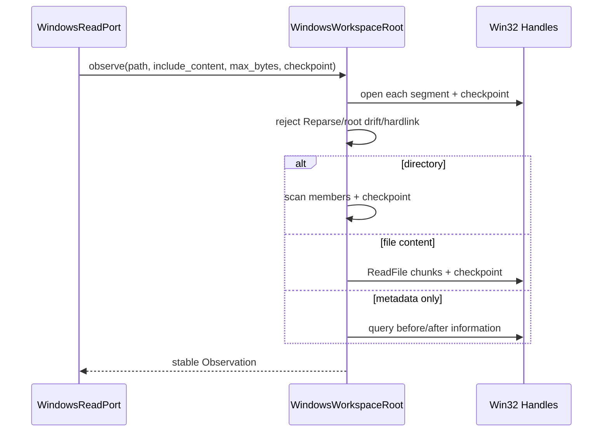

原生安全断言仍由[`tests/workspace/test_snapshot.py`](../../tests/workspace/test_snapshot.py)验证；工具合同和攻击输入分别由
[`test_windows_read_adapter.py`](../../tests/tools/test_windows_read_adapter.py)与
[`test_windows_native_runtime.py`](../../tests/tools/test_windows_native_runtime.py)验证。实现绑定`532e59b346f50657518d11225102bc6999c301e6`，真实Windows Runner结果
尚未回填，不能据本地POSIX测试提前关闭0.9.1d。

## 39. 变更记录

| 文档版本 | 代码版本 | 日期 | 变更摘要 |
|---|---|---|---|
| 3 | `532e59b346f50657518d11225102bc6999c301e6` | 2026-09-13 | 为Windows观察增加内容/上限/检查点并拆分缺失、目录、文件和块读取流程，供原生Coding Tool复用；等待CI |
| 2 | `991b6f267671f5a86870672e9c97a5fbb3991a39` | 2026-09-13 | 同步DOC-1.6公共合同漂移门禁及Windows限制；Workspace运行合同不变 |
| 1 | `8323f0fb5d0dcb95316f76b3e0fcb2140501642d` | 2026-09-12 | 建立Workspace现行模块设计，覆盖逻辑路径、选择资源Snapshot、POSIX/Windows原生端口、Secure Reader、SQLite Fencing Lease和跨模块消费边界 |
