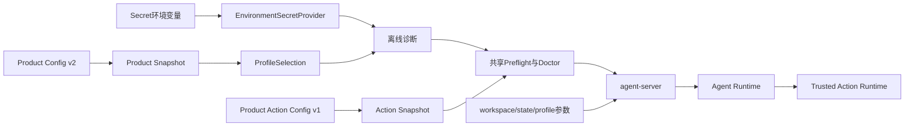
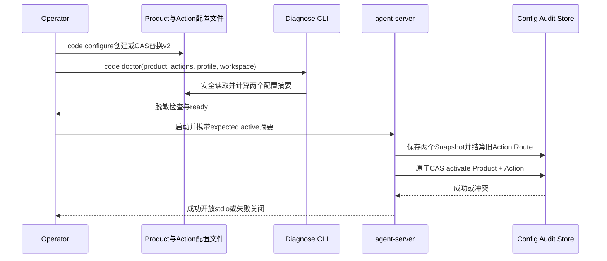

# Harnessix Code配置参考

## 1. 配置域

Harnessix Code当前有两个职责分离、在激活时原子绑定的产品配置合同：

1. `ProductConfigV2`从严格JSON文件加载Provider、模型Profile、Secret引用和请求预算；
2. `ProductActionConfigV1`从独立严格JSON文件加载Workspace Patch功能门和固定Container Process Profile；省略时使用内建Patch配置；
3. `harnessix code`解析Workspace、两个配置路径、客户端状态根、Profile、活动CAS前提和Git可执行文件；
4. `agent-server`接收显式参数并在Preflight、启动恢复和双配置原子激活后建立Agent Runtime与进程内Trusted Action Runtime。



早期`Settings`中的HTTP、Worker、Journal和OpenTelemetry环境变量只服务已删除Action服务，不再出现在
`.env.example`或正式产品运维合同中。`HARNESSIX_DATABASE_PATH`、`HARNESSIX_EXECUTION_MODE`、
`HARNESSIX_HOST`和`HARNESSIX_PORT`不得用于配置Agent Session或当前产品入口。如需读取旧数据，
必须在隔离维护环境直接调用对应模块，并以[ADR 0081](../adr/0081-single-coding-agent-product-boundary.md)的
白名单和归档规则为准。

## 2. 已退役Action服务配置

`harnessix serve`和`harnessix worker`已从顶层CLI删除，Docker镜像也不再监听8787端口。旧Action环境变量、
queued拓扑和API/Worker双进程配置不属于1.0支持范围；新增部署不得继续使用。旧库只读检查、导出和保留要求见
[归档手册](legacy-action-archive.md)，当前版本不会自动消费或删除旧SQLite/PostgreSQL Action数据。

## 4. Product Config v2

### 4.1 最小结构示例

以下示例不包含Secret值。Provider、Profile和Secret Source数组必须按各自ID或名称排序：

```json
{
  "active_profile": "primary",
  "profiles": [
    {
      "capabilities": {
        "parallel_tool_calls": true,
        "streaming_usage": true,
        "tool_calls": true
      },
      "fallback_profiles": [],
      "io_timeout_seconds": 30.0,
      "max_attempts": 2,
      "max_chunks": 10000,
      "max_frame_bytes": 262144,
      "max_output_tokens": 4096,
      "max_request_bytes": 2097152,
      "max_response_bytes": 2097152,
      "model": "example-model",
      "profile_id": "primary",
      "provider_id": "primary-provider",
      "required_capabilities": {
        "parallel_tool_calls": false,
        "streaming_usage": true,
        "tool_calls": true
      },
      "retry_delay_seconds": 0.5,
      "timeout_seconds": 120.0
    }
  ],
  "providers": [
    {
      "base_url": "https://api.example.com/v1",
      "credential": {
        "name": "primary-api-key",
        "version": "env-v1"
      },
      "kind": "openai_chat",
      "output_token_parameter": "max_completion_tokens",
      "provider_id": "primary-provider"
    }
  ],
  "secret_sources": [
    {
      "environment_variable": "MODEL_API_KEY",
      "secret": {
        "name": "primary-api-key",
        "version": "env-v1"
      }
    }
  ],
  "spec_version": "harnessix.product-config/v2"
}
```

POSIX上应执行：

```bash
chmod 600 ./private/product-config.json
export MODEL_API_KEY='<由Secret系统注入>'
```

配置只保存`SecretReference.name/version`与环境变量名。诊断和Provider构造会短暂解析值并清理`bytearray`，但Python、
供应商SDK和操作系统仍可能复制内存；“未持久化”不等于内存零暴露。

### 4.2 Provider字段

| 字段 | 约束 | 运维含义 |
|---|---|---|
| `provider_id` | 小写标识符，最长64 | 配置内稳定身份 |
| `kind` | `openai_chat`或`anthropic` | 决定SDK与协议适配器 |
| `base_url` | HTTPS URL，最长2048 | 当前配置合同不自动绑定地域、凭据账户或Egress Allowlist |
| `credential` | 精确`name/version` | Source必须存在且版本完全一致 |
| `output_token_parameter` | OpenAI可选 | Anthropic禁止配置；OpenAI默认`max_completion_tokens` |

### 4.3 Profile字段与上限

| 字段 | 默认/范围 | 语义 |
|---|---|---|
| `model` | 必填，1～256字符 | 只允许字母、数字及`_.:/-` |
| `capabilities` | Tool、并行Tool、Streaming Usage均启用 | Provider声明能力 |
| `required_capabilities` | 只强制Streaming Usage | 首选和所有Fallback必须满足 |
| `fallback_profiles` | 最多5项 | 展开后无环、无重复，链长最多6 |
| `max_output_tokens` | 4096，1～1,000,000 | 单响应输出参数 |
| `timeout_seconds` | 120，最大3600 | Provider总Timeout |
| `io_timeout_seconds` | 30，最大300 | 连接/读取Timeout |
| `max_attempts` | 2，1～5 | 单Profile尝试上限；链总和不超过32 |
| `retry_delay_seconds` | 0.5，0～10 | 尝试间延迟 |
| `max_request_bytes` | 2 MiB，最大16 MiB | 出站请求上限 |
| `max_response_bytes` | 2 MiB，最大16 MiB | 完整响应上限 |
| `max_frame_bytes` | 256 KiB，最大1 MiB | 单流分片上限 |
| `max_chunks` | 10,000，最大100,000 | 流分片数量上限 |

Safe Fallback只在首选候选没有暴露文本、Tool Call或未来未知事件，失败属于可重试的`transport`、`rate_limit`
或`provider_internal`，并且Fallback审计成功时发生。配置Fallback不等于任何错误都会自动切换。

### 4.4 Product Action Config v1

最小文件可显式关闭Patch且不提供Process：

```json
{
  "config_sha256": "5a0a445b65380e1f6e532e218096ae3bbb149a15e9e86b5ed0cece707d4048ac",
  "process_profiles": [],
  "spec_version": "harnessix.product-action-config/v1",
  "workspace_patch_enabled": false
}
```

该摘要与示例正文精确绑定；修改任一字段后必须通过项目合同构造工具重新生成。`process_profiles`最多32项，按`profile_id`排序且唯一。
每项固定以下安全边界：

| 字段 | 约束与语义 |
|---|---|
| `profile_id/version/description` | 稳定产品身份与用户可理解说明 |
| `container_engine` | 宿主绝对路径；只接受Docker或Podman身份 |
| `image` | 必须为`name@sha256:<64 hex>`且本机Repo Digest可证明 |
| `program/arguments` | 容器内绝对程序与固定argv；模型不可修改 |
| `selector_policy` | `none`或有界测试选择器；拒绝Shell操作符、绝对路径和`..` |
| `network_mode` | v1只能是`none` |
| `cpu_limit/memory_bytes/process_limit` | 必须由强Container Profile可执行地约束 |
| `timeout_seconds/max_output_bytes` | Profile级总时限和输出预算 |
| `secret_refs` | 按名称/版本排序的引用；不包含值 |
| `profile_sha256` | 以上全部字段的规范摘要 |

外部Action文件与Product Config使用相同256 KiB、严格UTF-8、深度32、节点20,000、重复键和POSIX私有文件规则。显式文件失败不会
降级为内建配置。当前没有Action配置向导或迁移命令；应基于提交的JSON Schema和合同构造函数生成，并先运行Doctor。

## 5. 严格读取与诊断

Product Config限制为256 KiB、最大深度32、最大节点20,000，拒绝重复Key、非有限数、NUL、非UTF-8、
未知字段和未知版本。POSIX上还要求目标为当前用户拥有的普通文件、硬链接数为1且Group/Other无任何权限；读取前后
对象身份和元数据发生变化时拒绝。

离线诊断命令：

```bash
uv run harnessix config diagnose \
  --config ./private/product-config.json \
  --profile primary \
  --state-database ./private/config-audit.db
```

诊断检查配置合同、Profile能力、SDK依赖、Secret版本和值格式，不发起网络请求。`ready=true`时退出0，否则退出2。
指定`--state-database`会持久化配置Snapshot，但不会保存Secret值。

## 6. Agent Server参数

| 参数 | 必填 | 语义 |
|---|---|---|
| `--config` | 是 | Product Config v2路径 |
| `--action-config` | 否 | Product Action Config v1路径；省略时使用内建Patch配置 |
| `--profile` | 否 | 覆盖`active_profile`选择，不修改源文件 |
| `--workspace` | 是 | 已存在目录；不得包含配置和状态目录 |
| `--state-directory` | 是 | 私有状态根；不得包含Workspace或被其包含 |
| `--expected-active-sha256` | 否 | 活动配置CAS的预期旧配置摘要 |
| `--expected-active-profile` | 否 | 活动配置CAS的预期旧Profile |
| `--expected-active-action-sha256` | 否 | 活动Action配置CAS的预期旧摘要 |
| `--git-executable` | 否 | 显式Git普通文件路径；不从任意配置字符串执行Shell |

Product配置变化时核对Product摘要/Profile，Action配置变化时核对Action摘要；两个指针在同一SQLite事务中切换。任一CAS冲突都
回滚双方、关闭已打开组件且不开放stdio。相同组合重复启动幂等，不要求把现值作为期望值再次提交。

### 6.1 `harnessix code`参数与优先级

```text
harnessix code [WORKSPACE] [--config PATH] [--action-config PATH] [--profile ID]
    [--state-directory PATH] [--resume THREAD_ID] [--git-executable PATH]
    [--expected-active-sha256 SHA] [--expected-active-profile ID]
    [--expected-active-action-sha256 SHA]
```

| 配置项 | 显式CLI | 环境变量 | 默认值/结果 |
|---|---|---|---|
| Workspace | 位置参数 | 无 | 当前目录；必须严格解析为已存在目录 |
| Product Config | `--config` | `HARNESSIX_PRODUCT_CONFIG` | 用户级`.harnessix/config.json` |
| Product Action Config | `--action-config` | `HARNESSIX_PRODUCT_ACTION_CONFIG` | 省略后使用版本化内建配置 |
| 客户端状态根 | `--state-directory` | `HARNESSIX_PRODUCT_STATE_DIRECTORY` | 用户级`.harnessix/workspaces/<workspace-fingerprint>` |
| Profile | `--profile` | 无 | 省略后由Product Config的`active_profile`选择 |
| 恢复Thread | `--resume UUID` | 无 | 省略后使用Client State中已保存且仍属于当前Workspace的选择 |
| Git | `--git-executable` | 无 | 省略后由`agent-server`现行组合根处理 |

优先级为“显式CLI > 对应环境变量 > 固定默认值”。客户端状态根直接保存`client-state.json`和锁文件；服务端运行状态
固定传给`<state-root>/runtime`，避免两个Schema共享同一文件命名空间。子进程命令固定使用当前`sys.executable`：

```text
python -m harnessix agent-server --config CONFIG --workspace WORKSPACE
    --state-directory STATE_ROOT/runtime [--action-config ACTIONS] [--profile ID]
    [--expected-active-sha256 SHA] [--expected-active-profile ID]
    [--expected-active-action-sha256 SHA] [--git-executable PATH]
```

CLI不接受任意Server argv，不通过Shell拼接，也不会把环境变量或Secret复制到命令行。Workspace不可用、TUI依赖缺失和
启动前产品错误均输出稳定单行JSON并退出2。

## 7. Secret与环境隔离

1. 每个Secret环境变量只能映射一个`SecretReference`；
2. Provider引用必须和Source的名称、版本完全一致；
3. 不复用Action数据库密码、Git凭据和Provider API Key；
4. 禁止设置`OPENAI_CUSTOM_HEADERS`或`ANTHROPIC_CUSTOM_HEADERS`注入额外认证，Provider Key校验会拒绝相关环境；
5. 子进程、Hook、MCP和Tool环境必须使用各自Execution Plan白名单，不继承整个宿主环境；
6. Secret轮换时先更新Secret系统，再提高配置中的版本，诊断通过后用活动CAS切换；
7. 旧进程持有的Provider Bundle不会因环境变量变化自动热更新，必须受控重启。

## 8. 配置变更流程



配置变化必须产生新的源摘要和语义摘要。优先使用`code configure`执行受锁保护的创建/替换；不要直接编辑运行中进程
已加载的文件并假设自动生效。Doctor只证明一次只读观察，Server启动时会重新校验。

## 9. 源码与测试映射

| 配置职责 | 源码 | 关键符号 | 测试 |
|---|---|---|---|
| 旧服务环境变量 | [历史Settings源码](https://github.com/carrie1988/Harnessix/blob/3f37fe8ae0646d3327254ce9677110b94f7c5e80/src/harnessix/settings.py) | 已删除，不进入当前配置合同 | [0.9.1f收敛测试](../../tests/governance/test_product_runtime_convergence.py) |
| JSON合同 | [`contracts.py`](../../src/harnessix/product_config/contracts.py) | `ProductConfigV2`、`ModelProfile`、`SecretReference` | [`test_contracts_and_codec.py`](../../tests/product_config/test_contracts_and_codec.py) |
| 安全读取 | [`codec.py`](../../src/harnessix/product_config/codec.py) | `read_product_config_bytes`、`decode_product_config_bytes` | [`test_contracts_and_codec.py`](../../tests/product_config/test_contracts_and_codec.py) |
| Action读取与合同 | [`action_codec.py`](../../src/harnessix/product_config/action_codec.py)、[`action_contracts.py`](../../src/harnessix/product_config/action_contracts.py) | `load_product_action_config`、`ProductActionConfigSnapshot` | [`test_action_config_runtime.py`](../../tests/product_config/test_action_config_runtime.py) |
| 双配置Store与恢复 | [`action_store.py`](../../src/harnessix/product_config/action_store.py)、[`action_runtime.py`](../../src/harnessix/product_config/action_runtime.py) | `SQLiteProductRuntimeConfigStore`、`ProductActionRuntimeOwner` | [`test_action_config_runtime.py`](../../tests/product_config/test_action_config_runtime.py)、[`test_action_runtime.py`](../../tests/product_config/test_action_runtime.py) |
| Secret与诊断 | [`runtime.py`](../../src/harnessix/product_config/runtime.py) | `environment_secret_provider`、`diagnose_configuration` | [`test_provider_credentials.py`](../../tests/product_config/test_provider_credentials.py) |
| 启动装配 | [`server.py`](../../src/harnessix/product_config/server.py) | `run_product_stdio` | [`test_server_and_cli.py`](../../tests/product_config/test_server_and_cli.py) |
| TUI产品组合根 | [`product_ui/cli.py`](../../src/harnessix/product_ui/cli.py) | `code_main`、`_default_config`、`_default_state_directory`、`_server_command` | [`tests/product_ui/test_cli.py`](../../tests/product_ui/test_cli.py) |

## 10. 已知限制

- Product Config只有JSON v2，没有分层Include、热加载或集中配置服务；
- Secret Source当前只有进程环境，尚无系统Keychain、Vault/KMS或云Secret Manager Provider；
- `base_url`与Credential、地域、组织和Egress策略未形成统一绑定合同；
- CLI参数、环境变量和配置没有统一优先级框架；
- `harnessix code`只为Product/Action配置路径和客户端状态根定义环境覆盖，Profile、Resume、CAS前提和Git仍要求显式参数；
- Action配置没有向导、迁移命令、热加载、集中式签名分发或保留策略；
- 当前配置没有任务级费用上限和账户账单对账字段；
- 配置审计是本地SQLite，不是远程不可抵赖审计服务。

## 11. `harnessix code configure`

最小非交互示例：

```bash
uv run harnessix code configure \
  --config "$HOME/.harnessix/config.json" \
  --provider-kind openai_chat \
  --base-url https://dashscope.aliyuncs.com/compatible-mode/v1 \
  --model qwen-plus \
  --api-key-env DASHSCOPE_API_KEY \
  --non-interactive
```

命令只接收环境变量**名称**，不会提示或读取Key值。成功输出`ConfigurationWriteReceipt` JSON，其中只有操作、旧/新Source
摘要、Config摘要、时间和Receipt摘要。默认新建；替换必须同时携带：

```bash
uv run harnessix code configure [同一组配置参数] \
  --replace \
  --expected-source-sha256 <doctor或既有收据确认的64位小写摘要> \
  --non-interactive
```

只有摘要而没有`--replace`返回`product_config_write_invalid`；只有`--replace`而没有摘要返回
`product_config_expected_digest_required`；摘要变化返回`product_config_conflict`。`product_config_commit_unknown`表示原子发布可能
已经发生，必须读取当前文件并运行Doctor，不得直接自动重试。配置父目录在POSIX必须为当前用户0700，目标与锁为0600；链接、
Junction、硬链接锁或不安全身份失败关闭。

## 12. `harnessix code doctor`与启动Preflight

```bash
export DASHSCOPE_API_KEY='由外部Secret机制注入'
uv run harnessix code doctor /absolute/workspace \
  --config "$HOME/.harnessix/config.json" \
  --action-config "$HOME/.harnessix/actions.json" \
  --state-directory "$HOME/.harnessix/workspaces/<fingerprint>" \
  --json
```

`doctor`离线检查两个配置文件、v2/v1合同、Profile、Provider SDK、Secret引用、平台只读端口、Action能力、Workspace、State、TUI及可选Git。
`--no-tui`把TUI改为Advisory，适合仅启动`agent-server`的环境。所有Required通过时退出0，否则打印完整报告并退出2。报告中
没有绝对路径、环境值、API Key或原始异常；`workspace_fingerprint`是不可逆摘要。命令不创建配置、State、数据库、Session、
Thread，不启动Transport，也不进行Provider网络请求。

直接运行`harnessix code WORKSPACE`时，同一Preflight在加载Textual、打开Client State和启动子进程前执行。子进程中的
`run_product_stdio`再次执行Preflight，并继续执行两个配置重读及摘要核对、Workspace/State隔离、Provider/Action Owner构造、旧Route恢复和原子激活CAS；不要把Doctor旧报告
作为跳过Server校验的授权材料。Windows原生当前只允许四项文件/搜索读取；显式Git返回
`product_git_platform_unsupported`。

## 12.1 默认Patch配置边界

省略外部Action文件时使用内建`workspace_patch_enabled=true/process_profiles=[]`。POSIX安全端口成立时广告
`apply_patch_batch`；Windows或缺少no-follow原语时生成`omitted/platform_not_supported`，产品仍可只读启动。显式Action文件可将
`workspace_patch_enabled`设为`false`，但切换已激活配置必须提交上一Action摘要。模型配置v2、Provider选择和Secret引用不会隐式
获得写权限字段。

Doctor中的单项省略是Advisory，不等于Runtime一定会使用旧报告。正式启动重新探测能力并构造同源Catalog；报告最多有效600秒，
Catalog安装前再次检查过期、Schema、Binding与Executor Evidence。

## 12.2 固定Process Profile配置边界

`harnessix code --action-config`与`HARNESSIX_PRODUCT_ACTION_CONFIG`均可启用固定Profile；显式CLI优先。内部
`run_product_stdio(action_config=...)`只保留给嵌入式宿主与测试，不能与`action_config_path`同时传入。

每个Profile必须固定绝对Container Engine路径、不可变镜像Digest、容器内Program、固定argv、Selector策略、无网络模式、CPU/
内存/PID/输出/超时预算及版本化Secret引用。启动探测失败时只省略对应`run_profile.<id>`；不会把同一命令降级到宿主Shell。

切换或删除旧Profile前应先确保其Route已经终态。启动恢复用上一活动Action快照重建旧Binding；旧Process仍要求原Engine、镜像、
Owner、Sandbox和Secret版本可证明。若旧`pending_approval/ready`的Binding不能由候选精确承接，或旧UNKNOWN无法完成对账，启动
失败并保持旧活动指针，不自动迁移批准或重放命令。

## 13. 0.9.1d/e5源码与测试映射

| 职责 | 源码 | 测试 |
|---|---|---|
| 草案、写入收据、预检报告 | [`product_contracts.py`](../../src/harnessix/product_config/product_contracts.py) | [`test_product_contracts.py`](../../tests/product_config/test_product_contracts.py)、[`test_schemas.py`](../../tests/product_config/test_schemas.py) |
| 原子创建与CAS替换 | [`wizard.py`](../../src/harnessix/product_config/wizard.py) | [`test_wizard.py`](../../tests/product_config/test_wizard.py) |
| 配置与环境预检 | [`preflight.py`](../../src/harnessix/product_config/preflight.py)、[`preflight_configuration.py`](../../src/harnessix/product_config/preflight_configuration.py)、[`preflight_environment.py`](../../src/harnessix/product_config/preflight_environment.py) | [`test_preflight.py`](../../tests/product_config/test_preflight.py) |
| CLI分派与无副作用边界 | [`product_ui/cli.py`](../../src/harnessix/product_ui/cli.py) | [`tests/product_ui/test_cli.py`](../../tests/product_ui/test_cli.py) |
| Server重校验 | [`server.py`](../../src/harnessix/product_config/server.py) | [`test_server_and_cli.py`](../../tests/product_config/test_server_and_cli.py) |

0.9.1d最终验证Revision `93723773676349fbfbe0ef42c26d9000cce379c8`已由
[CI 34735529084](https://github.com/carrie1988/Harnessix/actions/runs/34735529084)完成三平台及完整矩阵验收。e5配置、
Doctor、原子CAS和启动恢复绑定实现Revision `e5b7a8a4072dcb0ed4992ea94e2e0a8420f24a58`，并由
[CI 35439332019](https://github.com/carrie1988/Harnessix/actions/runs/35439332019)完成七任务全矩阵验收后关闭。
