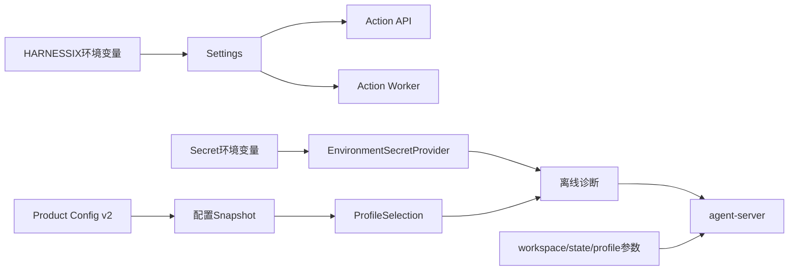
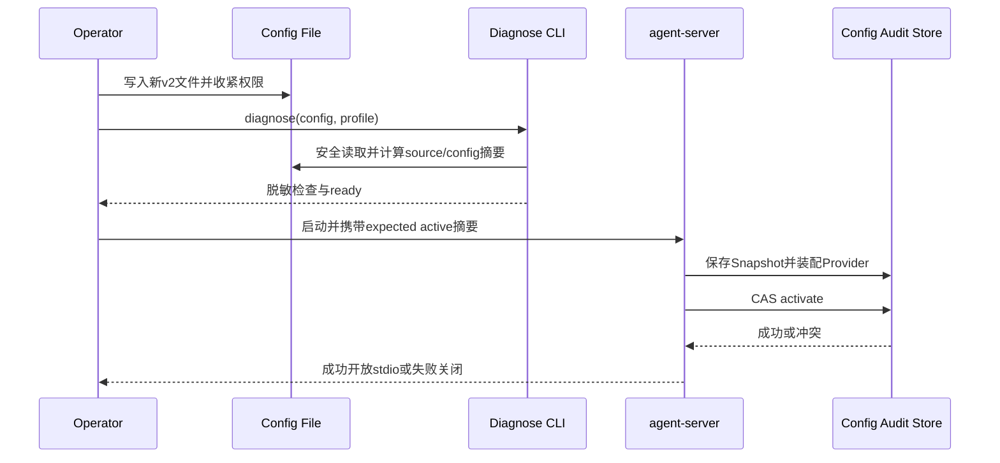

# Harnessix Code配置参考

## 1. 配置域

Harnessix当前有两套相互独立的配置入口：

1. [`Settings`](../../src/harnessix/settings.py)从`HARNESSIX_*`环境变量加载Action Plane HTTP、Worker、
   Journal、日志和OpenTelemetry设置；
2. `ProductConfigV2`从严格JSON文件加载Coding Agent的Provider、模型Profile、Secret引用和请求预算，
   `agent-server`的Workspace与状态目录继续由显式CLI参数提供；
3. `harnessix code`在产品边界解析Workspace、配置路径、客户端状态根、Profile和Git可执行文件，再以确定argv启动
   `agent-server`子进程。



三类入口不会把Action Plane Settings与Product Config自动合并。`HARNESSIX_DATABASE_PATH`不指定Agent Session路径，
Product Config也不配置Action Plane数据库。

## 2. Action Plane环境变量

| 环境变量 | 类型/默认值 | 校验与语义 |
|---|---|---|
| `HARNESSIX_DATABASE_PATH` | Path，`.harnessix/harnessix.db` | `HARNESSIX_DATABASE_URL`为空时使用SQLite |
| `HARNESSIX_DATABASE_URL` | String，空 | 非空时优先选择PostgreSQL，值不得写入日志和文档 |
| `HARNESSIX_DEMO_DATABASE_PATH` | Path，`.harnessix/demo-external.db` | `demo.issue.create`示例外部效果库，不是Journal |
| `HARNESSIX_EXECUTION_MODE` | `inline` | 只允许`inline`或`queued` |
| `HARNESSIX_HOST` | `127.0.0.1` | HTTP监听地址；当前未内置认证时保持回环 |
| `HARNESSIX_PORT` | `8787` | 使用Python `int`解析；无独立范围校验，最终由Server绑定校验 |
| `HARNESSIX_LEASE_SECONDS` | `30` | 正整数；Action执行租约 |
| `HARNESSIX_WORKER_POLL_SECONDS` | `0.5` | 正浮点数；空队列轮询 |
| `HARNESSIX_WORKER_HEARTBEAT_SECONDS` | `10` | 正浮点数且严格小于Lease |
| `HARNESSIX_RECOVERY_INTERVAL_SECONDS` | `5` | 正浮点数；Worker过期租约扫描 |
| `HARNESSIX_SERVICE_NAME` | `harnessix` | 非空；最终服务名追加`.api`或`.worker` |
| `HARNESSIX_LOG_LEVEL` | `INFO` | 由Python Logging级别名称解析 |
| `HARNESSIX_LOG_FORMAT` | `json` | 只允许`json`或`console` |
| `HARNESSIX_OTEL_ENDPOINT` | 空 | 非空时启用OTLP/HTTP；也回退读取`OTEL_EXPORTER_OTLP_ENDPOINT` |
| `HARNESSIX_OTEL_EXPORT_INTERVAL_MILLIS` | `10000` | 正整数；Metric导出周期 |

示例值见[`.env.example`](../../.env.example)。项目不会自动加载`.env`文件；宿主、Shell或编排系统必须显式注入。

### 2.1 约束关系

```text
0 < worker_heartbeat_seconds < lease_seconds
worker_poll_seconds > 0
recovery_interval_seconds > 0
otel_export_interval_millis > 0
execution_mode ∈ {inline, queued}
log_format ∈ {json, console}
```

无效字符串、整数或浮点数可能在进程启动早期直接触发`ValueError`。当前顶层CLI没有把所有`Settings`错误统一投影为
稳定JSON错误，进程管理器应把非零退出视为启动失败，不能继续接流量。

## 3. Action Plane命令覆盖

| 命令 | CLI覆盖 | 环境变量关系 |
|---|---|---|
| `harnessix serve` | `--host`、`--port`、`--database-path`、`--execution-mode` | Host/Port直接取CLI优先；数据库路径和执行模式在导入ASGI应用前写回进程环境 |
| `harnessix worker` | `--database-path`、`--once` | Path替换已加载设置；若`HARNESSIX_DATABASE_URL`非空，PostgreSQL仍优先 |
| `harnessix license` | 无 | 不加载运行配置 |

queued模式的API和Worker必须使用相同Journal后端。只给Worker传`--database-path`而API使用PostgreSQL会形成两个独立
Action域，Readiness仍可能通过但不会消费同一队列。

## 4. Product Config v2

### 4.1 最小结构示例

以下示例不包含Secret值。Provider、Profile和Secret Source数组必须按各自ID或名称排序：

```json
{
  "active_profile": "primary",
  "profiles": [
    {
      "capabilities": {
        "parallel_tool_calls": true,
        "streaming_usage": true,
        "tool_calls": true
      },
      "fallback_profiles": [],
      "io_timeout_seconds": 30.0,
      "max_attempts": 2,
      "max_chunks": 10000,
      "max_frame_bytes": 262144,
      "max_output_tokens": 4096,
      "max_request_bytes": 2097152,
      "max_response_bytes": 2097152,
      "model": "example-model",
      "profile_id": "primary",
      "provider_id": "primary-provider",
      "required_capabilities": {
        "parallel_tool_calls": false,
        "streaming_usage": true,
        "tool_calls": true
      },
      "retry_delay_seconds": 0.5,
      "timeout_seconds": 120.0
    }
  ],
  "providers": [
    {
      "base_url": "https://api.example.com/v1",
      "credential": {
        "name": "primary-api-key",
        "version": "env-v1"
      },
      "kind": "openai_chat",
      "output_token_parameter": "max_completion_tokens",
      "provider_id": "primary-provider"
    }
  ],
  "secret_sources": [
    {
      "environment_variable": "MODEL_API_KEY",
      "secret": {
        "name": "primary-api-key",
        "version": "env-v1"
      }
    }
  ],
  "spec_version": "harnessix.product-config/v2"
}
```

POSIX上应执行：

```bash
chmod 600 ./private/product-config.json
export MODEL_API_KEY='<由Secret系统注入>'
```

配置只保存`SecretReference.name/version`与环境变量名。诊断和Provider构造会短暂解析值并清理`bytearray`，但Python、
供应商SDK和操作系统仍可能复制内存；“未持久化”不等于内存零暴露。

### 4.2 Provider字段

| 字段 | 约束 | 运维含义 |
|---|---|---|
| `provider_id` | 小写标识符，最长64 | 配置内稳定身份 |
| `kind` | `openai_chat`或`anthropic` | 决定SDK与协议适配器 |
| `base_url` | HTTPS URL，最长2048 | 当前配置合同不自动绑定地域、凭据账户或Egress Allowlist |
| `credential` | 精确`name/version` | Source必须存在且版本完全一致 |
| `output_token_parameter` | OpenAI可选 | Anthropic禁止配置；OpenAI默认`max_completion_tokens` |

### 4.3 Profile字段与上限

| 字段 | 默认/范围 | 语义 |
|---|---|---|
| `model` | 必填，1～256字符 | 只允许字母、数字及`_.:/-` |
| `capabilities` | Tool、并行Tool、Streaming Usage均启用 | Provider声明能力 |
| `required_capabilities` | 只强制Streaming Usage | 首选和所有Fallback必须满足 |
| `fallback_profiles` | 最多5项 | 展开后无环、无重复，链长最多6 |
| `max_output_tokens` | 4096，1～1,000,000 | 单响应输出参数 |
| `timeout_seconds` | 120，最大3600 | Provider总Timeout |
| `io_timeout_seconds` | 30，最大300 | 连接/读取Timeout |
| `max_attempts` | 2，1～5 | 单Profile尝试上限；链总和不超过32 |
| `retry_delay_seconds` | 0.5，0～10 | 尝试间延迟 |
| `max_request_bytes` | 2 MiB，最大16 MiB | 出站请求上限 |
| `max_response_bytes` | 2 MiB，最大16 MiB | 完整响应上限 |
| `max_frame_bytes` | 256 KiB，最大1 MiB | 单流分片上限 |
| `max_chunks` | 10,000，最大100,000 | 流分片数量上限 |

Safe Fallback只在首选候选没有暴露文本、Tool Call或未来未知事件，失败属于可重试的`transport`、`rate_limit`
或`provider_internal`，并且Fallback审计成功时发生。配置Fallback不等于任何错误都会自动切换。

## 5. 严格读取与诊断

Product Config限制为256 KiB、最大深度32、最大节点20,000，拒绝重复Key、非有限数、NUL、非UTF-8、
未知字段和未知版本。POSIX上还要求目标为当前用户拥有的普通文件、硬链接数为1且Group/Other无任何权限；读取前后
对象身份和元数据发生变化时拒绝。

离线诊断命令：

```bash
uv run harnessix config diagnose \
  --config ./private/product-config.json \
  --profile primary \
  --state-database ./private/config-audit.db
```

诊断检查配置合同、Profile能力、SDK依赖、Secret版本和值格式，不发起网络请求。`ready=true`时退出0，否则退出2。
指定`--state-database`会持久化配置Snapshot，但不会保存Secret值。

## 6. Agent Server参数

| 参数 | 必填 | 语义 |
|---|---|---|
| `--config` | 是 | Product Config v2路径 |
| `--profile` | 否 | 覆盖`active_profile`选择，不修改源文件 |
| `--workspace` | 是 | 已存在目录；不得包含配置和状态目录 |
| `--state-directory` | 是 | 私有状态根；不得包含Workspace或被其包含 |
| `--expected-active-sha256` | 否 | 活动配置CAS的预期旧配置摘要 |
| `--expected-active-profile` | 否 | 活动配置CAS的预期旧Profile |
| `--git-executable` | 否 | 显式Git普通文件路径；不从任意配置字符串执行Shell |

若同时指定两个`expected-active-*`字段，启动只在活动指针与预期一致时切换；CAS冲突会关闭已打开组件且不开放stdio。

### 6.1 `harnessix code`参数与优先级

```text
harnessix code [WORKSPACE] [--config PATH] [--profile ID]
    [--state-directory PATH] [--resume THREAD_ID] [--git-executable PATH]
```

| 配置项 | 显式CLI | 环境变量 | 默认值/结果 |
|---|---|---|---|
| Workspace | 位置参数 | 无 | 当前目录；必须严格解析为已存在目录 |
| Product Config | `--config` | `HARNESSIX_PRODUCT_CONFIG` | 用户级`.harnessix/config.json` |
| 客户端状态根 | `--state-directory` | `HARNESSIX_PRODUCT_STATE_DIRECTORY` | 用户级`.harnessix/workspaces/<workspace-fingerprint>` |
| Profile | `--profile` | 无 | 省略后由Product Config的`active_profile`选择 |
| 恢复Thread | `--resume UUID` | 无 | 省略后使用Client State中已保存且仍属于当前Workspace的选择 |
| Git | `--git-executable` | 无 | 省略后由`agent-server`现行组合根处理 |

优先级为“显式CLI > 对应环境变量 > 固定默认值”。客户端状态根直接保存`client-state.json`和锁文件；服务端运行状态
固定传给`<state-root>/runtime`，避免两个Schema共享同一文件命名空间。子进程命令固定使用当前`sys.executable`：

```text
python -m harnessix agent-server --config CONFIG --workspace WORKSPACE
    --state-directory STATE_ROOT/runtime [--profile ID] [--git-executable PATH]
```

CLI不接受任意Server argv，不通过Shell拼接，也不会把环境变量或Secret复制到命令行。Workspace不可用、TUI依赖缺失和
启动前产品错误均输出稳定单行JSON并退出2。

## 7. Secret与环境隔离

1. 每个Secret环境变量只能映射一个`SecretReference`；
2. Provider引用必须和Source的名称、版本完全一致；
3. 不复用Action数据库密码、Git凭据和Provider API Key；
4. 禁止设置`OPENAI_CUSTOM_HEADERS`或`ANTHROPIC_CUSTOM_HEADERS`注入额外认证，Provider Key校验会拒绝相关环境；
5. 子进程、Hook、MCP和Tool环境必须使用各自Execution Plan白名单，不继承整个宿主环境；
6. Secret轮换时先更新Secret系统，再提高配置中的版本，诊断通过后用活动CAS切换；
7. 旧进程持有的Provider Bundle不会因环境变量变化自动热更新，必须受控重启。

## 8. 配置变更流程



配置变化必须产生新的源摘要和语义摘要。不要直接编辑运行中进程已加载的文件并假设自动生效。

## 9. 源码与测试映射

| 配置职责 | 源码 | 关键符号 | 测试 |
|---|---|---|---|
| 进程设置 | [`settings.py`](../../src/harnessix/settings.py) | `Settings.from_environment`、`__post_init__` | [`test_api.py`](../../tests/integration/test_api.py)、[`test_worker.py`](../../tests/integration/test_worker.py) |
| JSON合同 | [`contracts.py`](../../src/harnessix/product_config/contracts.py) | `ProductConfigV2`、`ModelProfile`、`SecretReference` | [`test_contracts_and_codec.py`](../../tests/product_config/test_contracts_and_codec.py) |
| 安全读取 | [`codec.py`](../../src/harnessix/product_config/codec.py) | `read_product_config_bytes`、`decode_product_config_bytes` | [`test_contracts_and_codec.py`](../../tests/product_config/test_contracts_and_codec.py) |
| Secret与诊断 | [`runtime.py`](../../src/harnessix/product_config/runtime.py) | `environment_secret_provider`、`diagnose_configuration` | [`test_provider_credentials.py`](../../tests/product_config/test_provider_credentials.py) |
| 启动装配 | [`server.py`](../../src/harnessix/product_config/server.py) | `run_product_stdio` | [`test_server_and_cli.py`](../../tests/product_config/test_server_and_cli.py) |
| TUI产品组合根 | [`product_ui/cli.py`](../../src/harnessix/product_ui/cli.py) | `code_main`、`_default_config`、`_default_state_directory`、`_server_command` | [`tests/product_ui/test_cli.py`](../../tests/product_ui/test_cli.py) |

## 10. 已知限制

- Product Config只有JSON v2，没有分层Include、热加载或集中配置服务；
- Secret Source当前只有进程环境，尚无系统Keychain、Vault/KMS或云Secret Manager Provider；
- `base_url`与Credential、地域、组织和Egress策略未形成统一绑定合同；
- Action Plane `Settings`缺少统一脱敏诊断命令和部分范围校验；
- CLI参数、环境变量和配置没有统一优先级框架；
- `harnessix code`只为配置路径和客户端状态根定义环境覆盖，Profile、Resume和Git仍要求显式参数；
- 当前配置没有任务级费用上限和账户账单对账字段；
- 配置审计是本地SQLite，不是远程不可抵赖审计服务。
