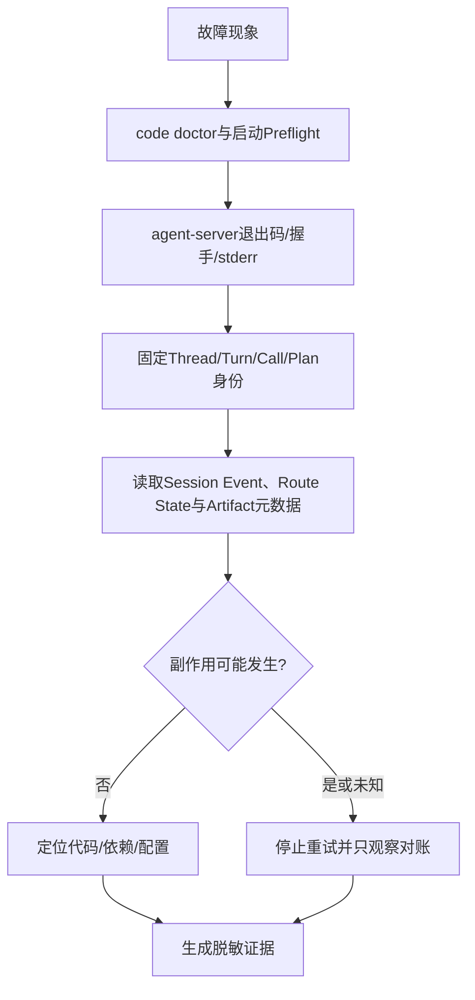

# Harnessix Code诊断与可观测性

## 1. 诊断目标

诊断应回答“哪个部署面、哪个持久身份、哪个状态边界、哪类失败、是否可能发生外部效果”，而不是只收集进程日志。
Journal、Session Event和专用账本是业务事实；Log、Trace和Metric用于关联与告警，丢失时不得改变领域结果。

当前产品以Product Config离线诊断、启动Preflight、Agent Protocol握手、Session事件和Product UI状态为诊断主链。Product UI状态行显示连接代际、Turn、Token、费用未知原因、待决交互和稳定Notice，并通过`F1`提供静态脱敏错误自助。
Coding Agent产品入口已有共享的离线`harnessix code doctor`和Startup Preflight；自动支持包与完整观测装配尚未实现。

## 2. 诊断顺序



先固定身份和持久状态，再扩大日志范围。不要通过提高日志级别把Prompt、Tool参数、Workspace内容或Secret写入公共日志。

## 3. 运行可用性信号

独立Action HTTP Health/Readiness已随`serve/worker`产品入口撤销。Coding Agent当前使用以下信号：

| 信号 | 成功含义 | 不能证明 |
|---|---|---|
| `harnessix code doctor --json` | 配置、依赖、Workspace、状态目录和平台端口的离线瞬时检查通过 | Provider账户、网络、后续文件漂移或真实任务成功 |
| Agent Protocol握手 | stdio帧、版本和服务初始化成功 | 模型、全部Tool或外部系统可用 |
| 启动Preflight | 启动时重新验证必要能力 | 长时间运行稳定性 |
| Session/Route持久事件 | 指定身份的最后已提交业务事实 | 外部效果在缺少Receipt时一定成功或失败 |

不得继续使用`/healthz`、`/readyz`或8787端口作为Harnessix Code产品探针。正式服务化探针如未来需要，必须围绕
Agent Server的身份、Session和Trusted Action能力重新设计。

## 4. Product Config离线诊断

```bash
uv run harnessix config diagnose \
  --config ./private/product-config.json \
  --profile primary \
  --state-database ./private/state/product-config.db
```

输出是稳定JSON `ConfigurationDiagnosticReport`，包含配置/选择摘要、选中Profile、`ready`、排序后的检查和报告摘要。
检查范围：

| Scope | 代码 | 解释 |
|---|---|---|
| `config` | `config_contract_valid` | 严格v2合同已解析 |
| `profile` | `config_capabilities_satisfied` | 候选满足首选所需能力 |
| `dependency` | `config_dependency_available` | 对应Python SDK可导入 |
| `secret` | `config_secret_version_available` | Secret名称、版本和值存在 |
| `provider` | `config_provider_auth_usable` | Key可按ASCII及Header注入规则使用 |

诊断不联网、不校验Provider账户、模型存在性、地域、额度、价格或Egress。`ready=false`退出2；内部或合同错误也退出2，
错误JSON写stderr且不回显原配置和Secret。

### 4.1 产品级Doctor

```bash
uv run harnessix code doctor /absolute/workspace --config /absolute/config.json --json
```

`ProductPreflightReport`在上述配置诊断之外检查配置文件/v2合同、Profile、平台读取端口、Workspace、State、TUI和可选Git。
Required全部通过退出0，否则退出2并保留独立检查结果；前置失败只跳过其依赖项。报告只有稳定代码、修复动作ID、摘要、
Profile和脱敏Workspace指纹，不含绝对路径、环境值或原始异常。Doctor离线只读，不创建状态目录、数据库、Session或网络请求。
它只代表一次瞬时观察，不能替代`agent-server`启动时的重新校验。

## 5. 结构化日志与Telemetry

`agent-server`的stdout由stdio协议独占，启动错误以脱敏JSON写stderr。运行日志只允许稳定错误码、Thread/Turn/Call/Plan
身份、摘要和低基数属性；不得记录Prompt、Tool参数、Diff正文、Workspace绝对路径、Secret或Provider原始响应。

Agent Telemetry通过[`agent/telemetry.py`](../../src/harnessix/agent/telemetry.py)隔离观测失败，但默认产品尚未把完整
OpenTelemetry Exporter、Dashboard和告警策略装配到启动链。这是0.9.3/0.9.4发布阻断项，不能通过旧Action API/Worker的
OTLP实现外推为当前产品能力。

## 6. Trusted Action状态诊断

从Thread Replay定位`call_id`和`plan_id`，再读取Route State、审批指纹、执行状态、Receipt和Artifact元数据。
如果状态为`unknown`或`reconciling`，只允许调用已注册Executor的Reconcile观察路径，不得重新执行原始效果。诊断记录
不得包含Action输入、完整Diff或外部响应正文。旧Action HTTP查询端点不再是受支持诊断入口。

## 7. 旧Action观测兼容边界

旧HTTP Span、Worker Metric、Queue Gauge和8787端点只存在于待删除兼容源码及历史测试中。它们不得写入当前部署清单、
健康探针或SLO。读取旧数据库时应停写、制作备份，并按迁移文档核对Action ID、事件序号和Receipt；不得重新启动
公开HTTP/Worker拓扑来完成日常诊断。

## 8. 告警建议与当前边界

以下是待0.9容量/Soak校准的信号，不是已承诺SLO：

| 信号 | 应关注的变化 | 响应 |
|---|---|---|
| Startup/握手失败 | 连续出现 | 检查Preflight、stderr稳定码、配置和状态Owner |
| Route unknown/reconciling | 非零持续或突增 | 停止自动重试，启动只观察对账 |
| Reconcile error/unknown | 持续增长 | 检查外部查询契约和凭据，不重发效果 |
| Provider Attempt/Usage异常 | Usage缺失或尝试激增 | 停止费用扩大，检查流式协议与Fallback |
| Agent interrupted | 重启后集中出现 | 检查宿主稳定性与显式Resume策略 |

没有经过负载基线，本文不提供固定数值阈值。正式阈值必须绑定版本、硬件、后端、并发和任务集。

## 9. 常见错误分诊

| 错误/现象 | 直接含义 | 下一步 |
|---|---|---|
| `runtime_busy` | Session已有Runtime Owner | 查找原进程，不删除Lock绕过 |
| `schema_too_new` | 数据由更高版本创建 | 启动正确版本或恢复备份 |
| `migration_changed` | 已应用Session Migration字节变化 | 隔离制品并审计供应链 |
| `database_corrupt` | SQLite quick check失败 | 停写并恢复已验证备份 |
| `product_config_permissions` | POSIX配置文件身份/Mode/硬链接不安全 | 恢复Owner、`0600`和单链接普通文件 |
| `product_config_diagnostic_failed` | 至少一个离线检查失败 | 读取脱敏诊断报告 |
| `product_state_overlap` | 状态目录与Workspace重叠 | 移动状态目录，不用Symlink绕过 |
| `product_tools_platform_unsupported` | 未知平台或原生读取端口不可用 | 使用已验证的POSIX/Windows宿主并检查系统能力 |
| `UNKNOWN` | 外部效果无法证明 | 调用专用Reconcile或人工处理 |
| stdio无输出 | 可能未完成握手、进程退出或stdout污染 | 检查stderr JSON、argv和协议帧，不发送Shell文本 |

### 9.1 Product UI错误自助

`F1`打开的帮助只来自[`error_help.py`](../../src/harnessix/product_ui/error_help.py)静态目录，包含标题、原因、影响、
恢复动作和本文锚点。未知错误码、路径和异常正文不会回显，而是统一映射为`product_internal_failure`。

| 稳定码或分组 | 直接含义 | 命令与恢复结论 |
|---|---|---|
| `approval_stale` | Turn、Call、Approval或Fingerprint已变化 | 决定未发送且不分配Command ID；刷新后重开 |
| `approval_evidence_required` | 完整Diff尚未通过 | Approve禁用，Reject可用；重读证据或拒绝 |
| `question_stale`/`question_answer_invalid` | 问题已变化，或回答为空/超限 | 回答未发送；按当前问题修正 |
| `turn_control_stale`/`steering_invalid` | Turn状态或Steer正文不再有效 | Cancel/Steer未发送；刷新状态 |
| `diff_unavailable` | Artifact能力缺失或批量Diff引用缺失 | 不允许盲批；升级服务、重试或Reject |
| `artifact_reference_changed` | 分页引用与审批绑定不同 | 证据作废；重新读取并检查服务端 |
| `artifact_pagination_stalled` | offset重复、不连续或超过50页 | 读取停止；禁止Approve |
| `artifact_integrity_failed` | 记录、UTF-8字节或SHA-256不符 | Diff不可信；拒绝并检查Artifact链路 |
| `artifact_read_timeout` | 5秒绝对时限内未完整读取 | 未产生领域命令；重试或Reject |
| 连接错误分组 | 当前连接代际不可继续 | 不盲重放；`Ctrl+R`后从Replay确认 |
| `product_internal_failure` | 未命中可公开稳定分类 | 不推断业务结果；重启并采集白名单诊断 |

## 9.1 Workspace Patch错误分诊

| 稳定错误/状态 | 含义 | 处置 |
|---|---|---|
| `platform_not_supported` | 平台缺少受支持的POSIX no-follow写语义 | 保持只读；不得用Shell或普通Path API绕过 |
| `delivery_action_mismatch` / `delivery_request_conflict` | Route、规范资源、Snapshot或既有事务身份不一致 | 不覆盖旧事务；重新读取Workspace并创建新调用 |
| `execution_plan_stale` | 审批前后Workspace来源发生变化 | 无文件效果；废弃原批准并生成新提案 |
| `artifact_conflict` / `artifact_not_found` | Review正文/身份冲突，或当前Call尚未授权引用 | 禁止批准；重新Replay并核对Session事实 |
| `delivery_source_changed` | 成员写入前观察不再等于before | 停止写入并人工审查外部修改 |
| `delivery_partial_effect` | 已形成严格after前缀和before后缀 | 人工审查并决定补齐或回退；系统不会自动续写 |
| Action `unknown` | 取消、失租或崩溃后无法证明效果 | 只允许Reconcile观察，不再次执行 |

诊断记录只能保存Plan/Transaction/Artifact摘要、成员数量、游标、状态和稳定错误码；不得保存Patch正文、完整Diff、Workspace绝对路径或原始异常。e5之前没有启动全局恢复报告，发现旧`running/reconciling` Route时必须保留全部State文件用于对账。

## 10. 证据采集与脱敏

允许保存：代码Revision、依赖版本、平台、时间、稳定错误码、状态枚举、事件类型、摘要、请求次数、Token/费用聚合、
Trace/Span ID和白名单Metric。默认禁止保存：API Key、Authorization Header、数据库URL、用户Prompt、模型正文、
Workspace绝对路径、文件内容、Tool参数/输出、私有Session和供应商原始响应。

诊断包尚未实现。人工采集必须先形成字段白名单，再读取源数据；不能先打包整个状态目录后再尝试删除敏感内容。

## 11. 源码与测试映射

| 诊断能力 | 源码 | 测试 |
|---|---|---|
| 配置诊断 | [`product_config/runtime.py`](../../src/harnessix/product_config/runtime.py)的`diagnose_configuration` | [`test_server_and_cli.py`](../../tests/product_config/test_server_and_cli.py) |
| 产品Doctor/Preflight | [`product_config/preflight.py`](../../src/harnessix/product_config/preflight.py)、[`product_ui/cli.py`](../../src/harnessix/product_ui/cli.py) | [`test_preflight.py`](../../tests/product_config/test_preflight.py)、[`tests/product_ui/test_cli.py`](../../tests/product_ui/test_cli.py) |
| Agent Telemetry | [`agent/telemetry.py`](../../src/harnessix/agent/telemetry.py) | [`test_telemetry.py`](../../tests/agent/test_telemetry.py) |
| Product UI错误自助 | [`product_ui/error_help.py`](../../src/harnessix/product_ui/error_help.py)、[`product_ui/main_view.py`](../../src/harnessix/product_ui/main_view.py) | [`test_interaction_screens.py`](../../tests/product_ui/test_interaction_screens.py)、[`test_app_interactions.py`](../../tests/product_ui/test_app_interactions.py) |

## 12. 已知限制

统一Agent产品观测装配、支持包Schema、数据保留策略、Dashboard、告警规则、SLO、Metric单位修复、高基数硬限制、
异常正文统一脱敏和Observability失败完全隔离仍未完成。Doctor是离线启动诊断，不等价于运行期Telemetry或支持包。部署时应把这些缺口作为发布阻断项，而不是
通过外部Collector存在来宣称可观测性已经生产完备。
