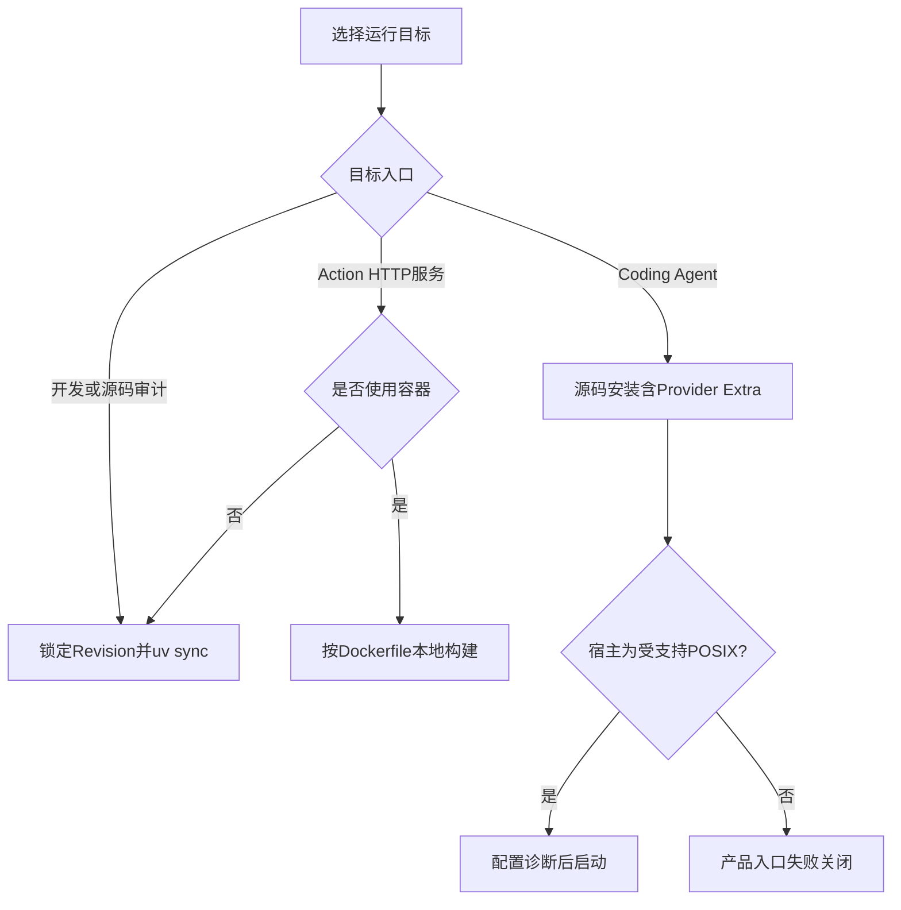

# Harnessix Code安装与制品

## 1. 适用范围

本文描述代码Revision `ef36a7cebba5a4b50e2fb19055dcb3940363034f`可验证的源码安装、开发环境、
本地Wheel和Action Plane容器路径。仓库尚未发布正式PyPI包、平台安装器、自动更新器或签名制品，因此本文不把
“可以从源码运行”表述为“产品已经完成安装交付”。

## 2. 前置条件

| 依赖 | 最低要求 | 用途 | 强制范围 |
|---|---|---|---|
| Python | 3.12 | Runtime与CLI | 全部 |
| `uv` | 能解析当前`uv.lock`的版本 | 锁定依赖、开发命令和构建 | 推荐源码工作流 |
| Git | 当前系统可用版本 | 获取源码；Coding Tool的Git能力 | 源码安装必需，Agent Git能力按需 |
| Docker兼容后端 | 能拉取固定镜像并运行非Root容器 | Action Plane镜像和Container Sandbox | 可选 |
| PostgreSQL | 17为当前CI基线 | 多Worker共享Action Journal | queued生产拓扑 |
| Provider SDK | `openai`或`anthropic`可选依赖 | `agent-server`模型调用 | 按Product Config选择 |

Python约束来自[`pyproject.toml`](../../pyproject.toml)的`requires-python = ">=3.12"`。Python 3.12/3.13、
macOS、Windows和后端测试矩阵不等于所有平台的完整产品支持，详见[平台矩阵](platforms.md)。

## 3. 安装路径决策



当前没有可直接下载的官方二进制。任何第三方Wheel、镜像或安装脚本必须单独核对来源、Revision、许可证和摘要。

## 4. 源码开发安装

### 4.1 固定Revision

```bash
git clone https://github.com/carrie1988/Harnessix.git
cd Harnessix
git checkout <经过评审的40位提交>
```

正式部署不得直接追踪可移动的`main`。应记录提交、`uv.lock`摘要、Python版本和构建主机。

### 4.2 锁定全部依赖

```bash
uv sync --locked --all-extras --dev
```

`--locked`确保解析结果与[`uv.lock`](../../uv.lock)一致；`--all-extras`安装OpenAI、Anthropic、
OpenTelemetry和LangGraph可选依赖；`--dev`安装测试和静态检查工具。仅运行某一入口时可以安装更小依赖集，
但对应环境必须单独验收，不能借用全量开发环境结论。

### 4.3 安装后验收

```bash
uv run harnessix --help
uv run harnessix license
uv run python -c 'import harnessix; print(harnessix.__file__)'
make spec
make check
```

验收必须确认命令解析、许可证文本、导入位置、生成规格无漂移和全量门禁均成功。`harnessix --help`成功只证明
CLI可导入，不证明Provider、数据库、Workspace或Sandbox可用。

## 5. 本地Wheel

构建系统由Hatchling声明，Wheel只包含`src/harnessix`包：

```bash
uv build --wheel
```

本地Wheel用于独立环境升级/兼容测试时，应在全新虚拟环境安装并记录文件摘要：

```bash
python -m venv ./wheel-verify
./wheel-verify/bin/python -m pip install ./dist/harnessix-0.1.0-py3-none-any.whl
./wheel-verify/bin/harnessix --help
```

Windows将第二、三行替换为虚拟环境的`Scripts`路径。基础Wheel不自动安装模型Provider、Observability或
LangGraph Extras；验收某项能力时必须显式安装相应Extra，并确认依赖解析没有越过项目上限。

### 5.1 Wheel边界

- 当前包版本为`0.1.0`，尚未与路线图0.9完成度建立正式发布映射；
- 没有Release签名、来源证明、SBOM或可复现构建声明；
- 没有PyPI发布证据；
- Wheel不携带外部`git`、搜索工具、容器后端或Provider凭据；
- Python Wheel可安装不等于Windows Coding Agent产品入口可运行。

## 6. Action Plane容器

### 6.1 构建

```bash
docker build --pull --tag harnessix:<revision> .
```

[`Dockerfile`](../../Dockerfile)基于`python:3.12-slim`，创建UID 10001的非Root用户，安装基础依赖和
`observability` Extra，把`/data`声明为Volume，并默认执行`harnessix serve`。

### 6.2 本地SQLite启动

```bash
docker run --rm \
  --name harnessix-action-plane \
  --publish 127.0.0.1:8787:8787 \
  --volume harnessix-data:/data \
  harnessix:<revision>
```

只发布到回环地址。当前HTTP API没有应用内认证和TLS，不得把`8787`直接发布到公网。

### 6.3 queued启动边界

API和Worker必须使用相同`HARNESSIX_DATABASE_URL`及`HARNESSIX_EXECUTION_MODE=queued`。数据库凭据通过
编排平台Secret注入，不放入镜像层、Compose文件或命令历史。Worker可通过覆盖容器命令启动：

```bash
docker run --rm \
  --env HARNESSIX_EXECUTION_MODE=queued \
  --env HARNESSIX_DATABASE_URL \
  harnessix:<revision> worker
```

当前镜像不包含OpenAI/Anthropic Extra，也没有内置Agent Workspace、Git或完整Container Sandbox装配，
不能作为`agent-server`正式镜像。

## 7. 目录与权限

| 对象 | 建议位置 | POSIX权限 | 禁止事项 |
|---|---|---|---|
| 源码Checkout | 只读或受控构建目录 | 按构建用户 | 与运行状态混放 |
| Action SQLite | 专用持久卷 | 目录`0700`、文件最小权限 | 网络文件系统、多主机并发共享 |
| Product Config | Workspace外私有目录 | 文件`0600` | Symlink、多硬链接、组/其他可读 |
| Agent状态目录 | Workspace外私有目录 | 目录`0700` | 与Workspace互相包含 |
| Workspace | 独立用户仓库 | 由仓库所有者控制 | 存放Provider Secret或状态数据库 |

产品入口会在POSIX校验Product Config和状态目录，但Action Plane通用SQLite路径没有同等级的Owner/Mode入口校验；
部署层必须补足文件系统权限和运行用户隔离。

## 8. 更新与卸载

更新前先按[升级与回退](upgrade-and-rollback.md)建立一致备份并完成目标Revision兼容检查。源码环境更新不得直接
`git pull && uv sync`覆盖正在运行的进程；应构建新环境、停流量、停止旧进程、迁移副本数据、验收后再切换。

卸载程序不等于删除状态。清理前必须区分源码/虚拟环境、Action Journal、Agent Session、配置审计、Workspace和
外部效果系统。没有经过保留期与审计批准，不得删除Journal、Session或验证证据。

## 9. 安装验收矩阵

| 场景 | 必须执行 | 通过标准 |
|---|---|---|
| 源码开发 | `uv sync --locked --all-extras --dev`、`make check` | 锁定依赖、静态检查和全量测试通过 |
| 基础Wheel | 全新环境安装、`harnessix --help`、`license` | 不依赖源码目录也能导入和运行命令 |
| Provider Wheel | 安装目标Extra、`config diagnose` | SDK、Secret引用和Profile能力通过 |
| 容器 | 非Root身份、持久卷、Health/Readiness | 重启后状态保留，端口只按预期暴露 |
| 升级 | 旧版本建库、新版本迁移、重开、旧Reader拒绝 | 旧字节和失败语义符合合同 |
| 平台 | 对应CI与原生Dogfooding | 文件、进程、终端、Git和取消矩阵通过 |

## 10. 源码与测试映射

| 设计元素 | 源码 | 验证 |
|---|---|---|
| 包与Extra | [`pyproject.toml`](../../pyproject.toml) | [`tests/governance/test_repository_policy.py`](../../tests/governance/test_repository_policy.py) |
| 锁定依赖 | [`uv.lock`](../../uv.lock) | [CI workflow](../../.github/workflows/ci.yml) |
| CLI入口 | [`src/harnessix/cli.py`](../../src/harnessix/cli.py)的`main` | [`tests/unit/test_cli_license.py`](../../tests/unit/test_cli_license.py) |
| 产品启动 | [`src/harnessix/product_config/server.py`](../../src/harnessix/product_config/server.py)的`run_product_stdio` | [`tests/product_config/test_server_and_cli.py`](../../tests/product_config/test_server_and_cli.py) |
| 镜像 | [`Dockerfile`](../../Dockerfile) | [`tests/integration/test_api.py`](../../tests/integration/test_api.py) |

## 11. 未完成的制品治理

0.9后续必须补齐三平台正式安装器、版本通道、升级/回退编排、签名与验证、SBOM、来源证明、恶意依赖扫描、
离线安装策略和自动更新失败恢复。在这些门禁关闭前，源码安装和本地Wheel只用于开发、审计和受控候选验证。
