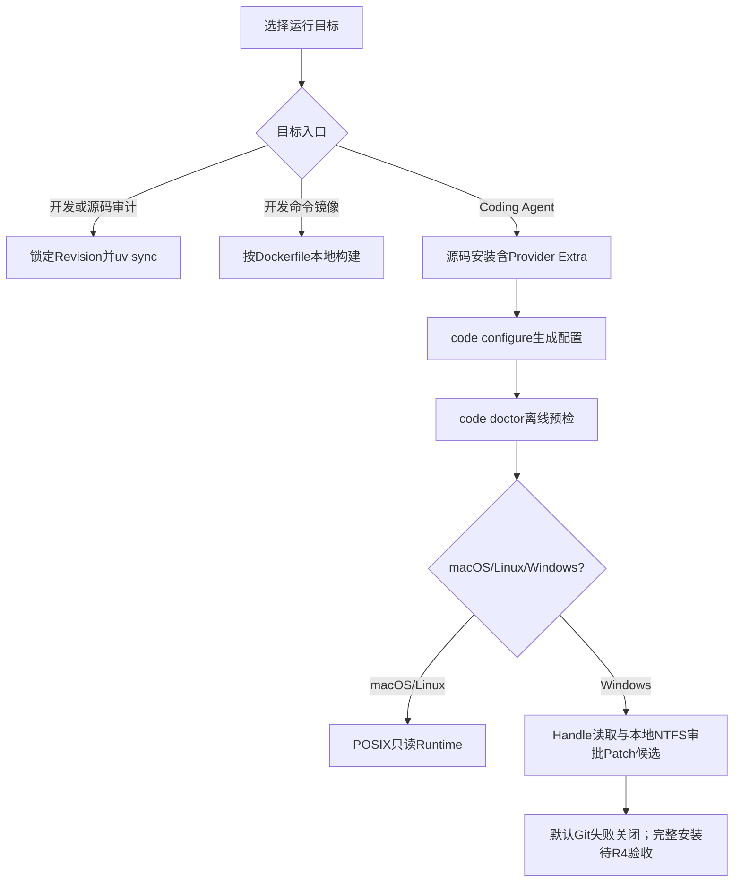

# Harnessix Code安装与制品

## 1. 适用范围

本文描述当前源码安装、开发环境、本地Wheel和开发命令镜像。独立Action HTTP/Worker容器已按ADR 0081退出产品边界。0.9.1b～d的产品入口、Configure、Doctor与Windows原生只读链已有对应全矩阵CI证据。仓库尚未发布正式PyPI包、平台安装器、自动更新器或签名制品，因此本文不把
“可以从源码运行”表述为“产品已经完成安装交付”。
后继Windows本地NTFS审批写入端口及专项已实现，见[验证报告](../validation/windows-native-file-transactions-2026-09-28-v1/README.md)；
这不是消费者目标OS、脱离源码安装、升级及独立Beta完成的证明。

## 2. 前置条件

| 依赖 | 最低要求 | 用途 | 强制范围 |
|---|---|---|---|
| Python | 3.12 | Runtime与CLI | 全部 |
| `uv` | 能解析当前`uv.lock`的版本 | 锁定依赖、开发命令和构建 | 推荐源码工作流 |
| Git | 当前系统可用版本 | 获取源码；Coding Tool的Git能力 | 源码安装必需，Agent Git能力按需 |
| Docker兼容后端 | 能拉取固定镜像并运行非Root容器 | Container Sandbox与开发命令镜像 | 可选 |
| PostgreSQL | 17为兼容回归基线 | 旧Action数据迁移测试 | 产品运行不需要 |
| Provider SDK | `openai`或`anthropic`可选依赖 | `agent-server`模型调用 | 按Product Config选择 |
| Textual | `>=8.2,<9`，当前锁定8.2.8 | `harnessix code`全屏终端 | `tui` Extra |

Python约束来自[`pyproject.toml`](../../pyproject.toml)的`requires-python = ">=3.12"`。Python 3.12/3.13、
macOS、Windows和后端测试矩阵不等于所有平台的完整产品支持，详见[平台矩阵](platforms.md)。

## 3. 安装路径决策


```mermaid
flowchart TD
    Start[选择运行目标] --> Product{目标入口}
    Product -- 开发或源码审计 --> Source[锁定Revision并uv sync]
    Product -- 开发命令镜像 --> Image[按Dockerfile本地构建]
    Product -- Coding Agent --> Agent[源码安装含Provider Extra]
    Agent --> Configure[code configure生成配置]
    Configure --> Diagnose[code doctor离线预检]
    Diagnose --> Platform{macOS/Linux/Windows?}
    Platform -- macOS/Linux --> Posix[POSIX只读Runtime]
    Platform -- Windows --> Win[Handle读取与本地NTFS审批Patch候选]
    Win --> GitGate[默认Git失败关闭；完整安装待R4验收]
```

当前没有可直接下载的官方二进制。任何第三方Wheel、镜像或安装脚本必须单独核对来源、Revision、许可证和摘要。

## 4. 源码开发安装

### 4.1 固定Revision

```bash
git clone https://github.com/carrie1988/Harnessix.git
cd Harnessix
git checkout <经过评审的40位提交>
```

正式部署不得直接追踪可移动的`main`。应记录提交、`uv.lock`摘要、Python版本和构建主机。

### 4.2 锁定全部依赖

```bash
uv sync --locked --all-extras --dev
```

`--locked`确保解析结果与[`uv.lock`](../../uv.lock)一致；`--all-extras`安装OpenAI、Anthropic、
OpenTelemetry、旧兼容Action依赖和Textual可选依赖；`--dev`安装测试和静态检查工具。仅运行某一入口时可以安装更小依赖集，
但对应环境必须单独验收，不能借用全量开发环境结论。

仅验证终端入口时，在构建好的Wheel或源码包上显式安装`tui`以及目标Provider Extra：

```bash
python -m pip install 'harnessix[tui,openai]'
harnessix code /srv/project --config /srv/harnessix-private/config.json
```

基础Wheel不会隐式安装Textual。缺少Extra时`harnessix code`输出稳定`tui_dependency_missing` JSON并退出2，不会
运行时联网下载。上述命令只说明入口和依赖关系；当前没有PyPI发布证据，应使用本地Wheel或锁定源码安装。

### 4.3 安装后验收

```bash
uv run harnessix --help
uv run harnessix code --help
uv run harnessix code doctor --help
uv run harnessix code configure --help
uv run harnessix license
uv run python -c 'import harnessix; print(harnessix.__file__)'
make spec
make check
```

验收必须确认命令解析、许可证文本、导入位置、生成规格无漂移和全量门禁均成功。`harnessix --help`成功只证明
CLI可导入，不证明Provider、数据库、Workspace或Sandbox可用。

## 5. 本地Wheel

构建系统由Hatchling声明，Wheel只包含`src/harnessix`包：

```bash
uv build --wheel
```

本地Wheel用于独立环境升级/兼容测试时，应在全新虚拟环境安装并记录文件摘要：

```bash
python -m venv ./wheel-verify
./wheel-verify/bin/python -m pip install ./dist/harnessix-0.1.0-py3-none-any.whl
./wheel-verify/bin/harnessix --help
```

Windows将第二、三行替换为虚拟环境的`Scripts`路径。基础Wheel不自动安装模型Provider、Observability、
旧兼容Action或TUI Extras；验收某项能力时必须显式安装相应Extra，并确认依赖解析没有越过项目上限。

### 5.1 Wheel边界

- 当前包版本为`0.1.0`，尚未与路线图0.9完成度建立正式发布映射；
- 没有Release签名、来源证明、SBOM或可复现构建声明；
- 没有PyPI发布证据；
- Wheel不携带外部`git`、搜索工具、容器后端或Provider凭据；
- Python Wheel可安装不等于Windows Coding Agent达到正式产品支持；0.9.1d仅验证原生四项只读能力。

## 6. 开发命令镜像

```bash
docker build --pull --tag harnessix:<revision> .
docker run --rm harnessix:<revision>
```

[`Dockerfile`](../../Dockerfile)基于`python:3.12-slim`，使用UID 10001非Root用户并默认执行
`harnessix --help`。镜像不声明服务端口、Action数据库Volume或HTTP/Worker启动命令，也不构成正式Coding Agent发行物。
运行真实Agent仍需显式提供Workspace、Product Config、Provider Extra和受控状态目录；Container Sandbox的被执行镜像与
该开发命令镜像是两个不同信任域。

正式Agent容器镜像延期1.1+，不作为1.0发行物；未来发布前仍需上述装配、来源、资源、状态卷及升级验证。受管Container Sandbox后端不因镜像延期而取消。

## 7. 目录与权限

| 对象 | 建议位置 | POSIX权限 | 禁止事项 |
|---|---|---|---|
| 源码Checkout | 只读或受控构建目录 | 按构建用户 | 与运行状态混放 |
| 旧Action SQLite | 隔离归档目录 | 只读、最小权限 | 由当前产品自动消费或删除 |
| Product Config | Workspace外私有目录 | 文件`0600` | Symlink、多硬链接、组/其他可读 |
| 产品客户端状态根 | 默认用户级`.harnessix/workspaces/<workspace-fingerprint>`或显式目录 | 目录`0700` | 与Workspace互相包含、多个产品进程共享写入 |
| Agent Runtime状态目录 | 客户端状态根的`runtime/`子目录 | 目录`0700` | 与客户端状态文件混成同一Schema、位于Workspace内 |
| Workspace | 独立用户仓库 | 由仓库所有者控制 | 存放Provider Secret或状态数据库 |

产品入口会在POSIX校验Product Config和状态目录。旧Action SQLite不进入产品启动链，只能按迁移说明在隔离维护环境读取。

## 8. 更新与卸载

更新前先按[升级与回退](upgrade-and-rollback.md)建立一致备份并完成目标Revision兼容检查。源码环境更新不得直接
`git pull && uv sync`覆盖正在运行的进程；应构建新环境、停流量、停止旧进程、迁移副本数据、验收后再切换。

卸载程序不等于删除状态。清理前必须区分源码/虚拟环境、旧Action归档、Agent Session、配置审计、Workspace和
外部效果系统。没有经过保留期与审计批准，不得删除Journal、Session或验证证据。

## 9. 安装验收矩阵

| 场景 | 必须执行 | 通过标准 |
|---|---|---|
| 源码开发 | `uv sync --locked --all-extras --dev`、`make check` | 锁定依赖、静态检查和全量测试通过 |
| 基础Wheel | 全新环境安装、`harnessix --help`、`license` | 不依赖源码目录也能导入和运行命令 |
| Provider Wheel | 安装目标Extra、`code configure`、`code doctor --json` | 配置原子生成，SDK、Secret引用、Workspace和平台检查通过 |
| TUI源码/Wheel | 安装`tui` Extra、`harnessix code --help`、无头UI和真实stdio恢复 | Textual可导入，会话/输入/恢复/关闭合同通过 |
| 开发命令镜像 | 非Root身份、默认Help命令、无监听端口 | 启动不进入已退役Action服务 |
| 升级 | 旧版本建库、新版本迁移、重开、旧Reader拒绝 | 旧字节和失败语义符合合同 |
| 平台 | 对应CI与原生Dogfooding | 文件、进程、终端、Git和取消矩阵通过 |

## 10. 源码与测试映射

| 设计元素 | 源码 | 验证 |
|---|---|---|
| 包与Extra | [`pyproject.toml`](../../pyproject.toml) | [`tests/governance/test_repository_policy.py`](../../tests/governance/test_repository_policy.py) |
| 锁定依赖 | [`uv.lock`](../../uv.lock) | [CI workflow](../../.github/workflows/ci.yml) |
| CLI入口 | [`src/harnessix/cli.py`](../../src/harnessix/cli.py)的`main` | [`tests/unit/test_cli_license.py`](../../tests/unit/test_cli_license.py) |
| TUI Extra与产品入口 | [`pyproject.toml`](../../pyproject.toml)、[`src/harnessix/product_ui/cli.py`](../../src/harnessix/product_ui/cli.py)的`code_main` | [`tests/product_ui/test_cli.py`](../../tests/product_ui/test_cli.py)、[`test_app.py`](../../tests/product_ui/test_app.py) |
| 产品配置与Doctor | [`src/harnessix/product_config/wizard.py`](../../src/harnessix/product_config/wizard.py)、[`preflight.py`](../../src/harnessix/product_config/preflight.py) | [`test_wizard.py`](../../tests/product_config/test_wizard.py)、[`test_preflight.py`](../../tests/product_config/test_preflight.py) |
| 产品启动 | [`src/harnessix/product_config/server.py`](../../src/harnessix/product_config/server.py)的`run_product_stdio` | [`tests/product_config/test_server_and_cli.py`](../../tests/product_config/test_server_and_cli.py)、[`test_windows_native_runtime.py`](../../tests/tools/test_windows_native_runtime.py) |
| 镜像边界 | [`Dockerfile`](../../Dockerfile) | [`tests/governance/test_product_runtime_convergence.py`](../../tests/governance/test_product_runtime_convergence.py) |

## 11. 未完成的制品治理

首发按[范围收敛计划](../changes/m09-to-v1-release-scope-convergence.md)采用统一Wheel通道和有限三平台目标：
固定版本、精确安装输入、来源/校验、实际发行物SBOM/依赖/Secret检查、脱离源码安装、手动升级及同机恢复必须通过。
MSI/DMG、多包管理器、自动更新、额外架构和正式Agent镜像延期1.1+，不能被误列为首发前置条件。
当前Wheel仍是开发/候选制品，不因计划收敛自动变为正式商用发行物。

## 默认产品首次启动与持久密钥

`agent-server`及TUI托管Server在独立私有状态中创建`session-auth/key.v1`；稳定Store ID/Key ID与32字节认证Key
独立随机生成，不从Provider API Key派生。模型配置不增加原Key正文，安装配置与诊断包不得包含密钥文件。
macOS/Linux检查Owner、规范权限和对象身份，Darwin额外拒绝扩展ACL；Windows实现用户DPAPI/私有DACL，
原生测试与三平台正式安装仍须独立验收。POSIX私有Key文件不声称密文或不可导出Keyring。
仅全新无库状态可以生成新Key。存在原DB/WAL/SHM而无Key、未证明历史、Key格式或权限失效均拒绝启动；
不得通过清空原状态、改权限追认旧事实、生成替代Key或手工补签解除门禁。
Doctor成功只代表配置及能力预检，不证明原Key/Session有效。完整产品备份与原来源验真见下文；
同机整体状态恢复见本手册末节；跨机器Key迁移继续延期。
新Artifact正文在同一逻辑Store/Key重启后依赖Migration 0030原行Seal恢复，旧NULL行不能因此被读取；
安装与升级应将数据库/WAL一致状态和独立Key作为同一保留单元，不能只复制数据库或重建Key。
不把复制DB或本地Wheel消费者视为安装与恢复完成。
[总体与详细设计](../changes/m09-4a-managed-session-key-and-root.md)、
[Artifact原行来源认证](../changes/m09-4a-authenticated-artifact-body.md)、
[固定macOS验证](../validation/managed-session-key-2026-09-28-v1/README.md)与[升级边界](upgrade-and-rollback.md)是当前操作依据。

## 完整状态停机备份与只读验真

停止使用同一状态目录的产品宿主和嵌入式Writer，在已存在的受信父目录下选择新备份目录。
目标不得与产品状态、根外信任锚点或任何原认证Thread的Workspace重叠；命令不覆盖已有目标。

```bash
harnessix state backup --state-directory "$STATE_DIRECTORY" \
  --backup-directory "$BACKUP_DIRECTORY" --timeout 120
harnessix state verify --state-directory "$STATE_DIRECTORY" \
  --backup-directory "$BACKUP_DIRECTORY" --timeout 120
```

备份保存完整受管库、原Key、事务Blob和可选Process事实。制品与原Root外私有信任锚点共同保留，
不加入Git或普通诊断包；仅制品自带Key不足以取得原来源授权。
整体恢复使用`state restore/recover`，见下节；不得逐库覆盖或用旧单库维护接口代替。
POSIX完整产品验证与Windows原生端口测试分开，源码存在和Wheel可安装不代表三平台商用支持。
[完整设计](../changes/m09-r1-product-state-backup.md)、[固定验证资料](../validation/product-state-backup-2026-09-28-v1/README.md)
与[恢复手册](recovery.md)分别说明操作合同、实际证据和仍开放的恢复要求。

## 完整停机恢复与安装前未决状态

先停止使用原Root的产品实例，保存原备份、根外锚点及显式恢复UUID，执行
`harnessix state restore --state-directory "$STATE_DIRECTORY" --backup-directory "$BACKUP_DIRECTORY"
--restore-id "$RESTORE_ID" --confirm-backup "$BACKUP_ID"`（命令参数写在同一行）。
指针未决时产品拒绝启动，不在缺失窗口生成新Key；必须以原UUID执行
`state recover --confirm-restore "$RESTORE_ID" --mode complete`或`--mode rollback`，并提供原状态目录。
两个方向不能顺序执行。恢复成功保留Previous，当前不自动删除。
[完整操作与失败说明](recovery.md#完整产品停机恢复与明确结算)及
[正式设计](../changes/m09-r1-product-state-restore.md)定义原来源、取消、确认丢失和平台边界。
