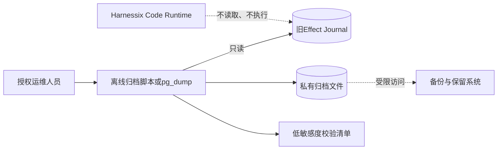
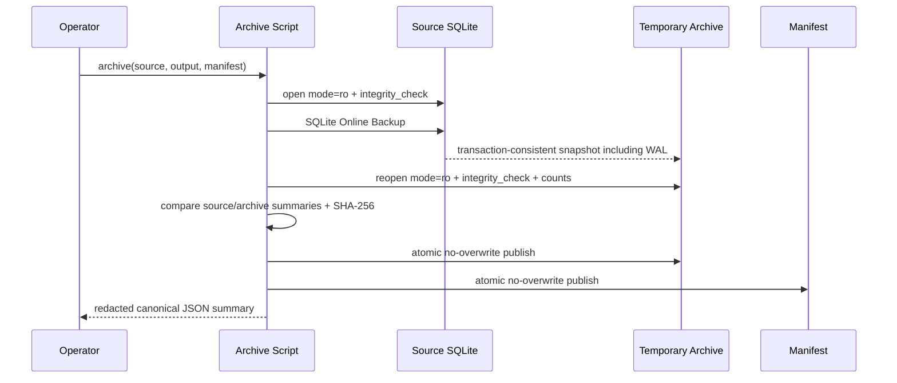
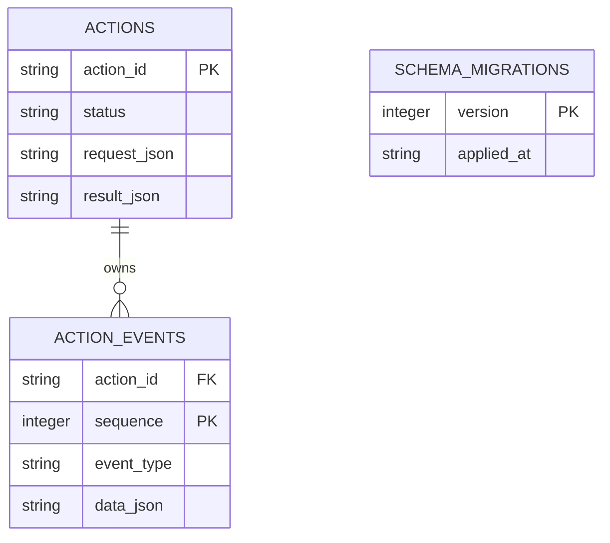

# 旧Action Plane状态检查与归档手册

## 1. 文档摘要

独立Action HTTP/Worker产品面已从Harnessix Code删除。旧SQLite或PostgreSQL Effect Journal不属于当前产品状态，
新版本不会读取、迁移、执行或删除其中的Action。本手册定义删除后的唯一受支持处置：**停用旧版本、只读检查、生成
一致归档、校验清单、限制访问并按保留策略处置**。

| 项目 | 规定 |
|---|---|
| 当前产品是否加载旧库 | 否 |
| 是否把旧Action迁入Session或Action Audit | 否 |
| 是否自动继续`READY/RUNNING/UNKNOWN` | 否 |
| SQLite支持 | 仓库脚本只读检查与Online Backup归档 |
| PostgreSQL支持 | 使用原生`pg_dump`一致导出；Harnessix不再携带数据库驱动 |
| 回滚 | 只允许恢复删除前版本，并使用原配置和隔离后的旧数据库副本 |

## 2. 需求背景与设计目标

旧Action Plane曾以HTTP API、Effect Journal和独立Worker保存Action状态。直接删除数据库可能丢失审计或未决效果；
把旧队列自动接入新Runtime则会产生未经当前Session、Execution Plan和Trusted Action批准的执行旁路。因此归档必须：

1. 不启动旧Worker，不改变Action状态，不触发外部副作用；
2. 对SQLite WAL取得事务一致快照，而不是复制单个主文件；
3. 只在终端输出数量、状态和Schema版本，不输出请求、参数、事件正文或Secret；
4. 归档和清单均采用“不覆盖”发布语义；POSIX强制`0600`，Windows要求输出目录预先配置当前账号专有ACL；
5. 清单能证明归档文件身份，但不泄漏源文件绝对路径；
6. PostgreSQL归档复用数据库官方工具，不在产品重新引入`asyncpg`或服务连接配置。

## 3. 总体架构与信任边界



旧库、归档目录和保留系统均位于产品信任边界之外。执行脚本的账号必须对源库只有必要读取权限，对输出目录具有独占写权限。
归档完成不代表旧Action已经成功、失败或可重放；它只证明某一时刻的持久数据快照已保存。

## 4. SQLite检查与归档流程

### 4.1 前置条件

1. 停止所有旧`serve/worker`进程并确认不会由进程管理器重启；
2. 保留数据库主文件及同目录WAL/SHM，不手工拼接或删除WAL；
3. 在非Workspace私有目录创建归档输出目录，并限制为当前账号访问；
4. 使用包含本脚本的当前源码版本；脚本不依赖已删除的Action Plane包。

### 4.2 只读检查

```bash
uv run python scripts/archive_legacy_action_state.py inspect \
  --source ./private/legacy-actions.db
```

脚本以SQLite URI `mode=ro`打开源库，执行完整性检查，并要求存在`actions`、`action_events`和
`schema_migrations`三张核心表。标准输出只包含以下字段：

| 字段 | 含义 | 隐私约束 |
|---|---|---|
| `schema_versions` | 已应用旧Journal迁移版本 | 不包含SQL正文 |
| `action_count` | Action总数 | 低基数汇总 |
| `event_count` | 事件总数 | 低基数汇总 |
| `status_counts` | 按状态聚合数量 | 不包含Action ID |

任何结构缺失、完整性错误、符号链接或读取错误都以退出码`2`失败关闭；标准输出和标准错误均使用UTF-8，
调用脚本的进程不得依赖Windows活动代码页猜测解码。

### 4.3 生成一致归档

```bash
uv run python scripts/archive_legacy_action_state.py archive \
  --source ./private/legacy-actions.db \
  --output ./archive/legacy-actions.archive.db \
  --manifest ./archive/legacy-actions.manifest.json
```



脚本在发布前显式关闭源、备份目标和复核阶段的全部SQLite连接，避免Windows仍持有临时数据库句柄；归档
`fsync`以可写文件描述符执行，以兼容Windows `_commit`；随后拒绝
覆盖既有输出或清单。清单包含归档文件名、字节数、SHA-256、创建时间和低敏感度统计；只记录源文件名，
不记录绝对路径。归档内容仍可能包含Prompt、参数、Secret引用和外部身份，必须按敏感生产数据保护。

### 4.4 校验

```bash
sha256sum ./archive/legacy-actions.archive.db
cat ./archive/legacy-actions.manifest.json
uv run python scripts/archive_legacy_action_state.py inspect \
  --source ./archive/legacy-actions.archive.db
```

macOS可使用`shasum -a 256`。摘要必须与清单一致，二次检查的Schema版本、Action总数、事件总数和状态计数必须与归档时输出一致。

## 5. PostgreSQL归档流程

当前产品不再安装PostgreSQL Action Journal驱动。授权数据库管理员应使用与服务端主版本兼容的`pg_dump`，并以只读账号执行。
连接地址、账号和密码通过权限受控的`PGSERVICEFILE`/`PGPASSFILE`注入，命令行只出现非敏感服务名：

```bash
export PGSERVICEFILE=./private/pg_service.conf
export PGPASSFILE=./private/pgpass
pg_dump \
  --dbname=service=harnessix_legacy_readonly \
  --format=custom \
  --no-owner \
  --no-privileges \
  --file=./archive/legacy-actions.dump
```

`PGSERVICEFILE`和`PGPASSFILE`必须是私有普通文件，不得进入Shell历史、文档、清单或诊断包。导出后执行：

```bash
pg_restore --list ./archive/legacy-actions.dump > ./archive/legacy-actions.catalog.txt
sha256sum ./archive/legacy-actions.dump > ./archive/legacy-actions.dump.sha256
```

恢复演练应在隔离数据库实例进行，只验证Schema、行数和只读查询。不得把恢复实例连接到旧Worker，也不得把其中记录导入当前
`action-audit.db`或`execution-plans.db`。

## 6. 数据结构与持久化语义



图仅用于识别归档类型，不是当前产品Schema。`request_json`、`result_json`和`data_json`均可能包含敏感正文，脚本不会查询或
打印这些列。SQLite Online Backup负责在一个读事务中复制数据库页；清单不是业务事件，也不能替代原Journal的事件顺序。

## 7. 失败、恢复、取消与超时

| 场景 | 行为 | 恢复方式 |
|---|---|---|
| 源文件不存在、不是普通文件或为符号链接 | 失败关闭，不创建输出 | 修正路径和文件身份后重试 |
| 完整性检查失败 | 失败关闭，不发布归档 | 保留原件，由SQLite恢复专家处理 |
| 核心表缺失 | 判定为不受支持的数据库 | 使用创建该库的旧版本资料识别 |
| 输出或清单已存在 | 拒绝覆盖 | 选择新的空路径；不要删除未知文件后盲重试 |
| 临时复制中断 | 临时文件不发布或被清理 | 核对输出目录后重新执行 |
| 归档统计与源统计不一致 | 失败关闭 | 停止操作并保存日志，调查存储故障 |
| 归档发布后清单发布失败 | 删除本次发布的归档 | 修复目录权限后重新执行 |
| 操作人员中断 | 不启动任何Action | 检查是否存在完整的归档与清单；缺一不可 |

脚本不实现业务级超时，也不捕获信号后伪造成功。超大数据库应在维护窗口运行，并由外部作业监督执行时间和存储容量。

## 8. 安全、审计与数据保留

1. 源库只读；归档不得位于公开共享目录或代码仓库；
2. POSIX输出文件强制`0600`；Windows脚本不修改DACL，必须在运行前验证输出目录只允许当前账号和受控管理员访问；
3. 标准输出可进入运维日志，因为不含行正文或绝对路径；标准错误也不得拼接连接串；
4. SHA-256用于完整性识别，不提供机密性；静态加密由保留系统负责；
5. 删除源库前必须完成归档校验、恢复演练、保留期审批和旧进程停用证明；
6. 对仍处于`READY/RUNNING/UNKNOWN`的记录，只能由删除前版本和原业务负责人判断，不得由当前Runtime自动续跑；
7. 数据到期销毁必须覆盖归档、副本、校验清单和恢复演练实例，并留下组织要求的销毁审计。

## 9. 测试与验收

自动化测试覆盖：WAL一致快照、统计一致性、SHA-256清单、敏感正文不泄漏、POSIX私有权限、错误Schema、符号链接、
既有输出拒绝覆盖，以及源Session历史Process状态只读不变。源码与测试入口：

- [SQLite归档脚本](../../scripts/archive_legacy_action_state.py)
- [归档安全测试](../../tests/governance/test_legacy_action_archive.py)
- [历史Process Session兼容测试](../../tests/agent/test_legacy_process_compatibility.py)
- [产品运行时收敛门禁](../../tests/governance/test_product_runtime_convergence.py)

实现Revision `a81868cae5b8092d565a6f465e8a9441b0e1c67b`已由
[CI 35453082992](https://github.com/carrie1988/Harnessix/actions/runs/35453082992)完成Linux、macOS、Windows、
固定镜像Container和Documentation全矩阵验收；Windows验证覆盖SQLite连接关闭、UTF-8诊断与可写描述符刷盘。

## 10. 限制、风险与回退

- 脚本只支持已知旧SQLite核心表，不修复损坏数据库；
- PostgreSQL由外部原生工具负责，仓库不保存连接配置，也不验证云厂商备份能力；
- 归档不是状态迁移，不能让当前版本恢复旧Action执行；
- 删除前版本若重新上线，必须使用隔离副本并防止与历史实例并发消费同一数据库；
- 任何恢复旧版本的操作都应先验证二进制、依赖、配置、外部身份和数据库Schema完全匹配。

## 11. 变更记录

| 文档版本 | 代码版本 | 日期 | 变更摘要 |
|---|---|---|---|
| 4 | `a81868cae5b8092d565a6f465e8a9441b0e1c67b` | 2026-09-20 | 记录旧状态离线归档、Windows文件锁/编码/刷盘兼容及六实例全矩阵验收 |
