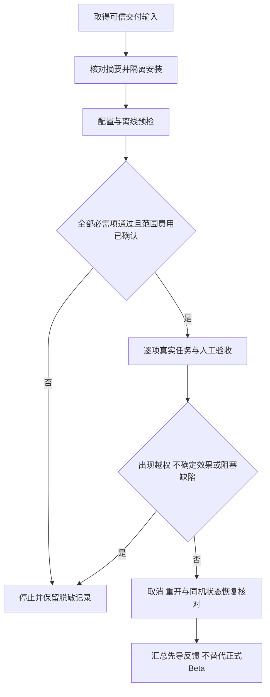

# Harnessix 单人先导 Beta 操作手册

## 1. 适用范围与候选状态

单人先导由项目使用者本人完成，适用于尚无独立 Beta 开发者时的低风险试用准备、真实小任务和问题记录。本手册给出执行方法，不记录已完成的试用、测试通过或商业发布结果。

| 项目 | 当前边界 |
|---|---|
| 源码核对基线 | `main`，`e088b09b20de3b2898bd2d4b8479f39b84553018`；后继修改须另行冻结并交付 |
| 包版本 | 内部 `1.0.0rc1`；[包元数据](../../pyproject.toml#L1-L32)不是正式发行证明 |
| 已交付先导候选 | macOS arm64 / CPython 3.12.7 限定先导安装候选；源码/Wheel/两个独立安装的 548 件包成员一致；实际提交与安装输入由交付记录提供，不代表商用封板 |
| Git 业务能力 | 默认完整 Git、独立 Commit、业务 Backup2 尚未落地；不能以组件设计或专项结果替代默认产品能力 |
| 首轮参与 | 单人先导，当前真实任务完成数为 0；尚无独立开发者试用成绩 |
| 先导结论 | 仅说明实际试用的候选、机器、Provider 配置和任务，不关闭 R3、R4、R5 或 R6 |

已交付先导环境固定在提交 `e0c47ca2f96c4e87a055b3135ac6c3be883275d5` 的候选输入。后继[评分器反馈整改](../changes/m09-r3-final-patch-feedback.md)不自动替换该环境；换候选须另行固定版本与输入。

Git 边界见[当前产品装配说明](../modules/product-config.md#正式git-review与原artifact审批链)。
[R5 当前门槛](../changes/m09-to-v1-release-scope-convergence.md#5-六个发布工作包与退出条件)为 **3～5 名独立开发者、至少 15 个真实任务、首发macOS实际使用**，并要求无未处置 P0/P1。2026-10-09按用户决定取消Linux/Windows首发交付及对应任务，不再作为退出条件或延期必做项；未来支持需另行立项。单人五任务不替代正式Beta门槛。

## 2. 开始前的范围与安全约束

1. 选择本人有权处理的小型仓库副本；冻结五项真实需求、允许修改文件及验收条件，保留原始代码备份。
2. Workspace 仅包含允许发送给所选 Provider 的代码；移除凭据、客户数据、私有生产材料及不必要文件。
3. 配置、状态、备份、反馈放在 Workspace 外；使用本地文件系统，不使用网络盘、共享状态或并行 Runtime。
4. 先导不启用额外 Action 配置、Container Process Profile、MCP、Hook、Skill、公网 Push 或自动提交。
5. 只接受当前候选实际广告且预检通过的能力。未广告的 Git 写入、Commit、任意 Shell 和测试执行均不作为默认能力使用。
6. 记录目标 OS、架构、Python 补丁版本和终端；单台试用结果不外推到其他平台。[平台范围](platforms.md#2-首发目标与当前判定)仍独立验收。



## 3. 候选交付与隔离安装

**以下步骤仅在维护者提供完整交付输入后执行。** 未取得输入时停留在准备阶段，不从移动的 `main`、共享源码环境或未知下载地址安装。
交付至少包含候选 Wheel 的本地绝对路径、完整 Revision、独立可信 SHA256、原锁 `requirements.txt`、绑定该 Wheel 本地路径及相同摘要的 `wheel-requirement.txt`，以及满足锁定输入的离线依赖缓存。
依赖应包含 `tui` 和选定 Provider 的 Extra；基础 Wheel 不隐式提供这些依赖。
当前没有本文可承诺的官方 Wheel 下载 URL；旧验证件不能充当最新候选。
当前限定安装输入选择 `openai+tui`，不含 dev；46 个运行依赖使用原锁离线哈希安装。
已封存缓存采用固定版本 `uv 0.9.1` 的私有格式，仅核验本机 CPython 3.12/arm64；
不是通用 pip Wheel 目录，也不证明三平台发行或全部原始依赖 Wheel 已交付。
缓存完整性清单、复制输入和重放说明必须与候选一并提供，不忽略缓存缺失或版本不匹配。
[审批历史增量验证](../validation/git-approved-history-2026-10-07-v1/README.md)将包一致性、离线预检、SDK 与真实任务结果分开。

以下为首发 macOS Bash 示例。先准备本机 Python 3.12 和 `uv`，选择尚不存在的安装目录；**逐段执行，每一步成功后才继续**。
将路径和摘要替换为可信交付记录中的实际值，不能把本地自算摘要当作来源证明。

```bash
export DELIVERY="/absolute/maintainer-candidate"
export EXPECTED_WHEEL_SHA256="由可信交付记录提供的64位小写摘要"
export INSTALL="$HOME/harnessix-pilot-install"
python3 - "$DELIVERY/harnessix-1.0.0rc1-py3-none-any.whl" "$EXPECTED_WHEEL_SHA256" <<'PY'
import hashlib
import sys
from pathlib import Path
actual = hashlib.sha256(Path(sys.argv[1]).read_bytes()).hexdigest()
if actual != sys.argv[2]:
    raise SystemExit("候选SHA256不匹配，停止安装")
print(actual)
PY
```

核对两份安装输入的摘要与可信记录一致、Wheel 条目指向上述文件后，执行离线安装；缓存不足即停止，不放宽哈希或依赖锁。

```bash
uv venv --python 3.12 "$INSTALL/venv"
export PY="$INSTALL/venv/bin/python"
export CACHE="$DELIVERY/pilot-cache"  # 可信交付的已验证固定版本缓存路径
uv pip install --python "$PY" --cache-dir "$CACHE" --offline --require-hashes --no-deps -r "$DELIVERY/requirements.txt"
uv pip install --python "$PY" --cache-dir "$CACHE" --offline --require-hashes --no-deps -r "$DELIVERY/wheel-requirement.txt"
cd "$INSTALL"
"$PY" -I -m harnessix --help
"$PY" -I -m harnessix code --help
"$PY" -I -m harnessix license
"$PY" -I -c 'import harnessix; from importlib.metadata import version; print(version("harnessix")); print(harnessix.__file__)'
```

版本须匹配交付记录，导入路径须位于独立 venv，而非源码目录。Help 成功不证明模型、任务或恢复成功；CLI 入口由[顶层分派](../../src/harnessix/cli.py#L12-L74)定义。
Linux/Windows不属于本次首发交付及Beta平台任务；已有开发步骤不构成支持承诺。

## 4. Provider 配置与离线预检

以下目录必须与 Workspace 分离。Workspace 应已存在且已完成备份；私有父目录使用当前账号独占权限。
使用现有受信机制将 `MODEL_API_KEY` 注入启动环境，不在命令参数、配置、反馈或 Shell 历史中写入真实值。
填写经维护者确认的 Provider 端点、模型、地域和输出 Token 参数；仅存在 Adapter 不等于该组合已认证。

```bash
export WORKSPACE="/absolute/pilot-workspace"
export PRIVATE="$HOME/.harnessix-pilot"
export CONFIG="$PRIVATE/config.json"
export STATE_ROOT="$PRIVATE/client"
export PROVIDER_BASE_URL="经确认的HTTPS端点"
export PROVIDER_MODEL="经确认的模型标识"
unset HARNESSIX_PRODUCT_ACTION_CONFIG
umask 077
mkdir -p "$PRIVATE"
"$PY" -I -m harnessix code configure --config "$CONFIG" \
  --provider-kind openai_chat --base-url "$PROVIDER_BASE_URL" --model "$PROVIDER_MODEL" \
  --api-key-env MODEL_API_KEY --non-interactive
"$PY" -I -m harnessix code doctor "$WORKSPACE" --config "$CONFIG" \
  --state-directory "$STATE_ROOT" --profile primary --json
```

`openai_chat` 对应 `openai` Extra；Anthropic 使用 `--provider-kind anthropic` 及 `anthropic` Extra，不传 OpenAI 输出 Token 参数。
OpenAI 兼容端点若需指定参数，仅使用已实现的 `--output-token-parameter max_tokens` 或 `max_completion_tokens`；端点必须是无用户信息、Query、Fragment 的 HTTPS URL，见[URL 校验](../../src/harnessix/models/config.py#L40-L56)。
新建配置遇到已有文件时停止；确需替换，先停机并保留旧配置，使用 `--replace --expected-source-sha256` 提交已核对的原文件摘要。

Configure 只保存 Secret 引用。Doctor 为离线预检：退出 `0` 表示必需项通过，`2` 表示失败；不证明账户权限、网络、模型质量或余额。
保存配置收据摘要、`report_sha256`、`ready`、检查代码和修复动作 ID；不要上传配置正文或环境变量值。
参数及退出码见[Configure/Doctor 解析](../../src/harnessix/product_ui/cli.py#L54-L91)、[Doctor 实现](../../src/harnessix/product_ui/cli.py#L312-L331)。

## 5. 启动、审批与预算

```bash
"$PY" -I -m harnessix code "$WORKSPACE" --config "$CONFIG" \
  --state-directory "$STATE_ROOT" --profile primary
```

创建或选择会话后再提交需求；每项记录 Thread、Turn 及相关 Plan/Artifact 身份。
`Ctrl+N` 新建会话；`Ctrl+A` 打开审批并阅读完整证据；`Ctrl+U` 回答问题；`Ctrl+S` 补充当前 Turn；`Ctrl+X` 直接提交当前 Turn 的取消；`Ctrl+R` 重连；`F1` 查看错误帮助；`Ctrl+Q` 关闭产品，**不等于取消 Turn**。
审批核对文件范围、差异及效果，拒绝越界提案；`Escape` 关闭审批窗口不等于拒绝。
快捷键见[TUI 绑定](../../src/harnessix/product_ui/app.py#L42-L55)，取消见[交互提交](../../src/harnessix/product_ui/interaction_presenter.py#L38-L67)。

每项开始前填写人工费用上限、最多新尝试次数和停止时限；先导建议每项最多两次新尝试，失败也必须登记。
默认 Turn 是 16 步、100000 Token、120 秒，见[预算默认值](../../src/harnessix/agent/models.py#L67-L72)；Provider Profile 默认单响应输出 4096 Token、最多 2 次尝试，见[Profile 合同](../../src/harnessix/product_config/contracts.py#L88-L108)。
两类限制不是同一预算。CLI/TUI 没有每 Turn 预算开关；不能靠 Prompt 获得更低的硬限制。
需要更小预算时，由已握手并保存 Thread、客户端及请求身份的异步 SDK 宿主传入完整 `PublicBudget`；以下是宿主内片段，提交会调用模型：

```python
from harnessix.protocol.contracts import PublicBudget

budget = PublicBudget(
    max_steps=8,
    max_tokens=20000,
    timeout_seconds=120.0,
    max_output_chars=16384,
    max_tool_calls_per_step=8,
)
turn = await client.start_turn(thread_id, prompt, request_id=request_id, budget=budget)
```

字段见[公共预算](../../src/harnessix/protocol/contracts.py#L205-L216)，方法见[SDK 提交](../../src/harnessix/sdk/agent_client.py#L227-L245)。
UI 费用当前明确为 `unknown`，见[费用投影](../../src/harnessix/product_ui/interactions.py#L106-L115)；Token 统计不是人民币账单或绝对费用硬上限。首个真实请求前确认 Provider 账户侧费用控制；已知用量缺失或费用失控时停止，不把未知记为零。

## 6. 五项真实小任务清单

执行前将每行的目标文件、真实需求和验收命令填写到第 9 节。任务来自实际待办，不用合成演示替代；缺少适用需求时登记“未开始”，不计入完成数。
只使用默认可用的只读工具与审批 Patch。目标仓库测试命令必须从其维护文档核对，由试用者在本机独立执行；不假定 Harnessix 已装配测试进程。

| ID | 真实需求及操作 | 完成条件与证据 |
|---|---|---|
| P01 | 定位一个待处理缺陷的入口、调用链和输入边界；仅请求读取指定模块，不写文件 | 人工逐项核对文件/行号、复现条件及调用关系；保存摘要，Workspace 无新增修改 |
| P02 | 修正一处实际使用说明或示例错误，限制一个文档文件；在 `Ctrl+A` 中逐条核对后批准 | 文档与现有接口一致，人工执行经核对的示例或登记未执行原因；保留限定文件差异和审批身份 |
| P03 | 为一个真实边界缺陷补回归并最小修复，限定实现与测试文件，禁止依赖升级 | 人工确认原问题及修复后预期，执行目标仓库必需检查；记录真实结果，测试未执行不得记为完成 |
| P04 | 对一个实际重复逻辑做小范围等价整理；发现提案越界则拒绝；在未批准写入的分析阶段取消，再重开原会话 | 记录取消终态、退出/重开状态与文件对比；取消后确认无不确定效果，再以新 Turn 完成需求并人工验证行为不变 |
| P05 | 为已验收的小改动补一条真实变更说明，并核对重开后的历史及同机状态恢复 | 说明准确、无需自动 Git Commit；先按第 7 节备份验真，再在先导环境显式恢复，按第 8 节核对原 Thread/历史/Artifact，检查 Workspace 未被状态恢复改写 |

P04 若 Turn 已结束，记录未命中取消窗口，不计为取消验证成功；另选该任务的必要只读分析阶段补充观察，不为制造中断引入写操作。
P05 恢复必须是明确批准的先导演练，不在唯一生产状态上操作。五项结果分别记为成功、失败、阻塞、取消或未开始；保留失败与人工介入，不只汇报成功样本。
每项完成人工范围/语义核对；`git diff --check` 仅检查格式，不证明业务正确，不替代必需测试。

### 6.1 首个真实任务登记

**2026-10-09当前执行约束**：BETA-001为最高优先级，模型读取范围限已授权12文件独立副本；补丁切片目前仅允许提案创建`backend/src/main/java/com/mayiyun/aipractical/auth/LoginPasswordService.java`，逐次审阅后才可写入。完整业务输入仅供本地测试，不外发，也不重新访问原项目目录。

**最新预算授权**：用户重置新一轮总预算60元、Beta累计10元，不限定Beta请求次数。
旧账本132条请求及22.40640元未决预留原样留存，不结算、不退款、不删除；本次新周期不承接旧费用。
新周期`18f94ea3-92bb-4ebc-8cef-6dab61420bb3`使用独立BETA-001身份，后继各Turn累计同一10元额度。
前序替代模型为北京`qwen3-235b-a22b-instruct-2507`；工具串行，原Turn资源边界不变，新未决即停，不自动重试。
[新合同及价格依据](../changes/m09-r3-bounded-reverification-budget.md)不改变R3固定评测。
截至Max单工具第三轮，新周期66次请求，累计估算1.631434元、未决预留8.11008元；Beta可用余量0.258486元，付费请求已停止。
这是用量估算，不是供应商实扣账单；Beta完成数仍0。两次缺失/无效工具名导致协议失败，不是普通未注册名称拒绝；无补丁放行。
早先两轮只读分析共6请求、估算0.161822元，均完整读取五个核心文件。第一轮宿主漏传原始整改需求，泛化分析被人工拒绝；
第二轮已携带完整需求，提出初步整改方案，但引用行号和“无Console泄露”结论缺乏足够证据，未批准业务补丁。
第二轮旧文本门因缺少英文字面`Console`拒绝（实际使用中文“控制台”），原FAIL保留，另从认证历史读取原文审阅，
不以格式问题掩盖业务分析仍需修订。
此外，新增任务输入控制后24项独立检查均为true，但宿主汇总仍要求22，外层Shell未失败即停，故付费启动发生在汇总FAIL之后。
此宿主编排缺陷单独登记且未改写历史FAIL。后继宿主已在marker、账本Owner、凭据和Provider之前强制核验绑定候选的PASS预检证据，
新候选24项离线检查通过；1项正控及10项负控证明失败／缺失／旧摘要／错误控制值均在付费准备前拒绝，模型请求为0。
原目录、参考修复均未进入模型；尚未执行业务补丁、整改后测试或浏览器验收。
证据分别位于本机`verification-working/beta-001-instruct-budget10-20261009-v1`及
`verification-working/beta-001-requirement-complete-20261009-v1`下的费用、读取覆盖和`semantic-review.json`。

受控补丁v1/v2分别因目录遍历及缺失依赖探索耗尽原步骤/Token预算；没有增加原上限掩盖失败。
v3真实模型已提交提案，但私有宿主只读`item_finished`、漏掉待审批`item_started`，最终超时；后继按item身份折叠最新事件，
并增加真实SDK差异分页及拒绝预演（ScriptedProvider、零付费请求、Workspace不变），不把宿主修复计为产品新能力。
v4/v5提案均有编译及安全缺陷；完整Artifact经审阅后拒绝，v5拒绝后仍再次提案，操作员中断宿主，不计SDK取消验收。
独立JDK17编译确认v5首提案非法反斜杠导致FAIL；该提案只写入私有审阅目录，未获业务Workspace写权限。
后继Coder Flash v1/v2各执行2/3请求，实编译分别发现6/4错误，均被拒绝；认证终态为cancelled，拒绝后没有新增预留或请求。
v2认证历史重建确认每一步均保留完整原需求与修订提示；未发现本地提示丢失，不声称观察了远端实际处理。
审阅同时纠正设计：RSA2048无法覆盖原72字符规则的部分Unicode口令，后继仅提案改用RSA3072，未改变原密码强度规则。
这些证据保存于本机`verification-working/beta-001-controlled-patch-20261009-v1`至`v5`。

完整回归输入曾有独立准备缺口：已定位419文件初始副本，但未找到旧423件测试副本及4件补充的私有Manifest/实体。
用户已明确授权仅从冻结Git提交只读补齐这四件到新的本地测试副本；不读写原工作树、不启动原服务、配置不外发。
旧前测报告保留，不能将它作为新候选的整改后测试；新423件已完成哈希/大小/独立inode核验，原件与配置不外发，不借用参考修复。
新副本已独立完成269生产/78测试源码编译及18项认证/API前测，源摘要未变；不是整改后验收。
期间保留Maven构建目录创建失败及18项Context错误：分别纠正宿主祖先目录元数据访问规则、恢复隔离配置中的原冻结RuntimeMode，未修改业务源码。
完整macOS禁网前测350项为303通过、8失败、39错误；其中29项在测试自建HTTP服务的bind处被沙箱拒绝。
后继使用固定Maven/JDK17 Linux arm64镜像、`--network none`、只读依赖缓存及独立副本复验：76类350项，332通过、8失败、10错误、0跳过，132.378秒；29项网络适用性问题消失，423源摘要不变。
这不是Linux产品交付或macOS产品验收。仍保留9项上传NPE、3项权限断言、6项训练相关问题（含缺失资源）；不据数量认定为已豁免历史失败。
独立合成Notebook/PCAP夹具的两轮训练专项仍未通过，原失败、合成来源和未覆盖真实资源内容均保留，不改业务源码或断言凑绿。
本轮前测证据位于本机`verification-working/beta-001-full-input-20261009-v1`；整改后完整回归与浏览器验收仍开放。

用户已批准保留4.05504元未决在原10元内继续，承接仅追加冻结59件请求前缀，新未决即停。
后继是单文件组件切片，所需源码为Clock装配和密码规则两件；其他登录/前端对接仍须相应源码阅读与测试，不把该切片计作完整Beta。
Max单工具v1/v2各3请求：v1提案实际编译3错误；v2编译及19项组件检查通过，但追加负测证明null用户名未消耗可定位挑战，仍拒绝写入。
v3仅1请求再次缺失工具名，新增4.05504元未决后立即停止；费用核算规则变更正在请求用户决策，尚未应用。
三轮冻结输入及12件Workspace文件均验真未变；证据位于本机`verification-working/beta-001-max-single-tool-20261009-v1`至`v3`，不把模型提案、Node WebCrypto互操作或预算449项回归计作整个Beta完成。

**旧周期历史**：用户曾批准原60元周期内保留旧未决请求20.77824元预留，BETA-001新增费用封顶5元。
[任务授权合同](../../scripts/provider_reverification_plan.py)使用独立task身份，不是R3 Suite授权；
[账本](../../scripts/provider_verification_budget.py)保留原请求前缀并拒绝新增未决后的继续执行。
[请求保护](../../scripts/provider_verification_guard.py)为本任务单独核验北京`qwen3-coder-next`价格与用量，
按模型完整输入上限预留；不改变R3模型、评分或原限额。模型兼容性及真实业务验收仍须单独取得证据，
新unknown即停、无自动重试。离线回归见[任务边界](../../tests/evals/test_provider_reverification_task.py)及
[原生Adapter预算测试](../../tests/evals/test_beta_verification_guard.py)，不计作Beta完成。

首次任务授权已登记，原129条请求前缀、60元额度和20.77824元旧预留保持不变。
2026-10-09首次任务授权的真实SDK Turn在原生工具执行前因`provider_invalid_provider_output`失败，
返回模型标识匹配但用量未知；新增请求全额预留0.54272元，账本总预留21.32096元，
已知用量费用估算仍为3.102568元。没有自动重试，后续付费请求停止。
本轮五核心文件真实覆盖0/5、Patch/回归尚未执行，Beta完成数仍0；
没有原始响应证据，暂不归因供应商或Parser。预算/原生Adapter离线回归633通过不替代此真实失败。

**最新单次承接结果（2026-10-09）**：用户另授权保留两笔共21.32096元预留、在原60/5元范围内最多一次请求。
独立安装`cb40b89`经22项离线隔离检查后实际执行一次，无重试；认证Attempt定位到
`chat_protocol/v1:parallel_tool_calls_disabled`：请求显式禁止单响应多调用，但流出现第二个不同工具索引。
这是本次明确拒绝条件，不推断旧失败原因，也不证明返回的整组参数有效。模型匹配，用量未知，
新增0.54272元全额预留；131条请求累计已知估算3.102568元、预留21.86368元，均非实际账单。
唯一次数已消耗，新付费停止；五文件覆盖0/5、整改及业务回归未执行、Beta完成数0。
低敏证据位于本机`~/Library/Application Support/Harnessix/verification-working/beta-001-single-request-20261009-v1/`，
包括`authenticated-attempt-diagnostic.json`、`live-ledger-settlement.json`和`live-terminal-replay.json`。
后续先离线验证现有“接收多调用、Runtime串行执行”配置，不删除协议拒绝、不修改冻结候选；
真实复验须有新的明确授权，离线通过不算供应商兼容或Beta完成。

**随后四请求授权的实际结果**：原60/5元及全部旧预留不变，用户允许最多4次；
新安装候选`812af763`改为接收多调用、Runtime串行1。第1次即失败，未发送剩余3次：
完整Usage为2650输入/266输出，但整组完成校验报`chat_protocol/v1:tool_name_unknown`。
当前源码在Usage完成后该错误表示调用未积累有效名称；合法但未注册的名称会产生独立拒绝事件，
不走此错误。未保存wire，不能进一步断言供应商原字段还是SDK构造环节导致；禁止猜名或执行正文标记。
五核心文件仍0/5，业务整改及验收未完成。虽有完整Usage，原Guard仍要求干净成功终态才结算，
本次按原规则新增0.54272元未决预留，累计132条请求、已知估算3.102568元、预留22.40640元。
证据位于本机`~/Library/Application Support/Harnessix/verification-working/beta-001-serial-batch-20261009-v1/`。
暂停Next同类付费尝试，先重新核验模型的正式工具能力及预算，不放宽Parser、原金额或新未决即停规则。


首个已登记需求为 AIPracticalPlatform 登录过程中浏览器可见明文密码整改，登记及后续执行验收以[任务 001：登录密码传输保护](pilot-tasks/001-login-password-protection.md)为准。该任务对应 P03 类真实缺陷整改，并覆盖取消、重开及人工验收观察；多个 Turn 不拆算多个真实任务。

| 登记项 | 当前值 |
|---|---|
| 任务 ID / 参与者 | `BETA-001` / 项目使用者本人，单人先导 |
| 登记 / 执行 / 验收状态 | 已登记 / 五核心文件真实读取完成、分析待修订 / `NOT_EVALUATED`；整改与业务测试未执行 |
| 实际 Harnessix 完成数 | `0`；已有真实协议及模型分析尝试，没有完成整改或 Beta PASS 结论 |
| 执行输入 | 按已授权范围从初始未整改源码创建全新独立 `<副本目录>`，`<源目录>` 始终禁止写入 |
| 执行权限边界 | 现在原目录禁止读写；仅复用已授权12文件副本用于模型，完整423文件仅本地测试；新周期60元、Beta累计10元 |
| 参考结果 | 已有直接整改副本及 350/429 测试记录仅作为参考；12 个既有失败集合一致、79 个新增通过为已报告信息，登记未重跑 |
| 费用与候选 | [新60元周期](../changes/m09-provider-budget-period-activation.md)已登记，与R3共用；旧两笔未决不计入新额度、不阻塞新周期；执行候选仍须冻结，新周期新增未知停止 |
| HTTPS | 生产 HTTPS 及其验收范围待确认，不假定已部署 |

2026-10-08 的[共享验证周期更新](../validation/r3-workspace-coherence-2026-10-08-v1/real-suite-stop.json)
登记 R3 新请求两次，周期累计二十八次、已知估算 `0.725956` 元及未知预留 `20.77824` 元。
实际 gRPC FUSE Workspace 与十项固定 Profile 复验通过，但新 Suite 因未知工具名的失败尝试停止，
没有新质量报告。该未知请求仍属于当前六十元周期；不得按旧两笔未决的隔离规则忽略它。
R3 与本先导继续共用原账本，新的模型请求暂停，不改写 Beta 分析、修改许可或任务接受数。

2026-10-07 的限定只读分析使用冻结候选 `7fca4a526bbbd3cde7e7c66552704126757171c2` 的独立已安装 Wheel、
真实嵌入式 SDK 协议和 12 件经审阅的初始源码输入。原 Turn 在四个模型步骤后以 `budget_exceeded` 失败，
尚无成功的 `read_file` 结果；输入前后摘要及文件身份一致，原 Thread 重开与分页 Replay 一致。
四条新周期请求均为 `completed`，累计用量费用估算为 `0.072852` 元、预留为 `0`；实际账单未确认。
该观察只说明分析尝试及重开事实，不替代默认 CLI/TUI、取消、整改审批、业务测试或任务验收。
原失败与原预算均保留；没有自动重跑。[执行证据](../validation/beta-001-readonly-analysis-2026-10-07-v1/README.md)单独记录候选、费用和未完成项。
后继[v5同条件复验](../validation/beta-001-readonly-analysis-2026-10-07-v2/README.md)仍失败、零`read_file`；
两次共8个真实请求，累计估算0.134792元、预留0，未观察到真实导航改善，真实任务完成数仍0。

第三次[新计划限定分析](../validation/beta-001-readonly-analysis-2026-10-07-v3/README.md)明确提供12件已审阅路径，
采用独立16步/100,000 Token计划；不是原四步条件的效果对照。实际11请求、9次成功源码读取，
已报告累计103,826 Token后原Runtime拒绝完成。保留的模型末段文字未通过语义审阅：关键链路文件未读取，
将未读取误写为无权限，不能据此宣称HTTPS或完整分析。三次累计19请求、费用估算0.576316元、预留0；
供应商账单未确认。原失败/预算/候选均保持，登录整改、取消观察、隔离测试和Beta验收仍未完成。

既有直接修改结果不得计作 Harnessix 自动运行，也不得将整改后的源码、测试或答案喂入 Agent 作为新任务输入。后续执行须补齐完整原目录前后快照、受控工具及文件白名单、真实协议/Thread/Turn/审批、模型用量及费用、取消与恢复、最终隔离测试和使用者人工验收证据。本机登记件为受控证据目录中的 `beta-task-001.json` 与 `beta-registration.md`；私有路径不进入公共资料。单人登记不替代第 10 节正式 Beta 门禁。

## 7. 失败、取消、重开与状态恢复

错误先记录稳定代码，停止重复提交。网络/认证/额度失败先修正已确认的配置或账户条件，不切换未知 Provider、不禁用 TLS 校验。
取消后等待服务端终态并核对文件；`cancelled` 不保证已发生效果撤销。关闭或断线后保留原目录，以同一配置和路径重开：

```bash
export THREAD_ID="已记录的原Thread UUID"
"$PY" -I -m harnessix code "$WORKSPACE" --config "$CONFIG" \
  --state-directory "$STATE_ROOT" --profile primary --resume "$THREAD_ID"
```

`--resume` 选择并恢复 Thread 历史，不承诺重新生成模型响应或重放效果；参数见[启动解析](../../src/harnessix/product_ui/cli.py#L36-L51)。
新尝试和恢复不同：`turn/retry` 新建 Turn；`turn/resume` 只适用于合同允许的原 Turn，见[恢复语义](recovery.md#5-agent-runtime恢复)。
出现 `unknown`、部分写入或 `manual_intervention` 时，不 Retry、不覆盖外部修改、不执行 `git reset --hard`；停止并由维护者核对原事实。

先退出所有同根 TUI/CLI/SDK 实例，确认无活动写入。TUI 的服务状态位于 `$STATE_ROOT/runtime`，不是外层客户端根，见[装配路径](../../src/harnessix/product_ui/cli.py#L362-L373)。
备份父目录须已存在、私有且在 Workspace/状态根之外，目标目录必须尚不存在。

```bash
export RUNTIME_STATE="$STATE_ROOT/runtime"
export BACKUP_PARENT="$PRIVATE/backups"
mkdir -p "$BACKUP_PARENT"
export BACKUP_DIRECTORY="$BACKUP_PARENT/pilot-before-restore-01"
"$PY" -I -m harnessix state backup --state-directory "$RUNTIME_STATE" --backup-directory "$BACKUP_DIRECTORY" --timeout 120
"$PY" -I -m harnessix state verify --state-directory "$RUNTIME_STATE" --backup-directory "$BACKUP_DIRECTORY" --timeout 120
```

保存返回的 `backup_id`。同一停机窗口另行用受信本机备份方式保全 Workspace、配置、外层客户端身份/游标及原 Runtime 根外锚点。
现有备份只接受[v1 闭合布局](../../src/harnessix/product_config/state_backup_contracts.py#L21-L49)，不是尚未落地的 Git 业务 Backup2；布局被拒绝时停止，不删除额外状态绕过校验。
备份包含原独立 Key，属于敏感制品，不上传反馈；同机原用户恢复，不能当作跨机 Key 迁移。

仅在确认备份可验证、源代码另有备份且批准整体替换后，填写真实备份 ID，并生成、保存本次恢复 UUID；中断重试沿用同一 UUID。

```bash
export BACKUP_ID="原backup_id"
export RESTORE_ID="本次已保存的恢复UUID"
"$PY" -I -m harnessix state restore --state-directory "$RUNTIME_STATE" --backup-directory "$BACKUP_DIRECTORY" \
  --restore-id "$RESTORE_ID" --confirm-backup "$BACKUP_ID" --timeout 120
```

仅当原恢复未决且明确选择完成时，执行 `"$PY" -I -m harnessix state recover --state-directory "$RUNTIME_STATE" --confirm-restore "$RESTORE_ID" --mode complete --timeout 120`；明确选择撤销未决恢复时使用 `--mode rollback`，不得顺序执行两个方向。入口见[状态 CLI](../../src/harnessix/product_config/state_backup_cli.py#L21-L42)。
保留 Previous、Journal、备份和根外锚点；不换 Key、不逐库覆盖、不补签历史。状态恢复不恢复 Workspace，见[恢复限制](recovery.md#完整产品停机恢复与明确结算)。
恢复后先 Doctor，再重开原 Thread 核对历史和审批引用；有不一致即停止，不追加模型任务掩盖问题。

## 8. SDK 协议查询核对

关闭同根 TUI 后，可用已安装解释器查询原会话；以下不提交 Turn，不调用模型，但服务启动仍执行正常的状态初始化/恢复门禁。沿用前述环境变量，运行目录保持在源码之外；只打印身份、终态和游标，不打印业务正文。

```bash
"$PY" -I - <<'PY'
import asyncio
import os
import sys
from uuid import UUID
from harnessix.sdk import AgentClient, AgentSDKError, SubprocessAgentTransport

async def main():
    command = (sys.executable, "-I", "-m", "harnessix", "agent-server",
               "--config", os.environ["CONFIG"], "--workspace", os.environ["WORKSPACE"],
               "--state-directory", os.environ["RUNTIME_STATE"], "--profile", "primary")
    async with AgentClient(SubprocessAgentTransport(command)) as client:
        thread = await client.get_thread(UUID(os.environ["THREAD_ID"]))
        status = None if thread.latest_turn is None else thread.latest_turn.status
        print({"thread_id": str(thread.thread_id), "cursor": thread.cursor, "status": status})
        cursor = 0
        limit = min(100, client.initialized.limits.max_replay_events)
        while True:
            page = await client.replay_events(thread.thread_id, after_cursor=cursor, limit=limit)
            print({"scanned_through": page.scanned_through, "has_more": page.has_more})
            cursor = page.scanned_through
            if not page.has_more:
                break

try:
    asyncio.run(main())
except AgentSDKError as error:
    raise SystemExit(error.code) from None
PY
```

查询见[SDK 生命周期与 Thread](../../src/harnessix/sdk/agent_client.py#L101-L168)、[Replay 方法](../../src/harnessix/sdk/agent_client.py#L330-L343)。Replay 以 `scanned_through` 前进，不以 Live Delta 代替耐久游标；原审批 Artifact 还须在 TUI 中打开完整阅读，不以游标相等证明文件效果或正文正确。

## 9. 可填写反馈记录

每项复制一份，初始状态均为“未开始”。记录保存在受控反馈目录；人工审核后只分享脱敏摘要、错误代码、报告摘要和非敏感截图。

| 字段 | 填写值 |
|---|---|
| 任务 ID / 日期 / 状态 | __________ |
| 真实需求 / 验收条件 / 允许文件 | __________ |
| 候选 Revision / Wheel SHA256 / 安装输入摘要 | __________ |
| OS / 架构 / Python / 终端 | __________ |
| Provider 类型 / 模型 / 地域 / 模式 / Profile / 配置摘要 | __________ |
| Doctor 退出码 / report_sha256 / 检查代码 | __________ |
| Thread / Turn / Plan / Artifact / 请求身份（适用时） | __________ |
| 时限 / Token 预算 / 人工费用上限 / 尝试次数 | __________ |
| 实际 Token / 费用已知或未知 / 起止时间 | __________ |
| 实际结果 / 必需测试命令及结果 / 未验证项 | __________ |
| 拒绝、取消、重开、恢复及文件核对 | __________ |
| 人工干预 / 错误代码 / 脱敏证据位置 | __________ |
| 缺陷等级 / 复现条件 / 处置负责人 / 复核结果 | __________ |

不分享 Key、环境全量、数据库、备份包、原始 stderr、绝对个人路径、完整 Prompt、客户代码或未审阅 Artifact。
不用自动支持包、自动上传或遥测替代人工脱敏，见[证据采集范围](diagnostics.md#10-证据采集与脱敏)。

## 10. 停止条件与正式 Beta 的区别

先导分诊中，P0 指凭据泄露、越权、数据损坏或重复高风险效果；P1 指安装、核心任务、取消或恢复被阻断且无安全替代路径。疑似 P0/P1 先停止，再由维护者确认等级与处置。

- 安装输入缺失/错 SHA、版本或导入位置不符、Doctor 必需项失败：不启动真实任务。
- 越权写入、凭据暴露、数据损坏、重复副作用、错误 Key/来源或恢复后历史不一致：立即停止，保全原状态和受控证据。
- `unknown`、部分效果、取消无法收敛、恢复未决：不重试效果命令，等待维护者核对与明确处置。
- 达到人工时限/费用/尝试上限，或 Provider 用量不可判定：停止发起新 Turn，记录未完成结果。
- P0/P1 未处置、无法独立完成核心步骤或缺少必需验证：先导不得标记为无阻塞；缺陷修复后绑定新候选定向复核，保留旧失败。

先导汇总只报告五项的实际结果、人工介入、限制及待处置问题，不预填通过率。正式 Beta 仍须满足 R3/R4 候选前提、3～5 名独立开发者、至少 15 个真实任务和首发macOS实际使用，以及原 R5 退出条件。
正式发布另须同一冻结候选满足 R1～R5 并通过 R6 封板；单人先导、安装 Help、离线 Doctor 或绿色测试均不能替代这些门禁。

### 核心链与原生工具完成门复核

第四次[独立核心链读取计划](../validation/beta-001-readonly-analysis-2026-10-07-v4/README.md)在两次模型请求后Turn completed，
但仅核心1/5文件首页，最后文字是工具标记而非分析；宿主技术门正确拒绝，未将文字执行为工具。
四次共21请求、累计估算0.620748元、预留0、账单未确认；实际任务完成仍0。原失败保留，停止同类重复调用并先定位协议/模型行为。

### 独立业务前测与模型完成边界

[新隔离前测](../validation/beta-001-isolated-baseline-2026-10-08-v1/README.md)已取得前端build/typecheck/18测试及
后端269生产/78测试源码编译、18认证API测试通过。所有操作均为宿主直接前测，禁网和新目录写入限制保持；
初始隐私选集缺类及首次动态Mock初始化失败完整保留，未改原项目或参考件。
423件私有补充输入未放行模型外发，未执行Harnessix受控Profile、整改审批或浏览器验收，完成数仍0。
[原生工具/正文详设](../changes/m09-r3-native-tool-text-boundary.md)明确协议completed不代表业务完成，
合法函数标记文本不被解析为工具，也不因关键词整体拒绝。
[不含客户源码的真实协议探针](../validation/native-tool-protocol-2026-10-08-v1/README.md)两次native及续页revision通过，
没有实际工具执行，不推广为真实源码质量或Beta。共享新周期估算0.630272元、预留0、剩余估算59.369728元，
23请求均completed，实际账单未知；旧失败和门槛保持。

[完整未整改后端基线](../validation/beta-001-complete-baseline-2026-10-08-v1/README.md)已执行原Maven全部发现：
76类350项，302通过、9失败、39错误、0跳过，exit1；认证相关25项通过是350项子集，不叠加统计。
29项Socket权限错误与禁网适用性相关，另19项失败/错误未归因，不能豁免或推广为全量通过。
423源摘要前后不变；旧失败、隔离和Beta门槛保持，尚无Agent整改或任务接受。

[后继单变量Context配对](../validation/native-context-pair-2026-10-08-v1/README.md)在五工具/合成history相同下
两臂均原生续页通过，新增估算0.025400元；周期25completed、估算0.655672、预留0、剩余估算59.344328元，
实际账单未知。该样本不能解释原v4或代替真实分析；产品Context不因比较臂被停用，Beta完成仍0。
