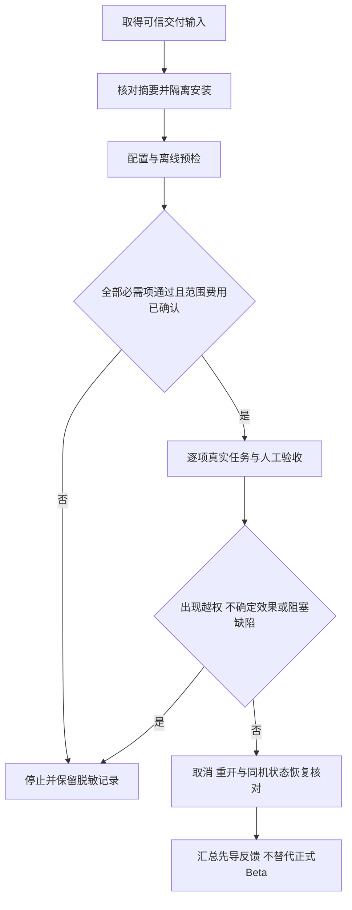

# Harnessix 单人先导 Beta 操作手册

## 1. 适用范围与候选状态

单人先导由项目使用者本人完成，适用于尚无独立 Beta 开发者时的低风险试用准备、真实小任务和问题记录。本手册给出执行方法，不记录已完成的试用、测试通过或商业发布结果。

| 项目 | 当前边界 |
|---|---|
| 源码核对基线 | `main`，`03529962a63dfc7818d6b0d0b6874d4e9fc118a3`；后继修改须另行冻结并交付 |
| 包版本 | 内部 `1.0.0rc1`；[包元数据](../../pyproject.toml#L1-L32)不是正式发行证明 |
| 最新候选 | 尚未封存；安装入口须等待维护者提供交付路径、Revision、SHA256 和锁定依赖 |
| Git 业务能力 | 默认完整 Git、独立 Commit、业务 Backup2 尚未落地；不能以组件设计或专项结果替代默认产品能力 |
| 首轮参与 | 单人先导，当前真实任务完成数为 0；尚无独立开发者试用成绩 |
| 先导结论 | 仅说明实际试用的候选、机器、Provider 配置和任务，不关闭 R3、R4、R5 或 R6 |

Git 边界见[当前产品装配说明](../modules/product-config.md#正式git-review与原artifact审批链)。
[R5 原门槛](../changes/m09-to-v1-release-scope-convergence.md#5-六个发布工作包与退出条件)保持为 **3～5 名独立开发者、至少 15 个真实任务、三平台均有实际使用**，并要求无未处置 P0/P1。单人五任务不替代该门槛，也不构成三平台产品支持或商用完成声明。

## 2. 开始前的范围与安全约束

1. 选择本人有权处理的小型仓库副本；冻结五项真实需求、允许修改文件及验收条件，保留原始代码备份。
2. Workspace 仅包含允许发送给所选 Provider 的代码；移除凭据、客户数据、私有生产材料及不必要文件。
3. 配置、状态、备份、反馈放在 Workspace 外；使用本地文件系统，不使用网络盘、共享状态或并行 Runtime。
4. 先导不启用额外 Action 配置、Container Process Profile、MCP、Hook、Skill、公网 Push 或自动提交。
5. 只接受当前候选实际广告且预检通过的能力。未广告的 Git 写入、Commit、任意 Shell 和测试执行均不作为默认能力使用。
6. 记录目标 OS、架构、Python 补丁版本和终端；单台试用结果不外推到其他平台。[平台范围](platforms.md#2-首发目标与当前判定)仍独立验收。



## 3. 候选交付与隔离安装

**以下步骤仅在维护者提供完整交付输入后执行。** 未取得输入时停留在准备阶段，不从移动的 `main`、共享源码环境或未知下载地址安装。
交付至少包含候选 Wheel 的本地绝对路径、完整 Revision、独立可信 SHA256、原锁 `requirements.txt`、绑定该 Wheel 本地路径及相同摘要的 `wheel-requirement.txt`，以及满足锁定输入的离线依赖缓存。
依赖应包含 `tui` 和选定 Provider 的 Extra；基础 Wheel 不隐式提供这些依赖。
当前没有本文可承诺的官方 Wheel 下载 URL；旧验证件不能充当最新未封存候选。

以下为 macOS/Linux Bash 示例。先准备本机 Python 3.12 和 `uv`，选择尚不存在的安装目录；**逐段执行，每一步成功后才继续**。
将路径和摘要替换为可信交付记录中的实际值，不能把本地自算摘要当作来源证明。

```bash
export DELIVERY="/absolute/maintainer-candidate"
export EXPECTED_WHEEL_SHA256="由可信交付记录提供的64位小写摘要"
export INSTALL="$HOME/harnessix-pilot-install"
python3 - "$DELIVERY/harnessix-1.0.0rc1-py3-none-any.whl" "$EXPECTED_WHEEL_SHA256" <<'PY'
import hashlib
import sys
from pathlib import Path
actual = hashlib.sha256(Path(sys.argv[1]).read_bytes()).hexdigest()
if actual != sys.argv[2]:
    raise SystemExit("候选SHA256不匹配，停止安装")
print(actual)
PY
```

核对两份安装输入的摘要与可信记录一致、Wheel 条目指向上述文件后，执行离线安装；缓存不足即停止，不放宽哈希或依赖锁。

```bash
uv venv --python 3.12 "$INSTALL/venv"
export PY="$INSTALL/venv/bin/python"
uv pip install --python "$PY" --offline --require-hashes --no-deps -r "$DELIVERY/requirements.txt"
uv pip install --python "$PY" --offline --require-hashes --no-deps -r "$DELIVERY/wheel-requirement.txt"
cd "$INSTALL"
"$PY" -I -m harnessix --help
"$PY" -I -m harnessix code --help
"$PY" -I -m harnessix license
"$PY" -I -c 'import harnessix; from importlib.metadata import version; print(version("harnessix")); print(harnessix.__file__)'
```

版本须匹配交付记录，导入路径须位于独立 venv，而非源码目录。Help 成功不证明模型、任务或恢复成功；CLI 入口由[顶层分派](../../src/harnessix/cli.py#L12-L74)定义。
Windows 使用 venv 的 `Scripts/python.exe` 和 PowerShell 环境变量语法，不照抄 Bash；按[安装手册](installation.md#5-本地wheel与锁定安装输入)的原生步骤另记结果。

## 4. Provider 配置与离线预检

以下目录必须与 Workspace 分离。Workspace 应已存在且已完成备份；私有父目录使用当前账号独占权限。
使用现有受信机制将 `MODEL_API_KEY` 注入启动环境，不在命令参数、配置、反馈或 Shell 历史中写入真实值。
填写经维护者确认的 Provider 端点、模型、地域和输出 Token 参数；仅存在 Adapter 不等于该组合已认证。

```bash
export WORKSPACE="/absolute/pilot-workspace"
export PRIVATE="$HOME/.harnessix-pilot"
export CONFIG="$PRIVATE/config.json"
export STATE_ROOT="$PRIVATE/client"
export PROVIDER_BASE_URL="经确认的HTTPS端点"
export PROVIDER_MODEL="经确认的模型标识"
unset HARNESSIX_PRODUCT_ACTION_CONFIG
umask 077
mkdir -p "$PRIVATE"
"$PY" -I -m harnessix code configure --config "$CONFIG" \
  --provider-kind openai_chat --base-url "$PROVIDER_BASE_URL" --model "$PROVIDER_MODEL" \
  --api-key-env MODEL_API_KEY --non-interactive
"$PY" -I -m harnessix code doctor "$WORKSPACE" --config "$CONFIG" \
  --state-directory "$STATE_ROOT" --profile primary --json
```

`openai_chat` 对应 `openai` Extra；Anthropic 使用 `--provider-kind anthropic` 及 `anthropic` Extra，不传 OpenAI 输出 Token 参数。
OpenAI 兼容端点若需指定参数，仅使用已实现的 `--output-token-parameter max_tokens` 或 `max_completion_tokens`；端点必须是无用户信息、Query、Fragment 的 HTTPS URL，见[URL 校验](../../src/harnessix/models/config.py#L40-L56)。
新建配置遇到已有文件时停止；确需替换，先停机并保留旧配置，使用 `--replace --expected-source-sha256` 提交已核对的原文件摘要。

Configure 只保存 Secret 引用。Doctor 为离线预检：退出 `0` 表示必需项通过，`2` 表示失败；不证明账户权限、网络、模型质量或余额。
保存配置收据摘要、`report_sha256`、`ready`、检查代码和修复动作 ID；不要上传配置正文或环境变量值。
参数及退出码见[Configure/Doctor 解析](../../src/harnessix/product_ui/cli.py#L54-L91)、[Doctor 实现](../../src/harnessix/product_ui/cli.py#L312-L331)。

## 5. 启动、审批与预算

```bash
"$PY" -I -m harnessix code "$WORKSPACE" --config "$CONFIG" \
  --state-directory "$STATE_ROOT" --profile primary
```

创建或选择会话后再提交需求；每项记录 Thread、Turn 及相关 Plan/Artifact 身份。
`Ctrl+N` 新建会话；`Ctrl+A` 打开审批并阅读完整证据；`Ctrl+U` 回答问题；`Ctrl+S` 补充当前 Turn；`Ctrl+X` 直接提交当前 Turn 的取消；`Ctrl+R` 重连；`F1` 查看错误帮助；`Ctrl+Q` 关闭产品，**不等于取消 Turn**。
审批核对文件范围、差异及效果，拒绝越界提案；`Escape` 关闭审批窗口不等于拒绝。
快捷键见[TUI 绑定](../../src/harnessix/product_ui/app.py#L42-L55)，取消见[交互提交](../../src/harnessix/product_ui/interaction_presenter.py#L38-L67)。

每项开始前填写人工费用上限、最多新尝试次数和停止时限；先导建议每项最多两次新尝试，失败也必须登记。
默认 Turn 是 16 步、100000 Token、120 秒，见[预算默认值](../../src/harnessix/agent/models.py#L67-L72)；Provider Profile 默认单响应输出 4096 Token、最多 2 次尝试，见[Profile 合同](../../src/harnessix/product_config/contracts.py#L88-L108)。
两类限制不是同一预算。CLI/TUI 没有每 Turn 预算开关；不能靠 Prompt 获得更低的硬限制。
需要更小预算时，由已握手并保存 Thread、客户端及请求身份的异步 SDK 宿主传入完整 `PublicBudget`；以下是宿主内片段，提交会调用模型：

```python
from harnessix.protocol.contracts import PublicBudget

budget = PublicBudget(
    max_steps=8,
    max_tokens=20000,
    timeout_seconds=120.0,
    max_output_chars=16384,
    max_tool_calls_per_step=8,
)
turn = await client.start_turn(thread_id, prompt, request_id=request_id, budget=budget)
```

字段见[公共预算](../../src/harnessix/protocol/contracts.py#L205-L216)，方法见[SDK 提交](../../src/harnessix/sdk/agent_client.py#L227-L245)。
UI 费用当前明确为 `unknown`，见[费用投影](../../src/harnessix/product_ui/interactions.py#L106-L115)；Token 统计不是人民币账单或绝对费用硬上限。首个真实请求前确认 Provider 账户侧费用控制；已知用量缺失或费用失控时停止，不把未知记为零。

## 6. 五项真实小任务清单

执行前将每行的目标文件、真实需求和验收命令填写到第 9 节。任务来自实际待办，不用合成演示替代；缺少适用需求时登记“未开始”，不计入完成数。
只使用默认可用的只读工具与审批 Patch。目标仓库测试命令必须从其维护文档核对，由试用者在本机独立执行；不假定 Harnessix 已装配测试进程。

| ID | 真实需求及操作 | 完成条件与证据 |
|---|---|---|
| P01 | 定位一个待处理缺陷的入口、调用链和输入边界；仅请求读取指定模块，不写文件 | 人工逐项核对文件/行号、复现条件及调用关系；保存摘要，Workspace 无新增修改 |
| P02 | 修正一处实际使用说明或示例错误，限制一个文档文件；在 `Ctrl+A` 中逐条核对后批准 | 文档与现有接口一致，人工执行经核对的示例或登记未执行原因；保留限定文件差异和审批身份 |
| P03 | 为一个真实边界缺陷补回归并最小修复，限定实现与测试文件，禁止依赖升级 | 人工确认原问题及修复后预期，执行目标仓库必需检查；记录真实结果，测试未执行不得记为完成 |
| P04 | 对一个实际重复逻辑做小范围等价整理；发现提案越界则拒绝；在未批准写入的分析阶段取消，再重开原会话 | 记录取消终态、退出/重开状态与文件对比；取消后确认无不确定效果，再以新 Turn 完成需求并人工验证行为不变 |
| P05 | 为已验收的小改动补一条真实变更说明，并核对重开后的历史及同机状态恢复 | 说明准确、无需自动 Git Commit；先按第 7 节备份验真，再在先导环境显式恢复，按第 8 节核对原 Thread/历史/Artifact，检查 Workspace 未被状态恢复改写 |

P04 若 Turn 已结束，记录未命中取消窗口，不计为取消验证成功；另选该任务的必要只读分析阶段补充观察，不为制造中断引入写操作。
P05 恢复必须是明确批准的先导演练，不在唯一生产状态上操作。五项结果分别记为成功、失败、阻塞、取消或未开始；保留失败与人工介入，不只汇报成功样本。
每项完成人工范围/语义核对；`git diff --check` 仅检查格式，不证明业务正确，不替代必需测试。

## 7. 失败、取消、重开与状态恢复

错误先记录稳定代码，停止重复提交。网络/认证/额度失败先修正已确认的配置或账户条件，不切换未知 Provider、不禁用 TLS 校验。
取消后等待服务端终态并核对文件；`cancelled` 不保证已发生效果撤销。关闭或断线后保留原目录，以同一配置和路径重开：

```bash
export THREAD_ID="已记录的原Thread UUID"
"$PY" -I -m harnessix code "$WORKSPACE" --config "$CONFIG" \
  --state-directory "$STATE_ROOT" --profile primary --resume "$THREAD_ID"
```

`--resume` 选择并恢复 Thread 历史，不承诺重新生成模型响应或重放效果；参数见[启动解析](../../src/harnessix/product_ui/cli.py#L36-L51)。
新尝试和恢复不同：`turn/retry` 新建 Turn；`turn/resume` 只适用于合同允许的原 Turn，见[恢复语义](recovery.md#5-agent-runtime恢复)。
出现 `unknown`、部分写入或 `manual_intervention` 时，不 Retry、不覆盖外部修改、不执行 `git reset --hard`；停止并由维护者核对原事实。

先退出所有同根 TUI/CLI/SDK 实例，确认无活动写入。TUI 的服务状态位于 `$STATE_ROOT/runtime`，不是外层客户端根，见[装配路径](../../src/harnessix/product_ui/cli.py#L362-L373)。
备份父目录须已存在、私有且在 Workspace/状态根之外，目标目录必须尚不存在。

```bash
export RUNTIME_STATE="$STATE_ROOT/runtime"
export BACKUP_PARENT="$PRIVATE/backups"
mkdir -p "$BACKUP_PARENT"
export BACKUP_DIRECTORY="$BACKUP_PARENT/pilot-before-restore-01"
"$PY" -I -m harnessix state backup --state-directory "$RUNTIME_STATE" --backup-directory "$BACKUP_DIRECTORY" --timeout 120
"$PY" -I -m harnessix state verify --state-directory "$RUNTIME_STATE" --backup-directory "$BACKUP_DIRECTORY" --timeout 120
```

保存返回的 `backup_id`。同一停机窗口另行用受信本机备份方式保全 Workspace、配置、外层客户端身份/游标及原 Runtime 根外锚点。
现有备份只接受[v1 闭合布局](../../src/harnessix/product_config/state_backup_contracts.py#L21-L49)，不是尚未落地的 Git 业务 Backup2；布局被拒绝时停止，不删除额外状态绕过校验。
备份包含原独立 Key，属于敏感制品，不上传反馈；同机原用户恢复，不能当作跨机 Key 迁移。

仅在确认备份可验证、源代码另有备份且批准整体替换后，填写真实备份 ID，并生成、保存本次恢复 UUID；中断重试沿用同一 UUID。

```bash
export BACKUP_ID="原backup_id"
export RESTORE_ID="本次已保存的恢复UUID"
"$PY" -I -m harnessix state restore --state-directory "$RUNTIME_STATE" --backup-directory "$BACKUP_DIRECTORY" \
  --restore-id "$RESTORE_ID" --confirm-backup "$BACKUP_ID" --timeout 120
```

仅当原恢复未决且明确选择完成时，执行 `"$PY" -I -m harnessix state recover --state-directory "$RUNTIME_STATE" --confirm-restore "$RESTORE_ID" --mode complete --timeout 120`；明确选择撤销未决恢复时使用 `--mode rollback`，不得顺序执行两个方向。入口见[状态 CLI](../../src/harnessix/product_config/state_backup_cli.py#L21-L42)。
保留 Previous、Journal、备份和根外锚点；不换 Key、不逐库覆盖、不补签历史。状态恢复不恢复 Workspace，见[恢复限制](recovery.md#完整产品停机恢复与明确结算)。
恢复后先 Doctor，再重开原 Thread 核对历史和审批引用；有不一致即停止，不追加模型任务掩盖问题。

## 8. SDK 协议查询核对

关闭同根 TUI 后，可用已安装解释器查询原会话；以下不提交 Turn，不调用模型，但服务启动仍执行正常的状态初始化/恢复门禁。沿用前述环境变量，运行目录保持在源码之外；只打印身份、终态和游标，不打印业务正文。

```bash
"$PY" -I - <<'PY'
import asyncio
import os
import sys
from uuid import UUID
from harnessix.sdk import AgentClient, AgentSDKError, SubprocessAgentTransport

async def main():
    command = (sys.executable, "-I", "-m", "harnessix", "agent-server",
               "--config", os.environ["CONFIG"], "--workspace", os.environ["WORKSPACE"],
               "--state-directory", os.environ["RUNTIME_STATE"], "--profile", "primary")
    async with AgentClient(SubprocessAgentTransport(command)) as client:
        thread = await client.get_thread(UUID(os.environ["THREAD_ID"]))
        status = None if thread.latest_turn is None else thread.latest_turn.status
        print({"thread_id": str(thread.thread_id), "cursor": thread.cursor, "status": status})
        cursor = 0
        limit = min(100, client.initialized.limits.max_replay_events)
        while True:
            page = await client.replay_events(thread.thread_id, after_cursor=cursor, limit=limit)
            print({"scanned_through": page.scanned_through, "has_more": page.has_more})
            cursor = page.scanned_through
            if not page.has_more:
                break

try:
    asyncio.run(main())
except AgentSDKError as error:
    raise SystemExit(error.code) from None
PY
```

查询见[SDK 生命周期与 Thread](../../src/harnessix/sdk/agent_client.py#L101-L168)、[Replay 方法](../../src/harnessix/sdk/agent_client.py#L330-L343)。Replay 以 `scanned_through` 前进，不以 Live Delta 代替耐久游标；原审批 Artifact 还须在 TUI 中打开完整阅读，不以游标相等证明文件效果或正文正确。

## 9. 可填写反馈记录

每项复制一份，初始状态均为“未开始”。记录保存在受控反馈目录；人工审核后只分享脱敏摘要、错误代码、报告摘要和非敏感截图。

| 字段 | 填写值 |
|---|---|
| 任务 ID / 日期 / 状态 | __________ |
| 真实需求 / 验收条件 / 允许文件 | __________ |
| 候选 Revision / Wheel SHA256 / 安装输入摘要 | __________ |
| OS / 架构 / Python / 终端 | __________ |
| Provider 类型 / 模型 / 地域 / 模式 / Profile / 配置摘要 | __________ |
| Doctor 退出码 / report_sha256 / 检查代码 | __________ |
| Thread / Turn / Plan / Artifact / 请求身份（适用时） | __________ |
| 时限 / Token 预算 / 人工费用上限 / 尝试次数 | __________ |
| 实际 Token / 费用已知或未知 / 起止时间 | __________ |
| 实际结果 / 必需测试命令及结果 / 未验证项 | __________ |
| 拒绝、取消、重开、恢复及文件核对 | __________ |
| 人工干预 / 错误代码 / 脱敏证据位置 | __________ |
| 缺陷等级 / 复现条件 / 处置负责人 / 复核结果 | __________ |

不分享 Key、环境全量、数据库、备份包、原始 stderr、绝对个人路径、完整 Prompt、客户代码或未审阅 Artifact。
不用自动支持包、自动上传或遥测替代人工脱敏，见[证据采集范围](diagnostics.md#10-证据采集与脱敏)。

## 10. 停止条件与正式 Beta 的区别

先导分诊中，P0 指凭据泄露、越权、数据损坏或重复高风险效果；P1 指安装、核心任务、取消或恢复被阻断且无安全替代路径。疑似 P0/P1 先停止，再由维护者确认等级与处置。

- 安装输入缺失/错 SHA、版本或导入位置不符、Doctor 必需项失败：不启动真实任务。
- 越权写入、凭据暴露、数据损坏、重复副作用、错误 Key/来源或恢复后历史不一致：立即停止，保全原状态和受控证据。
- `unknown`、部分效果、取消无法收敛、恢复未决：不重试效果命令，等待维护者核对与明确处置。
- 达到人工时限/费用/尝试上限，或 Provider 用量不可判定：停止发起新 Turn，记录未完成结果。
- P0/P1 未处置、无法独立完成核心步骤或缺少必需验证：先导不得标记为无阻塞；缺陷修复后绑定新候选定向复核，保留旧失败。

先导汇总只报告五项的实际结果、人工介入、限制及待处置问题，不预填通过率。正式 Beta 仍须满足 R3/R4 候选前提、3～5 名独立开发者、至少 15 个真实任务和三平台实际使用，以及原 R5 退出条件。
正式发布另须同一冻结候选满足 R1～R5 并通过 R6 封板；单人先导、安装 Help、离线 Doctor 或绿色测试均不能替代这些门禁。
