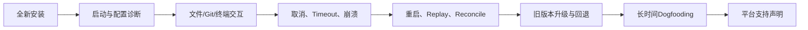

# Harnessix Code平台与运行环境

## 1. 支持等级定义

| 等级 | 定义 |
|---|---|
| 产品支持 | 安装器、启动、Coding Tool、终端/进程、Sandbox、升级、恢复和Dogfooding均达到发布门禁 |
| 候选可用 | 关键纵向切片在原生平台测试，但发行、长期运行或部分能力仍缺失 |
| 库级可用 | 合同或底层端口可导入/调用，不代表默认产品装配 |
| 失败关闭 | 入口主动拒绝，不尝试使用不安全的降级实现 |
| 未验证 | 没有足够证据，不能推断行为 |

“CI存在该操作系统Job”只能证明该Job列出的测试，不自动升级为产品支持。

## 2. 当前平台矩阵

| 能力 | Linux | macOS | Windows | Container |
|---|---|---|---|---|
| Python基础包/Action Plane | CI主路径 | 候选测试 | 选定测试 | 可构建基础镜像 |
| Textual View/Controller与领域交互 | 本地候选，待CI | 本地候选，待CI | 平台中立层待CI | 非容器默认入口 |
| `harnessix code`完整子进程链 | CI候选 | CI候选 | **子进程在工具平台门失败关闭** | 当前镜像未装配 |
| SQLite Action Journal | 可用 | 可用 | 库级候选 | `/data`持久卷 |
| PostgreSQL Action Journal | PostgreSQL 17 CI | 协议上可用，未独立原生矩阵 | 未独立验证 | 外部数据库 |
| `agent-server`默认入口 | 候选可用 | 候选可用 | **失败关闭** | 当前镜像未装配 |
| 只读Coding Tool | POSIX实现 | POSIX实现 | 底层Windows能力存在但产品门拒绝 | 需显式宿主装配 |
| Workspace安全观察 | POSIX FD/no-follow | POSIX FD/no-follow | Win32 Handle/Reparse Point端口 | 取决于宿主/挂载 |
| Process Supervisor | Session/Process Group | Session/Process Group | Job Object/ConPTY候选 | Container Owner可显式装配 |
| 普通目录事务发布 | POSIX候选 | POSIX候选 | 缺少抗Reparse竞态，失败关闭 | 取决于挂载语义 |
| Git Worktree/Commit | 跨平台候选 | 跨平台候选 | 跨平台候选 | 需Git和持久卷 |
| Git Push | 本地bare remote受控验证 | 同类逻辑 | 平台测试有限 | 公网认证未开放 |
| 强Container Sandbox | Docker兼容后端 | Docker兼容后端 | 后端能力依赖宿主 | 容器内再嵌套不默认支持 |
| 正式安装器/自动更新 | 未实现 | 未实现 | 未实现 | 无签名发布镜像 |

截至当前Revision，没有任何桌面平台达到完整1.0“产品支持”等级。Windows已经进入1.0目标范围，但当前
`_require_coding_tool_platform`要求`os.name == "posix"`且存在`O_NOFOLLOW`，因此`agent-server`在Windows启动前
返回`product_tools_platform_unsupported`。Textual View、Controller和Client State能够通过Windows测试，也不能据此
推导`harnessix code`的子进程产品链已支持Windows；0.9.1d必须先完成原生Coding Tool端口。

## 3. CI证据矩阵

| Job | OS/服务 | Python | 覆盖边界 |
|---|---|---|---|
| `python` | Ubuntu | 3.12、3.13 | 锁定依赖、Ruff、Readability、Mypy、全量Pytest与离线示例 |
| `coding-tools-macos` | macOS | 3.12 | Tool、Artifact、Patch、Process、Eval、Context、Execution、Workspace、Sandbox、Secret、Delivery、扩展与配置选集 |
| `windows-trusted-execution` | Windows | 3.12 | 治理、Workspace、Execution、Sandbox、Process、Delivery、Trusted Action、扩展与产品配置选集 |
| `postgres` | Ubuntu + PostgreSQL 17 | 3.12 | PostgreSQL Journal集成 |
| `container-sandbox` | Ubuntu + 固定BusyBox Digest | 3.12 | 真实Container Sandbox集成 |

0.9.1a已经把Client State、Projection和Recoverable Session纳入Linux全量、macOS及Windows矩阵。0.9.1b新增的
Controller、Textual无头View、CLI和stdio恢复已由
[CI 34721082419](https://github.com/carrie1988/Harnessix/actions/runs/34721082419)完成Linux Python 3.12/3.13、macOS、
Windows、PostgreSQL、Container与文档矩阵验收。该证据只证明基础产品链的CI候选状态，不代表正式安装器、真实终端
长期运行或Windows完整产品链已经完成。

CI定义以[`.github/workflows/ci.yml`](../../.github/workflows/ci.yml)为准。当前缺少Windows `agent-server`产品E2E、
三平台安装器、真实终端长期交互、网络文件系统、ARM发布矩阵和平台升级/回退Dogfooding。

## 4. 文件系统要求

### 4.1 POSIX

- Product Config必须为当前UID拥有的普通文件、硬链接数1、Group/Other无权限；
- Agent状态目录必须为当前UID拥有的真实目录，Mode最终为`0700`；
- Workspace与状态目录不能互相包含；配置文件不能位于Workspace；
- Coding Tool使用目录FD和`O_NOFOLLOW`，拒绝Symlink并在读取前后验证对象漂移；
- Session使用本地文件锁和SQLite WAL，不应部署到NFS或跨主机共享目录；
- 受管文件发布依赖POSIX对象和目录同步语义。

### 4.2 Windows

- Workspace观察通过Win32 Handle、File ID和Reparse Point检查提供底层能力；
- Process通过挂起创建、不可Breakaway Job Object和ConPTY管理进程树；
- 普通目录事务发布尚无与POSIX等价的抗Reparse Point竞态实现；
- Product Config的POSIX Owner/Mode检查在Windows不执行；
- 默认产品入口仍主动拒绝Windows Coding Tool装配。

Windows部署不得通过Monkey Patch平台门或关闭安全检查来启用产品入口。后续实现应使用原生Handle与ACL合同，而不是
把POSIX权限位直接映射到Windows。

### 4.3 大小写与Unicode

路径权限判断必须使用平台原生规范化、对象身份和Workspace Snapshot，不只做字符串前缀比较。Windows通常大小写不敏感，
macOS默认文件系统也可能大小写不敏感；测试环境需要同时覆盖大小写敏感和不敏感行为。当前完整文件系统矩阵尚未建立。

## 5. 进程与终端

| 平台 | Owner机制 | 取消 | PTY |
|---|---|---|---|
| Linux/macOS | 新Session/Process Group | 信号进程组并等待回收 | POSIX PTY候选 |
| Windows | Suspended Process + Job Object | 终止Job并核对回执 | ConPTY候选 |
| Container | 宿主容器CLI与持久Owner账本 | 通过容器生命周期停止 | 默认非交互，取决于Profile |

平台Process合同必须验证启动前Plan、环境白名单、输出预算、Timeout、取消、进程树、Owner Lease、回执和重启恢复。
只验证`subprocess` Exit Code不足以证明平台支持。

0.9.1b TUI以Textual 8.2.8的`App.run_test()`验证按键、会话选择、Composer、Resize和Context退出，不依赖真实TTY。
该证据证明View/Controller合同，不证明平台终端全部键盘布局、IME、Shell启动、睡眠唤醒或长时间交互。真实终端和安装器
Dogfooding属于0.9.5。

## 6. Sandbox与网络

- 强隔离依赖显式探测通过的Docker兼容后端和固定镜像Digest；
- Container argv不经Shell字符串拼接；
- 网络默认关闭，启用时需绑定Profile、DNS快照和Egress规则；
- 宿主进程模式不是强Sandbox；
- Docker Desktop、Linux Docker Engine和Windows容器/WSL的网络、卷及PID语义不同，不能相互外推；
- 当前产品`agent-server`只装配本地只读Coding Tool，不装配完整Container Sandbox。

真实Container集成见[`tests/integration/test_container_sandbox.py`](../../tests/integration/test_container_sandbox.py)。

## 7. 数据库与网络拓扑

### 7.1 SQLite

SQLite用于本地Action Journal、Agent Session和多种专用账本。每个Store的并发和锁合同不同；只有Session明确采用
单Runtime Owner。不要在共享网络盘或多个主机间复用SQLite路径。

### 7.2 PostgreSQL

PostgreSQL用于Action Plane多Worker Journal，当前CI基线为17。应用用户只需要目标数据库Schema和表权限，不需要
`SUPERUSER`、`CREATEDB`或`CREATEROLE`。数据库只绑定本机或受控私网，使用TLS与`pg_hba.conf`限制来源。

### 7.3 外部Provider

Provider端点必须为无用户信息、Query或Fragment的HTTPS URL。平台信任库、代理、DNS和企业TLS拦截会影响行为；
当前配置没有CA Bundle、Proxy和端点—凭据—Egress统一合同，必须在目标环境单独验收。

## 8. 容器运行要求

当前Action Plane镜像：

- 基于`python:3.12-slim`；
- UID 10001非Root；
- 默认监听容器内`0.0.0.0:8787`；
- `/data`持久化Action和演示数据库；
- 默认命令`harnessix serve`；
- 只安装`observability` Extra；
- 未声明Healthcheck、只读RootFS、Linux Capabilities、Seccomp、资源限制或签名。

生产编排至少显式设置CPU/内存/PID/文件描述符限制、只读RootFS（为`/data`单独读写）、网络策略、Secret注入、
Health/Readiness探针、Graceful Shutdown和镜像Digest。上述编排策略当前没有仓库级正式清单和E2E证据。

## 9. 平台验收要求

每个平台必须至少覆盖：

1. 安装、升级、卸载和权限；
2. 路径大小写、Unicode、长路径、Symlink/Junction/Reparse Point、Hardlink和TOCTOU；
3. Pipe/PTY、进程树、Signal/Job、Timeout和强制取消；
4. Git路径、Hook禁用、配置隔离和Credential不继承；
5. SQLite WAL、锁、备份和崩溃恢复；
6. Provider TLS、证书、DNS、代理和断网；
7. Sandbox能力探测、网络隔离和资源限制；
8. 长会话、磁盘耗尽、系统睡眠/唤醒和异常关机。

## 10. 源码与测试映射

| 平台职责 | 源码 | 测试 |
|---|---|---|
| 平台门 | [`product_config/server.py`](../../src/harnessix/product_config/server.py)的`_require_coding_tool_platform` | [`test_server_and_cli.py`](../../tests/product_config/test_server_and_cli.py) |
| Workspace对象安全 | [`workspace/snapshot.py`](../../src/harnessix/workspace/snapshot.py)、[`workspace/windows.py`](../../src/harnessix/workspace/windows.py) | [`tests/workspace`](../../tests/workspace/) |
| Process Owner | [`processes/supervisor.py`](../../src/harnessix/processes/supervisor.py)、[`processes/windows_owner.py`](../../src/harnessix/processes/windows_owner.py) | [`tests/processes`](../../tests/processes/) |
| Container Sandbox | [`sandbox/container.py`](../../src/harnessix/sandbox/container.py) | [`test_container_sandbox.py`](../../tests/integration/test_container_sandbox.py) |
| POSIX交付 | [`delivery/filesystem.py`](../../src/harnessix/delivery/filesystem.py) | [`test_filesystem.py`](../../tests/delivery/test_filesystem.py) |
| Git交付 | [`delivery/git.py`](../../src/harnessix/delivery/git.py) | [`test_git.py`](../../tests/delivery/test_git.py) |
| TUI平台中立层 | [`product_ui/controller.py`](../../src/harnessix/product_ui/controller.py)、[`product_ui/app.py`](../../src/harnessix/product_ui/app.py) | [`tests/product_ui`](../../tests/product_ui/) |

## 11. 当前风险

- Windows属于1.0目标但当前产品入口拒绝，时间和实现风险高；
- 0.9.1b三平台CI已经完成；0.9.1c领域交互通过本地专项、全仓及Mermaid渲染门禁但仍待三平台CI，且TUI仍缺少真实用户终端长期运行和发行物证据；
- macOS/Linux尚无安装器和长期Dogfooding，候选实现不能视为产品支持；
- CI Runner不能覆盖真实用户终端、安全软件、代理、企业证书和文件系统差异；
- 容器镜像缺少正式供应链和Hardening门禁；
- ARM、WSL、网络文件系统和离线环境未形成支持政策；
- Provider网络与系统代理/证书缺少统一配置合同。
