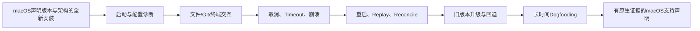

# Harnessix Code平台与运行环境

## 1. 支持等级定义

| 等级 | 定义 |
|---|---|
| 产品支持 | 正式发行物安装、启动、Coding Tool、终端/进程、Sandbox、升级、恢复和真实Beta均达到发布门禁；不要求专用安装器或自动更新 |
| 候选可用 | 关键纵向切片在原生平台测试，但发行、长期运行或部分能力仍缺失 |
| 库级可用 | 合同或底层端口可导入/调用，不代表默认产品装配 |
| 失败关闭 | 入口主动拒绝，不尝试使用不安全的降级实现 |
| 未验证 | 没有足够证据，不能推断行为 |

“CI存在该操作系统Job”只能证明该Job列出的测试，不自动升级为产品支持。

## 2. 首发目标与当前判定

首发以[范围收敛计划](../changes/m09-to-v1-release-scope-convergence.md)的活动优先级及R4/R5验收为准，采用统一Wheel通道。首版本仅交付macOS（macOS only）；Linux/Windows版本交付已从当前任务、必需矩阵、退出条件及依赖中删除，不标完成，不是延期必做项，也不自动列入1.1或1.x。未来重启须单独立项，无当前必做承诺。

| 首发目标 | Python | 必需验证 | 当前判定 |
|---|---|---|---|
| macOS（具体版本/架构逐项核定） | 经验证的3.12补丁 | 脱离源码安装、原生Git编码闭环、进程、必要受管Container后端、手动升级、匹配Key备份恢复及Beta | 当前主线已在macOS 27.0.1 arm64完成源码外安装、恢复和不同版本转换；其余门禁未关闭 |

原macOS ARM64目标保留，仍须对应架构的原生验收；Intel x86_64与Apple Silicon ARM64证据不能互相代替，不因“macOS only”就声明所有macOS版本或双架构全覆盖。
当前Mac原生组件为正式内部候选、非默认Writer，R4未完成；组件回归不等于安装或产品支持。R3原完整20 Trial及原评分/限制、Mac安全/恢复与Beta真实业务验收不放松，商业发布仍为**NO-GO**。

最近固定Revision `ffdc641`的[CI 36359755491](https://github.com/carrie1988/Harnessix/actions/runs/36359755491)
不是全矩阵成功。已关闭0.9.3d三平台Soak保持原结论，不替代当前候选的安装、模型质量及真实Beta。
其他macOS版本、CPU架构、Python 3.13正式发行、多安装器、自动更新与正式Agent镜像作为1.1+候选，不包含已取消的Linux/Windows版本交付；
现有额外CI回归可以保留，但不扩大正式支持声明。

### 2.1 历史候选矩阵

以下矩阵保留0.9.1d固定版本的能力边界，仅用于追溯，不作为当前候选的最新装配清单或首发要求。

| 能力 | Linux | macOS | Windows | Container |
|---|---|---|---|---|
| Python基础包/Coding Agent | CI主路径 | 候选测试 | 选定测试 | 可构建开发命令镜像 |
| Textual View/Controller与领域交互 | CI候选 | CI候选 | CI候选 | 非容器默认入口 |
| `harnessix code`完整子进程链 | CI候选 | CI候选 | 原生读取与本地NTFS审批写链候选；完整终端待验收 | 当前镜像未装配 |
| `agent-server`默认入口 | 候选可用 | 候选可用 | 原生读取与NTFS Patch候选；显式Git失败关闭 | 当前镜像未装配 |
| 只读Coding Tool | POSIX实现 | POSIX实现 | Win32 Handle实现文件/搜索及可信完整快照读取 | 需显式宿主装配 |
| Workspace安全观察 | POSIX FD/no-follow | POSIX FD/no-follow | Win32 Handle/Reparse Point端口 | 取决于宿主/挂载 |
| Process Supervisor | Session/Process Group | Session/Process Group | Job Object/ConPTY候选 | Container Owner可显式装配 |
| 普通文件事务发布 | POSIX候选 | POSIX候选 | 固定父链、同目录NT Rename与只观察恢复；本地固定NTFS限制 | 取决于挂载语义 |
| Git Worktree/Commit | 跨平台候选 | 跨平台候选 | 跨平台候选 | 需Git和持久卷 |
| Git Push | 本地bare remote受控验证 | 同类逻辑 | 平台测试有限 | 公网认证未开放 |
| 强Container Sandbox | Docker兼容后端 | Docker兼容后端 | 后端能力依赖宿主 | 容器内再嵌套不默认支持 |
| 正式安装器/自动更新 | 未实现 | 未实现 | 未实现 | 无签名发布镜像 |

当前没有桌面平台达到完整1.0“产品支持”等级。Windows
原生Handle四项只读Tool已经由[CI 34735529084](https://github.com/carrie1988/Harnessix/actions/runs/34735529084)
验证，Product Preflight、`agent-server`和`harnessix code`不再由POSIX平台门拒绝。后继
[原生Git读取候选](../changes/m09-r4-windows-native-git-read.md)允许实际EXE绑定，不再统一拒绝显式Git；
历史读取证据不能外推到写入、Process、Delivery、安装或长期终端稳定性。
后继`87f9353`已经独立补齐本地NTFS普通文件与默认审批专项，见[固定版本报告](../validation/windows-native-file-transactions-2026-09-28-v1/README.md)；
该报告仍不关闭Windows完整产品或消费者目标OS验收。

## 3. CI证据矩阵

首发[发行安装矩阵](../../.github/workflows/installed-product-acceptance.yml)仅有macOS；`canonical-wheel`的Ubuntu Job是纯Python制品构建宿主，不是Linux安装交付。
下列普通`ci.yml`跨平台兼容回归继续保留，与历史测试结果一样，不构成Linux/Windows首发任务或支持承诺。影响macOS的共用缺陷仍须处置，不能因取消其他平台交付豁免。

| Job | OS/服务 | Python | 覆盖边界 |
|---|---|---|---|
| `python` | Ubuntu | 3.12、3.13 | 锁定依赖、Ruff、Readability、Mypy、全量Pytest与离线示例 |
| `coding-tools-macos` | macOS | 3.12 | Tool、Artifact、Patch、Process、Eval、Context、Execution、Workspace、Sandbox、Secret、Delivery、扩展与配置选集 |
| `windows-trusted-execution` | Windows | 3.12 | 治理、Workspace、Execution、Sandbox、Process、Delivery、Trusted Action、扩展与产品配置选集 |
| `container-sandbox` | Ubuntu + 固定BusyBox Digest | 3.12 | 真实Container Sandbox集成 |
| `documentation` | Ubuntu | 3.12 | 文档静态门禁、治理测试及变化Mermaid渲染 |

0.9.1a已经把Client State、Projection和Recoverable Session纳入Linux全量、macOS及Windows矩阵。0.9.1b新增的
Controller、Textual无头View、CLI和stdio恢复已由
[CI 34721082419](https://github.com/carrie1988/Harnessix/actions/runs/34721082419)完成Linux Python 3.12/3.13、macOS、
Windows、PostgreSQL、Container与文档矩阵验收。该证据只证明基础产品链的CI候选状态，不代表正式安装器、真实终端
长期运行或Windows完整产品链已经完成。

CI定义以[`.github/workflows/ci.yml`](../../.github/workflows/ci.yml)为准。0.9.1d已把Windows真实`agent-server`启动、
四项Tool、长路径、Junction、ADS、保留名、硬链接和关闭场景加入`windows-trusted-execution`，并由
[CI 34735529084](https://github.com/carrie1988/Harnessix/actions/runs/34735529084)完成验收。当前主线
`84a682c1b399575f213f7bd3ea1e289d444721fd` 已在 macOS 27.0.1 arm64／Python 3.12.7 本机以同一
`1.0.0rc1` Wheel 完成源码外安装、备份恢复、卸载重装及 `0.1.0 ↔ 1.0.0rc1` 不同版本转换；
原件位于本机 `verification-working/r4-current-main-install-20261011-v4` 和
`verification-working/r4-current-main-upgrade-20261011-v1`。当前仍缺默认原生Git Writer、真实终端交互、
对应Revision的正式发行工作流和小批Beta；Linux/Windows交付不在当前未完成清单中。
同一安装件另在固定无网络容器完成工程Task Pack v2的10 Case／20 Trial确定性编码链，任务与必需测试
均20/20、人工干预0，并通过两个发布崩溃窗口恢复；该结果只证明已安装代码的离线编码执行能力，
不代表真实Provider质量、默认stdio入口或Beta通过。
网络文件系统、多安装器和额外架构不自动进入首发支持范围；Mac具体OS/架构仍需R4实际安装验证。

## 4. 文件系统要求

### 4.1 POSIX

- Product Config必须为当前UID拥有的普通文件、硬链接数1、Group/Other无权限；
- Agent状态目录必须为当前UID拥有的真实目录，Mode最终为`0700`；
- Workspace与状态目录不能互相包含；配置文件不能位于Workspace；
- Coding Tool使用目录FD和`O_NOFOLLOW`，拒绝Symlink并在读取前后验证对象漂移；
- Session使用本地文件锁和SQLite WAL，不应部署到NFS或跨主机共享目录；
- 受管文件发布依赖POSIX对象和目录同步语义。

### 4.2 Windows

以下保留已实现端口的技术与安全边界，不构成Windows版本交付任务。

- Workspace观察通过Win32 Handle、File ID和Reparse Point检查提供底层能力；
- Process通过挂起创建、不可Breakaway Job Object和ConPTY管理进程树；
- 普通文件事务复用原父句柄链，拒绝Reparse/Junction、特殊属性、附加流与不一致权限；只接受本地固定NTFS；
- 同目录名称提交采用NT源句柄语义；替换源不共享Write，只额外共享Delete，提交前复核原File ID；
- 逻辑模式仅0644，不模拟POSIX可执行位；不是针对不合作同UID写者的原子CAS或硬件掉电保证；
- Product Config的POSIX Owner/Mode检查在Windows不执行；
- 0.9.1d固定版本默认入口装配四项Windows只读Tool；当时Git、普通目录写与完整Delivery失败关闭，不代表后续候选已通过原生写入验收。

Windows读取及文件事务入口必须使用`WindowsWorkspaceRoot`的逐段Handle、Final Path、File ID和Reparse检查；不得替换为
字符串前缀或把POSIX权限位映射到Windows。若未来单独立项重启Windows交付，须重新评审配置/状态/Key ACL及实际Wheel来源、校验和安装要求；当前无此发行任务。

### 4.3 大小写与Unicode

路径权限判断必须使用平台原生规范化、对象身份和Workspace Snapshot，不只做字符串前缀比较。Windows通常大小写不敏感，
macOS默认文件系统也可能大小写不敏感；测试环境需要同时覆盖大小写敏感和不敏感行为。当前完整文件系统矩阵尚未建立。

## 5. 进程与终端

| 平台 | Owner机制 | 取消 | PTY |
|---|---|---|---|
| Linux/macOS | 新Session/Process Group | 信号进程组并等待回收 | POSIX PTY候选 |
| Windows | Suspended Process + Job Object | 终止Job并核对回执 | ConPTY候选 |
| Container | 宿主容器CLI与持久Owner账本 | 通过容器生命周期停止 | 默认非交互，取决于Profile |

上表是既有端口机制，不是首发交付矩阵。首发macOS Process合同必须验证启动前Plan、环境白名单、输出预算、Timeout、取消、进程树、Owner Lease、回执和重启恢复。
只验证`subprocess` Exit Code不足以证明平台支持。

0.9.1b TUI以Textual 8.2.8的`App.run_test()`验证按键、会话选择、Composer、Resize和Context退出，不依赖真实TTY。
该证据证明View/Controller合同，不证明平台终端全部键盘布局、IME、Shell启动、睡眠唤醒或长时间交互。macOS真实终端、安装及
真实Beta属于R4/R5，不要求额外专用安装器。

## 6. Sandbox与网络

- 强隔离依赖显式探测通过的Docker兼容后端和固定镜像Digest；
- Container argv不经Shell字符串拼接；
- 网络默认关闭，启用时需绑定Profile、DNS快照和Egress规则；
- 宿主进程模式不是强Sandbox；
- Docker Desktop、Linux Docker Engine和Windows容器/WSL的网络、卷及PID语义不同，不能相互外推；
- 0.9.1d固定版本`agent-server`只装配本地只读Coding Tool；正式候选的执行装配和平台验收按R1/R4单独核对。

真实Container集成见[`tests/integration/test_container_sandbox.py`](../../tests/integration/test_container_sandbox.py)。

## 7. 数据库与网络拓扑

### 7.1 SQLite

SQLite用于Agent Session和多种专用账本。每个Store的并发和锁合同不同；Session明确采用
单Runtime Owner。旧Action Journal只作为迁移归档，不进入产品启动。不要在共享网络盘或多个主机间复用SQLite路径。

### 7.2 PostgreSQL

PostgreSQL 17不再是Harnessix Code 1.0运行或CI依赖。0.9.1f3已删除旧Action Worker兼容回归，
历史Schema仅按[归档策略](legacy-action-archive.md)保留；新增产品部署不得建立多Worker Action Journal。

### 7.3 外部Provider

Provider端点必须为无用户信息、Query或Fragment的HTTPS URL。平台信任库、代理、DNS和企业TLS拦截会影响行为；
当前配置没有CA Bundle、Proxy和端点—凭据—Egress统一合同，必须在目标环境单独验收。

## 8. 容器运行要求

当前[`Dockerfile`](../../Dockerfile)只构建非Root开发命令镜像，默认执行`harnessix --help`，不监听端口、
不声明Action数据库Volume，也不启动`serve/worker`。它不是正式Coding Agent发行镜像。
正式Agent镜像延期1.1+，未来发行前再补Workspace/状态卷、Provider和Sandbox边界、资源、网络、来源/SBOM及升级证据；
首发受管Container Sandbox后端仍须验证，不能与Agent发行镜像混为一项。

## 9. 平台验收要求

```mermaid
flowchart LR
    Install[macOS声明版本与架构的全新安装] --> Start[启动与配置诊断]
    Start --> IO[文件/Git/终端交互]
    IO --> Failure[取消、Timeout、崩溃]
    Failure --> Recover[重启、Replay、Reconcile]
    Recover --> Upgrade[旧版本升级与回退]
    Upgrade --> Soak[长时间Dogfooding]
    Soak --> Claim[有原生证据的macOS支持声明]
```

首发仅对声明支持的macOS版本/架构独立覆盖以下要求；Linux/Windows不在当前验收矩阵中，影响macOS的共用安全/恢复缺陷仍须处置：

1. 安装、升级、卸载和权限；
2. 路径大小写、Unicode、长路径、Symlink、Hardlink和TOCTOU；
3. Pipe/PTY、进程树、Signal/Process Group、Timeout和强制取消；
4. Git路径、Hook禁用、配置隔离和Credential不继承；
5. SQLite WAL、锁、备份和崩溃恢复；
6. Provider TLS、证书、DNS、代理和断网；
7. Sandbox能力探测、网络隔离和资源限制；
8. 长会话、磁盘耗尽、系统睡眠/唤醒和异常关机。

## 9.1 历史默认Workspace Patch平台矩阵

以下是0.9.1阶段默认端口边界，不是当前交付任务；首发macOS的Git仓库写入和完整编码闭环以R4候选证据为准。
后继Windows本地NTFS端口由第2节与专项报告描述，不应继续按以下历史表推断当前Catalog。
新增文件系统后端及通用目录维护平台继续延期，不降低既有主链的取消、恢复、审批和回归要求。

| 平台 | 默认能力 | 安全端口 | 当前结论 |
|---|---|---|---|
| macOS | `apply_patch_batch`可验证后广告 | POSIX目录描述符、`O_NOFOLLOW`、原子替换、目录`fsync` | 实现与本地回归完成，仍需目标Revision CI关闭 |
| Linux | `apply_patch_batch`可验证后广告 | 同上，另需发行环境文件系统验证 | 实现与本地回归完成，仍需目标Revision CI关闭 |
| Windows | 不广告Patch | 仅原生Handle只读端口 | 写入失败关闭，不允许Python路径或Shell回退 |

POSIX测试同时覆盖Unicode、创建/替换/删除、链接拒绝、Lease竞争、取消后的部分效果与Snapshot漂移。网络文件系统、FUSE、云同步目录和同UID恶意进程仍不在当前安全证明内；这些环境不得仅因操作系统名称匹配而推断受支持。

## 10. 源码与测试映射

| 平台职责 | 源码 | 测试 |
|---|---|---|
| 启动Preflight与平台选择 | [`product_config/preflight.py`](../../src/harnessix/product_config/preflight.py)、[`tools/runtime.py`](../../src/harnessix/tools/runtime.py) | [`test_server_and_cli.py`](../../tests/product_config/test_server_and_cli.py)、[`test_windows_native_runtime.py`](../../tests/tools/test_windows_native_runtime.py) |
| Workspace对象安全 | [`workspace/snapshot.py`](../../src/harnessix/workspace/snapshot.py)、[`workspace/windows.py`](../../src/harnessix/workspace/windows.py) | [`tests/workspace`](../../tests/workspace/) |
| Process Owner | [`processes/supervisor.py`](../../src/harnessix/processes/supervisor.py)、[`processes/windows_owner.py`](../../src/harnessix/processes/windows_owner.py) | [`tests/processes`](../../tests/processes/) |
| Container Sandbox | [`sandbox/container.py`](../../src/harnessix/sandbox/container.py) | [`test_container_sandbox.py`](../../tests/integration/test_container_sandbox.py) |
| POSIX交付 | [`delivery/filesystem.py`](../../src/harnessix/delivery/filesystem.py) | [`test_filesystem.py`](../../tests/delivery/test_filesystem.py) |
| Git交付 | [`delivery/git.py`](../../src/harnessix/delivery/git.py) | [`test_git.py`](../../tests/delivery/test_git.py) |
| Windows只读Tool适配 | [`tools/windows_read.py`](../../src/harnessix/tools/windows_read.py)、[`tools/windows_read_port.py`](../../src/harnessix/tools/windows_read_port.py)、[`tools/windows_search.py`](../../src/harnessix/tools/windows_search.py) | [`test_windows_read_adapter.py`](../../tests/tools/test_windows_read_adapter.py)、[`test_windows_native_runtime.py`](../../tests/tools/test_windows_native_runtime.py) |
| TUI平台中立层 | [`product_ui/controller.py`](../../src/harnessix/product_ui/controller.py)、[`product_ui/app.py`](../../src/harnessix/product_ui/app.py) | [`tests/product_ui`](../../tests/product_ui/) |

## 11. 当前风险

- Windows文件事务专项原生证据保留，但不等于Windows完整产品支持；其版本交付不再属于当前R4，也不转为延期必做项；
- 既有0.9.1交互及0.9.3d Soak证据保留，但TUI仍需小批真实用户终端和正式发行物验证；
- macOS当前主线统一Wheel已完成一次本机源码外安装、恢复、不同版本转换及确定性离线编码链，但正式工作流发行、默认原生Git Writer、真实Provider质量和真实Beta仍未关闭；
- CI Runner不能覆盖真实用户终端、安全软件、代理、企业证书和文件系统差异；
- 正式Agent镜像延期，不阻断首发；实际发布Wheel及Container执行后端的必要门禁保留；
- Mac资格逐OS/架构实测，原ARM64目标不预判通过，也不自动扩为Intel与Apple Silicon全覆盖；网络文件系统及特殊离线环境没有正式支持承诺；
- Provider网络与系统代理/证书缺少统一配置合同。

## Windows原生Git读取候选边界

以下仅说明已有实现与证据边界，不派生当前Windows交付或验收任务。

显式`--git-executable`进入原生Git读取候选，必须绑定本机Git for Windows绝对普通EXE。
实际宿主Doctor核对原生EXE及Process Owner；模拟平台结果不算能力证明。
只开放固定Status/Diff，拒绝可执行Filter/Include，关闭子模块辅助查询；
不开放任意Git命令、自动Commit/Push或一般宿主Shell。
状态、取消、备份与原生测试入口见[详设](../changes/m09-r4-windows-native-git-read.md)。
本项不改变历史验收结论，也不关闭当前macOS R4完整编码、脱离源码安装、升级及Beta边界。
