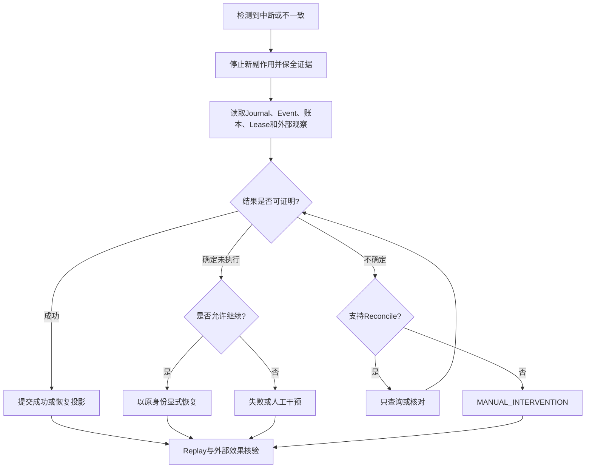

# Harnessix Code故障恢复

## 1. 恢复原则

恢复目标不是“让任务继续跑”，而是在不重复未知副作用的前提下，根据持久事实把Action、Turn、Tool、Process和交付
收敛到可解释状态。恢复必须遵守：

1. Journal/Event/专用账本和外部系统观察共同决定结果；
2. 只有确定未执行或具有稳定幂等身份的操作才能继续；
3. 效果可能发生但结果未持久化时保持`UNKNOWN`或`interrupted`并对账；
4. 审批只对原计划、原资源Snapshot和原身份有效；
5. 进程重启不自动扩大权限、刷新Deadline或重发外部请求；
6. 恢复证据和原始失败记录必须保留。

## 2. 故障分类

| 故障 | 可观测事实 | 默认处理 |
|---|---|---|
| API进程退出 | Journal已提交状态仍存在 | 重启后Readiness检查；不重建Action身份 |
| Worker在Claim前退出 | Action仍为`READY` | 其他Worker可Claim |
| Worker在执行中退出 | Lease到期，原调用结果未知 | `recover_expired`转`UNKNOWN`，随后Reconcile |
| Agent在Provider前退出 | Turn可能仍为deferred `ACCEPTED` | 显式`thread/resume`或`turn/resume`继续 |
| Agent在模型流中退出 | 已有模型事件但终态未完成 | 启动恢复为`INTERRUPTED`，不自动重发 |
| Agent等待审批/输入时退出 | 请求已持久化 | 重开后继续等待；Deadline耗尽则失败 |
| Patch/批次执行中退出 | 专用计划、成员和游标存在 | 只观察文件与账本后收敛，不盲目重写 |
| Process Owner丢失 | Lease、PID/Job与回执可能不一致 | 有界观察；无法证明时`UNKNOWN` |
| Workspace发布/Commit中断 | 事务游标、Git状态和对象存在 | Reconcile为published/committed/diverged/unknown |
| Git Push响应丢失 | 远端ref可能已更新 | 使用固定ref和lease查询，禁止直接再Push |
| 配置激活冲突 | 活动配置CAS不匹配 | 关闭新Runtime，重新读取活动指针后决策 |
| SQLite损坏/迁移失败 | 初始化错误 | 停止服务，从一致备份恢复，不跳过检查 |
| Store Maintenance中断 | Plan、Backup摘要和`next_ordinal`已持久化 | 使用同一Plan与Backup续跑；不重新选择候选 |

## 3. 恢复决策流程

“可证明”必须由稳定身份、持久事件和外部事实共同支持，不能由日志缺失、进程不存在或操作员直觉推出。

## 4. 旧Action Plane归档恢复边界

独立Action API/Worker源码已删除，不是当前产品恢复入口。旧SQLite/PostgreSQL Journal必须保持停写并先做一致
备份；不得为了“处理完队列”重新暴露`serve/worker`，也不得把历史`RUNNING/UNKNOWN`自动回退到`READY`。

旧记录处理只允许：核对Action ID、事件序号、Lease、Receipt和外部幂等身份；能够证明的终态写入迁移报告，不能证明的
效果保持`UNKNOWN`并转人工处置。SQLite只读检查与一致归档工具、PostgreSQL停写归档流程见
[旧Action Plane状态检查与归档手册](legacy-action-archive.md)。当前Coding Agent的恢复从Agent Session和
`TrustedActionRouter` Route State开始，见后续章节。

## 5. Agent Runtime恢复

### 5.1 启动扫描

`AgentRuntime.__aenter__`取得单Runtime Owner，初始化Session并扫描具有`active_turn_id`的Thread：

| Turn状态 | 启动行为 |
|---|---|
| deferred `ACCEPTED` | 保留，等待客户端显式恢复 |
| `WAITING_INPUT`且Deadline有效 | 继续等待持久Answer |
| `WAITING_INPUT`且Deadline耗尽 | 失败为`time_budget_exceeded` |
| 安全的Question Tool等待 | 保留等待 |
| Process Action待创建/审批 | 使用稳定身份恢复准入，或缺少端口时保留原状态 |
| `WAITING_ACTION` | 保留，等待显式`resume`做有界观察 |
| `WAITING_APPROVAL`且有效 | 继续等待原审批 |
| 其他开放执行 | 收敛为`INTERRUPTED/process_interrupted` |

恢复不会自动调用Provider重生成模型响应。客户端通过Agent Protocol或薄CLI显式`thread/resume`、`turn/resume`、
`turn/retry`或回答原审批/问题。

### 5.2 Retry不是恢复

`turn/retry`创建新的Turn身份并保留源Turn历史，适用于确定终态后的新尝试；`turn/resume`继续已持久化且合同允许恢复的
原Turn。对不确定效果使用Retry可能产生重复副作用，必须先完成原Turn对账。

### 5.3 连接断开

stdio客户端断开不等于取消Turn。权威文本和状态通过Session Replay恢复；live-only Delta溢出或丢失时客户端读取完整
Item，而不是拼接猜测。重新连接必须保留`clientInstanceId`和命令`requestId`，避免同一用户意图获得新身份。

## 6. Patch与批次恢复

单文件和批次Patch在执行前保存计划、Baseline、Approval和调用身份。恢复时：

1. 使用原`plan_id`/`batch_id`读取专用账本；
2. 通过安全文件入口观察受管副本，核对Pre/Post Revision；
3. 已提交成员保持已发生，不因后续文件变化抹掉历史；
4. 未开始成员不自动执行；
5. 无法区分“效果发生/未发生”时返回`unknown`；
6. 结果以`origin="recovery"`进入Agent Item，不伪装为正常执行；
7. 源Workspace不会因受管副本恢复自动改变。

批次顺序效果不是跨文件原子事务。恢复后可能得到部分已应用结果，必须由上层显式决定后续交付。

## 7. Process恢复

Process Supervisor以Owner、Lease、平台进程树和签名回执判断结果：

- POSIX使用Session/Process Group；Windows使用挂起创建、Job Object和ConPTY；Container执行绑定同一Owner生命周期；
- 取消必须终止进程树并回收Pipe/PTY；
- Owner丢失但有可验证完成回执时可提交终态；
- 进程不存在不证明命令未产生效果；
- 不能验证Owner或效果时保持`UNKNOWN`；
- Agent侧对`WAITING_ACTION`只做显式有界观察，不在启动时后台轮询或再次启动命令。

当前默认`agent-server`只装配外部Action Config中通过强Container能力证明的固定Process Profile；任意Host Process与旧兼容Saga仍不进入产品目录。

## 8. Workspace Transaction与Git恢复

### 8.1 文件发布

Workspace Transaction保存期望文件、私有Blob、Snapshot和发布游标。`reconcile`观察目标树，收敛到：

- `published`：所有目标与计划一致；
- `interrupted`：只有计划前缀完成且剩余仍满足Precondition；
- `diverged`：外部修改与计划冲突；
- `unknown`：无法安全观察。

只有`interrupted`且Precondition继续成立时才能从原游标恢复。Rollback创建新事务，不逆写历史。

### 8.2 Git Commit

受管Worktree、Checkpoint和Commit都绑定Repository Snapshot。Commit中断后检查Index、HEAD、对象和计划身份；
无法证明时进入`diverged`或`unknown`。不得使用`git reset --hard`掩盖来源漂移。

### 8.3 Git Push

Push与Commit分离，使用单ref和exact lease。响应丢失后查询远端ref：

- 已等于目标OID：记录成功，不再次Push；
- 仍等于预期旧OID：可在策略重新准入后决定是否继续；
- 为其他OID：`diverged`；
- 无法查询：保持`UNKNOWN`。

## 8.1 默认Workspace Patch恢复

默认POSIX Patch用同一`plan_id`关联Execution Plan、Action Audit、Delivery Transaction、Review Artifact和Workspace Lease。恢复前必须保留整个State Root及原Workspace，不得单独删除数据库、Blob、临时文件或审批事件。

| 可观察事实 | 允许结论 | 禁止操作 |
|---|---|---|
| 全部成员等于before且游标为0 | 未应用，可保留原终态并重新发起新提案 | 用旧批准再次执行 |
| 全部成员等于after | Reconcile可证明published/succeeded | 再次写入相同成员 |
| 严格after前缀、before后缀 | `manual_intervention/delivery_partial_effect` | 自动提交剩余成员 |
| 第三正文、类型变化或无法观察 | diverged/unknown | 猜测成功、覆盖外部修改 |
| Artifact存在但Session无引用 | 未授权孤儿，公共读取为not_found | 手工添加审批引用 |

e5在`agent-server`开放stdio前全局扫描`builtin/harnessix.product`来源Route。它按上一活动Action配置重建精确Binding，先把
`running/reconciling`持久转为`unknown`，再对每个UNKNOWN只调用一次Reconcile；仍未知、旧Binding缺失或候选不能承接
`pending_approval/ready`时启动失败。恢复不会调用Execute，也不会自动续写部分Patch。该能力已由CI 35439332019验收关闭。

0.9.3c在该流程前增加双层Owner与跨Store完整性扫描：最外层`product-action-runtime.lock`必须在任一Action Store/Process Owner
打开前取得；组合根在锁内幂等初始化绑定的Session Schema与Artifact索引，Action Audit随后递增持久Generation并校验全部产品写入。
这避免Eval/Container组合在Agent Runtime尚未打开时因Session表不存在而失败。扫描修复Route内嵌Plan可以确定重建的Execution Plan缺口，
拒绝Plan冲突与Session悬空引用，报告无Session引用Route和Action Artifact孤儿，并对无匹配非终态Route的Active Process Lease
调用既有Reconcile后失败关闭。Scan和Startup Recovery两份低敏报告均在stdio开放前写入`product-config.db`。

## 9. Product Config恢复

配置迁移会保留内容寻址的Product Config v1备份。激活失败时Provider、Tool和Runtime逆序关闭，Product与Action两个原活动指针均不变。恢复步骤：

1. 停止失败的新进程；
2. 保存迁移收据和脱敏诊断；
3. 校验源文件摘要及备份摘要；
4. 必要时恢复旧配置文件和对应配置审计/Session备份；
5. 重新运行`code doctor`并同时检查Product/Action摘要与能力报告；
6. 确认上一Action配置仍能重建旧Route的Engine、镜像、Owner、Sandbox和Secret版本证据；
7. 使用Product摘要/Profile及Action摘要三个预期值启动，避免覆盖并发变更。

只恢复一个配置文件而保留不匹配的Session/活动双指针或Action Audit，可能导致模型Profile与执行权限来自不同发布代际。两个配置
活动指针、Action快照/事件和恢复报告位于同一`product-config.db`，备份与还原必须作为一个文件处理。

## 10. 数据损坏与备份恢复

遇到`wrong_database`、`schema_too_new`、`invalid_migration`、`migration_changed`或`database_corrupt`：

1. 立即停止写入和自动重启循环；
2. 保存原文件及WAL/SHM、错误码、版本和摘要；
3. 在副本上运行只读完整性与Migration检查；
4. 不修改表或Migration行“修复”生产原件；
5. 从已验证的一致备份恢复所有相关账本；
6. 重放并核对领域Snapshot、开放工作和外部效果；
7. 根因关闭并加入回归后再恢复服务。

### 10.1 Session共库Maintenance恢复

Maintenance有两种恢复，不得混淆：

1. **继续执行**：Plan状态为`running`时，验证调用方仍提供Progress记录的同一Backup摘要，从`next_ordinal`继续；每个已提交
   业务批次和游标同步存在，因此不需要猜测或重放已完成Item；
2. **完整回滚**：在静默窗口调用`SQLiteStoreMaintenance.restore(backup)`，验证Application ID、`quick_check`和SHA-256，
   Checkpoint当前WAL后把备份复制到同目录临时文件并原子替换，再重新初始化和扫描容量。

Plan为`planned`但备份已存在，通常表示进程退出发生在备份原子发布后、Progress启动提交前；只有该备份包含同一Plan及Payload
摘要时才能复用。Plan/Item/Progress损坏、备份不同或Schema变化必须失败关闭。Restore会丢弃备份之后的新Session、Request和
Artifact事实，不是数据合并；相关Action/Delivery/Process等其他数据库仍需按同一恢复点独立核对。

当前没有公共恢复CLI，生产宿主接入前必须实现停止新命令、排空同进程业务调用、权限确认和备份保留。完整故障窗口见
[0.9.3b详细设计](../changes/m09-3b-persistent-capacity-and-retention.md)。

## 11. 恢复验收

| 场景 | 必要断言 |
|---|---|
| Worker崩溃 | 过期Lease转`UNKNOWN`，效果次数不增加，对账收敛 |
| Agent崩溃 | 等待状态保留，其余开放执行中断，不自动Provider重发 |
| 审批重开 | 原Fingerprint和身份有效，替换计划被拒绝 |
| Patch崩溃 | 文件事实、账本游标和Agent恢复Item一致 |
| Process崩溃 | 进程树无泄漏；无法证明的效果保持未知 |
| 发布崩溃 | 部分发布可识别，外部漂移不被覆盖 |
| 配置冲突 | 新Server不开放stdio，原活动配置保持不变 |
| Action启动恢复 | 中断Route只Reconcile一次且execute次数为零；仍未知时stdio不开放 |
| Action Owner接管 | 第二产品/Audit宿主失败；新Generation拒绝旧Owner迟到提交 |
| Action Operation中断 | Executor返回后Audit故障只把Operation标为interrupted并转UNKNOWN，不再次Execute |
| 跨Store扫描 | 缺失Plan可修复；冲突、Session悬空和Process孤儿失败；Artifact孤儿只报告 |
| 双配置冲突 | Product或Action任一CAS失败时两个活动指针均保持旧值 |
| 数据恢复 | 备份可迁移、Replay一致、旧Reader按合同拒绝 |
| Maintenance恢复 | 备份发布故障可复用；批次提交后从精确Ordinal继续；完整Restore恢复Thread/Artifact/Request |

## 12. 源码与测试映射

| 恢复域 | 源码 | 测试 |
|---|---|---|
| 旧Action归档核对 | [`archive_legacy_action_state.py`](../../scripts/archive_legacy_action_state.py)、[归档手册](legacy-action-archive.md) | [`test_legacy_action_archive.py`](../../tests/governance/test_legacy_action_archive.py)；不作为产品恢复入口 |
| Agent启动恢复 | [`agent/runtime.py`](../../src/harnessix/agent/runtime.py)的`_recover` | [`test_crash_recovery.py`](../../tests/agent/test_crash_recovery.py)、[`test_interactions.py`](../../tests/agent/test_interactions.py) |
| Patch | [`patches/managed.py`](../../src/harnessix/patches/managed.py)、[`patches/batch_execution.py`](../../src/harnessix/patches/batch_execution.py) | [`tests/patches`](../../tests/patches/) |
| Process | [`processes/supervisor.py`](../../src/harnessix/processes/supervisor.py) | [`tests/processes`](../../tests/processes/) |
| 文件交付与默认Patch | [`delivery/filesystem.py`](../../src/harnessix/delivery/filesystem.py)、[`delivery/trusted_action.py`](../../src/harnessix/delivery/trusted_action.py) | [`tests/delivery`](../../tests/delivery/)、[`test_trusted_action_patch.py`](../../tests/delivery/test_trusted_action_patch.py) |
| 产品Action冷启动恢复 | [`product_config/action_owner.py`](../../src/harnessix/product_config/action_owner.py)、[`product_config/action_runtime.py`](../../src/harnessix/product_config/action_runtime.py)、[`product_config/action_recovery.py`](../../src/harnessix/product_config/action_recovery.py)、[`product_config/action_store.py`](../../src/harnessix/product_config/action_store.py) | [`test_action_runtime.py`](../../tests/product_config/test_action_runtime.py)、[`test_action_recovery.py`](../../tests/product_config/test_action_recovery.py)、[`test_action_config_runtime.py`](../../tests/product_config/test_action_config_runtime.py) |
| Session共库Maintenance | [`session/maintenance.py`](../../src/harnessix/session/maintenance.py)、[`session/maintenance_backup.py`](../../src/harnessix/session/maintenance_backup.py)、[`session/maintenance_execution.py`](../../src/harnessix/session/maintenance_execution.py) | [`test_store_maintenance.py`](../../tests/agent/test_store_maintenance.py) |
| Git Push | [`delivery/git_push.py`](../../src/harnessix/delivery/git_push.py) | [`tests/delivery/test_git_push.py`](../../tests/delivery/test_git_push.py) |

## 13. 已知限制

当前没有统一恢复CLI、支持包、在线状态检查器、远程效果适配器目录或RPO/RTO承诺。0.9.3c已有产品Action跨Store启动扫描和
双层跨进程Owner，但只处理产品内置来源，不接管MCP、Skill、Hook或自定义宿主Route；扫描规模、Operation归档、UNKNOWN告警和
用户可见人工处置仍未完成。生产部署必须在0.9后续切片补齐操作权限、确认步骤、审计和真实故障演练后，才能把本设计转换为
稳定运维产品能力。
