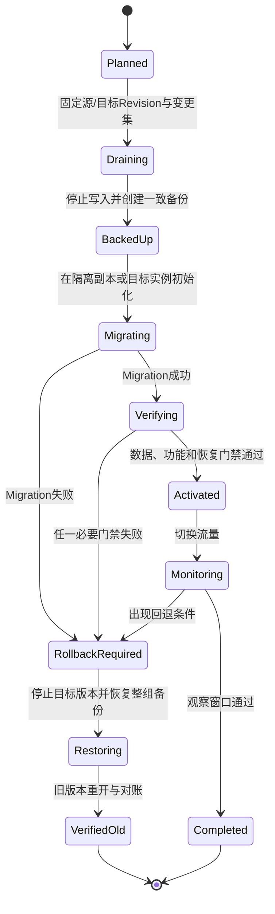

# Harnessix Code升级与回退

## 1. 目标与边界

升级必须保留领域事件原字节、持久状态语义、审批绑定、外部效果身份和失败分类。当前实现提供若干组件级Migration，
但没有统一在线升级器、数据库协调器或自动回退命令；正式升级必须由部署层停止入口、制作一致备份、逐组件迁移并验收。

历史Session v1～v21、Patch账本和里程碑命令见[部署里程碑历史](../deployment-milestone-history.md)。本文只描述当前
Revision支持的操作规则。

## 2. 受管状态与迁移能力

| 状态 | 当前Schema机制 | 自动升级 | 降级策略 |
|---|---|---|---|
| Agent Session `sessions.db` | `agent_migrations(version, checksum)`，当前资源到0022 | 初始化时同一事务顺序执行 | 不支持Down Migration；恢复升级前完整备份 |
| Action SQLite Journal | `schema_migrations(version)`，当前资源到0002 | 初始化时按编号执行 | 恢复备份；当前不校验Checksum/更高未知版本 |
| Action PostgreSQL Journal | 同上；事务内Advisory Lock | API/Worker初始化时串行执行 | 恢复数据库备份或切回旧集群 |
| Product Config源 | v1/v2严格JSON与源摘要CAS | 只通过显式`config migrate` | v1备份文件或配置管理系统版本 |
| Product Config审计库 | 内部SQLite表和Hash链 | Store初始化 | 与对应配置源和Session一起恢复 |
| Patch/Process/Delivery/扩展账本 | 各模块专用版本或表 | 取决于宿主显式装配 | 必须按模块设计做整组备份和对账 |

Action Journal与Agent Session是不同存储合同，迁移强度不同。不能把Session的Checksum、`schema_too_new`和
`quick_check`能力外推到Action Journal。

## 3. 升级状态机



任何阶段出现`UNKNOWN`外部效果时，不进入自动Rollback执行链；先按[故障恢复](recovery.md)对账。

## 4. 升级前准备

1. 固定源Revision、目标Revision、Python版本、`uv.lock`摘要、平台和数据库版本；
2. 阅读目标Revision的模块设计、Migration文件和兼容测试，不依赖里程碑摘要；
3. 列出Action Journal、演示效果库、Session、配置审计、Product Config、Patch/Process/Delivery账本、
   Workspace、私有CAS和外部系统；
4. 停止新请求，等待可安全完成的读取或幂等工作；
5. 记录全部`READY`、`PENDING_APPROVAL`、`RUNNING`、`UNKNOWN`、开放Turn和后台Process；
6. 对活动外部效果建立可查询身份，不能确认结果的调用转入人工对账；
7. 停止API、Worker、Agent Runtime和相关宿主，确认没有写连接或Owner Lease；
8. 创建同一逻辑时间点的一致备份并校验可读性和摘要。

## 5. SQLite备份

### 5.1 推荐方式

停写后使用SQLite Backup API复制每个数据库，不只复制主文件：

```bash
python - source.db backup.db <<'PY'
import sqlite3
import sys

source = sqlite3.connect(sys.argv[1])
target = sqlite3.connect(sys.argv[2])
try:
    source.backup(target)
finally:
    target.close()
    source.close()
PY
```

对Action Journal、演示效果库、Session、配置审计和各专用账本分别执行，并记录SHA-256。若使用文件级快照，必须
保证所有写进程已停止，并把数据库、`-wal`和`-shm`作为同一状态处理；不得只复制正在运行的主文件。

### 5.2 Agent状态一致性

`--state-directory`至少包含`sessions.db`和`product-config.db`。若宿主还装配Patch、Process、Delivery、MCP、
Skill或Hook账本，应在同一停机窗口备份。Product Config源文件不在状态目录内，也必须和其源摘要一起归档。

## 6. PostgreSQL备份

使用组织已有的事务一致性备份或`pg_dump`，示意：

```bash
pg_dump --format=custom --file=harnessix-before-upgrade.dump "$HARNESSIX_DATABASE_URL"
```

凭据通过受控环境或Secret文件提供，命令日志不得展开URL。恢复演练必须在隔离数据库执行，并验证表、Migration版本、
Action状态、事件顺序、Idempotency Key和Lease字段。数据库备份不包含外部效果系统；`UNKNOWN`仍需单独对账。

## 7. Agent Session升级

[`SQLiteSessionStore.initialize`](../../src/harnessix/session/sqlite.py)执行以下门禁：

1. 创建或验证Harnessix专用`application_id`；
2. 拒绝把其他应用的非空SQLite库当作Session；
3. 读取`agent_migrations`，拒绝当前代码不存在的更高版本和版本缺口；
4. 对已应用Migration校验SQL SHA-256，变化时返回`migration_changed`；
5. 在`BEGIN IMMEDIATE`事务内逐语句执行未应用Migration；
6. 执行`PRAGMA quick_check`，失败时返回`database_corrupt`；
7. Commit后把文件设为`0600`并启用WAL；
8. Agent Runtime通过单宿主锁阻止两个活动Runtime共享同一Session。

当前最高Migration是[`0022_interactive_turns.sql`](../../src/harnessix/session/migrations/0022_interactive_turns.sql)。
不要修改已经发布Migration文件；新增变化必须追加新编号。

验收：

```bash
uv run pytest tests/agent/test_session_upgrade.py
uv run pytest tests/agent/test_store.py
```

真正的版本升级证据应由旧Wheel创建数据库，再由新Wheel迁移并由旧Wheel拒绝更高版本；只手工创建表不等价。

## 8. Action Journal升级

SQLite和PostgreSQL Journal当前包含0001初始表与0002可观测字段。PostgreSQL在事务内获取固定Advisory Lock后迁移，
可避免多个API/Worker同时修改Schema；SQLite依赖单进程初始化顺序。

当前限制：Journal的`schema_migrations`只记录版本和时间，不保存Migration Checksum，也不拒绝数据库中存在的更高
未知版本。升级操作必须通过目标Revision集成测试和备份补足这两个缺口，不能把“初始化未报错”当作兼容证明。

验收：

```bash
uv run pytest tests/integration/test_action_service.py
HARNESSIX_TEST_POSTGRES_URL='<受控测试数据库URL>' \
  uv run pytest tests/integration/test_postgres_journal.py
```

测试数据库必须独立、可销毁且不含生产数据。

## 9. Product Config v1→v2

### 9.1 计算源摘要

```bash
python - ./private/product-config.json <<'PY'
import hashlib
import pathlib
import sys

print(hashlib.sha256(pathlib.Path(sys.argv[1]).read_bytes()).hexdigest())
PY
```

### 9.2 显式迁移

```bash
uv run harnessix config migrate \
  --config ./private/product-config.json \
  --expected-source-sha256 <64位源摘要> \
  --state-database ./private/state/product-config.db
```

迁移使用私有锁、源摘要CAS、`0600`临时文件、目录同步、原子替换和内容寻址的v1备份。源在迁移期间变化、备份同名
但内容冲突或锁不安全时失败关闭。对已是v2的文件执行返回`changed=false`，不重写正文。

迁移后必须运行：

```bash
uv run harnessix config diagnose \
  --config ./private/product-config.json \
  --state-database ./private/state/product-config.db
```

v1备份包含环境变量名但不应包含API Key；仍按私有配置保护。

## 10. 激活与灰度

Agent Server通过`--expected-active-sha256`和`--expected-active-profile`对配置审计库中的活动指针执行CAS。
推荐先在独立状态副本上诊断和打开Session，再停止旧Runtime并以预期活动身份启动新进程。当前没有并行双写或热切换，
不得让两个Runtime同时拥有一个Session。

Action Plane queued拓扑先升级数据库兼容代码，再滚动Worker和API时，必须确保新旧版本共享的Schema和事件语义经过
真实旧/新进程矩阵验证。当前仓库没有声明任意两个Revision可滚动混跑；缺少证据时使用停机升级。

## 11. 升级后验收

| 类别 | 检查 |
|---|---|
| 数据 | Migration连续、Checksum适用处一致、SQLite quick check、备份可读 |
| 行为 | Health/Readiness、只读Action、审批、取消、Thread恢复和协议握手 |
| 恢复 | 开放Turn、过期Lease、Patch/Process/Delivery中断按原语义收敛 |
| 安全 | 配置/状态权限、Secret Canary、Workspace隔离、监听地址 |
| 观测 | 日志可解析、Trace/Metric可达、错误码与Revision可关联 |
| 兼容 | 旧字节未改写；旧Reader按合同拒绝更高版本 |

## 12. 回退

回退触发条件包括Migration失败、必要行为回归、数据不一致、Secret暴露、无法解释的`UNKNOWN`增长和平台资源泄漏。
步骤：

1. 停止目标版本接收新请求；
2. 终止或隔离仍持有Lease/Owner的目标进程；
3. 保存目标版本失败证据，不覆盖升级前备份；
4. 对所有可能已发生的外部效果完成对账；
5. 恢复同一时间点的完整状态集和Product Config；
6. 启动源版本并验证Migration、Readiness、事件、Snapshot和外部效果；
7. 只有数据和效果一致后恢复流量。

禁止删除Migration行、手改Schema版本、把新事件交给旧Reader或只恢复Session而保留不匹配的Patch/效果账本。

## 13. 源码与测试映射

| 领域 | 源码 | 测试 |
|---|---|---|
| Session Migration | [`session/sqlite.py`](../../src/harnessix/session/sqlite.py)、[`session/migrations`](../../src/harnessix/session/migrations/) | [`test_session_upgrade.py`](../../tests/agent/test_session_upgrade.py) |
| SQLite Journal | [`storage/sqlite_journal.py`](../../src/harnessix/storage/sqlite_journal.py) | [`test_action_service.py`](../../tests/integration/test_action_service.py) |
| PostgreSQL Journal | [`storage/postgres_journal.py`](../../src/harnessix/storage/postgres_journal.py) | [`test_postgres_journal.py`](../../tests/integration/test_postgres_journal.py) |
| 配置Migration | [`product_config/migration.py`](../../src/harnessix/product_config/migration.py) | [`test_migration_and_store.py`](../../tests/product_config/test_migration_and_store.py) |
| 配置活动CAS | [`product_config/store.py`](../../src/harnessix/product_config/store.py) | [`test_migration_and_store.py`](../../tests/product_config/test_migration_and_store.py) |

## 14. 未完成项

统一Schema清单、在线备份、跨组件一致性Checkpoint、自动Preflight、Journal Migration Checksum、正式滚动升级兼容窗口、
自动回退、灾难恢复RPO/RTO和三平台安装器升级测试尚未完成。这些能力未落地前，升级必须采用受控停机、完整备份和
人工发布评审。
