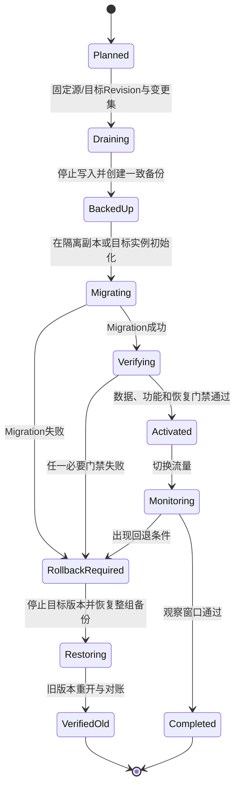

# Harnessix Code升级与回退

## 1. 目标与边界

升级必须保留领域事件原字节、持久状态语义、审批绑定、外部效果身份和失败分类。当前实现提供若干组件级Migration，
但没有统一在线升级器、数据库协调器或自动回退命令；正式升级必须由部署层停止入口、制作一致备份、逐组件迁移并验收。

历史Session v1～v21、Patch账本和里程碑命令见[部署里程碑历史](../deployment-milestone-history.md)。本文只描述当前
Revision支持的操作规则。

## 2. 受管状态与迁移能力

| 状态 | 当前Schema机制 | 自动升级 | 降级策略 |
|---|---|---|---|
| Agent Session `sessions.db` | `agent_migrations(version, checksum)`，当前资源到0031 | 初始化时同一事务顺序执行 | 不支持Down Migration；恢复升级前完整备份或Plan绑定维护备份 |
| 旧Action SQLite/PostgreSQL Journal | 冻结历史Schema | 当前产品不自动升级 | 停写归档；按[归档手册](legacy-action-archive.md)处理 |
| Product Config源 | v1/v2严格JSON与源摘要CAS | 只通过显式`config migrate` | v1备份文件或配置管理系统版本 |
| Product Config审计库 | 内部SQLite表和Hash链 | Store初始化 | 与对应配置源和Session一起恢复 |
| 当前Trusted Action Audit | 默认Schema v2；准入带父闭包的新Route Plan后v3 | v1启动时前向补齐Owner/Operation；v3不是每次Runtime初始化自动产生 | 不支持Down Migration；恢复升级前完整State Root备份 |
| Workspace事务 | 初始化Schema v2；实际准入新v2记录后v3；Reader支持1/2/3 | 初始化将v1前向升v2；新记录准入升v3 | 旧0.1.0只接受v1；恢复匹配完整备份，不手改版本 |
| Execution Plan | 默认Schema v1；实际准入带父闭包的新Plan后v2 | 新Plan准入时前向升代，不是所有Runtime初始化自动产生 | 旧Reader不接受更高代际；恢复匹配完整备份 |
| Patch/Process/Delivery/扩展账本 | 各模块专用版本或表 | 取决于宿主显式装配 | 必须按模块设计做整组备份和对账 |

旧Action Journal与Agent Session是不同存储合同。当前产品不得初始化或消费旧Journal，也不能把Session的Checksum、`schema_too_new`和`quick_check`能力外推到旧数据。

## 3. 升级状态机


```mermaid
stateDiagram-v2
    [*] --> Planned
    Planned --> Draining: 固定源/目标Revision与变更集
    Draining --> BackedUp: 停止写入并创建一致备份
    BackedUp --> Migrating: 在隔离副本或目标实例初始化
    Migrating --> Verifying: Migration成功
    Migrating --> RollbackRequired: Migration失败
    Verifying --> Activated: 数据、功能和恢复门禁通过
    Verifying --> RollbackRequired: 任一必要门禁失败
    Activated --> Monitoring: 切换流量
    Monitoring --> Completed: 观察窗口通过
    Monitoring --> RollbackRequired: 出现回退条件
    RollbackRequired --> Restoring: 停止目标版本并恢复整组备份
    Restoring --> VerifiedOld: 旧版本重开与对账
    VerifiedOld --> [*]
    Completed --> [*]
```

任何阶段出现`UNKNOWN`外部效果时，不进入自动Rollback执行链；先按[故障恢复](recovery.md)对账。

## 4. 升级前准备

1. 固定源Revision、目标Revision、Python版本、`uv.lock`摘要、平台和数据库版本；
2. 阅读目标Revision的模块设计、Migration文件和兼容测试，不依赖里程碑摘要；
3. 列出旧Action归档、Session、配置审计、Product Config、Patch/Process/Delivery账本、
   Workspace、私有CAS和外部系统；
4. 停止新请求，等待可安全完成的读取或幂等工作；
5. 记录全部开放Turn、Trusted Action Route、`UNKNOWN`和后台Process；旧Action队列只做停写归档；
6. 对活动外部效果建立可查询身份，不能确认结果的调用转入人工对账；
7. 停止Agent Runtime和相关宿主，确认没有写连接或Owner Lease；旧API/Worker不得运行；
8. 创建同一逻辑时间点的一致备份并校验可读性和摘要。

## 5. SQLite备份

### 5.1 推荐方式

停写后使用SQLite Backup API复制每个数据库，不只复制主文件：

```bash
python - source.db backup.db <<'PY'
import sqlite3
import sys

source = sqlite3.connect(sys.argv[1])
target = sqlite3.connect(sys.argv[2])
try:
    source.backup(target)
finally:
    target.close()
    source.close()
PY
```

对旧Action归档、Session、配置审计和各专用账本分别执行，并记录SHA-256。若使用文件级快照，必须
保证所有写进程已停止，并把数据库、`-wal`和`-shm`作为同一状态处理；不得只复制正在运行的主文件。

0.9.3b的`SQLiteStoreMaintenance.execute`会在破坏性Session共库清理前强制创建并验证Plan绑定备份，`restore`可原子恢复
该`sessions.db`。这只覆盖Session/Protocol/Artifact共库，不替代版本升级所需的Product Config、Action Audit、Delivery、
Process和Workspace状态整组备份；升级回退不得把Maintenance备份误当完整发布快照。

0.9.3c将当前`action-audit.db`从Schema v1前向升级到v2，新增Owner Generation/Token摘要元数据和
`action_route_operations`。升级保留历史Route Plan/Event原文，不为旧执行态伪造Operation。新版本启动后不得直接用旧二进制打开
v2库；需要回退时必须恢复升级前包含Execution Plan、Action Audit、Session/Artifact、Product Config、Process和Delivery的完整备份，
禁止手改`schema_version`或删除Operation表。

### 5.2 Agent状态一致性

`--state-directory`包括`sessions.db`、`product-config.db`及独立`session-auth/key.v1`。
认证库的有效恢复必须保留匹配的原逻辑Store/Key身份；仅DB备份不含独立Key，不代表完整产品恢复。
POSIX文件权限保护不等于加密；Windows用户DPAPI文件复制不构成跨用户/机器可解密保证。
当前尚无正式Key导出、轮换、保护恢复包或跨机器迁移命令，不提供绕过认证的无Key恢复方案。若宿主还装配Patch、Process、Delivery、MCP、
Skill或Hook账本，应在同一停机窗口备份。Product Config源文件不在状态目录内，也必须和其源摘要一起归档。

## 6. 旧Action PostgreSQL归档

PostgreSQL只服务已退役Action Worker历史数据。先停止全部旧写入，再使用组织已有的一致性备份或`pg_dump`
生成只读归档；凭据不得展开到命令日志。当前产品不连接、迁移或回放该数据库。命令、验收和保留要求见
[旧Action Plane状态检查与归档手册](legacy-action-archive.md)。

## 7. Agent Session升级

[`SQLiteSessionStore.initialize`](../../src/harnessix/session/sqlite.py)执行以下门禁：

1. 创建或验证Harnessix专用`application_id`；
2. 拒绝把其他应用的非空SQLite库当作Session；
3. 读取`agent_migrations`，拒绝当前代码不存在的更高版本和版本缺口；
4. 对已应用Migration校验SQL SHA-256，变化时返回`migration_changed`；
5. 在`BEGIN IMMEDIATE`事务内逐语句执行未应用Migration；
6. 执行`PRAGMA quick_check`，失败时返回`database_corrupt`；
7. Commit后把文件设为`0600`并启用WAL；
8. Agent Runtime通过单宿主锁阻止两个活动Runtime共享同一Session。

Migration 0029增加空认证头、Event Seal及派生Checkpoint结构；当前最高Migration
[`0030_authenticated_artifact_body.sql`](../../src/harnessix/session/migrations/0030_authenticated_artifact_body.sql)
仅增加可空Artifact Seal列，原Migration 1～29摘要及Event/Artifact/Projection原字节不改写。
有Key产品新Artifact原正文跨同Key重启可验；升级前旧行的Seal仍为NULL，不得在当前Scope下补签或公开读取。
默认产品先加载独立原Key，再初始化认证库；没有证明的非空历史拒绝激活，不自动补签或导入。
Migration 0026的维护Plan/Item/Progress仍保留，升级不创建Plan、清理业务数据或运行Vacuum。
当前维护实现未完成认证证明删除/恢复及托管Key装配，不能把旧显式宿主测试当作认证产品的维护验收。
不要修改已经发布Migration文件；新增变化必须追加新编号。

验收：

```bash
uv run pytest tests/agent/test_session_upgrade.py
uv run pytest tests/agent/test_store.py
uv run pytest tests/agent/test_store_maintenance.py
```

真正的版本升级证据应由旧Wheel创建数据库，再由新Wheel迁移并由旧Wheel拒绝更高版本；只手工创建表不等价。

## 8. 旧Action Journal处置

旧Journal不再随Harnessix Code升级。保留源版本、Schema版本、数据库摘要和外部Receipt核对报告；不能证明的效果保持
`UNKNOWN`。禁止由新版本自动迁移、Claim或重放旧记录；按归档手册执行只读导出和组织保留期策略。

## 9. Product Config v1→v2

### 9.1 计算源摘要

```bash
python - ./private/product-config.json <<'PY'
import hashlib
import pathlib
import sys

print(hashlib.sha256(pathlib.Path(sys.argv[1]).read_bytes()).hexdigest())
PY
```

### 9.2 显式迁移

```bash
uv run harnessix config migrate \
  --config ./private/product-config.json \
  --expected-source-sha256 <64位源摘要> \
  --state-database ./private/state/product-config.db
```

迁移使用私有锁、源摘要CAS、`0600`临时文件、目录同步、原子替换和内容寻址的v1备份。源在迁移期间变化、备份同名
但内容冲突或锁不安全时失败关闭。对已是v2的文件执行返回`changed=false`，不重写正文。

迁移后必须运行：

```bash
uv run harnessix config diagnose \
  --config ./private/product-config.json \
  --state-database ./private/state/product-config.db
```

v1备份包含环境变量名但不应包含API Key；仍按私有配置保护。

## 10. 激活与灰度

Agent Server通过`--expected-active-sha256`和`--expected-active-profile`对配置审计库中的活动指针执行CAS。
推荐先在独立状态副本上诊断和打开Session，再停止旧Runtime并以预期活动身份启动新进程。当前没有并行双写或热切换，
不得让两个Runtime同时拥有一个Session。

独立Action API/Worker不得参与灰度或滚动升级。旧Journal保持停写归档；Coding Agent只切换Agent Server、Session和Trusted Action Runtime。

## 11. 升级后验收

| 类别 | 检查 |
|---|---|
| 数据 | Migration连续、Checksum适用处一致、SQLite quick check、备份可读 |
| 行为 | Doctor/Preflight、审批、取消、Thread恢复和协议握手 |
| 恢复 | 开放Turn、Trusted Route、Patch/Process/Delivery中断按原语义收敛 |
| 安全 | 配置/状态权限、Secret Canary、Workspace隔离、监听地址 |
| 观测 | 日志可解析、Trace/Metric可达、错误码与Revision可关联 |
| 兼容 | 旧字节未改写；旧Reader按合同拒绝更高版本 |

## 12. 回退

回退触发条件包括Migration失败、必要行为回归、数据不一致、Secret暴露、无法解释的`UNKNOWN`增长和平台资源泄漏。
步骤：

1. 停止目标版本接收新请求；
2. 终止或隔离仍持有Lease/Owner的目标进程；
3. 保存目标版本失败证据，不覆盖升级前备份；
4. 对所有可能已发生的外部效果完成对账；
5. 以新restore ID恢复与源版本匹配的完整状态集和Product Config，并保留Previous及原Key；重复上一恢复ID不会撤销后来新增的状态；
6. 恢复后不再启动会前向升代的目标Runtime；安装源版本时核对状态字节不变，再启动源版本验证Migration、Readiness、事件、Snapshot和外部效果；
7. 只有数据和效果一致后恢复流量。

禁止删除Migration行、手改Schema版本、把新事件交给旧Reader或只恢复Session而保留不匹配的Patch/效果账本。

若曾用目标Runtime打开已恢复状态，须先关闭它，再以新的明确恢复身份重新建立匹配备份；不能只切换旧二进制。
[匹配回退详设](../changes/m09-r4-matching-backup-rollback-order.md)说明候选Runtime重新升代导致的验收失败与正确顺序。
当前有限实际演练见[报告](../validation/matching-backup-rollback-2026-10-08-v1/README.md)：
固定`b1f8ec4`的本机及三个原生CI消费者安装/匹配备份回退通过，初始三平台失败仍保留；
不是任意版本或稳定1.0迁移证明。Schema来源分别见[Workspace初始化](../../src/harnessix/delivery/workspace_store_schema.py)、
[Action审计](../../src/harnessix/trusted_actions/store.py)和[Execution Plan](../../src/harnessix/execution/store.py)。

## 13. 源码与测试映射

| 领域 | 源码 | 测试 |
|---|---|---|
| Session Migration | [`session/sqlite.py`](../../src/harnessix/session/sqlite.py)、[`session/migrations`](../../src/harnessix/session/migrations/) | [`test_session_upgrade.py`](../../tests/agent/test_session_upgrade.py) |
| Session维护备份/回滚 | [`session/maintenance.py`](../../src/harnessix/session/maintenance.py)、[`session/maintenance_backup.py`](../../src/harnessix/session/maintenance_backup.py) | [`test_store_maintenance.py`](../../tests/agent/test_store_maintenance.py) |
| 旧SQLite Journal归档 | [`archive_legacy_action_state.py`](../../scripts/archive_legacy_action_state.py) | [`test_legacy_action_archive.py`](../../tests/governance/test_legacy_action_archive.py) |
| 旧PostgreSQL Journal归档 | [归档手册](legacy-action-archive.md) | 停写后原生`pg_dump`与组织恢复演练 |
| 配置Migration | [`product_config/migration.py`](../../src/harnessix/product_config/migration.py) | [`test_migration_and_store.py`](../../tests/product_config/test_migration_and_store.py) |
| 配置活动CAS | [`product_config/store.py`](../../src/harnessix/product_config/store.py) | [`test_migration_and_store.py`](../../tests/product_config/test_migration_and_store.py) |
| Action Audit v1→v2 | [`trusted_actions/store.py`](../../src/harnessix/trusted_actions/store.py)、[`trusted_actions/operation_store.py`](../../src/harnessix/trusted_actions/operation_store.py)、[`trusted_actions/ownership_store.py`](../../src/harnessix/trusted_actions/ownership_store.py) | [`test_router.py`](../../tests/trusted_actions/test_router.py)中的Migration、Owner和Operation故障用例 |

## 14. 未完成项

完整受管状态/原Key的停机备份和同机整体恢复已有正式命令；
首发仍需关闭当前认证候选到1.0的版本/Schema清单、迁移预检、失败保留及三平台实际演练。
不能以只备份SQLite或替换程序文件代替完整匹配状态单元。
在线跨组件快照、滚动升级、自动回退、跨机Key迁移、通用维护CLI和灾难恢复RPO/RTO平台延期1.1+；
不必先实现这些平台化能力才能采用安全的受控停机、完整备份及人工升级流程。详见[首发收敛计划](../changes/m09-to-v1-release-scope-convergence.md)。

## 默认产品认证升级的失败语义

- 原库无Key：`publication_key_unavailable`，不生成替代身份，不删除DB/WAL/SHM。
- 原Key权限、ACL、对象或闭合封套失效：同一有限失败，不自动修复危险原对象或回退明文。
- 未证明历史、错误认证身份、Snapshot/普通SHA替换：`publication_history_unproven`，不开放协议、不补签。
- 读者与并发新CAS：原Checkpoint/Event/Seal保持同一读快照，不把合法并发当作篡改。
- 备份恢复：必须匹配原Key与全部共库事实；同机整体恢复已有显式命令，但三平台实际安装/升级/恢复未验收，不承诺旧库可无损自动迁入。
新程序失败关闭不等于旧无保护程序可以安全恢复运行。保留原数据隔离副本，禁止删除证明表、迁移标记或换Key。
[完整设计](../changes/m09-4a-managed-session-key-and-root.md)与
[验证报告](../validation/managed-session-key-2026-09-28-v1/README.md)明确当前支持及尚未验收的操作范围。

## 完整Root的停机回退边界

`state restore/recover`复用原Key和全状态备份，恢复中断可明确继续或回退原目录对象，
不是程序版本自动回退，也不授权旧Reader读取新Schema。原Root保留于Previous，
目录切换前Plan/指针耐久，回退决定粘性，详见[恢复设计](../changes/m09-r1-product-state-restore.md)。
当前尚不能据此宣称候选至1.0三平台升级或旧未证明历史迁移完成。


## Agent Protocol 2.0与拒绝事实升级

当前Agent Event/Thread为v21、Provider Event为v4、Fork为v2，Session迁移资源到0031。
新拒绝事实及固定失败结果原子配对，旧认证来源v20继续按原MAC和完整原字节验证，不补签或重写旧历史。
0031仅为语义兼容界标，不增业务表；旧Reader即使表布局相同也必须拒绝更高迁移版本。
备份读取只接受完整、准确的已冻结30/31项迁移清单与Checksum，不接受任意前缀或重复条目。

1. 停止入口并保留原程序、匹配配置和完整State Root备份，记录活动Turn及未决效果。
2. Server、内置SDK、CLI/UI安装同一候选；Agent Protocol仅支持2.0，旧1.0连接返回unsupported_protocol_version。
3. 在隔离副本验证迁移、认证重开、拒绝配对、Replay/Fork及恢复，不自动重发原模型请求。
4. 回退先停写，再恢复旧版本匹配的完整备份，最后切换旧程序；不得删除新拒绝记录或手改Migration版本。

本次离线旧Reader验证使用冻结的旧迁移资源，不等同所有历史发行可执行包的实际降级验证；
macOS、Linux、Windows实际安装与编码仍需独立验收。详见[契约及详细设计](../changes/m09-r3-unknown-tool-recovery.md)。
