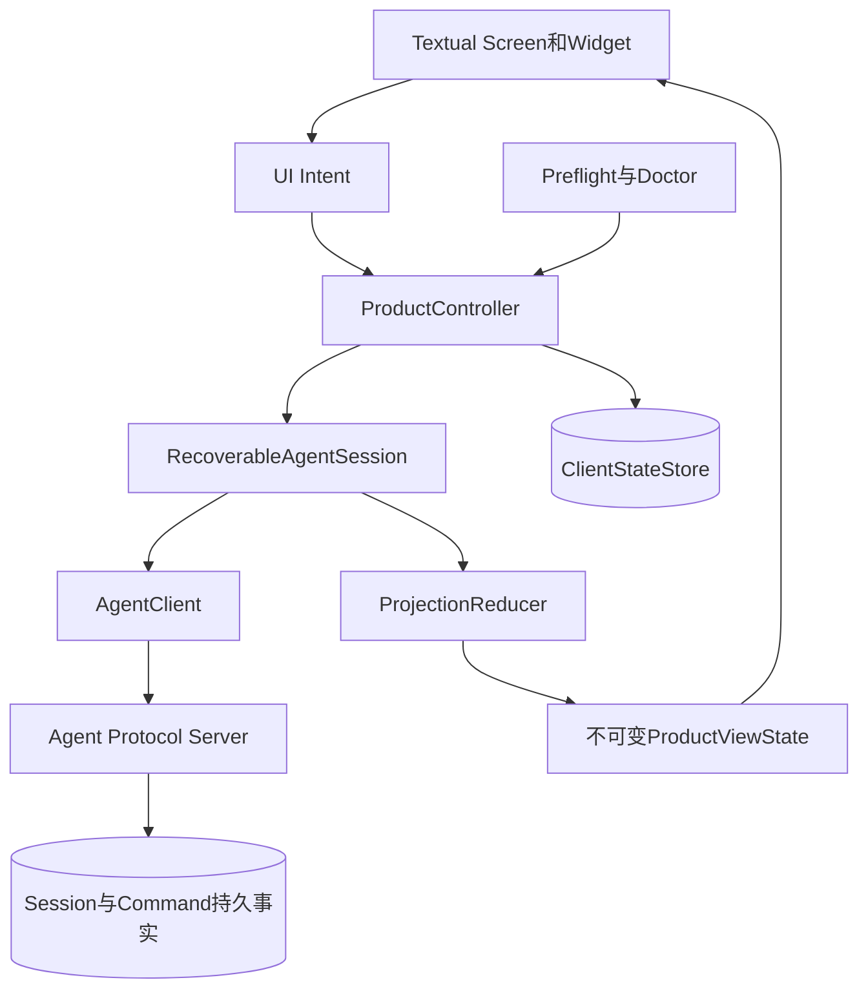

> **冻结源码研究**：本资料的参考版本与访问日期冻结于2026-09-13；Harnessix基线为
> `d9dbfe664a14d7095e2c4adbfd1b2c88f4d4c5c6`。本文记录参考事实和独立推断，不定义
> Harnessix现行公共契约；实际决策见[ADR 0078](../adr/0078-product-shell-and-recoverable-client-state.md)，
> 实现范围见[0.9.1详细设计](../changes/m09-1-cli-tui-product-experience.md)。
> 第2版根据Harnessix `ThreadView`不包含历史Item的现行合同，明确区分冷启动完整Replay与暖重连续传。

# CLI/TUI产品体验与可恢复客户端源码研究

## 1. 研究问题与范围

Harnessix已经拥有Agent Runtime、持久Session、公共Agent Protocol、stdio App Server、Python SDK和
薄命令行客户端，但尚未形成面向日常软件工程任务的完整终端产品。本研究回答以下问题：

1. 终端界面如何在不拥有Agent领域状态的前提下呈现流式消息、计划、工具、Diff、审批和成本；
2. 进程重启、连接中断、迟到响应和事件缺口后，客户端如何以持久事实重建相同视图；
3. 命令身份、客户端实例、事件游标和当前Thread应由谁持久化；
4. UI输入、异步I/O、取消Turn和退出应用如何避免语义混淆；
5. 配置向导、启动检查、错误自助和Windows原生运行应处于什么边界；
6. Python实现应选择何种TUI渲染层，哪些逻辑必须保持框架无关并可确定性测试。

本研究不比较视觉主题，不复制参考项目组件代码，也不把参考实现的快捷键、命名或协议直接变成
Harnessix兼容承诺。

## 2. 研究基线与证据等级

| 项目 | 固定版本 | 证据范围 | 证据限制 |
|---|---|---|---|
| Harnessix | `d9dbfe664a14d7095e2c4adbfd1b2c88f4d4c5c6` | 薄CLI、SDK、App Server、产品配置、只读工具与现行设计 | 当前事实，不代表0.9.1目标已实现 |
| Codex | `a0dcfe2ada3f5bbd5059a34c0fc6fac244741a67` | Rust TUI事件总线、Session状态、审批模型、Diff模型、启动检查和测试结构 | 只提取机制与职责边界 |
| OpenCode | `69c172e8a7c0086887b1f93ed5a162f14b6aa0c5` | OpenTUI应用生命周期、同步投影、权限/问题交互和TUI测试 | TypeScript/Solid结构不直接映射到Python |
| Claude Code逆向样本 | `2ca5ddabfed5f220812ea11f029eda03b21bc4c1` | REPL、恢复会话、Doctor、权限和成本界面 | 非官方源码，只作行为与反例佐证 |
| Textual | 8.2.8，访问于2026-09-13 | 跨平台、Screen、Worker、无头测试 | 第三方渲染依赖，不拥有领域状态 |
| prompt_toolkit | 3.x文档，访问于2026-09-13 | 全屏Application、Layout、Key Binding | 评估手工搭建成本，不作为选定框架 |

证据分为“源码事实”“官方文档事实”和“独立推断”。只有进入ADR、变更设计和现行模块设计的
Harnessix独立决策才具有工程约束力。

## 3. Harnessix当前实现事实

### 3.1 当前调用链

图中`ThinAgentCLI`只在内存保存已见Item、已渲染Item和已提交交互集合；持久Thread、Turn、Item、
Question、Approval和事件游标事实仍属于App Server与Session Store。这个方向正确，但产品入口仍把
客户端身份、服务命令和每次请求ID交给操作者手工维护。

### 3.2 已具备能力

| 能力 | 当前实现 | 现有证据 |
|---|---|---|
| Thread生命周期 | Create、List、Resume、Fork、Archive | [`agent_client.py`](../../src/harnessix/sdk/agent_client.py)、[`test_server_sdk.py`](../../tests/app_server/test_server_sdk.py) |
| Turn生命周期 | Start、Retry、Resume、Cancel、Steer | 同上 |
| 持久恢复 | Snapshot、Replay和`scanned_through`游标 | [`ThinAgentCLI._load_replay`](../../src/harnessix/agent_cli.py)、Protocol测试 |
| 流式呈现 | Pull-Live Delta；Gap后回到持久Replay | `ThinAgentCLI.follow`、`render_delta` |
| 人机交互 | Approval、Question与Diff Artifact分页读取 | `ThinAgentCLI._answer_pending`、`_render_artifact` |
| 计划和工具进度 | `PublicPlanContent`、Tool Call/Result文本输出 | `ThinAgentCLI._record_event` |
| 产品启动 | 配置诊断后装配Provider、Session、只读Tool、Runtime和stdio | [`product_config/server.py`](../../src/harnessix/product_config/server.py) |

### 3.3 阻断产品化的根因

1. `harnessix agent`要求显式提交`--server-program`、多个`--server-arg`和
   `--client-instance-id`，同时每个写命令还要求人工生成`--request-id`；
2. `ThinAgentCLI`的游标、当前Thread、已提交Approval/Question和客户端身份只在当前进程内存在；
3. `AgentClient`提供低层方法，但没有连接代际、持久命令分配、自动重建和能力门禁的高层控制器；
4. SDK尚未严格验证所有Response Envelope，stdout读取没有客户端单帧上限，Result校验错误也未统一
   转换为`AgentSDKError`；
5. 初始化Response成功而`initialized` Notification失败时，同一连接可能停在半握手状态；
6. 当前产品启动前固定要求POSIX与`O_NOFOLLOW`，Windows不能进入默认只读Coding Tool Runtime；
7. Patch、Process、Delivery、Artifact与统一Trusted Action已有独立实现，但默认产品尚未形成同一
   能力目录和执行装配；
8. 当前仅有行式文本输出，没有终端布局、焦点、Modal、快捷键、状态栏、成本视图和可测试的视图投影。

这些问题不是单纯增加Widget可以解决。协议边界、客户端持久状态和确定性投影必须先于完整TUI。

## 4. Codex源码证据

### 4.1 独立TUI边界

**事实**

- `codex-rs/tui`是独立Crate，依赖App Server Protocol/Client，而不是把终端Widget嵌入Core状态机；
- [`app_event.rs`](https://github.com/openai/codex/blob/a0dcfe2ada3f5bbd5059a34c0fc6fac244741a67/codex-rs/tui/src/app_event.rs)
  定义内部`AppEvent`消息总线，使组件请求应用级动作而不是直接访问全部应用状态；
- [`app.rs`](https://github.com/openai/codex/blob/a0dcfe2ada3f5bbd5059a34c0fc6fac244741a67/codex-rs/tui/src/app.rs)
  由顶层应用协调事件、生命周期和退出；
- [`session_state.rs`](https://github.com/openai/codex/blob/a0dcfe2ada3f5bbd5059a34c0fc6fac244741a67/codex-rs/tui/src/session_state.rs)
  维护面向TUI的小型Session状态，没有取代服务端/Core事实。

**推断**

Harnessix需要“界面事件 → 应用控制器 → SDK命令”的单向边界。Widget不得直接创建协议请求ID、推进
持久游标或修改Agent状态；否则相同命令会在重绘、重连和Modal恢复中被重复发送。

### 4.2 审批、Diff和流式输出

**事实**

- [`approval_events.rs`](https://github.com/openai/codex/blob/a0dcfe2ada3f5bbd5059a34c0fc6fac244741a67/codex-rs/tui/src/approval_events.rs)
  将协议审批归一化为TUI模型，并把审批显示与正在输出的流式内容排序；
- [`diff_model.rs`](https://github.com/openai/codex/blob/a0dcfe2ada3f5bbd5059a34c0fc6fac244741a67/codex-rs/tui/src/diff_model.rs)
  使用小型`Add/Delete/Update`展示模型，不让Widget解析任意执行内部状态；
- TUI测试覆盖审批、Patch、断线、活动重连、历史重排、终端Resize/Reflow、流式动画、会话恢复、
  退出和Transcript导出。

**推断**

审批不是一个普通确认框。它必须绑定`thread_id/turn_id/approval_id/fingerprint`，在Diff Artifact完整
读取或明确失败后才允许决策；正在流式输出时的显示顺序必须由投影规则决定，而不是由异步Task完成先后决定。

### 4.3 启动检查与失败开放边界

**事实**

[`startup_preflight.rs`](https://github.com/openai/codex/blob/a0dcfe2ada3f5bbd5059a34c0fc6fac244741a67/codex-rs/tui/src/startup_preflight.rs)
在Composer出现前执行保守的首次启动检查；无法可靠判断某些非安全状态时允许进入可诊断界面，而不是
永久阻塞在不可见启动路径。

**推断**

Harnessix应区分安全关键检查与体验检查：配置合同、状态目录、Workspace隔离和Secret可用性失败关闭；
主题、终端能力或非关键探测失败应进入受限界面并展示稳定自助动作。

## 5. OpenCode源码证据

### 5.1 Renderer生命周期与平台处理

**事实**

- [`packages/tui/src/app.tsx`](https://github.com/anomalyco/opencode/blob/69c172e8a7c0086887b1f93ed5a162f14b6aa0c5/packages/tui/src/app.tsx)
  显式获取和释放Renderer，使用作用域清理，并关闭Renderer自行处理`Ctrl+C`；
- 同一入口包含Windows输入差异处理；
- `test/app-lifecycle.test.tsx`验证SIGHUP只清理一次且Epilogue在清理后输出。

**推断**

终端Raw Mode、Alternate Screen、输入Reader和后台Worker必须归应用生命周期统一所有。退出应用、取消当前
Turn和终止子进程是三种不同动作，不能全部映射为`Ctrl+C`后直接退出。

### 5.2 快照、实时事件与本地投影

**事实**

- [`context/sync.tsx`](https://github.com/anomalyco/opencode/blob/69c172e8a7c0086887b1f93ed5a162f14b6aa0c5/packages/tui/src/context/sync.tsx)
  维护Provider、配置、Session、状态、Diff、Message、Part、Permission和Question的规范化本地投影；
- [`context/event.ts`](https://github.com/anomalyco/opencode/blob/69c172e8a7c0086887b1f93ed5a162f14b6aa0c5/packages/tui/src/context/event.ts)
  提供类型化事件订阅；
- `sync-live-hydration.test.tsx`验证Hydration与Live事件并发时旧快照不能覆盖新事件；相关测试也覆盖
  Orphan Delta和缺失父Message的合并。

**推断**

Harnessix的TUI投影必须是确定性Reducer，并显式记录Hydration基线游标。只有`event.cursor`大于已应用
位置的事件才可合入；Live Delta只能更新临时展示，持久`item_finished`必须成为最终权威正文。

### 5.3 权限和问题组件

**事实**

- [`context/permission.tsx`](https://github.com/anomalyco/opencode/blob/69c172e8a7c0086887b1f93ed5a162f14b6aa0c5/packages/tui/src/context/permission.tsx)
  把权限状态与SDK事件分离；
- [`routes/session/permission.tsx`](https://github.com/anomalyco/opencode/blob/69c172e8a7c0086887b1f93ed5a162f14b6aa0c5/packages/tui/src/routes/session/permission.tsx)
  根据终端宽度调整Diff展示，并提供一次允许、持续允许和拒绝等产品动作；
- `prompt-submit-race.test.ts`和`prompt/persistence.test.ts`分别覆盖重复提交竞态和输入持久性。

**推断**

Harnessix 0.9.1首版只应暴露协议已定义的`approved/rejected`，不能因参考产品存在“持续允许”就在UI层
伪造Policy Grant。任何长期授权必须先进入独立权限契约、持久化和安全评审。

## 6. Claude Code逆向样本证据

### 6.1 组件覆盖与职责过载反例

**事实，仅作行为佐证**

- `src/screens/REPL.tsx`同时协调大量会话、输入、权限、成本、工具和渲染职责，文件规模显著大于专用组件；
- `src/components/messages`、`src/components/permissions`、`src/components/diff`仍提供了按展示职责拆分的组件；
- `src/screens/ResumeConversation.tsx`、`src/screens/Doctor.tsx`和`src/commands/cost`分别承载会话恢复、环境诊断和成本入口；
- 输入焦点优先级会在Permission、Question等待决交互之间切换；累计成本达到阈值时存在独立确认界面。

**推断**

单个“REPL控制器”最终会混合协议、领域投影、焦点、渲染和副作用。Harnessix应在起步时就分离
`ProductController`、`ClientStateStore`、`ProjectionReducer`和Textual Screen/Widget；成本阈值属于
产品Policy而不是仅有颜色提示的状态栏。

## 7. Python TUI框架评估

### 7.1 候选比较

| 维度 | Textual 8.2.8 | prompt_toolkit 3.x | 直接使用ANSI/标准库 |
|---|---|---|---|
| 异步集成 | 原生App、Worker与消息模型 | 支持异步，但应用结构需自行约束 | 全部自建 |
| 组件模型 | Widget、Screen、ModalScreen、CSS布局 | Container、Control、Layout | 无 |
| 无头测试 | `App.run_test()`、`Pilot`、尺寸控制 | 可测试但需更多自建Fixture | 需自建终端模拟器 |
| 三平台 | 官方说明支持Linux、macOS、Windows | 支持主流终端 | 需逐平台处理 |
| 生命周期 | Worker取消、Screen栈和App退出有正式语义 | 需要应用自行组合 | 全部自建 |
| 依赖成本 | 增加渲染依赖及Major兼容管理 | 更底层、定制成本高 | 初始依赖低、长期维护成本最高 |

Textual官方资料：

- [PyPI 8.2.8发布记录](https://pypi.org/project/textual/)；
- [Getting Started与平台说明](https://github.com/Textualize/textual/blob/main/docs/getting_started.md)；
- [Workers生命周期](https://textual.textualize.io/guide/workers/)；
- [Screen与Modal Screen](https://textual.textualize.io/guide/screens/)；
- [`run_test()`与Pilot测试](https://textual.textualize.io/guide/testing/)。

prompt_toolkit官方资料：[Building full screen applications](https://python-prompt-toolkit.readthedocs.io/en/3.0.26/pages/full_screen_apps.html)。

### 7.2 选择结论

Textual最符合Harnessix的Python-first、asyncio和三平台目标。选择它只解决终端渲染、输入分发、布局和
测试驱动问题；协议恢复、命令幂等、投影Reducer、状态持久化和产品Policy必须保留为无Textual依赖的
普通Python层。

为了不强迫纯Server/SDK部署安装终端依赖，TUI作为`[tui]`可选依赖发布；正式CLI产品安装物必须包含
该Extra。缺少依赖时，`harnessix code`返回稳定错误与明确安装命令，不在运行中动态安装依赖。

## 8. 独立架构推导

### 8.1 建议组件边界

图示中的本地状态只保存客户端恢复所需元数据，不复制Transcript正文。Transcript、审批、问题和工具结果
始终从服务端Snapshot/Replay重建。`ProductController`串行化会产生协议副作用的UI Intent；只读视图更新可
并行获取，但必须通过Reducer按游标归并。

### 8.2 必须持久化的最小客户端事实

| 字段 | 作用域 | 用途 | 不得承担 |
|---|---|---|---|
| `client_instance_id` | 状态目录 | 跨进程保持协议命令幂等命名空间 | 用户身份或授权 |
| `next_command_sequence` | 客户端实例 | 生成单调、不可复用的本地命令ID | 服务端事件游标 |
| `selected_thread_id` | Workspace绑定 | 恢复当前会话 | Thread存在性的权威证明 |
| `durable_cursor` | Thread | 记录客户端最近确认的服务端持久位置；用于暖重连和回退检测 | 冷启动完整Transcript快照 |
| `workspace_fingerprint` | 状态文件 | 防止把客户端状态误用于另一Workspace | 文件内容快照 |
| `state_version` | 状态文件 | 兼容迁移与拒绝未知版本 | Agent Protocol版本 |

Prompt草稿可作为后续体验数据单独存储，但不得与命令已提交事实混在同一字段。任何审批答案、Question答案、
模型正文、Diff正文和Secret均不进入客户端状态文件。

### 8.3 恢复不变量

1. 每个产生副作用的UI Intent在调用SDK前先分配并原子持久化Command ID；
2. 请求超时或连接断开后，重试复用同一Command ID，不生成新ID；
3. 只有持久Replay的`scanned_through`推进本地`durable_cursor`；Live Delta不推进该位置；
4. `ThreadView`不含历史Item，且Client State不复制Transcript，因此进程冷启动必须从Cursor 0分页Replay完整历史；
5. 同一进程内存投影完整时，暖重连才可从已确认Cursor续传；冷启动重建到已保存Cursor之前不得进入Live；
6. Hydration与Live并发时，以持久Cursor和Item终态规则归并，不以Task完成顺序覆盖；
7. 退出TUI不等于取消Turn；取消Turn必须由显式Intent和协议Command完成；
8. 本地状态损坏时隔离损坏文件并创建新客户端实例，不用猜测旧Command是否完成；历史Thread仍可从服务端列出恢复。

## 9. 对0.9.1的约束与实施顺序

| 顺序 | 前置结果 | 原因 |
|---:|---|---|
| 1 | Response、帧上限、Result错误和半握手加固 | 防止不可信stdio数据突破TUI进程边界 |
| 2 | 客户端状态合同、原子Store、Command分配与连接代际 | 防止重启后重复命令或丢失恢复位置 |
| 3 | 确定性投影Reducer与框架无关Controller | 先证明相同事件得到相同视图 |
| 4 | Textual应用壳、Transcript和会话管理 | UI只消费稳定应用层 |
| 5 | Approval、Question、Diff、计划、工具、成本和错误自助 | 逐类补齐交互及失败场景 |
| 6 | 配置向导、Preflight、Doctor和Windows原生只读工具 | 平台能力与产品入口共同验收 |
| 7 | 统一Action、Artifact、Patch、Process和Delivery装配 | 高风险能力只能经既有Policy/Approval/Journal接入 |

不得把“界面可以启动”“正常Prompt可返回文本”作为0.9.1完成条件。每个切片必须同时具有合同、失败、恢复、
取消、超时、持久化、观测、跨平台和测试证据。

## 10. Clean-room与许可证边界

1. Codex与OpenCode只按固定提交阅读公开源码，Harnessix独立命名、建模和实现；
2. Claude Code逆向样本不作为官方行为承诺，不复制源码、字符串、视觉资产、快捷键表或私有协议；
3. Textual通过正式依赖使用，其MIT许可证与版本进入0.9.4许可证/SBOM检查；
4. 研究文档只保留公开永久链接、事实摘要和独立推断，不提交本地参考仓库路径；
5. 任何“始终允许”、远程认证、多租户或云同步能力都必须由Harnessix独立合同和安全评审定义。

## 11. 研究结论

1. 完整TUI是Agent Protocol客户端与产品表现层，不是Agent Runtime的替代入口；
2. 客户端恢复的核心是持久身份、Command ID、Cursor、Snapshot/Replay和确定性Reducer，而不是重连按钮；
3. Textual适合作为Python终端渲染层，但领域投影、Controller和Store必须可在无Textual环境下测试；
4. Approval、Question、Diff和成本是具备身份与Policy语义的领域交互，不能降级为普通弹窗；
5. Windows原生支持必须关闭Workspace对象安全与默认产品装配，不以WSL或跳过检查替代；
6. 0.9.1应按可发布纵向子切片推进，协议/SDK加固先于界面，统一高风险Action装配最后验收。

## 12. 证据索引

| 结论 | Harnessix事实 | 参考证据 |
|---|---|---|
| UI不拥有领域状态 | [`agent_cli.py`](../../src/harnessix/agent_cli.py)、[`agent_client.py`](../../src/harnessix/sdk/agent_client.py) | Codex `app_event.rs`、`session_state.rs` |
| Snapshot/Replay优先于Live | [`ThinAgentCLI.follow`](../../src/harnessix/agent_cli.py) | OpenCode `context/sync.tsx`及Hydration测试 |
| 审批绑定身份与Diff | [`ApprovalRespondParams`](../../src/harnessix/protocol/contracts.py) | Codex `approval_events.rs`、OpenCode Permission组件 |
| 生命周期统一所有 | [`SubprocessAgentTransport`](../../src/harnessix/sdk/agent_client.py) | OpenCode `app.tsx`及lifecycle测试 |
| 启动检查分层 | [`diagnose_configuration`](../../src/harnessix/product_config/runtime.py) | Codex `startup_preflight.rs`、Claude逆向样本`Doctor.tsx` |
| Windows尚未产品可用 | [`_require_coding_tool_platform`](../../src/harnessix/product_config/server.py) | Textual跨平台说明；Harnessix平台目标以ADR 0063为准 |
