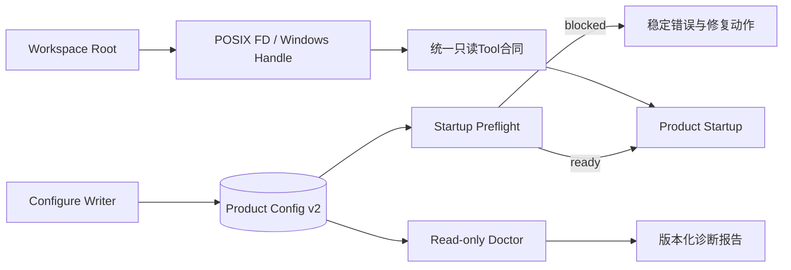

> **冻结源码研究**：参考源码和Harnessix基线冻结于2026-09-13。Codex、OpenCode和Claude Code逆向样本
> 的版本分别为`a0dcfe2ada3f5bbd5059a34c0fc6fac244741a67`、
> `69c172e8a7c0086887b1f93ed5a162f14b6aa0c5`和
> `2ca5ddabfed5f220812ea11f029eda03b21bc4c1`。Claude Code仓库不是官方公开源码，只作行为交叉佐证。
> 本文记录事实、推断和采用边界，不定义Harnessix现行行为；独立决策见[ADR 0079](../adr/0079-preflight-and-native-read-port.md)，
> 实施合同见[0.9.1d详细设计](../changes/m09-1d-configuration-preflight-windows-read.md)。

# 配置、Preflight、Doctor与Windows原生只读Runtime源码研究

## 1. 研究背景与问题

Harnessix Code在0.9.1c结束时已经具备可恢复终端交互，但产品启动仍存在两个阻断点：

1. 首次用户必须手写严格Product Config v2，缺少不会保存Secret值的配置向导；
2. `harnessix code`把配置、依赖、Secret、Workspace和平台错误留给子进程启动后暴露，缺少统一Preflight和Doctor；
3. Windows已经有基于Win32 Handle的Workspace安全观察端口，但`CodingToolRuntime`仍直接依赖POSIX FD；
4. `run_product_stdio`通过`_require_coding_tool_platform`主动拒绝Windows，因此TUI跨平台测试不能形成Windows产品链证据。

本研究回答：

- 配置写入、启动阻断检查和支持诊断应如何分层；
- Doctor是否可以修改状态、访问网络或输出原始异常；
- Windows只读工具应复用哪个现有安全端口，哪些POSIX实现不得伪装成跨平台；
- 哪些结果必须版本化、摘要绑定并可由机器消费；
- 首次配置、失败重试、取消、超时和产品启动应如何形成可验证闭环。

本研究不决定0.9.1e写入Action装配，不把正式安装器、自动更新、远端Provider联网Smoke或Windows事务写纳入
0.9.1d。

## 2. 研究基线与复核方法

| 项目 | 固定版本 | 复核范围 | 证据性质 |
|---|---|---|---|
| Harnessix Code | `601e23cc7be38392e82de308dd67c9cdf55f890f` | Product Config、TUI组合根、Tools和Windows Workspace端口 | 当前事实 |
| Codex | `a0dcfe2ada3f5bbd5059a34c0fc6fac244741a67` | `cli/src/doctor.rs`及`doctor/output.rs` | 公开源码事实 |
| OpenCode | `69c172e8a7c0086887b1f93ed5a162f14b6aa0c5` | Desktop onboarding、Health与Windows终端适配 | 公开源码事实 |
| Claude Code逆向样本 | `2ca5ddabfed5f220812ea11f029eda03b21bc4c1` | `preflightChecks.tsx`、`doctorDiagnostic.ts`、`Doctor.tsx` | 非官方交叉佐证 |

本地复核使用`$HARNESSIX_RESEARCH_ROOT/{codex,opencode,claude-code-source-code}`占位，不把个人绝对路径写入
正式资料。结论按“源码事实 → 推断 → Harnessix采用/拒绝”区分。

## 3. Harnessix当前事实

### 3.1 配置与诊断

[`diagnose_configuration`](../../src/harnessix/product_config/runtime.py)已经生成严格
`ConfigurationDiagnosticReport`，覆盖：

- 配置合同有效；
- Profile链能力满足；
- Provider SDK依赖存在；
- Secret引用和版本可解析；
- API Key格式可用。

报告只含Subject ID、稳定Code和`passed/failed`，不包含Secret值。Secret材料在检查后清零。
[`config_main`](../../src/harnessix/product_config/cli.py)已经提供`config diagnose`和`config migrate`，但不创建
新配置，也不检查Workspace、状态目录、TUI依赖和平台工具能力。

### 3.2 产品启动

[`code_main`](../../src/harnessix/product_ui/cli.py)直接完成以下动作：

```text
解析workspace/config/state → 构造agent-server argv
→ 打开ClientStateStore → 创建Subprocess Transport
→ 启动ProductApp
```

如果配置不存在、Secret缺失或平台不支持，错误在Transport或Server阶段返回。当前CLI没有`doctor`和
`configure`子命令，也没有能被TUI与命令行共同消费的产品级检查报告。

[`run_product_stdio`](../../src/harnessix/product_config/server.py)在开放stdio前重复校验配置、Workspace、状态重叠、
Provider和活动Profile，这是正确的最终防线；但`_require_coding_tool_platform`要求POSIX和`O_NOFOLLOW`，Windows
在创建状态目录和协议服务前被拒绝。

### 3.3 POSIX只读工具

[`CodingToolRuntime`](../../src/harnessix/tools/runtime.py)持有[`Workspace`](../../src/harnessix/tools/workspace.py)：

- Root FD在生命周期内保持打开；
- 每段通过`openat`、`O_NOFOLLOW`和对象身份核对；
- 文件、目录、Glob和Grep通过FD执行；
- `ReadOperation`把5秒Deadline和协作取消送入工作线程；
- 分页依赖Revision，后续页错配失败；
- `.git`、`.env`、私钥名和受控拒绝路径不可读取。

这些实现使用`os.O_DIRECTORY`、`dir_fd`、`os.scandir(fd)`和`os.read(fd)`，不能通过删除平台检查直接在
Windows运行。

### 3.4 Windows安全观察端口

[`WindowsWorkspaceRoot`](../../src/harnessix/workspace/windows.py)和
[`SecureWorkspaceReader`](../../src/harnessix/workspace/snapshot.py)已经提供：

- 从盘符或UNC根开始逐段`CreateFileW`；
- `FILE_FLAG_OPEN_REPARSE_POINT`和属性检查拒绝Reparse Point/Junction；
- File ID、Volume Serial和最终路径绑定；
- 根Handle阻止生命周期内重命名；
- 普通文件拒绝多硬链接；
- `\\?\`长路径；
- 目录大小写折叠冲突检测；
- 文件读取前后对象Revision核对；
- ADS、设备名、尾随点/空格由逻辑路径规范化拒绝。

Windows CI已经验证Junction、长路径、根替换和稳定身份，但该端口只服务Snapshot与Secure Reader，尚未提供
Coding Tool分页、搜索统计、ToolDescriptor版本或Agent Runtime装配。

## 4. Codex研究事实

### 4.1 Doctor是只读诊断，不是隐式修复器

固定提交中的`codex-rs/cli/src/doctor.rs`明确把Doctor定义为read-mostly。检查覆盖安装、配置、认证、终端、状态目录、
Git、Sandbox、网络和后台服务；失败行提供原因与修复动作，但Doctor不自动修改用户状态，也不启动长期服务。

**采用价值：** 诊断与修复动作分离可以重复运行，避免“为了检查而改变被检查对象”。Harnessix应让Doctor只返回
事实和显式命令提示；配置写入只能由`configure`承担。

### 4.2 机器报告与人类渲染共享同一事实

Codex `DoctorReport`包含Schema版本、生成时间、整体状态和检查列表；每项检查包含ID、Category、Status、摘要、
Issue、Remediation和Duration。`doctor/output.rs`在独立模块中对同一报告进行分组与终端渲染。

**采用价值：** Harnessix不应分别维护JSON与人类文本检查逻辑。产品级Preflight合同应是唯一事实，CLI/TUI只负责
渲染。检查顺序必须稳定，支持测试、诊断包和未来UI复用。

### 4.3 诊断输出需要主动脱敏

Codex在报告结构进入JSON或人类输出前清洗Detail，不把“JSON是机器格式”当作放宽隐私边界的理由。

**采用价值：** Harnessix报告不得保存或输出Secret值、Prompt、Provider原始响应、完整环境、用户绝对路径和原始异常。
Subject只使用稳定逻辑ID或摘要。

## 5. OpenCode研究事实

固定提交中的Desktop onboarding把“是否首次启动”和“创建默认项目”作为独立状态，完成标志只在目录创建成功后写入。
Server Health只表达服务进程存活，不等价于配置、Workspace或工具可用。

**采用：**

- 配置完成状态只能在配置文件原子提交后成立；
- Health、Preflight与Doctor必须区分，不能用“服务返回healthy”代替产品可运行证明。

**不采用：** OpenCode Windows Desktop包含WSL Sidecar路径；Harnessix 1.0已经决定原生Windows是正式目标，不能以WSL
兼容替代原生Workspace端口。

## 6. Claude Code逆向样本研究事实与限制

### 6.1 Preflight行为

逆向样本的`preflightChecks.tsx`在启动阶段并行探测网络端点，失败后展示SSL提示并退出；检查逻辑与界面状态耦合。

**可取机制：** 启动阻断检查应在进入主交互前完成，SSL/代理类问题应给出可执行提示。

**拒绝机制：** Harnessix本地TUI正确性和离线Doctor不应依赖付费网络。0.9.1d Preflight只运行离线、确定性检查；
Provider联网能力留给受控Smoke。原始网络异常也不得进入稳定报告。

### 6.2 Doctor行为

`doctorDiagnostic.ts`汇总安装方式、运行路径、更新权限、重复安装、搜索工具和平台差异，并在Windows单独规范路径比较。

**采用价值：** 平台路径不能用POSIX字符串假设统一；诊断应区分安装、配置、Workspace、工具和终端类别。

**证据限制：** 该仓库是逆向样本，不能单独支撑安全决策。Windows安全结论必须来自Harnessix Win32 Handle实现、微软API
语义和Windows Runner攻击测试。

## 7. 横向对比

| 问题 | Codex | OpenCode | Claude逆向样本 | Harnessix独立结论 |
|---|---|---|---|---|
| Doctor是否修改状态 | read-mostly | 无等价统一Doctor证据 | 诊断与提示 | 禁止隐式修改 |
| JSON与人类输出 | 同一报告双渲染 | Health结构简单 | 主要面向界面 | 单一版本化事实，多适配器 |
| 首次配置完成 | 配置/认证分层 | 成功后持久完成标志 | Onboarding流程 | 配置原子提交后才完成 |
| Preflight联网 | Doctor可有有界探测 | Server Health | 启动网络探测 | 0.9.1d离线；联网留给Smoke |
| Windows策略 | 原生平台分支 | Desktop可选WSL | 路径显式分支 | 原生Handle端口，不用WSL代替 |
| 错误详情 | 结构化并脱敏 | 简单状态 | 可展示底层文本 | 只输出稳定Code与安全提示 |

## 8. 独立推断与采用决策输入

### 8.1 分层模型



- Configure是唯一配置写入者；
- Preflight是启动前、离线、阻断型检查；
- Doctor运行同一检查集合但不启动服务、不修改状态；
- Server在打开stdio前重复安全检查，防止Preflight后的TOCTOU；
- Tool Runtime通过平台端口实现同一公共Tool合同，不让UI或Agent判断操作系统。

### 8.2 Windows只读端口输入

现有Win32 Workspace端口已经具备对象安全基础，因此0.9.1d应增加Tools侧Adapter，而不是复制第二套路径解析器。
Adapter必须：

1. 复用`normalize_workspace_path(..., "windows")`；
2. 复用Tools拒绝名称与拒绝路径策略；
3. 把Handle观察身份和正文摘要纳入Revision；
4. 在目录、文件和递归搜索循环中执行`ReadOperation.checkpoint()`；
5. 保持现有输入/输出Pydantic合同、结果上限、Artifact Capture和错误码；
6. 关闭时等待所有读操作退出后关闭Root Handle；
7. 无法提供等价Git进程隔离时不广告Windows Git Tool。

### 8.3 失败语义

| 失败 | 产品行为 | 原因 |
|---|---|---|
| 配置缺失/损坏 | Preflight阻断，提示configure | 不能启动半配置Server |
| Secret缺失 | 阻断但不显示变量值 | 防泄漏且Provider必然不可用 |
| Workspace对象不安全 | 阻断 | 安全边界不可降级 |
| 状态与Workspace重叠 | 阻断 | 防止模型读取Session/Secret元数据 |
| TUI依赖缺失 | Doctor失败；start保持稳定错误 | 不运行时下载 |
| 可选Git不可用 | 未请求时告警；显式请求时阻断 | 不影响基础只读文件链 |
| Windows Git隔离不足 | 不广告Git能力 | 不用不安全降级冒充支持 |
| Doctor单项内部错误 | 该项稳定失败，其余可继续 | 支持完整诊断而不泄漏异常 |

## 9. 研究结论

0.9.1d的最低正式闭环不是“删除Windows平台判断”，而是：

```text
版本化产品检查合同
+ 只读Doctor与启动Preflight共用事实
+ Secret-free配置向导和CAS原子写
+ Windows Handle端口驱动同一只读Tool合同
+ Server二次校验和能力广告
+ Linux/macOS/Windows真实产品Smoke
```

只有Windows Runner能够启动真实`agent-server`、通过SDK读取含Unicode/空格/长路径Workspace、拒绝
Junction/ADS/保留名/分页漂移，并完成关闭恢复，才可以关闭0.9.1d。正式发行物、长期Soak、写入交付和公网Provider
仍由0.9.3～0.9.6分别验收。
