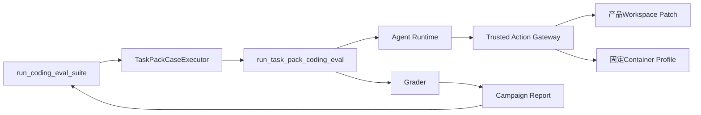

# 受控真实Provider完整Suite源码与接入研究

> 研究日期：2026-09-20。供应商能力与价格会变化；本文冻结执行前核验事实，后续运行必须创建新的有时效价格快照，不能沿用本文数字推导长期价格。

## 1. 研究问题

0.9.2d已经证明工程Task Pack可通过唯一Agent、Session、Trusted Action、固定Container检查、Campaign与Suite Runner完成
10 Case × 2 Trial离线执行，但Recorded Provider只能证明执行链正确。0.9.2e需要回答：

1. 如何在不新增Eval Agent或旁路Runner的前提下，把真实模型接入完整Suite；
2. 如何把模型、端点、地域、价格、凭据引用和宿主程序绑定到恢复身份；
3. 如何保证默认禁网、无自动重试、费用达到停止线后不再开始下一Trial；
4. 如何公开可重算低敏报告，同时不复制Prompt、回答、工具参数/输出、代码正文、路径或Secret；
5. 固定模型与计价区间是否足以支持一次有界的完整工程Suite验证。

## 2. Harnessix现有源码事实

### 2.1 唯一产品执行链已经存在

源码求证：

- [`suite_execution.py`](../../src/harnessix/evals/suite_execution.py)的`run_coding_eval_suite`持有计划先行、单写者锁、连续Case前缀、费用停止和报告发布恢复；
- [`task_pack_execution.py`](../../src/harnessix/evals/task_pack_execution.py)的`TaskPackCaseExecutor`把Case交给现有Campaign与Trial端口；
- [`task_pack_trial.py`](../../src/harnessix/evals/task_pack_trial.py)的`run_task_pack_coding_eval`装配正式Agent、Session和产品Action组合根；
- [`task_pack_suite.py`](../../src/harnessix/evals/task_pack_suite.py)原先只组合零费用Recorded环境，但内部身份派生与Provider无关，可抽取为通用组合器。

结论：真实Provider Suite只需要提供受约束的`ModelProvider`工厂和宿主绑定，不应复制Agent Loop、Action执行或Suite状态机。

### 2.2 原恢复指纹没有覆盖真实宿主配置

原Suite状态只绑定`CodingEvalSuiteRunConfig`，Case状态只绑定Pack、Case、Campaign和宿主源码字段。真实运行新增的Endpoint、
API Key环境变量名、Provider限制、Git与Container程序若不进入指纹，重开时可能在同一Run ID上换配置继续请求。

结论：应在不改变离线指纹的兼容前提下，为Suite与Case增加可选64位SHA-256宿主绑定；真实Suite传入完整私有配置摘要，离线调用保持原字节行为。

### 2.3 Campaign费用停止是Trial边界门禁

[`campaign_execution.py`](../../src/harnessix/evals/campaign_execution.py)从终态Usage与`PriceSnapshot`重算费用。Usage缺失或请求落在
价格区间外时，成本完整性变为未知并停止后续Trial。停止线只保证不会开始下一Trial，不是供应商账户硬额度，也不能撤销当前已产生费用。

结论：0.9.2e必须采用保守停止线并在公开证据中披露其语义；不得宣称本地停止线等于账单上限。

## 3. 百炼北京官方接入事实

执行前核对的官方资料：

| 事实 | 冻结结论 | 官方来源 |
|---|---|---|
| OpenAI兼容Base URL | 北京地域按量付费共享端点为`https://dashscope.aliyuncs.com/compatible-mode/v1` | [Base URL说明](https://help.aliyun.com/zh/model-studio/base-url) |
| 精确模型 | `qwen3-coder-plus-2025-09-23`在北京可用，并支持Function Calling | [Qwen3-Coder-Plus说明](https://help.aliyun.com/zh/model-studio/qwen3-coder-plus)、[模型列表](https://help.aliyun.com/zh/model-studio/list-models) |
| 上下文与输出 | 最大输入997,952 Token，最大输出65,536 Token，总上下文1,000,000 Token | [Qwen3-Coder-Plus说明](https://help.aliyun.com/zh/model-studio/qwen3-coder-plus) |
| 不超过32K输入价格 | 输入人民币4元/百万Token，输出人民币16元/百万Token | [Qwen3-Coder-Plus说明](https://help.aliyun.com/zh/model-studio/qwen3-coder-plus) |
| 超过32K输入价格 | 32K～128K为6/24元，128K～256K为10/40元，256K～1M为20/200元 | [Qwen3-Coder-Plus说明](https://help.aliyun.com/zh/model-studio/qwen3-coder-plus) |

价格是分输入长度区间的请求价格。首个基线固定`input_tokens_max=32000`及4/16元价格；任何请求超过该区间均标记成本未知并停止后续收费请求，而不是用低区间价格估算。

## 4. 参考Coding Agent边界

此前冻结研究已经确认：

- Codex把网络作为显式权限，而不是工具或模型调用的隐式副作用；
- OpenCode把重试实现为可见状态策略，重试会改变请求数、费用、时延和失败分类；
- Claude Code源码样本把费用和预算超限作为终态结果的一部分。

上述事实来源和固定提交见[真实Campaign执行研究](eval-campaign-execution.md)。本切片延续既有原则：默认禁网、显式启网、Provider自动重试为1次、费用进入持久报告、停止后只能显式恢复。

## 5. 方案比较

| 方案 | 优点 | 缺点 | 结论 |
|---|---|---|---|
| 新增真实Eval Agent/Worker | 可独立优化吞吐 | 复制Agent状态机和Action安全边界，恢复事实分裂 | 拒绝 |
| 在离线脚本内直接调用HTTP | 改动少 | 绕过Session、Tool、审批、Usage和Suite恢复 | 拒绝 |
| 把Provider配置直接加入公共Suite Plan | 恢复绑定直观 | 泄漏端点与凭据引用，污染Provider中立公共合同 | 拒绝 |
| 私有运行配置摘要绑定既有Suite/Case | 复用唯一主链，公共报告保持中立，重开防漂移 | 需要新增私有合同和兼容指纹 | 采用 |

## 6. Go/No-Go结论

**Go，但受以下门槛约束：**

1. 固定工程Pack v2、十Case、每Case两Trial、精确模型和北京地域；
2. CLI默认不读取配置或凭据，必须显式`--allow-network`；
3. API Key只通过环境变量引用，私有配置不得包含值；
4. Provider无自动重试、串行Tool Call、单请求输出上限4096 Token；
5. 采用24小时有时效价格快照和人民币40元本地Trial边界停止线；
6. 请求超出32K计价区间、Usage不完整、身份漂移或证据不完整立即停止后续运行；
7. 公开目录只允许Suite Plan、Suite Report和白名单Evidence Manifest；
8. 实现、恢复与脱敏测试通过后，才允许进行一次完整受控真实Suite。

## 7. 研究结论到实现映射

| 研究结论 | 实现位置 | 验证位置 |
|---|---|---|
| 复用唯一Suite/Agent链 | [`provider_suite_execution.py`](../../src/harnessix/evals/provider_suite_execution.py) `run_task_pack_provider_suite` | [`test_provider_suite_execution.py`](../../tests/evals/test_provider_suite_execution.py) |
| 通用Task Pack组合 | [`task_pack_suite.py`](../../src/harnessix/evals/task_pack_suite.py) `build_task_pack_suite_config` | [`test_task_pack_suite.py`](../../tests/evals/test_task_pack_suite.py) |
| 宿主配置绑定恢复 | [`suite_execution.py`](../../src/harnessix/evals/suite_execution.py)、[`task_pack_execution.py`](../../src/harnessix/evals/task_pack_execution.py) | `test_suite_execution.py`、`test_task_pack_execution.py` |
| 默认禁网及私有配置 | [`provider_suite_cli.py`](../../src/harnessix/evals/provider_suite_cli.py)、[`cli_config.py`](../../src/harnessix/evals/cli_config.py) | [`test_provider_suite_cli.py`](../../tests/evals/test_provider_suite_cli.py) |
| 低敏证据 | [`provider_suite_evidence.py`](../../src/harnessix/evals/provider_suite_evidence.py) | [`test_provider_suite_evidence.py`](../../tests/evals/test_provider_suite_evidence.py) |

## 8. 已知限制

1. 供应商账单和账户级硬预算不在Harnessix控制面内；
2. 当前固定价格只覆盖单请求输入不超过32K，超过即停止而非跨价阶估算；
3. Provider网络从宿主发起，代码检查仍在固定无网Container；这不是模型网络的Container隔离；
4. 一次北京模型基线不能外推到其他地域、端点、模型或未来价格；
5. 真实运行完成前，本文只证明接入设计可实施，不证明模型质量。
