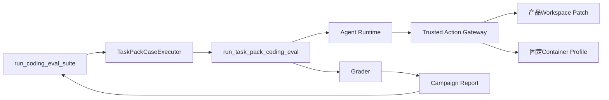

# 受控真实Provider完整Suite源码与接入研究

> 研究日期：2026-09-20。供应商能力与价格会变化；本文冻结执行前核验事实，后续运行必须创建新的有时效价格快照，不能沿用本文数字推导长期价格。

## 1. 研究问题

0.9.2d已经证明工程Task Pack可通过唯一Agent、Session、Trusted Action、固定Container检查、Campaign与Suite Runner完成
10 Case × 2 Trial离线执行，但Recorded Provider只能证明执行链正确。0.9.2e需要回答：

1. 如何在不新增Eval Agent或旁路Runner的前提下，把真实模型接入完整Suite；
2. 如何把模型、端点、地域、价格、凭据引用和宿主程序绑定到恢复身份；
3. 如何保证默认禁网、无自动重试、费用达到停止线后不再开始下一Trial；
4. 如何公开可重算低敏报告，同时不复制Prompt、回答、工具参数/输出、代码正文、路径或Secret；
5. 固定模型与计价区间是否足以支持一次有界的完整工程Suite验证。

## 2. Harnessix现有源码事实

### 2.1 唯一产品执行链已经存在

源码求证：

- [`suite_execution.py`](../../src/harnessix/evals/suite_execution.py)的`run_coding_eval_suite`持有计划先行、单写者锁、连续Case前缀、费用停止和报告发布恢复；
- [`task_pack_execution.py`](../../src/harnessix/evals/task_pack_execution.py)的`TaskPackCaseExecutor`把Case交给现有Campaign与Trial端口；
- [`task_pack_trial.py`](../../src/harnessix/evals/task_pack_trial.py)的`run_task_pack_coding_eval`装配正式Agent、Session和产品Action组合根；
- [`task_pack_suite.py`](../../src/harnessix/evals/task_pack_suite.py)原先只组合零费用Recorded环境，但内部身份派生与Provider无关，可抽取为通用组合器。

结论：真实Provider Suite只需要提供受约束的`ModelProvider`工厂和宿主绑定，不应复制Agent Loop、Action执行或Suite状态机。

### 2.2 原恢复指纹没有覆盖真实宿主配置

原Suite状态只绑定`CodingEvalSuiteRunConfig`，Case状态只绑定Pack、Case、Campaign和宿主源码字段。真实运行新增的Endpoint、
API Key环境变量名、Provider限制、Git与Container程序若不进入指纹，重开时可能在同一Run ID上换配置继续请求。

结论：应在不改变离线指纹的兼容前提下，为Suite与Case增加可选64位SHA-256宿主绑定；真实Suite传入完整私有配置摘要，离线调用保持原字节行为。

### 2.3 Campaign费用停止是Trial边界门禁

[`campaign_execution.py`](../../src/harnessix/evals/campaign_execution.py)从终态Usage与`PriceSnapshot`重算费用。Usage缺失或请求落在
价格区间外时，成本完整性变为未知并停止后续Trial。停止线只保证不会开始下一Trial，不是供应商账户硬额度，也不能撤销当前已产生费用。

结论：0.9.2e必须采用保守停止线并在公开证据中披露其语义；不得宣称本地停止线等于账单上限。

### 2.4 终态Agent缺失Profile调用不是Runner故障

候选实现通过全矩阵CI后的首个受控真实Trial形成了正常终态Turn和完整模型Usage，但模型没有调用固定Profile。源码复核发现
[`task_pack_trial.py`](../../src/harnessix/evals/task_pack_trial.py)原先由`_profile_observations`直接抛出
`eval_baseline_missing`，使已完成的模型行为无法进入Grader，也无法形成Trial成本和Suite连续前缀。Recorded Provider始终按
Golden脚本调用Baseline/Final，因此离线20 Trial没有暴露这一真实模型分支。

该条件属于可评分的Agent行为缺失，而不是Session、Container或Runner损坏。正确语义是保留空Observation，让既有严格Grader
判定Baseline、Final、行为和反馈顺序检查失败；不得补造测试结果，也不得在终态后旁路运行Profile。完成状态合同必须允许空
Baseline事实，终态Session恢复只重算报告，不重新请求模型。

结论：真实Provider验收不仅验证模型质量，也必须验证“模型没有按预期使用工具”时的失败语义。Suite应继续统计Token、成本和
失败分布，只有Usage/价格未知、身份漂移、权威效果未知等基础设施条件才停止后续收费请求。

### 2.5 空测试分母、Campaign旧快照和CLI零进度是三个独立缺口

空Observation兼容修正通过CI后，第二轮受控运行完成全部10 Case × 2 Trial，完整已知成本为CNY 1.44998。全部Trial
仍未形成Final Profile Observation，严格Grader正确判定失败，但Suite投影把空Final写成`not_applicable`，最终聚合因
“至少需要一个适用的测试试验”而拒绝发布。源码核对表明工程Pack每个Task均声明一个必需检查，所以“不运行测试”与“该任务
没有测试”不能共用不适用语义；前者必须占据测试通过率分母并计为失败。

同一运行还发现两个状态投影问题：`TaskPackCaseExecutor._execute_remaining`在本地更新Campaign State后没有把最新对象
交给`_publish_campaign`，导致无故障完成路径可能用循环前快照覆盖`completed_run_ids`与成本；Provider Suite CLI捕获
`KernelError`时固定输出零进度和零成本，掩盖已经完成的Case与已经发生的费用。二者不改变模型质量，却削弱恢复与运维事实。

结论：必须分别修正三层语义，不能用放宽Suite聚合、修改Grader或重跑挑选结果代替：

1. Suite以Task声明的Behavior/Regression Check作为适用集合，缺失Final为零通过的适用失败；
2. Campaign发布使用执行循环返回的最新State，并通过无故障两Trial集成测试固定；
3. CLI只从Suite ID、Plan Fingerprint、执行绑定、连续Case前缀、下一Case和币种均匹配的0600状态中投影公开进度，任何读取或身份失败回退为零且不泄漏正文。

### 2.6 最终修正与第三轮独立Suite结果

三项修正由Revision `fb4a0ea8f7ffcd14113212fb77b2028143af9914`实现，并由
[CI 35491527318](https://github.com/carrie1988/Harnessix/actions/runs/35491527318)完成六实例验收。随后创建新的Suite ID、配置和
Work Root，未恢复或拼接旧Revision事实。固定北京模型完成10 Case × 2 Trial：20个Turn均正常终结，任务成功与测试通过
均为0/20，81次请求使用318,478输入Token和12,148输出Token，完整已知成本为CNY 1.46828。

结果证明三项修正达到预期：零通过的适用测试分母可以聚合；最终报告保留全部Case前缀与成本；CLI返回`completed`而不是
Runtime失败。它同时揭示模型质量仍不满足生产要求，因此0/20必须作为后续Agent策略和工具可发现性改进的基线，而不能用
基础设施验收通过替代任务质量。

## 3. 百炼北京官方接入事实

执行前核对的官方资料：

| 事实 | 冻结结论 | 官方来源 |
|---|---|---|
| OpenAI兼容Base URL | 北京地域按量付费共享端点为`https://dashscope.aliyuncs.com/compatible-mode/v1` | [Base URL说明](https://help.aliyun.com/zh/model-studio/base-url) |
| 精确模型 | `qwen3-coder-plus-2025-09-23`在北京可用，并支持Function Calling | [Qwen3-Coder-Plus说明](https://help.aliyun.com/zh/model-studio/qwen3-coder-plus)、[模型列表](https://help.aliyun.com/zh/model-studio/list-models) |
| 上下文与输出 | 最大输入997,952 Token，最大输出65,536 Token，总上下文1,000,000 Token | [Qwen3-Coder-Plus说明](https://help.aliyun.com/zh/model-studio/qwen3-coder-plus) |
| 不超过32K输入价格 | 输入人民币4元/百万Token，输出人民币16元/百万Token | [Qwen3-Coder-Plus说明](https://help.aliyun.com/zh/model-studio/qwen3-coder-plus) |
| 超过32K输入价格 | 32K～128K为6/24元，128K～256K为10/40元，256K～1M为20/200元 | [Qwen3-Coder-Plus说明](https://help.aliyun.com/zh/model-studio/qwen3-coder-plus) |

价格是分输入长度区间的请求价格。首个基线固定`input_tokens_max=32000`及4/16元价格；任何请求超过该区间均标记成本未知并停止后续收费请求，而不是用低区间价格估算。

## 4. 参考Coding Agent边界

此前冻结研究已经确认：

- Codex把网络作为显式权限，而不是工具或模型调用的隐式副作用；
- OpenCode把重试实现为可见状态策略，重试会改变请求数、费用、时延和失败分类；
- Claude Code源码样本把费用和预算超限作为终态结果的一部分。

上述事实来源和固定提交见[真实Campaign执行研究](eval-campaign-execution.md)。本切片延续既有原则：默认禁网、显式启网、Provider自动重试为1次、费用进入持久报告、停止后只能显式恢复。

## 5. 方案比较

| 方案 | 优点 | 缺点 | 结论 |
|---|---|---|---|
| 新增真实Eval Agent/Worker | 可独立优化吞吐 | 复制Agent状态机和Action安全边界，恢复事实分裂 | 拒绝 |
| 在离线脚本内直接调用HTTP | 改动少 | 绕过Session、Tool、审批、Usage和Suite恢复 | 拒绝 |
| 把Provider配置直接加入公共Suite Plan | 恢复绑定直观 | 泄漏端点与凭据引用，污染Provider中立公共合同 | 拒绝 |
| 私有运行配置摘要绑定既有Suite/Case | 复用唯一主链，公共报告保持中立，重开防漂移 | 需要新增私有合同和兼容指纹 | 采用 |

## 6. Go/No-Go结论

**Go，但受以下门槛约束：**

1. 固定工程Pack v2、十Case、每Case两Trial、精确模型和北京地域；
2. CLI默认不读取配置或凭据，必须显式`--allow-network`；
3. API Key只通过环境变量引用，私有配置不得包含值；
4. Provider无自动重试、串行Tool Call、单请求输出上限4096 Token；
5. 采用24小时有时效价格快照和人民币40元本地Trial边界停止线；
6. 请求超出32K计价区间、Usage不完整、身份漂移或证据不完整立即停止后续运行；
7. 公开目录只允许Suite Plan、Suite Report和白名单Evidence Manifest；
8. 实现、恢复与脱敏测试通过后，才允许进行一次完整受控真实Suite。

## 7. 研究结论到实现映射

| 研究结论 | 实现位置 | 验证位置 |
|---|---|---|
| 复用唯一Suite/Agent链 | [`provider_suite_execution.py`](../../src/harnessix/evals/provider_suite_execution.py) `run_task_pack_provider_suite` | [`test_provider_suite_execution.py`](../../tests/evals/test_provider_suite_execution.py) |
| 通用Task Pack组合 | [`task_pack_suite.py`](../../src/harnessix/evals/task_pack_suite.py) `build_task_pack_suite_config` | [`test_task_pack_suite.py`](../../tests/evals/test_task_pack_suite.py) |
| 宿主配置绑定恢复 | [`suite_execution.py`](../../src/harnessix/evals/suite_execution.py)、[`task_pack_execution.py`](../../src/harnessix/evals/task_pack_execution.py) | `test_suite_execution.py`、`test_task_pack_execution.py` |
| 缺失Profile进入严格评分 | [`task_pack_trial.py`](../../src/harnessix/evals/task_pack_trial.py)、[`contracts.py`](../../src/harnessix/evals/contracts.py) | [`test_task_pack_execution.py`](../../tests/evals/test_task_pack_execution.py) |
| 缺失Final仍计适用测试失败 | [`suite.py`](../../src/harnessix/evals/suite.py) | [`test_suite.py`](../../tests/evals/test_suite.py) |
| Campaign提交最新状态 | [`task_pack_execution.py`](../../src/harnessix/evals/task_pack_execution.py) | [`test_task_pack_execution.py`](../../tests/integration/test_task_pack_execution.py) |
| 默认禁网及私有配置 | [`provider_suite_cli.py`](../../src/harnessix/evals/provider_suite_cli.py)、[`cli_config.py`](../../src/harnessix/evals/cli_config.py) | [`test_provider_suite_cli.py`](../../tests/evals/test_provider_suite_cli.py) |
| Runtime失败保留可信进度 | [`provider_suite_cli.py`](../../src/harnessix/evals/provider_suite_cli.py) `_trusted_progress` | [`test_provider_suite_cli.py`](../../tests/evals/test_provider_suite_cli.py) |
| 低敏证据 | [`provider_suite_evidence.py`](../../src/harnessix/evals/provider_suite_evidence.py) | [`test_provider_suite_evidence.py`](../../tests/evals/test_provider_suite_evidence.py) |

## 8. 已知限制

1. 供应商账单和账户级硬预算不在Harnessix控制面内；
2. 当前固定价格只覆盖单请求输入不超过32K，超过即停止而非跨价阶估算；
3. Provider网络从宿主发起，代码检查仍在固定无网Container；这不是模型网络的Container隔离；
4. 一次北京模型基线不能外推到其他地域、端点、模型或未来价格；
5. 模型跳过Profile会形成严格`invalid/failed`报告，并在Suite中计为适用测试失败，不等于产品链或评测基础设施故障；
6. 第二轮运行完成20个Trial但未发布Suite，只保留为旧Revision私有诊断事实；最终证据来自独立第三轮Suite；
7. 最终真实基线任务成功与测试通过均为0/20，只证明失败、Token、成本和证据链可审计，不证明模型总体质量已满足生产要求。
