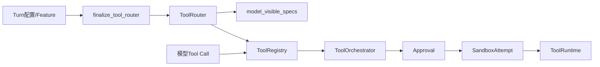
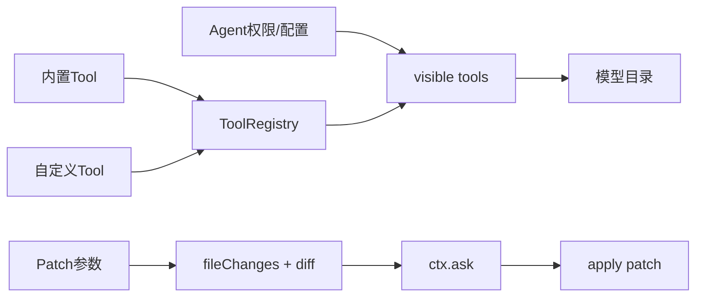
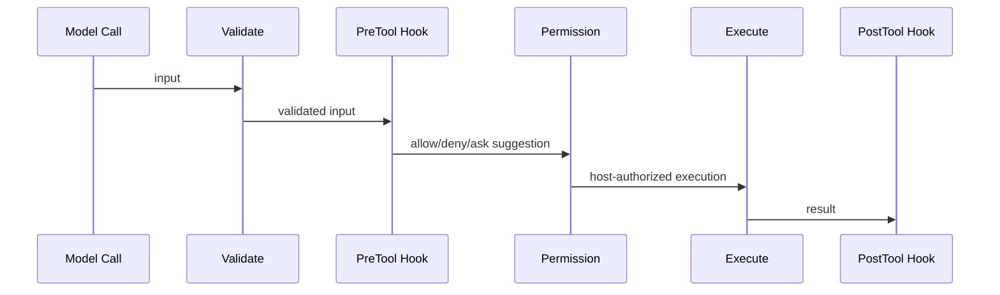
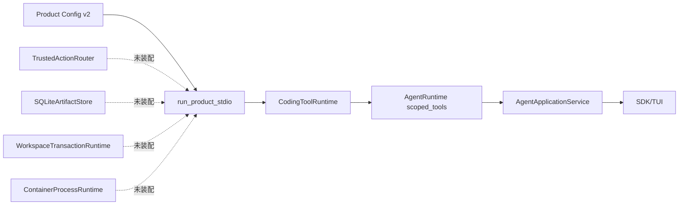
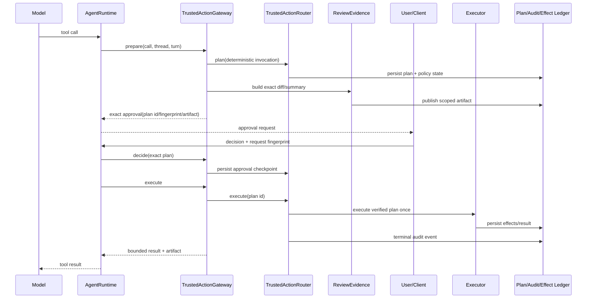
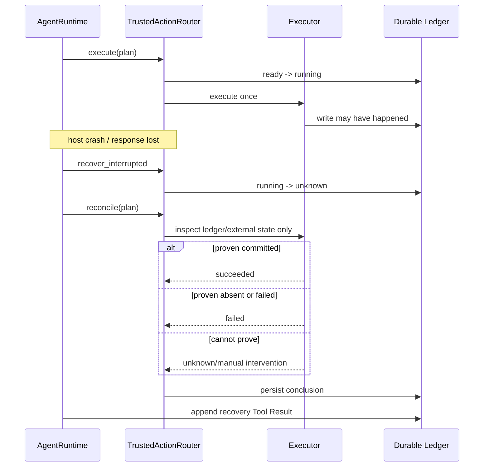

# 默认Trusted Action产品组合源码研究

## 1. 研究问题与边界

| 项目 | 内容 |
|---|---|
| 要回答的问题 | 成熟Coding Agent如何保证“向模型广告的工具”与可执行实现一致，写操作如何经过审批与隔离，Patch如何形成可复核差异；Harnessix已有能力为何尚未进入默认产品链 |
| 包含范围 | Tool目录形成、调用前校验、审批、Sandbox、Patch差异、恢复入口、Harnessix组合根与持久账本 |
| 排除范围 | UI视觉风格、模型Prompt、远端MCP OAuth、自动更新、Provider计价、参考实现未公开的服务端行为 |
| Codex参考版本 | `openai/codex@a592c38c16cdd7623dacc9168926ebccedfb67d3` |
| OpenCode参考版本 | `anomalyco/opencode@95daf90670b7c039c436c85537da5fbfe2205b41` |
| Claude交叉佐证版本 | 非官方重建仓库`carrie1988/claude-code-source-code@2ca5ddabfed5f220812ea11f029eda03b21bc4c1` |
| Harnessix基线 | `c3ed6c917368f705bab90a85ea82572520909ac5` |
| 访问日期 | 2026-09-13 |
| 许可证/复用边界 | Codex为Apache-2.0，OpenCode为MIT；Claude来源非官方且未发现明确许可证，只用于结构交叉佐证。Harnessix仅采用独立抽象与测试结论，不复制实现代码、注释或命名体系 |

本文冻结一次专项研究。上游分支后续变化不自动改变本文结论；升级参考版本必须新建研究版本并复核许可证和行为。

## 2. 结论摘要

### 2.1 已求证事实

1. Codex把模型可见Tool Spec和实际Registry收敛为同一个最终`ToolRouter`，而不是由Prompt与Executor分别维护目录；
2. Codex的Tool Orchestrator集中执行“审批→Sandbox选择→执行尝试”，且宿主持有的网络策略不能被Tool请求升级绕过；
3. OpenCode先根据Agent权限与运行配置过滤可见Tool，再把同一Tool定义交给执行链；其Patch实现先形成完整文件变化和Diff，再请求许可并应用；
4. OpenCode保存Workspace Snapshot并提供Diff/Revert能力，说明差异展示和恢复不是纯UI文本；
5. 非官方Claude重建代码显示Tool参数校验、Hook、权限询问和执行是顺序边界，Hook的允许结果不能覆盖宿主拒绝；该项仅作交叉佐证；
6. Harnessix已经分别具备Trusted Action Router、Execution Plan、Policy、审批检查点、Workspace Snapshot、Artifact、事务发布、Process Sandbox和Reconcile，但默认`run_product_stdio`只装配只读`CodingToolRuntime`；
7. Harnessix现有Patch、Patch Batch和Process Agent Bridge形成于统一Trusted Action Router之前。若直接把这些旧桥接全部塞入产品入口，会形成多套审批权威和恢复Saga，不满足“所有高风险能力经过同一路由”的目标。

### 2.2 合理推断

- 成熟产品的共同方向不是使用相同类结构，而是让目录、校验、审批、执行环境和结果观察形成单一闭环；
- Harnessix的差异化不应是复制参考项目的Tool数量，而应是把不可变执行计划、资源快照、持久审批、Hash链审计、
  Fencing与`UNKNOWN -> Reconcile`真正接入默认Coding Agent；
- 能力探测失败时不广告，比广告后使用弱实现或运行时报错更适合生产环境，也能降低模型反复选择不可用工具的成本。

### 2.3 Harnessix独立决策候选

- 默认产品组合根必须从一个“能力证明”同时生成模型目录和执行注册表；
- Patch与Process不再直接拥有产品级审批权威，而是通过`TrustedActionRouter`持久计划、决策、执行与对账；
- Agent Session保存面向交互的审批Item，但审批必须精确绑定Trusted Action `plan_id`与Plan Fingerprint；
- Artifact Store默认装配，Diff在批准前生成并以作用域Artifact提供完整证据；
- Windows只广告已经验证的原生只读能力；普通目录写和Process只有存在等价安全端口时才进入目录；
- 任意写入崩溃后只允许查账与Reconcile，不允许重新执行模型调用或盲重放副作用。

这些候选只有进入[ADR 0080](../adr/0080-capability-proven-product-action-composition.md)和
[0.9.1e详细设计](../changes/m09-1e-default-trusted-action-composition.md)后才成为Harnessix约束。

## 3. 参考实现调用链

### 3.1 Codex：同一最终Tool计划拥有广告与执行



源码证据：

- [`ToolRouter`](https://github.com/openai/codex/blob/a592c38c16cdd7623dacc9168926ebccedfb67d3/codex-rs/core/src/tools/router.rs#L73-L80)
  同时持有`registry`与`model_visible_specs`，注释明确称其为最终工具计划；
- [`ToolOrchestrator`](https://github.com/openai/codex/blob/a592c38c16cdd7623dacc9168926ebccedfb67d3/codex-rs/core/src/tools/orchestrator.rs#L1-L7)
  集中审批、Sandbox选择和执行尝试；
- [宿主网络策略拒绝升级绕过](https://github.com/openai/codex/blob/a592c38c16cdd7623dacc9168926ebccedfb67d3/codex-rs/core/src/tools/orchestrator.rs#L141-L163)
  在执行前失败关闭；
- [`ApplyPatchHandler`](https://github.com/openai/codex/blob/a592c38c16cdd7623dacc9168926ebccedfb67d3/codex-rs/core/src/tools/handlers/apply_patch.rs#L75-L86)
  是受Router调度的专用处理器，而不是绕过目录的旁路命令。

这里可直接采用的是“广告与执行同源”和“策略不可被低层覆盖”的原则，不直接采用Rust Trait布局、具体Sandbox重试策略或
Codex事件命名。

### 3.2 OpenCode：权限过滤后的目录与批准前完整Patch事实



源码证据：

- [`ToolRegistry`目录过滤](https://github.com/anomalyco/opencode/blob/95daf90670b7c039c436c85537da5fbfe2205b41/packages/opencode/src/tool/registry.ts#L280-L305)
  使用合并后的权限集产生可见Tool；
- [`apply_patch`完整变化构造与审批](https://github.com/anomalyco/opencode/blob/95daf90670b7c039c436c85537da5fbfe2205b41/packages/opencode/src/tool/apply_patch.ts#L149-L220)
  先形成文件变化和Diff，再调用许可边界；
- [`Snapshot.revert`](https://github.com/anomalyco/opencode/blob/95daf90670b7c039c436c85537da5fbfe2205b41/packages/opencode/src/snapshot/index.ts#L408-L448)
  从持久快照恢复文件；
- [`Snapshot.diff/revert`导出](https://github.com/anomalyco/opencode/blob/95daf90670b7c039c436c85537da5fbfe2205b41/packages/opencode/src/snapshot/index.ts#L759-L778)
  表明差异和回退是正式运行能力。

OpenCode证据证明审批前应有完整差异以及可见目录应受权限控制，但未从上述路径求证到Harnessix等价的持久
`UNKNOWN/Reconcile`语义，因此不能把其Snapshot机制描述为同等级副作用账本。

### 3.3 Claude非官方重建代码：Hook不得覆盖宿主权限



交叉佐证：

- [`Tool`校验与权限接口](https://github.com/carrie1988/claude-code-source-code/blob/2ca5ddabfed5f220812ea11f029eda03b21bc4c1/src/Tool.ts#L455-L510)；
- [`toolExecution`校验与前置Hook](https://github.com/carrie1988/claude-code-source-code/blob/2ca5ddabfed5f220812ea11f029eda03b21bc4c1/src/services/tools/toolExecution.ts#L675-L817)；
- [`toolExecution`权限检查](https://github.com/carrie1988/claude-code-source-code/blob/2ca5ddabfed5f220812ea11f029eda03b21bc4c1/src/services/tools/toolExecution.ts#L900-L935)；
- [`toolHooks`关于allow不能覆盖deny/ask的边界](https://github.com/carrie1988/claude-code-source-code/blob/2ca5ddabfed5f220812ea11f029eda03b21bc4c1/src/services/toolHooks.ts#L322-L394)。

该仓库不是官方源码且没有明确许可证，不能作为实现复制来源或单一安全证据。Harnessix的正式权限不变量必须由自有ADR、
合同和攻击测试证明。

## 4. Harnessix当前调用链与根因

### 4.1 默认产品链



[`run_product_stdio`](../../src/harnessix/product_config/server.py)只构造`CodingToolRuntime`和
`AgentRuntime(scoped_tools=tools)`。因此默认产品能读取文件和搜索，但不能使用代码库中已经存在的Artifact、Patch、Process或
Delivery能力。

### 4.2 已有统一路由能力

| 能力 | Harnessix源码 | 已有不变量 | 产品缺口 |
|---|---|---|---|
| Tool绑定 | [`trusted_actions/contracts.py`](../../src/harnessix/trusted_actions/contracts.py) `TrustedToolBinding` | Source/Version/Fingerprint/Schema/Effect/Risk/Recovery/Executor摘要绑定 | 未转为Agent `ToolDescriptor`目录 |
| 规划 | [`trusted_actions/router.py`](../../src/harnessix/trusted_actions/router.py) `plan` | 参数解码、敏感字段拒绝、Workspace资源快照、Policy与Execution Plan冻结 | Agent Call与Plan身份未绑定 |
| 审批 | 同文件`decide` | 只接受`pending_approval`，决策进入Execution Approval Checkpoint和Hash链 | Session审批Item仍使用旧Patch/Process计划 |
| 执行 | 同文件`execute` | 运行前重验定义、能力、Sandbox、Policy、批准与Workspace Snapshot | 默认产品没有注册定义/Executor |
| 恢复 | 同文件`recover_interrupted`、`reconcile` | 崩溃后`running -> unknown`，只对账不盲重放 | Agent恢复未调用该路由 |
| 审计 | [`trusted_actions/store.py`](../../src/harnessix/trusted_actions/store.py) | 计划与事件Hash链、CAS状态转换 | UI看不到对应稳定审批证据 |

### 4.3 Patch与Delivery的重复边界

现有`PatchRuntime`、`PatchBatchRuntime`、`ProcessRuntime`各自有Agent Bridge、审批内容和恢复逻辑。这些能力证明了领域合同，
但也形成三类问题：

1. 每种Tool在`AgentRuntime`增加专用分支，新的高风险Tool会继续扩大核心状态机；
2. Patch/Process审批与Trusted Action Approval Checkpoint不是同一事实，产品接线后可能出现一个已批准、另一个未批准；
3. `ManagedPatchBridge`在受管副本写入，不等价于对用户Workspace执行事务发布；真正交付还需要
   `WorkspaceTransactionRuntime`与Fencing Lease。

根因不是“缺少Patch函数”，而是默认组合根没有一个同时拥有能力目录、执行定义、Agent审批桥接和恢复编排的正式端口。

## 5. 推荐阅读顺序

| 顺序 | 文件 | 关键符号 | 阅读问题 | 前置知识 |
|---:|---|---|---|---|
| 1 | [`product_config/server.py`](../../src/harnessix/product_config/server.py) | `run_product_stdio` | 默认产品实际装配了什么 | Product Config生命周期 |
| 2 | [`tools/runtime.py`](../../src/harnessix/tools/runtime.py) | `CodingToolRuntime` | 当前模型可见目录如何形成 | Tool Descriptor |
| 3 | [`agent/runtime.py`](../../src/harnessix/agent/runtime.py) | Tool调度、`_reply_approval`、`_recover` | Session如何暂停和恢复审批 | Agent事件状态机 |
| 4 | [`agent/approvals.py`](../../src/harnessix/agent/approvals.py) | `approval_matches` | 决策与哪一个调用事实绑定 | Fingerprint与持久Item |
| 5 | [`trusted_actions/contracts.py`](../../src/harnessix/trusted_actions/contracts.py) | `ActionRoutePlan` | 哪些执行事实不可变 | Execution Plan v2 |
| 6 | [`trusted_actions/router.py`](../../src/harnessix/trusted_actions/router.py) | `plan/decide/execute/reconcile` | 单一路由如何持有权威状态 | Policy、Snapshot、Executor |
| 7 | [`delivery/planner.py`](../../src/harnessix/delivery/planner.py) | `prepare_workspace_transaction` | 多文件变化如何冻结 | CAS Blob与资源快照 |
| 8 | [`delivery/filesystem.py`](../../src/harnessix/delivery/filesystem.py) | `WorkspaceTransactionRuntime` | 发布、部分效果和恢复如何结算 | Fencing Lease |
| 9 | [`sandbox/process_runtime.py`](../../src/harnessix/sandbox/process_runtime.py) | `ContainerProcessRuntime` | Process如何绑定强Sandbox Owner | Execution Plan与Supervisor |
| 10 | [`artifacts/sqlite.py`](../../src/harnessix/artifacts/sqlite.py) | `SQLiteArtifactStore` | Diff与完整输出如何作用域读取 | Artifact事务 |

## 6. 目标正常时序



关键顺序不变量：

1. Plan必须先于审批Item持久化；
2. Diff必须从精确Plan和同一Workspace Snapshot派生；
3. 决策同时绑定Session Approval Fingerprint与Trusted Action Plan Fingerprint；
4. Executor只能读取Router重新验证后的Plan，不能接收UI或模型重构的写入参数；
5. Tool Result只能在效果账本与Router终态提交后进入Session。

## 7. 目标失败与恢复时序



恢复不能调用模型重新生成Patch，不能创建新Plan替换旧Plan，也不能在`unknown`上再次调用`execute`。

## 8. 状态、接口与数据结构差距

| 类型 | 当前符号 | 关键字段/状态 | 已有不变量 | 需要补充 |
|---|---|---|---|---|
| 路由计划 | `ActionRoutePlan` | invocation、binding、resources、execution、fingerprint | 所有摘要自校验 | 无需为UI复制完整计划 |
| 路由状态 | `ActionRouteSnapshot` | pending/ready/running/unknown/reconciling/terminal | Store CAS和Hash链 | Agent恢复映射 |
| Agent审批 | `ApprovalContent`联合 | approval_id、call_id、request_fingerprint、decision | 持久Item与指纹匹配 | 新增通用Trusted Action计划绑定 |
| Agent结果 | `ToolResultContent` | outcome、output、artifact | 有界模型视图 | 通用plan/action identity与review artifact边界 |
| Artifact引用 | `ArtifactRef` | id、sha、size、scope、expiry | Session作用域读取 | 新增Action Review purpose |
| 产品能力 | 无正式合同 | 当前由构造参数隐式决定 | 无 | 版本化能力证明与广告原因 |

## 9. 核心逻辑伪代码

```text
build_product_action_catalog(host, config):
    candidates = [artifact_read, workspace_patch, controlled_process]
    for candidate in candidates:
        evidence = probe(candidate)
        if not evidence.verified:
            record stable omission; continue
        register exact TrustedActionDefinition
        expose descriptor derived from the same binding/schema
    assert advertised tools == executable registered tools
    return catalog

prepare_agent_action(call, scope):
    invocation_id = uuid5(thread, turn, call, tool fingerprint)
    if persisted plan exists:
        verify exact call binding
    else:
        route = router.plan(invocation, planning_context)
    review = derive_review_evidence(route)
    persist approval item binding route.plan_id + route.fingerprint + review.sha
    return approval item

reply_approval(decision):
    reload thread, call, approval and route
    verify all identities and fingerprints
    router.decide(route.plan_id, decision)
    persist the same decision in Agent Session

execute_after_approval():
    outcome = router.execute(route.plan_id)
    persist bounded result only after route terminal fact

recover():
    router.recover_interrupted()
    for pending trusted action item:
        status = router.status(plan_id)
        if status is unknown: router.reconcile(plan_id)
        project authoritative route result; never replay write
```

## 10. 失败语义、安全与可观测性

| 场景 | 目标行为 | 禁止行为 | 证据位置 |
|---|---|---|---|
| Tool定义存在但能力探测失败 | 不广告，Preflight记录稳定原因 | 广告后回退宿主Shell/普通Path | 产品组合合同测试 |
| 参数含疑似明文Secret | 规划前拒绝 | 写入Plan、Artifact或日志 | Router敏感字段测试 |
| Workspace在审批后漂移 | 执行前失败且不写 | 用新Snapshot替换已批计划 | Router Snapshot测试 |
| 审批响应重放 | 返回已持久结果或幂等冲突 | 生成第二个Plan或第二次写入 | Protocol Request Ledger + Router测试 |
| Executor返回丢失 | 状态进入`unknown`并Reconcile | 自动重试写入 | 崩溃恢复测试 |
| Artifact越权 | 读取失败关闭 | 仅凭Artifact ID读取 | Scoped Artifact测试 |
| Router异常 | 公开稳定错误，原异常仅在受控内部信号 | 把路径、argv、Secret或响应正文投影给模型/UI | 0.9.4错误清洗专项 |

0.9.1e必须至少记录：目录中广告/省略的稳定能力ID、Plan ID、Plan Fingerprint、Policy ID/Version、路由状态、执行耗时、
Reconcile结论和Artifact摘要。不得把Workspace绝对路径、Patch正文、argv、环境值或Secret放入低基数指标标签。

## 11. Harnessix差距与独立采用

| 主题 | 参考实现事实 | Harnessix当前实现 | 差距 | 采用/不采用及理由 | 进入资料 |
|---|---|---|---|---|---|
| Tool目录 | Codex Router/OpenCode权限过滤使目录与Runtime相关 | 只读Tool目录来自`CodingToolRuntime`，高风险定义在别处 | 默认产品目录不完整 | 采用同源目录原则；不复制具体Registry类型 | ADR 0080 |
| 审批顺序 | Codex集中审批后选择Sandbox；OpenCode Patch先Diff后询问 | Agent有多类专用审批，Router另有Checkpoint | 两套权威 | 统一到Router，Agent只持交互投影 | ADR 0080、0.9.1e设计 |
| Patch证据 | OpenCode构造完整变化和Diff后再批准 | Batch Diff与Delivery Diff均存在但未接产品 | 用户看不到默认写入差异 | 复用Artifact和Delivery Diff | 0.9.1e设计 |
| Sandbox | Codex宿主策略不可被升级绕过 | Execution Plan v2和Container已具备 | Process默认未接线 | 只在强Sandbox能力证明通过时广告 | ADR 0080 |
| 恢复 | 参考源码存在不同快照/恢复机制 | Router具有显式UNKNOWN/Reconcile | Agent未消费Router恢复 | 采用自有账本，不宣称参考实现等价 | 0.9.1e设计 |
| Hook权限 | Claude交叉信号表明allow不覆盖deny | Skill/Hook已要求走Action Gateway | 默认Action未接导致边界不完整 | 保留宿主Policy最高权威 | ADR 0069、0080 |

## 12. 验证记录

### 12.1 固定源码复核

```text
git show a592c38c16cdd7623dacc9168926ebccedfb67d3:<path>
git show 95daf90670b7c039c436c85537da5fbfe2205b41:<path>
git show 2ca5ddabfed5f220812ea11f029eda03b21bc4c1:<path>
```

复核只读取固定Git对象，不切换参考仓库工作树，不修改其未提交内容。

### 12.2 Harnessix基线复核

- `TrustedActionRouter`专项测试证明plan/decide/execute/reconcile与Hash链；
- Delivery专项测试证明Workspace Transaction、Fencing和部分效果恢复；
- Container专项测试证明固定镜像、网络与Owner生命周期；
- Agent专项测试证明审批暂停、决策重放和Session恢复；
- 产品Server源码复核确认这些能力尚未进入默认组合根。

本文不把已有模块单测外推为产品纵向验收。0.9.1e关闭必须新增真实Agent Protocol/SDK/TUI可观察链路和产品重启恢复测试。

## 13. 未决问题

1. Product Process Profile应扩展Product Config v2还是使用独立版本化Action配置；必须在ADR 0080选择，不能静默改变v2摘要；
2. Windows普通目录事务写缺少抗Reparse竞态端口，0.9.1e应保持不广告还是优先实现原生Writer；本切片优先诚实省略，完整
   Windows写入仍由后续平台专项关闭；
3. Router公开错误清洗存在已登记缺口，0.9.1e只允许使用稳定映射，通用异常净化与攻击矩阵仍归属0.9.4；
4. 远端Git Push认证和远端MCP身份不属于本切片，不能借统一目录提前开放网络或Secret权限。
