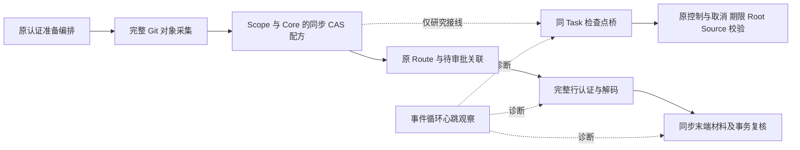
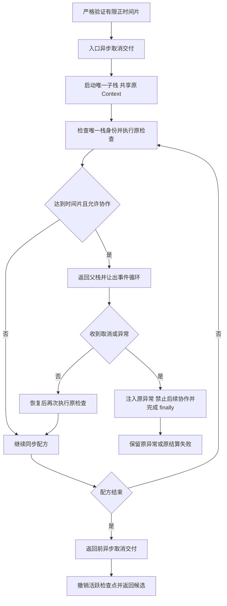
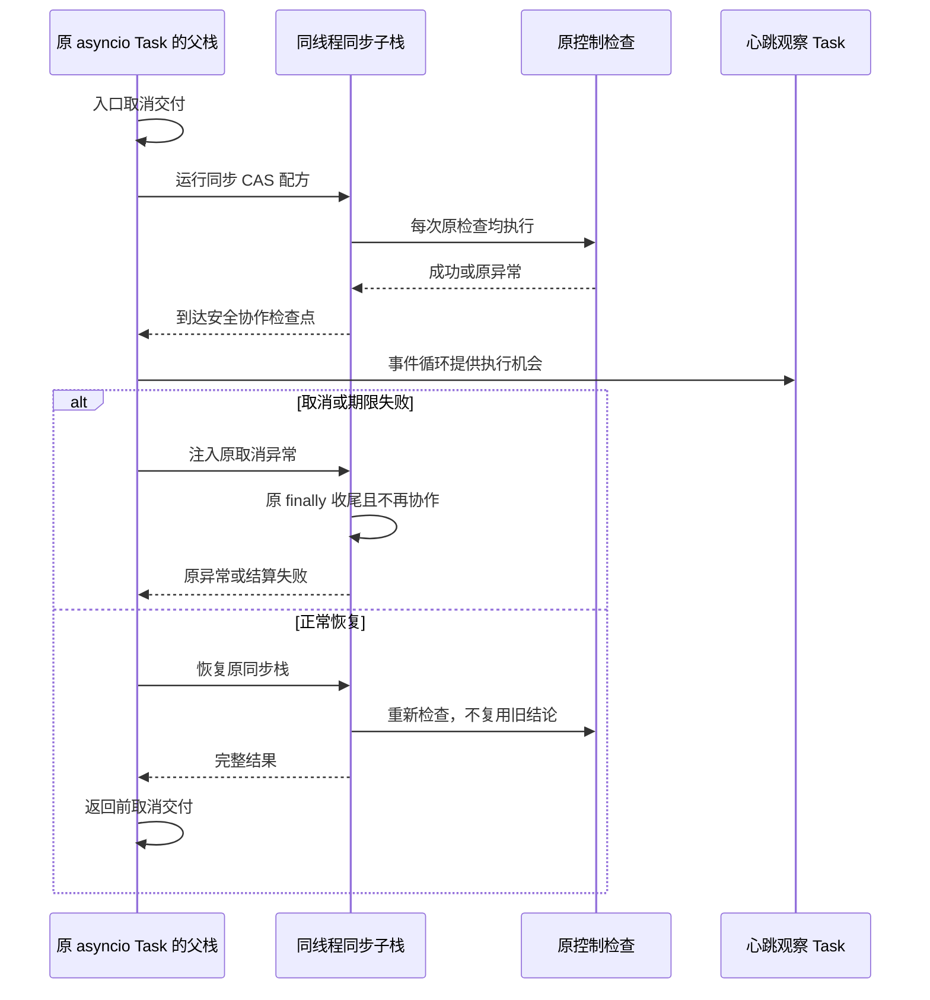

# Git 同步检查点协作调度研究与验证报告

## 1. 背景、目标与结论

原固定安装候选的 SDK 负控出现最大约 21.594 秒的事件循环心跳间隔。同步控制检查可以发现取消、绝对期限和资源替换，却不能让事件循环及时交付其他 Task 的取消或界面事件。此为生产响应性 P1，不是通过延长期限可以关闭的问题。

本研究验证同线程、同 asyncio Task 的同步栈协作机制，以及保留原认证和失败语义的边界；不启用默认 Git Writer，不改认证算法、不缓存认证结论、不减少检查频率，不扩大现有容量、时间或预算上限。

结论为 **`CAS_BRIDGE_MECHANISM_VERIFIED_RESPONSE_P1_OPEN`**。两处 CAS 配方可进行协作研究，但实际 SDK 仍观测到约 **20.419 秒**的最大间隔。仅增加这两处协作入口不足以关闭 P1，当前不具备生产合入条件。

## 2. 固定输入与当前产品边界

实验期间核对的主仓库提交为 `c65d6dbef1032b3456c34359959f803aa063ec29`；实验结束核对时全部 **5101** 件原跟踪文件逐字节保持。本次资料同步不合入生产源码或研究依赖；原源码、锁和配置保持。
独立克隆仅修改两个异步调用位置：`git_checkpoint_materials` 的 Scope 组装、`git_checkpoint_preparation` 的 Core 持久化；原配方函数、取消控制、SQL 和末端复核源码不变。
研究差异（`candidate.patch`）与最终输入全集（`SOURCE_INPUTS_FINAL.json`）固定克隆及外部脚本；该未提交研究副本不能称为当前产品版本。

环境为 macOS arm64、CPython 3.12.7、隔离 `greenlet==3.3.2`。原锁测试依赖以离线哈希方式安装。Owner 子进程使用上一轮固定 Wheel；父进程显式加载研究克隆，逐模块记录来源。这是混合研究装配，**不是新 Wheel 的安装验收**。
外部桥没有进入原四字段源码认证摘要，也没有 Linux/Windows 同候选原生证据，因此不得默认装配或宣告认证配方完整。

## 3. 当前源码与研究接线架构



图中虚线不代表默认产品功能。原完整材料与审阅链继续存在；研究桥仅在两处同步调用外提供协作调度，不持有批准、提交或签名能力。行认证、终端复核和原生 SQL 回调未被自动转为可让出段。

主要源码入口：

| 位置 | 业务职责与约束 |
|---|---|
| [准备控制与入口](../../src/harnessix/product_config/git_checkpoint_preparation.py#L127-L235) | 捕获原取消、总期限、同一宿主与源码配方；保持原异常身份 |
| [材料组装调用](../../src/harnessix/product_config/git_checkpoint_materials.py#L121-L140) | 完整基线、变更后正文进入同一 CAS，再构造 Scope |
| [Core 保存](../../src/harnessix/product_config/git_checkpoint_preparation.py#L423-L468) | 完整规范编码、耐久回读及材料核验后才返回 |
| [原 Ledger 控制窗口](../../src/harnessix/product_config/git_prepared_link_ledger.py#L108-L175) | 原物理连接、事务代际、Owner、完整读集合首末复核 |
| [末端读作用域](../../src/harnessix/workspace/terminal_read_control.py#L94-L112) | 同资源、同线程、同 Task 的同步作用域；不能被共享回调重入 |

## 4. 控制流程与时序



时间片只是**安全检查点之间的协作目标**，不能保证单次原检查、未插桩 IO 或同步终端段的硬时延。`no_yield` 不省略原检查，只禁止研究桥自己的调度切换。



父栈与子栈不是两个线程或两个业务 Task。单独的心跳 Task 不访问业务资源，仅记录时间间隔。

## 5. 接口、类与关键字段

研究入口为 `async cooperate(operation, checkpoint, slice_seconds=0.01)`。`operation` 只接受本次 `Gate`，返回原同步结果；原业务参数、CAS 与 Store 原实例仍由原调用闭包提供。

| Gate 字段 | 含义与拒绝条件 |
|---|---|
| `original` | 原检查函数，每个原检查点必执行；恢复后额外复核，不缓存结果 |
| `child` / `parent` | 精确本次子栈与父栈；同 Task 的兄弟子栈也不能借用检查点 |
| `task` / `thread` | 捕获原 Task、线程，拒绝转交执行 |
| `active` | 退出后撤销；迟到回调直接拒绝，不代表底层资源已自动注销 |
| `depth` | 明确不可让出区域的嵌套深度；不自动识别 SQLite 或终端语义 |
| `closing` | 异常注入后禁止新的时间片切换，执行合法原 finally |
| `last_resume` / `slice_seconds` | 调度目标，不包含硬实时或 CPU 配额保证 |

接口拒绝 NaN、无穷、非数值、布尔值及非正时间片。入口和返回前均异步交付待取消；不调用 `uncancel()`，不把已交付但仍保留的取消计数当成新请求。
实现见研究桥（`probe_bridge.py`）；机制矩阵（`test_probe_bridge.py`）和实际 SDK 计时入口（`sdk_stage_probe.py`）均为研究制品，未纳入产品源码。

## 6. 数据流程、持久化与恢复

完整基线与变更正文仍按原算法形成对象范围和 Core；研究桥只转移控制，不重编码输入、替换 CAS、截断父历史、重建认证对象或修改公开 Schema。
CAS 耐久写入后发生取消可能留下原合同允许的合法孤儿正文；不能因此发布业务成功、批准或自动删正文。原 Ledger 事务提交、回滚与 Owner 收尾继续归原调用方。
桥没有跨进程恢复状态或持久任务票据。异常结束后只要求本次同步子栈已结束、活跃检查点已撤销；实际工作区恢复与业务未知结算仍由原 Runtime 契约承担。

核心逻辑伪代码：

```text
验证时间片；入口 await 交付待取消
冻结同一 Task、线程、Context 和唯一子栈
执行同步配方：每个检查点先执行原控制
  若到达安全时间片：父栈 await，再恢复并执行原控制
  若 await 收到异常：注入同一异常，原 finally 同步完成
配方完全结束后：返回前 await 交付同步段产生的新取消
finally 撤销检查点，记录是否存在未结束子栈
```

## 7. 不可让出的正式边界

1. [Git SQL VM progress/trace](../../src/harnessix/product_config/git_prefix_sql.py#L49-L62)保持完整同步回调、1000 VM 步和首次原异常保存；不可在 C 回调中切换到事件循环。
2. [Session History VM 中断](../../src/harnessix/session/sqlite_history.py#L86-L94)属于 Session 的 SQLite 工作线程，不能调用原 Task 的桥。
3. Ledger 最后外部回调后的后置检查、第二 SQL 窗口、完整终端读集合和观察器退出核验必须连续执行。
4. [终端审批复核](../../src/harnessix/product_config/git_approval_history_proof.py#L184-L200)不得重入原 Execution Store 共享回调。
5. `terminal_read_scope` 的 ContextVar 设置、整个正文、撤销与 reset，以及两个 ThreadLocal 连接登记/handler 清理段不得隐式增加让出点。

共享 Context 能保持原 token 顺序，但不是连接、读集合或业务资源隔离；精确子栈检查也不能阻止绕开 Gate 的资源访问。以上为全局检查点替换的 **No-Go** 条件。
官方机制说明分别见 [greenlet ContextVar](https://greenlet.readthedocs.io/en/stable/contextvars.html)与[切换/异常传递](https://greenlet.readthedocs.io/en/stable/switching.html)。[SQLAlchemy 异步说明](https://docs.sqlalchemy.org/en/20/orm/extensions/asyncio.html#running-synchronous-methods-and-functions-under-asyncio)的受控同步桥不意味着普通阻塞 IO 会自动变成异步。

## 8. 实际测试、缺陷与计时结果

| 范围 | 实际结果 | 适用边界 |
|---|---|---|
| 原型缺陷 RED | 25 节点，6 FAIL / 19 PASS | 非有限输入、入口待取消、无 PAUSE 自取消已真实暴露 |
| 最终机制矩阵 | 25 PASS | 同线程/Task、token、取消/超时、结算失败、精确子栈、过期回调、SQL no-yield、阻塞 IO 负控 |
| 原有终端/SQL 边界 | 16 PASS | 原测试限定集合；不是完整业务消费者或三平台矩阵 |
| r4 实际 SDK 负控 | 1 PASS，107.591 秒 | 源码研究接线，最大心跳间隔 20.620489 秒 |
| r5 同一 SDK 负控计时 | 1 PASS，105.712 秒 | 附加同步入口元数据计时，最大间隔 20.419378 秒 |

两次 SDK 使用**同一测试节点**，不累计为两个独立质量场景；矩阵之间也不按节点数累加为商用覆盖率。r4、r5 和最终机制文件有各自输入身份，实际 SDK 未执行最终排版/类型参数修订后的桥，不冒充最终同字节候选验收。
实际 SDK 只证明该物理替换负控仍拒绝错误结果并完成本次资源收尾，不证明默认产品有全部 Git 功能，也不证明真实模型编码质量。

限定同步入口计时已定位：`ledger.read_rows` 四次调用，最长 **7.424 秒**；`prepared.terminal` 一次调用，约 **3.878 秒**。这些入口未发生协作切换。其余较长间隔尚未完整归因，不能据这两个 span 宣称全部根因已找到；嵌套时长不累加为总耗时。

## 9. 失败原件与修订身份

- 首次机制观察者先结束，未等到预期恢复交错；以显式 Event 修正夹具同步，失败 XML 和当时测试脚本保留。
- 兄弟 greenlet 的异常默认返回其根父栈，不能由子栈局部捕获；仅修正夹具的错误捕获路径，保留原失败。
- 首次 SDK 在研究入口之前因未安装 Owner 启动包失败，另有 `/var` 与 `/private/var` 混用的来源断言错误。原日志/XML保留，不作为桥失败或通过成绩。
- 计时脚本首版缺少生成命名空间的 `functools` 导入，未开始 SDK；原脚本与错误日志保留。
- 修补取消交付点后，一次性观察者先于阻塞 IO 段结束；改为持续心跳观察，并保持 80ms 阻塞负控，不放宽断言。
- 原 Ruff 三项及后继导入分类一项均保留；最终研究桥与矩阵按原仓库 Ruff 配置通过。最终类型参数/异常链及导入修订另作机制复验，不能回写 r4/r5 的输入。

这些是研究夹具、环境和机制修补记录，不能重写上一轮产品缺陷或冻结 R3 成绩。[结构化结果](../validation/git-checkpoint-cooperation-2026-10-07-v1/result.json)、静态复核（`static-review.json`）与计时原件（`stage-spans.json`）提供独立上下文。

## 10. 部署、安全与费用

没有新增产品依赖、正式包版本、CLI 参数、Schema、数据库迁移、部署服务或自动化。隔离环境不可用于替换已交付先导候选，也未接触用户真实仓库、真实凭据或远程服务。
本轮真实模型请求为 **0**；两笔未决费用、原预算预留和暂停规则不变。真实 R3 冻结成绩仍为严格 **0/20**，单人 Beta 实际任务仍为 **0**。

## 11. 下一关键路径与 Go/No-Go

仅对已确定的 CAS 入口进行机制研究为有条件 Go；**全局桥替换、默认装配、性能验收和商业发布均为 No-Go**。
后续优先定位完整行认证/材料恢复的剩余同步占用，并为必须连续执行的终端集合建立真实成本边界；不能以增加两个 `await`、扩大 60 秒期限或放宽认证来替代整改。
正式采用协作桥前仍需依赖/三平台发行、受信配方全源码绑定、全业务消费者、取消和资源交错复验。纯标准库异步迭代仍是待比较路线；本研究不预先宣称已选择或实现。

## 12. 交付与复核

仓库发布本研究及[低敏结果](../validation/git-checkpoint-cooperation-2026-10-07-v1/result.json)，完整实验包以 `git-checkpoint-cooperation-20261007-v1` 固定：报告、输入全集、Review Packet、RED/GREEN XML、源码差异、脚本各版本、安装日志、图像与完整 Manifest。
本研究不将隔离桥发布为产品模块，不提供可替换正式安装环境的实验包。公开结果注明源码、原型、装配、插桩与失败边界；完整包可用于原维护环境复核，不能据摘要推断其他平台已通过。
复核者须区分机制缺陷闭环、同一源码级SDK负控、未满足的响应性与商用门槛。
