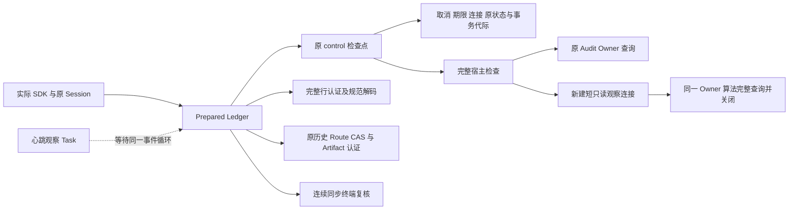
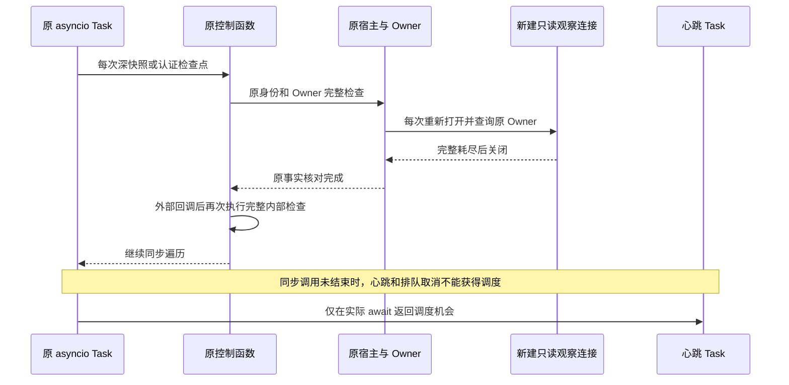
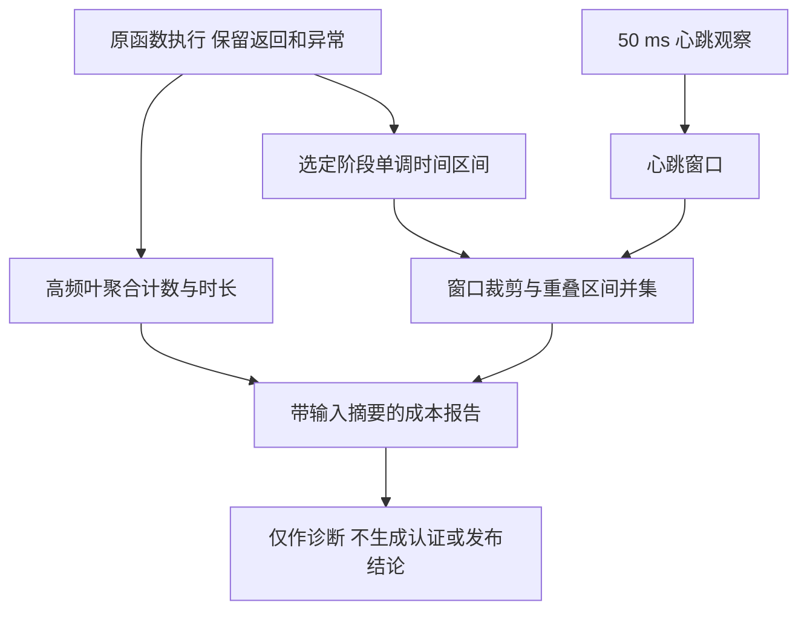

# Git 待审批完整回读的同步成本归因与检查点边界研究

访问与实测日期：2026-10-07。本文区分当前源码事实、单次插桩行为证据和未采用的改造提案；不定义新的公共契约。

## 1. 需求背景、目标与判定

Coding Agent 必须及时响应取消、期限和客户端事件。原 Git 完整准备及回读采用同步深快照、认证和 SQLite 观察，单次字段检查会调用完整宿主认证。该设计可发现失效资源，却不能让事件循环交付已排队的取消。

[前一项同 Task 协作研究](git-checkpoint-cooperation.md)仅覆盖两处 CAS 配方，SDK 最大心跳间隔仍约 20.419 秒。本次改为对**原已安装产品**诊断，不启用研究桥，目标是辨识连续占用中的调用段和原 Owner 观察开销，避免凭局部计时猜测根因。

判定为 **`INSTALLED_PREPARED_COST_ATTRIBUTED_RESPONSE_P1_OPEN`**。限定负控通过，但最大心跳间隔为 **20.761515 秒**；完整认证成本必须整改。诊断不是无插桩 SLA、优化后验收或商业发布证明。

## 2. 固定输入与实际范围

| 输入 | 固定值及边界 |
|---|---|
| 原源码基线 | `b3760f560d2e83f85bc9d880cd9f8b0b0893ad4c` |
| 已安装 Wheel | `harnessix-1.0.0rc1-py3-none-any.whl`，SHA256 `fd56221c5973ce2da12e3e9a5dfeb3ebc6836a7ed0a3c6e1b60b055c76e66dcd` |
| 同字节核对 | 548 件产品包成员与该基线一致；产品模块全部来自隔离安装目录，未从源码回退导入 |
| 环境 | macOS arm64 / CPython 3.12.7；原锁离线安装依赖 |
| 实际节点 | `test_physical_database_file_replacement_after_await_rejects_same_rows`，只运行一个 SDK 物理替换负控 |
| 观察方式 | 原函数外层计时；高频叶函数仅聚合次数、总时长和最大值；50 ms 心跳 Task |
| 本次变更 | 产品源码、Schema、依赖、锁、容量及期限均不变；模型请求 0 |

测试耗时约 102.05 秒，结果 1 通过、0 失败、0 错误、0 跳过，保留 1 项插件预导入警告。不能把同一负控当作真实任务质量，不能与不同插桩的旧值相减宣称提升。

## 3. 当前总体架构与模块职责



`control` 同时负责取消/期限、外部回调和完整认证。深模型、JSON、CAS 与末端复核都传递该控制函数，因此纯字段遍历也执行数据库观察。图中没有后台线程、共享观察池或认证缓存。

| 模块及源码位置 | 当前职责 |
|---|---|
| [Ledger 控制作用域](../../src/harnessix/product_config/git_prepared_link_ledger.py#L108-L175) | 冻结原宿主、连接、资源引用和事务代际；执行内部检查→外部回调→内部检查；终端不再调用外部回调 |
| [宿主首末绑定](../../src/harnessix/product_config/git_delivery_review_host.py#L64-L125) | 验证原 Session/Guard/Root/Audit/fence；保留原 Audit 查询并补充短观察 |
| [短观察创建与关闭](../../src/harnessix/product_config/git_delivery_review_host.py#L35-L61) | 每次新建原生只读连接；原文件 pin 首中末核对；失败关闭并传播稳定错误 |
| [唯一 Owner 算法](../../src/harnessix/trusted_actions/ownership_store.py#L48-L69) | 完整耗尽原两字段查询，比对 Generation 和 Token 摘要；不复制算法 |
| [行解码](../../src/harnessix/product_config/git_prepared_link_rows.py#L46-L81)与[规范 Wire](../../src/harnessix/product_config/git_prepared_link_wire.py#L27-L68) | 完整前缀、十一列投影、重复键、严格类型、深快照和规范字节验证 |
| [业务认证编排](../../src/harnessix/product_config/git_prepared_link_proof.py#L162-L244) | 原等待审批历史、唯一 Route/Call/Review、完整材料与 Artifact 首末核验 |
| [Core 加载](../../src/harnessix/product_config/git_delivery_core_store.py#L138-L166) | 原 CAS、摘要、规范解码与深模型边界，不能擅自跳过 |
| [终端读集合](../../src/harnessix/product_config/git_prepared_link_observation.py#L120-L144) | 同线程/Task 连续复核整个证据集合；不进入共享 SDK 回调 |

## 4. 控制流程与时序



末端作用域使用内部检查，不调用外部回调、不 await。可取消检查仍执行，但不能把“检查了 CancelToken”解释为事件循环已经交付取消。

## 5. 数据结构与重点字段

本研究脚本不进入包或生产认证配方。生产模型、SQL 和错误码保持原定义。

| 结构/字段 | 含义及约束 |
|---|---|
| `groups.function / phase` | 被计时函数和最近选定父阶段；叶计数不等于唯一业务任务数 |
| `calls / total_seconds / max_seconds` | 包含式调用次数/总时长/最大值；互有嵌套，不得直接相加 |
| `spans.start / seconds / parent` | 单调时钟原阶段区间；`outside_phase` 仅表示未包在另一选定阶段内 |
| `top_gaps.start / seconds` | 心跳观察窗口；包括同步占用与正常调度误差，不是硬期限证明 |
| 区间并集归因 | 裁剪阶段到心跳窗口，再合并重叠区间；嵌套计时只算一次 |
| `installed_modules_only` | 记录实际 Harnessix 模块路径全部属于固定安装；不代表所有安全或平台门禁通过 |
| `PreparedLinkEvidence` | 现有原认证历史、Route、Review 正文及关联；只能供末端复核，不能授予执行权 |



不采集参数、局部变量、SQL 正文、Owner Token、路径正文、模型输出或凭据。脚本仅记录模块来源路径、固定函数名和诊断数值。

## 6. 已安装实测与成本解释

| 原函数聚合 | 调用次数 | 包含式总时长 |
|---|---:|---:|
| `host.fresh_owner` | 395,523 | 43.281326 秒 |
| `host.open_owner_reader` | 395,523 | 11.322847 秒 |
| `owner.full_query` | 791,051 | 26.293215 秒 |

`open_owner_reader` 在 `fresh_owner` 内，部分 `full_query` 也在其中；三行不得相加为整体耗时。约 39.6 万次观察证明高频原认证具有显著累计成本，不证明单一函数独占全部延迟。

最长心跳窗口的主要**非嵌套阶段**依次为 Source 检查、Core 加载、同步终端、完整行解码和另一遍 Core 加载，分别约 0.265、4.464、3.982、7.510、4.393 秒。所有选定区间的并集覆盖该最长窗口 **99.6718%**，剩余约0.068130秒未归因。输入仅保留10个最大窗口，非全部76次心跳；10窗口并集的覆盖率为87.3082%，另一15.262002秒窗口仍有11.751088秒未归因。精确覆盖比例及未覆盖区间由[结构化归因](../validation/git-prepared-cost-attribution-2026-10-07-v1/result.json)固定；未覆盖部分不擅自归到 SQLite 或任何未计时函数。

最长行回读约 7.576 秒，深解码约 7.546 秒。微小 UTF-8 复用或静态白名单分配优化不能被当作本问题的完整解法。

## 7. 不采用连接复用的原因

每次完整查询加 `fetchall()` 只耗尽本次游标，不能清除同连接其他未消费游标的隐式旧视图。操作内连接复用还改变重开失败观察、pathname ABA 与句柄实体、关闭时机和失败轨迹，不能证明与当前严格契约等价。

当前裸 `Callable` 也没有操作退出协议。未建立显式资源生命周期、独占连接证明及相关负控前，不新增池或长期观察连接，不改原关闭断言，不把 `in_transaction=False` 当作新鲜性证明。原 FD、ABA、回调后永久 Owner 和 B7 仍不得据此宣告闭合。

## 8. 待决的分层检查点提案

**本节为提案，当前未采用、未实现、未取得验收。** 保留原类型/字段/规范字节/完整材料验证，把纯计算取消检查与事实认证分开；不得将有 IO、共享回调或宿主方法调用的段伪称纯计算。

| 候选层 | 拟承担职责 | 必须单独证明 |
|---|---|---|
| 纯工作控制 | 递归字段仍逐项检查取消与原绝对期限；只处理独占、已冻结输入 | 实际没有外部回调/IO；完整字段算法和错误原件保持 |
| 完整事实认证 | 入口/出口、每次外部回调与 await 前后、SQL 边界及效果前重验原 Owner、pin、资源、完整读集合 | 失效不能返回成功或进入写入；错误顺序差异明确记录 |
| 连续终端认证 | 原作用域禁止 await/回调，重验最终精确业务事实 | 不缓存结果，不复用跨操作证据，不增大期限或降低容量门槛 |

原逐字段完整观察能发现部分暂态 Owner 失效；减少这些观察会改变失败集合、发现时刻、调用方回调次数和部分异常先后。公开codec/Core任意回调合同不得被私有分层静默改变。最终认证也不能保证观察期间从未发生 ABA，故不得宣称“严格等价”。正式变更须先明确契约、决策与负控，之后再修改实现；未决期间保持当前产品行为。

建议流程伪代码仅描述责任，不作为现行接口：

```text
进入原操作并执行完整认证
以取消/期限控制构造私有纯计算候选，完整模型算法不省略
在任何共享回调或 await 前后执行完整认证
在原 SQL 边界验证完整前缀和事务代际
以禁止让出的终端作用域重验全部最终事实
完整认证成功后才允许返回；写入仍受原单独准入约束
```

分层本身不能让同步 Python 自动变成异步。后续仍须原生分段编排、真正安全的调度点及无插桩实际 SDK 响应性验证，不引入全局 yield、线程搬移或未经认证的桥。

## 9. 测试、失败、恢复与准入

当前只取得一项实际 SDK 物理替换负控通过和诊断数据；分析器26项合成区间测例在最终CPython3.12.7上下文通过，不替代产品回归。初次CPython3.8.2隔离启动因未加入私有分析器目录出现26项导入错误，原日志保留；修正启动路径后3.8.2及最终3.12.7分别通过，同一26项不累计为52项，且不是产品RED。
现有[隐式 Owner 快照](../../tests/product_config/test_git_review_fresh_owner.py)、[宿主绑定](../../tests/product_config/test_git_review_runtime_fence.py)、[完整关联控制](../../tests/product_config/test_git_prepared_link_controls.py)和[原 Owner 算法](../../tests/trusted_actions/test_runtime_owner_observer.py)仍是后续回归输入，本文未宣称全部重跑。

改造最低负控必须覆盖：原连接关闭/替换；隐式旧游标；外部回调与 await 后永久 Owner 修改/删除；原对象/fence 变化；SQL 中断、取消和超时的原异常；物理替换；完整材料与规范字节篡改；事务代际和终端重入；新旧失败时点与范围。所有旧失败保留，不能只报告通过子集。

认证失败仍拒绝返回或效果；关闭新观察连接不关闭原 Audit，不补签、不重建宿主、不把未知计为成功。当前不执行 Git Writer、Commit、恢复或 Backup2。

## 10. 交付与发布边界

[验证摘要](../validation/git-prepared-cost-attribution-2026-10-07-v1/README.md)链接固定数值与范围；本地完整交付包含原安装来源、完整冻结源码、脚本、原日志/XML、分析测例、图像、Review Packet 与 Manifest。

产品依赖、版本及原期限不变，三平台未重验，默认完整 Git、独立 Commit、Backup2、真实 R3、两笔费用未决、消费者安装与独立 Beta 保持开放。首位单人 Beta 的真实任务数为 0，不能作为独立用户门槛通过；不关闭 P1 或 R1～R6。


## 11. 提案的精确切分点与接口约束

下表只为后继详设提供真实切分点，不是采用决定。

| 当前入口 | 可讨论的私有纯段 | 不可降为纯计算的边界 |
|---|---|---|
| [Ledger控制](../../src/harnessix/product_config/git_prepared_link_ledger.py#L134-L175) | 私有递归的取消、同一预算和父Task取消基线 | 完整检查仍按原顺序；原父Task检查发生于内部函数正常返回之后，不能任意前移 |
| [Wire](../../src/harnessix/product_config/git_prepared_link_wire.py#L20-L68) | 原重复键、严格类型、深快照、重编码的私有递归 | 首末完整检查；公开任意checkpoint回调保持，不全局替换共享控制 |
| [业务认证](../../src/harnessix/product_config/git_prepared_link_proof.py#L162-L244) | Route返回后的快照、approval快照、封套及已读材料的Review构建/编码 | Route.status、Source、CAS、两次历史、Artifact.verify_reference/分页读取均为真实端口；首次异步读取前也需完整边界 |
| [Core加载](../../src/harnessix/product_config/git_delivery_core_store.py#L138-L166) | 确定字节后的私有decode递归 | blob真实读取与原Store构造回调、读后/返回前完整检查；不能整体降级CoreStore |
| [发布与终端](../../src/harnessix/product_config/git_prepared_link_ledger.py#L235-L300) | 编码内部的私有模型递归 | 写前、INSERT前、发布await前后、全集回读及最后连续终端；失败仍由原调用方回滚 |

终端不可调度段从第一个SQL窗口退出的末次外部检查之后开始，包含第二SQL窗口、全部evidence同步核验、外层最后状态观察及资源清理。`@contextmanager`的结构性`yield`不是调度点。

当前沿链只有一个`Callable`，无法从函数名判断其纯度。`_Checkpoint`、Wire异常包装、`_native_checkpointer`只是转调控制；原Store/Audit读取还可能调用构造时回调。任何含这些端口的复合调用都不能整体换为轻检查。

## 12. 后继负控追踪矩阵

前三个名称为拟新增测例，尚不存在、尚未执行；后七项为现有回归输入，本文不宣称重跑。

| 节点 | 覆盖要求 |
|---|---|
| 拟新增 `test_layered_external_callbacks_and_io_keep_full_check_sandwich` | 外部回调/真实IO前后完整夹层；正常返回后Owner撤换仍失败，控制原异常与共享回调身份保持 |
| 拟新增 `test_layered_checkpoint_fault_precedence_is_explicit` | 坏数据、Owner漂移、领域/Task取消和期限同时发生时，原先后差异明确裁定；不能按同code伪装控制来源 |
| 拟新增 `test_layered_transient_owner_aba_failure_set_is_not_silently_narrowed` | 无持久痕迹的内存/fence/pin暂态ABA与已提交/同连接写后还原分别判断；不把减少拒绝伪称等价 |
| [Ledger](../../tests/product_config/test_git_prepared_link_ledger.py) `test_cancellation_callback_epoch_and_late_write_reject_without_persistent_link` | 回调异常、取消、事务代际、晚写和到期不登记持久成功 |
| [终端](../../tests/product_config/test_git_prepared_link_terminal.py) `test_original_session_commit_after_actual_authentication_is_rejected` | 已提交写后还原拒绝，空提交不误判 |
| [终端](../../tests/product_config/test_git_prepared_link_terminal.py) `test_anchor_only_write_and_restore_after_authentication_is_rejected` | 尾锚还原最终字节仍拒绝 |
| [终端](../../tests/product_config/test_git_prepared_link_terminal.py) `test_last_external_sql_callback_cancel_or_expiry_cannot_return_success` | 最后外部SQL回调取消/到期仍失败 |
| [终端回调](../../tests/product_config/test_git_prepared_link_terminal_callbacks.py) `test_actual_sdk_terminal_never_calls_shared_callbacks_and_restores_normal_reads` | 扩展多evidence和调度探针；正常/异常退出无重入并恢复普通读取 |
| [终端回调](../../tests/product_config/test_git_prepared_link_terminal_callbacks.py) `test_actual_sdk_missing_core_source_and_route_parents_after_last_authentication_reject` | 末次认证后Core/Source/Route父闭包缺失仍拒绝 |
| [公开合同](../../tests/product_config/test_git_prepared_link_contracts.py) `test_all_boundaries_preserve_exact_original_checkpoint_exception` | 公共snapshot/encode/decode首中末任意回调原异常不被私有分层改变 |

持久写后还原可留下`data_version / total_changes / epoch`痕迹，仍须检测；无持久痕迹的暂态A→B→A可能只被原递归采样观察。分层会改变这部分拒绝集合，且已经发生的其他错误可能先于末端认证，不能靠末端复核恢复旧错误顺序。

## 15. 后继原完整校验单次cProfile：成本主因修正

[固定当前源码专项验证](../validation/release-followup-2026-10-08-v2/README.md)不启用分层桥、
不减少callback/freshOwner/physical/MAC/授权，不改变60秒消费者或120秒Turn期限。
一次真实SDK fixture `read_all`进入terminal完整重验时期限拒绝，原FAIL保留；
Turn年龄约24.8→84.8秒，不是120秒审批过期。fixture签名seed不证明生产Writer。

profile约149M函数调用、wall60.000605秒、父CPU59.841757秒；不重叠self-time显示SQLite约21.996秒、
文件身份/路径约20.247秒、JSON/model JSON约0.045秒。深快照函数30秒级cumtime大部分是逐叶full检查嵌套，
不能将其说成JSON解析自耗，也不能将不同cumtime相加。完整SDK历史及nativeGit不是本样本主成本。

freshOwner122898、Owner读取245796、外callback52361、stat2704844；GitDB total_changes=0、
MAC及全状态前后相同。最大同loop心跳间隔27.304秒是带profile观察，不是无插桩SLA。

未实施小候选：同次factory的四固定期望Path纯值构造，以及同次host closure的原生绝对不可变Path纯URI字符串。
分别涉及约2.38/1.21秒累计成本，不能宣称足以解决P1。每次live字段读取、connect/PRAGMA、Owner、身份检查、
回调、MAC、期限及异常关闭均保留；首次URI编码仍在stat后/connect前，子类和相对Path回退原路径，
不缓存resolve、实体身份、观察连接或认证结论，不引入全局LRU。精确差分及收益验证未执行，P1继续OPEN。

## 固定期望路径候选与主仓接入边界

后继候选从`faec7a017e801dd5376fdb1ca0fb6490c67ef4ba`分别建立原与新tracked副本，
5180件源码逐项核验，仅`git_user_authority.py`改变。完整设计见[纯路径详设](../changes/m09-r4-git-authority-pure-paths.md)。
40短测及原/候选各一次full-check SDK回读通过，沿原60/120秒，无profile、无layered桥。
右值构造990412→8；freshOwner123313、Owner246626、verify246627、外callback52361、
auditPhysical369940、四库身份493260、GitDB pin123313及terminal1均相同。
各自数据库/CAS/Git/原MAC摘要不变、total_changes0；两个独立随机身份的MAC不要求互相同字节。

读取35.719→31.602秒是单组有计数包装观测，不能据此确认稳态SLA；
候选最大心跳间隔14.300秒仍显著阻塞调度。原60秒profile失败、20秒级历史负控和默认关闭的layered研究保持。
主仓接入仅复用same-closure native纯词法Path，live检查及原异常顺序不削减；
URI复用没有实施，Owner/连接/认证缓存禁止。完整响应性P1与approved Writer/B4/B7仍开放。
