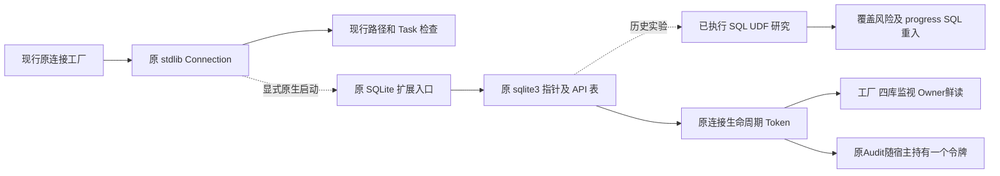
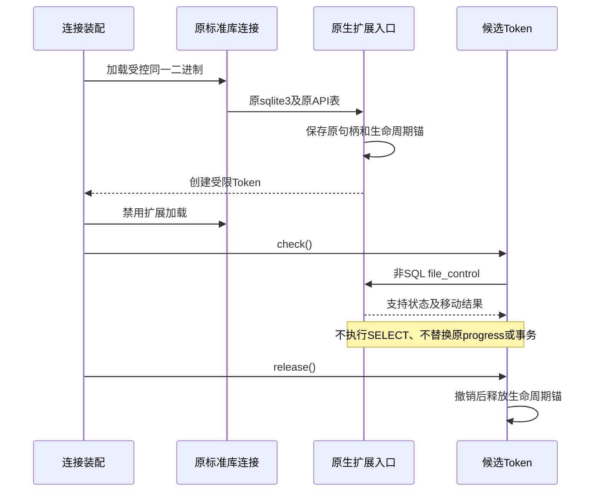

# 原 SQLite 连接来源检查：公开原生 API 研究与接线约束

- 冻结访问日期：2026-10-08。
- 本轮工厂接线前源码基线：897c5df42ddb15d180f532eb0a29c574e3ea7edd；第 4、5 节原桥研究参考提交仍为 d5c572aff2fedae11d25fd1b0e8a4ca41062a8d2。
- 研究结论：公开扩展入口可以获得原标准库连接对应的 SQLite C 句柄；主库移动检查可复现普通置换及指定 ABA 反例。
- 准入结论：**原生组件已接入原连接工厂的显式启动模式，尚未默认启用；完整 FD、B7、P1、默认 Git Writer 与发布均不因此通过。**

## 1. 需求背景与设计目标

[原连接工厂](../../src/harnessix/product_config/git_prepared_link_connection.py)固定原 exact
`sqlite3.Connection`、Task、路径和父目录物理身份。打开前后 `lstat` 一致，
仍不能排除路径暂时指向 B、SQLite 打开 B、路径恢复 A 的窗口。
`PRAGMA database_list`报告文件名，不证明已经打开的底层主库就是当前路径指向的文件。

原 Runtime Thread scope 已解决一部分锁归属；来源检查是另一项独立问题。
目标是保留标准库连接、现有事务和消费者，求证能否用原连接的公开 C API 补充检查，
避免整体更换数据库驱动及重写全部 Store。不以路径比较升级措辞冒充原生句柄证明。

非目标：授予 Git 写入能力、跨库事务、撤回已提交效果、缓存 Owner、放宽期限、
改变控制 callback 频次、任意恶意同进程代码隔离或完整 WAL／SHM 认证。

## 2. 官方源码事实及适用边界

| 来源 | 冻结依据 | 与研究有关的事实 |
|---|---|---|
| [SQLite 扩展接口](https://www.sqlite.org/loadext.html) | 2026-10-08 文档 | 扩展入口接收原连接及 API 表；加载能力必须显式启用 |
| [file-control 接口](https://www.sqlite.org/c3ref/file_control.html) | 2026-10-08 文档 | 在指定数据库的 VFS 上调用 file-control；需检查返回状态，不把不支持当成功 |
| [Unix 3.45.3](https://github.com/sqlite/sqlite/blob/version-3.45.3/src/os_unix.c#L1500) | 已下载源文件 SHA256 绑定于研究原件 | `HAS_MOVED`比较当前路径 inode 与 VFS 保存 inode；不导出实际 FD／`st_dev` |
| [Windows 3.45.3](https://github.com/sqlite/sqlite/blob/version-3.45.3/src/os_win.c#L3585) | 已下载源文件 SHA256 绑定于研究原件 | 提供 `WIN32_GET_HANDLE`分支，不能沿用 Unix `HAS_MOVED`成功假设 |
| [函数生命周期](https://www.sqlite.org/c3ref/create_function.html) | 2026-10-08 文档 | 覆盖、关闭及注册失败均可能触发 userdata 析构 |
| [连接关闭](https://www.sqlite.org/c3ref/close.html) | 2026-10-08 文档 | `close_v2`可能延后销毁存在未完成 statement 的连接 |

同时冻结复核 3.53.4 的 Unix／Windows 文件，不把移动分支版本当当前运行库。
实际 Python 3.12.7 使用 SQLite 3.45.3；另一个 Python 3.13.8 的加载能力探针使用 SQLite 3.50.4。
它们是本机环境证据，不是三平台安装矩阵。

Unix `HAS_MOVED`是**原 SQLite 句柄驱动的主库移动检查**，不是完整 OS FD 身份结构。
它没有逐项返回 FD 的设备、inode、WAL 或 SHM 关联；VFS 不支持、内存库及其他布局需失败关闭。
特权挂载、设备边界和未知 VFS 不包含在已测反例中。Windows需独立的句柄读取及身份合同。

## 3. 总体架构及当前／候选区分



图中 Token 消费链仅在显式启动原生模式时生效，默认 CLI/SDK 尚未启用；历史实验与当前显式接线已分开标注。
产品保留路径／Task／锁合同。原生检查只增加单连接来源观察，不取代 Session 历史、MAC、
策略、Artifact 或四库变化检测。原 Audit 连接、鲜读 Audit 连接和固定变化监视连接是不同实际实例，
不能用其中一条的检查结果替代其他连接。

## 4. 已执行最小 UDF 实验

实验 C 函数通过原扩展 API 表调用原数据库的 `file_control(main, HAS_MOVED)`。
参数先置为 `-1`，只接受明确支持且输出为 0／1 的结果；内存库失败关闭。
函数设置 `DIRECTONLY`，不声明 `DETERMINISTIC`；加载结束再次禁用扩展。
不使用 CPython 私有结构偏移，不装载另一套 SQLite 引擎，不新开用于认证的连接。

五个独立用例已经执行并由保存的 Python runner 重新验证：

| 用例 | 实际观察 | 能证明／不能证明 |
|---|---|---|
| 打开 A 后路径被 B 替换 | moved=1；原查询仍读 A | 能拒绝该置换；不是全部文件系统攻击证明 |
| 打开 B 后恢复原 A 的 ABA | 前后路径物理 pin 相同；moved=1；原查询读 B | 复现当前路径 pin 的缺口，原句柄检查发现这个反例 |
| Python 同名函数覆盖 | 原 flags=524288、覆盖后=0；伪造标量0 | 实际复现风险；**不是 UDF 认证通过** |
| 加载结束 SQL `load_extension` | 固定拒绝 | 验证该连接当前 SQL 加载限制，不外推任意进程权限 |
| 内存数据库不支持 | 固定能力不可用错误 | 不支持时不降级为路径成功 |

这五个用例均为隔离实验，不计入 SDK 回归、真实编码任务或发布成功率。

## 5. 非 SQL 候选流程与时序

直接用 SQL 调用认证 UDF 不适合作为当前 progress 检查：原 progress callback
再执行原连接上的 SELECT 会造成同连接 SQL 重入。Python 也能覆盖同名 UDF。
后继研究改为原生 Token 的非 SQL `check()`，SQL dummy 只承担生命周期撤销，不返回认证值。



该图定义候选流程，不表示生产装配或完整 FD 认证已完成。

### 5.1 接口、类与重点字段约束

| 对象／字段 | 职责与约束 |
|---|---|
| `attach(connection)` | 只接受原 exact Connection；经公开加载入口获得原句柄，不接受调用方提供指针 |
| `Token.check()` | 非 SQL 检查；不能构造第二条连接、跳过检查或在重入时直接放行 |
| `Token.release()` | 撤销先于资源释放；重复释放幂等，旧 Token 不因重开或新 attach 复活 |
| 原连接引用 | Token 关联同一实例；不能被 Python 属性覆盖成另一连接 |
| 原 API 表／原 db | 每个绑定保存实际来源；不能被其他连接加载覆盖成全局“当前 db” |
| 生命周期代次／撤销位 | dummy 被覆盖或连接关闭时失效；dummy 返回值不参与认证 |
| 原线程归属 | 与当前原 Task／锁 scope 组合使用；线程同一不等于 Task 同一 |
| 生命周期锚 | 如采用未执行 statement，需证明关闭、错误、GC、并发的资源归属与回收；不可把锚本身当授权 |

### 5.2 核心业务伪代码

```text
装配(connection):
    拒绝非 exact 原连接、重入装配、未知加载能力
    经原连接加载可信桥，捕获原 db 和原 API
    创建可撤销生命周期状态
    检查 main file-control 确实支持且未移动
    禁止静默回退到路径 pin
    返回只能由桥创建的 Token

检查(Token):
    验证原线程、活动状态、原连接未关闭
    直接通过原 API 对原 db 执行非 SQL file-control
    复核撤销与关闭状态
    任一未知／变更均失败关闭
    不改 Owner 鲜读、原进度回调或现有事务

清理(Token):
    先永久撤销
    释放属于本绑定的生命周期资源
    不关闭借用的业务连接，不 COMMIT，不吞原首异常
```

### 5.3 实际生命周期反例及窄修复

首轮原型仅以 Python 原实例及 `in_transaction` 检查关闭状态，
在原连接对象调用 `__init__`重新绑定 B 时，原 Token 仍检查被 lease 保留的旧 A 句柄并错误放行。
这是实际红测，不以“同一 Python 对象”当作原 SQLite 句柄连续性。
已按 [3.45.3 `main.c`](https://github.com/sqlite/sqlite/blob/version-3.45.3/src/main.c#L2751)及
[`util.c`](https://github.com/sqlite/sqlite/blob/version-3.45.3/src/util.c#L1547)求证公开 `errcode`路径：
在原递归 mutex 内先检测原句柄的 `MISUSE`，拒绝 zombie 后才执行移动检查。
该zombie行为由3.45.3实现及实际配对确认，不是跨版本公开生命周期自省承诺；研究桥限定该运行库。
不依赖仅在 `API_ARMOR`启用时有效的 `db_name`／`db_readonly`附加保护，
也不用新旧 autocommit 布尔值相同来证明句柄相同。

改后隔离主矩阵20通过、0失败，另1例确认边界；原红测与修改前后源码分别保留。
直接重新初始化及先关闭再重新初始化均拒绝，原资源计数归零。
追加实际 progress 中两轮原异常对象 `is`断言通过：有桥／无桥均第7次中断、无新增SQL、事务不变。
这是本机窄 API／生命周期研究，不是正式宿主集成或可发布二进制。

如果原合法打开连接此前存在 `MISUSE`，该检查可能保守拒绝；错误分类及支持的运行库范围
须在正式生产合同中说明，不能删除检测来追求全部正控成功。
原 A 句柄存续时路径 A→B→A 且检查未观察到 B，是明确未检测反例；
成功点时观察不证明整个历史或至后续 COMMIT 的连续性。

### 5.4 内存检查的实际环境阻塞

同一冻结桥源码的 ASAN 构建成功；本机 Apple Clang 12.0.0／Darwin 27.0.0 的
独立可执行程序与 Python 3.12 正控均在 ASAN 拦截器初始化阶段失败，未进入桥的生命周期测试。
LSAN 正控明确报告该平台不支持 `detect_leaks`。因此 ASAN、LSAN 均未通过，
没有据此观察或排除候选内存缺陷。该轮临时实验目录已失效，初始化失败原件当前不可回验；
普通资源计数归零不能替代有效内存检查，也不改变 B7 或生产准入结论。

后继固定 Python 镜像的真实环境为 Alpine 3.22.2／aarch64-musl、Python 3.12.11、
SQLite 3.49.2。原桥源码从封存清单恢复并验哈希，3.45.3 版本保护未修改。
该镜像没有编译器、SQLite 开发头或 sanitizer runtime；普通编译以及
ASAN／UBSAN／LSAN 各自正负控的编译均以 127 退出，控制程序和桥生命周期矩阵均未运行。
报告生成成功不代表工具有效，不能把缺少编译器造成的非零退出计为内存负控通过。
该轮无下载、无安装、无挂载、无网络，只回收本轮创建的容器，不改变原生准入结论。

## 6. 失败、恢复、持久化与安全边界

这是瞬时来源观察，不新增持久 Schema、MAC、业务凭证或迁移。
进程恢复必须重新从实际连接装配 Token，不持久化裸指针或将 Token 序列化到 Session。
加载不可用、API 表不匹配、关闭、覆盖、跨线程、原库移动及不支持均拒绝。
下游正式错误分类及原异常对象传播需在生产接线设计中明确，研究异常不直接新增公共 AgentFailure。

取消、期限及原 Runtime 锁仍由原 scope 负责；Token 不拥有业务执行或提交能力。
来源检查不消除保留 WAL 读事务造成的 Owner 陈旧快照，不能删除现行短 Audit 鲜读。
能力不可用不启用 approved Writer；已发生的外部效果不能通过 Token 撤销。

## 7. 测试、部署兼容与生产准入条件

| 必需矩阵 | 当前边界 |
|---|---|
| 原连接成功／置换／ABA／不支持 | SQL UDF 五例已执行；非 SQL 候选单独验证 |
| dummy 覆盖、旧 Token、关闭、GC、重复清理、双连接 | 非 SQL 生命周期必测，不用 SQL flags 代替认证 |
| 原 progress 内检查、回调首异常、查询无重入 | 非 SQL 必测；不得暂时关闭原 progress 来得到绿测 |
| 读写事务、total_changes、无额外 SQL、FD 稳态 | 与原基线对照；探针自身连接必须显式关闭 |
| 原 Audit／鲜读／监视连接与实际 Ledger | 待生产候选接线和同候选安装验证 |
| 三平台与架构、加载受限环境 | 尚未完成，不以本机 dylib 称为正式 Wheel 支持 |

当前正式构建使用 hatchling，候选是纯 Python Wheel。原生桥将引入平台与 Python ABI、
可信二进制定位、完整性、编译及安装门禁；需要显式设计，不能复制本机 dylib 到产品目录即发布。
Windows不支持 Unix实验分支时应明确拒绝，不能标记平台全绿。当前主仓依赖及 Wheel均未变。

### 7.1 原连接公开能力复验

在本机两套独立 Python 进程中，通过公开扩展入口直接检查各自原标准库连接，
分别运行 DELETE、WAL、内存库三种模式。探针仅依赖系统 C 库，SQLite 调用使用原连接的 API 表，
不链接第二套 SQLite、不访问业务状态、不输出指针值，也不承担认证。

| 运行库 | `FILE_POINTER`／`JOURNAL_POINTER` | `HAS_MOVED` | `WIN32_GET_HANDLE`／`FILESTAT` |
|---|---|---|---|
| Python 3.12.7／SQLite 3.45.3 | 三模式均返回成功及非空对象指针 | DELETE／WAL 返回 0；内存库返回 `SQLITE_NOTFOUND` | 本机各模式均返回 `SQLITE_NOTFOUND` |
| Python 3.13.8／SQLite 3.50.4 | 三模式均返回成功及非空对象指针 | DELETE／WAL 返回 0；内存库返回 `SQLITE_NOTFOUND` | 本机各模式均返回 `SQLITE_NOTFOUND` |

[官方操作码合同](https://www.sqlite.org/c3ref/c_fcntl_begin_atomic_write.html)将前两项定义为
`sqlite3_file*`，不是 Unix OS FD。内存库也返回非空对象，实际说明“指针存在”不能证明打开了普通文件、
journal 或 WAL；本探针没有把非空指针解释为底层文件身份。`FILESTAT`是依赖编译选项的诊断能力，
不是通用认证端口，不能以新版文档中的操作码推定旧运行库具备能力。
六个模式检查保持原行、`total_changes`和显式事务不变，加载结束均验证 SQL 扩展加载被拒绝。
这些结果不覆盖 Windows 执行、进度回调重入、桥内存安全或完整 FD／WAL／SHM 绑定，B7 仍未完成。

### 7.2 固定 Linux 原桥的有效内存检查

原工具链阻塞已在独占普通容器内解除：固定 Python 镜像不变，无宿主挂载、无额外 capability；
从官方签名 Alpine 仓库安装 GCC 14.2.0 和 Clang／compiler-rt 20.1.8。
官方 SQLite 3.45.3 源码与发布页 SHA3-256 匹配；进程启动前选择该共享库，
63 个实际 case 的映射均只有这一 SQLite 引擎。没有删除原桥的 3.45.3 guard 或加载第二套 SQLite。
原 C 和 21 项断言逐字保留，runner 只修改 Python 可执行路径。

| 检查 | 工具有效性 | 原桥执行结果 | 准入结论 |
|---|---|---|---|
| ASAN | 独立及实际 preload 正／负控有效，UAF 确被发现 | 20 项断言通过、1 项已知反例；21 个进程均因泄漏退出 73 | 非 clean pass |
| UBSAN | 独立及实际 preload 正／负控有效，非对齐写确被发现 | 20 项断言通过、1 项已知反例；21 个进程退出 0 | 仅本次原桥已执行路径未报告 UB |
| LSAN | 独立及实际 preload 正／负控有效，故意泄漏确被发现 | 20 项断言通过、1 项已知反例；21 个进程均退出 73 | 未闭合 |

无桥同入口及原标准库定义对照均报告 3824 bytes／4 allocations；只 import 桥、不 attach，
已报告 55615 bytes／44 allocations。一个 976-byte 分配组包含原 `PyInit_direct_bridge → PyErr_NewException`，
符号化定位原 C 第 417 行；其余初始化／退出分配尚未完整归因。
State／lease／userdata 计数归零不等于所有内存释放，不能按 Python 基线全局扣减或 suppression 宣布通过。
Python／SQLite 本体未插桩；原生桥的已执行路径与分配拦截证据不覆盖全部原生内部。

原首次无效 UBSAN／LSAN 负控、包名解析失败、完整泄漏栈、官方来源和工具二进制均保留。
独占容器已清理，其他容器未变。原桥仍仅研究、未进入生产包，瞬时 A→B→A 反例仍成立，
ASAN／LSAN、完整 FD／WAL／SHM、B7 与三平台准入保持开放。
本轮固定原件位于 `~/Library/Application Support/Harnessix/verification/r4-owned-sync-and-linux-memory-20261008-v1`；
其中结构化结果与 manifest 可复算，原工具链尝试失败不会被后继有效执行覆盖。

### 7.3 模块引用释放窄修复与标准库错误缓冲对照

原桥已实现 `m_clear`，但没有 `m_free`；[公开模块合同](https://docs.python.org/3.12/c-api/module.html#c.PyModuleDef.m_clear)
明确引用计数析构不保证先调用 `m_clear`。固定 [CPython 3.12.11 析构源码](https://github.com/python/cpython/blob/v3.12.11/Objects/moduleobject.c#L705-L727)
同样只调用已登记的 `m_free`，不会自动释放桥的 ModuleState 所持引用。
隔离候选只增加 `module_free → 原 module_clear` 和对应登记，不改 SQLite、Token、加载失败、版本保护或安全算法。

| 配对验证 | 原版 | 窄修复候选 | 可证明范围 |
|---|---|---|---|
| 公开 C API 析构宿主，三工具各 100 次 | 各保留 100 个 BridgeError 类；ASAN／LSAN 报 259386 bytes | 各保留 0 个；三进程退出 0，无泄漏／UB 诊断 | 该直接析构路径的模块引用缺陷已消除，不是产品 SDK |
| 同入口只 import 桥，LSAN | 55615 bytes／44 allocations，退出 73 | 3824 bytes／4 allocations，与无桥一致，仍退出 73 | 桥相关新增组消失，不扣减基线宣布成功 |
| 原 21 项矩阵、每版三工具 | 每组 20 项通过／1 个已知反例 | 同样结果；ASAN／LSAN 各 21 进程仍退出 73 | 原断言未改；完整内存门禁仍失败 |

候选三项加载失败场景另有 80／160／248 bytes 的 SQLite 分配。
后继**不加载桥**的标准库 `load_extension` 失败对照使用同一固定引擎与有效 preload：
ASAN／LSAN 的 0、1、100 次失败分别报告 3824、4168、38224 bytes，即每次新增 344 bytes；
UBSAN 三进程退出 0。完整映射确认没有桥、只有 SQLite 3.45.3。
[固定标准库源码](https://github.com/python/cpython/blob/v3.12.11/Modules/_sqlite/connection.c#L1679-L1702)
在加载错误后创建 Python 异常但没有释放 `errmsg`，与实际 SQLite 分配栈一致；
这定位了独立于桥的上游错误缓冲释放缺口，但不据此排除所有剩余分配。

首次无桥对照缺少 libstdc++／libgcc，九进程均退出 127、未进入测试，原失败保留；
补齐官方签名运行依赖后才得到上述有效结果。没有关闭检测、添加 suppression、改变错误返回或修改生产依赖。
新原件位于 `~/Library/Application Support/Harnessix/verification/r4-native-module-lifetime-20261008-v1`，
保留配对源码、完整泄漏栈、映射、工具控制、来源、复算结果和清单；旧交付不追写。
窄修复仍仅隔离研究，完整 FD／WAL／SHM、B7、三平台和默认 Writer 均未因此准入。

### 7.4 实际 main 身份：复用 lease，排除 audit-hook 重造路线

2026-10-09 的独立反证已排除新建 audit-hook Token 的方案：加载权限回调重入会把 A
误绑定为 B；已有 Python audit hook 可静默阻止 native hook 注册；禁用扩展加载被拒绝后，
原型还会遗留加载权限。三个独立进程均复现，候选为 **NO-GO**，不能用它此前18项正常控制
抵消反例。[Python audit 注册合同](https://docs.python.org/3.12/c-api/sys.html#c.PySys_AddAuditHook)
也不保证返回0就实际安装成功。这些是隔离原型缺陷，不是已发布产品新增缺陷。

后继复用7.3已修正模块清理的原桥，仅增加两个明确接口：

- `initialize_backend(connection)`：独占进程启动期经原引擎认证，先取得
  [永久扩展驻留](https://www.sqlite.org/loadext.html#persistent_loadable_extensions)，再一次装配透明
  `fstat`观察；bootstrap连接不是业务身份见证，关闭后不保留其句柄。
- `attach_identity(connection, expected_dev, expected_ino)`：沿用原State、lease、dummy撤销、线程
  cookie与递归mutex。两处完整来源检查经原`FILE_POINTER/VFS_POINTER → xFileSize → fstat`
  观察实际main文件，并与工厂先前固定的pin比较，不能以attach时自取样代替来源验证。

初始化限定固定SQLite3.45.3的source ID、原API表、原默认Unix VFS及同引擎方法来源，拒绝未知
syscall包装与无mutex连接。加载授权仍由调用方管理；不安装audit hook，不使用私有Python布局，
不在progress内prepare、step或装配hook。装配时原`SELECT 1`仍为prepare-only生命周期lease，
因此“检查不执行SQL”不能误写成“装配完全不涉及SQL”。旧`attach`仅保留为原研究矩阵对照，
不能用于实际身份准入。

同一候选原生命周期矩阵保持20 PASS及1个已知历史ABA反例；新增12项独立进程控制通过，覆盖
读写／只读事务、错误dev／inode、打开B后路径恢复A、置换后不复活、未知VFS／内存库拒绝、
原progress第7次取消及异常对象、关闭／重初始化／失败初始化、audit重入、启动后多连接并发及
GC。另4项合成callback控制只证明返回码／errno透明转发，不充当实际SQLite身份或内存安全证据。
初次编译错用API表字段`threadsafe`的失败日志保留；核对头文件后使用正式字段`xthreadsafe`。

冻结原件位于`~/Library/Application Support/Harnessix/verification/r4-lease-main-identity-20261009-v1`，
包含可执行C、测试、源码／二进制摘要及拒绝路线反证；清单SHA-256为
`c15605344a2f69ef70b27893579e6f447748d1090e0a57794ecdda31140d3733`。
独立复核工具终态失败，未得到评审结论，不记为评审通过。
**未接入生产**：Unix syscall表为全引擎共享，当前嵌入式SDK不能保证独占启动；完整WAL／SHM、
历史连续性、后续提交原子性、三平台封装及有效内存检查仍未关闭。错误pin测试不是跨设备挂载实测。
上述点时main身份观察不关闭完整B7、默认Writer或R4发布门禁。

### 7.5 内部原生组件：发行边界与正式错误契约

正式路线保留 Python 主体，增加独立内部发行物 `harnessix-sqlite-identity`，
而不是替换全部 Store 驱动。[构建入口](../../native/sqlite_identity/setup.py)使用标准
`setuptools.Extension`；主项目继续使用原 Hatchling 和纯 Python Wheel，不增加未发布的索引依赖。
附属 Wheel 使用实际 CPython／平台标签，不标记 `abi3`；只使用 SQLite 官方头文件，
所有调用仍经过原连接给出的 API 表，不链接或打包第二套 SQLite 引擎。
该结构允许先验证一对实际安装件，不表示 Windows 或 Linux 已通过资格验收。

#### 接口、状态与错误分类

[Python 导出](../../native/sqlite_identity/src/harnessix_sqlite_identity/__init__.py)及
[类型契约](../../native/sqlite_identity/src/harnessix_sqlite_identity/_bridge.pyi)仅提供以下消费入口：

| 接口／类型 | 前提及结果 | 失败／恢复语义 |
|---|---|---|
| `initialize_backend(connection)` | 独占启动期，原引擎已允许公开扩展加载；一次装配永久 callback | 自身后端资格失败为 `BackendUnavailable`；初始化失败不在原进程重试 |
| `attach_identity(connection, dev, ino)` | exact Connection；pin 来自工厂先前登记；签发原线程令牌 | 未初始化／后端漂移为 `BackendUnavailable`；本桥来源准入失败为 `ConnectionIdentityError` |
| `IdentityToken.check()` | 无 SQL step、无新增连接；只检查当前原 main 身份 | 原线程错误拒绝但不撤销合法持有者；关闭、移位等来源失效撤销令牌 |
| `IdentityToken.release()` | 原线程幂等释放 lease；不关闭调用方连接 | 释放后不可再用，下一次使用需重新走工厂准入，不自动恢复旧令牌 |

`BridgeError`是上述两类内部异常的共同基类；不借此新增 Agent Protocol 公共错误或升级协议。
本扩展入口只登记自身固定错误原因，不靠解析 SQLite 异常文本分类。TLS请求中的原生入口应答
不是身份准入：公开加载正常返回后，Python包装必须先消费失败记录，才能发布Token或全局callback。
公开加载抛出的异常始终原样传播，包括audit回调重入原生入口后再抛出的调用方原异常；
没有受控pending请求的原始加载仍返回SQLite错误。参数类型与整数范围错误维持`TypeError`／`OverflowError`。
动态库缺失／ABI不兼容仍为导入失败，宿主接线不得静默回落到路径检查。

[C 生命周期实现](../../native/sqlite_identity/src/harnessix_sqlite_identity/bridge.c)中，
`ConnectionState`保存原 db、原 API、prepare-only lease、预先固定的 dev/inode和撤销位；
`IdentityToken`持原 Python Connection、错误类与线程 cookie；`Pending`只覆盖一次公开加载，
避免重入消费同一绑定。它们不保存密钥、正文、Owner 或业务许可。
启动状态是 `NOT_STARTED → LOADING → PERMANENT → READY`，中途失败进入 `FAILED`；
永久驻留后不得宣称初始化失败没有副作用。callback仅持纯 C 状态，不能依赖可销毁的Python模块对象。

数据流保持 `工厂固定 pin → 原连接加载 → 原 main FD 的 fstat → pin 比对 → Token`。
检查流程保持 `原线程／存活 → lease保活的原mutex → zombie拒绝 → HAS_MOVED → 实际main身份`；
释放顺序为先断开Token并撤销，再释放GIL完成lease finalize，最后释放连接引用。
未执行 SQL 的 lease不提交业务事务，也不引入新持久化文件或迁移。

旧研究入口 `attach`、`_native_status`、`_api_guard_probe`不进入正式组件，避免绕过expected pin。
`_resource_counts`仅用于资源诊断，计数归零不替代ASAN／LSAN。
组件测试在独立进程隔离引擎全局hook；[实际消费者回归](../../native/sqlite_identity/integration/test_product_consumers.py)
直接消费非editable安装的原工厂、Task检查、SQL窗口和只读WAL事务，原取消／期限异常不得被覆盖。

#### 工厂接线：显式启动，不静默降级

[产品启动入口](../../src/harnessix/product_config/git_prepared_native_identity.py)
`initialize_prepared_git_identity()`只接受尚未打开待审批连接、无事件循环及工作线程的主线程启动期。
宿主还须保证没有其他SQLite使用者；检测到一个Python线程不等于证明整个引擎独占。
状态单向`not_started → loading → ready/failed`，失败不能重试、不能退化为路径检查。
组件缺失、后端不合格或原生身份失败映射既有`git_prepared_link_host_invalid`；调用方取消／期限保留原异常。

原工厂先固定路径pin，打开原连接，再用**打开前**的dev/inode调用原生attach并检查，成功后才登记及yield。
`_ConnectionSource`保存原路径、前后pin、Task与令牌；完整来源观察核验令牌，细粒度lifecycle/registration不增加I/O。
退出顺序是撤销登记、释放lease、关闭原连接，未提交事务按原规则回滚；清理异常不覆盖原首失败。
未显式启动仍是历史合作式模式，不能标为FD认证。默认CLI/SDK暂不启用，因此不是完整默认Writer闭环。

[真实安装件消费测试](../../native/sqlite_identity/integration/test_prepared_factory.py)直接通过产品工厂而非测试wrapper，
覆盖读写、原Task及观察子Task、回滚、取消／期限，以及路径首末为A但SQLite实际打开B时yield前拒绝。
该轮尚未接线原Audit及Owner鲜读；后继接线见下文，WAL/SHM与内存门禁仍开放。
本轮新增工厂控制96项通过；非editable产品与原生组件组合102通过、1项历史未观察ABA保持xfail，
567个产品文件与工作树及安装件逐字节一致。来源位于本机`verification-working/r4-factory-identity-20261009-v1`，
其中`installed-binding.json`、`installed-final.xml`记录安装件边界；并非默认Writer或完整R4通过。

#### 四库监视接线：每条实际连接分别检查

`observe_prepared_state()`的Session、Audit、Plan、Core四条只读监视连接现在复用原工厂，
分别签发来源观察闭包；只有显式启动原生模式才取得原生身份令牌，默认模式不变。
完整检查依次核对原Writer对象、路径身份、各监视连接来源、`data_version`与Writer的`total_changes`。
子Task只能调用原Task签发的观察闭包，不能取得原连接的SQL准入；细粒度控制不新增原生I/O。
工厂身份失败映射`git_prepared_link_changed`，原取消／超时及其他错误继续传播。
退出先撤销闭包，再释放令牌和连接；`check_on_exit=False`不增加提交后的迟到拒绝。

[专用测试](../../tests/product_config/test_git_prepared_monitor_identity.py)78项通过，覆盖四位置漂移、
中途打开失败、WAL只读、变化窗口、子Task边界、退出和原异常优先。
[原生测试](../../native/sqlite_identity/integration/test_prepared_monitors.py)另验实际打开B后恢复A，
不把fake令牌单测当作FD证明。独立非editable安装件的6个监视场景及3个工厂场景复验全部通过，
接线模块在源码快照、Wheel和安装目录摘要一致；本机证据为
`verification-working/r4-monitor-identity-20261009-v1/main-review-native.xml`。
该接线仍不代表默认Writer或完整R4通过。

#### Owner 鲜读接线：短连接拥有短令牌，原 Audit 不重复绑定

需求是拒绝“路径首末为 A、鲜读连接实际打开 B”的来源混淆，同时保留独立鲜读对旧 WAL 快照的检测。
[_read_fresh_owner](../../src/harnessix/product_config/git_delivery_review_host.py)仍使用原 `readonly_database` 和
`audit._read_runtime_owner(database=observer)`，不复制 Owner 算法，不关闭或替换原 Audit 连接。
共享的[_observe_review_connection](../../src/harnessix/product_config/git_review_identity.py)只拥有令牌、不关闭借入连接；
输入 pin 是宿主先前冻结的 `(dev, ino)`，不能重新采样冒充原身份。

```text
完整复核：原 bound → 原 Audit Owner 读取 → Owner 鲜读 → 原 bound
Owner 鲜读：核对原路径 → 检查宿主持有的原 Audit 令牌 → 打开 mode=ro → 拒绝原连接别名/子类
          → 显式原生模式 attach(鲜读连接, 原 pin) 并检查
          → 原无事务/路径检查 → 原 Owner SELECT → 再检查鲜读及原 Audit 令牌
          → 撤销观察闭包 → 释放令牌 → 关闭鲜读连接 → 末次路径检查
```

完整复核及局部元数据检查的函数体保持原样，细粒度控制不新增原生 I/O。
未启用原生时不加载组件、不新增 SQL；鲜读仍只有两个原 PRAGMA 和原 Owner SELECT。
自身来源错误映射 `git_action_review_host_invalid`；Owner 抛出同名错误码不能冒充来源错误。
取消、`TimeoutError`及其他非存储首异常保留原对象，后续令牌清理失败不覆盖它们；
`TimeoutError`必须先于 `OSError`分类，因为它是后者子类。正常退出的清理失败仍应报告，
不能因调用者恰处于另一个已处理异常的 `except`块就被吞掉。退出后的观察闭包永久失效。

真实安装件首轮尝试给原 Audit 每轮创建短令牌，复验失败：原桥明确禁止同连接再次 attach，
即使先前令牌已释放也不允许。保留该失败证据及安全合同；短作用域只接每轮新建的鲜读连接。
原 Audit 的后继接线如下，采用宿主生命周期持有同一令牌，不解除重复绑定禁令。

[接线单测](../../tests/product_config/test_git_review_connection_identity.py)验证错误归属、原连接保留、
别名／子类拒绝、清理顺序及默认 SQL 轨迹；fake 令牌不计为 FD 证据。
[安装件场景](../../native/sqlite_identity/integration/test_review_owner_identity.py)实际验证重复鲜读、只读模式、
路径 A/B/A、Owner 后连接关闭、取消／期限和 WAL 陈旧 Owner；原生桥既有重复绑定拒绝测试不变。
本机证据集中于 `verification-working/r4-review-owner-identity-20261009-v1`，
`installed-binding.json`绑定工作树、快照、Wheel 与安装件，`closure-native.xml`和`closure-product.xml`记录复验。
该轮资源计数只用于清理诊断，不能替代内存门禁；没有据此关闭默认 Writer、B7 或 P1。

#### 原 Audit 接线：宿主生命周期持有，观察不重新签发

[ActionRuntime 资源入口](../../src/harnessix/product_config/action_runtime.py)在创建原 Audit 后、取得 `runtime_owner()`前，
通过原 `AsyncExitStack`进入 `bind_product_audit_identity(audit)`。来源实现集中在
[git_review_identity](../../src/harnessix/product_config/git_review_identity.py)，Store 本身不反向依赖产品模块，
不新增公开配置或协议，不改变 Owner／事务算法。原生模式须在独占进程启动期显式初始化，当前 CLI/SDK 默认启动仍不启用。

| 数据／接口 | 职责与关键边界 |
|---|---|
| `bind_product_audit_identity(audit)` | exact Store；绑定原 `_db`、`_path`引用及文件 pin；整个宿主仅 attach 一次 |
| `_AuditIdentity(database, path, pin, check)` | 保存借入的原资源及同一令牌观察闭包，不保存 Owner 授权或正文 |
| 本线程 `registrations[id(audit)]` | pending 阻止装配回调重入；上下文保活原 Store；固定整数键避免类型漂移后的自定义 hash 参与清理 |
| `original_audit_observer(audit, database, path, identity)` | 校验原登记并返回只读检查；每次检查先拒绝 Store 类型漂移，再读字段和核验令牌；不重新 attach |

数据流为 `打开 Store → 固定 pin/占用 pending → 原连接 attach/check → 发布活动登记 → 取得原 Owner`。
完整复核在鲜读前后消费原令牌，原 `full/bound`函数体与 Owner 查询顺序保持不变。
同线程受管子 Task 可观察来源，但仍须遵守既有 Task／锁／SQL 门禁；跨线程不能查得或使用该登记。
显式原生模式缺失、过期或被替换的登记直接拒绝，不能按需重新签发，也不能退回路径检查。
默认未启用模式不登记令牌、不读取路径或 SQL；这不代表默认宿主已经获得 FD 身份证明。

正常／取消／启动失败均逆序退出：释放后建资源和 Owner → 撤销登记 → 释放原令牌 → 由外层 Store 关闭原连接。
仅绑定作用域退出不提交、回滚或关闭借入数据库；原首异常优先，已经退出的观察闭包不可恢复。
Store 类型在装配回调或运行中变更时，来源作用域的拒绝与登记清理不执行替身字段／hash 回调；
本切片不改写外层 Store 原有的关闭实现。

[生命周期测试](../../tests/product_config/test_git_audit_identity_lifetime.py)覆盖重复绑定、原引用／登记漂移、真实 Task 取消、
线程边界及清理顺序。[实际安装件](../../native/sqlite_identity/integration/test_audit_identity_lifetime.py)通过正式
`_open_action_dependencies`验证单次绑定和反例；另以显式原生启动运行真实 SDK 的原 Owner／鲜读及提交作用域回归，
只替换网络 Provider，不把合成任务或内部 prepared 提交记为 R3 真实编码成绩或默认 Git Writer 已上线。
证据位于 `verification-working/r4-audit-lifetime-20261010-v1`，`installed-binding.json`固定源码／Wheel／安装件，
`final-native.xml`、`final-native-sdk.xml`和`final-product.xml`保留实际结果；资源归零不替代完整内存验收。

#### 部署、风险与尚未接入的边界

独立stdio宿主应在线程、Session Store及异步SQLite连接启动之前初始化；当前没有把它默认接入
CLI、SDK或Writer。嵌入式SDK不能因收到initialize握手就假定引擎独占，需独立明确启动合同。
当前首发仅macOS：完整WAL／SHM身份、未观察到的历史ABA连续性、内存门禁和声明Mac目标的安装仍需验收。
Linux/Windows实际句柄与发行工作已从本次交付任务删除；历史研究保留，未来支持须另行立项。
附属组件构建或局部安装成功不关闭这些门禁，也不提高R3真实质量成绩或Beta业务接受数。

## 8. 源码映射、取舍与下一步

- [连接工厂及登记](../../src/harnessix/product_config/git_prepared_link_connection.py)：来源装配和原 Task 归属。
- [原 Audit 及鲜读](../../src/harnessix/product_config/git_delivery_review_host.py)：原宿主连续性和 Owner 新鲜性。
- [Review 来源生命周期](../../src/harnessix/product_config/git_review_identity.py)：宿主持有的原 Audit 令牌与单次鲜读令牌。
- [四库监视](../../src/harnessix/product_config/git_prepared_link_observation.py)：不同实际连接和变化窗口。
- [原 Ledger](../../src/harnessix/product_config/git_prepared_link_ledger.py)：业务认证、发布与 COMMIT／ROLLBACK。
- [原 SQL 进度控制](../../src/harnessix/product_config/git_prefix_sql.py)：非 SQL 桥不得替换的原失败与期限边界。
- [当前 Runtime scope 详设](../changes/m09-r4-git-runtime-thread-scope.md)：本研究独立于原锁归属切片。

优先验证公开 API 的窄桥，而不是整体 Store 驱动迁移。SQL UDF 是已复现的排除项，不是生产方案。
后继以非 SQL 生命周期及原 progress 负控决定是否继续窄桥；只有正式接口、安全范围、首发macOS封装
及原实际消费者验证齐备才更新准入结论。完整 FD／B7 与 P1合同各自仍需关闭，不能互相替代。

[隔离研究交付](../validation/git-native-and-terminal-research-2026-10-08-v1/README.md)绑定可执行原件、红测、矩阵与实际末端反例；不将研究结果计入发布成绩。
