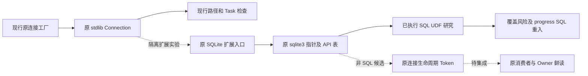
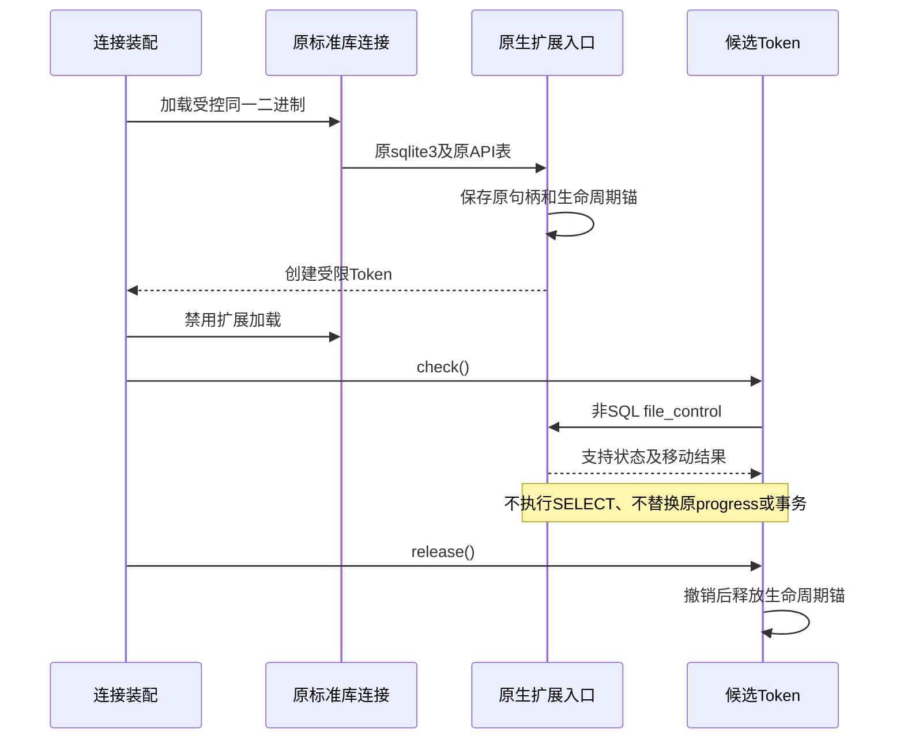

# 原 SQLite 连接来源检查：公开原生 API 研究与接线约束

- 冻结访问日期：2026-10-08。
- Harnessix 生产参考提交：d5c572aff2fedae11d25fd1b0e8a4ca41062a8d2。
- 研究结论：公开扩展入口可以获得原标准库连接对应的 SQLite C 句柄；主库移动检查可复现普通置换及指定 ABA 反例。
- 准入结论：**仅研究，未装配产品；实际完整 FD、B7、P1、默认 Git Writer 与发布均不因此通过。**

## 1. 需求背景与设计目标

[原连接工厂](../../src/harnessix/product_config/git_prepared_link_connection.py)固定原 exact
`sqlite3.Connection`、Task、路径和父目录物理身份。打开前后 `lstat` 一致，
仍不能排除路径暂时指向 B、SQLite 打开 B、路径恢复 A 的窗口。
`PRAGMA database_list`报告文件名，不证明已经打开的底层主库就是当前路径指向的文件。

原 Runtime Thread scope 已解决一部分锁归属；来源检查是另一项独立问题。
目标是保留标准库连接、现有事务和消费者，求证能否用原连接的公开 C API 补充检查，
避免整体更换数据库驱动及重写全部 Store。不以路径比较升级措辞冒充原生句柄证明。

非目标：授予 Git 写入能力、跨库事务、撤回已提交效果、缓存 Owner、放宽期限、
改变控制 callback 频次、任意恶意同进程代码隔离或完整 WAL／SHM 认证。

## 2. 官方源码事实及适用边界

| 来源 | 冻结依据 | 与研究有关的事实 |
|---|---|---|
| [SQLite 扩展接口](https://www.sqlite.org/loadext.html) | 2026-10-08 文档 | 扩展入口接收原连接及 API 表；加载能力必须显式启用 |
| [file-control 接口](https://www.sqlite.org/c3ref/file_control.html) | 2026-10-08 文档 | 在指定数据库的 VFS 上调用 file-control；需检查返回状态，不把不支持当成功 |
| [Unix 3.45.3](https://github.com/sqlite/sqlite/blob/version-3.45.3/src/os_unix.c#L1500) | 已下载源文件 SHA256 绑定于研究原件 | `HAS_MOVED`比较当前路径 inode 与 VFS 保存 inode；不导出实际 FD／`st_dev` |
| [Windows 3.45.3](https://github.com/sqlite/sqlite/blob/version-3.45.3/src/os_win.c#L3585) | 已下载源文件 SHA256 绑定于研究原件 | 提供 `WIN32_GET_HANDLE`分支，不能沿用 Unix `HAS_MOVED`成功假设 |
| [函数生命周期](https://www.sqlite.org/c3ref/create_function.html) | 2026-10-08 文档 | 覆盖、关闭及注册失败均可能触发 userdata 析构 |
| [连接关闭](https://www.sqlite.org/c3ref/close.html) | 2026-10-08 文档 | `close_v2`可能延后销毁存在未完成 statement 的连接 |

同时冻结复核 3.53.4 的 Unix／Windows 文件，不把移动分支版本当当前运行库。
实际 Python 3.12.7 使用 SQLite 3.45.3；另一个 Python 3.13.8 的加载能力探针使用 SQLite 3.50.4。
它们是本机环境证据，不是三平台安装矩阵。

Unix `HAS_MOVED`是**原 SQLite 句柄驱动的主库移动检查**，不是完整 OS FD 身份结构。
它没有逐项返回 FD 的设备、inode、WAL 或 SHM 关联；VFS 不支持、内存库及其他布局需失败关闭。
特权挂载、设备边界和未知 VFS 不包含在已测反例中。Windows需独立的句柄读取及身份合同。

## 3. 总体架构及当前／候选区分



实线仅表示当前组件或已经执行的隔离研究关系，虚线不是生产接线。
产品仍使用当前路径／Task／锁合同。候选只增加单连接来源观察，不取代 Session 历史、MAC、
策略、Artifact 或四库变化检测。原 Audit 连接、鲜读 Audit 连接和固定变化监视连接是不同实际实例，
不能用其中一条的检查结果替代其他连接。

## 4. 已执行最小 UDF 实验

实验 C 函数通过原扩展 API 表调用原数据库的 `file_control(main, HAS_MOVED)`。
参数先置为 `-1`，只接受明确支持且输出为 0／1 的结果；内存库失败关闭。
函数设置 `DIRECTONLY`，不声明 `DETERMINISTIC`；加载结束再次禁用扩展。
不使用 CPython 私有结构偏移，不装载另一套 SQLite 引擎，不新开用于认证的连接。

五个独立用例已经执行并由保存的 Python runner 重新验证：

| 用例 | 实际观察 | 能证明／不能证明 |
|---|---|---|
| 打开 A 后路径被 B 替换 | moved=1；原查询仍读 A | 能拒绝该置换；不是全部文件系统攻击证明 |
| 打开 B 后恢复原 A 的 ABA | 前后路径物理 pin 相同；moved=1；原查询读 B | 复现当前路径 pin 的缺口，原句柄检查发现这个反例 |
| Python 同名函数覆盖 | 原 flags=524288、覆盖后=0；伪造标量0 | 实际复现风险；**不是 UDF 认证通过** |
| 加载结束 SQL `load_extension` | 固定拒绝 | 验证该连接当前 SQL 加载限制，不外推任意进程权限 |
| 内存数据库不支持 | 固定能力不可用错误 | 不支持时不降级为路径成功 |

这五个用例均为隔离实验，不计入 SDK 回归、真实编码任务或发布成功率。

## 5. 非 SQL 候选流程与时序

直接用 SQL 调用认证 UDF 不适合作为当前 progress 检查：原 progress callback
再执行原连接上的 SELECT 会造成同连接 SQL 重入。Python 也能覆盖同名 UDF。
后继研究改为原生 Token 的非 SQL `check()`，SQL dummy 只承担生命周期撤销，不返回认证值。



该图定义候选流程，不表示生产装配或完整 FD 认证已完成。

### 5.1 接口、类与重点字段约束

| 对象／字段 | 职责与约束 |
|---|---|
| `attach(connection)` | 只接受原 exact Connection；经公开加载入口获得原句柄，不接受调用方提供指针 |
| `Token.check()` | 非 SQL 检查；不能构造第二条连接、跳过检查或在重入时直接放行 |
| `Token.release()` | 撤销先于资源释放；重复释放幂等，旧 Token 不因重开或新 attach 复活 |
| 原连接引用 | Token 关联同一实例；不能被 Python 属性覆盖成另一连接 |
| 原 API 表／原 db | 每个绑定保存实际来源；不能被其他连接加载覆盖成全局“当前 db” |
| 生命周期代次／撤销位 | dummy 被覆盖或连接关闭时失效；dummy 返回值不参与认证 |
| 原线程归属 | 与当前原 Task／锁 scope 组合使用；线程同一不等于 Task 同一 |
| 生命周期锚 | 如采用未执行 statement，需证明关闭、错误、GC、并发的资源归属与回收；不可把锚本身当授权 |

### 5.2 核心业务伪代码

```text
装配(connection):
    拒绝非 exact 原连接、重入装配、未知加载能力
    经原连接加载可信桥，捕获原 db 和原 API
    创建可撤销生命周期状态
    检查 main file-control 确实支持且未移动
    禁止静默回退到路径 pin
    返回只能由桥创建的 Token

检查(Token):
    验证原线程、活动状态、原连接未关闭
    直接通过原 API 对原 db 执行非 SQL file-control
    复核撤销与关闭状态
    任一未知／变更均失败关闭
    不改 Owner 鲜读、原进度回调或现有事务

清理(Token):
    先永久撤销
    释放属于本绑定的生命周期资源
    不关闭借用的业务连接，不 COMMIT，不吞原首异常
```

### 5.3 实际生命周期反例及窄修复

首轮原型仅以 Python 原实例及 `in_transaction` 检查关闭状态，
在原连接对象调用 `__init__`重新绑定 B 时，原 Token 仍检查被 lease 保留的旧 A 句柄并错误放行。
这是实际红测，不以“同一 Python 对象”当作原 SQLite 句柄连续性。
已按 [3.45.3 `main.c`](https://github.com/sqlite/sqlite/blob/version-3.45.3/src/main.c#L2751)及
[`util.c`](https://github.com/sqlite/sqlite/blob/version-3.45.3/src/util.c#L1547)求证公开 `errcode`路径：
在原递归 mutex 内先检测原句柄的 `MISUSE`，拒绝 zombie 后才执行移动检查。
该zombie行为由3.45.3实现及实际配对确认，不是跨版本公开生命周期自省承诺；研究桥限定该运行库。
不依赖仅在 `API_ARMOR`启用时有效的 `db_name`／`db_readonly`附加保护，
也不用新旧 autocommit 布尔值相同来证明句柄相同。

改后隔离主矩阵20通过、0失败，另1例确认边界；原红测与修改前后源码分别保留。
直接重新初始化及先关闭再重新初始化均拒绝，原资源计数归零。
追加实际 progress 中两轮原异常对象 `is`断言通过：有桥／无桥均第7次中断、无新增SQL、事务不变。
这是本机窄 API／生命周期研究，不是正式宿主集成或可发布二进制。

如果原合法打开连接此前存在 `MISUSE`，该检查可能保守拒绝；错误分类及支持的运行库范围
须在正式生产合同中说明，不能删除检测来追求全部正控成功。
原 A 句柄存续时路径 A→B→A 且检查未观察到 B，是明确未检测反例；
成功点时观察不证明整个历史或至后续 COMMIT 的连续性。

## 6. 失败、恢复、持久化与安全边界

这是瞬时来源观察，不新增持久 Schema、MAC、业务凭证或迁移。
进程恢复必须重新从实际连接装配 Token，不持久化裸指针或将 Token 序列化到 Session。
加载不可用、API 表不匹配、关闭、覆盖、跨线程、原库移动及不支持均拒绝。
下游正式错误分类及原异常对象传播需在生产接线设计中明确，研究异常不直接新增公共 AgentFailure。

取消、期限及原 Runtime 锁仍由原 scope 负责；Token 不拥有业务执行或提交能力。
来源检查不消除保留 WAL 读事务造成的 Owner 陈旧快照，不能删除现行短 Audit 鲜读。
能力不可用不启用 approved Writer；已发生的外部效果不能通过 Token 撤销。

## 7. 测试、部署兼容与生产准入条件

| 必需矩阵 | 当前边界 |
|---|---|
| 原连接成功／置换／ABA／不支持 | SQL UDF 五例已执行；非 SQL 候选单独验证 |
| dummy 覆盖、旧 Token、关闭、GC、重复清理、双连接 | 非 SQL 生命周期必测，不用 SQL flags 代替认证 |
| 原 progress 内检查、回调首异常、查询无重入 | 非 SQL 必测；不得暂时关闭原 progress 来得到绿测 |
| 读写事务、total_changes、无额外 SQL、FD 稳态 | 与原基线对照；探针自身连接必须显式关闭 |
| 原 Audit／鲜读／监视连接与实际 Ledger | 待生产候选接线和同候选安装验证 |
| 三平台与架构、加载受限环境 | 尚未完成，不以本机 dylib 称为正式 Wheel 支持 |

当前正式构建使用 hatchling，候选是纯 Python Wheel。原生桥将引入平台与 Python ABI、
可信二进制定位、完整性、编译及安装门禁；需要显式设计，不能复制本机 dylib 到产品目录即发布。
Windows不支持 Unix实验分支时应明确拒绝，不能标记平台全绿。当前主仓依赖及 Wheel均未变。

## 8. 源码映射、取舍与下一步

- [连接工厂及登记](../../src/harnessix/product_config/git_prepared_link_connection.py)：来源装配和原 Task 归属。
- [原 Audit 及鲜读](../../src/harnessix/product_config/git_delivery_review_host.py)：原宿主连续性和 Owner 新鲜性。
- [四库监视](../../src/harnessix/product_config/git_prepared_link_observation.py)：不同实际连接和变化窗口。
- [原 Ledger](../../src/harnessix/product_config/git_prepared_link_ledger.py)：业务认证、发布与 COMMIT／ROLLBACK。
- [原 SQL 进度控制](../../src/harnessix/product_config/git_prefix_sql.py)：非 SQL 桥不得替换的原失败与期限边界。
- [当前 Runtime scope 详设](../changes/m09-r4-git-runtime-thread-scope.md)：本研究独立于原锁归属切片。

优先验证公开 API 的窄桥，而不是整体 Store 驱动迁移。SQL UDF 是已复现的排除项，不是生产方案。
后继以非 SQL 生命周期及原 progress 负控决定是否继续窄桥；只有正式接口、安全范围、三平台封装
及原实际消费者验证齐备才更新准入结论。完整 FD／B7 与 P1合同各自仍需关闭，不能互相替代。

[隔离研究交付](../validation/git-native-and-terminal-research-2026-10-08-v1/README.md)绑定可执行原件、红测、矩阵与实际末端反例；不将研究结果计入发布成绩。
