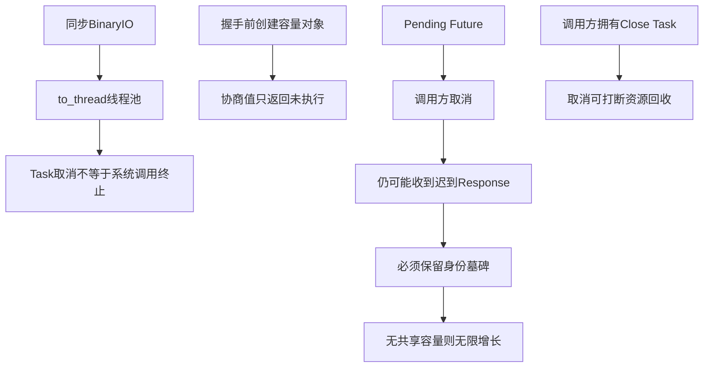

# 可靠性、背压与长期运行源码研究

## 1. 研究目标与固定基线

本文为路线图0.9.3冻结首轮源码事实，回答四个问题：

1. 本地Headless Agent在stdin仍打开而stdout阻塞或断裂时，能否有界退出；
2. Python SDK的并发请求、取消后迟到响应和关闭是否具有明确容量与所有权；
3. Session、Protocol Request、Artifact和Trusted Action长期增长目前有哪些真实边界；
4. 0.9.3应如何拆成可独立验收的纵向切片，而不是建立新的横向“性能框架”。

| 项目 | 固定Revision | 研究用途 |
|---|---|---|
| Codex | `a0dcfe2ada3f5bbd5059a34c0fc6fac244741a67` | App Server Client背压、关闭与连接并发 |
| OpenCode | `69c172e8a7c0086887b1f93ed5a162f14b6aa0c5` | Session/Server事件队列与取消边界的反例和取舍 |
| Claude Code逆向样本 | `2ca5ddabfed5f220812ea11f029eda03b21bc4c1` | Structured IO单Writer、迟到响应集合上限与输入关闭 |
| Harnessix修复前 | `6dd391a61e542158e0e46238a72f4a2c8775bb6b` | 0.9.2关闭后的现状与缺口 |
| Harnessix 0.9.3a | `f11359447f3bc68ffb97a100bb8b4bbcc1a891e5` | 本地传输最小正式修复 |
| Harnessix 0.9.3b | `cb3f3ea834624d5a8f84396952eba212650065d1` | 共库容量、Plan-first保留、备份与恢复 |

Claude Code仓库不是官方源码，只用于交叉佐证；OpenCode中出现的无界队列也不被当作可直接复制的生产建议。
本文只提炼行为边界，不复制参考实现。

## 2. Codex源码证据

### 2.1 命令通道有界，消费事件与请求等待解耦

Codex固定提交的
[`app-server-client/README.md`](https://github.com/openai/codex/blob/a0dcfe2ada3f5bbd5059a34c0fc6fac244741a67/codex-rs/app-server-client/README.md)
明确区分三类资源：命令队列和内嵌Runtime保持有界；调用方事件队列为了避免“未读通知挡住请求Response”而单独采用
无界队列；关闭则先请求优雅收敛，超过期限后中止Worker。这个设计不能证明无界事件内存安全，但证明背压必须按
依赖环路分别设计，不能把所有流量塞入同一个有界Queue后声称“更安全”。

[`app-server-client/src/lib.rs`](https://github.com/openai/codex/blob/a0dcfe2ada3f5bbd5059a34c0fc6fac244741a67/codex-rs/app-server-client/src/lib.rs)
中的`InProcessAppServerClient::start`使用有界命令Channel，并把等待Request结果放入独立Task，让主Worker继续排空事件；
`shutdown`先发送Shutdown命令，再对Response和Worker分别做有界等待，最后Abort。可借鉴的是**所有权与关闭期限**，
不是Rust Channel类型本身。

### 2.2 连接Gate把“停止接收”与“等待已进入工作”分开

[`connection_rpc_gate.rs`](https://github.com/openai/codex/blob/a0dcfe2ada3f5bbd5059a34c0fc6fac244741a67/codex-rs/app-server/src/connection_rpc_gate.rs)
在Shutdown后拒绝新的Run，同时等待已经取得许可的Future完成。相关测试覆盖Shutdown等待活动工作和拒绝迟到工作。
这支持Harnessix保持“关闭后不再受理，已持久事实按自己的恢复语义结算”，不支持把连接断开等同于业务Turn回滚。

## 3. OpenCode源码证据

OpenCode固定提交在Event HTTP Handler、LLM native runtime和PTY输出中使用`Queue.unbounded`，在Session abort路由中通过
显式Abort语义结束运行。该事实有两点价值：

1. UI事件、Provider事件和PTY字节属于不同流量域，不能只凭“使用Queue”推断统一容量合同；
2. 无界队列是需要另行证明消费速度和生命周期的债务，而不是Harnessix可以照搬的默认值。

因此0.9.3不以“与OpenCode一致”为由放开任何无界集合；Harnessix的本地Response归并仍要求数量上限，完整Session
长期增长则在持久化容量切片中单独解决。

## 4. Claude Code逆向样本证据

[`structuredIO.ts`](https://github.com/carrie1988/claude-code-source-code/blob/2ca5ddabfed5f220812ea11f029eda03b21bc4c1/src/cli/structuredIO.ts)
显示Structured IO把所有Control Request与流事件放入同一个Outbound Stream，由唯一Drain路径写stdout，防止控制消息越过
已排队事件；输入关闭时拒绝全部Pending Request。它还把已结算Tool Use ID集合限制为1000并按插入顺序淘汰，明确说明
长期Session不能无限保留迟到/重复响应身份。

这支持Harnessix对Pending和Abandoned采用共享容量，但不支持简单TTL删除Abandoned：JSON-RPC迟到Response如果失去墓碑会被
误判为未知ID并污染同一连接。Harnessix 0.9.3a选择“取消后仍占用槽位，直到迟到Response或连接关闭”，在内存上有界，
同时保留协议安全性。

## 5. Harnessix修复前的源码事实

### 5.1 App Server stdio

修复前[`stdio.py`](../../src/harnessix/app_server/stdio.py)的结构是：

```text
async Reader -> process_frame -> asyncio.Queue -> async Writer -> to_thread(write + flush)
```

精确问题：

- `outbound_timeout_seconds`只约束Response进入Queue，不约束同步`write + flush`；
- 取消等待`asyncio.to_thread`不会终止底层同步写，线程池线程可继续阻塞；
- 主循环阻塞在另一个`to_thread(readline)`时，Writer失败无法主动唤醒；
- Pending Semaphore和Outbox在initialize前构造，客户端协商出的更小Limit没有实际约束运行对象；
- Dispatch设置Stopping后，主循环若正在等stdin也不能立即观察；
- 关闭Writer超时被吞掉，进程退出码无法区分正常EOF与输出通道失效。

这些问题不损坏已提交Session事实，但会让本地Agent进程无法按期退出，并允许协议声明与实际容量不一致。

### 5.2 SDK子进程传输

修复前[`agent_client.py`](../../src/harnessix/sdk/agent_client.py)把Subprocess Transport、Agent Client和Response解析集中在
同一文件。`_pending`和`_abandoned`均为无界集合；调用取消把ID移入Abandoned，但永不响应的Server会让集合持续增长。
`close`直接在调用方Task内执行，调用方取消后可能停在关闭stdin、等待进程或Reader Task之间。关闭超时硬编码为10秒和5秒，
没有低敏感度资源快照。

### 5.3 持久化和Trusted Action长期边界

源码与现行模块文档显示，0.9.3仍有以下未关闭项：

| 领域 | 已有边界 | 未关闭问题 |
|---|---|---|
| Session | WAL、FULL同步、单Runtime宿主锁、事务CAS、Plan-first离线维护 | 用户导出、在线调度、Checkpoint和Vacuum合同 |
| Protocol Request | 幂等Claim/Complete、参数指纹、终态Cutoff删除 | accepted目标恢复、历史分页和启动恢复扫描成本 |
| Artifact | 单件/Turn配额、TTL字段、分页读取、正文Tombstone与容量水位 | 默认调度、物理空间回收和Action/Process跨Store孤儿 |
| App Server | 单Thread Delta 1000条、Page Limit | Thread总数、总Delta字节、Replay/列表大历史性能 |
| Trusted Action | Hash链、UNKNOWN/Reconcile、产品启动恢复 | Owner fencing、跨Store孤儿扫描、Route超时与低基数信号 |
| Model | 单尝试预算、Provider错误分类 | 全局并发/速率限制、熔断和长运行压力基线 |

0.9.3a只关闭本地传输生命周期；0.9.3b进一步关闭三类共库事实的容量、保守清理和备份恢复实现，但不关闭上述
accepted恢复、物理空间回收、Trusted Action效果恢复和完整Soak问题。

### 5.4 0.9.3b实施前源码求证

#### Session数据库已经具备迁移和单宿主基础，但没有维护合同

[`session/sqlite.py`](../../src/harnessix/session/sqlite.py)证明Session初始化在`BEGIN IMMEDIATE`内校验Application ID、
连续Migration及其SHA-256，提交后才单独启用WAL；`runtime_owner()`使用数据库旁路文件锁阻止第二宿主。该事实支持在同一
SQLite内追加维护元数据，也说明Migration不能执行长时间正文扫描或自动清理。Runtime Owner Token只存在于Store实例，不能
替代同进程静默维护窗口。

#### Protocol账本不能精确回答accepted请求关联哪个业务对象

[`protocol/requests.py`](../../src/harnessix/protocol/requests.py)只持久化`client_instance_id/request_id/method/params_sha256`和
有界终态结果。原始Params被规范化后只留下不可逆摘要；不能从一个`accepted`行还原它是否正在创建Thread、推进Turn或发布
Artifact。因此“按Method猜测目标”或“accepted不影响其他表”都没有源码证据。0.9.3b采用全局保护Session/Artifact，接受
清理延迟来避免误删恢复事实。

#### Artifact已有TTL Tombstone，但缺少跨Store计划与发布时间

[`artifacts/sqlite.py`](../../src/harnessix/artifacts/sqlite.py)的现行`collect`只把到期Published正文转为Expired并清空Body，
不会删除Manifest；读取Expired固定失败，符合历史引用不变为空成功的要求。旧表只有`expires_at`，没有统一发布时间，且多个
专用发布器仍需保持同一列顺序。0.9.3b因此新增`created_at`并集中显式列写入，但清理资格继续使用既有`expires_at`，不把
回填时间当成真实发布时间。

#### 采用与拒绝

| 源码事实 | 采用 | 拒绝 |
|---|---|---|
| Session Migration和Runtime Owner已存在 | 复用共库、向前Migration和宿主锁 | 新建Maintenance服务或第二数据库 |
| Protocol只存Params摘要 | 任意accepted全局保护Session/Artifact | 反推目标ID或按Method启发式删除 |
| Artifact已有Tombstone状态 | 先清正文、保留Manifest；Thread整组删除时再移除 | TTL到期直接删除Manifest |
| 三类表共享SQLite事务 | Item变更与Progress游标同事务 | 内存游标或“删除后再记进度” |
| SQLite Backup API和原子替换可用 | 执行前Plan绑定完整备份 | 把导出SQL或文件复制建议当正式回滚 |
| Vacuum可能持长锁 | 0.9.3d单独测量与决策 | Agent热路径自动Vacuum |

## 6. 根因归纳



根因不是“Python性能差”，而是同步I/O所有权、协议迟到Response语义、协商时机和关闭Task所有权没有统一建模。

## 7. 采用与拒绝

### 7.1 采用

1. stdio使用单Reader守护线程和单Writer守护线程，事件循环只拥有有界Mailbox和Request Task；
2. Reader同时等待输入、Writer终结和Stopping，任一终结都能推动统一关闭；
3. Pending Semaphore在READY后按协商值创建，Outbox每次入队按当前协商Limit判断；
4. SDK Pending与Abandoned共享`max_pending_requests`槽位；取消不释放槽位，迟到Response或关闭才释放；
5. SDK Close由Transport拥有独立Task，公共`close`只Shield等待；
6. 提供不含Request ID、路径或stderr正文的`SubprocessTransportSnapshot`；
7. 将Subprocess实现拆到独立模块，保持`agent_client.py`职责和可读性门禁。
8. 共库容量报告同时记录逻辑行、正文和数据库/WAL字节，并在读取时验证数据完整性；
9. 删除前持久化不可变Plan、按序Item和独立Progress；每批业务变更与游标同事务；
10. 任意`accepted`请求全局保护Session/Artifact，执行时再次核对候选；
11. 维护执行前强制创建Plan绑定备份，崩溃后复用同一Backup和Ordinal；
12. Artifact正文先Tombstone，Thread满足全套禁删条件后才整组删除。

### 7.2 拒绝

| 方案 | 拒绝原因 |
|---|---|
| 继续用`to_thread`，只扩大Timeout | 不能终止已经阻塞的同步系统调用 |
| 取消Request时立即释放槽位并删除ID | 迟到Response会成为未知ID，可能使整连接失败 |
| 超过Abandoned上限后静默淘汰最旧ID | 同样破坏迟到Response归并安全 |
| Close捕获并吞掉`CancelledError` | 违反调用方取消语义，且无法证明清理一定完成 |
| 为性能另建独立HTTP/Worker服务 | 重新引入已在0.9.1f3删除的割裂产品边界 |
| 本切片同时增加Session GC和Action租约 | 失败语义、数据迁移和回滚单元过大 |
| 从Protocol参数摘要推断accepted目标 | 摘要不可逆，没有源码事实支持 |
| 候选变化后自动补选另一行 | 破坏Plan可审计性，恢复结果不可重算 |
| 升级或启动时自动清理 | 把普通启动变为破坏性操作，缺少审核和回滚窗口 |
| Maintenance内自动Vacuum | 锁时长、额外磁盘和三平台性能尚未建立证据 |

## 8. 0.9.3切片结论

| 切片 | 正式范围 | 关闭证据 |
|---|---|---|
| 0.9.3a | 本地stdio/SDK背压、Writer故障、取消后迟到Response、取消安全关闭、资源快照 | 代码、故障回归、三平台CI |
| 0.9.3b | Session/Protocol/Artifact容量快照、保留计划、清理与崩溃恢复 | Migration、前后水位、故障注入、备份恢复 |
| 0.9.3c | Trusted Action/Process Owner fencing、孤儿扫描、Route超时和对账 | 双进程竞争、崩溃窗口、UNKNOWN不误执行 |
| 0.9.3d | 长会话Soak、并发、内存、启动时延和数据库增长发布基线 | 固定场景、机器信息、阈值、原始低敏证据 |

0.9.3总项只有a～d全部完成后才能关闭。单次Microbenchmark或单平台“运行没报错”不能替代Soak和故障证据。

## 9. 源码与测试映射

| 结论 | Harnessix源码 | 测试 |
|---|---|---|
| stdio同步I/O泵与故障唤醒 | [`app_server/stdio.py`](../../src/harnessix/app_server/stdio.py) | [`test_server_sdk.py`](../../tests/app_server/test_server_sdk.py)中的Writer故障、慢输出和并发Limit用例 |
| SDK共享容量与迟到Response | [`sdk/subprocess.py`](../../src/harnessix/sdk/subprocess.py) | 同文件中的取消、乱序、Malformed和容量用例 |
| Close独立Task与Shield | [`sdk/subprocess.py`](../../src/harnessix/sdk/subprocess.py) | `test_subprocess_transport_close_continues_after_caller_cancel` |
| AgentClient职责保持 | [`sdk/agent_client.py`](../../src/harnessix/sdk/agent_client.py) | App Server与Product UI回归 |
| 共库容量与完整性扫描 | [`session/capacity.py`](../../src/harnessix/session/capacity.py) | [`test_store_maintenance.py`](../../tests/agent/test_store_maintenance.py)低敏容量用例 |
| 不可变Plan和禁删集合 | [`session/maintenance_records.py`](../../src/harnessix/session/maintenance_records.py)、[`session/maintenance_planning.py`](../../src/harnessix/session/maintenance_planning.py) | Plan篡改、accepted全局保护、Plan后新增pending用例 |
| 批次原子恢复 | [`session/maintenance_execution.py`](../../src/harnessix/session/maintenance_execution.py) | 单Item批次提交故障与Changed Candidate Skip用例 |
| 备份与原子Restore | [`session/maintenance_backup.py`](../../src/harnessix/session/maintenance_backup.py) | 备份发布后故障复用及完整恢复用例 |
| Migration 26与Artifact写入 | [`0026_store_maintenance.sql`](../../src/harnessix/session/migrations/0026_store_maintenance.sql)、[`artifacts/persistence.py`](../../src/harnessix/artifacts/persistence.py) | Session/Artifact升级与发布回归 |

## 10. 研究边界

- 未在本研究中测量跨机器绝对性能；阈值必须由0.9.3d固定环境实测产生；
- 守护线程解决进程退出所有权，不保证底层第三方`BinaryIO.write`可被强制中断；阻塞写不再阻止主流程退出；
- SDK只管理直接App Server子进程，不拥有其任意后代进程树；发行物进程树归0.9.5；
- Snapshot是本地诊断事实，不是业务Session、身份认证或Telemetry上传合同；
- 远程Agent Protocol、HTTP Gateway和多租户不在0.9.3范围内。
- 0.9.3b只证明逻辑清理、崩溃恢复和备份边界；未证明SQLite物理文件缩小、在线Maintenance或用户级数据删除；
- `accepted`全局保护是由现行不可逆参数摘要推导出的保守结论，不表示Protocol已完成孤儿恢复。
