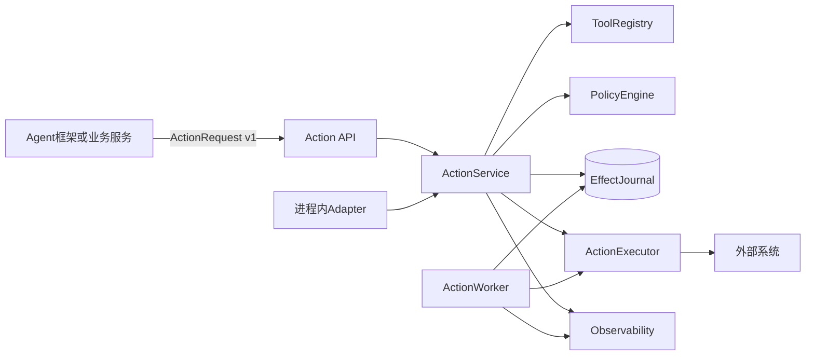
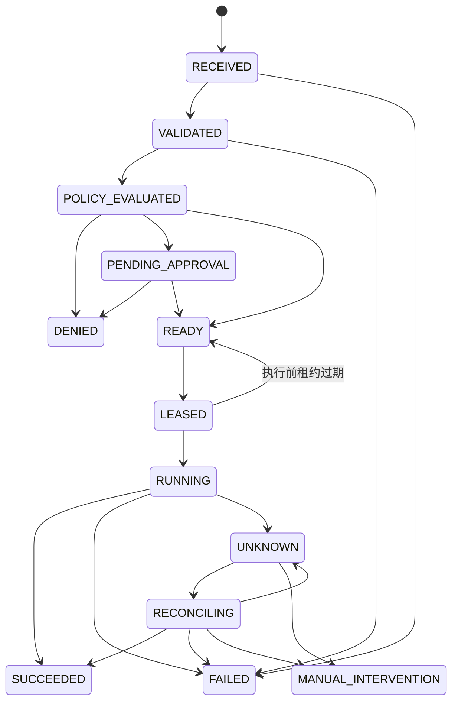
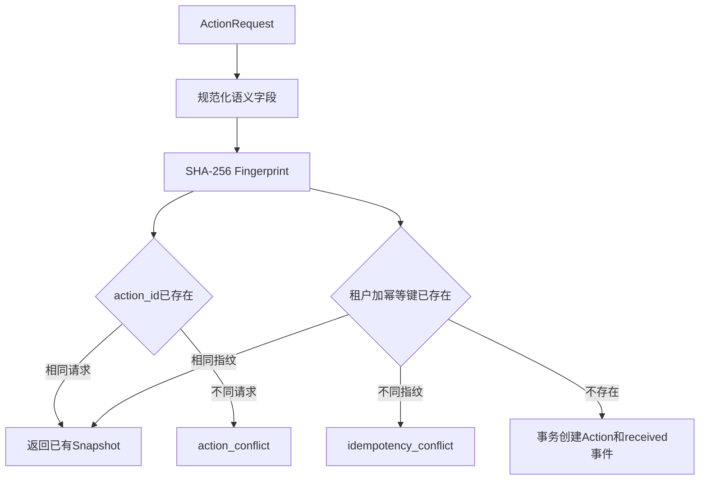
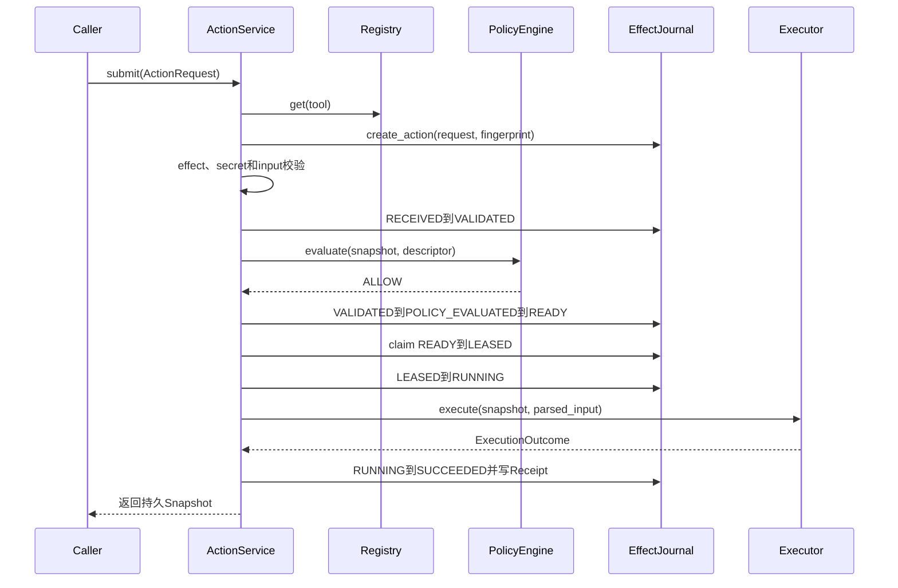
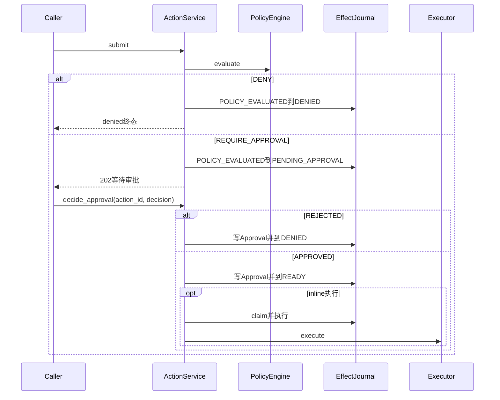
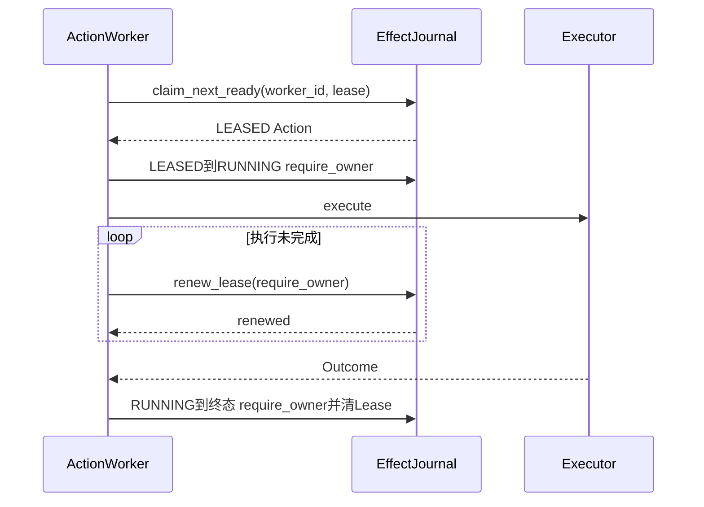
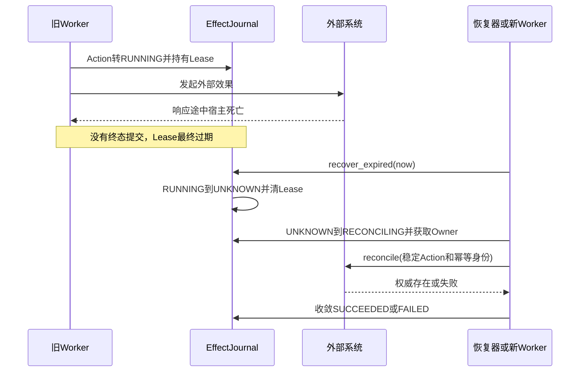
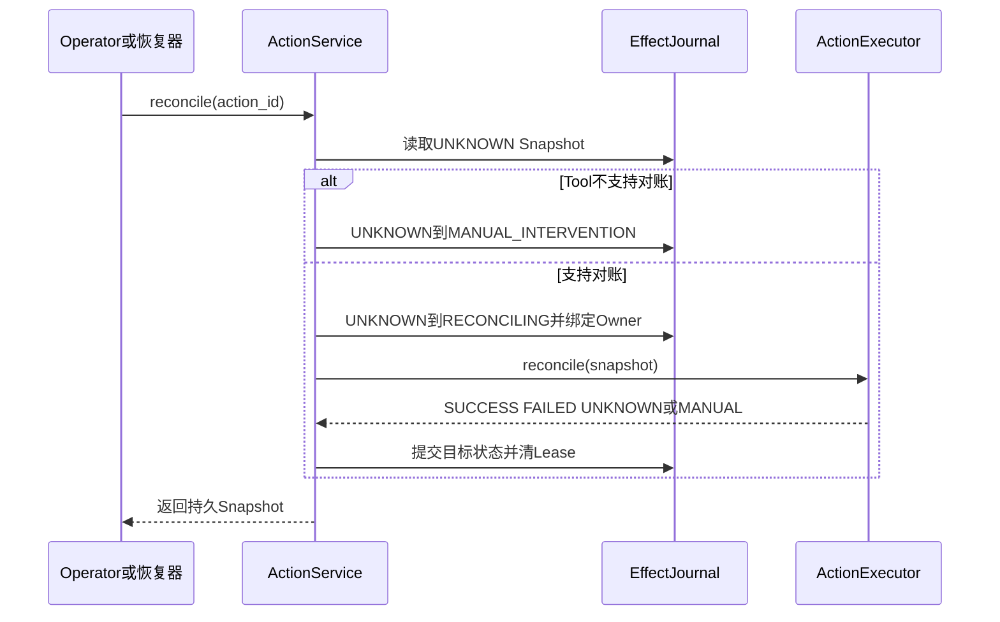
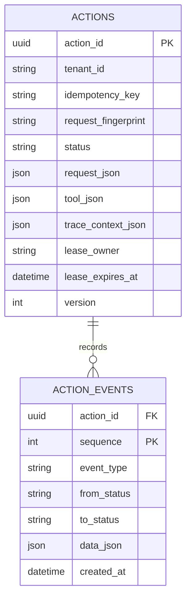
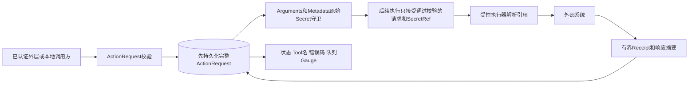

# Action Plane子系统设计

> **退役状态：** 独立Action HTTP API、SDK、LangGraph Adapter、Effect Journal与Worker Queue已在0.9.1f3
> 物理删除。本文只保留删除前架构供审计和历史阅读；当前执行治理事实源是
> [Trusted Actions模块](../modules/trusted-actions.md)，历史数据处置见
> [旧Action状态归档手册](../operations/legacy-action-archive.md)。

## 1. 文档摘要

| 项目 | 内容 |
|---|---|
| 删除前能力 | 版本化Action Contract、Tool Registry、Policy、Approval、Effect Journal、Inline/Worker执行、Lease、`UNKNOWN`和Reconcile |
| 本文状态 | 冻结历史实现说明；不得作为新增产品能力依据 |
| 代码版本 | `ffa56de02b372df981d234fafd1feffbb0b870fb` |
| 存储后端 | SQLite本地单机场景；PostgreSQL多进程Worker Claim场景 |
| 部署入口 | 无；历史CLI入口已撤销，显式库装配仅供冻结调用方迁移 |
| 稳定合同 | `harnessix.action/v1`；Action状态、事件、审批、效果凭证和公开错误 |
| 当前安全边界 | API没有实现最终用户认证中间件，`Principal`由调用方提供；只适合受信本地或已由外层认证的部署 |

独立Action Plane与Agent Runtime曾是两条生命周期。ADR 0081已决定停止并列产品形态：当前产品只保留
Agent Runtime及进程内Trusted Action Runtime，旧Action状态机只在迁移窗口内服务冻结调用方。

## 2. 需求背景

Agent框架通常可以调用任意Python函数，但生产系统还需要回答：调用是否被允许、审批绑定的是哪份
请求、重复提交是否会重复创建外部资源、Worker死亡后谁有权继续、效果是否已经发生以及无法确认时
如何恢复。若这些问题留给LangGraph、OpenAI Agents SDK或自定义Agent逐个实现，会产生不一致的安全
规则、重复副作用和不可审计的恢复行为。

Action Plane把一次副作用建模为版本化Action，并在执行器外建立Registry、Policy、Approval、Journal、
Lease和Reconcile。上层框架只提交稳定请求并消费状态，不直接拥有Action内部状态迁移权限。

## 3. 设计目标与非目标

### 3.1 目标

1. 相同租户和幂等键的相同请求返回同一Action，不执行两次；不同请求明确冲突；
2. 请求校验、Policy和Approval均发生在Executor调用之前，并留下持久事件；
3. SQLite和PostgreSQL实现同一`EffectJournal`合同；
4. Worker通过Lease和Owner约束防止两个宿主同时推进同一Action；
5. 写效果异常默认进入`UNKNOWN`，不得把“异常”武断等同于“未执行”；
6. Reconcile只查询或对账稳定Action，不重新调用原始执行；
7. Trace Context、领域事件、Metric和Log能关联同一Action，且不泄露Secret或任意参数正文；
8. API、Agent Adapter和其他框架共享同一Action Contract，不复制策略语义。

### 3.2 非目标

1. 当前API不实现公网多租户身份认证、授权目录、限流、计费或滥用治理；
2. Action Plane不负责Agent Planning、Prompt、模型历史、Context或多Agent编排；
3. 当前没有通用“取消Action”或用户重试API；执行时限主要由具体Executor和Worker Lease协作负责；
4. 当前内置Tool仅为`system.echo`与`demo.issue.create`合同验证，不构成完整SaaS生态；
5. 本子系统不保证所有第三方API可对账；不支持Reconcile时最终进入人工介入；
6. Action Plane数据库与Agent Session数据库之间没有跨库原子事务。

## 4. 约束、假设与术语

| 术语/约束 | 定义 | 设计影响 |
|---|---|---|
| Action | 一个带稳定身份、主体、工具、参数和效果语义的执行请求 | 生命周期独立于Agent Turn |
| Action Contract | `harnessix.action/v1`的请求、状态、结果和事件合同 | 未知版本失败关闭 |
| Effect Class | `READ_ONLY`、`IDEMPOTENT_WRITE`、`NON_IDEMPOTENT_WRITE`、`DESTRUCTIVE` | 影响幂等、审批和异常语义 |
| Request Fingerprint | 对规范化语义请求的SHA-256摘要 | 绑定Action ID/幂等键冲突和审批记录 |
| Idempotency Key | 调用方提供的租户内副作用身份 | 作用域是`tenant_id + key` |
| Lease | Worker在有限时间内推进Action的所有权 | 过期后的恢复取决于是否开始执行 |
| `UNKNOWN` | 外部效果可能已发生，但缺少权威结果 | 非终态；只能Reconcile或人工介入 |
| Reconcile | 按稳定Action身份查询外部权威结果 | 绝不等同重新执行原请求 |
| Effect Receipt | Provider、资源身份、幂等键、响应摘要和时间 | 证明已知效果，不保存Secret |
| Principal | tenant、subject、framework和roles | 当前来自调用方，不代表API已经认证 |

## 5. 系统上下文与部署边界



### 5.1 图示说明

- HTTP调用经Pydantic合同进入`ActionService`；进程内Adapter可以绕过HTTP，但不能绕过Service状态机；
- Registry提供Tool描述、输入Schema和效果能力，Policy只返回决策，不直接执行；
- Inline模式由Service Claim后执行；Queued模式仅转`READY`，由Worker原子领取；
- Executor只在Action已`RUNNING`且Lease/Owner满足约束时被调用；
- Effect Journal同时承担权威快照、事件日志、队列Claim和Lease恢复；
- 外部系统在信任边界外，网络失败不能被解释为确定失败；
- OTel只观察，不拥有领域状态。

### 5.2 与Agent Runtime的关系

Agent可通过Adapter或专用Process桥接提交Action，但两套状态分别持久化。生产集成必须保存稳定
`action_id`和`idempotency_key`，并把Action状态投影回对应Tool Call；不能假设“Agent Tool Call Event
提交”和“Action create”原子发生。恢复时应先根据稳定身份查询Action，而不是生成新Action。当前
[LangChain Tool Adapter](../modules/adapters.md)尚未持久化Tool Call ID到Action ID的绑定，也没有Checkpoint/Interrupt恢复，
所以该要求不能视为已满足。

## 6. 组件职责、依赖和禁止边界

| 组件 | 职责 | 允许依赖 | 禁止事项 | 生命周期/并发 |
|---|---|---|---|---|
| `domain.models` | Action、Tool、Policy、Approval、Result、状态和转换合同 | Pydantic/标准类型 | I/O、框架或数据库实现 | 跨组件稳定Schema |
| `ToolRegistry` | 注册唯一Tool定义并提供Descriptor/Input Model/Executor | Domain、Executor | 动态覆盖同名Tool | Bootstrap期构建后只读 |
| `DefaultPolicyEngine` | 根据Effect、Risk和Tool要求作默认决策 | Domain | 执行工具或修改Journal | 无状态，可替换端口 |
| `ActionService` | 校验、Policy、审批、Inline执行、Reconcile和观察编排 | Registry、Policy、Journal、Executor、Obs | 直接使用具体数据库事务或框架状态 | 服务生命周期；单请求无内存权威状态 |
| `EffectJournal` | 快照、事件、状态守卫、Claim、Renew和Recover；内部结构详见[Storage模块设计](../modules/storage.md) | Domain、数据库 | 调用Executor或自行决策Policy | SQLite或PostgreSQL持久生命周期 |
| `ActionWorker` | 领取Ready Action、续租、执行和恢复竞态 | Journal、Executor、Obs | 无Lease推进Action；重复执行未知Action | 每Worker唯一`worker_id` |
| `ActionExecutor` | 执行和对账具体外部效果；内置实现详见[Executors模块设计](../modules/executors.md) | 输入模型、外部系统 | 修改Action状态或自行批准 | 每Tool定义绑定实现 |
| `api.app` | HTTP Schema、状态码、Trace头校验和错误投影 | Service | 复制领域状态机或信任未校验Header | FastAPI lifespan |
| `observability` | Span、Metric、Log和队列Gauge | 稳定领域属性 | 让导出失败改变执行结果 | NoOp或OpenTelemetry实现 |

## 7. Action Contract与数据结构

### 7.1 请求、Tool和主体

| 结构/字段 | 类型/必填 | 来源 | 语义与约束 | 敏感级别 | 持久化/兼容 |
|---|---|---|---|---|---|
| `ActionRequest.spec_version` | literal/是 | 调用方 | 必须为`harnessix.action/v1` | 低 | Action行与事件；版本不匹配拒绝 |
| `action_id` | UUID/是 | 调用方 | 全局请求身份 | 低 | 主键；相同ID只能对应完全相同请求 |
| `tool` | string/是 | 调用方 | 符合命名和长度约束，必须已注册 | 低 | Action行；映射固定Tool定义 |
| `arguments` | JSON object/是 | 模型/业务 | 不可信；先做原始Secret守卫，再按Input Model解析 | 高 | Action请求JSON；日志不展开 |
| `principal.tenant_id` | string/是 | 已认证外层/调用方 | 幂等和隔离作用域 | 中 | Action列；当前API不验证真实性 |
| `principal.subject_id` | string/是 | 调用方 | 发起主体审计身份 | 中 | Action请求JSON |
| `principal.framework` | string/是 | Adapter | 调用框架来源，不授予权限 | 低 | Action请求JSON |
| `context.session_id/run_id` | string/是 | 上层框架 | 关联上游会话和执行 | 中 | 请求JSON；不参与语义指纹 |
| `context.trace_id` | string/可空 | 上游 | 业务关联，不替代W3C Trace Context | 中 | 请求JSON |
| `effect_hint` | EffectClass/可空 | 调用方 | 若提供必须与Tool Descriptor一致 | 低 | 指纹输入 |
| `idempotency_key` | string/按Tool要求 | 调用方 | 租户内唯一副作用身份 | 中 | 独立列和唯一索引 |
| `secret_refs` | `SecretRef[]` | 调用方 | 只含名称和可选版本，不含Secret值 | 高标识 | 请求JSON和指纹 |
| `metadata` | JSON object | 调用方 | 明确要求非敏感，仅用于关联 | 中 | 请求JSON；禁止原始Secret |

### 7.2 ToolDescriptor

`ToolDescriptor`固定名称、版本、描述、JSON Schema、Effect Class、Risk，以及是否要求幂等键、审批、
支持Reconcile和允许并行。只有`READ_ONLY` Tool可以声明并行；Registry拒绝重复名称。Descriptor属于
执行前契约，不能由模型在单次请求中覆盖。

### 7.3 结果与审批

| 结构 | 关键字段 | 语义 |
|---|---|---|
| `PolicyDecision` | kind、reason、policy_id | `ALLOW`、`DENY`或`REQUIRE_APPROVAL`；先持久再推进 |
| `ApprovalRecord` | outcome、request_fingerprint、actor、reason、decided_at | 对当前Action请求指纹的绑定决定；模型本身不重算指纹 |
| `ActionFailure` | code、message、retriable | 可公开失败；不包含原始Exception或响应正文 |
| `EffectReceipt` | provider、resource_type、resource_id、idempotency_key、response_digest、observed_at | 已知外部效果的有界证据 |
| `ActionResult` | status、output、error、receipt、attempt | 执行或对账结果；当前由Service正常路径维持状态一致，模型本身尚无跨字段Validator |
| `ActionEvent` | action_id、sequence、event_type、from/to、data、time | 状态事件按Action严格递增；Heartbeat续期当前不产生事件 |
| `ActionSnapshot` | request、fingerprint、tool、status、policy、approval、result、lease、version | 当前权威投影及单调版本；Journal端口当前不接收Expected Version |

### 7.4 公共端口与接口设计

| 接口/方法 | 调用者与实现者 | 输入/输出 | 前置与后置 | 错误与重试 | 取消/超时 | 幂等/顺序 | 权限 |
|---|---|---|---|---|---|---|---|
| `PolicyEngine.evaluate` | Service → Policy实现 | Snapshot、Descriptor → Decision | Action已校验；只返回决策 | 异常使Action确定`FAILED`且标记可重试 | 无独立超时合同 | 每个新Action只在校验后评估 | 不能执行Tool |
| `ActionExecutor.execute` | Service/Worker → Tool Executor | Snapshot、严格Input Model → Outcome | Action已`RUNNING`且调用方持Lease | 写异常转`UNKNOWN`；只读异常转`FAILED` | 由实现处理；Task取消不等于领域取消 | 一个有效Lease下调用；写Tool依赖业务幂等键 | 只能使用显式注入能力 |
| `ActionExecutor.reconcile` | Service → Tool Executor | `UNKNOWN` Snapshot → Reconciliation Outcome | Tool声明支持对账，Action先转`RECONCILING` | 异常回`UNKNOWN`，可重复查询 | Lease限定恢复所有权 | 不得产生新效果；按稳定身份查询 | 只读权威结果 |
| `EffectJournal.create_action` | Service → SQLite/PostgreSQL | Request、Descriptor、Fingerprint、Trace → Snapshot和created标志 | Schema已解析；事务内检查Action ID和幂等键 | 冲突409；数据库错误向上失败 | 数据库驱动超时 | 租户幂等键唯一；Action/Event同事务 | 不负责认证或Policy |
| `EffectJournal.transition` | Service/Worker → Journal | 期望状态、目标、可选结果/Lease → Snapshot | 合法状态边；Owner参数匹配 | 非法转换/Owner冲突拒绝，不自动重试 | 数据库驱动超时 | Snapshot和下一Event原子、严格序列 | 仅状态守卫，不授予外部能力 |
| `claim_next_ready` | Worker/Inline Service → Journal | worker、到期时间 → Snapshot或空 | 只选择`READY`；正常Worker传入非空身份和未来Deadline，Journal尚未自行校验 | 竞争后返回其他候选或空 | 无方法级Deadline；SQLite仅有Busy Timeout | FIFO候选；单Action只产生一个Claim结果 | 领取不是业务批准 |
| `renew_lease` | 当前Worker → Journal | action、owner、到期时间 → bool | 当前Owner匹配、旧Lease未过期且状态可执行；当前未要求新Deadline晚于现在或旧值 | false触发失租解析 | Heartbeat应早于旧Lease；Journal无方法级Deadline | 只有相同Owner可更新；成功只增Version、不追加Event | 不可夺取他人Lease |
| `recover_expired` | Service启动/Worker周期 → Journal | 可选当前时间 → Action ID列表 | 在事务锁内扫描过期Lease | 数据库错误回滚本次批次 | 周期由Worker配置；无Batch Limit | 本次候选的Snapshot和Event在一个事务中提交 | 不调用Executor |

所有端口定义见[`domain/ports.py`](https://github.com/carrie1988/Harnessix/blob/3f37fe8ae0646d3327254ce9677110b94f7c5e80/src/harnessix/domain/ports.py)。当前合同没有领域级取消或统一
Executor Deadline参数；这一限制在第18节和第23节显式保留，不能由Adapter私自扩展状态值。

## 8. Action状态机



`DENIED`、`SUCCEEDED`、`FAILED`和`MANUAL_INTERVENTION`是终态；`UNKNOWN`不是终态，因为后续仍可
通过权威查询收敛。所有转换由[`ALLOWED_ACTION_TRANSITIONS`](../../src/harnessix/domain/models.py)和Journal
共同校验，API或Executor不能任意写状态。

| 当前状态 | 允许下一状态 | 写入者/条件 | 关键持久事实 |
|---|---|---|---|
| `RECEIVED` | `VALIDATED`、`FAILED` | Service完成Tool/Effect/Secret/Input校验 | 原请求、指纹、Tool快照 |
| `VALIDATED` | `POLICY_EVALUATED`、`FAILED` | Policy调用成功或分类失败 | Policy输入已固定 |
| `POLICY_EVALUATED` | `DENIED`、`PENDING_APPROVAL`、`READY` | 按Policy Decision | Decision、policy ID和评估时间；当前无规则版本/digest |
| `PENDING_APPROVAL` | `DENIED`、`READY` | 绑定当前指纹的拒绝/批准 | Approval Record |
| `READY` | `LEASED` | Inline Service或Worker原子Claim | lease owner与到期时间 |
| `LEASED` | `RUNNING`、`READY` | Owner开始执行；或执行前租约过期恢复 | Owner校验/恢复事件 |
| `RUNNING` | `SUCCEEDED`、`FAILED`、`UNKNOWN` | Executor确定结果或写效果异常 | Result/Receipt或未知失败 |
| `UNKNOWN` | `RECONCILING`、`MANUAL_INTERVENTION` | 支持对账则获取Reconcile Lease，否则人工 | 对账意图或不支持原因 |
| `RECONCILING` | `SUCCEEDED`、`FAILED`、`UNKNOWN`、`MANUAL_INTERVENTION` | Executor权威查询结果 | Reconciliation Result |

## 9. 请求指纹和幂等

[`action_fingerprint`](https://github.com/carrie1988/Harnessix/blob/3f37fe8ae0646d3327254ce9677110b94f7c5e80/src/harnessix/runtime.py)对`spec_version`、`tenant_id`、Tool、Arguments、
Effect Hint和Secret Refs的规范JSON计算SHA-256；它刻意排除`action_id`和易变Context。结果用于：

1. 同一`action_id`重复提交时验证请求不可变；
2. 同一`tenant_id + idempotency_key`命中已有Action时验证语义相同；
3. Approval Record绑定当前Action语义；
4. 上层恢复时识别稳定请求，而不依赖瞬时连接身份。



SQLite依靠部分唯一索引，PostgreSQL依靠等价唯一约束保证数据库级竞争安全。Service的“先查询”不是
唯一保障，最终冲突由Journal事务裁决。需要幂等键的Tool若未提供，必须在Executor调用前失败。

## 10. 正常Inline执行流程



重复请求在`create_action`命中时直接返回已有Snapshot，不再次执行校验、Policy或Executor。每一步转换
都写快照和Event；外部执行只发生在`RUNNING`转换成功之后。

## 11. Policy、拒绝和审批

默认Policy规则是：`DESTRUCTIVE`或`CRITICAL`拒绝；Tool显式要求审批或效果为
`NON_IDEMPOTENT_WRITE`时要求审批；其余允许。Tool自身仍可对`IDEMPOTENT_WRITE`声明审批，例如内置
`demo.issue.create`。未来OPA/Cedar只能作为`PolicyEngine`实现替换，不能绕过状态机。



当前Approval API按Action ID提交决定；Service从不可变Snapshot读取当前Fingerprint写入
`ApprovalRecord`。它没有单独接收客户端Fingerprint再比较，因此安全性依赖Action请求不可变和调用方
身份边界。API尚无认证中间件，这一边界不能用于无外层认证的公网审批。

## 12. Worker、Lease和有界执行所有权

Queued模式下，Service只把Action推进到`READY`。Worker调用`claim_next_ready`原子领取最早Action，
获得`worker_id`和`lease_expires_at`；然后转`RUNNING`并启动Executor。执行期间Heartbeat必须早于
Lease期限续租，配置强制`heartbeat_interval < lease_seconds`。



Journal转换支持`required_lease_owner`，过期或错误Owner不能推进。Worker收到续租失败时先取消并回收本地
执行，再重读Journal：如果终态或带`execution_completed`事实的`UNKNOWN`已经由执行提交获胜，则接受
已提交结果；否则抛出`WorkerLeaseLostError`。这一顺序关闭“执行结果已提交，但并发续租失败把成功误报
为Lease丢失”的竞态，同时不允许真正失租Worker继续写状态。

## 13. 崩溃、租约过期与无重复恢复



| 故障点 | Journal可见事实 | 恢复状态/动作 | 是否重执行 | 防重复证明 |
|---|---|---|---|---|
| `READY→LEASED`后、`RUNNING`前死亡 | `LEASED`且Lease过期 | 恢复到`READY` | 可以重新领取 | Executor尚未被允许调用 |
| `RUNNING`后、调用Executor前死亡 | `RUNNING`且Lease过期 | 转`UNKNOWN`并Reconcile | 否 | 无法从Journal证明效果未开始 |
| Executor返回前宿主死亡 | 同上 | Reconcile | 否 | 外部效果可能已发生 |
| `RECONCILING`中宿主死亡 | `RECONCILING`且Lease过期 | 转`UNKNOWN`，可再次查询 | 只重复查询，不重执行 | Reconcile合同不得创建效果 |
| Read-only Executor异常 | `RUNNING` | `FAILED`且可重试标志 | 当前无自动重试 | 只读无外部写效果 |
| 写Executor普通异常 | `RUNNING` | `UNKNOWN`、不可直接重试 | 否 | 异常不证明未写 |
| Executor抛`UncertainEffectError` | `RUNNING` | `UNKNOWN` | 否 | 显式效果不确定标记 |
| Tool不支持Reconcile | `UNKNOWN` | `MANUAL_INTERVENTION` | 否 | 禁止猜测或再次写入 |
| 续租与终态提交竞争 | 重读Event/终态 | 已提交终态获胜，否则报失租 | 否 | `_execution_commit_exists`判定持久提交 |

`UNKNOWN`是安全状态，不是错误处理失败。把所有异常直接映射`FAILED`会诱导调用方重试并制造重复资源。

## 14. Reconcile流程



Reconcile只能从`UNKNOWN`开始。对账异常返回`UNKNOWN`并清Lease，使后续可以再次查询；它不调用
`execute`。`SUCCESS`应附带可验证Receipt；无权威结果时继续`UNKNOWN`或转人工，不能为追求终态而
伪造成功。

## 15. Journal持久化与事务

### 15.1 关系模型



SQLite真实Schema见[`0001_initial.sql`](https://github.com/carrie1988/Harnessix/blob/3f37fe8ae0646d3327254ce9677110b94f7c5e80/src/harnessix/storage/migrations/0001_initial.sql)和
[`0002_observability.sql`](https://github.com/carrie1988/Harnessix/blob/3f37fe8ae0646d3327254ce9677110b94f7c5e80/src/harnessix/storage/migrations/0002_observability.sql)，PostgreSQL对应Schema见
[`postgresql/0001_initial.sql`](https://github.com/carrie1988/Harnessix/blob/3f37fe8ae0646d3327254ce9677110b94f7c5e80/src/harnessix/storage/migrations/postgresql/0001_initial.sql)和
[`postgresql/0002_observability.sql`](https://github.com/carrie1988/Harnessix/blob/3f37fe8ae0646d3327254ce9677110b94f7c5e80/src/harnessix/storage/migrations/postgresql/0002_observability.sql)。
上图只展示关键列，不替代迁移文件；两库的JSON逻辑字段当前均以`TEXT`而非JSONB保存。Action创建在
单事务内同时写Snapshot和`action_received` Event；状态转换在单事务内校验期望状态、合法边、Lease
Owner并更新Snapshot与下一序号Event。表结构、序列化和迁移限制详见
[Storage模块设计](../modules/storage.md)。

### 15.2 SQLite与PostgreSQL差异

| 关注点 | SQLite | PostgreSQL | 共同契约 |
|---|---|---|---|
| 连接 | 每操作独立连接、busy timeout、foreign keys | Async pool | 操作结束后无内存权威状态 |
| 创建/转换锁 | `BEGIN IMMEDIATE`串行写 | 行锁/事务 | 快照与Event原子提交 |
| Claim | 事务内FIFO选择并更新 | `FOR UPDATE SKIP LOCKED` | 一个Ready Action最多一个有效Lease |
| Recover | 写事务扫描过期Lease | 锁定候选并跳过竞争行 | `LEASED→READY`，`RUNNING/RECONCILING→UNKNOWN` |
| 多Worker | 适合本地低并发，不作为分布式队列 | 支持多进程竞争Claim | Owner和Lease规则相同 |
| 幂等约束 | 部分唯一索引`tenant_id,idempotency_key` | 等价唯一索引 | 相同语义复用，不同语义冲突 |
| 迁移 | 2个内置迁移；0002的DDL/版本记录中断重入尚未闭环 | 2个对应迁移；事务级Advisory Lock | Trace Context在第2次迁移加入；当前均无Checksum/版本Gap门禁 |

`renew_lease`只校验旧Lease仍有效，不校验新Deadline晚于当前时间或旧Deadline；Claim也未在Journal
边界拒绝空Worker ID或过去Deadline。`ping()`只证明基础连接，SQLite甚至可能对尚无Schema的新文件返回
成功。这些属于当前实现限制，不得由正常Worker调用路径的正确参数掩盖。

## 16. API、错误和部署

[`api/app.py`](https://github.com/carrie1988/Harnessix/blob/3f37fe8ae0646d3327254ce9677110b94f7c5e80/src/harnessix/api/app.py)提供健康、就绪、Tool列表、Action提交/查询/Event、审批和
Reconcile端点。Submit、Approval和Reconcile三个状态变更POST在返回`PENDING_APPROVAL`、`READY`、
`LEASED`、`RUNNING`、`UNKNOWN`或`RECONCILING`时使用HTTP 202；Action GET找到同一非终态资源仍返回
200。领域冲突返回409，不存在返回404。`traceparent`和`tracestate`先进入只做长度限制的
`TraceContext`；完整W3C语法由OpenTelemetry Propagator处理，自定义Observer仍可能收到长度合法但语法无效的值。
HTTP接口、身份、预算、错误和Lifespan的完整边界见[API模块设计](../modules/api.md)。

公开错误由[`domain/errors.py`](../../src/harnessix/domain/errors.py)定义，至少包括
`action_not_found`、`tool_not_found`、`action_conflict`、`idempotency_conflict`和
`illegal_transition`。领域错误没有直接序列化数据库对象或完整外部响应，但当前Policy、Executor和
Reconcile异常分支会把`str(error)`写入`ActionFailure.message`，因此执行器仍必须自行清洗异常；统一
脱敏门禁尚未完成，并列入第23节风险。

### 16.1 当前认证限制

API当前没有认证中间件，也没有从受信Token重建`Principal`；请求体中的tenant、subject和roles是
调用方声明。当前安全部署只能是：

1. 绑定Loopback并仅供本机受信进程使用；或
2. 位于已经完成认证、授权、租户注入和网络隔离的外层Gateway之后。

在0.9.4/1.x云端身份工作完成前，不得把当前端点直接暴露为面向不可信用户的多租户公网服务。

## 17. Secret、权限与数据流



Action请求不得内嵌Secret值；可疑字段名在Policy和Executor前被拒绝，但当前`ActionService._submit`先调用
`journal.create_action`，所以完整请求已经进入Journal和失败Snapshot。`raw_secret_rejected`不能证明明文未落盘。
`SecretRef`只表达名称和版本，实际解析应由执行环境的Secret端口完成。Journal保存完整业务参数和资源身份，应
按高敏业务数据保护。Telemetry不得记录Arguments、外部响应正文、Header或Secret Ref解析值。持久化前输入安全门
属于[API模块设计](../modules/api.md)登记的P0缺口。

Policy不是身份认证；`roles`只有在受信身份层注入后才可用于授权。Executor不能依据模型参数自行扩大
网络、文件或Secret能力，能力应在Bootstrap和Sandbox边界显式授予。

## 18. 取消、超时、重试与人工处置

| 机制 | 当前语义 | 限制 |
|---|---|---|
| 取消 | Action Plane无公共取消状态或取消端点 | 不能把Worker Task取消伪装成领域取消；后续需独立合同 |
| 超时 | Worker用Lease发现宿主失效；Executor可实现自身超时 | Lease不是外部请求超时，过期后写效果进入`UNKNOWN` |
| 自动重试 | Service和Worker不自动重放原始写执行 | Read-only失败虽可标记retriable，当前仍由上层显式决定 |
| 对账重试 | 对账异常回到`UNKNOWN`，可再次查询 | 只能重复无副作用的权威查询 |
| 人工介入 | 无Reconcile能力或无法自动判定时进入终态 | 当前没有完整Operator UI/工单工作流 |

## 19. 可观测性

| 信号 | 触发点 | 关键属性 | 基数/敏感约束 | 诊断用途 |
|---|---|---|---|---|
| Span | submit、policy、approval、execute、reconcile、worker run | action、tool稳定名、状态、公开错误 | 不展开参数/响应；Trace Context按W3C传播 | 定位端到端阶段耗时 |
| Counter/Histogram | 请求、决策、执行结果、Lease恢复、延迟 | status、decision、effect class、outcome | 禁止Action ID作为Metric标签 | 成功率、拒绝率、未知率和延迟 |
| Queue Gauge | Worker周期采集 | ready、leased、running、unknown等数量 | 只按低基数状态 | 堆积与恢复告警 |
| Structured Log | Worker循环、Lease、错误边界 | operation、worker、公开错误码 | 不应记录Secret/Arguments；当前异常清洗仍需加强 | 竞态和宿主故障定位 |
| Action Event | 每次合法转换 | action、sequence、from/to、有限data | 持久审计，不等同遥测 | 重建事实和合规审计 |

可观测实现可为NoOp或OpenTelemetry。Metric收集/导出失败被隔离，不改变Action执行结果；Trace Context
随Action持久化，使异步Worker能恢复原Trace关联。

## 20. 核心业务逻辑伪代码

### 20.1 提交与执行

```text
submit(request):
    tool = registry.require_unique_definition(request.tool)
    fingerprint = hash_stable_semantic_fields(request)
    snapshot, created = journal.create_action_atomically(request, fingerprint, tool)
    if not created:
        require same action request or same tenant-scoped idempotent semantics
        return snapshot without policy or execution

    reject effect mismatch, missing idempotency key, raw secret, invalid input
    transition RECEIVED -> VALIDATED
    decision = policy.evaluate(snapshot, tool)
    persist decision with VALIDATED -> POLICY_EVALUATED

    if DENY:
        transition -> DENIED with public failure
    if REQUIRE_APPROVAL:
        transition -> PENDING_APPROVAL
    if ALLOW:
        transition -> READY

    if inline and READY:
        atomically claim lease
        transition LEASED -> RUNNING requiring owner
        execute exactly once through registered executor
        on read-only exception: persist FAILED
        on write exception or uncertain effect: persist UNKNOWN
        on explicit outcome: persist matching result before returning
    return durable snapshot
```

### 20.2 Worker与恢复

```text
worker_once():
    action = journal.claim_next_ready(worker_id, lease_deadline)
    if none: return
    transition LEASED -> RUNNING requiring worker_id
    start executor task
    while executor not finished:
        renew lease before deadline
        if renewal fails:
            cancel and drain local task
            latest = journal.get(action_id)
            if durable execution commit exists: return latest
            raise WorkerLeaseLostError
    persist result requiring worker_id, then clear lease

recover_expired():
    for each expired lease under transaction lock:
        if status == LEASED: transition to READY
        if status in {RUNNING, RECONCILING}: transition to UNKNOWN

reconcile(unknown_action):
    if tool cannot reconcile: persist MANUAL_INTERVENTION
    else:
        persist RECONCILING with owner before external query
        query by stable action/idempotency/resource identity; never call execute
        persist authoritative outcome, or UNKNOWN when still indeterminate
```

## 21. 源码与测试双向映射

| 设计元素 | 源码文件 | 关键符号 | 测试文件 | 测试函数/合同 | 证明内容 |
|---|---|---|---|---|---|
| Action状态合同 | [`models.py`](../../src/harnessix/domain/models.py) | `ActionStatus`、`ALLOWED_ACTION_TRANSITIONS`、`ActionSnapshot` | [`test_action_service.py`](https://github.com/carrie1988/Harnessix/blob/3f37fe8ae0646d3327254ce9677110b94f7c5e80/tests/integration/test_action_service.py) | `test_echo_runs_without_approval_and_records_lifecycle`、`test_journal_rejects_illegal_state_transition` | Journal合法边与事件顺序；模型组合不变量缺口见[Domain模块设计](../modules/domain.md) |
| Tool注册 | [`registry.py`](https://github.com/carrie1988/Harnessix/blob/3f37fe8ae0646d3327254ce9677110b94f7c5e80/src/harnessix/domain/registry.py) | `ToolDefinition`、`ToolRegistry` | [`test_registry.py`](https://github.com/carrie1988/Harnessix/blob/3f37fe8ae0646d3327254ce9677110b94f7c5e80/tests/unit/test_registry.py) | 重复注册和未知Tool测试 | 名称唯一与描述固定 |
| 默认Policy | [`default.py`](https://github.com/carrie1988/Harnessix/blob/3f37fe8ae0646d3327254ce9677110b94f7c5e80/src/harnessix/policy/default.py) | `DefaultPolicyEngine.evaluate` | [`test_action_service.py`](https://github.com/carrie1988/Harnessix/blob/3f37fe8ae0646d3327254ce9677110b94f7c5e80/tests/integration/test_action_service.py) | ALLOW与显式审批；默认DENY无直接测试 | Effect/Risk决策；详见[Policy模块设计](../modules/policy.md) |
| 指纹 | [`runtime.py`](https://github.com/carrie1988/Harnessix/blob/3f37fe8ae0646d3327254ce9677110b94f7c5e80/src/harnessix/runtime.py) | `action_fingerprint` | [`test_action_service.py`](https://github.com/carrie1988/Harnessix/blob/3f37fe8ae0646d3327254ce9677110b94f7c5e80/tests/integration/test_action_service.py) | `test_action_id_rejects_mutated_request`、`test_idempotency_key_rejects_different_payload` | 请求不可变和幂等冲突 |
| 提交主链 | [`runtime.py`](https://github.com/carrie1988/Harnessix/blob/3f37fe8ae0646d3327254ce9677110b94f7c5e80/src/harnessix/runtime.py) | `ActionService.submit` | [`test_action_service.py`](https://github.com/carrie1988/Harnessix/blob/3f37fe8ae0646d3327254ce9677110b94f7c5e80/tests/integration/test_action_service.py) | `test_echo_runs_without_approval_and_records_lifecycle` | 正常顺序和Event |
| Approval | [`runtime.py`](https://github.com/carrie1988/Harnessix/blob/3f37fe8ae0646d3327254ce9677110b94f7c5e80/src/harnessix/runtime.py) | `ActionService.decide_approval` | [`test_action_service.py`](https://github.com/carrie1988/Harnessix/blob/3f37fe8ae0646d3327254ce9677110b94f7c5e80/tests/integration/test_action_service.py) | `test_rejected_approval_never_executes_effect` | 拒绝不触发效果 |
| Reconcile | [`runtime.py`](https://github.com/carrie1988/Harnessix/blob/3f37fe8ae0646d3327254ce9677110b94f7c5e80/src/harnessix/runtime.py) | `ActionService.reconcile` | [`test_action_service.py`](https://github.com/carrie1988/Harnessix/blob/3f37fe8ae0646d3327254ce9677110b94f7c5e80/tests/integration/test_action_service.py) | `test_uncertain_effect_is_reconciled_without_reexecution` | UNKNOWN不重执行 |
| Executor异常边界 | [`runtime.py`](https://github.com/carrie1988/Harnessix/blob/3f37fe8ae0646d3327254ce9677110b94f7c5e80/src/harnessix/runtime.py) | `ActionService._execute_leased` | [`test_action_service.py`](https://github.com/carrie1988/Harnessix/blob/3f37fe8ae0646d3327254ce9677110b94f7c5e80/tests/integration/test_action_service.py) | 显式不确定与Lease恢复；只读普通异常无直接测试 | 读写异常分类；详见[Executors模块设计](../modules/executors.md) |
| SQLite事务 | [`sqlite_journal.py`](https://github.com/carrie1988/Harnessix/blob/3f37fe8ae0646d3327254ce9677110b94f7c5e80/src/harnessix/storage/sqlite_journal.py) | `create_action`、`transition`、`claim_next_ready`、`recover_expired` | [`test_action_service.py`](https://github.com/carrie1988/Harnessix/blob/3f37fe8ae0646d3327254ce9677110b94f7c5e80/tests/integration/test_action_service.py) | `test_expired_running_lease_becomes_unknown`、`test_journal_rejects_illegal_state_transition` | Snapshot/Event原子与恢复主链；迁移/Lease缺口详见[Storage模块设计](../modules/storage.md) |
| PostgreSQL Claim | [`postgres_journal.py`](https://github.com/carrie1988/Harnessix/blob/3f37fe8ae0646d3327254ce9677110b94f7c5e80/src/harnessix/storage/postgres_journal.py) | `claim_next_ready`、`renew_lease`、`recover_expired` | [`test_postgres_journal.py`](https://github.com/carrie1988/Harnessix/blob/3f37fe8ae0646d3327254ce9677110b94f7c5e80/tests/integration/test_postgres_journal.py) | `test_postgres_workers_claim_action_without_duplication`、`test_postgres_expired_running_lease_persists_unknown_result` | `SKIP LOCKED`多Worker语义；当前专用真实数据库证据限于两个用例 |
| Worker循环 | [`worker.py`](https://github.com/carrie1988/Harnessix/blob/3f37fe8ae0646d3327254ce9677110b94f7c5e80/src/harnessix/worker.py) | `ActionWorker.run_once`、`run_forever` | [`test_worker.py`](https://github.com/carrie1988/Harnessix/blob/3f37fe8ae0646d3327254ce9677110b94f7c5e80/tests/integration/test_worker.py) | `test_queued_action_is_executed_by_worker`、`test_ready_action_can_only_be_claimed_once` | 入队与单Claim |
| Lease续租 | [`worker.py`](https://github.com/carrie1988/Harnessix/blob/3f37fe8ae0646d3327254ce9677110b94f7c5e80/src/harnessix/worker.py) | `_execute_with_heartbeat` | [`test_worker.py`](https://github.com/carrie1988/Harnessix/blob/3f37fe8ae0646d3327254ce9677110b94f7c5e80/tests/integration/test_worker.py) | `test_heartbeat_renews_lease_during_action`、`test_failed_renewal_while_running_still_reports_lost_lease` | Heartbeat与真正失租 |
| 续租提交竞态 | [`worker.py`](https://github.com/carrie1988/Harnessix/blob/3f37fe8ae0646d3327254ce9677110b94f7c5e80/src/harnessix/worker.py) | `_execution_commit_exists`、`_resolve_failed_renewal` | [`test_worker.py`](https://github.com/carrie1988/Harnessix/blob/3f37fe8ae0646d3327254ce9677110b94f7c5e80/tests/integration/test_worker.py) | `test_execution_commit_wins_renewal_race` | 终态提交优先且不误报 |
| HTTP边界 | [`app.py`](https://github.com/carrie1988/Harnessix/blob/3f37fe8ae0646d3327254ce9677110b94f7c5e80/src/harnessix/api/app.py) | `create_app`及Action路由 | [`test_api.py`](https://github.com/carrie1988/Harnessix/blob/3f37fe8ae0646d3327254ce9677110b94f7c5e80/tests/integration/test_api.py) | Inline成功、幂等冲突、Queued 202、Readiness和Lifespan；Trace Header无直接测试 | 薄API与状态投影；详见[API模块设计](../modules/api.md) |
| OTel关联 | [`observability`](../../src/harnessix/observability/) | `ActionObservability`实现 | [`test_observability_flow.py`](https://github.com/carrie1988/Harnessix/blob/3f37fe8ae0646d3327254ce9677110b94f7c5e80/tests/integration/test_observability_flow.py) | Action流程观测用例 | 状态与Trace关联 |

### 21.1 推荐源码阅读路线

1. 从[`domain/models.py`](../../src/harnessix/domain/models.py)阅读Action、状态和转换，再读
   [`domain/ports.py`](https://github.com/carrie1988/Harnessix/blob/3f37fe8ae0646d3327254ce9677110b94f7c5e80/src/harnessix/domain/ports.py)理解Service依赖边界；
2. 阅读[`domain/registry.py`](https://github.com/carrie1988/Harnessix/blob/3f37fe8ae0646d3327254ce9677110b94f7c5e80/src/harnessix/domain/registry.py)和
   [`policy/default.py`](https://github.com/carrie1988/Harnessix/blob/3f37fe8ae0646d3327254ce9677110b94f7c5e80/src/harnessix/policy/default.py)，掌握执行前固定事实；
3. 按`action_fingerprint` → `ActionService.submit` → `decide_approval` → `_execute_leased` →
   `reconcile`阅读[`runtime.py`](https://github.com/carrie1988/Harnessix/blob/3f37fe8ae0646d3327254ce9677110b94f7c5e80/src/harnessix/runtime.py)；
4. 对照阅读[`sqlite_journal.py`](https://github.com/carrie1988/Harnessix/blob/3f37fe8ae0646d3327254ce9677110b94f7c5e80/src/harnessix/storage/sqlite_journal.py)和
   [`postgres_journal.py`](https://github.com/carrie1988/Harnessix/blob/3f37fe8ae0646d3327254ce9677110b94f7c5e80/src/harnessix/storage/postgres_journal.py)，重点比较Claim与Recover事务；
5. 阅读[`worker.py`](https://github.com/carrie1988/Harnessix/blob/3f37fe8ae0646d3327254ce9677110b94f7c5e80/src/harnessix/worker.py)的Heartbeat、失租和提交竞态；
6. 最后阅读[`api/app.py`](https://github.com/carrie1988/Harnessix/blob/3f37fe8ae0646d3327254ce9677110b94f7c5e80/src/harnessix/api/app.py)、Bootstrap和Observability，确认产品装配限制；
7. 用本节测试函数逐条验证正常、拒绝、幂等、未知、Lease、PostgreSQL和OTel路径。

## 22. 测试设计与验收标准

| 层级 | 必测内容 | 当前证据 |
|---|---|---|
| 合同单元 | 指纹字段、Tool唯一和并行只读约束；其余模型组合约束尚不完备 | 历史`tests/unit/test_models.py`、`test_registry.py`及[当前Domain模块测试](../modules/domain.md#11-测试验证与验收) |
| Service集成 | 正常、审批、拒绝、幂等、Secret、Effect Hint、UNKNOWN、非法转换 | `tests/integration/test_action_service.py` |
| Worker故障 | 单Claim、Heartbeat、失租、执行提交竞态、指标故障隔离 | `tests/integration/test_worker.py` |
| 存储合同 | SQLite覆盖大部分Action/Worker主链；PostgreSQL覆盖并发Claim和过期Running恢复；尚无双后端参数化等价套件 | `test_action_service.py`、`test_worker.py`、`test_postgres_journal.py`及[Storage模块测试盘点](../modules/storage.md#27-测试设计与验证证据) |
| HTTP合同 | 当前直接覆盖Inline 200、Queued 202、幂等409、Readiness与Lifespan；404、422、Trace Header、未知500和完整状态映射仍缺 | `tests/integration/test_api.py`及[API测试盘点](../modules/api.md#36-直接测试证据) |
| 观测 | Span/Metric/Trace关联与导出故障隔离 | `test_observability_flow.py`、`test_otlp_export.py` |
| 框架适配 | 当前只证明Async参数到Action Request及Pending Snapshot JSON的正常映射；相同Action身份、完整状态投影、异常恢复和真实LangGraph未验证 | [`test_langgraph_adapter.py`](https://github.com/carrie1988/Harnessix/blob/3f37fe8ae0646d3327254ce9677110b94f7c5e80/tests/unit/test_langgraph_adapter.py)及[Adapter模块设计](../modules/adapters.md) |

DOC-1.2对本文执行的验收：反向核对`ActionStatus`、`ActionRequest`、`ToolRegistry`、
`DefaultPolicyEngine.evaluate`、`action_fingerprint`、`ActionService.submit`、`decide_approval`、
`reconcile`、`EffectJournal.transition`、两个Journal的`claim_next_ready/recover_expired`、
`ActionWorker.run_once`、`_resolve_failed_renewal`至少十三组符号；正向定位正常、审批、拒绝、幂等冲突、
UNKNOWN对账、Lease恢复、Worker竞态和PostgreSQL并发至少八类测试。

## 23. 已知限制、风险与后续工作

| 项目 | 当前影响 | 缓解/后续归属 |
|---|---|---|
| API无身份认证和可信Principal注入 | 不能直接作为不可信公网多租户边界 | 本地/受信Gateway部署；0.9.4及1.x云能力 |
| Framework Tool Call与Action无持久绑定，且固定Principal/Context可跨调用复用 | 图重试或崩溃可能新建Action，共享Tool可串Tenant/Run | Adapter v2持久身份、动态可信Context及真实Checkpoint故障测试 |
| Adapter把完整Snapshot及所有领域状态作为正常Tool Content返回 | 非终态、失败或Unknown可能被框架误判成功，敏感业务字段进入模型历史 | 类型化状态投影、Interrupt/Wait/Reconcile和最小脱敏输出 |
| 敏感键守卫发生在首次Journal持久化之后 | 可疑明文虽不进入Policy/Executor，仍进入Request、失败Snapshot和数据库 | 0.9.4版本化持久化前Admission安全门 |
| API无Body/JSON/Response预算、分页、并发和Deadline | 大请求、长Event和Inline执行可耗尽服务 | 0.9.3容量与真实Socket故障测试；详见[API模块设计](../modules/api.md) |
| 无领域取消和执行Deadline合同 | 长执行依赖Executor自身和Lease，用户不能显式撤销 | 需要重大变更设计，不在文档中虚构 |
| 内置Tool仅为合同样例 | 不构成生产SaaS连接器生态 | 按真实需求逐个增加受控Executor |
| Agent与Action无跨库事务 | 桥接崩溃需稳定Action身份恢复 | Adapter持久绑定并查询，不新建副作用 |
| SQLite不适合多宿主高并发 | 多Worker竞争和HA能力受限 | 独立部署使用PostgreSQL |
| SQLite迁移中断重入未闭环且双后端无Checksum/Gap门禁 | 升级中断或Migration漂移可能导致初始化失败或Schema误判 | 0.9.5安装升级；详见[Storage模块设计](../modules/storage.md#9-migration与初始化) |
| Claim/Renew未在Journal边界验证Worker身份和新Deadline | 直接调用者可写入空Owner、立即过期或倒退Lease | 0.9.3恢复可靠性与双后端合同测试 |
| `ping`只证明连接且SQLite可对空Schema返回成功 | Readiness可能误报，业务请求随后失败 | 0.9.3增加Schema与可写性检查 |
| 数据保留、删除、备份和灾备未形成发布门禁证据 | 长期生产运维不完整 | 0.9.5/1.0 |
| `MANUAL_INTERVENTION`缺Operator工作流 | 状态可审计但处置体验不完整 | 0.9产品体验或后续运维切片 |
| 默认Policy较简单 | 不能表达复杂组织授权和资源策略 | 未来替换Policy端口；需先固定身份和合同 |
| Queued执行使用当前Registry且无通用Executor绑定核对 | API/Worker版本漂移时旧Action可能由不同Executor执行 | 0.9.3/0.9.5绑定、升级和故障测试 |
| 异常消息直接采用`str(error)` | Provider或Executor若把敏感值写入异常，可能进入Journal、API或日志 | 0.9.4增加统一错误清洗与泄漏回归测试 |

本文与Agent Runtime设计共同作为DOC-1.3/1.4迁移范式。`domain`、`policy`、`executors`和`storage`
独立模块设计均已完成；本文拥有跨包Action主链，四份包级文档只细化各自内部结构。任何一处边界变化都
必须在同一提交同步相关事实源，避免形成第二套状态机或事务语义。

## 24. 变更记录

| 文档版本 | 代码版本 | 日期 | 变更摘要 |
|---|---|---|---|
| 6 | `12f49ce60cbba09726f27ec2e9039c7c9159d67c` | 2026-09-12 | 接入Adapter现行模块设计，纠正Framework身份绑定、状态投影、异常恢复与真实LangGraph测试证据边界 |
| 5 | `3480ee8d15c0de0f2f182a3dceafd37cb59a32d7` | 2026-09-12 | 接入API现行模块设计，纠正GET/POST状态、Trace校验、直接测试覆盖及Secret守卫晚于首次持久化的事实 |
| 4 | `ffa56de02b372df981d234fafd1feffbb0b870fb` | 2026-09-12 | 接入Storage现行模块设计，纠正Lease输入、Readiness、迁移原子性、双后端测试与版本/事件关系边界 |
| 3 | `4dc613f12e0deb5ce5ab53937fca226afab21516` | 2026-09-12 | 接入Executors现行模块设计，纠正Policy DENY与只读异常测试证据边界，补充Executor版本漂移风险 |
| 2 | `69bd39ac3b0445ca96813c32bbdaf855e9861756` | 2026-09-12 | 接入Domain现行模块设计并纠正ApprovalRecord字段、ActionResult模型约束和直接测试证据边界 |
| 1 | `7c50a5815e3d859fcdd93176d8a5019bf419b6bc` | 2026-09-12 | DOC-1.2 Action Plane黄金样例初版 |
