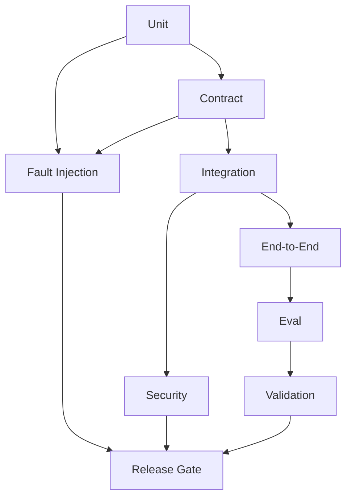
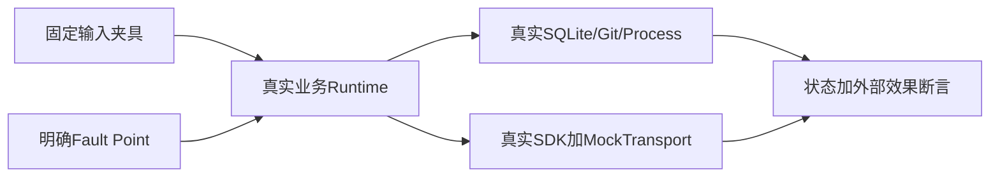
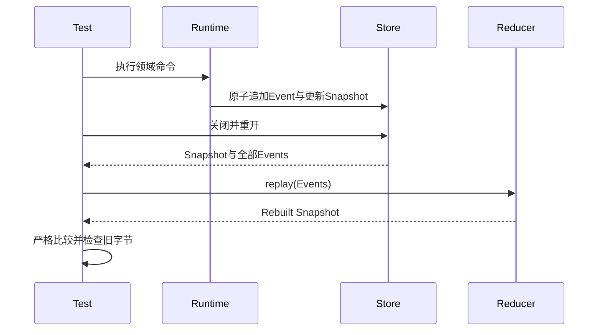
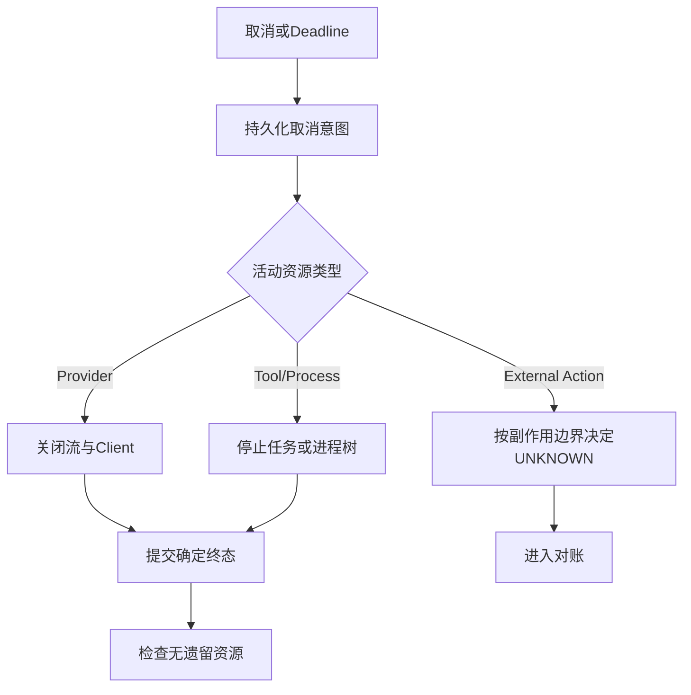
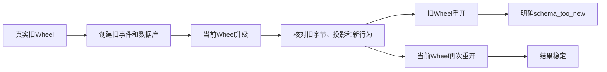
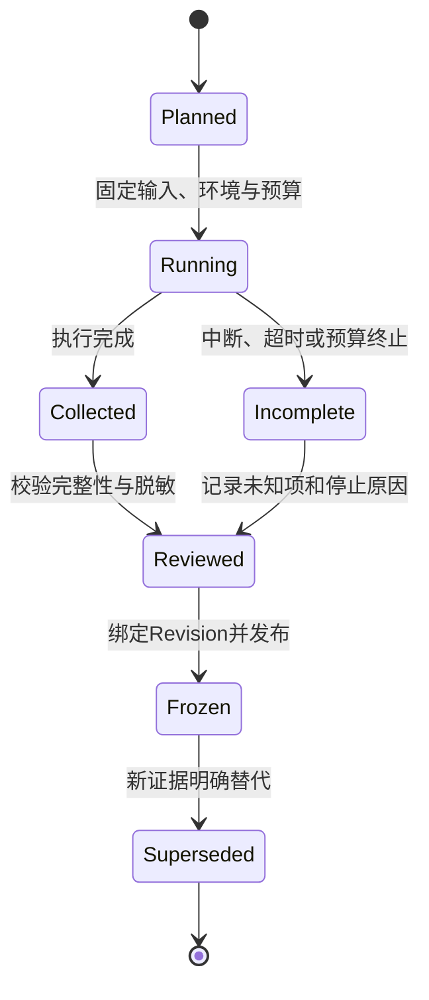
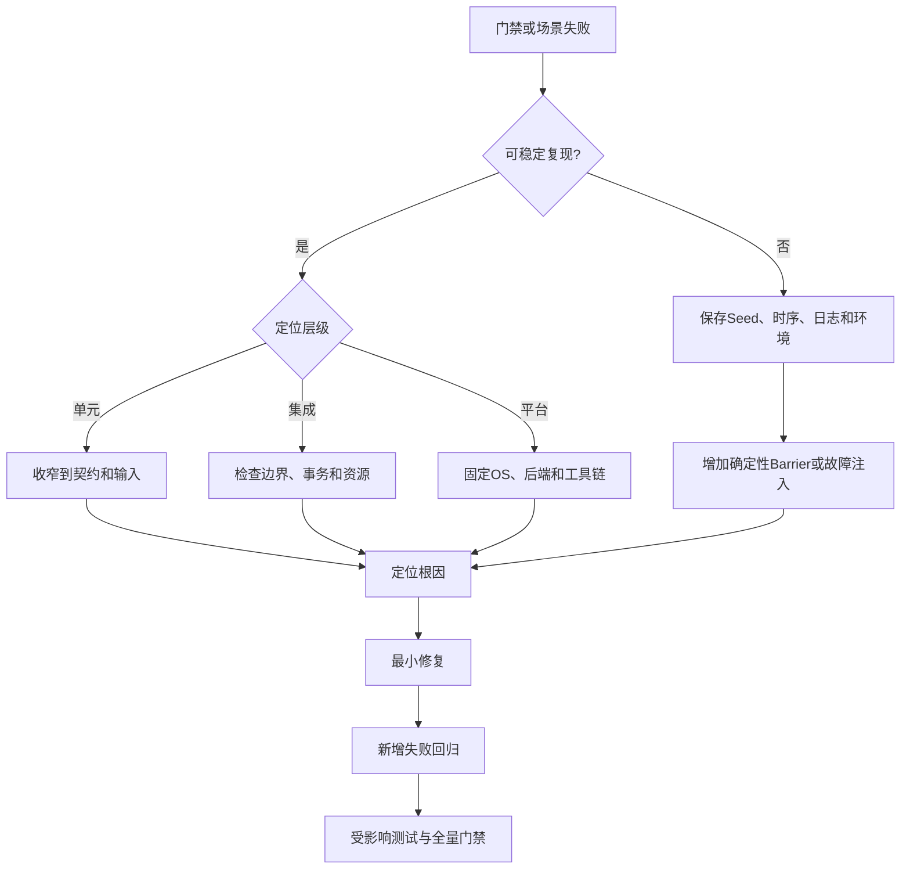

# Harnessix Code测试与Eval规范

## 1. 文档定位

本文定义当前仓库统一测试分层、失败与恢复矩阵、CI发布门禁、Eval证据生命周期和结果判定规则，不复制各模块
的全部测试清单。模块特有测试以[30份现行模块设计](README.md#3-当前事实源)为准；历史迭代中的测试数量、
提交和一次性验收过程已冻结到[里程碑验收记录](testing-and-evals-milestone-history.md)。

| 问题 | 当前事实源 |
|---|---|
| 模块当前如何运行、有哪些失败边界 | 对应[`docs/modules`](modules/)现行模块设计 |
| 测试采用什么层次和共同规则 | 本文 |
| Coding Eval任务、评分、Campaign如何实现 | [Evals模块设计](modules/evals.md) |
| 固定Provider验证如何控制请求 | [Smoke模块设计](modules/smoke.md) |
| 某次真实验证实际发生了什么 | [验证证据索引](validation/README.md) |
| 某个历史切片当时通过多少测试 | [里程碑验收记录](testing-and-evals-milestone-history.md) |

## 2. 质量目标与判定原则

Harnessix Code测试必须分别回答：

1. **Runtime正确性**：合同、状态、持久化、幂等、取消、权限和恢复是否满足不变量；
2. **Agent有效性**：在固定真实仓库任务中能否完成正确、有限且可交付的修改；
3. **产品可运营性**：安装、升级、兼容、性能、故障和安全证据能否支撑发布；
4. **结论可重算性**：任务、版本、输入、预算、评分器和证据是否足以重算结果。

优先级从高到低为：副作用安全、状态/恢复正确、修改正确、安全边界、可重复/可诊断、效率成本、交互体验。
不得用更高任务成功率换取未知副作用自动重试，不得以少数成功Demo替代系统质量证据。


## 3. 测试分层

| 层级 | 隔离范围 | 必须证明 | 不得替代 |
|---|---|---|---|
| Unit | 纯函数、Reducer、Validator、Mapper | 边界值、非法状态、确定输出 | 持久化/进程/网络真实行为 |
| Contract | 可替换端口的共享套件 | 所有实现满足同一行为合同 | 某个实现的性能与平台差异 |
| Integration | 真实组件组合，公网默认关闭 | 事务、资源所有权、调用顺序 | 外部Provider或系统服务实际兼容 |
| End-to-End | 隔离仓库中的完整产品链 | 最终Diff、测试、事件、进程和回答一致 | 长期Soak与大规模用户负载 |
| Fault Injection | 明确事务/副作用切点 | 取消、异常、崩溃后状态和效果可解释 | 真实断电与所有内核故障 |
| Security | 主动构造恶意输入和边界竞态 | 未授权能力、Secret、路径、协议失败关闭 | 完整第三方审计或形式化证明 |
| Eval | 固定任务与评分合同 | 跨版本真实任务质量、效率与安全 | Runtime不变量测试 |
| Validation | 受控真实外部环境 | 特定版本、环境和输入的实际证据 | 对未验证组合的兼容承诺 |



## 4. 确定性基础设施

### 4.1 模型与传输

- `ScriptedProvider`用于构造精确Provider Event序列、Barrier、Delay、失败、取消和Usage；
- Model Wire夹具使用锁定的真实SDK与MockTransport，验证实际请求映射和SSE解析；
- 默认测试不访问公网，不要求任何真实模型API Key；
- `provider_factory`注入只说明工厂被替换，离线性必须由MockTransport或网络隔离另行证明；
- 时间相关测试应等待明确检查点，不以“睡眠足够久”推断请求已开始。

### 4.2 文件、Git和进程

- 每项测试使用独立临时Workspace与状态目录；
- Git场景使用真实临时仓库、固定作者环境和禁Hook配置；
- Process测试观察进程树、退出码、输出、取消和残留，不只观察父进程Future；
- 平台专属能力在对应Runner真实执行，不用Linux Mock宣称Windows或macOS支持；
- 需要硬退出的场景使用子进程和持久结果文件，不在主Pytest进程伪造。

### 4.3 数据库与时钟

- SQLite测试使用真实事务、WAL、锁和文件权限；
- 旧PostgreSQL Action Journal已退出当前产品和CI；归档流程使用数据库原生一致性备份，不以SQLite行为外推；
- 墙钟由测试固定或注入，Deadline使用事件循环单调时钟；
- CAS、Lease与Fencing测试必须显式构造旧Owner或并发竞争；
- Migration测试优先使用真实旧Wheel生成旧数据，不手改版本字段伪装升级。



## 5. Contract测试规范

每个可替换端口至少覆盖正常、非法输入、边界、取消、资源关闭和实现间一致性：

| 端口 | 核心合同 |
|---|---|
| `ModelProvider` | Event顺序、流终态、Usage、Attempt、错误、取消、资源关闭 |
| Agent Tool | Schema、身份、Effect、参数、结果、取消、输出上限 |
| `SessionStore` | Sequence、CAS、事务、Replay、Migration、Owner |
| Artifact Store | Scope、Digest、分页、TTL、原子发布、回收 |
| Execution/Action Store | 不可变Plan、审批、Lease、事件链、UNKNOWN、Reconcile |
| Workspace/Delivery | 路径对象、Snapshot、Fencing、发布、Rollback、Git身份 |
| Sandbox/Process | 能力、网络、Owner、PTY、取消、残留清理 |
| Agent Protocol | Frame、版本、请求幂等、投影、Replay、背压和关闭 |
| Extension | Catalog/Registry、来源身份、Schema漂移、授权和统一Action入口 |

新增实现必须通过既有合同；不得通过为某个Provider、后端或平台改写共同期望来掩盖不兼容。

## 6. 状态与Replay测试

每个持久聚合至少证明：

1. 事件先于投影或与投影在同一事务提交；
2. Sequence单调且重复相同事实幂等；
3. 同身份不同Payload冲突；
4. 非法转换不产生部分提交；
5. `replay(all_events) == snapshot`；
6. 旧Schema按Upcast规则可读，新Reader不改写旧事件；
7. 旧Reader遇到更高Migration明确拒绝；
8. Hash链、摘要、索引和正文不一致时失败关闭。



## 7. 副作用与崩溃矩阵

| 切点 | Read Only | Local Write | External Write |
|---|---|---|---|
| 意图持久化前 | 无调用，可重发命令 | 无修改 | 无外部请求 |
| 意图后、效果前 | 可安全恢复或取消 | 依据Plan重新准入 | 只有持久身份后才可调用 |
| 效果执行中 | 终止或重新读取 | 观察Pre/Post与事务游标 | 进入UNKNOWN或专用查询 |
| 效果后、结果前 | 可重新观察 | 按文件/Git事实对账 | 禁止盲目重发，必须Reconcile |
| 结果提交后 | 不重复调用 | 不重复发布 | 不重复外部效果 |

断言必须同时覆盖领域状态、事件因果、实际文件/进程/远端夹具效果次数和恢复后的后续行为。

## 8. 取消、Timeout与资源关闭



测试不得只断言抛出`CancelledError`。还应检查Turn/Action终态、Provider/流关闭、子进程树、Lock/Lease释放、临时目录、
迟到回调和已知Usage。Cleanup异常不得把可能已发生的外部效果误写为失败前未执行。

## 9. Security测试

安全回归与[威胁模型](threat-model.md)建立双向关系，最低覆盖：

- Path Traversal、Symlink、Hardlink、Junction/Reparse Point与TOCTOU；
- 恶意文件类型、Mode、Owner、父目录和路径大小写/Unicode差异；
- Shell参数、环境继承、Git Hook、配置和外部Helper注入；
- Approval Fingerprint、计划替换、跨Workspace与跨Tenant身份混淆；
- Secret Canary的原文、编码、跨Chunk、结构化字段和错误正文；
- Provider/MCP的恶意SSE、超大帧、身份漂移、断流和响应后继续输出；
- JSON/JSONL/YAML重复Key、非有限值、深度、大小和协议Fuzz；
- 网络禁用、DNS漂移、端点错绑、重定向、代理和Egress；
- 扩展来源、Catalog、Definition、Grant、版本和摘要替换；
- UNKNOWN对账与重复效果计数必须为零。

Canary未出现在公开报告只能证明对应投影边界，不等于进程内存、私有Session或第三方库从未接触Secret。

## 10. 兼容与Migration验证



每次Schema/Migration变化应证明原Migration Checksum未改、升级事务原子、取消/崩溃后可重开、旧事件原字节保留、
兼容读取范围明确和回退策略可执行。删除Migration行、手改版本或只构造当前Pydantic对象不构成真实升级证据。

## 11. 平台与后端验证矩阵

仓库CI使用独立Job隔离不同平台和可选后端，避免单一Linux进程掩盖平台差异：

| CI Job | 运行环境 | 当前验证重点 | 结论边界 |
|---|---|---|---|
| `python` | Ubuntu，Python 3.12/3.13 | 锁定依赖、静态检查、全量Pytest、离线示例 | 主语言与默认后端回归 |
| `coding-tools-macos` | macOS，Python 3.12 | Coding Tools、Artifact、Patch、Process、Eval、Workspace、Sandbox等 | macOS关键纵向切片 |
| `windows-trusted-execution` | Windows，Python 3.12 | 治理、受信执行、扩展、产品配置和进程相关测试 | 选定契约的Windows兼容性，不等于完整产品支持 |
| `container-sandbox` | Ubuntu + 固定Digest容器镜像 | 容器Sandbox集成 | 容器执行边界 |
| `documentation` | Ubuntu + Node/Mermaid CLI | 元数据、链接、追踪、Schema和变化图真实渲染 | 文档与代码同步，不替代运行时测试 |

新增平台能力时，必须先明确“契约可导入”“选定模块可用”和“产品完整支持”三种不同承诺。CI中存在Windows Job不能单独证明安装器、终端交互、进程树终止、文件权限和恢复路径已达到Windows生产支持标准。

## 12. Coding Eval任务契约

每个Eval任务至少固定以下输入，禁止只用自然语言问题和人工观感判定：

1. 仓库来源、基线Commit和工作区初始状态；
2. 目标、非目标、允许能力和禁止修改范围；
3. Provider、模型、参数、时间、Token、请求次数和费用预算；
4. 可见检查、隐藏检查、回归测试与安全断言；
5. Grader版本、评分维度、失败分类和通过阈值；
6. 最终答复要求、Artifact要求和证据保存策略。

评分至少区分行为正确性、隐藏测试、既有回归、禁止修改、Diff质量、最终答复一致性、安全边界、预算和交付完整性。任务契约、Campaign、Grader和证据结构的源码级事实以[Eval模块详细设计](modules/evals.md)为准。

## 13. Eval指标体系

| 维度 | 示例指标 | 不充分的替代指标 |
|---|---|---|
| Correctness | 必要检查通过率、隐藏测试通过率、回归失败数 | 仅判断进程Exit Code |
| Runtime | 完成率、取消收敛时延、恢复成功率、UNKNOWN占比 | 仅统计平均耗时 |
| Efficiency | Turn数、Tool Call数、上下文增长、无效重试 | 仅统计总Token |
| Cost | Input/Output Token、请求次数、实际或估算费用 | 只记录Provider账单总额 |
| Security | 越权、Secret泄漏、未审批效果、路径逃逸 | 只检查日志中没有明文Key |
| Interaction | Approval轮次、用户补充次数、最终答复一致性 | 主观“看起来合理” |

单一成功率若没有任务难度、失败分类、预算和环境信息，不能作为架构效果证据。指标必须能回溯到Task、Run、Attempt、Event和固定的Grader版本。

### 13.1 0.9.2多仓库Suite证据边界

0.9.2a候选在现有单任务Campaign之上增加Suite合同：每个Case绑定任务类别、固定仓库Revision和完整Campaign；
Transcript Evidence只保存Run/Turn身份、完整Turn摘要及结构计数。Suite报告必须重算：

1. 任务成功率：严格通过Trial数/计划Trial数；
2. 测试通过率：最终检查通过Trial数/适用测试Trial数；至少存在一个适用测试；
3. 人工干预率：存在人工审批、Question、Steering或人工恢复的Trial数/计划Trial数；
4. 模型尝试、输入/输出Token、同币种已知Cost和Cost完整性；
5. 端到端最小值、P50、P95和最大延迟。

自动Eval Runner审批不计人工干预。报告禁止Prompt、回答、Tool参数/输出、Diff、路径和Actor正文。当前证据仅证明
合同、摘要投影、Campaign绑定、聚合、防篡改及私有原子文件行为；尚不证明Task Pack、Suite Runner、崩溃恢复、
至少10 Case/3仓库基线或真实Provider质量。关闭边界见[0.9.2详细设计](changes/m09-2-eval-suite-and-transcript-baseline.md)。

## 14. 真实Provider验证

真实网络验证与默认离线CI分离。执行顺序固定为：

1. 先用`MockTransport`和确定性Fixture证明协议、重试、流式和失败语义；
2. 固定代码Revision、依赖锁、端点、地域、模型和请求参数；
3. 使用环境变量或Secret Store注入凭据，禁止写入命令、仓库和证据正文；
4. 声明请求次数、Token、时长、频率和费用上限，以及首次失败、预算耗尽和响应异常时的停止条件；
5. 仅保存白名单字段、摘要、状态、Usage和脱敏错误；
6. 将结果冻结为不可覆盖的验证证据，并明确只证明了哪些契约。

模型Smoke行为见[模型Smoke模块详细设计](modules/smoke.md)，Campaign与证据聚合见[Eval模块详细设计](modules/evals.md)。真实Provider通过不能替代离线协议回归，单个地域和模型通过也不能外推到所有端点或模型。

## 15. 验证证据生命周期



每份验证证据必须记录代码Revision、依赖、环境、输入或任务版本、预算、停止条件、结果、未知项、脱敏方式和适用范围。新一次运行产生新证据，不得覆盖旧证据或删除失败记录。当前证据清单见[验证证据索引](validation/README.md)。

## 16. 本地质量门禁

仓库的标准本地门禁为：

```bash
uv sync --locked --all-extras --dev
make spec
make check
```

`make check`当前依次执行Ruff格式检查、Ruff规则检查、可读性治理、文档静态门禁、公共合同逐字节漂移检查、Mypy和全量Pytest；`make spec`重新生成契约产物，提交前还必须确认`spec/`没有非预期Git差异。命令定义以[`Makefile`](../Makefile)为准，锁定依赖以[`uv.lock`](../uv.lock)为准。

文档结构、链接、元数据、生命周期、源码同步和Mermaid结构已由DOC-1.6自动门禁覆盖；Linux文档CI对变化图执行真实渲染。公共合同生成检查在Linux/macOS执行；Windows继续执行文档静态门禁和治理套件，但因Evals现有POSIX `fcntl`依赖显式跳过合同生成测试，该限制由0.9.6关闭。

## 17. 发布判定

| 结果 | 是否可发布 | 处理规则 |
|---|---|---|
| 必要门禁全部通过 | 可进入发布评审 | 仍需核对范围、证据和文档一致性 |
| 任一必要门禁失败 | 否 | 修复根因并重跑受影响层及全量回归 |
| 测试Skip | 视合同而定 | 必须解释环境条件，不得按通过计数 |
| Flaky测试重跑后通过 | 否 | 先分类根因、固定复现证据并消除不确定性 |
| 真实Provider状态未知 | 否 | 若版本门禁要求Provider认证，未知即未通过 |
| 文档与实现不一致 | 否 | 更新当前事实源、链接和适用Revision |
| Security或Recovery证据缺失 | 否 | 不得以功能Happy Path代替 |

“测试数量增加”不等于“发布条件满足”。发布结论必须绑定明确版本、门禁集合、环境与证据。

## 18. 失败分诊与闭环



禁止通过无限增加Timeout、无条件Retry、删除断言、扩大Mock范围或只重跑到偶然通过来关闭问题。失败闭环必须保留原始失败分类，并证明修复不会把确定失败改写为`UNKNOWN`或吞掉异常。

## 19. 变更影响规则

| 变更类型 | 最低验证范围 |
|---|---|
| 领域契约或Schema | 单元、序列化字节、生成规格、兼容和Migration |
| 状态机或Reducer | 转移矩阵、非法转移、Replay、Crash Cut Point |
| Provider或SDK | 协议Fixture、流式、重试、Usage、取消、真实Smoke（若要求） |
| Tool或Effect | 参数验证、Policy、Approval、Journal、Reconcile、安全边界 |
| Store或Migration | 原子性、旧版本升级、并发、崩溃恢复、后端矩阵 |
| Sandbox或Process | 进程树、Timeout、资源上限、路径与平台矩阵 |
| Protocol或客户端SDK | 编解码、Golden、乱序/重复、版本协商和跨语言Fixture |
| Eval合同或Grader | 任务Schema、确定性评分、隐藏检查、预算和证据兼容 |
| 文档结构或事实源 | 元数据、链接、Mermaid、索引、历史状态和重复事实检查 |

## 20. 当前证据与限制

0.9.1e4代码Revision `4b28fa4010bf1f9590f86a3c2e639916043894c2`包含默认固定Container Process纵向链及后台状态等待稳定化，曾完成以下独立关闭证据：

- Linux Python 3.12/3.13全仓测试均为3551 passed、20 skipped；
- `make lint`、`make readability`、`make typecheck`、`make contracts`和`make documentation`全部通过；
- [`test_process_action.py`](../tests/product_config/test_process_action.py)覆盖固定Profile、能力省略、非零/超时/输出上限、取消UNKNOWN、Lease只对账和输出Artifact；
- [`test_server_and_cli.py`](../tests/product_config/test_server_and_cli.py)通过真实产品组合证明Patch与Verified Process来自同一Catalog/Gateway；
- [`test_product_process_profile.py`](../tests/integration/test_product_process_profile.py)在固定Digest镜像中完成批准后运行、只读Workspace和输出分页，Container Job共3 passed；
- migration25、`action_output`用途与公共Session反向授权由Artifact、Session、Context和协议回归共同验证；
- 验证不调用模型API、SSH、远程服务器或新增中间件。

实现提交`f5a3936`的一份重复CI运行暴露SDK测试把0.5秒调度窗口误当协议边界；另一份同Revision运行已全绿，但仍由`4b28fa4`改为5秒单调时钟等待并连续10轮回归，避免以重跑掩盖Flaky。[CI 35434198163](https://github.com/carrie1988/Harnessix/actions/runs/35434198163)随后一次通过Linux Python 3.12/3.13、macOS、Windows、PostgreSQL、固定镜像Container和Documentation七任务全矩阵，0.9.1e4据此关闭。

截至当前已关闭验收Revision `a81868cae5b8092d565a6f465e8a9441b0e1c67b`，0.9.1e4/e5和0.9.1f1～f3均已关闭。f2c的Evals、Campaign、Process、Gateway、Agent恢复和治理回归证明Router终态响应丢失只补Session投影且Process Lease不增加；[CI 35446341997](https://github.com/carrie1988/Harnessix/actions/runs/35446341997)通过当时的七任务矩阵。f3随后物理删除独立Action服务，保留历史Session只读兼容和旧数据库离线归档；在锁定依赖同步并卸载旧服务直接依赖后，本地全仓3472项通过/18项跳过，35份变化Markdown中的190幅Mermaid真实渲染通过。[CI 35453082992](https://github.com/carrie1988/Harnessix/actions/runs/35453082992)进一步通过Linux Python 3.12/3.13、macOS、Windows、固定镜像Container和Documentation六个Job实例，0.9.1据此关闭。以下项目仍不能宣称生产完成：0.9.2～0.9.6范围的多仓库Eval、长时间Soak、容量与降级、系统化红队、SBOM与正式安装器矩阵，以及覆盖更多Provider/地域/模型的认证矩阵。上述缺口以[路线图](roadmap.md)和[文档整改追踪矩阵](governance/documentation-traceability.md)为状态事实源。

### 20.1 0.9.1e5验证矩阵

e5不能以“外部配置能加载”作为完成判定，关闭时必须同时通过以下矩阵：

| 验证层 | 必须证明 |
|---|---|
| 合同/Codec | 空/超限、重复键、未知字段、非法摘要、UTF-8/NUL/深度/节点、POSIX权限/链接/漂移全部失败关闭 |
| Store/事务 | 快照幂等、Hash链和Head损坏检测、Product冲突回滚Action、Action冲突回滚Product、相同组合幂等 |
| Doctor | 内建/外部文件、verified/omitted、稳定修复ID、报告摘要、无路径/Secret泄漏且不创建State Root |
| 启动恢复 | `running/reconciling→unknown→reconcile`，每个UNKNOWN一次，缺Binding和仍未知均不开放stdio、不调用execute |
| 配置切换 | 上一活动Action快照用于恢复；候选精确承接pending/ready；预检后合法文件替换仍失败 |
| CLI/产品 | Action路径、环境覆盖和三个CAS参数精确透传；现有Patch/Process/Artifact链无回归 |
| 平台/真实场景 | macOS/Linux/Windows省略语义与固定Digest真实Container链；无Host Process fallback |
| 发布门禁 | Ruff、Mypy、Schema确定生成、可读性、全仓Pytest、文档/链接/Mermaid和七任务CI一次通过 |

实现Revision `e5b7a8a4072dcb0ed4992ea94e2e0a8420f24a58`已通过Product Config、Product UI、Trusted Action Router专项回归，
以及Ruff、Mypy、Schema、可读性、全仓测试和变化文档Mermaid真实渲染。本地Docker daemon不可用，因此固定Digest真实Container由
[CI 35439332019](https://github.com/carrie1988/Harnessix/actions/runs/35439332019)专用任务完成。该CI七个任务全部通过：Linux Python 3.12/3.13
各3563 passed、20 skipped，macOS为2497 passed、15 skipped，Windows为499 passed、45 skipped，固定镜像Container为3 passed，
PostgreSQL为2 passed，Documentation完成590个Mermaid图和48条变化路径校验。Skip未覆盖固定镜像产品场景，e5据此关闭。

### 20.2 0.9.1f2b Git Push直接路由验证矩阵

f2b不能以“删除旧import”作为完成判定，必须同时证明直接Route具备等价或更强的失败语义：

| 验证层 | 必须证明 |
|---|---|
| 合同/资源 | Descriptor以`GitPushIntent`为输入；Binding固定高风险非幂等写、`external_reconcile`和Executor身份；Remote/Ref资源稳定 |
| 审批/旁路 | 未批准Route以`action_not_approved`拒绝；Intent、资源、幂等键、Binding或Workspace错绑失败关闭 |
| 真实效果 | 本地bare remote只更新一个批准Ref，使用exact force-with-lease且不运行Hook |
| 响应丢失 | Push已发生但响应丢失时Route进入`unknown`，Reconcile只读取Remote，Push计数保持1 |
| 宿主硬崩溃 | `running`持久后子进程在Push完成点`os._exit(97)`；新Store/Router重开后先转`unknown`，测试只调用Reconcile并核对Remote |
| 架构治理 | `delivery/git_push.py`不再导入旧Runtime；实际旧调用方集合与精确白名单完全相等 |
| 发布门禁 | Ruff、Mypy、Schema、可读性、全仓Pytest、文档/链接/Mermaid与七任务CI全部通过 |

实现Revision `e2d8c24b8a09518dc05a4ce113887800cbe4c9fa`已通过Git Push专项26项与架构治理5项测试；`make check`完成Ruff、可读性、205份文档/6059条链接/
590幅Mermaid静态结构、Schema、317个源码文件Mypy及全仓`3565 passed, 20 skipped`，修改涉及的87幅Mermaid另经
Chrome真实渲染通过。[CI 35442924441](https://github.com/carrie1988/Harnessix/actions/runs/35442924441)七个任务全部通过：Linux Python 3.12/3.13各`3565 passed, 20 skipped`，macOS为`2499 passed, 15 skipped`，Windows为`501 passed, 45 skipped`，固定镜像Container为`3 passed`，PostgreSQL为`2 passed`，Documentation完成590幅Mermaid和17条变化路径渲染；f2b据此关闭。公网HTTPS/SSH认证、Known Hosts、代理、限流和Push取消后代清理
由后续0.9.3/0.9.5验证，不能由bare remote结果外推。

## 21. 维护与验收标准

本规范满足以下条件时保持`current`状态：

1. CI Job、`Makefile`和本文命令、层次及平台边界一致；
2. 当前策略不与模块详细设计、路线图或威胁模型冲突；
3. 新的里程碑运行记录不再追加到本文，而进入历史或验证证据目录；
4. 新的真实Provider、Benchmark或发布验收在`docs/validation/`登记；
5. 模块具体测试文件清单只在对应模块详细设计维护，本文只定义跨模块策略；
6. 相对链接、Mermaid和YAML元数据可由自动门禁验证；
7. Skip、Flaky、UNKNOWN和未运行项均不被表述为通过；
8. 预算、停止条件、脱敏和证据保存范围与执行配置同步。
