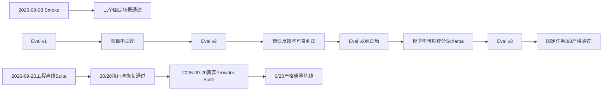

# Harnessix Code验证证据索引

## 1. 文档定位

本索引登记仓库内已冻结的确定性离线Suite、真实Provider Smoke与Coding Eval证据。它只说明证据身份、执行边界、结果和替代关系，
不把历史结论升级为当前版本的生产承诺。当前测试方法和发布判定以[测试与Eval规范](../testing-and-evals.md)为准，
当前运行时行为以[模块详细设计](../README.md#3-当前事实源)为准。

## 2. 证据清单

| 日期 | 证据 | 代码Revision | 固定环境与预算 | 冻结结论 | 关系 |
|---|---|---|---|---|---|
| 2026-09-24 | [Artifact增长三平台冻结阈值第二独立Run](soak-artifact-growth-three-platform-candidate-2026-09-24-v3/README.md) | `39dda2bb218baed30dcf9b1326f899a3133f497b` | Linux/macOS/Windows各自预冻结Profile，2预热+300正式混合大小件；确定性Provider | 三份STARTED v2/Run/Report原件、24份文件摘要及独立复验再生报告均PASS；[CI 36015746312](https://github.com/carrie1988/Harnessix/actions/runs/36015746312)六实例成功 | 固定Artifact增长场景（300件）工程护栏通过；前两轮FAIL保留，不关闭其余0.9.3d门禁 |
| 2026-09-24 | [Artifact增长三平台正式规模基线v3（300件负载）](soak-artifact-growth-three-platform-2026-09-24-v3/README.md) | `6f55e747bdecca1c8550467621028dfcd02079b2` | Linux/macOS/Windows Python 3.12、2预热+300正式混合大小件、2925次正式分页、历史Artifact批量验证；确定性Provider | 三平台Run/Attempt原件及18份文件摘要、分位数、v3 Proof独立复核通过；[CI 36009364391](https://github.com/carrie1988/Harnessix/actions/runs/36009364391)六实例成功 | 300件正式基线与封印Profile；前两轮FAIL与全部旧证据保持只读，第二独立Run待复验 |
| 2026-09-24 | [长会话Context两平台正式规模基线与Windows诊断](soak-long-session-two-platform-2026-09-24-v1/README.md) | `46ca9a2006b5f857ecb55924ba969cf2e331187e` | Linux/macOS 1000 Turn、5预热、199次压缩摘要；确定性Provider | 两平台Run/Attempt原件及14份文件摘要、1000条Turn样本最近秩重算通过；Windows在measuring阶段以`soak_turn_timeout`失败仅留诊断Attempt；[CI 35971925613](https://github.com/carrie1988/Harnessix/actions/runs/35971925613)六实例成功 | 仅Linux/macOS基线与封印Profile；Windows为Session快照路径规模限制，场景门禁未关闭 |
| 2026-09-24 | [Artifact增长三平台第二轮候选性能FAIL](soak-artifact-growth-three-platform-candidate-2026-09-24-v2/README.md) | `d4a3ee20a8e17fab466c690e86a9a48991430398` | 同三份60件冻结Profile、2预热+60正式混合大小件；确定性Provider | 24份原件与Reader、分位数复核一致；macOS/Windows PASS，Linux单件780ms停顿致发布P99越限FAIL；[CI 35966150370](https://github.com/carrie1988/Harnessix/actions/runs/35966150370)六实例成功 | 第二轮候选FAIL；负载修复为300件使P99为近限子样本第3高值，FAIL原件保留 |
| 2026-09-24 | [Artifact增长三平台正式规模基线v2（60件负载）](soak-artifact-growth-three-platform-2026-09-24-v2/README.md) | `5f1b3c1152c2eb7577b9265efa63f2ec1f186cdc` | Linux/macOS/Windows Python 3.12、2预热+60正式混合大小件、585次正式分页；确定性Provider | 三平台Run/Attempt原件及18份文件摘要、分位数、v3 Proof独立复核通过；[CI 35964147780](https://github.com/carrie1988/Harnessix/actions/runs/35964147780)六实例成功 | 负载修复后新基线与封印Profile；首轮FAIL与v1基线保持只读，第二独立Run待复验 |
| 2026-09-24 | [Action恢复三平台冻结阈值第二独立Run](soak-action-recovery-three-platform-candidate-2026-09-24-v1/README.md) | `65cbcc5caab2ba167763844e974c9cd7c036ed0d` | Linux/macOS/Windows各自预冻结Profile，2预热+20正式轮固定四故障矩阵；Provider零请求 | 三份STARTED v2/Run/Report原件、24份文件摘要及独立数值重算均通过；各平台Report为PASS；[CI 35961875693](https://github.com/carrie1988/Harnessix/actions/runs/35961875693)六实例成功 | 固定Action恢复场景工程护栏通过；不关闭其余0.9.3d或1.0发布门禁 |
| 2026-09-24 | [Artifact增长三平台首轮候选性能FAIL](soak-artifact-growth-three-platform-candidate-2026-09-24-v1/README.md) | `65cbcc5caab2ba167763844e974c9cd7c036ed0d` | 同三份冻结Profile、2预热+20正式混合大小件；确定性Provider | 24份原件与Reader、分位数复核一致；Windows PASS，Linux/macOS发布与读取尾部越限FAIL；[CI 35961875693](https://github.com/carrie1988/Harnessix/actions/runs/35961875693)六实例成功 | 该Revision固定场景候选FAIL；诊断为共享Runner I/O漂移，负载修复为60件后须新基线与新候选，FAIL原件保留 |
| 2026-09-24 | [Action恢复三平台正式规模基线](soak-action-recovery-three-platform-2026-09-24-v1/README.md) | `b3e0d6f731d29b2749aab2827a9ebb302c2e87d6` | Linux/macOS/Windows Python 3.12、2预热+20正式轮固定四故障矩阵、44次预期UNKNOWN；Provider零请求 | 三平台Run/Attempt原件及18份文件摘要、分位数、v7 Proof独立复核通过；[CI 35960330442](https://github.com/carrie1988/Harnessix/actions/runs/35960330442)六实例成功 | 三平台各一次正式基线与封印Profile；第二独立Run与报告待复验，基线本身不判PASS |
| 2026-09-24 | [Artifact增长三平台正式规模基线](soak-artifact-growth-three-platform-2026-09-24-v1/README.md) | `b3e0d6f731d29b2749aab2827a9ebb302c2e87d6` | Linux/macOS/Windows Python 3.12、2预热+20正式混合大小件、195次正式分页；确定性Provider | 三平台Run/Attempt原件及18份文件摘要、分位数、v3 Proof独立复核通过；[CI 35960330442](https://github.com/carrie1988/Harnessix/actions/runs/35960330442)六实例成功 | 三平台各一次正式基线与封印Profile；第二独立Run与报告待复验，基线本身不判PASS |
| 2026-09-23 | [多Thread读路径收敛后三平台候选原件](soak-many-threads-three-platform-candidate-2026-09-23-v3/README.md) | `aa3372c0eb0c3b4ab674b19d26754a80dd035b46` | 原三份封印Profile、500 Thread/50每页/3正式重启；Provider零请求 | 三平台Run/Attempt/Report 24份原件、三个ZIP、逐轮Proof、最近秩与独立报告复验均为PASS；[同Revision CI 35883976180](https://github.com/carrie1988/Harnessix/actions/runs/35883976180)六Job成功 | 固定多Thread场景工程护栏通过；旧macOS FAIL原件保留，不外推到产品发布 |
| 2026-09-23 | [多Thread三平台修复后候选性能FAIL](soak-many-threads-three-platform-candidate-2026-09-23-v2/README.md) | `807e688988245fcbb269f0c04013ed9a9ca6ea9d` | 同三份冻结Profile、500 Thread/50每页/3正式重启；无模型请求 | 24份原件与三个ZIP、Reader、逐页Proof、分位数和独立报告复验均通过；Linux/Windows PASS，macOS启动P95/P99和分页P99越限FAIL；[同Revision CI 35880201885](https://github.com/carrie1988/Harnessix/actions/runs/35880201885)六Job成功 | 该Revision固定场景候选FAIL；不得调高原Profile或丢弃macOS FAIL，新Revision验收见首行 |
| 2026-09-23 | [多Thread三平台首轮候选诊断](soak-many-threads-three-platform-candidate-2026-09-23-v1/README.md) | `cadc4e5190dd94e9dbc7760b19b1659090f73cbb` | 同冻结Profile三平台第二Run | 三份报告PASS，24份原件与三个ZIP及独立复验一致；同Revision CI跨平台夹具错误失败 | 不作为正式场景关闭证据；修复后重测见上一行 |
| 2026-09-23 | [多Thread三平台v6逐轮证明正式基线及封印Profile](soak-many-threads-three-platform-2026-09-23-v2/README.md) | `6e64a5cba2108ac77de90a5726b45773b4482c75` | Linux/macOS/Windows各500 Thread、50条每页、一次预热、三次正式Runtime/App Service重启；无模型请求 | 三平台Run/Attempt与v6 Proof、18份原件SHA、三个ZIP及最近秩统计独立复核通过；[同Revision CI 35876009038](https://github.com/carrie1988/Harnessix/actions/runs/35876009038)六Job成功；三份Profile从基线封印并独立重读 | 仅单次正式基线及预冻结阈值，另有第二轮候选macOS FAIL；不判场景PASS |
| 2026-09-23 | [多Thread三平台一次正式负载基线](soak-many-threads-three-platform-2026-09-23-v1/README.md) | `12bfc1108efc461742712c98fe782ce4b1849f05` | Linux/macOS/Windows各500 Thread、1次预热、3次正式Runtime/App Service重启，50条每页；无模型请求 | 三平台Runner成功；Run/Attempt与15份原件SHA、最近秩统计重算通过；[CI 35870214455](https://github.com/carrie1988/Harnessix/actions/runs/35870214455)六Job成功 | v1无逐轮集合Proof，超时排空无独立全局期限；不能冻结Profile或判场景PASS |
| 2026-09-23 | [完整产品重启三平台冻结阈值第二独立Run](soak-restart-three-platform-candidate-2026-09-23-v1/README.md) | `e81ebada78f67f4c447e4ae0089ec143ccd6cf34` | Linux/macOS/Windows各自预冻结Profile，500 Thread、1次预热、1次受控硬退出、3次正式新进程；Provider零请求 | 三份STARTED v2/Run/Report原件、24份文件摘要及独立数值重算均通过；各平台Report为PASS；[CI 35867509424](https://github.com/carrie1988/Harnessix/actions/runs/35867509424)首次文档Job超时、只重跑失败Job后六Job成功 | 仅固定重启场景工程护栏；不关闭其余0.9.3d或1.0发布门禁 |
| 2026-09-23 | [完整产品重启三平台正式规模基线](soak-restart-three-platform-2026-09-23-v1/README.md) | `172b1ee96a89e981a6332b16f60b86e2db654df1` | Linux/macOS/Windows Python 3.12、500 Thread、1预热+1硬退出+3正式新进程；Provider零请求 | 三平台Run/Attempt原件及18份文件摘要、分位数、V5 Proof独立复核通过；[CI 35864457452](https://github.com/carrie1988/Harnessix/actions/runs/35864457452)失败文档Job重跑后六Job成功 | 三平台各一次正式基线与封印Profile；第二独立Run与报告见上一条，基线本身不判PASS |
| 2026-09-23 | [Windows Product UI退出期限诊断](product-quit-windows-2026-09-23-v1/README.md) | `823ceac0c7ec250bb36cd0009946949ad8f094d2` | [CI 35845010214](https://github.com/carrie1988/Harnessix/actions/runs/35845010214) Windows原生Job，首次与第二次尝试 | 首次511通过/1失败/45跳过，重跑512通过/45跳过；外层10秒小于子进程默认10+5秒关闭预算 | 仅诊断，预算倒挂修复由[CI 35847851813](https://github.com/carrie1988/Harnessix/actions/runs/35847851813)三次六Job成功验收；旧首次失败排他根因仍未确认，不宣称整体稳定 |
| 2026-09-23 | [SDK容量三平台冻结阈值第二独立Run](soak-sdk-three-platform-candidate-2026-09-23-v1/README.md) | `cf7e6b4dba5357354abcd3822bcb2c1e2215bd7c` | Linux/macOS/Windows各自预冻结Profile，固定64容量、1预热+3正式轮、20次往返；Provider零请求 | 三份STARTED v2/Run/Report原件、24份文件摘要和独立数值重算均通过；各平台Report为PASS；[CI 35843734178](https://github.com/carrie1988/Harnessix/actions/runs/35843734178)六实例成功 | 仅SDK容量固定场景工程护栏；不关闭其余0.9.3d或1.0发布门禁 |
| 2026-09-23 | [SDK容量三平台正式规模基线](soak-sdk-three-platform-2026-09-23-v1/README.md) | `70c5161986082b63acd31ab1acf8328c9fad9efd` | Linux/macOS/Windows Python 3.12、容量64、各1预热+3正式轮、各20次往返；Provider零请求 | 三平台Run/Attempt原件及18份文件摘要、分位数、Proof独立复核通过；[CI 35838258049](https://github.com/carrie1988/Harnessix/actions/runs/35838258049)六实例成功 | 三平台各一次正式基线与签封Profile；第二独立Run与报告单独见上一条，不得由基线本身判PASS |
| 2026-09-23 | [macOS SDK容量单平台规模基线](soak-macos-sdk-2026-09-23-v1/README.md) | `c4c364c059a7b6ea61410fe03ba41ef140fcdd41` | macOS Python 3.13.8、`c16-m48`、容量64、1预热+3正式轮、20次正常往返；固定Provider零请求 | Run/Attempt与独立摘要、样本、Proof复核通过；对应Revision六实例CI成功；往返P95 1407042 ns、父子峰值RSS较大者68845568字节 | 单平台单次基线；未冻结阈值、第二独立Run或Linux/Windows正式负载，不得判发布PASS |
| 2026-09-23 | [macOS Artifact单平台规模基线](soak-macos-artifact-2026-09-23-v3/README.md) | `5d48b9735c11022743eb56df5da23125702b0140` | macOS Python 3.13.8、`c16-m48`、2预热+20正式件、20发布/195正式读取样本；无模型网络请求 | Run/Attempt与独立数值重算通过；对应Revision六实例CI成功；发布P95 13654625 ns、读取P95 6604000 ns | 单平台单次基线，可供工程Profile评审；未冻结阈值、未做独立复验或其他平台正式运行，不得判发布PASS |
| 2026-09-23 | [macOS Artifact第二次规模诊断](soak-macos-artifact-2026-09-23-v2/README.md) | `c63f970f3386632b9720ae33d1a7f056e70c0510` | macOS Python 3.13.8、`c16-m48`、2预热+20正式件、20发布/195正式读取样本；无模型网络请求 | Run/Attempt重读和独立分位数/覆盖重算通过；对应Windows CI的Turn超时用例出现异步SQLite句柄清理失败 | 历史诊断证据；不得冻结Profile或判发布PASS |
| 2026-09-23 | [macOS Artifact首次规模诊断](soak-macos-artifact-2026-09-23-v1/README.md) | `784cd54ec2383c6a3679d64db401ad4d3bf9b86a` | macOS Python 3.13.8、`c16-m48`、2预热+20正式件、20发布/195正式读取样本；无模型网络请求 | Run/Attempt重读和独立数值重算通过；对应Windows CI的只读SQLite连接未关闭 | 历史诊断证据；不得冻结Profile或判发布PASS |
| 2026-09-23 | [macOS 500 Thread正式负载诊断](soak-macos-2026-09-23-v4/README.md) | `d947a57aec68a5f9770a18d1996f58be0237e60d` | macOS Python 3.13.8、`c16-m48`、500 Thread、3次正式重启、30个列表页样本；无模型请求 | Run/Attempt及独立标准库重算通过；启动P95 435170625 ns、列表页P95 431874209 ns；Windows Product UI首次尝试两项超时、第二次重跑成功 | 历史诊断证据；首次失败原因未明，不得冻结Profile或判断发布PASS |
| 2026-09-23 | [macOS千Turn Context/Compaction v2规模基线](soak-macos-2026-09-23-v3/README.md) | `6c9a1577f467c99f0eb1b99d7c8270bc811ca583` | macOS、单Thread、5预热+1000正式Turn、无网络模型；1000时延和1个RSS样本、13255条低敏事件标记 | Run/Attempt复制件双重重读，正式Context检查1000、摘要及窗口199；P95 3153631375 ns、RSS峰值451936256字节；六实例CI通过 | 单平台单次基线；不得直接冻结Profile或判发布PASS |
| 2026-09-23 | [macOS单Thread连续1000 Turn诊断事实](soak-macos-2026-09-23-v2/README.md) | `ed48e4e35133d60b172c268becd9e009eacb9442` | macOS Python 3.13.8、`c16-m48`、5预热+1000正式Turn、1000时延样本与1个RSS样本；无网络模型请求 | Run及Attempt复制件独立重算，P95 1173980291 ns、RSS峰值344817664字节；Revision六实例CI通过，但缺Context/Compaction专门断言 | 真实规模诊断事实，不用于冻结Profile，不关闭0.9.3d发布门禁 |
| 2026-09-23 | [macOS 500 Thread单次Soak诊断事实](soak-macos-2026-09-23-v1/README.md) | `d64054638a03bca008f5b392fd0edf23aa4cd63b` | macOS Python 3.13.8、`c16-m48`、500 Thread、3次正式重启、30个列表页样本；无模型请求 | Manifest和原始数值已独立重算；启动P95 440247292 ns、列表页P95 427911708 ns；对应Revision跨平台CI未通过 | 历史诊断证据，不用于冻结Profile，不关闭Soak或商用发布门禁 |
| 2026-09-20 | [工程Task Pack v2真实Provider完整Suite](provider-engineering-2026-09-20-v1/README.md) | `fb4a0ea8f7ffcd14113212fb77b2028143af9914` | 北京精确模型、3仓10 Case、每Case 2 Trial、无自动重试、CNY 40 Trial边界停止线 | 20/20 Trial终结；任务成功0/20、测试通过0/20；81请求、318,478/12,148输入/输出Token、CNY 1.46828完整已知成本 | 0.9.2e当前冻结真实质量基线；证明失败可审计，不证明模型可用成功率 |
| 2026-09-20 | [工程Task Pack v2完整离线Suite](offline-engineering-2026-09-20-v2/README.md) | `505bc537f74bd59e891c605ff4114856991f1783` | 3仓10 Case、每Case 2 Trial、固定Digest无网Container、Recorded Provider零费用 | 20/20 Trial通过；120请求、60自动审批；首Case证据与Suite报告两个崩溃窗口均恢复 | 0.9.2d3当前冻结离线证据；不证明真实模型能力 |
| 2026-09-03 | [百炼北京受控Smoke](bailian-2026-09-03.md) | `9f24961840fa704e7c7a344c648164d8afe793b7` | 北京兼容端点；每请求最多128输出Token；零重试；总计7次请求 | 文本、内存工具、审批重开三个固定场景通过；费用和其他Provider未验证 | Smoke独立证据 |
| 2026-09-06 | [Coding Eval v1](bailian-2026-09-06-coding-eval/README.md) | `bbfd446707acbd9f945657ad96a6556d24af5df5` | 固定模型；3个Run；16步骤、20000累计Token、600秒；费用停止线¥10 | 0/3，均因任务Token预算结束；不能形成编码成功率 | 被v2诊断推进，但原证据保留 |
| 2026-09-06 | [Coding Eval v2](bailian-2026-09-06-coding-eval-v2/README.md) | `397542942be8474d99feb190a901e8b336a19bdd` | 固定模型；3个Run；100000累计Token；费用停止线¥10 | 0/3，暴露分页参数错误反馈不可自纠正 | 被v2纠正后Campaign推进 |
| 2026-09-06 | [Coding Eval v2纠正后](bailian-2026-09-06-coding-eval-v2-corrected/README.md) | `7e58c15a4be9780de5837c9706f986a8613b1420` | 同等固定模型、Run数和预算；加入专用分页纠错 | 严格0/3；其中2/3完成代码闭环，但模型不可见最终回答Schema | 被v3消除测量偏差 |
| 2026-09-06 | [Coding Eval v3](bailian-2026-09-06-coding-eval-v3/README.md) | `9d0be66e197a82506cf0d0dcbf59832d8865f1e2` | 同等固定模型、Run数和预算；Prompt公开最终回答Schema | 固定历史缺陷3/3严格通过；不得外推到任意仓库或任务 | 该任务序列的最新冻结证据 |

## 3. 证据谱系

图中的箭头表示问题诊断和任务版本演进，不表示后一个目录覆盖前一个目录。所有失败、预算终止和测量偏差均保留，
以便复查架构决策如何形成。

## 4. 固定字段与脱敏边界

每份证据必须固定或显式声明：

1. 代码Revision、执行日期、Provider端点/地域、协议和精确模型；
2. Task、Campaign、Run、参数、重试、Token、时间、请求次数和费用边界；
3. 完成、失败、取消、预算结束和未知成本的分类；
4. 证据文件摘要、聚合方式、适用结论和不能外推的范围；
5. 凭据、Header、供应商正文、私有Session、工作区和工具输出的保存策略。

仓库只保存允许公开的白名单投影。API Key、Authorization Header、供应商响应正文、私有Session和个人环境路径
不得进入Git历史。历史证据发现脱敏缺陷时，应先阻断发布并清理敏感数据；不得以“保持历史原文”为由保留Secret。

## 5. 使用与维护规则

1. 日期化证据生成后保持`historical`，不得覆盖原JSON、Run身份、结果或失败分类；
2. 后续验证创建新目录或新文档，并在本索引记录谱系和适用Revision；
3. 新证据可以取代某项结论，但不能删除产生该结论的旧失败证据；
4. 费用为基于版本化价格和完整Usage的估算时，必须明确不等同于供应商账单；
5. 单个Provider、地域、模型和任务通过，只证明该固定组合，不构成产品级泛化结论；
6. 当前结论必须同时核对对应模块设计、路线图和最新CI，不得直接引用历史数字作为发布状态。
