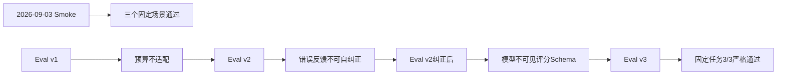

# Harnessix Code验证证据索引

## 1. 文档定位

本索引登记仓库内已冻结的真实Provider Smoke与Coding Eval证据。它只说明证据身份、执行边界、结果和替代关系，
不把历史结论升级为当前版本的生产承诺。当前测试方法和发布判定以[测试与Eval规范](../testing-and-evals.md)为准，
当前运行时行为以[模块详细设计](../README.md#3-当前事实源)为准。

## 2. 证据清单

| 日期 | 证据 | 代码Revision | 固定环境与预算 | 冻结结论 | 关系 |
|---|---|---|---|---|---|
| 2026-09-03 | [百炼北京受控Smoke](bailian-2026-09-03.md) | `9f24961840fa704e7c7a344c648164d8afe793b7` | 北京兼容端点；每请求最多128输出Token；零重试；总计7次请求 | 文本、内存工具、审批重开三个固定场景通过；费用和其他Provider未验证 | Smoke独立证据 |
| 2026-09-06 | [Coding Eval v1](bailian-2026-09-06-coding-eval/README.md) | `bbfd446707acbd9f945657ad96a6556d24af5df5` | 固定模型；3个Run；16步骤、20000累计Token、600秒；费用停止线¥10 | 0/3，均因任务Token预算结束；不能形成编码成功率 | 被v2诊断推进，但原证据保留 |
| 2026-09-06 | [Coding Eval v2](bailian-2026-09-06-coding-eval-v2/README.md) | `397542942be8474d99feb190a901e8b336a19bdd` | 固定模型；3个Run；100000累计Token；费用停止线¥10 | 0/3，暴露分页参数错误反馈不可自纠正 | 被v2纠正后Campaign推进 |
| 2026-09-06 | [Coding Eval v2纠正后](bailian-2026-09-06-coding-eval-v2-corrected/README.md) | `7e58c15a4be9780de5837c9706f986a8613b1420` | 同等固定模型、Run数和预算；加入专用分页纠错 | 严格0/3；其中2/3完成代码闭环，但模型不可见最终回答Schema | 被v3消除测量偏差 |
| 2026-09-06 | [Coding Eval v3](bailian-2026-09-06-coding-eval-v3/README.md) | `9d0be66e197a82506cf0d0dcbf59832d8865f1e2` | 同等固定模型、Run数和预算；Prompt公开最终回答Schema | 固定历史缺陷3/3严格通过；不得外推到任意仓库或任务 | 该任务序列的最新冻结证据 |

## 3. 证据谱系

图中的箭头表示问题诊断和任务版本演进，不表示后一个目录覆盖前一个目录。所有失败、预算终止和测量偏差均保留，
以便复查架构决策如何形成。

## 4. 固定字段与脱敏边界

每份证据必须固定或显式声明：

1. 代码Revision、执行日期、Provider端点/地域、协议和精确模型；
2. Task、Campaign、Run、参数、重试、Token、时间、请求次数和费用边界；
3. 完成、失败、取消、预算结束和未知成本的分类；
4. 证据文件摘要、聚合方式、适用结论和不能外推的范围；
5. 凭据、Header、供应商正文、私有Session、工作区和工具输出的保存策略。

仓库只保存允许公开的白名单投影。API Key、Authorization Header、供应商响应正文、私有Session和个人环境路径
不得进入Git历史。历史证据发现脱敏缺陷时，应先阻断发布并清理敏感数据；不得以“保持历史原文”为由保留Secret。

## 5. 使用与维护规则

1. 日期化证据生成后保持`historical`，不得覆盖原JSON、Run身份、结果或失败分类；
2. 后续验证创建新目录或新文档，并在本索引记录谱系和适用Revision；
3. 新证据可以取代某项结论，但不能删除产生该结论的旧失败证据；
4. 费用为基于版本化价格和完整Usage的估算时，必须明确不等同于供应商账单；
5. 单个Provider、地域、模型和任务通过，只证明该固定组合，不构成产品级泛化结论；
6. 当前结论必须同时核对对应模块设计、路线图和最新CI，不得直接引用历史数字作为发布状态。
