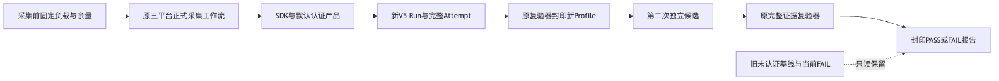
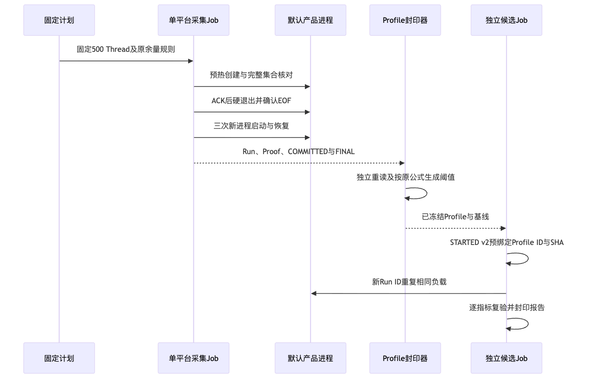
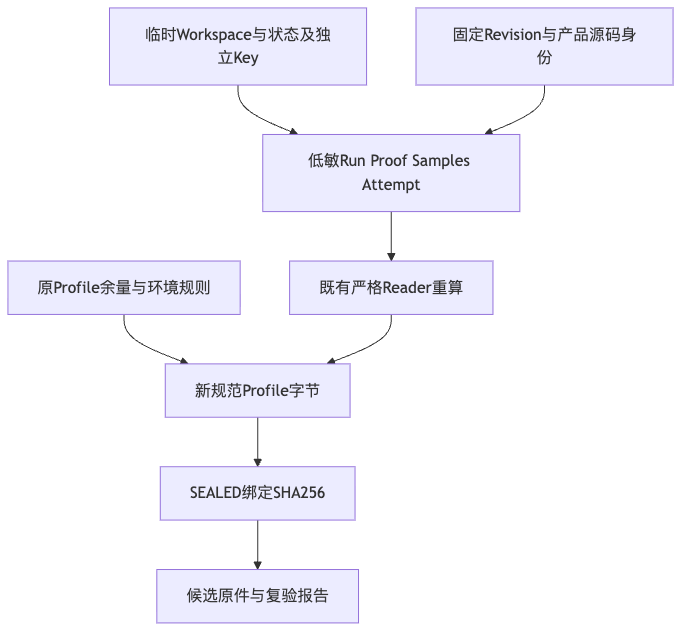

# 默认认证产品三平台重启基线与Profile冻结报告

## 1. 结论与适用范围

三平台新基线完整采集、独立重读与Profile冻结通过；**尚非候选性能PASS或商用发布通过**。
执行源码为`7cbe358ff0f22ea2bc0813478bb1c13a2b1e7c46`，仅比`0363dc3`增加预注册设计、计划和路线图，
产品`src`及原采集器未改变。默认产品保留持久Key、原事件/投影来源认证和全状态Owner。
[采集Run 36505305991](https://github.com/carrie1988/Harnessix/actions/runs/36505305991)三个原生Job全部成功。
原Profile和[原三平台数据库增长FAIL](../product-restart-release-boundary-2026-09-29-v1/README.md)保留。

## 2. 背景、决策与固定计划

原未认证基线不能代表增加必要持久证明后的容量负载。
本次采用[正式详设](../../changes/m09-r1-authenticated-restart-baseline.md)定义的独立认证基线，
不增加二进制存储格式、不减少证明、不改变验证策略。
[预注册计划](../../changes/m09-r1-authenticated-restart-baseline-plan.json)先于采集提交并固定负载和余量，
原SHA为`7ee884c39078cc9ed71f6dda78bbbe4777179351b76d58aeb277e68bb7ee9c0a`。
阈值只使用本次新基线，不读取候选值或用旧FAIL差额手调。

## 3. 总体架构与执行时序



原SDK启动完整默认产品，首次创建500 Thread；第二个新进程在确认ACK后硬退出并取得EOF，
随后三个独立新进程恢复同一完整集合，核对Owner代际和持久恢复报告。
采集器发布V5 Run、Proof及完整Attempt；既有Reader重读后，原Profile规则投影为新Profile。
第二独立候选属于后继运行，不能从本次基线推导其结果。



三平台各自独立状态根和Profile，不合并原生样本，也不将正常流程结束当作阈值PASS。
每个阶段120秒、每Job30分钟上限保持；一次预热、一次硬退出、三次正式启动保持。

## 4. 数据流程、领域合同与安全边界



公开原件只包含样本、统计、计数、水位、稳定摘要和执行身份；业务库、独立Key、协议正文及Workspace不上传。
认证负载身份由固定源码和默认组合根锁定，不把普通SHA或计数冒充新的业务MAC认证。
`SoakManifestV5`、`SoakRestartProof`、`SoakThresholdProfile`及`SEALED.json`均复用原版本。
`turn_count=0`、Provider请求0、工程质量Trial计数0；不读取实际模型凭据。

## 5. 原始基线与新容量阈值

| 平台 | 原生Python / 硬件档位 | 新基线DB增长字节 | 新DB上限字节 | 启动P95 ns | 峰值RSS字节 |
|---|---|---:|---:|---:|---:|
| Linux | 3.12.3 / c4-m16 | 2,015,232 | 3,022,848 | 3,402,726,008 | 102,584,320 |
| macOS | 3.12.10 / c3-m7 | 2,121,728 | 3,182,592 | 4,747,207,500 | 112,721,920 |
| Windows | 3.12.10 / c4-m16 | 2,121,728 | 3,182,592 | 7,923,830,800 | 108,335,104 |

初始库水位均0，末态包含原六库；WAL及Artifact增长均0，上限仍0。
新Profile使用原启动10000bp、RSS及三类增长5000bp：
`upper = ceil(new_baseline_value × (10000 + original_margin_bp) / 10000)`。
全部分位独立展开，Python范围仍3.12.0～3.12.99；硬件档位绑定各平台本次实际观察。
这是托管机小样本工程护栏，不是消费者启动SLO或长期容量结论。

## 6. 封印、持久化与失败恢复

三份Run及Attempt共18件原文件，三份Profile及Seal共6件；由[冻结事实](facts/profile-freeze.json)绑定ID和摘要。
[冻结程序](diagnostics/freeze_profiles.py)核对计划、固定Git源码输入、三平台终态、负载和原余量，
调用原`publish_profile`及`verify_profile_baseline`；已有Profile目录再次执行时拒绝，不覆盖。
旧原件保持不变；候选必须在STARTED v2预绑定新Profile，缺文件、错误来源或数学阈值先于负载拒绝。
完整但越限的候选应保留FAIL，不能重新冻结Profile追赶成绩。

## 7. 实际测试、错误分类与可观测性

Python3.12.7和3.13.8的完整Benchmark范围各**241通过、1原生平台跳过**。
两组环境与重叠用例不求和，POSIX跳过不计Windows通过。
新增覆盖认证/历史显式选择、无自动回退、真实旧Run拒绝、来源/负载/样本/故障/Python/余量漂移、
负载前数学校验、三平台原Profile规则保持及新旧预绑定。
[3.12日志](logs/benchmark-python312.log)、[3.13日志](logs/benchmark-python313.log)和对应JUnit保留实际结果。
初始文档语义章节失败及修正结果分别保留，不能计入运行通过数。

Run ID、完整Attempt、Manifest SHA、Profile SHA和稳定错误码是可观察事实；
低敏[工作流状态](facts/baseline-workflow.json)与[完整Job日志](logs/baseline-workflow.log)绑定实际原生Job。
完整证据及独立整数重算见[verification.json](verification.json)，评审边界见[Review Packet](review-packet.json)。

## 8. 源码映射与核心伪代码

| 实现 | 职责 |
|---|---|
| [soak_restart.py](../../../scripts/soak_restart.py) | 真实SDK、五周期、集合恢复、硬退出、完整六库及RSS测量。 |
| [run_restart_soak_release.py](../../../scripts/run_restart_soak_release.py) | 固定500/1/3采集、Run与Attempt重读。 |
| [soak_threshold.py](../../../scripts/soak_threshold.py) | 原数学规则、完整基线校验、Profile/Report不可覆盖封印。 |
| [run_restart_soak_candidate.py](../../../scripts/run_restart_soak_candidate.py) | 后继候选的显式集合及运行前校验；不修改本次基线。 |
| [sqlite_publication.py](../../../src/harnessix/session/sqlite_publication.py) | 原持久来源认证与重启读取；本次未改变。 |

```text
read fixed plan and source inputs
read three complete baseline Runs and Attempts
require original load, samples, faults and zero Provider requests
derive each bound from new baseline and original margin only
publish each new Profile once; independently re-read and recalculate
keep candidate result unverified until independent execution
```

## 9. 复验方法与完整性

从固定仓库读取原件，执行对应Benchmark用例及既有Reader；
独立运行[verify_baseline.py](diagnostics/verify_baseline.py)重算全部样本分位、阈值和集合/周期交叉事实。
`freeze_profiles.py`用于首轮生成；不得在此已冻结目录重复生成Profile。
[Manifest](manifest.json)记录交付文件及被引用原件的字节数和SHA；验证不修改Key、库或用户状态。

## 10. 发布边界与未验证项

本次只完成新认证基线和Profile冻结，第二独立候选尚未执行。
不关闭R1整体、0.9、真实20 Trial、Windows 11消费者编码、不同版本升级/回退、独立Beta及1.0商用门禁。
既有0/20与旧三平台容量FAIL保留；无新付费请求，70元原预算周期不变。
