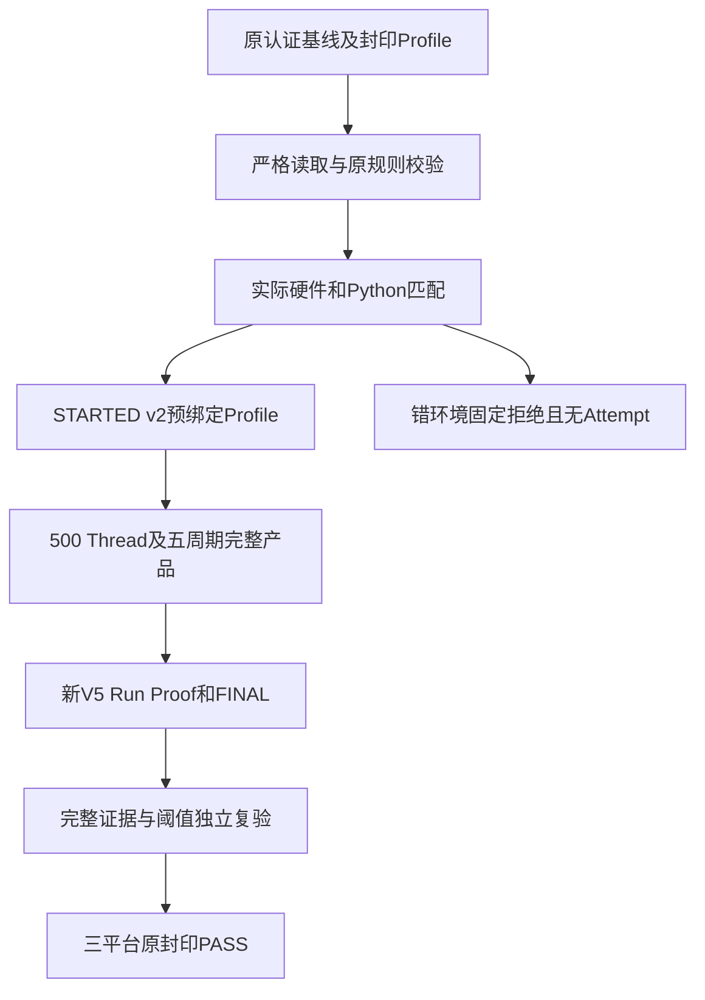
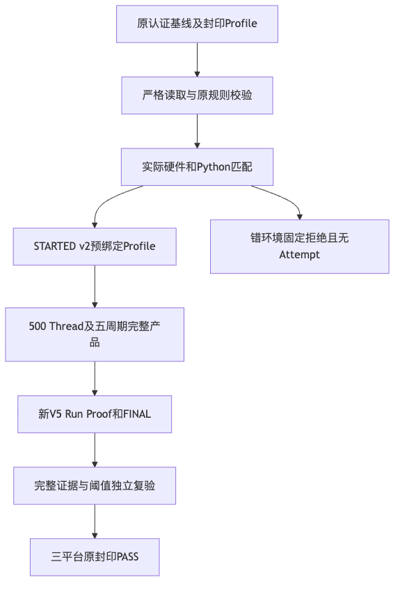

# 认证重启三平台同候选PASS与固定场景关闭报告

## 1. 结论与固定身份

**固定认证重启场景GO；R1整体及商用发布NO_GO。**
[实际Run 36508768270](https://github.com/carrie1988/Harnessix/actions/runs/36508768270)
绑定同一源码`0ba1b8cdb4750bd7e3002ba471e21f12375df425`，三个原生Job均成功，原封印报告均PASS。
[verification.json](verification.json)已逐份重读Run、Attempt及报告，独立重新调用原复验器得到同一结论。
原[认证基线/Profile](../authenticated-restart-three-platform-2026-09-29-v1/README.md)未改，
[首轮Mac不可比较结果](../authenticated-restart-three-platform-candidate-2026-09-29-v1/README.md)
和[未认证旧阈值下的容量FAIL](../product-restart-release-boundary-2026-09-29-v1/README.md)全部保留。

## 2. 需求背景、整改与边界

首轮Mac与基线的镜像版本相同，但CPU/物理内存档位不同，严格比较正确判unverified。
本次在负载前匹配实际档位和Python范围，错环境不创建Attempt；macOS工作流使用标准版本标签`macos-26`。
此次实际Mac为c3-m7，与原基线匹配；不将这次成功解释为外部资源漂移永久消失或固定标签保证硬件。
产品`src`及原Runner/阈值数学规则与基线相同，仅改候选准入和工作流标签。
没有为取得PASS重新冻结Profile、调上限、降低负载或绕过认证。

## 3. 总体流程、接口与源码映射





[`run_candidate`](../../../scripts/run_restart_soak_candidate.py)默认认证集合，先校验原数学阈值和来源，
再匹配实际环境；随后把Profile ID/SHA写入STARTED v2，调用
[`run_product_restart`](../../../scripts/soak_restart.py)执行原SDK和完整产品。
[`verify_and_publish`](../../../scripts/soak_threshold.py)核对原负载、故障、分位及水位，最后发布不可覆盖Report。
完整类、接口、字段、伪代码、时序及失败语义见[正式详设](../../changes/m09-r1-authenticated-restart-baseline.md)。

## 4. 原指标与冻结上限

| 平台 / 档位 | DB增长 / 上限（字节） | 启动P95 / 上限（ns） | RSS / 上限（字节） | 报告 |
|---|---|---|---|---|
| Linux / c4-m16 | 2,023,424 / 3,022,848 | 3,510,765,229 / 6,805,452,016 | 101,609,472 / 153,876,480 | PASS |
| macOS / c3-m7 | 2,121,728 / 3,182,592 | 3,100,190,750 / 9,494,415,000 | 113,803,264 / 169,082,880 | PASS |
| Windows / c4-m16 | 2,113,536 / 3,182,592 | 7,665,710,700 / 15,847,661,600 | 107,843,584 / 162,502,656 | PASS |

原500 Thread、一次预热、一次ACK/EOF硬退出、三次正式启动以及全部集合/Owner恢复证明保持。
WAL/Artifact增长仍0；原启动10000bp、RSS及增长5000bp保持，候选数值不参与计算上限。
Linux数据库相对基线多8192字节但仍在原冻结上限内；不据此声称长期无泄漏。
峰值RSS是父子峰值较大者，不是并发内存总和；三条启动样本不提供消费者SLO。

## 5. 测试、持久化及独立复核

当前源码完整Benchmark：Python3.12.7与3.13.8各**243通过、1平台跳过**，不同环境不求和。
资源档位、Python越界分别证明在Revision读取及正式Attempt前拒绝。
[3.12日志](logs/benchmark-python312.log)及[3.13日志](logs/benchmark-python313.log)与JUnit保留原件。
三平台原Run/Attempt共18件、Report/Seal共6件，均来自同一Run、同一Revision。
独立重算除新报告ID及核验时间外与原报告所有字段一致；STARTED v2预绑定早于负载，晚于Profile冻结。
[工作流终态](facts/candidate-v2-workflow.json)、[Job日志](logs/candidate-v2-workflow.log)、
[Manifest](manifest.json)及[Review Packet](review-packet.json)记录实际来源、完整性和评审边界。
资料生成阶段的两项缺失链接及相应治理失败保留在
[原文档检查](logs/delivery-documentation-initial-fail.json)和
[原治理日志](logs/delivery-governance-initial-fail.log)；补齐实际文件后，
[文档复验](logs/delivery-documentation.json)零问题、
[治理复验](logs/delivery-governance.log)276项通过。交付资料失败不改写三平台原产品报告。

### 5.1 离线重算方法

在仓库根目录、已安装开发依赖的Python环境执行以下命令。仅重读归档，
新报告写入自动清理的系统临时目录；不请求模型，也不重新运行产品负载。
复算比较排除新生成的报告ID及时间，其余所有字段必须与原报告一致。

```bash
PYTHONPATH=src .venv/bin/python - <<'PY'
from pathlib import Path
from tempfile import TemporaryDirectory
from scripts.soak_threshold import read_profile, read_report, verify_and_publish

base = Path("docs/validation/authenticated-restart-three-platform-2026-09-29-v1")
candidate = Path("docs/validation/authenticated-restart-three-platform-candidate-2026-09-29-v2")
with TemporaryDirectory(prefix="harnessix-report-recheck-") as output:
    for platform in ("linux", "macos", "windows"):
        profiles = list((base / "profiles" / platform).glob("*/profile.json"))
        reports = list((candidate / "raw" / platform).glob("*/*/report.json"))
        assert len(profiles) == len(reports) == 1
        profile_dir = profiles[0].parent
        profile, _ = read_profile(profile_dir)
        original = read_report(reports[0].parent)
        _, recalculated = verify_and_publish(
            profile_dir,
            base / "raw" / platform / profile.baseline_run_id,
            candidate / "raw" / platform / "harnessix-restart-candidate-evidence" / original.candidate_run_id,
            Path(output) / platform,
        )
        excluded = {"report_id", "verified_at"}
        assert recalculated.model_dump(exclude=excluded) == original.model_dump(exclude=excluded)
        assert recalculated.status == "PASS"
        print(platform, recalculated.status, recalculated.reason)
PY
```

### 5.2 历史交付清单的补充覆盖

归档复核发现，原基线及首轮候选的顶层Manifest生成时按文件名排除自身，
同时漏列各自三个Run的`manifest.json`；原文件、Run封印和复验输入仍完整保留。
这是交付清单覆盖缺口，不是产品证据丢失或阈值变化。
[历史覆盖审计](historical-manifest-coverage.json)记录原清单摘要与六个漏列路径，
本交付Manifest的`source_inputs`补齐其原字节SHA256。
旧目录零修改；本次仅排除顶层Manifest本身，并验证完整文件集合及Git暂存字节。

## 6. 安全、隐私、取消与失败恢复

业务库、独立Key、Workspace和协议正文不上传；Provider请求、付费模型调用及质量Trial计数均0。
每阶段120秒及Job30分钟期限保持。错来源、错阈值或错环境在负载前拒绝；
运行故障保留失败Attempt，完整但越限保留FAIL，不通过覆盖或重绑Profile掩盖。
本次不改变Session MAC、原Key、产品权限、数据库Schema或效应恢复语义。

## 7. 发布结论与剩余任务

三平台认证重启固定场景完成，可以移除该容量复验阻断；原历史判定保持。
R1可达风险/测试映射及整体安全、R3真实20 Trial质量、R4 Windows 11消费者及不同版本升级、
R5独立用户Beta、R2必要发行输入和R6最终同候选封板仍开放。
本结果不能登记真实编码成功率、模型商用白名单、完整0.9或1.0商用通过。
