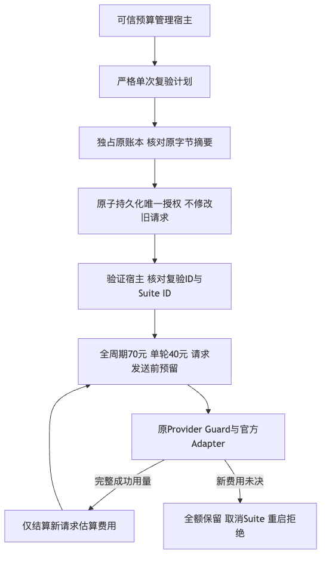
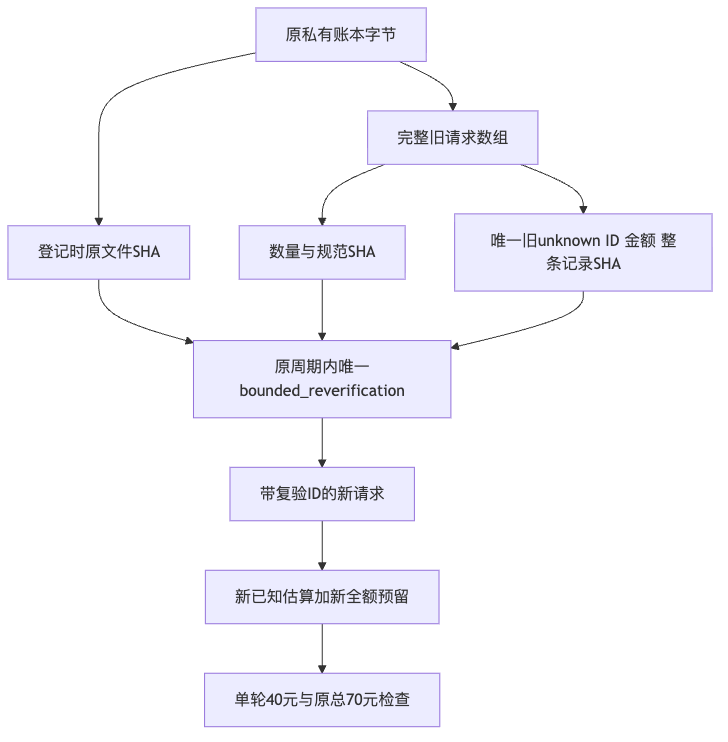
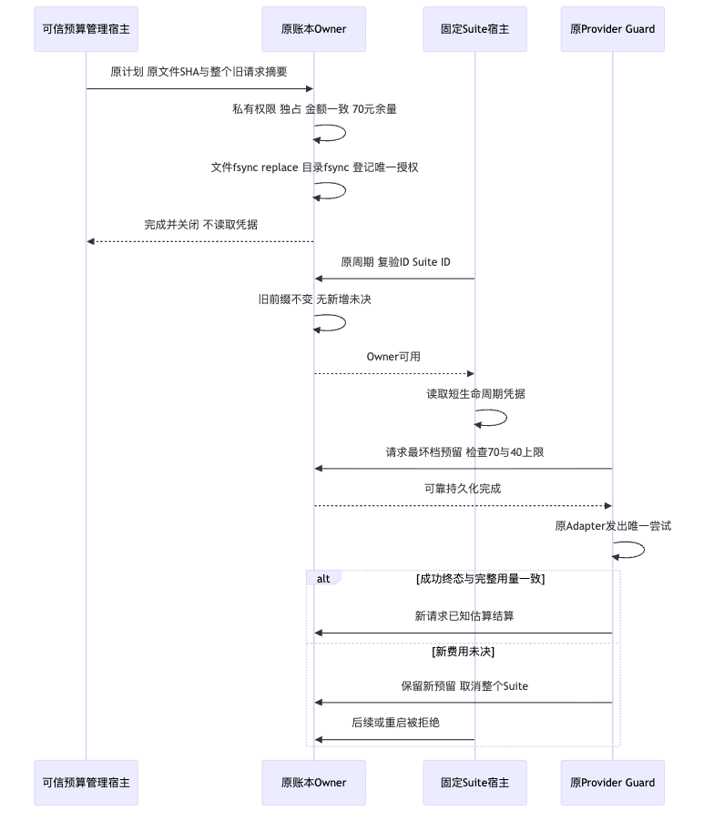

# R3 单次有界复验预算验证资料

## 1. 范围与结果边界

本专项实现[预算详细设计](../../changes/m09-r3-bounded-reverification-budget.md)的原周期唯一Suite授权。
旧请求完整前缀及20.77824元unknown预留不修改，默认路径未决即停不改变，新unknown或reserved停止且重启拒绝。
单轮新增已知估算和全部预留上限40元；原70元总分配保持。管理入口不读取凭据、不联网。
正式产品、20 Trial门槛与原完整0/20不改变；本专项不关闭R3或商用门禁。

## 2. 实际验证

最终测试、原件摘要和边界检查由[事实](facts.json)、[Verification](verification.json)、
[Review Packet](review-packet.json)和[Manifest](manifest.json)绑定。

| 运行 | 实际结果 | 范围 |
|---|---|---|
| 原专项基线 | 56通过 | 变更前原预算与宿主 |
| 完整专项 | 95通过 | 旧56、新范围/管理/硬退出/实际Adapter负对照 |
| 关联第一次 | 1403通过、1失败、19跳过 | Eval/Models/Tools/Governance，保留原文件权限失败 |
| 关联最终 | 1406通过、19跳过 | 原相同选择，正常测试umask；不是全仓功能回归 |
| 显式同Engine容器前置 | 6通过，16.246秒 | 原真实Container及录制Task Pack v1；不是模型质量 |

各组重叠，不相加为覆盖率。代码检查Ruff通过、1371文件格式通过、402产品源码和5验证宿主脚本类型检查通过；
原可读性规则与报告未变。三个图实际渲染并逐幅检查。产品源码、Schema、依赖及数据库格式不变。
测试使用自有0600账本、录制Provider与实际官方Adapter的MockTransport，不调用供应商付费服务。
早期类型检查错误与所有测试运行分别归档，不用最后一份通过结果覆盖先前失败。
第一次关联运行的私有文件umask使旧测试夹具成为0600，正式交付器严格要求0644/0755；
原交付器和原测试源文件字节未变，独立创建负对照证明077→0600、022→0644。最终正常测试环境复验通过，
没有改源码、放宽权限或修改评分器。相关原件SHA可在facts核对。

原实际账本在本专项结束时未改：61个已结算、1个unknown，已知估算1.522724元、未知预留20.77824元，
分配70.00保持。这里的0新增真实请求仅指离线机制切片，后续实际授权和新Suite结果必须单独归档。

## 3. 流程、数据与时序

## 4. 风险与剩余工作

计划是可信宿主审计合同，不是数字签名或对不可信调用方的权限平台。
原unknown仍未知；授权登记不结算原费用、不增加额度、不代表供应商账单确认。
真实完整Suite、默认Docker Desktop路径、消费者Windows11、独立Beta与同候选发布仍需独立验收。
