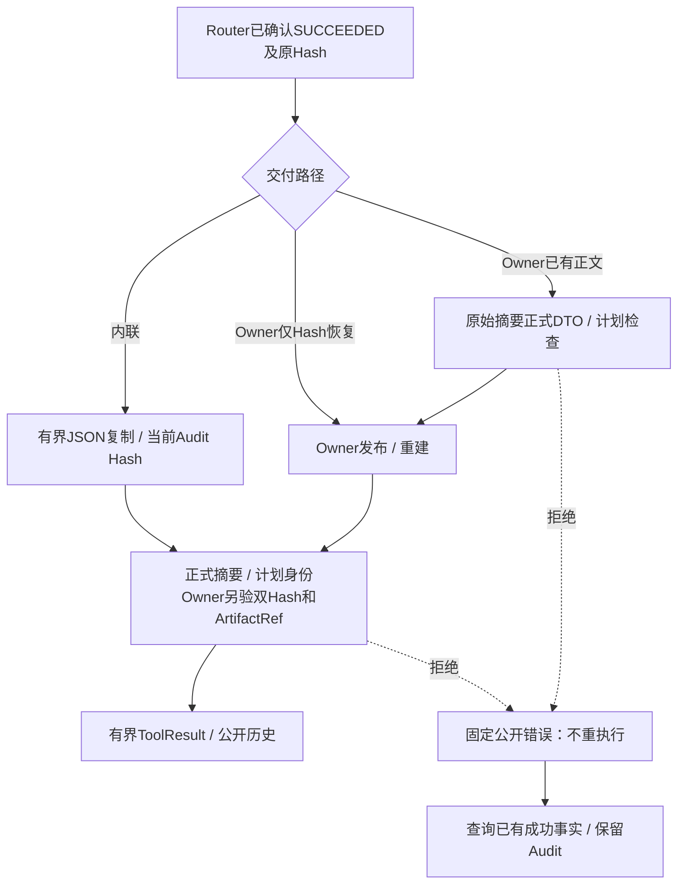

# 正式来源成功合同与内联投影验收报告

## 1. 实现、验收与完整范围

实现Revision：`1a7a6f05ecbdf1ec7d0182e2ed4951fb2c100f1c`。
完整回归测试树：`6f6b5d2e955110ef698355081d17a6863a67b579`，Git Tree `b922cb384d88ccb2283c9cc0eef0bc2a6c6f78be`。
[完整详细设计](../../changes/m09-4a-builtin-success-contracts.md)包含需求、源码研究、架构、流程、时序、
数据流、字段、接口、伪代码、失败/取消/超时/恢复、可观测性、安全、部署及完整测试矩阵。

专项 **167 passed，5.65秒**，包含119新增和48原Owner测试；相关798 passed在最终纯合同注释及
格式调整前运行。稳定测试树完整回归 **4550 passed、32 skipped，381.87秒，exit=0**；
运行期间未修改任何跟踪输入，未跟踪攻击草稿明确排除。生产源码、Schema、脚本、基线及政策
与实现Revision相同，测试树另包含两项证据治理新增用例。专项与相关结果均不与完整回归相加。

已实现正式来源（Patch/Git/Process/Eval/MCP/Skill）的内联及Owner成功摘要字段/计划检查，
内联独立预算、当前Audit Hash、取消及后置期限，已有摘要在Owner工件发布前检查。纯DTO共用，
原公开导入和四个既有Schema不变，没有新增包依赖/环或放宽可读性门禁。

**custom成功JSON和Secret端到端公开授权未关闭，整个0.9.4a及0.9未完成。**
本专项不替代Owner真实效果、内部预算、实际MCP捕获Schema/Secret处理、工件所属域、许可证、
TM编号攻击、远端MCP、三平台实际安装/Beta或真实Provider发布证据。真实模型请求为0，无新增定时任务。

## 2. 独立旧版负例

在独立`9ffbb846e63f10cb8c22dbea8ec2abe3a877c3cf`的git archive中复制50项合同边界测试，先打印
并核实agent_gateway_output来自归档，再运行pytest：**35 failed、15 passed，1.16秒，exit=1**。
失败为未拒绝额外字段、错误身份、缺字段或标量；不是构造、导入或审批错误。既有Owner标量拒绝
与正式正例原本能通过，不计作新修复。整改后50项全部通过。

独立旧版回放和专项都属于合同边界；Synthetic Executor未执行实际Git Push或MCP远程效果。
既有真实Delivery/Skill/MCP/Product回归独立保留，不能将夹具Hash一致当作全部生产业务验收。

## 3. 公开流程、效果与恢复

失败发生在Audit确认之后，不能改写效果、清空真实Owner事实或再次Execute/Reconcile。实际无Owner
Runtime在故障终结时查询SUCCEEDED，补无正文的成功效果元数据，Turn以固定投影错误FAILED。
批准写调用也不被误标为未知效果；这与Owner持续重建失败的既有补偿语义不同。

## 4. 用例与源码追踪

| 用例 | 证明的范围 |
|---|---|
| [50项来源矩阵](../../../tests/trusted_actions/test_builtin_success_contracts.py) | 五来源×五正文×内联/Owner；同Audit Hash下仍验证Schema和身份；已有错误摘要不调用Owner发布。 |
| [96项Process/Eval](../../../tests/trusted_actions/test_process_success_projection.py) | 原48项Owner矩阵保留，增加48内联；Profile/UUID/终态/退出码/passed；恢复重建同一合同。 |
| [6项实际Runtime](../../../tests/trusted_actions/test_builtin_success_runtime.py) | 只读/批准写×三错误正文，实际Session、Scripted请求历史、Audit、Protocol SDK、非空OTel；无第二次模型请求，已确认成功和Operation不变。 |
| [7项内联生命周期](../../../tests/trusted_actions/test_inline_success_lifecycle.py) | 两模块一致控制时钟越限、Token/父Task取消、最后Audit Hash/状态/缺Hash与独立副本；不是硬终止或RSS证据。 |
| [8项纯合同](../../../tests/execution/test_public_tool_contracts.py) | 同一类的原路径别名、四个既有冻结Schema相同、六种入口各自新Python进程导入，无导入顺序依赖。 |

[共享DTO](../../../src/harnessix/execution/public_tool_contracts.py)不导入任何Executor或装配入口；
[来源专属检查](../../../src/harnessix/trusted_actions/builtin_success.py)不推断正文自报权限；
[内联/Owner生命周期](../../../src/harnessix/trusted_actions/agent_gateway_output.py)复用预算和CancelToken；
[来源及Process/Eval语义](../../../src/harnessix/trusted_actions/public_outcomes.py)提供统一固定错误。

## 5. 发行物与供应链

Wheel和sdist从实现Revision的干净git archive离线构建，成员数、原字节Hash及安全草稿排除见
[contract-facts](contract-facts.json)。实际扫描2294个输入完整覆盖、固定六规则零命中；不声明位级
可复现或许可证通过。许可证检查仍exit=1，12件Archive阻断，没有改动拒绝策略。

Mypy 334源文件、Ruff、合同、原Schema、共享别名、可读性依赖门禁、SBOM与Secret自检通过。
文档门禁通过：300份文档、7959条链接、725幅Mermaid、26个源码包；变化文档已实际渲染，
详细设计4图和报告1图已目视检查。稳定测试树完整回归已通过，冻结后仅更新文档/JSON证据，
证据治理与文档门禁再复核；未跟踪攻击草稿不提交、不计TM。32项跳过不计作平台验收通过。

## 6. 开放风险、CI与复核

两个实际离线Runtime观察再次证明custom的合法174字节诊断正文仍进入Model/Session/Protocol；
Audit只保存摘要，非空Telemetry未出现诊断。每场景Execute=1、Reconcile=0、Output回调=0、
Scripted请求=2，真实模型请求=0；观察不是通过验收，也不宣称泄漏真实凭据或已声明Secret Binding。
正式来源DTO校验不替代这项通用扩展字段授权与迁移，Secret端到端公开权限仍须单独证明。

前序9ffbb84的[CI 36308902889](https://github.com/carrie1988/Harnessix/actions/runs/36308902889)
状态见[CI观察](ci-observation.json)，不作为本次共享DTO/内联合同验收。冻结时尚未推送当前版本，
CI为not_started_at_freeze；推送后后台观察，不逐提交等待、重启或重复触发。`make check`不标记通过。

同目录保存[Verification](verification.json)、[合同事实](contract-facts.json)、[Review Packet](review-packet.json)、
[Manifest](bundle-manifest.json)和CI观察。Manifest排除自身，绑定5份原字节文件和固定Revision源码输入；
后续CI终态新增独立版本证据，不改写旧冻结报告。
