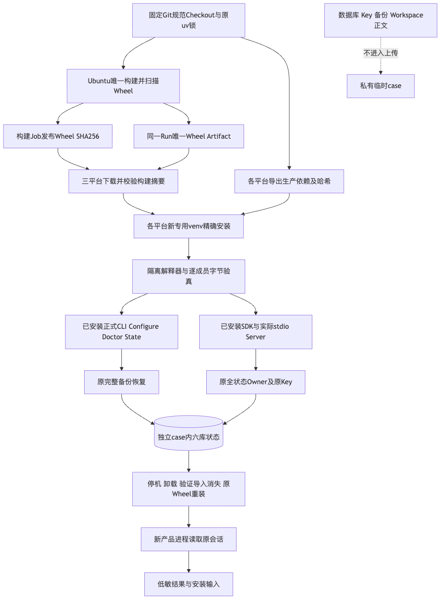
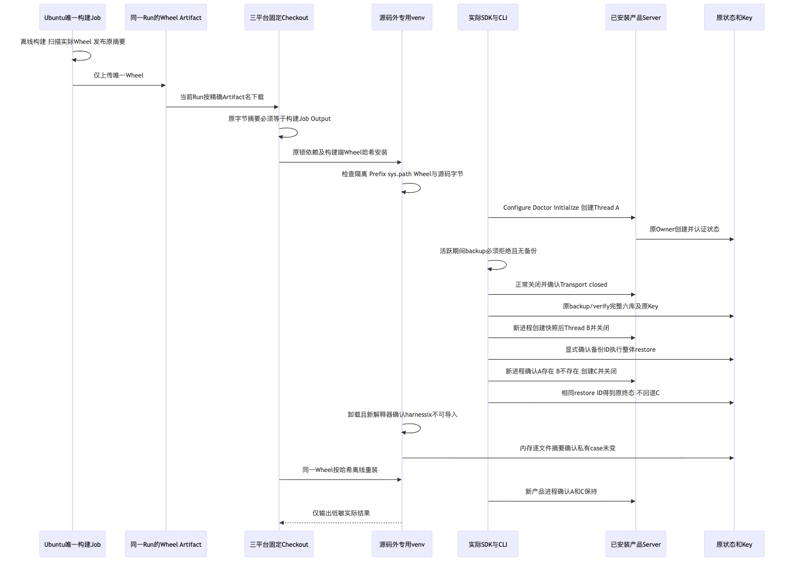

# 规范Wheel三平台安装、完整恢复与卸载重装验证报告

## 1. 摘要、需求背景与结论

固定实现为`a4f7f33449bb897d84fe3a8e8262307943233fb4`，包版本仍为`0.1.0`。
此前三平台分别构建Wheel，虽然生命周期通过，Windows摘要却不同；不能合并为同一发行物验收。
本次以一个Ubuntu构建Job提供原Wheel及SHA256，三个原生消费者在安装前核对其摘要，
随后执行原正式CLI、SDK及stdio Server完整生命周期，没有第二次构建或源码运行降级。

**规范发行物三平台生命周期专项GO；商用发布NO-GO。**
唯一构建与三个安装Job均为成功终态，实际Wheel、三份结果及pip输入摘要一致。
本次不证明版本升级、消费者Windows11、完整编码任务、独立Beta或可复现构建。
这些仍由各自发布门禁验收，不从无模型安装场景外推。

[verification.json](verification.json)、[Review Packet](review-packet.json)与
[manifest.json](manifest.json)分别记录断言、风险和原字节集合；历史失败及旧交付件保持冻结。

## 2. 总体架构、数据流与源码映射

唯一构建Job使用原锁和规范Checkout离线构建，再对实际Wheel及Git输入完成Secret扫描。
构建端摘要以Job Output传递；Artifact名包含Revision、Run ID与Attempt。
消费者只从同一Run下载精确名称的Artifact，原字节与构建端摘要不一致时不得生成pip安装输入。
安装依赖仍从原锁导出，各平台Marker按各自环境生效，不重新解析浮动依赖。

规范Checkout仅在该步骤设置`core.autocrlf=false`、`core.eol=lf`的进程级Git配置。
这不修改用户全局设置，不重写冻结`-text`原件，也不把旧Windows摘要差异追认为换行符原因。
安装解释器仍核对隔离标志、专用venv、源Revision以及432件包文件的安装/Wheel/源码字节。
运行目录在源码之外，源码既不进入`sys.path`，也不作为卸载目标。

正式[工作流](../../../.github/workflows/installed-product-acceptance.yml)、
[完整验收器](../../../scripts/installed_product_acceptance.py)、
[正反例](../../../tests/governance/test_installed_product_acceptance.py)及
[总体与详细设计](../../changes/m09-r4-installed-product-acceptance.md)
说明接口、字段、业务伪代码、期限和失败边界。产品复用原
[组合根](../../../src/harnessix/product_config/server.py)、
[SDK](../../../src/harnessix/sdk/agent_client.py)、
[备份](../../../src/harnessix/product_config/state_backup.py)及
[恢复](../../../src/harnessix/product_config/state_restore.py)，产品源码和状态合同未改变。

## 3. 实际执行时序与持久化

1. Ubuntu构建/扫描唯一Wheel，只上传Wheel；三个消费者下载并核对构建端摘要。
2. 原锁依赖与该Wheel安装到源码外新venv，隔离解释器验证实际安装包及固定源码。
3. 原Configure/Doctor和SDK初始化，创建Thread A；State由正式产品创建，不由夹具预建ACL。
4. Server活跃时原backup拒绝且备份目录不存在；关闭后完整备份/验真六库及原Key共7件文件。
5. 新进程创建Thread B并停机；以原备份ID及显式restore ID整体恢复，原Root保留。
6. 新进程证明A恢复、B消失并创建C；同restore ID再次执行得到原终态，不回退C。
7. 全部Transport关闭后，只在内存对自有case取快照；指定venv卸载，新的隔离解释器确认无法导入。
8. Key、库、备份、Workspace字节保持；同一Wheel按哈希离线重装，新Server读取A和C。

原耐久Journal、认证及稳定restore ID负责恢复事实；本验收不直调Store补造成功。
数据库、Key、快照摘要及业务正文不公开；三平台仅保留原七件低敏文件。

## 4. 固定Run、原生环境与规范制品身份

[正式Run 36463822741](https://github.com/carrie1988/Harnessix/actions/runs/36463822741)
绑定同一固定源码，四个Job均为`completed/success`，见[权威摘要](facts/acceptance-ci.json)。

| Job | 实际环境 | Handle | 结果 |
|---|---|---:|---|
| 唯一构建 | Ubuntu，Git2.55.0 | 109068770784 | SUCCESS |
| Linux安装 | Ubuntu24.04 x86_64，Python3.12.3，Git2.55.0 | 109068886127 | SUCCESS |
| macOS安装 | macOS26 ARM64，Python3.12.10，Git2.55.0 | 109068886110 | SUCCESS |
| Windows安装 | Windows Server2025 AMD64，Python3.12.10，Git2.55.0.windows.5 | 109068886317 | SUCCESS |

实际原始日志：[构建](logs/builder-canonical-job.log)、[Linux](logs/linux-canonical-job.log)、
[macOS](logs/macos-canonical-job.log)、[Windows](logs/windows-canonical-job.log)。
Windows Server原生测试不是Windows11消费者支持声明。

规范Wheel为1,073,485字节，其原字节SHA256：
`5a6e144487dd79679f609b709743db176ee28bdca077084ac8901efdc9f2fe30`。
[来源身份](facts/canonical-wheel-identity.json)区分Artifact ZIP摘要与Wheel摘要，不能混用。
下载Wheel与[已保留原件](../windows-private-state-2026-09-28-v1/artifacts/harnessix-0.1.0-py3-none-any.whl)
逐字相同，复用该原件而不重复归档；实际来源仍为本次构建和同Run下载，而不是旧文件名推导。

[Linux结果](raw/linux/result.json)、[macOS结果](raw/macos/result.json)、
[Windows结果](raw/windows/result.json)及各自`wheel-requirement.txt`全部使用上述构建端摘要。
每平台安装及源码文件各432件，原完整备份7件，全部必须业务断言为true。
`provider_turn_requests=0`、`commercial_release=false`，原`not_proven`边界保持。
实际构建Secret扫描**2934个输入完整覆盖、固定规则零命中**；这不是全部安全或商业权利证明。

## 5. 回归、原始失败与Git环境取舍

| 验证范围 | 实际结果 | 结论边界 |
|---|---:|---|
| 新工作流契约在旧工作流上的红例 | 4项FAIL | 唯一构建、来源摘要及规范Checkout入口当时缺失；[原件](logs/workflow-red.log)保留 |
| 本地Python3.12.7 / Git2.53.0 | 15通过 | 安装证据与实际工作流Python段正反例 |
| 本地Python3.13.8 / Git2.53.0 | 15通过 | 同范围环境对照，不与前一组求和 |
| 干净受管Checkout治理回归 | 276通过，24.30秒 | 原扫描/库存/文档/安装边界相关回归，不是全功能测试 |
| 全库格式/Lint | 1295文件已格式化，Lint通过 | 主工作树非受管目录不参与 |
| 变化文档实际渲染 | 通过，图示已目视复核 | 不是仅语法检查；[门禁原件](logs/documentation-render.log)保留 |

[双Python](logs/workflow-green-312.log) / [另一环境](logs/workflow-green-313.log)、
[治理](logs/governance-green-312.log)、[格式](logs/full-format.log)及[Lint](logs/full-lint.log)
保持实际日志字节。重复的三平台15项相同边界用例不相加为45项独立功能。
交付资料补齐后的[治理复验](logs/final-governance-green-312.log)为276通过，24.20秒；
[文档最终渲染](logs/final-documentation-render.log)同样通过，不与之前重叠范围求和。

本机默认Apple Git2.24.3不支持所需环境配置接口，原
[环境控制FAIL](logs/git-224-control-fail.log)保留；改用现有Git2.53.0后同一测试通过。
没有改用户全局设置或降低产品Git版本边界；该规范Checkout接口属于CI构建验收要求。
[Git官方配置契约](https://git-scm.com/docs/git-config#Documentation/git-config.txt-GITCONFIGCOUNT)
说明环境配置覆盖文件配置，显式命令行`-c`仍优先。

## 6. 常规源码CI与历史失败

前继`101f71e`的两个LinuxJob分别完成**5670通过、112跳过**，最后许可步骤仍拒绝12件Archive：
[Python3.12原件](logs/source-101f71e-python312.log)、[Python3.13原件](logs/source-101f71e-python313.log)。
这两份Job的完整结论是FAIL，不能把功能通过改写为全门禁通过。
当前`a4f7f33`的两个LinuxJob各完成**5674通过、112跳过**，终态同样仅在最后许可步骤失败：
[Python3.12原件](logs/source-a4f7f33-python312.log)、[Python3.13原件](logs/source-a4f7f33-python313.log)。
macOS、Container及Documentation为SUCCESS，Windows完整功能Job仍有具体活跃句柄，未取得终态。
[前继观察](facts/source-101f71e-ci-observation.json)及
[当前源码候选观察](facts/source-a4f7f33-ci-observation.json)只报告各自实际状态，
活跃Job不能从运行时长或观察超时推导为成功、失败或已停止。
本次规范安装Run的SUCCESS也不能替代常规源码CI或R1～R6。

[新交付初次Git/Wheel扫描](logs/source-and-wheel-secret-scan.log)在原52件Manifest资料阶段完成
3007个输入完整覆盖、固定规则零命中；其后补入的原日志仍须在最终提交前完整扫描。
扫描本身保留固定范围，不以次数或输入数量推导全部安全问题已解决。

旧[独立构建三平台结果](../installed-product-three-platform-2026-09-29-v1/README.md)不修改；
旧认证重启增长FAIL及历史严格0/20保持原判定。许可证保持低优先并行，不阻挡功能研发及内部验证。

## 7. 真实评测环境只读诊断与未证明边界

[固定镜像清单观察](facts/registry-metadata-observation.json)完成两份原镜像的匿名Registry握手，
得到200清单，响应头和实际清单原字节摘要都匹配原Digest，包含linux/arm64及linux/amd64。
匿名临时Token只驻内存，不进入交付件。HTTP语义依据
[Distribution正式接口](https://distribution.github.io/distribution/spec/api/)。
这排除本次观察中的清单不存在，**不能证明本机Docker已缓存或可以执行镜像**。

[宿主网络对照](facts/registry-route-control.json)中，当前代理和显式无代理均得到预期401。
[Docker客户端对照](facts/client-manifest-comparison.json)却都为EOF；
实际Engine首次固定Digest拉取也为[EOF](logs/python-fixed-pull.log)，镜像未缓存。
不能据此把EOF排他归因于未配置代理、镜像Digest或API Key。
[仅客户端进程的TLS控制](facts/client-tls-control.json)同样未解决EOF，不作全局TLS配置修改。

[环境边界](facts/environment-boundaries.json)记录Docker28.3.2/Go1.24.5及8个运行中容器；
未重启Docker、未修改其配置或代理，没有打断已有容器。
远程环境的已有SSH密钥预检未通过，未部署或读取模型凭据。
本次没有真实模型请求、API验证费用或预算账本创建/重置；原费用周期及未决金额仍须核验。
网络诊断不替代真实编码成绩，也不修改原Task Pack、Grader或发布阈值。

## 8. 失败、取消、恢复与证据安全

构建/扫描失败不发布Wheel；缺失Artifact、多Wheel或SHA漂移在安装前失败关闭。
四个Job各15分钟，原CLI/SDK仍保持60/30秒期限，无自动重试。
每次只创建新的私有case，既有夹具不删除后重跑；所有Transport按原finally收敛。
安装Job只能上传原七件固定文件，不能上传case目录、DB、Key、备份或业务正文。
任何失败或结果缺失都不生成新的成功事实；原报告与失败结果不能被本次专项覆盖。

## 9. 复验方法与剩余发布工作

在固定Ref触发原工作流，核对实际40位Revision、Run/Attempt、唯一构建Job和三个消费者终态；
下载精确Artifact，独立重算Wheel SHA，核对三份安装结果及输入摘要，最后验证本目录Manifest。
脚本、依赖导出和新的运行根都须来自相同候选；不能复用旧case、拼接其他Run或以Artifact ZIP摘要代替Wheel摘要。

- R1：正式入口安全、复杂业务状态恢复及当前认证状态500 Thread增长FAIL仍须收口。
- R3：原固定镜像可执行环境、原费用账本及新的完整真实评测；严格成功及必需测试至少12/20。
- R4：消费者目标OS、完整原生编码闭环及认证候选版本升级/回退。
- R5：3～5名独立开发者、至少15任务及三平台使用；未处置P0/P1不得发布。
- R2/R6：12件许可和商业权利低优先并行；同候选必要门禁、1.0版本及制品正式封板仍未完成。

本专项关闭“同一规范Wheel三平台生命周期”证据缺口，不关闭R4整体或商用发布目标。
