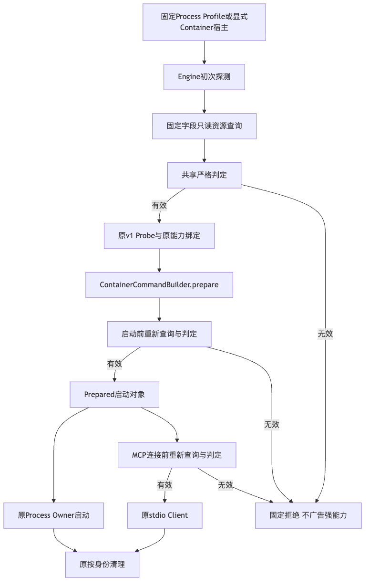
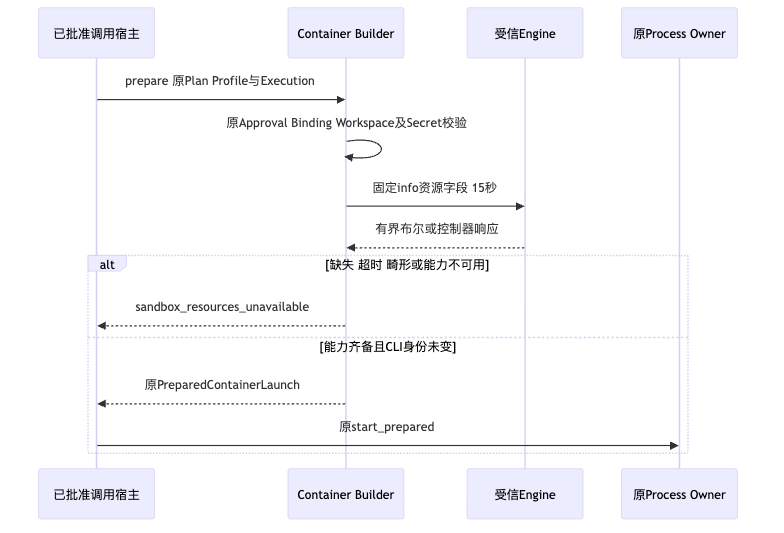
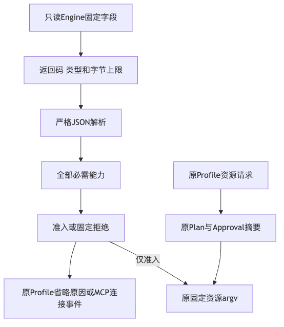

# Container资源准入、真实引擎及同候选三平台生命周期验收

## 1. 结论与范围

固定源码`753d6a82ec3fbd1f30f065703684a8e9869fe8f0`完成资源准入、启动前复核、Profile省略及MCP取消结算。
本机实际Docker探测、Linux真实Container集成、双Python回归及同一新Wheel三平台安装生命周期专项通过。
**组件专项通过，商用发布仍为NO_GO，R1～R6均继续开放。**

本包保留原始失败、正式日志、三平台各七件低敏原件、规范Wheel、结构化核验、Review Packet及Manifest。
历史0/20真实编码成绩、旧认证容量FAIL、许可拒绝及旧冻结报告不被覆盖，不把Scripted Provider当作真实API。

## 2. 需求背景、总体架构与源码

旧Engine探测只验证版本及安全选项，无法拒绝缺少内存、CPU CFS或PIDs机制的宿主。
参数包含资源限制不代表限制可落实。新准入只查询固定字段，初次探测与每次准备均验证必需机制；
MCP在创建Client前复核缓存Prepared对象，父取消结算原只读工作，资源失效不阻断原标签清理。

**架构说明：** 初次有效探测产生原Probe；Builder检查原Plan、Approval、Workspace及Secret之后重新验证资源，
才能返回Prepared对象。Process Owner直接使用该对象；MCP后续连接再复核一次。任一路径拒绝都不能新建
工作负载或自动回退Host。清理仍由既有Owner/标签绑定执行。

完整[总体与详细设计](../../changes/m09-r1-container-resource-admission.md)提供字段、接口、类设计、伪代码、
持久化、错误分类和取舍。生产映射为：

- [`capabilities.py`](../../../src/harnessix/sandbox/capabilities.py)：固定查询及Docker/Podman严格判定；
- [`container.py`](../../../src/harnessix/sandbox/container.py)：CLI身份、有界控制IO、每次Prepare实时复核；
- [`startup.py`](../../../src/harnessix/mcp/startup.py)：规范类型选择、Client前准入、唯一只读Probe取消结算；
- [`process_profile.py`](../../../src/harnessix/product_config/process_profile.py)：Doctor/装配省略原因，不广告不可执行Tool。

## 3. 时序、数据流程与持久化

**时序说明：** 原授权及参数先校验；查询前后复核CLI身份，全部机制有效才返回原启动对象。
缺失、超时、非零、格式或字节越界均固定拒绝，不重试；资源检查不是原子info/run，也不证明恶意Daemon可信。

**数据说明：** Engine原始正文只驻当前调用，不存整份info、宿主路径或代理配置。
原Probe、Plan、Profile、Approval和Migration不新增字段；原MCP Store保存固定失败码。
父取消等待原只读查询结算，不创建Client，不补造新的成功事实。

## 4. 测试与原始失败

| 范围 | 实际结果 | 原件 |
|---|---|---|
| 修复前资源负对照 | 23失败，证明旧实现不查询资源 | [原失败](logs/red-resource-admission.log) |
| 焦点功能 | 140通过、1跳过 | [日志](logs/functional-green.log) |
| 本地Python3.12完整回归 | 5724通过、105跳过，492.64秒 | [完整日志](logs/full-python312-final.log) |
| Python3.13受影响范围 | 1404通过、29跳过，78.50秒 | [日志](logs/affected-python313-final.log) |
| 生成报告与重复取消回归 | 15通过 | [日志](logs/readability-and-cancel-green.log) |
| Linux真实Container集成 | 17通过，无跳过 | [实际Job日志](logs/container-ci-job.log) |
| 同Job离线工程Suite | 20/20；Scripted Provider 120请求 | 同上；不是真实模型成绩 |

新测试覆盖Docker四项逐一缺失、严格类型、缺失/超大/非法响应，Podman版本与控制器拒绝，
超时不重试、资源失效后不启动Owner、Profile在镜像/Secret之前省略、MCP类型标签绕过及重复取消。
Linux集成必须读取Memory/PIDs及CPU Period/Quota值，缺文件不再跳过成功；CPU不是吞吐Throttle基准。

原完整回归的生成报告失败保留于[3.12日志](logs/full-python312.log)、
[3.13原日志](logs/affected-python313.log)及[额外字段失败](logs/affected-python313-green.log)。
最终报告只按生成器默认接口重生成，不携带额外source_revision字段；策略、测例和阈值没有放宽。

[文档及真实Mermaid渲染](logs/documentation-render-final.log)、
[Ruff检查](logs/ruff-check.log)、[格式检查](logs/ruff-format.log)、
[制品构建](logs/build.log)、[Secret扫描](logs/secret-scan.log)保留各自范围。
构建期Secret扫描2997个输入完整覆盖且零命中，不代表全部安全审查通过。
原[12件许可拒绝](logs/license-scan.log)保持，许可治理低优先并行但正式发行前仍须处置。

## 5. 实际引擎与环境边界

[本机事实](facts/actual-local-probe.json)来自Docker28.3.2的原默认Probe及Builder实时检查，不是模拟返回值。
本机没有创建Container；Linux实际隔离来自
[CI 36472589223](https://github.com/carrie1988/Harnessix/actions/runs/36472589223)的Container Job `109098278042`。

[远程内核预检](facts/remote-kernel-preflight.json)实际只有cpuset/cpu/io/pids，没有memory及memory.max，且未安装Docker。
这是内核能力负事实，**不是远程Docker拒绝实机验证**。没有修改启动项、重启、部署Daemon或读取模型凭据。
该环境在修复内存控制器或更换宿主之前不作为受限编码评测环境。
Podman只有适配器回归，不宣称实机认证；macOS/Windows完整强Container发行也未被本专项证明。

## 6. 同一新Wheel三平台生命周期

[实际Run 36472999447](https://github.com/carrie1988/Harnessix/actions/runs/36472999447)四个Job均为SUCCESS，
见[权威摘要](facts/installed-ci.json)。

| Job | Handle | 原结果 |
|---|---:|---|
| 唯一构建 | 109099691699 | [构建日志](logs/installed-job-109099691699.log) |
| Linux安装/恢复 | 109099895473 | [原结果](raw/linux/result.json) |
| macOS安装/恢复 | 109099895603 | [原结果](raw/macos/result.json) |
| Windows安装/恢复 | 109099895691 | [原结果](raw/windows/result.json) |

规范[实际Wheel](artifacts/harnessix-0.1.0-py3-none-any.whl)为1,075,661字节，438个成员，其中433个包成员。
SHA256为`9db72b51007045396bfee0f1e7d88675f6c13002a3c444698884d9fb01a8318a`；
构建端、三份结果、各平台安装输入及本地构建原字节一致。
[制品身份](facts/wheel-identity.json)区分该Wheel与前一候选，不拼接旧结果。

原验收器验证源码外隔离安装、全部433件包文件、正式State创建、活跃Owner备份拒绝、六库及原Key七件完整备份、
恢复旧Thread/移除快照后Thread、原Root保留、相同restore ID不回退新状态、卸载后不可导入、原数据保留及同Wheel重装读取。
三份原结果均保留provider_turn_requests=0和commercial_release=false。
Windows Server不是Windows11消费者证明；同版本重装不是产品版本升级，not_proven全部原样保留。

## 7. CI快照、可观测性与退出条件

[源码CI快照](facts/source-ci.json)固定各Job的真实状态及失败步骤；后续状态变化不改写本包。
Linux3.13实际5717通过、112跳过后在许可步骤拒绝，见[原Job日志](logs/linux313-ci-job.log)。
Linux3.12同为5717通过、112跳过后在许可步骤拒绝，见[原Job日志](logs/linux312-ci-job.log)。
源码完整Windows门禁若仍在运行，只记录活动Handle，不提前判定通过，也不因观察超时重启。

资源查询逐命令15秒，无统一15秒总预算；公开错误固定为sandbox_resources_unavailable，Profile省略复用
profile_limits_unenforceable。错误正文不含原stderr。旧Capture Output先缓存后检查、磁盘Quota及Swap总量不是本次关闭项。

- R1：整体安全、复杂业务恢复及认证状态容量Profile仍开放。
- R3：真实评测环境、原费用账本及新的20 Trial质量运行仍开放；历史0/20保持。
- R4：消费者OS、完整真实编码及不同产品版本升级回退仍开放。
- R5：3～5名独立开发者及至少15个真实任务仍开放。
- R2/R6：权利及最终同候选封板仍开放，不因局部绿灯宣布1.0。

[结构化核验](verification.json)、[Review Packet](review-packet.json)及[Manifest](manifest.json)
用于独立复算。原低敏结果不可加工补造；Manifest核对全部原字节，排除自身。
