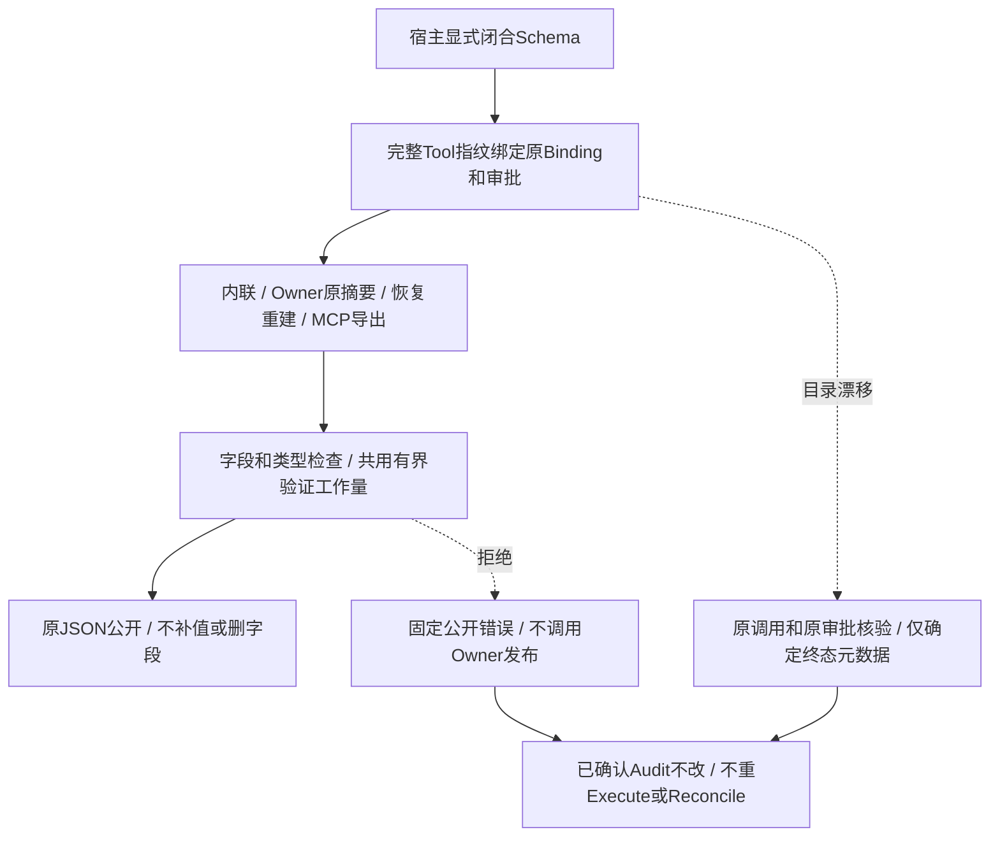

# 自定义Action成功正文公开合同验收报告

## 1. 实现与验收范围

实现Revision：`7adfa3ea86b3b3961e67df9140895e48f2aab8fc`。
[详细设计](../../changes/m09-4a-custom-success-contract.md)包含需求、源码研究、取舍、架构、流程、
时序、数据流、字段、接口、伪代码、持久化、异常、期限、取消、恢复、安全、部署与测试矩阵。

专项 **91 passed，1.92秒**，其中89新增、2项原MCP回归；相关回归 **631 passed，16.73秒**。
两者与完整回归重叠，不相加。稳定测试树完整回归尚待运行，不借用上一实现的4550项结果。
未跟踪攻击草稿不提交、不作为TM编号验收；真实模型请求0，无新增定时任务。

已实现当前Gateway及独立MCP公开出口的自定义成功**字段授权**，不宣称Secret值端到端安全、
历史Session正文追溯清理、Owner内部资源或整体0.9.4a/0.9完成。

## 2. 独立旧版负例与历史持久化

在独立`f7566bf0e594833bd10a1af7d9d8b51a098cfad9`归档中复制8项无合同矩阵，先打印并核实实际
Gateway模块路径，再运行pytest：**8 failed，0.23秒，exit=1**。失败为未拒绝公开正文或Owner
已经被调用，不是构造、导入或审批问题。当前版本同8项通过。

[旧二进制测试](../../../tests/trusted_actions/test_custom_success_legacy_binary.py)由实际旧归档
Python进程创建SQLite计划、原审批和Audit；新版本重开逐字比对原Tool JSON、Tool指纹、Plan JSON
与每条Audit JSON，结果为无正文成功元数据，Execute和Reconcile均不再调用。该Producer为合成
Executor，不替代真实外部写效果或三平台升级安装测试。

## 3. 公开流程与效果边界

Schema缺省不授权custom非空正文；所有对象闭合、数组和字符串有限界，引用/正则/任意关键词
不执行。新增Schema进入原完整描述指纹，旧null字段省略，Binding/Route/Audit和生成Schema不迁移。
正式来源DTO优先，外部Schema不能放宽内核规则。

Gateway在Owner发布前检查原摘要，恢复后检查重建合同、双Hash及ArtifactRef；MCP Server是独立
公开路径，实际低风险只读Client测试验证同一描述指纹和字段合同，不借用Gateway的Owner生命周期。
目录漂移只允许核验旧custom确定成功/失败效果，正文和Artifact能力不恢复；非终态不执行或对账。

## 4. 源码、用例与适用范围

| 用例 | 具体证据 |
|---|---|
| [45项纯合同](../../../tests/domain/test_public_output_schema.py) | 原生树、闭合/nullable/嵌套、严格类型、有限关键词、循环/引用/组合、预算与检查点。 |
| [8项无合同](../../../tests/trusted_actions/test_custom_success_authorization.py) | 只读/批准写×内联/Owner×诊断/标量；不合法原摘要不调用Owner，Audit与工作区不变。 |
| [25项授权与生命周期](../../../tests/trusted_actions/test_custom_success_schema.py) | 三种交付×六种形状、四种目录漂移恢复、控制时钟超时及Token/父Task取消。 |
| [6项实际Runtime](../../../tests/trusted_actions/test_custom_success_runtime.py) | SQLite Session、Scripted下一请求历史、实际SDK Protocol、非空OTel、Audit；拒绝时保留已确认成功效果而Turn FAILED，无第二次模型请求。 |
| [1项旧版持久化](../../../tests/trusted_actions/test_custom_success_legacy_binary.py) | 真实旧Python进程建库，原JSON/指纹/Audit重开及不重复执行。 |
| [4项MCP增量及2项原回归](../../../tests/mcp/test_server.py) | 实际低风险只读Client：无合同/额外字段/合法结果/错误描述Hash；不覆盖远端HTTP/OAuth。 |

[有限合同实现](../../../src/harnessix/domain/public_output_schema.py)不依赖Runtime或Executor；
[ToolDescriptor](../../../src/harnessix/domain/models.py)捕获独立Schema并保持旧序列化；
[公开语义](../../../src/harnessix/trusted_actions/public_outcomes.py)精确绑定完整描述；
[历史终态观察](../../../src/harnessix/trusted_actions/legacy_projection.py)不访问Executor/Owner；
[MCP Server](../../../src/harnessix/mcp/server.py)显式绑定完整导出描述。

## 5. 发行物、门禁与完整回归

从实现Revision的干净git archive离线构建Wheel和sdist，分别379与2286成员；原字节Hash及
安全草稿排除见[contract-facts](contract-facts.json)。实际Secret扫描2308个输入完整覆盖，固定六
规则零命中，不声明位级可复现或所有语义泄漏已关闭。许可证门禁仍 **exit=1、12件Archive阻断**，
原拒绝策略未放宽，make check不宣称通过。

Ruff格式/规则、Mypy 336源文件、生成合同、可读性/依赖门禁、SBOM与Secret自检通过；现有生成
Schema无漂移、无新增依赖或环。完整回归、图渲染、稳定树和冻结后治理检查在
[verification](verification.json)中登记实际结果，不以估算计数代替运行。

## 6. CI、开放风险与复核

当前实现CI冻结时尚未启动；[CI观察](ci-observation.json)中的f7566bf历史运行不作为当前验收，
也不逐提交等待后台CI。发布需要实际版本绑定终态，不取消失败作业或用本地结果替代平台证据。

字段合同仅决定哪些键和类型可以公开，允许字符串可能仍包含受保护Secret值。旧Session/公开
Artifact历史不追溯清理；Owner/Store内部资源与工件归属、其他扩展公开错误、12件许可权利链、
TM编号攻击、远端MCP身份/OAuth/出口、三平台真实安装/升级/卸载/Beta及真实Provider发布仍阻断。

复核材料集中于本目录：[Manifest](bundle-manifest.json)、[事实](contract-facts.json)、
[验证](verification.json)、[Review Packet](review-packet.json)、[CI观察](ci-observation.json)。
Manifest记录五个交付文件及实现Revision输入Hash，自身排除，旧冻结报告不回写或追认通过。
