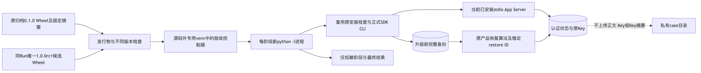
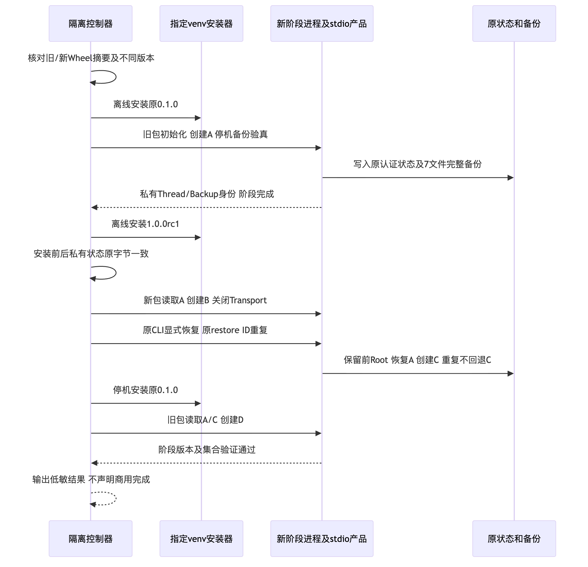
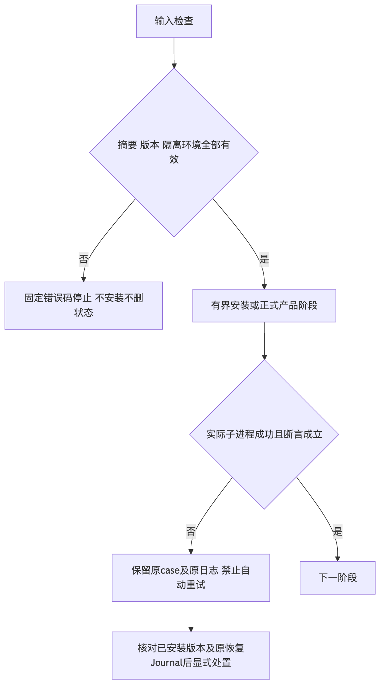

# 固定不同版本三平台停机升级、完整恢复与回退验证报告

## 1. 摘要、需求背景与结论

固定实现为`ec356aa1555d6ad712819f3e02e210493f7d3135`。既有安装验收全部使用`0.1.0`，
即使卸载重装通过，也不能证明不同版本兼容。本次使用实际已归档旧Wheel创建认证状态，
由当前`1.0.0rc1`Wheel读取和写入，经原完整备份恢复后再安装旧Wheel验证回退读写。
没有重新标记旧代码、第二套状态恢复算法或自动更新平台。

**固定版本对三平台升级/恢复/回退专项GO；R4整体及正式商用发布仍未关闭。**
唯一规范Wheel构建Job及三个原生消费者均为成功终态。三份升级结果与三份原生命周期结果
绑定同一Revision和同一候选Wheel摘要；数据库、Key和私有阶段身份不上传。
`1.0.0rc1`只表示内部预发行候选，没有正式稳定Tag或商用Release。

[verification.json](verification.json)、[Review Packet](review-packet.json)和
[manifest.json](manifest.json)分别提供断言、决策边界与原字节集合。
真实模型请求为0；不能从这些安装/状态结果推导消费者Windows11、完整编码质量或独立Beta通过。

## 2. 总体架构、数据流与源码边界

旧输入是原`0.1.0`归档Wheel和固定摘要；新输入来自唯一规范构建Job。
控制器在源码外专用venv内按精确哈希离线切换包。每个阶段重新启动隔离解释器，
复用原安装辅助模块、正式SDK、CLI和stdio Server，不在旧解释器中继续使用已缓存的新包或旧包。

两份驱动原字节必须等于指定Revision内原件；安装包与Wheel逐成员比较。
候选还须与固定源码的433件包文件一致；旧包安装的432件成员须等于原归档Wheel。
源码仅提供驱动及制品来源，不进入产品`sys.path`。私有case中的状态、Key与快照不进入上传白名单。

正式[升级控制器](../../../scripts/installed_product_upgrade_acceptance.py)、
[原验收辅助模块](../../../scripts/installed_product_acceptance.py)、
[唯一构建工作流](../../../.github/workflows/installed-product-acceptance.yml)、
[正反例](../../../tests/governance/test_installed_product_upgrade_acceptance.py)及
[完整详细设计](../../changes/m09-r4-different-version-upgrade.md)
说明接口、类、字段、业务伪代码、失败合同及安全边界。
生产恢复继续由[正式CLI](../../../src/harnessix/product_config/state_backup_cli.py)、
[原恢复协调器](../../../src/harnessix/product_config/state_restore.py)和原耐久Journal承担。

## 3. 实际时序与持久化

1. 检查专用venv、隔离解释器、固定源码、两份驱动及原Wheel身份；同版本或摘要错误先拒绝。
2. 停机安装原`0.1.0`。旧包实际SDK初始化并创建Thread A；活跃Owner拒绝备份。
3. 关闭Transport后由原CLI备份和验真六库及原Key，共7件文件。
4. 安装`1.0.0rc1`，安装前后整个自有case原文件集合与字节不变；新进程读取A并创建B。
5. 候选经正式CLI恢复升级前完整备份，保留此前Root；精确集合恢复为A，再创建C。
6. 相同restore ID及备份确认身份重复调用，返回原终态，不能回退C。
7. 停机重新安装原旧包，私有状态原字节不变；旧包读取A/C并创建D。
8. 原Key保持，Workspace Sentinel保持。只有全部断言通过后才生成公开成功结果。

所有Thread均由实际Server创建或读取，不直接修改数据库补造结果。
回退不是让旧包直接读取任意新状态，而是先恢复升级前整组备份，再安装旧包。
本版本对未增加生产Schema；不外推任意历史版本、依赖升级或跨机Key迁移能力。

## 4. 固定Run、原生环境与发行物身份

[成功Run 36517872201](https://github.com/carrie1988/Harnessix/actions/runs/36517872201)
绑定`ec356aa`，唯一构建及Linux、macOS、Windows三个消费者均为`completed/success`。
权威原件见[Run](facts/native-final-run.json)及[Artifact列表](facts/native-final-artifacts.json)。

| 平台 | 实际结果环境 | 升级阶段 | 原安装/恢复/卸载重装 |
|---|---|---|---|
| Linux | x86_64，Python3.12.3 | PASS | PASS |
| macOS | ARM64，Python3.12.10 | PASS | PASS |
| Windows | AMD64，Python3.12.10，原生CI Runner | PASS | PASS |

Windows CI宿主不是消费者Windows11认证环境；不能将平台字段`Windows`当作支持全部Windows版本。
原件位于[Linux](raw/final/linux/upgrade/result.json)、
[macOS](raw/final/macos/upgrade/result.json)及[Windows](raw/final/windows/upgrade/result.json)。

| 输入 | 原版本/来源 | SHA256 |
|---|---|---|
| 原旧Wheel | `0.1.0`，`a4f7f33449bb897d84fe3a8e8262307943233fb4` | `5a6e144487dd79679f609b709743db176ee28bdca077084ac8901efdc9f2fe30` |
| 当前唯一Wheel | `1.0.0rc1`，`ec356aa1555d6ad712819f3e02e210493f7d3135` | `60aa5d017712c49016b07dad661fec1168273944672a52c9ae88d2bcec31e6b0` |

新[实际Wheel](artifacts/harnessix-1.0.0rc1-py3-none-any.whl)由同一Run唯一构建；
消费者安装前核对构建端摘要，pip输入仍使用原摘要，不以下载者自己计算的值替代来源证明。
本机独立构建摘要与该规范Wheel一致，但一次一致观察不构成可复现构建认证。

## 5. 失败、恢复与历史事实

阶段期限180秒，超时不重试，不展开私有stdout。错误摘要、重复METADATA、错误发行物、
同版本、源码借用、非专用venv、脚本Revision漂移和不精确Thread集合均固定拒绝。
case不覆盖、不自动删除、不自动改ACL。控制器取消返回130且不写成功结果；
其单元测试不等于整个原生进程树取消验收。

首轮[Run 36517330074](https://github.com/carrie1988/Harnessix/actions/runs/36517330074)
绑定`1cda7ad`，Linux/macOS生命周期通过，Windows在新治理测试读档时失败，尚未执行该平台升级。
原失败是未指定UTF-8导致使用cp1252解码中文工作流；后继显式指定编码，
增加cp1252/UTF-8默认locale对照，不依赖全局UTF-8环境覆盖缺陷。
[原生失败日志](logs/native-initial-failed.log)和[本机复现](logs/windows-locale-red.log)保留原FAIL。

本机Apple Git的CRLF负对照失败亦保留，未修改全局Git设置或删除失败报告；
使用已提供Git2.53完成同一负对照及完整受影响回归。旧冻结交付件未重写。

## 6. 测试、制品和配置一致性验证

| 组别 | 固定来源/范围 | 实际结果 |
|---|---|---|
| Python3.12受影响回归 | `1cda7ad`；治理、SDK、完整备份/恢复 | 422通过 |
| Python3.13受影响回归 | 同一组同一实现 | 422通过 |
| locale修复焦点3.12 | `ec356aa`对应脚本/工作流合同 | 36通过 |
| locale修复焦点3.13 | 同一组同一修复 | 36通过 |
| 本机源码外实际升级 | `1cda7ad`，Darwin ARM64、Python3.12.7 | 四阶段及原Key/Workspace通过 |
| 三平台原生固定候选 | `ec356aa`，成功Run三消费者 | 安装、不同版本、恢复、回退通过 |

两组Python回归及焦点用例重叠，不能求和为全仓或三平台安全测试数量。
422项结果不是全部仓库测试，36项结果不是实际升级本身；真实生命周期由相应原件证明。
JUnit和原日志在`logs`，本机实际原件见[结果](raw/local/macos-arm64-result.json)。

实际Wheel及完整Git输入Secret扫描为3403件原输入完整覆盖、固定规则零命中，
可读性、协议Schema及文档合同检查通过。交付目录加入Git索引后，包含实际规范Wheel的
[独立Secret复验](logs/secret-scan-delivery.log)又完整覆盖3514件输入且固定规则零命中，
[文档合同检查](logs/docs-delivery.log)通过。交付原件禁用Git文本换行转换，
Manifest同时核对工作目录与实际Git索引字节；任何缺件、增件或摘要漂移均拒绝。

项目版本、原锁、SBOM及许可报告同步为内部RC；第三方777件锁定Archive身份未改变，
许可证据索引只重绑定实际新lock摘要，未修改证据Blob、决策或豁免政策。
原12件许可阻断保留，不能因RC版本标识宣布供应链或商用许可通过。

## 7. 隐私、费用与证据验真

使用非秘密Provider夹具引用和`provider.invalid`，模型Turn为0。
本专项不读取模型钥匙串，不修改70元费用周期。数据库、Key、Key摘要、私有阶段UUID、
Workspace正文和备份目录均不上传；仅收集CI指定低敏文件、安装输入和公开结果。

`verification.json`包含源输入原SHA；`manifest.json`列出本目录除自身之外每个原文件的大小和SHA256。
完整验证须先核对Manifest集合/字节，再核对Run终态、Revision、两份Wheel和三份四阶段断言。
不能以README中的PASS替代原件或以存在Artifact推导执行成功。

## 8. 未完成边界与后续必要任务

- R1：原安全控制、实际后端可达性及最终同候选恢复门禁继续开放。
- R2：原12件权利/发行输入阻断继续开放，内部验收不等于公开商用许可。
- R3：完整20 Trial真实编码质量尚无新通过成绩；原严格0/20保留。
- R4：本固定版本对专项关闭，消费者Windows11和原生完整编码闭环仍需验收。
- R5：3～5名独立开发者、至少15个实际任务及问题整改不能由自动化Job替代。
- R6：最终稳定版本须在同一最终候选完成必要门禁，再生成正式Tag、Release及支持声明。

内部RC不表示产品已达到大量C端用户商用上线条件；本报告只声明固定范围的真实验证结论。
