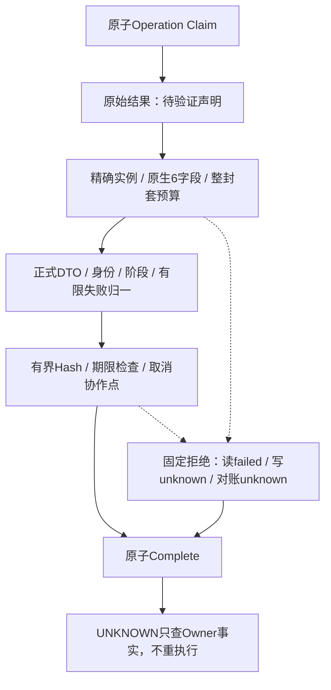

# 执行器原始返回合同与预算验收报告

## 1. 范围与状态

实现Revision：`7fd1187f07fa415ecf48211bc0149aff0d7a6191`。
[完整详细设计](../../changes/m09-4a-executor-output-budget.md)提供需求、源码研究、架构、流程、时序、
数据流、6字段头部、类/接口、9个有限码、伪代码、取消/事务/恢复及部署边界。

专项 **78 passed，1.30秒**；完整回归等待在稳定测试树上冻结。公开失败策略v2新增9个有限码，
v1计划、Binding、Audit及数据库Schema不变。本轮真实模型API请求为0，无新增定时任务。

本专项关闭原始返回的编码前资源检查及后置处理期限，不关闭整个0.9.4a/0.9。有效小型成功JSON
的公开权限、Owner/Store内部边界、不协作扩展隔离、许可12件、编号攻击、远端MCP、三平台实际
安装/Beta和实际Provider发布验收均仍开放。`make check`不标记通过。

## 2. 独立旧版负例

在前序`070efdc34c5ca6c13adc435ef8d1891482a2ecaf`的独立git archive复制本次24项负例，先验证
operation_router导入路径确实位于归档，再运行pytest：**24 failed，0.36秒，exit=1**。
结果是各读写/阶段未满足预期拒绝和分类，不是导入失败。整改后同组24项全部通过。

根因：返回实例先model_dump_json，无法阻断无界对象和扩展serializer；执行器await结束后，DTO
往返、归一和Hash没有进入原操作期限。新的头部/原生JSON预检先于通用编码，归一及摘要同时有
期限前后检查；返回后的取消协作点保证先持久固定终态再传播取消。

## 3. 作用域与权威边界



原始结果未通过完整合同之前，kind不是已经确认的Audit事实；写返回拒绝不能证明实际效果不存在。
已有Owner事实保留，Reconcile可以确认SUCCEEDED。与前序“已确认Audit后Owner投影失败”不同，
后者保留原SUCCEEDED，不改写效果。本层不能硬终止同步恶意代码，也不追溯撤销回调已有分配。

## 4. 测试事实

| 测试 | 已验证事实 | 不替代的证据 |
|---|---|---|
| [24项返回边界](../../../tests/trusted_actions/test_executor_output_boundaries.py) | 字节/节点/深度/整数、非法原生类型、循环、DTO子类、非法头部在编码前被拒绝；终态无正文/工件摘要，Operation完成 | 合成执行器不是全部真实Owner业务验收。 |
| [封套合同](../../../tests/trusted_actions/test_outcome_validation.py) | UUID和128-bit精度、独立JSON副本、头部长度/字段、无serializer、非法JSON、缺失/伪造拒绝原因默认关闭 | 不证明合法成功正文公开权限。 |
| [生命周期](../../../tests/trusted_actions/test_executor_output_lifecycle.py) | 单调时钟确定性跨越归一/Hash期限；父Task返回后取消仍记账并传播；真实文件追加一次和Store重开只对账 | 时钟控制不是RSS或硬杀证明。 |
| [真实子进程退出](../../../tests/trusted_actions/test_executor_output_lifecycle.py) | 执行器已追加并fsync，超预算已拒绝，在Complete之前实际exit=73；ACTIVE/RUNNING→Interrupt UNKNOWN→Reconcile SUCCEEDED；文件未追加第二次 | 非真实平台安装/Beta，Product双层Owner由既有回归独立覆盖。 |
| [实际Runtime公开面](../../../tests/trusted_actions/test_executor_output_runtime.py) | SQLite Session/Audit、实际Scripted请求历史、Protocol SDK回放、非空OTel Span/Metric；只读错误进入第二次历史，写未知不继续模型 | ScriptedProvider不是收费模型请求。 |

专项不与完整回归相加，相关688 passed/6 skipped在物理退出用例最终补充前运行，不称覆盖最后全部
新增代码。新增完整证据治理测试在最终完整回归前纳入稳定测试树；未跟踪攻击草稿不修改、不提交、不计TM。

## 5. 源码、文档及发行物

- [outcome_validation](../../../src/harnessix/trusted_actions/outcome_validation.py)：不调用返回实例的serializer，整个JSON封套先预算再DTO。
- [operation_router](../../../src/harnessix/trusted_actions/operation_router.py)：执行/对账共用后置验证，局部SHA异常后清空，取消在事务后传播。
- [public_errors](../../../src/harnessix/trusted_actions/public_errors.py)、[public_outcomes](../../../src/harnessix/trusted_actions/public_outcomes.py)：有限拒绝原因、9个固定码与v2恢复分类。
- [output_budget](../../../src/harnessix/trusted_actions/output_budget.py)：复用原生JSON预算，1MiB/64层/10256节点/128-bit及10秒，模型不可修改。

Ruff、Mypy 332源文件、合同、可读性、Task Pack、SBOM Schema/漂移、Secret自检均要求通过；图形需
实际渲染并目视检查。发行物来自实现Revision的干净git archive而非含草稿的工作树，Wheel/sdist
成员与Hash见[budget-facts](budget-facts.json)；不声明位级可复现或许可证通过。

## 6. CI与风险阻断

前序070efdc的[CI 36306666894](https://github.com/carrie1988/Harnessix/actions/runs/36306666894)
仅代表前序实现，不作为本次代码验收；其实际状态见[CI观察](ci-observation.json)。本次冻结时尚未
推送，当前CI为`not_started_at_freeze`，推送后后台跟踪，不逐提交等待或重复手动触发。

许可证检查仍exit=1，12件Archive阻断，拒绝策略未放宽。原始预算不是完整公开授权；Store和Owner
内部工作量、同步扩展隔离、TM编号攻击、远端MCP、实际安装/Beta与Provider发布证据仍须继续关闭。

## 7. 证据清单与复核

同目录保存[verification](verification.json)、[budget-facts](budget-facts.json)、[CI观察](ci-observation.json)、
[Review Packet](review-packet.json)、[Manifest](bundle-manifest.json)。清单排除自身，绑定5份文件原字节及
固定Revision源码输入；后续CI状态不改写这份冻结报告，应另行新增版本绑定证据。

```bash
uv run pytest --ignore=tests/security -q --tb=short -o addopts=''
uv run pytest tests/trusted_actions/test_executor_output_boundaries.py tests/trusted_actions/test_outcome_validation.py tests/trusted_actions/test_executor_output_lifecycle.py tests/trusted_actions/test_executor_output_runtime.py -q --tb=short -o addopts=''
uv run ruff format --check . --exclude tests/security
uv run ruff check . --exclude tests/security
uv run mypy src
uv run python scripts/readability_report.py --check --check-final-report --quiet
uv run python scripts/generate_specs.py --check
uv run python scripts/documentation_check.py
uv run python scripts/license_scan.py --check
```

许可证检查不吞退出码，不将普通单测或零命中扫描当作全部0.9完成证明。
