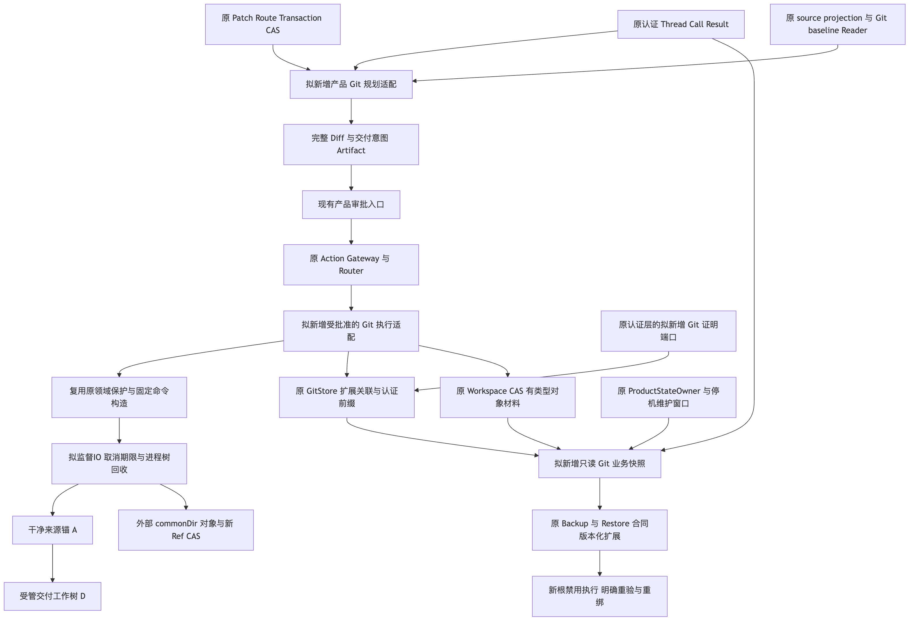
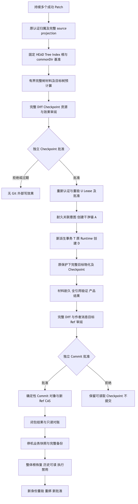
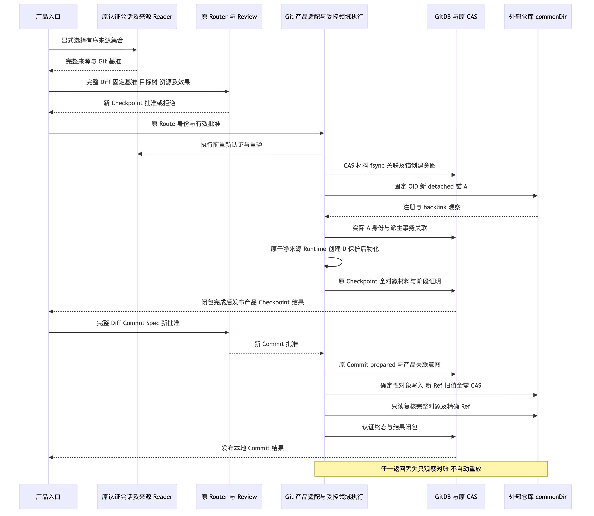
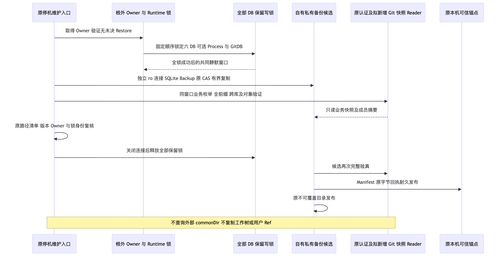
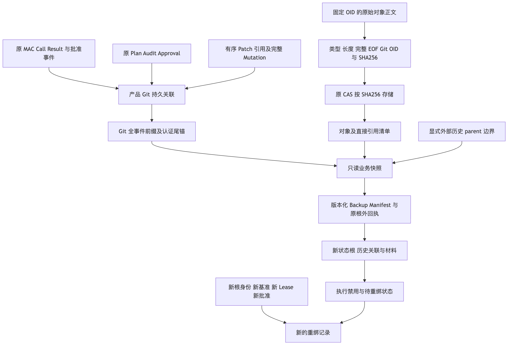

# Git产品交付、业务备份与恢复重绑设计评审

## 1. 交付与实施边界

[完整总体与详细设计草案](../../changes/m09-r4-git-delivery-business-backup-closure.md)
包含需求背景、设计目标、真实源码边界、类与接口、重点字段、业务伪代码、架构/流程/执行与备份时序/
数据流、认证持久化、取消与恢复、安全、部署兼容、容量、24项业务验收矩阵及分步落地。

**本包只交付源码研究与设计评审，不交付Git产品写能力或新的备份格式实现。**
草案仍为draft；历史备份范围与新对象容量合同须明确冻结后方可进入相关实现。
持续多Patch、Checkpoint、本地Commit、完整独立批准及安全恢复范围不缩减。

## 2. 评审发现与方案修正

- 原干净来源接口同时要求干净Git状态和事务Snapshot的真实RootIdentity；不得把用户已发布Patch事务
  直接交给另一私有镜像。计划采用新干净锚、新真实派生事务和持久批准桥接，旧调用与原归属保留。
- 现有Git Store只读模式仅复用原领域读取，不含新MAC、完整事件前缀、对象或跨库验证。计划能力另行
  版本化，不能凭只读构造器通过宣称完整业务备份成立。
- 当前领域固定Runner仍使用同步subprocess.run、单命令超时及退出后长度检查，不具备产品取消和原生
  进程树监督合同。首次产品写接线必须引入受控IO适配与对应失败回归，不能只套工作线程。
- 原备份已有共同静默Owner与全部数据库保留写锁。拟新增GitDB须参与同一窗口，不以多个ro查询冒充
  跨库原子视图，不将外部注册目录或用户Ref复制进状态备份。
- 恢复只恢复完整业务事实及有界材料，旧根/注册/批准保留为历史；新根必须重新验证、批准并创建新绑定，
  不自动修复backlink、不回退用户分支、不联网补对象。

以上均为设计约束与发现，不是已完成的产品特性。新计划接口名称明确标为拟新增，实际代码只链接既存入口。

## 3. 实际设计图

五幅图均为计划架构，不表示当前产品已经装配。Mermaid原文件与实际PNG逐字节绑定，已逐幅视觉检查。

## 4. 验证与决策边界

初始文档检查缺少需求背景、设计目标和可观测性规范章节，原FAIL保留。
修正标题并补齐真实错误分类/低敏诊断后，原文档策略检查通过，未修改策略。
正式结果与原件摘要见[验证记录](verification.json)、[评审清单](review-packet.json)、
[事实](facts.json)及[Manifest](manifest.json)。

本阶段无生产代码修改、数据库迁移、真实模型请求或凭据读取；原预算与历史R3成绩不变。
不能从文档治理或图形通过推出Git接线、真实编码质量、Windows11消费者验收、独立Beta或商用发布。

## 7. 受控IO实施状态增补

完整业务草案第15节增补了[内部受控IO实现与验证](../git-supervised-io-2026-10-01-v1/README.md)。
原五幅计划图和完整Git业务合同保持不变，仍不表示默认产品写能力或Backup v2已完成。
本包原治理、渲染及Secret统计属于初始设计版本，不追溯为新增IO代码的验证。
Facts分别保留原设计SHA和当前增补正文SHA；新IO验证与新代码候选绑定由独立完整交付包承担。

## 8. 完整目标树与Diff内容实施状态增补

草案第15节现已区分原完整树规划与[同源Diff内容实现](../git-tree-diff-2026-10-01-v1/README.md)。
原五幅图仍表示计划架构；新内容事实不代表认证目录、新批准、默认Checkpoint／Commit或Backup v2已实现。
原设计与前次增补SHA和审查范围保留；当前正文SHA仅绑定本次状态同步，不追溯为原设计验收。
新生产候选、两门面兼容及原八项失败的修复证据由新的独立交付包承担。
