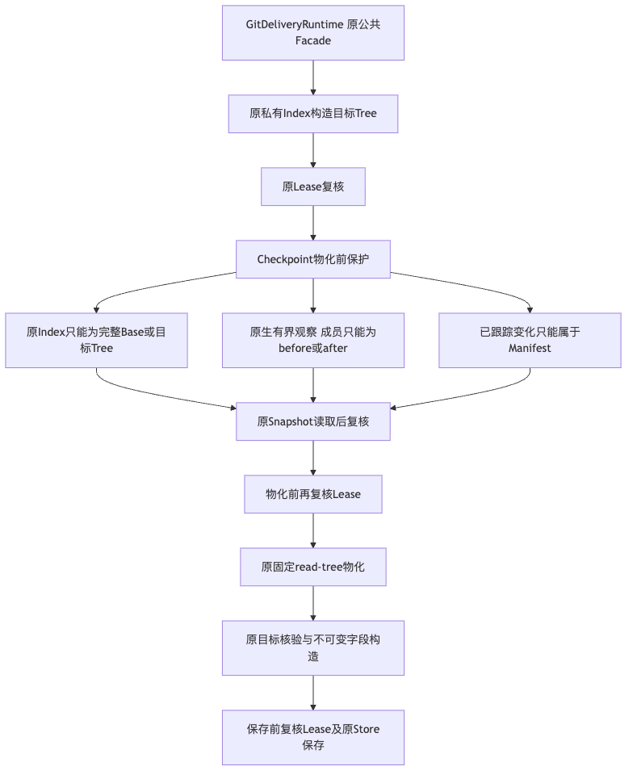
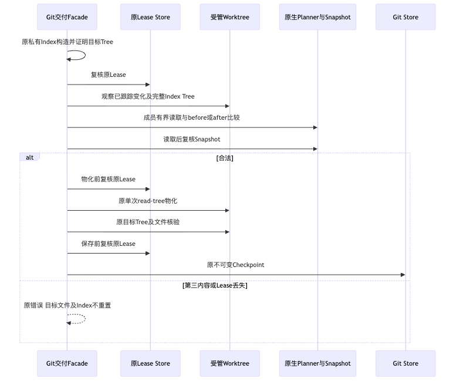

# Git Checkpoint物化前来源与Lease保护验证报告

## 1. 背景、目标与有限结论

原Git Checkpoint只绑定Worktree身份和HEAD，随后固定`read-tree --reset -u`覆盖用户后续改动；
Lease入口核验后失效也未阻止物化。真实Git、原SQLite与Lease复现六项原失败。
候选物化前要求已跟踪变化只属于Manifest、Index为完整Base/目标Tree、成员属于before/after镜像，
并在保护、物化和保存前复核原Lease；第三内容拒绝且保留原文件与Index。

**本地有限组件保护GO；原生新候选、正式产品交付接线及商用1.0仍未验收。**
不改变原Scope、Schema、公共签名、原Source HEAD/Index或批准权；无模型调用、Docker或远程操作。
真实质量、费用未知预留、Windows11消费者环境及独立Beta保持开放。

## 2. 总体与详细设计、源码阅读

[完整设计](../../changes/m09-r4-git-checkpoint-source-guard.md)覆盖背景、目标、架构、时序、数据流、
接口、字段、伪代码、持久化、失败恢复、取消/超时、安全、部署、回退和取舍。

[`git.py`](../../../src/harnessix/delivery/git.py)保留Facade与执行责任，
[`git_checkpoint.py`](../../../src/harnessix/delivery/git_checkpoint.py)仅拥有保护与原不可变字段构造。
原[`Planner`](../../../src/harnessix/delivery/planner.py)与
[`Snapshot`](../../../src/harnessix/workspace/snapshot.py)提供有界原生读取和漂移核验，
原[`Git Store`](../../../src/harnessix/delivery/git_store.py)持久化同一合同。
公共方法参数与返回合同AST相等，原字段构造只移动，不改摘要算法。

## 3. 真实测试与原件

- 原六项焦点：**6失败、0跳过/错误**，5.241秒；不造假Git返回。
- 初修焦点含原Git回归18项通过；扩展合法镜像、保存失败重建及实现摘要后，
  最终Delivery与Lease关联**128通过、23原生Windows跳过、0失败/错误**，32.100秒。
- 新九项位于最终关联中，不与重叠焦点、原失败、治理或其他候选相加。
- 两幅新图与一幅变化模块图实际Mermaid渲染，新PNG已检查；全库图仅结构检查。

第三内容验证覆盖计划内modify/delete/create及计划外跟踪文件的未暂存/已暂存修改。
拒绝后文件字节、Index Tree和Status保持，Source仍干净、HEAD不变、无新Checkpoint。
合法用例保留无关未跟踪文件；物化后保存失败可用原目标Tree重建、后继返回同一Checkpoint。
保护模块源码变化必须改变Git实现摘要，不能从Binding证明中漏掉新保护模块。

## 4. 治理、兼容及风险

初修大文件/类继续增长和新增超长方法被原策略拒绝；后继提取唯一职责模块，
原文件1041行降至1023行，原类767行降至748行，仅刷新实际观察报告，不放宽治理策略。
原Schema、锁、依赖、Source与Store保持；固定新Wheel必须包含保护模块。
完整治理302项通过、零跳过/失败/错误；Ruff、Mypy、原可读性策略、冻结合同和文档门禁通过。
实际内部`1.0.0rc1` Wheel已离线构建，两变化生产成员与受测源码一致，仓库及Wheel完整Secret扫描零命中。
不以构建、扫描或本地跳过替代安装及原生运行验收。
公共字段、测试原件和源码字节以[事实](facts.json)为准。

保护与Lease复核不是OS原子事务，末次观察到物化之间仍有外部编辑窗口；
命令期间Lease到期或物化后保存失败不能自动回退已经发生的效果。
原固定命令期限、取消机制和未知效果边界不扩大。
Git Object Database可能已写入不可达Blob/Tree，不宣称完全没有存储副作用。

## 5. Review Packet、完整性与后续验收

[Verification](verification.json)、[Review Packet](review-packet.json)、[Manifest](manifest.json)
区分组件结果、受测字节、未完成平台/产品验收和文件完整性。
新用例进入原Windows Git焦点，原三分钟保护和60秒堆栈观察保留，新候选结果必须独立取得。

正式任务工作区和现有每Transaction交付Worktree生命周期不同，不能直接把后者当作默认Agent工作区。
协议、Thread来源绑定、审批、恢复及完整备份布局仍须正式产品接线；本报告不关闭R1/R4或1.0门禁。
