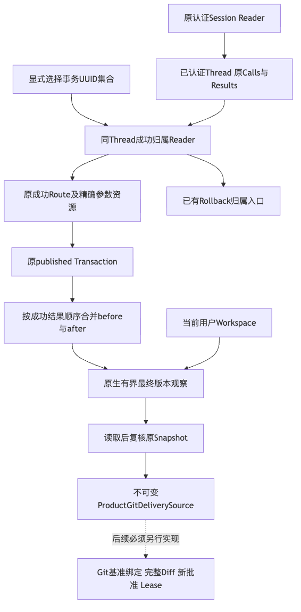
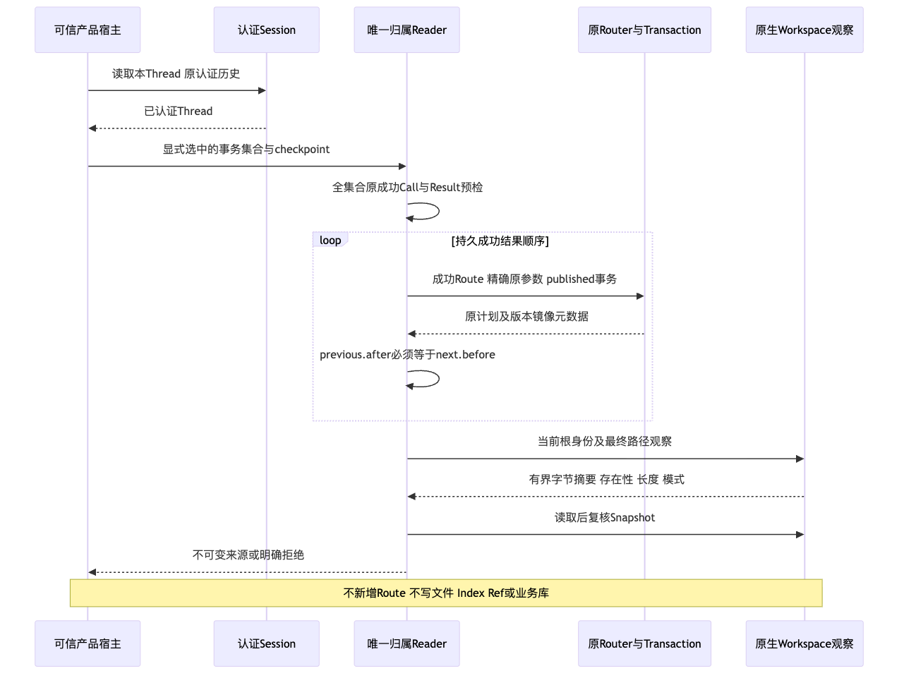

# 产品Git交付来源前置切片验证报告

## 1. 总体结论与需求背景

默认产品成功Patch先修改用户Workspace，原Git宿主组件要求干净来源与修改前Snapshot；
直接套用该组件会拒绝，不能用放宽来源保护来解决。
连续多次Patch还需要保留首次before、最终after并验证中间镜像连续。

**只读来源前置切片本地及隔离Wheel专项GO，R4及1.0商用发布NO-GO。**
已实现同认证Thread成功Patch归属、全集合预检、连续修改链和完整当前版本观察，回滚共用唯一Reader。
没有注册新的Commit/Checkpoint Tool，也没有使原Git组件接受脏来源。
内部版本仍为`1.0.0rc1`；元数据Revision是设计父基线，实际受测文件Hash和新Wheel身份见
[facts.json](facts.json)，不继承父提交或旧Wheel的CI结果。

本目录包含本报告、[结构化事实](facts.json)、[验证断言](verification.json)、
[Review Packet](review-packet.json)、[原字节清单](manifest.json)和两幅实际渲染图。
原始日志/XML及子进程导入路径核验保存在本机私有验证目录；公开材料仅保留文件名、Hash、数量和耗时，
不复制主机名、个人路径、模型正文或凭据。

## 2. 总体架构、模块边界与源码映射

实线是当前实现，虚线是未接入的后续Git交付。
[`完整总体与详细设计`](../../changes/m09-r4-product-git-delivery-source.md)覆盖需求、选型与取舍、
流程、时序、数据结构、接口字段、伪代码、异常、安全、恢复、部署及后续依赖。

| 源码 | 当前职责 |
|---|---|
| [`workspace_patch_source.py`](../../../src/harnessix/product_config/workspace_patch_source.py) | 本Thread原成功Call/Result配对及稳定身份，核对原成功Route和published事务，不读Blob |
| [`workspace_patch_source_contracts.py`](../../../src/harnessix/product_config/workspace_patch_source_contracts.py) | 原调用引用、当前Snapshot、净变化和规范Digest的严格冻结合同 |
| [`git_delivery_source.py`](../../../src/harnessix/product_config/git_delivery_source.py) | 整个选择集合归属预检、连续链、当前根和文件完整最终版本核验 |
| [`workspace_rollback.py`](../../../src/harnessix/product_config/workspace_rollback.py) | 原回滚入口委托共用Reader，保留原错误映射与新Review/批准 |
| [`原Git组件`](../../../src/harnessix/delivery/git.py) | 未修改；仍按原干净来源、受管Worktree、Checkpoint和Commit合同运行 |

来源Digest不是MAC，不验证任意外部构造Thread，不替代原Session认证、新Approval、Lease或Git基准。
旧Schema、Config、工具广告、事务执行器、六库备份布局、依赖和预算保护不变。
仅新增[内部来源Schema](../../../spec/product-git-delivery-source-v1.schema.json)，原生成门禁核对正式模型。

## 3. 真实执行时序、数据流与持久化

1. 真实产品Patch经Gateway、新Diff和批准完成替换、创建与删除；原SQLite持久记录成功效果。
2. 显式UUID集合先在本Thread自己的Turn中预检，Fork继承项目不构成归属。
3. 全集合通过后，读取原Route与Transaction；不是只信模型返回的UUID或Session摘要。
4. 输出按成功Result持久顺序合并；选择参数重排不改变结果，少选中间同路径修改拒绝。
5. 原生根身份在读取成员前核验；当前存在性、SHA、长度和模式必须等于最终after。
6. 全部读取后复核Snapshot；净零路径同样先核验，再从净变化中移除。
7. 默认SDK专项从原MAC Session Reader取得Thread，重开产品后来源逐字段相同，原Key不变，
   没有追加模型请求，也没有创建隐藏Git业务目录。

来源函数不新增Route、Transaction、Blob，不修改文件、Index、HEAD或Ref。
真实Git专项先在隔离夹具创建基准仓库，再完成产品Patch，证明来源可投影而原Git规划仍以
`delivery_dirty_conflict`拒绝；投影前后实际HEAD、Index Tree和脏状态逐字相等。
测试夹具的Git初始化/基准Commit不计为来源函数副作用，也不计为产品Commit入口。

## 4. 失败、取消、期限与安全负对照

- 未知、其他Thread和Fork来源在Route、Transaction及Blob读取前拒绝；混合有效和未知集合也整体先拒绝。
- 原Call或Result未完成、Result非成功、Effect未知/错指纹、Route未知或事务非published不能派生来源。
- 连续链缺中间修改、第三内容、创建/删除状态漂移、POSIX模式变化、Workspace根替换均保留现场。
- 无关用户文件正文不读取、不导出；净零路径被后续修改也拒绝，全部净零不制造空Commit。
- 入口和读取后的真实取消令牌、原期限检查均传播，不返回旧来源、不追加业务写入。
- 读取期间发生变化由原Snapshot复核拒绝，不将刚读到的旧字节作为成功当前版本。
- 合同拒绝伪Digest；即使重算Digest，最终版本和Snapshot不一致仍拒绝。
- 容量护栏负对照使用明确标注的合成元数据，验证255路径和32 MiB边界，
  不宣称该元数据具有认证授权或实际大文件容量验收。

同步有界IO只在阶段和成员边界协作检查，不宣称跨文件原子锁、立即中断内核IO、断电证明或同UID敌对宿主隔离。
原回滚默认SDK等待/重开、六库完整备份恢复及两处进程硬退出继续回归；没有新增恢复续写捷径。

## 5. 测试验证与受测身份

| 验证集合 | 实际结果 | 边界 |
|---|---|---|
| 原回滚/Git组件基线 | 46通过 | 修改前实际基线 |
| 来源、认证SDK、原回滚、Schema焦点 | 62通过 | 包含35个新增来源用例；不是质量Suite |
| 产品、Delivery、Trusted Action、Workspace、Agent、Session、App Server关联 | 2089通过，56跳过 | 2145收集；不等于全仓功能回归 |
| 原Protocol独立回归 | 32通过 | 实际SDK用例位于App Server与产品测试，不存在独立tests/sdk目录 |
| 隔离安装包来源及原回滚专项 | 60通过 | 实际导入安装包，夹具来自受管源码树 |
| 最终完整治理 | 302通过 | 固定Git 2.53.0，不等待整轮CI |

以上集合有重叠，不相加为覆盖数量。Ruff检查通过、904文件格式符合；mypy检查402源码文件通过。
可读性只同步实际观测报告，原策略及阈值不变；文档408份、10262链接、879结构Mermaid、26源码包、
26改变路径零发现，变化文档Mermaid实际渲染通过。受管源码、staged新文件及实际Wheel合计3671扫描输入零命中。
完整治理、Lint、类型、文档、可读性、发行扫描结果及最终清单记录在facts。
关联校验、隔离Wheel安装、图渲染和治理准备独立并行；同一源码文件修改串行合并。
新增两份来源专项进入原Windows焦点，保留原选择器及三分钟期限；未取得当前候选原生结果前不标记Windows完成。

新Wheel全部443个包成员与源码及隔离安装文件逐字相等，实际包版本`1.0.0rc1`。
依赖来自原锁的已裁剪测试输入，按Hash离线安装；不修改uv.lock、生产依赖或原已接受安装环境。
Schema只新增来源合同；旧正式Schema、原Git代码、预算保护、共享编码指令及可读性策略均与父基线字节相同。
新图由Chrome/Mermaid实际渲染并目视复核；既有图不作为新的产品接线完成证明。

## 6. 原失败与后继修复归因

RED是未实现模块导致的收集错误，不伪称原实现的35项业务断言全部失败。
较早专项20项失败来自错误匹配中文异常消息，5项失败来自测试直接修改正式冻结模型；
后继按正式`.code`和不可变副本构造负对照，不放宽业务断言或产品合同。
旧Apple Git的CRLF负对照失败保持原件，正式治理使用固定Git 2.53.0重验，不修改用户全局Git配置。
一次关联命令包含不存在的`tests/sdk`，未执行任何用例；后继使用实际存在的关联目录，另验Protocol。
材料未完整及可读性报告未同步导致的早期治理失败同样保留，后继同步实际观测报告而不提高治理阈值。

真实Provider请求为0。原百炼预算账本SHA仍为原值，未知费用预留没有释放或重置，
旧R3完整0/20、部分Suite失败和取消无报告事实不改写；离线测试不证明模型遵循率或真实编码质量。

## 7. 部署、兼容、后续计划与风险

随唯一产品Wheel安装内部来源模块，没有新的后台服务、公开Tool或SDK执行方法。
既有用户操作仍使用原CLI/TUI/stdio/SDK；当前不能据此操作产品Git Commit/Checkpoint。
实际接线须先完成Git基准与来源匹配、完整状态备份闭合布局，再进入完整Diff、新批准、Lease和对象/Ref CAS。
硬退出、取消、超时、UNKNOWN只对账、跨会话/跨Fork及源码外三平台消费者验证都是必要后继，不延期或删除。

R3新的完整3仓20 Trial、至少12严格成功、每仓成功、零越界，原未决费用核对，
消费者Windows11、独立Beta以及最终同候选R1～R6均开放。该专项完成不等于正式商用发布。
