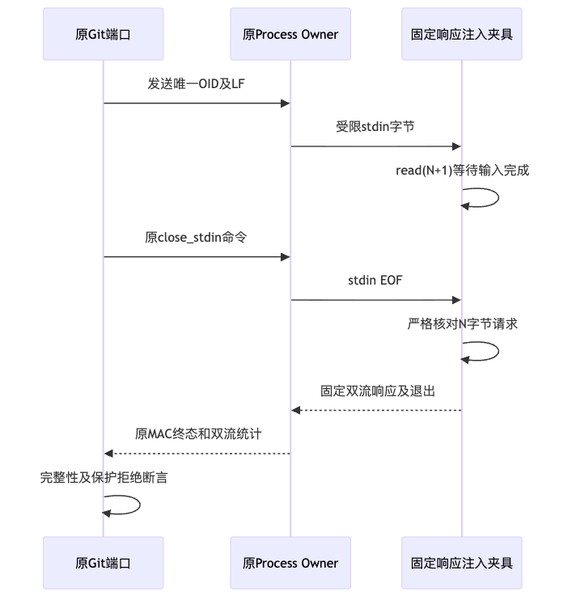

# R4 Git响应注入夹具输入完成验证

## 1. 需求背景、目标与实施边界

固定Windows候选的一个输出保护用例未到达预期拒绝断言，而先触发控制通道拒绝。
必须使异常响应测试真正覆盖输出保护，不得删除强断言、睡眠等待、放宽生产控制权或选择性重试。
本增量仅整改固定测试响应的输入完成合同；原Git生产源码、Owner协议、审批、预算和输出保护均未修改。

总体架构、类/接口、字段、伪代码、正常与失败流程、安全及部署边界见
[完整对象详设第9.1节](../../changes/m09-r4-git-object-material-read.md#91-原生响应注入夹具的输入完成合同)。
研究基线为`c64ebb5`，不是包含整改的候选提交。候选以[事实](facts.json)中的实际测试文件SHA及
940项源码/测试/脚本/配置输入绑定；生产414个Python模块与基线及既有制品逐字节一致。

## 2. 原生失败原件与源码判断

原生作业：[run 36773826616 / job 110086621972](https://github.com/carrie1988/Harnessix/actions/runs/36773826616/job/110086621972)。
其范围为Hosted Windows Server 2025，不是消费者Windows11。

| 原生范围 | 通过 | 失败 | 跳过 | 边界 |
|---|---:|---:|---:|---|
| 原受控Git IO测试文件 | 62 | 0 | 0 | 基础解释器绑定、两个身份负例及旧强PID取消均实际通过 |
| 原材料测试文件 | 208 | 1 | 0 | 209个原案例均实际执行；两类材料取消通过 |
| 失败所在完整步骤 | 588 | 1 | 6 | 包含上述文件，不能重复累加；第8～18步跳过 |

唯一失败为`test_material_stderr_matched_redaction_also_rejects_valid_stdout`，
预期`git_process_output_changed`，实际`process_not_owned`。原日志SHA256：
`20582a3020b32f2533e30c87f3fdec7794036461751a8972155a4cde9950cbb5`。

[`_execute_process`](../../../src/harnessix/product_config/git_delivery_process.py)先发送OID，再关闭stdin；
[`_send_locked`](../../../src/harnessix/processes/supervisor.py)拒绝已终结或缺少控制句柄的发送。
旧夹具直接写输出并退出而不消费输入，源码支持快速退出竞争。
原日志没有异常时Lease/control_fd或具体send/close调用栈，不能排他确认哪个guard分支。
原失败后双流摘要断言尚未执行；该失败不是PID回归或秘密输出泄漏的证明。

## 3. 方案、数据流与覆盖

[`_material_response_program`](../../../tests/product_config/test_git_object_material.py)生成固定程序：
先以`read(N+1)`有界读取，严格核对完整OID与LF，再输出异常batch或保护正文。
SHA1读取上界42字节，SHA256为66字节；正确输入仅41/65字节，须观察EOF才完成短读。
错误OID或额外字节以97退出且不输出正文，原端口接受码仍为0。

图为实际详设中新增时序的渲染结果。EOF是子程序消费输入的事实，不增加控制协议ACK或修改原Owner状态机。
五类异常batch、等字节stderr保护、普通stderr保护和两个stderr容量边界共用该合同。
大stderr仍由子程序固定长度生成，不将1MiB正文展开到argv。测试数据不来自真实用户或模型。

保留209个原案例和原PID/MAC/EOF/长度/SHA/保护断言，新增两个真实Owner错误OID负例。
另新增两个真实Owner终态屏障：先await handle.wait，再发stdin/close_stdin，确定性验证原拒绝、
PID退出及拒绝前后Lease/认证回执不变；这不是原Windows失败的精确调度复现。最终材料专项为213项。
注入程序只证明异常与保护处理，不算真实Git业务成功；原真实Git SHA1/SHA256与8MiB读取案例继续执行。

## 4. 后继本地及源码外验证

| 后继范围 | 通过 | 跳过 | 耗时（秒） |
|---|---:|---:|---:|
| 213材料 + 原62受控IO | 275 | 0 | 35.184 |
| Delivery、Process及四个产品Git文件 | 933 | 41 | 120.877 |
| 源码外Python3.12.7，同两个测试文件 | 275 | 0 | 35.410 |
| 源码外Python3.13.8，同两个测试文件 | 275 | 0 | 33.977 |
| 真实Owner终态屏障专项 | 2 | 0 | 0.420 |

原209个原生材料nodeid均在新213集合中，新增四例独立列于Verification。
中间211材料候选的已完成回归独立保留，不作为新增终态两例的验证。

集合重叠，不相加作为测试总量；Mac平台跳过不作为Windows通过。原选择器未删减。
两个源码外测试目录独立复制本轮测试，以既有实际安装site-packages执行，不从工作树导入生产模块。
复用既有Wheel SHA256：`f3eb5c197a52fbb0eec00b3c2c1dbfd0e0f961d6258294981925618310d755d4`。
其455个包成员分别与两个安装环境相同，414源码模块仍逐字节一致；本增量未重建生产Wheel。

原生失败24份私有证据及manifest保持不变。开发时暂将大stderr展开argv导致两例失败，原件独立保留；
后继恢复子程序生成并取得同集合通过；新增终态回归的首次导入路径错误也保留为开发阶段原件。
这些开发失败不混入生产故障计数，也不替代原生失败证据。
最终治理302项通过，Ruff全源码/测试/脚本、414源码Mypy、原可读性策略和规范合同均通过。
文档434份、10,723个链接、921个Mermaid块无问题，新增时序图实际渲染并视觉核对。
全部新公开文件暂存后连同既有实际Wheel扫描3,868个输入零命中；940项验证输入前后完全一致。
两个独立静态审查均无阻塞，审查与运行证据分开，不当作原生通过。
最终静态检查、治理、输入前后复核与公开成员摘要见[Verification](verification.json)和[Manifest](manifest.json)。

## 5. 审查、持久化、安全与发布边界

[Review Packet](review-packet.json)区分本地通过、旧原生失败和新原生待验。
公开包不复制Owner回执正文、进程输出、测试工作区、凭据或个人环境路径。
完整原件保存在私有目录，目录0700、文件0600；旧证据不覆盖。
无生产数据库格式、Key、Provider请求、费用账本、默认产品目录、安装依赖或界面改变。

新候选需单独取得原生结果，不等待或重跑覆盖旧作业。消费者Windows11、8MiB受信写入、
对象CAS/认证账本、完整产品Commit/Checkpoint与备份恢复、R3真实20 Trial及独立Beta仍未完成。
此增量不关闭R1/R3/R4或商用1.0，也不降低原完整Git业务目标。
