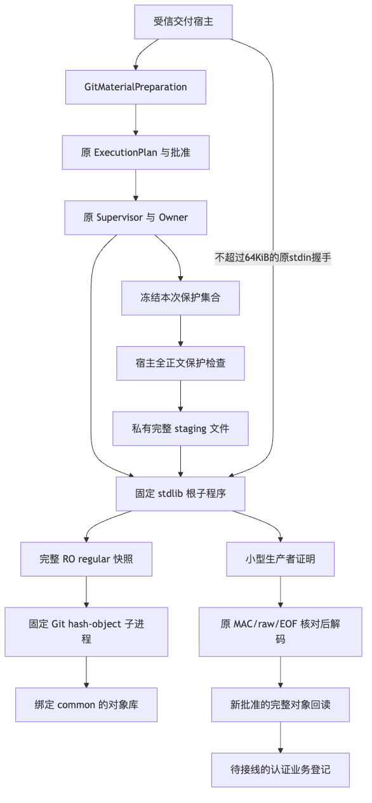
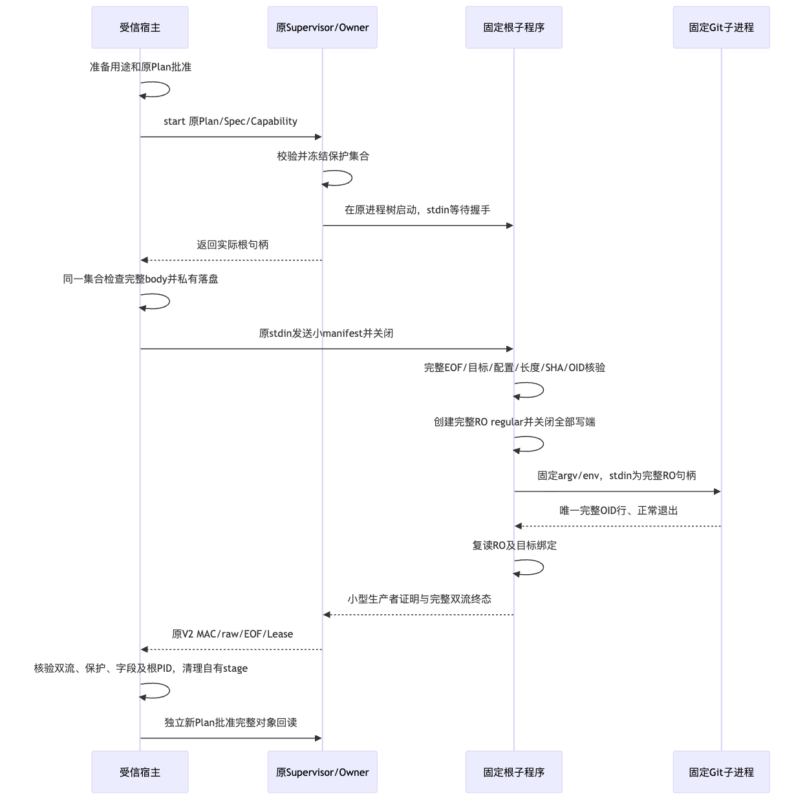
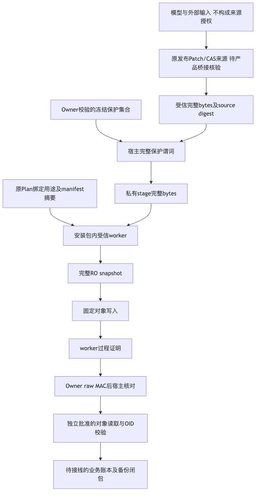

# 固定 Git 对象完整输入候选验证包

## 1. 候选状态与结论边界

本包记录C0完整受信对象输入的固定字节验证，结论为 **macOS内部能力通过，原生与整体发布门禁仍开放**。
前置修订 `1502bd19f5f738515ee7f27e6bcfa3ce1e19daf0` 是研究与比较基线，不冒充新增实现提交。
四个stdlib生产者模块保持已核对的固定字节；宿主已修复整个Supervisor退出及清理异常的强错误优先级。
1232件源码/测试/脚本/配置输入按完整路径、长度及SHA冻结，复验前后相同；
包含本包的Git树须与清单逐字节相同，不用父提交代替实际输入身份。

本包不关闭R1/R4，不批准商用发布，不新增默认Git Tool，不证明完整业务交付或Backup v2。
没有本候选Windows原生执行证据；单机跳过、源码检查和API依据不能替代原生验收。
总体设计、接口、字段、三图和失败恢复详见[正式详设](../../changes/m09-r4-git-object-material-input.md)。
低敏输入见[Facts](facts.json)，实际结果及旧失败见[Verification](verification.json)，
逐项审查见[Review Packet](review-packet.json)，公开资产完整性见[Manifest](manifest.json)。
单独的测试通过数量不能作为产品发布结论。

## 2. 需求与有限实现范围

原 Process 控制输入和普通 Git 双流额度保持 1MiB。大材料不进入该通用输入，不允许截断后供给 Git。
固定输入能力支持 blob/tree/commit、SHA1/SHA256，以及每对象完整 8MiB；不接受 tag 或 `--literally`。
tree/commit 的实际格式仍由固定 Git 校验，不能以 blob 成功代替其他类型验证。

本能力只提供内部受控对象写入准备、执行和生产者证明，不自动授权 Ref/Commit/Push。
来源摘要必须来自受信宿主，接口调用本身不证明已完成 Patch/CAS 来源归属或业务登记。
对象可能在返回失败前已经写入；业务后置条件必须通过新批准的完整对象读取独立判断。

## 3. 实际调用链与证明职责

1. [宿主准备适配层](../../../src/harnessix/product_config/git_material_process.py)绑定原仓库实体、
   common/objects、Git 程序、解释器、完整材料摘要、类型、预期对象标识、用途和同一绝对期限。
2. [原 Git 端口](../../../src/harnessix/product_config/git_delivery_process.py)复用 ExecutionPlan、批准、
   原 Supervisor、进程约束及终态结算，不新增第二个执行入口或 Owner 协议。
3. 原 Owner 在真实启动前严格校验并冻结本次保护集合。宿主复用同一集合检查完整材料，
   未命中才建立私有 stage；命中时不发送握手，不启动内部 Git。
4. 根子程序的普通 pipe stdin 只接收不超过64KiB的 canonical manifest，并必须观察完整 EOF。
   [输入合同](../../../src/harnessix/delivery/git_material_input_contracts.py)拒绝额外字段、非规范 JSON 和绑定漂移。
5. [本地材料层](../../../src/harnessix/delivery/git_material_native.py)完整核验 stage、实体目标、控制文件、
   长度、SHA 和对象标识；在 Git 前写满、同步、关闭全部写端并复读完整只读普通文件快照。
6. [固定子程序](../../../src/harnessix/delivery/git_material_worker.py)仅启动唯一固定 Git 子进程：
   `hash-object --no-filters -t <blob|tree|commit> -w --stdin`。Git stdin 来自完整只读普通文件，
   不使用材料供给管道，不新建 session/group，不 breakaway，不重试，不自动补取对象。
7. 小型生产者证明经原认证原始流、完整双流 EOF、长度与 SHA 核验后解码，
   根进程身份与原 Lease 严格核对。证明认证的是受信子程序陈述，不声称 Owner 直接观察了内部 Git 输入。

保护集合不进入 manifest 或证明。子程序通过完整 SHA 相等及安装实现绑定继承宿主已成立的保护谓词，
不能把过滤后的输出、进程正常退出或过程证明当作完整业务交付。
同一操作的绝对单调期限贯穿各阶段；外层 Owner 的实际期限可更严格，不宣称两个期限数值相同。

## 4. 容量、目标与快照边界

| 合同 | 固定边界 |
|---|---|
| 对象材料 | 0～8,388,608字节；三类型、两格式；超限拒绝 |
| 小握手 | 不超过65,536字节；唯一规范 manifest、真实 EOF |
| 生产者证明 | 不超过4,096字节；严格字段与原请求一致 |
| 普通输入/普通双流 | 原1,048,576字节限额保持 |
| 控制文件 | 最多8件，每件最多1,048,576字节；内容不进入 manifest |
| 目标命名空间 | common/objects、已有 fanout/info/pack、控制文件和程序实体绑定；拒绝链接、重解析点、alternates 和外部配置 |
| 配置解释 | 引号外 `#`/`;` 才是注释；引号内字符不能剥除后冒充对象格式；非法引号、禁止配置和兼容格式仍拒绝 |

POSIX 从首次写入材料前去名，持有只读端；排他创建空名称至去名之间仍有短窗口，
不宣称该窗口具备原子匿名创建保证。Windows 从 `CREATE_NEW` 使用删除关闭标志，
写满后降权复制只读句柄，不按路径重开快照。
[Windows 本地层](../../../src/harnessix/delivery/git_material_native_windows.py)的保护句柄请求真实数据读取，
目录对应 `LIST_DIRECTORY`，并仅共享读；属性读取句柄不能代替此保护。

这些检查不是抵御任意同用户外部破坏的操作系统不可变封印。Windows 根目录权限、内部 Git 写入与
持有保护句柄的兼容性，仍须在本候选原生环境实际验证。
宿主硬崩溃后的 stage 耐久归属、扫描和恢复尚不构成完整业务阶段闭包。

## 5. 固定候选结果与输入关联

以下结果来自外层退出修复后的实际JUnit原件，摘要与完整输入清单在JSON中记录：

| 范围 | 总数 | 通过 | 失败/错误 | 跳过 | 秒 |
|---|---:|---:|---:|---:|---:|
| Delivery、Process及产品Git关联回归 | 1057 | 1014 | 0 | 43 | 165.963 |
| 同一Wheel源码外Python3.12.7焦点 | 358 | 356 | 0 | 2 | 85.541 |
| 同一Wheel源码外Python3.13.8焦点 | 358 | 356 | 0 | 2 | 74.477 |
| 原生产代码控制失联缺陷复现 | 3 | 0 | 3失败 | 0 | 3.103 |

358项焦点包括原IO62、读取213、完整输入47、配置/原生28、快照死亡3、完整退出5项，
也包含在1057项关联集合中；集合不相加。43或2项跳过不是Windows原生通过。
较早1009通过关联结果、351通过安装结果及348项焦点保留为前候选，不套用到最终源码。

实际Wheel的SHA256为 `c645b0b3ba8d6d28485f385d7fe967b1f309c2ad1267468133a08f098fbd91a4`。
460个包成员、419个Python模块与源码及两个实际安装位置全部逐字节相同。
Python3.13环境由缓存依赖离线全新创建；Python3.12使用独立安装环境重装同一Wheel。
这证明本内部切片的安装字节，不等于锁定消费者依赖、完整首次安装或商用R4通过。
当前验证包治理302项全部通过；Ruff、419模块Mypy、合同漂移、原可读性策略及Secret扫描通过。
436份文档、10770链接和924个Mermaid静态块检查零发现；结果另列于[Verification](verification.json)。

## 6. 独立审查与真实缺陷闭环

独立审查发现：manifest可能送达后产生的不确定材料效果，可被外层Supervisor关闭异常覆盖，
并降级为普通取消或超时。真实原Owner控制写OSError回归在原代码取得3失败；
修复后普通错误、调用取消及deadline均保持 `git_material_effect_unknown`。

`input_sent`用途标志现覆盖整个原 `async with`；stage清理位于监督器退出之后。
另两条实际inode替换案例证明：manifest前保持 `git_material_stage_changed`；
真实证明后清理失败仍返回未知效果，陌生文件不删除。
独立复核确认C0-HOST-P2-01静态闭合；同候选关联及两套安装回归均覆盖五个案例。

原关闭故障不消失，不伪造Lease终态；测试独立排空同一真实句柄并核对原MAC、
raw EOF/长度/SHA和根身份。此独立排空不宣称原失联关闭路径成功，
后继业务恢复仍须读取真实过程事实；本包没有证明自动重放曾经发生。

## 7. 原失败保留与分类

| 原记录 | 分类与准确边界 |
|---|---|
| `development/native.xml`：7通过、19失败、2跳过 | 旧模块的16项合法注释误拒、2项非法引号错误接受和1项真实配置写入失败；不是最终冻结回归。两个 Windows 用例跳过不构成原生证据。 |
| `development/first-real-input.log` | 测试断言辅助调用遗漏参数；属于测试接口开发失败，不据此认定对象写入失败。 |
| `development/snapshot-death.log` | 回执校验辅助调用形状错误；不能把未完成断言描述为完整快照死亡验证。 |
| `development/associated-umask077.xml`：783通过、139失败、87错误、43跳过 | 非约定umask环境下的关联失败，逐项原件保留；不统一计为生产缺陷，也不从历史中删除。 |
| `development/governance-apple-git.xml`：301通过、1失败 | 未固定Git环境的治理失败；与固定Git2.53环境分开。 |
| `governance.xml`：301通过、1失败 | 治理可读性基线尚未更新的开发失败；不修改原600/100/20策略获取通过。 |
| `development/documentation.json`：3项发现 | 早期资料引用和候选完整性检查失败；旧检查不覆盖当前包。 |
| 原控制失联复现：3失败 | 普通错误、调用取消和deadline均丢失强错误分类；修复后同候选回归另记，原XML/日志保留。 |
| 首两轮控制失联夹具失败 | 初始启动封套被误当作控制操作帧；未到真实屏障，不冒充生产缺陷复现。 |
| 原 Windows 原生作业：375通过、2失败、6跳过 | 原命令根进程与解释器进程身份合同失败；停止断言已通过，不将其描述为已确认进程泄漏。原作业仍是失败，新候选原生结果未取得。 |

原Windows证据沿用[既有读取验证包](../git-object-material-2026-10-01-v1/README.md)及
[后继输入夹具证据](../git-material-fixture-eof-2026-10-01-v1/README.md)。后者固定`c64ebb5`的
原IO62通过、材料208通过/1失败仍保持原结论；当前输入切片未取得新Windows原生结果。
原失败和后继通过分别保留，修复不能覆盖旧日志或把旧失败改成跳过。
完整真实 Git 写入/新批准回读、固定程序故障注入和仅快照死亡测试应分别说明；
仅快照生命周期测试不执行 Git，不能冒充完整 C0 业务成功。

## 8. 复验环境与部署责任

复验使用私有独立目录，目录权限0700，原日志与XML权限0600；以约定umask022和固定Git2.53 PATH启动。
环境与路径由私有配置提供，不将实际个人目录写入本包。
源码外验收须从新构建的明确 Wheel 正常安装导入，不使用 editable 源码或工作区伪装导入作为替代。
四个生产者模块及两个包入口进入实现摘要；宿主适配层、固定解释器、Git程序和用途批准另行核对。

最终焦点选择器包括六个产品测试文件：完整输入、native配置/分享、快照生命周期、完整监督器退出、
完整对象读取、原受控IO；关联回归再包括 Delivery、Process、Git baseline/source；治理检查当前规范与完整验证包。
安装测试要核对实际模块字节并重新执行对应焦点，不用单独安装成功推导业务通过。
验证不需要模型请求、凭据访问、容器操作或新的费用账本，不触发远程作业。

## 9. 既有图示与公开数据边界

以下三图已实际渲染并视觉检查；架构图采用纵向布局保证可读性。
图示保留内部IO与待接线业务登记边界，不把待实现能力绘制为生产完成。

公开包只含仓库相对路径、源码和制品摘要、固定合同、数量与分类，不含实际材料内容、保护值、
个人绝对目录、原始进程输出、进程标识值或认证标签。私有日志及状态原件不得直接复制进公开包。

## 10. 后续发布条件

1. 本候选Windows原生共享负对照、Root权限、内部Git兼容性和进程树结算须另取证据；
   未取得前保持平台待验收，不关闭R1。
2. 完整来源桥接、业务批准、耐久材料登记、认证业务记录、阶段恢复和Backup v2继续开放，
   内部对象输入通过不得关闭R4或自动开放默认Git Tool。
3. 真实R3质量、消费者Windows11、独立Beta及最终同候选门禁继续分别验收。

本包只给出macOS内部输入切片结论，不缩减完整Git业务或商用1.0目标。
