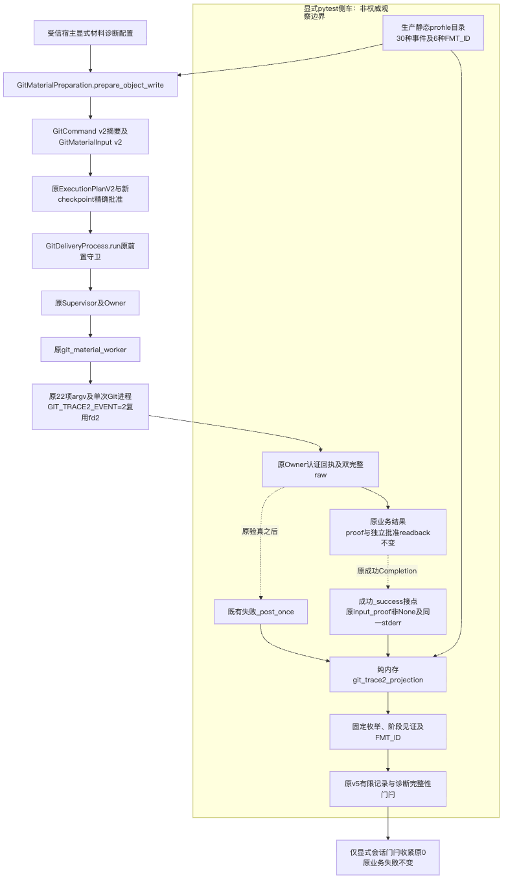
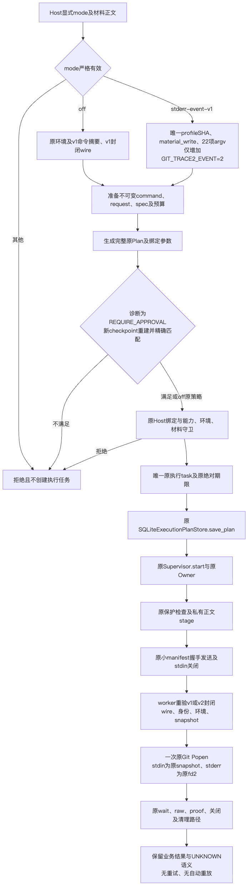
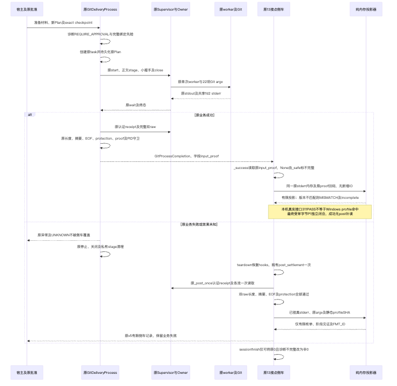
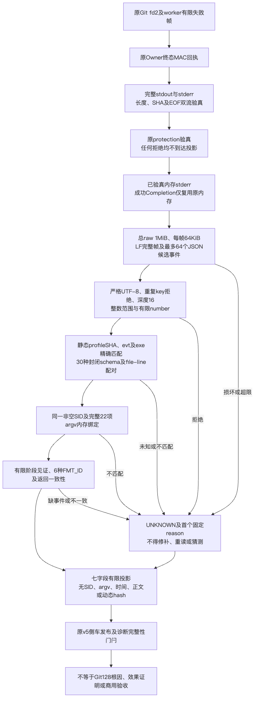

# Windows Git Trace2 生产诊断设计交付包

## 1. 适用范围与状态

[总体与详细设计](../../changes/m09-r4-git-material-trace2.md)描述当前生产材料诊断绑定、强批准、单次原进程、原raw验真以及显式pytest侧车的纯内存有限投影。
生产绑定默认off；解析及发布仍为显式测试侧车，不是默认生产日志服务。

**离线候选；成功接点本地修复已验证；P1在最终受审字节独立闭合。**
当前实际静态目录为30种事件及6种格式，不是31种。来源证明仅对应指定源码格式，不是运行binary attestation。Git128具体根因未知。
本机真实成功接口及投影回归最终311PASS，不等于目标Windows固定profile命中；本机Git2.53的MISMATCH与incomplete属于正确拒绝，不放宽原生KNOWN门槛。

## 2. 文件索引

| 文件 | 内容 |
|---|---|
| [主设计](../../changes/m09-r4-git-material-trace2.md) | 总体与详细设计、接口、字段、批准、持久化、伪代码、异常及部署边界 |
| [facts.json](facts.json) | 当前19件实际输入SHA、profile、来源、只读档案身份、历史失败及状态 |
| [verification.json](verification.json) | 本次实际只读核查、内存合同检查、JUnit重计数与未执行范围 |
| [manifest.json](manifest.json) | 限域输入与交付文件SHA；不包含manifest自身递归摘要 |
| [review-packet.md](review-packet.md) | 评审决策、P1历史、独立闭合、图形验收与剩余业务验收要求 |
| [architecture.mmd](architecture.mmd) | 生产执行与非权威侧车架构 |
| [approval-process.mmd](approval-process.mmd) | 精确批准及单次进程流程 |
| [success-failure-sequence.mmd](success-failure-sequence.mmd) | 原成功/失败时序及无新增成功IO |
| [raw-projection-dataflow.mmd](raw-projection-dataflow.mmd) | 原双raw守卫到有限投影的数据流 |

4件mmd及相邻同名PNG位于本目录根，统一验证已完成Chrome渲染；四图实际视觉复核全部通过；最终TB数据流文字可读、无截断。
4件mmd与主设计图块一致。manifest绑定最终4件mmd、4件PNG、主设计及配套资料的实际字节SHA。初次LR宽图视觉FAIL原件私有保留，不以最终图覆盖历史失败。

## 3. 当前限域输入身份

- 工作树HEAD：`7bbce1033925eaf758e295b3c76fc65dee446f30`，包含未提交候选，不能单凭HEAD识别全部字节。
- 实际输入：19件，包含新增`tests/product_config/test_git_trace2_success_observation.py`；数组内无重复路径。
- 限域输入集SHA256：`7da875ba1e84f97d9647b5d0bd3be2cbb826088692e5640c4ec92fe4647a1d07`。
- 规范profile SHA256：`7120ca7cc6d73275bd29980b3b7f66be5ff0608d02ec1b241b86505677ea6e48`。
- probe当前590行，原600行策略不变。

输入集不涵盖全仓、完整依赖、安装包或原生checkout。SHA算法是source_inputs数组排序键、紧凑分隔符、ASCII编码及末尾LF后的SHA256；facts与manifest分别提供同一数组和身份。

## 4. 已有档案证据与失败保留

原私有档案不复制；按档案目录名、成员名及facts中的原字节SHA定位，公开资料不保存个人路径或原stderr正文。

| 档案 | 成员及范围 |
|---|---|
| `windows-git-trace2-binding-20261001-v1` | REPORT/SUMMARY/interface-final、196PASS、原mode两例2PASS、off环境AST及限域AST证明；mypy7源码、ruff/format11文件，仅本地 |
| `windows-git-trace2-projection-20261001-v1` | 原310PASS属于历史；RED、导入/helper碰撞及中间失败保留；real-completion-red为2FAIL，green为310PASS/1FAIL，confirmed为311PASS |
| `windows-git-trace2-peer-review-20261002-v1` | 原`completed_with_one_reproduced_open_P1`、T2-PEER-01及1RED保留，不改写为无发现 |
| `windows-git-trace2-peer-closure-20261002-v1` | 最终`P1_resolved_at_final_reviewed_bytes`；569PASS；原件及全部失败保留 |

196PASS为74新增和122旧项；twoexplicit为原例新mode重执行，不额外计为新增唯一测试。
旧310PASS不能作为当前真实成功接口全覆盖证明；confirmed 311PASS中新增真实接口1例，仍不证明完整v5原生两selector载体通过。
独立闭环按20件输入（本包19件代码/测试/工作流加原共享pyproject配置）终结，最终身份`a965313ab1cf1ce8b973e04e6419c4eafe3ef1834117848e2393fa8181cd0d6c`。本包19件SHA逐件一致，不宣称全仓；569PASS不与其他批次累加。
原Windows Run36862927636、054deb67、attempt1、0PASS/2FAIL、Git128/worker2/proof absent/readback未到达保持FAIL；没有新WindowsRun或新CI。

关联整合组`focused-v2.xml`已终结：179文件、5186案例，5129PASS/57SKIP/0FAIL，pytest退出0；432源码＋179测试输入零漂移。
该记录为related验证，不计作Trace2独有覆盖，不等于全仓/原生/商业GO。原初次2FAIL及2项control PASS保留，最终仅修正PYTHONPATH执行环境，不改源码或断言。

## 5. 本次执行验证与限制

本次只核对当前源、归档字节、JUnit计数、静态字段/调用顺序与有限投影内存规则。具体执行结果以verification.json为准；没有重新运行pytest、mypy、ruff或业务命令。
未修改生产源或测试，不操作Git stage/commit，不访问网络、模型、Docker、钥匙串或CI，不修改其他文档或其他R3资料。

输入复验可在仓库根使用以下只读命令；不会启动Git业务进程：

```bash
PYTHONDONTWRITEBYTECODE=1 .venv/bin/python - <<'CHECK'
import hashlib, json
from pathlib import Path
root = Path.cwd()
facts = json.loads((root / "docs/validation/git-material-trace2-2026-10-02-v1/facts.json").read_bytes())
for item in facts["source_inputs"]:
    assert hashlib.sha256((root / item["path"]).read_bytes()).hexdigest() == item["sha256"]
body = (json.dumps(facts["source_inputs"], sort_keys=True, separators=(",", ":"), ensure_ascii=True) + "\n").encode("ascii")
assert hashlib.sha256(body).hexdigest() == facts["source_scope"]["identity_sha256"]
print("限域输入身份一致")
CHECK
```

## 6. 四图原件与渲染产物

以下PNG由统一验证使用Chrome生成，与相邻mmd原件对应；四图实际视觉复核全部通过；第四图最终为TB，文字可读、无截断。









## 7. 未闭合门槛

目标Windowsprofile兼容与新原生诊断、Git128根因及最小修复仍需独立证据。
Windows/R3/fullCommit/商用R1～R6均保持开放。不得由本地绿色记录、格式来源、单次进程退出或有限阶段见证推断这些门槛已关闭。
