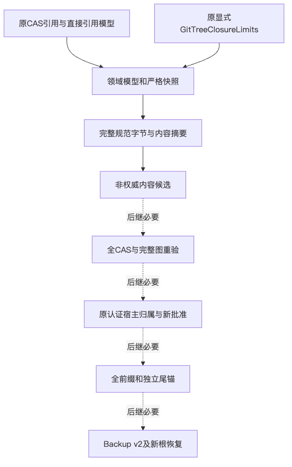
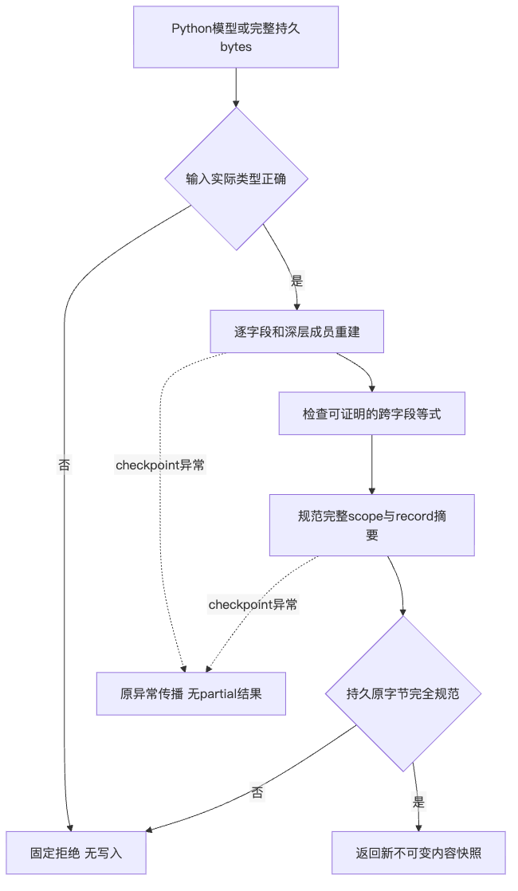
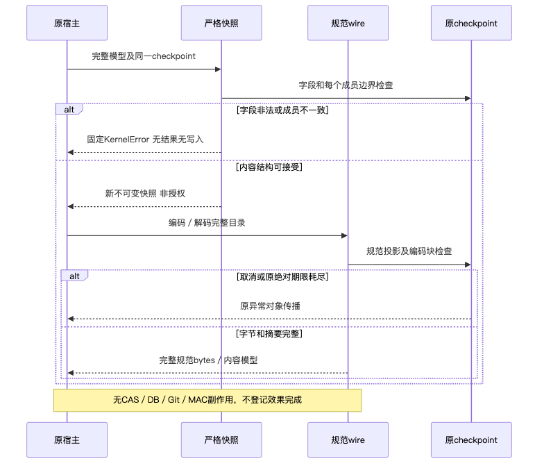
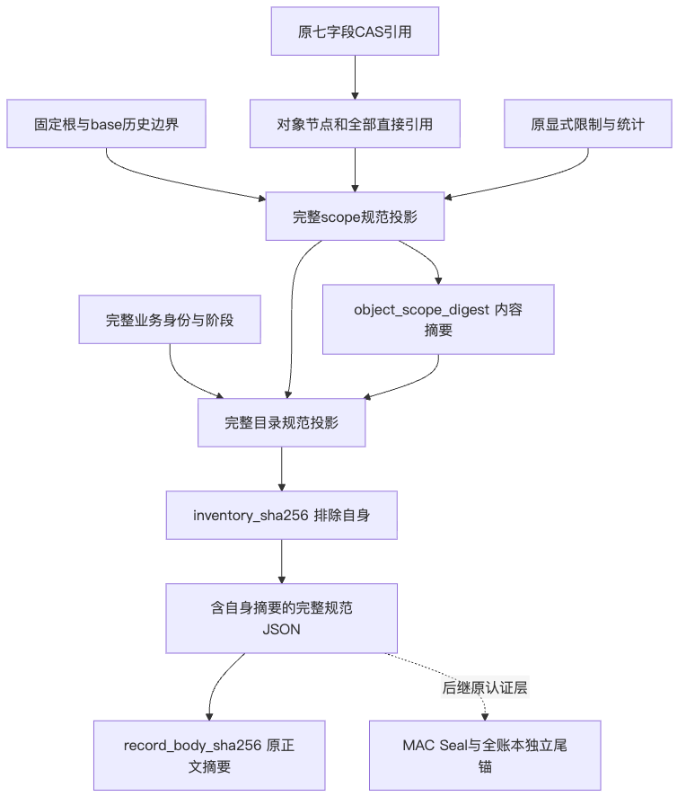

# Git完整对象目录契约：正式验证报告

## 1. 范围、架构与结论边界

[总体与详细设计](../../changes/m09-r4-git-object-inventory-contract.md)提供背景、七模型完整字段、
八接口、声明图闭合、逐路径计数、规范字节、摘要用途及取消／失败伪代码。
增量为两个生产模块和两个测试文件；不修改存量生产文件、SQL、依赖、默认Tool、批准或执行权限。
W0只验证声明元数据及内容身份；未读取CAS、认证账本、真实Owner或Approval。
实际CAS材料、完整权威归属、全账本独立尾锚、完整Review及新批准、Backup v2、新根重授权和默认Commit／Checkpoint
仍按[完整产品设计](../../changes/m09-r4-git-delivery-business-backup-closure.md)实施，不能由本包替代。

## 2. 原缺陷、失败与整改

原缺失模块取得两个导入ERROR，原实现开发过程三项FAIL、限额类型三项FAIL及真实超长JSON整数ValueError均保留。
超长整数转为固定KernelError；不更改全局数字上限，不覆盖回调自身的ValueError／OverflowError／RecursionError或取消。
原实现198项通过；独立原字节契约审查63项通过，未发现指定范围P0／P1／P2，不覆盖实际CAS或业务授权。

原政策仍拒绝三处复杂度热点与delivery到session依赖，共四项FAIL。
按字段、角色、目录和wire标量职责拆分后，两个模块539／318行，原100行／复杂度20门限通过；
七模型、八接口、白名单、64MiB格式、原8MiB单体和显式图limits不变。
原198项与私有63项在整改后合并261项通过，mypy／Ruff／format通过。
这里的63项重跑不是整改后的第二独立审查；各固定身份及实际范围单独登记。

## 3. 源码、完整输入与源码外安装

代码输入复用原1258完整清单、已发布v4三路径差量，再加本次四文件，形成完整1263身份。
逐件核对既有469生产成员及所有代码输入；不以只验新四文件冒充完整输入一致性。
发布快照排除未发布的后继CAS验证器和NTFS观察原型，也不读取主工作区用户未跟踪资料。
新增生产包两成员后为471个实际包文件／430个Python模块。

唯一Wheel由该快照构建。RECORD必须覆盖所有成员，逐件长度／SHA完整并与对应源码一致；
两套全新Python3.12／3.13环境分别安装同一个Wheel，在无src目录的测试输入中运行相关用例。
导入审计必须确认每个harnessix模块都来自安装包，所有471成员和测试输入前后相同；
不能借源码回退、旧环境或旧Wheel形成通过。源码及两套源码外环境各1937项：1914通过、23跳过、零失败。
首轮两个环境各一FAIL；初次仅补部分Schema后仍各一FAIL，全部原日志／XML保留。
缺失来自验证夹具，不是产品缺陷；完整原spec目录259件静态资料逐字节核对后，以原同Wheel再测通过。
只有静态JSON资料进入测试输入，没有src、当前源码导入或测试断言修改。
唯一Wheel SHA256为`1a80f2835f126f4c5f900ded9908fd9fbe95926cfad735d31636dd5aad6015a0`，471个包成员／430个Python模块及RECORD全部核验。

## 4. 四幅真实设计图

四个Mermaid原件与当前详细设计图块逐件相同，真实渲染图及视觉复核分别登记；
图中的后继虚线不表示实际CAS、认证或默认产品已经装配。

## 5. 独立审查、治理与验证方法

Review Packet区分原字节独立审查、职责整改及最终整合审查，绑定各自实际输入，不继承旧结论。
最终独立静态审查确认四文件身份、七模型／八接口、白名单、展开控制流及检查点顺序一致，
未发现该职责整改增量P0／P1／P2。本次审查执行测试数为零，261通过仅引用原整改结果，不冒充新增独立测试。
同发布快照492项治理通过；全430模块mypy、全仓Ruff及1484文件格式检查通过。
原全部18个治理文件、文档、Secret与实际发行物扫描在同发布快照验证；
只允许更新真实新增模块的可读性基线，不放宽复杂度、依赖环、公开面或失败政策。
首轮文档门禁因未同步现行Delivery模块设计而拒绝，原FAIL保留；补齐模型、接口、失败／取消和后继边界后通过。
文档455件／11081链接／957图块检查与实际Wheel在内4069输入Secret零命中均不放宽原政策。
来源、摘要、测试、渲染、Wheel和范围由Facts、Verification、Review Packet及自排除Manifest共同核查。
计数有重叠，不相加宣称全仓／三平台／商用通过；逻辑windows参数不是Windows原生结果。

## 6. 兼容、部署与尚未验证边界

不新增服务、依赖、默认写入或数据库迁移。新模型frozen／slots不等于capability；
PrefixProjection没有MAC，不是独立认证尾锚；声明materials_ready不证明材料已经耐久。
原Windows最低Commit真实FAIL、R3完整20 Trial、消费者环境、独立Beta及最终同候选R1～R6继续开放。
合法64MiB完整目录的容量实测及抢占式取消SLO不由本验证包证明；完整字节上限测试不等于容量承诺。
