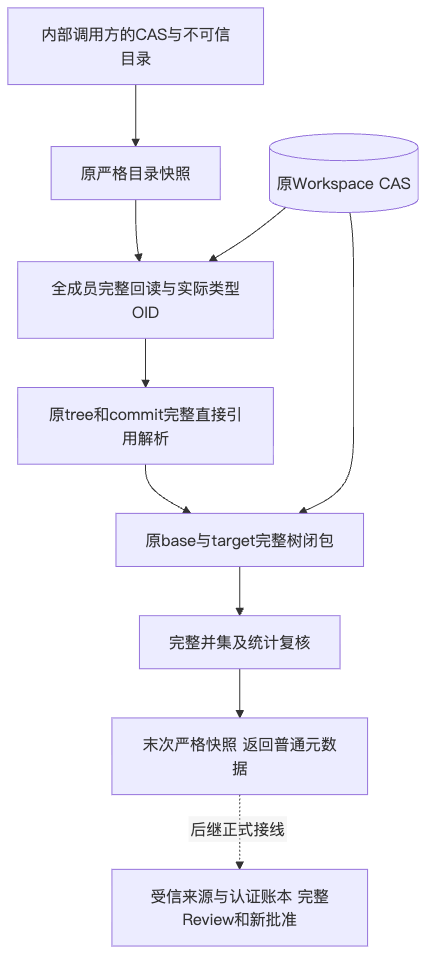
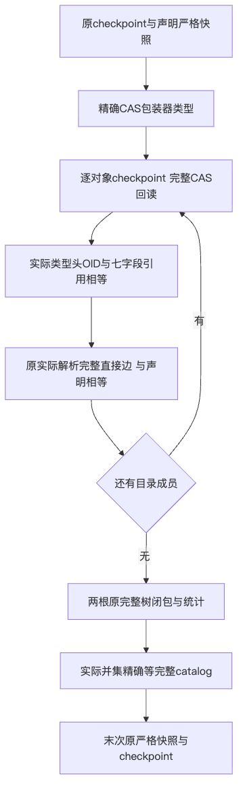
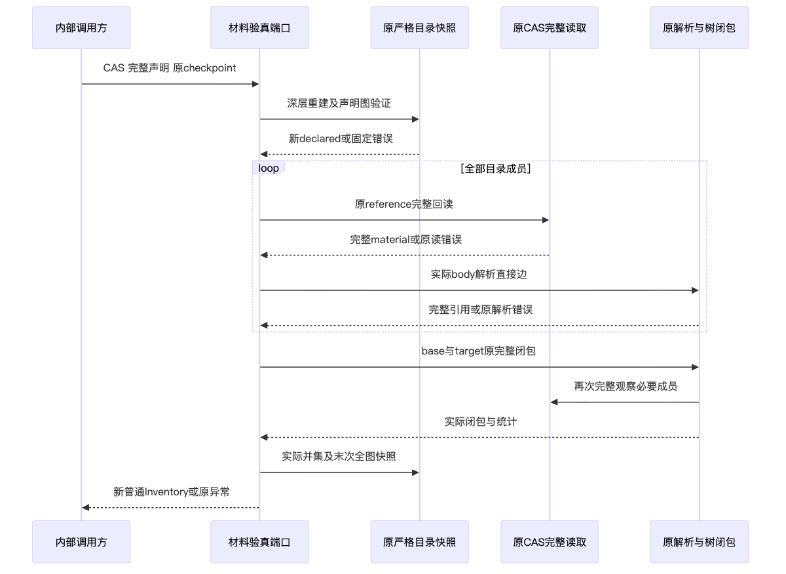
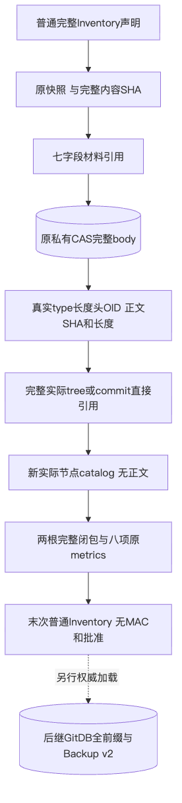

# Git完整对象目录实际材料验真：正式验证报告

## 1. 范围、架构与结论

[总体与详细设计](../../changes/m09-r4-git-object-inventory-materials.md)定义需求、原CAS／解析／闭包复用、
完整接口与字段、四图及文字、伪代码、错误／取消／安全／持久化／部署与测试方案。
新增一个生产模块及两个测试文件，不改旧生产、原工具、公开Schema、数据库、依赖或批准。

实际端口先冻结整个目录声明，再从原CAS完整回读每个成员，重算带真实类型头的Git OID和七字段引用。
原tree／commit解析必须与全部声明直接边相等，原两根完整闭包和commit根并集精确覆盖全catalog。
末次原snapshot重新核对角色、指标和原完整SHA，不修声明、不补历史、不返回部分或截断正文。

**内容验真组件不等于受信来源装载、Store／Key／Owner归属、全认证账本、批准、耐久、效果或完整W1。**
返回的新普通Inventory不是capability；两次原闭包不是跨对象共同原子／静默快照。
完整Git产品及商用R1～R6仍按[产品设计](../../changes/m09-r4-git-delivery-business-backup-closure.md)验收。

## 2. 真实CAS、容量、失败与取消

主测试使用原真实SQLite Store／CAS完成种子持久化，然后调用新只读端口；损坏、缺失及超限在调用前制造。
计数包装器仍执行原read／parse／closure，不以Fake Reader替代真实内容成功证据。
覆盖两格式、两动作、两阶段、两个逻辑路径平台、两类型同正文、共享子树、缺失／损坏、七字段错误、
声明合法但实际tree名称／child／commit tree／有序parent不同、四原limits恰界／超一、
原回调六阶段六异常身份、别名断开及只读Store零SQL／零写。

原主组876项通过，其中新增91项、既有785项；它们不是全仓或原生结果。
后继4项真实完整8MiB tree补验通过：两格式与两路径合同，每个target tree含30841个实际叶路径，
真实body、每条直接边与全目录均经过正式端口；原CAS／DB文件字节与身份保持。
原8MiB blob／commit正例及新增tree都不是长度声明或摘要占位；逻辑Windows参数不是原生Windows。
这些恰界案例不推导产品默认目录容量、全64MiB有效Inventory或抢占式取消SLO。

原新模块缺失取得一次collection ERROR，属于导入RED，不冒称功能边界RED。
开发阶段repr负例误匹配原`max_objects`字段和新增测试复杂度热点均保留原失败及对应输入。
后继只修新增测试的错误预期和职责提取，不降低原业务断言、容量、政策或期限。
容量补验首次Import排序拒绝亦保留，格式整改不改生产内容。

## 3. 完整源码输入、单一Wheel与源码外验证

完整代码输入由[已发布W0目录](../git-object-inventory-contract-2026-10-01-v1/code-inputs-delta.json)
的1263项加本次三文件形成1266项，[本次差量](code-inputs-delta.json)给出新身份和完整清单重建边界。
逐件核对全部原输入及471件既有生产包成员；排除NTFS原型，不读取主工作区用户未跟踪资料。

唯一Wheel含472个实际包文件、431个Python模块、477个ZIP成员；全RECORD覆盖与长度／SHA逐件核验。
全部包成员与测试快照相同，Metadata长描述也与冻结README一致。
真实Wheel SHA256为`5810f911ec234627e04bf7d22c648deef02711e3fcb6de1196bb7ee88735dddb`。
两套全新Python3.12／3.13环境使用原锁定全部依赖离线安装同Wheel，无Editable或源码兜底。
源码外测试输入包含原测试／配置及完整原spec的259件静态资料，没有src目录。

源码和两套源码外环境各2032项：**2009通过、23跳过、零失败／错误**。
每组完整472包文件、1266代码输入或全部测试及静态资料前后核对，每个实际harnessix导入均属于预期包。
三个集合有重叠，不能相加为独立总数；当前范围也不是全仓、原生Windows或商用验收。

## 4. 治理、独立审查及失败保留

全431模块类型检查、全仓Ruff及1488文件格式检查通过；原可读性政策和跨包依赖约束不放宽。
首轮治理492项为491通过、1失败：报告生成加入可选`source_revision`，原逐字基线断言不包含此字段。
重新从相同实际源码生成原格式后492项通过；旧XML／日志／输入证明保留，未改测试、政策或产品。
代码Revision及新增文件SHA继续由完整输入与验证Facts单独绑定，不凭可选字段自证内容。

独立审查实际重跑原289项及77项私有对抗测试，均通过；十二个固定输入前后SHA一致，未发现限定内容范围P0／P1／P2。
首轮私有basetemp父目录缺失及一个role负对照未产生实际变化的验证错误均保留，只修私有验证环境／测试。
新增容量文件未纳入独立审查，四个真实大tree案例另由同候选源码／安装组验证。独立审查不覆盖授权／耐久／原生，
执行集合也不与维护者组相加；实际范围、输入与执行数量分别登记。
文档、Secret和完整发布路径另行核对，只有实际通过后才在Verification登记。
低敏[Facts](facts.json)、[Verification](verification.json)、[Review Packet](review-packet.json)及
[Manifest](manifest.json)绑定实际结果；原私有body、路径、主机标识、模型正文和凭据不进入公开包。

## 5. 四幅实际渲染及视觉检查图

四个Mermaid原件与当前详细设计逐字对应，均已实际渲染并视觉检查；虚线是后继接线，不是已实现授权。
首次渲染因默认Puppeteer Chrome不在缓存中而失败，四份原日志保留；私有配置显式使用已存在浏览器后通过。
没有安装浏览器、修改全局配置或把渲染失败当作设计图已验证。

## 6. 发布及后继验收边界

当前没有新服务、SQL迁移、默认工具或Git效果；同一个原checkpoint、8MiB单体及显式图预算保持。
实际Store装配与生命周期由宿主负责，包装器精确类型不证明归属，也不是同进程隔离。
受信来源装载、GitDB全认证前缀及独立尾锚、完整Review与新批准、A／T／Bridge／D双受管工作树、
默认Commit／Checkpoint、Backup v2及新根新Epoch重授权仍必须完成。
Windows原最低Commit失败、消费者Windows11、完整真实R3 20 Trial、独立Beta和商用1.0仍开放。
